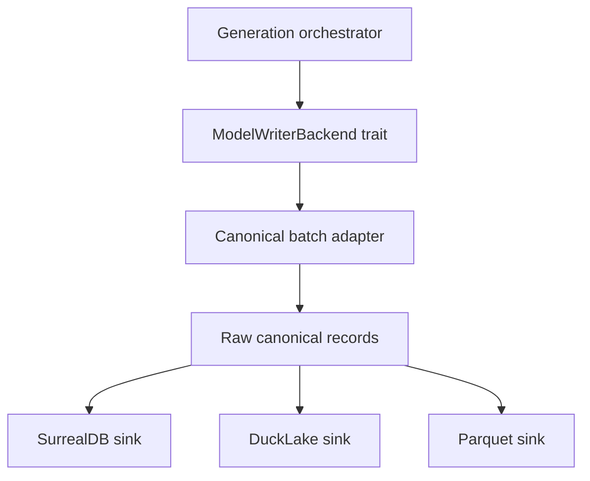

# Writer Architecture

## Current boundary

The current `ModelWriterBackend` trait already separates orchestration from persistence:

- `init`
- `cleanup`
- `write_base_batch`
- `persist_mesh_results`
- `write_inst_relate_aabb`
- `reconcile_missing_neg`
- `run_boolean_bridge`
- `finalize`

Phase 1 should keep this orchestration boundary and add a canonical record boundary beneath it.

## Proposed layers

## Responsibilities

| Layer | Responsibility | Not responsible for |
|---|---|---|
| Orchestrator | Batch order, generation lifecycle, option selection | Backend row layout |
| `ModelWriterBackend` | Storage lifecycle and error boundary | SQL dialect details for every backend |
| Canonical batch adapter | Convert in-memory generation structures into raw canonical records | Persisting records |
| Backend sink | Durable writes, backend transactions, projection refresh | Changing generation semantics |
| Validation CLI | Compare row counts, ids, and joins through SQL | Rust unit/integration tests |

## Backend selection

Phase 1 should support explicit backend selection while preserving current default behavior:

- default: SurrealDB writer
- future: DuckLake writer
- future: Parquet writer
- optional compare mode: write SurrealDB plus candidate backend, then compare via CLI + SQL

## Canonical tables × backend stages

The current `ModelWriterBackend` trait covers eight lifecycle methods. The table below maps every Phase 1 canonical raw table from `02-canonical-schema.md` to the trait stage that owns its persistence, and calls out any table that is still written outside the trait so future backends can close the gap explicitly.

| Canonical raw table | Backend stage | Current source of records | Notes |
|---|---|---|---|
| `raw_inst_info` | `write_base_batch` | `ShapeInstancesData.inst_info_map` | Per-batch streamed through `write_base_batch`. |
| `raw_inst_relate` | `write_base_batch` | `ShapeInstancesData.inst_relate_map` | Same batch as `inst_info`. |
| `raw_inst_geo` | `write_base_batch` + `persist_mesh_results` | `ShapeInstancesData.inst_geos_map` (references), `MeshResult` payload (mesh data) | Geometry references land in base batch; mesh-derived columns are written by `persist_mesh_results`. |
| `raw_geo_relate` | `write_base_batch` | `ShapeInstancesData.inst_geos_map` edges | Edge rows derived from per-instance geometry entries. |
| `raw_neg_relate` | `write_base_batch` + `reconcile_missing_neg_relations` | `ShapeInstancesData.neg_relate_map` (base) + `missing_neg_carriers` (reconcile) | Reconcile stage fills carriers that were unresolved during base writes. |
| `raw_ngmr_relate` | `write_base_batch` | `ShapeInstancesData.ngmr_neg_relate_map` | Always part of base batch. |
| `raw_aabb` (mesh) | `persist_mesh_results` | `mesh_aabb_map` snapshot | Backends serialize the dashmap snapshot inside the stage. |
| `raw_vec3` (mesh pts) | `persist_mesh_results` | `mesh_pts_map` snapshot | Same stage as mesh AABBs. |
| `raw_inst_relate_aabb` | `persist_inst_relate_aabb` | Derived from `ShapeInstancesData` + mesh AABBs | Dedicated stage so backends can skip it via the `skip_inst_relate_aabb` flag. |
| `raw_tubi_info` | _outside trait (Phase 1 gap)_ | `cata_model.rs::gen_cata_geos` direct Surreal writes | Guarded by `enable_surreal_outputs = use_surrealdb && writes_to_surreal()` to preserve drain-only safety. Future work: introduce `persist_tubi_data` on the trait. |
| `raw_tubi_relate` | _outside trait (Phase 1 gap)_ | `cata_model.rs::gen_cata_geos` SurrealQL relate statements | Same guard as `raw_tubi_info`. |
| `raw_aabb` (tubi) | _outside trait (Phase 1 gap)_ | `cata_model.rs` → `save_aabb_to_surreal(tubi_aabb_map)` | Tubi-specific AABBs do not flow through `persist_mesh_results`. |
| `raw_trans` | _outside trait (Phase 1 gap)_ | `cata_model.rs` → `save_transforms_to_surreal(tubi_trans_map)` plus other call sites for instance transforms | Pull into a dedicated `persist_transforms` stage when transform parity becomes a release blocker. |
| `raw_vec3` (tubi pts) | _outside trait (Phase 1 gap)_ | `cata_model.rs` → `save_pts_to_surreal(tubi_pts_map)` | Mirror of mesh pts but on the tubi branch. |
| `raw_refno_assoc_index` | _outside trait (Phase 1 gap)_ | `fast_model::gen_model::refno_assoc_index` direct writes | Required for cleanup/delete parity. Future work: surface as `update_refno_assoc_index` stage. |

### Guarantees

- For the **drain-only** backend, every gap row above is gated by `enable_surreal_outputs`, so no SurrealDB writes leak out. The gap is purely about future non-Surreal backends not seeing those rows.
- For the **Surreal** backend, the current direct call sites preserve byte-for-byte the legacy contract; pulling them into the trait must keep ordering, error semantics, and observable side effects identical.
- Phase 2 boolean tables (`raw_inst_relate_bool`, `raw_inst_relate_cata_bool`) remain outside this matrix; they are owned by `run_boolean_bridge` and tracked in `06-orchestrator-integration.md`.

## Error handling

- Backend writes must fail fast for missing required raw records.
- Partial backend failures must include batch id and table/projection name.
- Compare mode should report mismatches without silently falling back to SurrealDB-only success.

## Boolean boundary

`run_boolean_bridge` remains Phase 2. The Phase 1 canonical writer should not require `inst_relate_bool` or `inst_relate_cata_bool` to validate raw model persistence.
