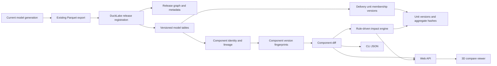

# DuckLake Model Version Diff Development Plan

Date: 2026-06-17
Planner: Plannator-style working plan
Scope: `plant-model-gen-cata-closure` model export/versioning, with component diff plus delivery-unit impact propagation as the first user-visible path

## Goal

Use DuckLake as the versioned model release store so users can compare two generated model versions at component granularity and understand how a local component change propagates to delivery units such as `BRAN`.

The first concrete scenario is:

- Select two releases, for example "before" and "after".
- Select one changed component by refno. A valve `VALV` is only the first test case, with `VALE` treated as a user-facing alias if it appears in business wording.
- Show whether the component was added, deleted, moved, geometry-changed, owner-changed, spec-changed, or unchanged.
- Trace the component to its containing delivery unit before and after the change.
- Report whether this local change causes a `BRAN`/`EQUI`/`WALL` unit-level change, for example a `VALV` modification making a `BRAN` version dirty.
- Provide structured JSON diff first, then a 3D before/after overlay.

## Product Decision

Use DuckLake first as immutable snapshot storage and query layer, not as the complete model version system and not as the primary generation writer.

Rationale:

- The current `export_dbnum_instances_parquet` path already produces normalized tables close to what diff needs.
- The current DuckLake model writer exists but still has known generation-side gaps around some tubi/transform/refno-association coverage.
- A release-layer approach gives a smaller MVP: generate/export as today, then register the export as a release in DuckLake and build version indexes from it.
- Oracle review conclusion: DuckLake is a good snapshot/publish layer, but the model version system must be built as domain metadata on top of it: release graph, component identity/lineage, unit versions, and deterministic impact rules.

## Oracle Review Amendments

Oracle reviewed the plan on 2026-06-17 and judged the original version as "snapshot store + diff engine", not yet a complete model version system.

P0 corrections now required:

1. Add a release graph so releases have parentage, branch/derivation metadata, and stable release hashes.
2. Add component identity and lineage so the same logical component can be tracked across releases even when owner, unit, or refno context changes.
3. Add `unit_versions` so `BRAN`, `EQUI`, and `WALL` are first-class version objects with aggregate hashes.
4. Replace unconditional runtime impact with deterministic propagation rules and recorded dependency edges.
5. Make the MVP prove this chain: component change -> component identity match -> unit aggregate recompute -> BRAN unit version hash changes.

## Terms

| Term | Meaning |
| --- | --- |
| Release | One published model snapshot, usually from one dbnum/project export and one generator configuration. |
| Release graph | Parent/branch/derivation relation between releases, used to explain how one model version evolves from another. |
| Delivery unit | Minimum delivery/control unit: `BRAN`, `HANG`, `EQUI`/`EQUIP`, `WALL`, `FLOOR`. |
| Component | A model element with stable refno, for example a valve `VALV` component. |
| Unit version | Version state of all members under one delivery unit in one release. |
| Unit aggregate hash | Stable hash of the unit's version-significant members and metadata. This is the actual BRAN/EQUI/WALL version fingerprint. |
| Component identity | Cross-release stable identity anchor for a logical component. |
| Component lineage | Per-release evolution record for one component identity. |
| Component version | Fingerprint and detail rows for one refno in one release. |
| Impact propagation | Deterministic rule-driven mapping from a changed component to affected parent units and aggregate unit version state. |
| Diff target | Usually `(dbnum, refno_str, old_release_id, new_release_id)`. |

## Baseline Facts

- `src/fast_model/export_model/export_dbnum_instances_parquet.rs` writes normalized Parquet tables such as `instances`, `geo_instances`, `tubings`, `transforms`, `aabb`, `ptsets`, `primitive_keypoints`, plus a manifest.
- `src/fast_model/export_model/export_dbnum_instances_web.rs` and `export_dbnum_instances_v3.rs` already contain grouping/export logic useful for viewer integration.
- `src/fast_model/export_model/spec_info.rs` defines delivery-unit nouns as `BRAN`, `HANG`, `EQUI`, `WALL`, `FLOOR`.
- `src/fast_model/gen_model/model_writer_ducklake.rs` has a DuckLake backend, but it is a raw writer path and should not be the MVP dependency for version comparison.
- `src/pe_transform_store.rs` has a DuckLake registration stub for transform storage, so transform DuckLake should not be assumed complete.
- `src/version_management/` currently covers status/log style data, not model release diff.

## Target Architecture

## DuckLake Usage

DuckLake should store both metadata and versioned Parquet-backed data:

- Use one DuckLake catalog per project/output root, or one shared catalog with `project_name` partitioning.
- Store the imported release tables as append-only versioned records, keyed by `release_id`.
- Keep app-level release IDs even though DuckLake has snapshots/time travel, because domain releases must map to generator config, dbnum, sesno, source manifest, and UI labels.
- Use DuckLake time travel later for forensic table-state queries, but use explicit `release_id` for application diff.
- Consider partitioning only after row counts are known; start with `dbnum` and possibly `release_id`, avoid over-partitioning by refno.

Reference docs:

- DuckLake overview: https://ducklake.select/docs/stable/
- Time travel: https://ducklake.select/docs/stable/duckdb/usage/time_travel
- Partitioning: https://ducklake.select/docs/stable/duckdb/advanced_features/partitioning
- Change feed: https://ducklake.select/docs/stable/duckdb/advanced_features/data_change_feed

## Proposed Tables

### Control and Release Graph Tables

`model_releases`

| Column | Purpose |
| --- | --- |
| `release_id` | Stable generated id, for example `db1112_20260617_001`. |
| `parent_release_id` | Optional parent release for normal evolution. |
| `branch_id` | Optional branch/stream name for project or scenario versions. |
| `derivation_type` | `full`, `patch`, `recompute`, `manual_import`, `rollback`. |
| `semantic_version` | Optional business-facing version label. |
| `project_name` | Project/site key. |
| `dbnum` | Source dbnum. |
| `source_sesno_key` | Optional source session/version marker from existing db metadata. |
| `manifest_path` | Path to Parquet export manifest. |
| `generator_config_hash` | Hash of relevant generation/export settings. |
| `release_hash` | Aggregate hash of release-significant unit versions and metadata. |
| `ducklake_snapshot_id` | Optional DuckLake snapshot id after commit. |
| `release_label` | UI label such as "before valve change". |
| `created_at` | Registration time. |
| `status` | `registered`, `indexed`, `failed`, `archived`. |

`model_release_edges`

| Column | Purpose |
| --- | --- |
| `edge_id` | Stable edge id. |
| `from_release_id` | Parent/source release. |
| `to_release_id` | Child/derived release. |
| `edge_type` | `parent`, `branch`, `merge`, `rollback`, `comparison_baseline`. |
| `reason` | Optional business or pipeline reason. |
| `created_at` | Edge creation time. |

`model_release_files`

| Column | Purpose |
| --- | --- |
| `release_id` | Owner release. |
| `table_name` | `instances`, `geo_instances`, `transforms`, etc. |
| `file_path` | Physical Parquet path. |
| `row_count` | Imported row count. |
| `content_hash` | Optional file hash for reproducibility. |

`delivery_units`

| Column | Purpose |
| --- | --- |
| `release_id` | Release key. |
| `unit_key` | Stable key, for example `1112:BRAN:123456`. |
| `dbnum` | Source dbnum. |
| `unit_type` | `BRAN`, `HANG`, `EQUI`, `EQUIP_ALIAS`, `WALL`, `FLOOR`, `UNASSIGNED`. |
| `unit_refno_str` | Unit refno. |
| `unit_refno_u64` | Numeric unit refno. |
| `parent_unit_key` | Optional parent delivery unit. |
| `name` | Optional name from export fields or attrs. |

`delivery_unit_membership_versions`

| Column | Purpose |
| --- | --- |
| `membership_version_id` | Stable membership row id. |
| `release_id` | Release key. |
| `unit_version_id` | Owning unit version. |
| `unit_key` | Delivery unit key. |
| `component_identity_hash` | Cross-release component identity. |
| `refno_str` | Member refno. |
| `refno_u64` | Numeric member refno. |
| `noun` | Member noun, for example `VALV`. |
| `owner_refno_str` | Direct owner from `instances`. |
| `owner_noun` | Direct owner noun. |
| `owner_path_json` | Full resolved path used for BRAN/EQUI/WALL assignment. |
| `member_role` | `self`, `direct_child`, `descendant`, `fallback_owner`, `unassigned`. |
| `transition_kind` | `stable`, `added`, `removed`, `moved_in`, `moved_out`, `unknown`. |

`unit_versions`

| Column | Purpose |
| --- | --- |
| `unit_version_id` | Stable version id for one unit in one release. |
| `release_id` | Release key. |
| `unit_key` | Stable delivery unit key. |
| `unit_type` | `BRAN`, `HANG`, `EQUI`, `WALL`, `FLOOR`, `UNASSIGNED`. |
| `parent_unit_version_id` | Parent unit version if units are nested. |
| `aggregate_hash` | Hash of version-significant member component hashes and unit metadata. |
| `dependency_hash` | Hash of dependency edges used by impact propagation. |
| `member_count` | Number of members included in aggregate. |
| `changed_component_count` | Count of member components changed from parent/baseline release. |
| `added_component_count` | Added members compared with parent/baseline. |
| `removed_component_count` | Removed members compared with parent/baseline. |
| `moved_component_count` | Moved-in or moved-out members compared with parent/baseline. |
| `rule_set_hash` | Propagation/hash rule set used to compute this version. |
| `detail_json` | Compact diagnostics and counters. |

### Versioned Model Tables

Start with release-keyed copies/projections of existing Parquet tables:

- `versioned_instances`
- `versioned_geo_instances`
- `versioned_tubings`
- `versioned_transforms`
- `versioned_aabb`
- `versioned_ptsets`
- `versioned_primitive_keypoints`

Each table must include `release_id` and `dbnum`. Keep original columns unchanged where possible so existing export semantics remain traceable.

### Diff Index Tables

`component_versions`

| Column | Purpose |
| --- | --- |
| `component_version_id` | Stable version id for this component in this release. |
| `release_id` | Release key. |
| `dbnum` | Source dbnum. |
| `component_identity_hash` | Cross-release stable logical component identity. |
| `refno_str` | Component refno. |
| `refno_u64` | Numeric component refno. |
| `noun` | Component noun. |
| `unit_key` | Delivery unit membership. |
| `semantic_hash` | Hash of owner/spec/name/noun/cata/flags. |
| `geometry_hash` | Hash of sorted geometry rows and geometry transforms. |
| `transform_hash` | Hash of resolved matrix/transform identity. |
| `aabb_hash` | Hash of resolved AABB values. |
| `membership_hash` | Hash of delivery-unit membership. |
| `component_hash` | Combined hash. |
| `detail_json` | Compact detail payload for diagnostics. |

`component_identities`

| Column | Purpose |
| --- | --- |
| `component_identity_hash` | Stable identity anchor across releases. |
| `identity_strategy` | `refno`, `refno_owner_path`, `canonical_path`, `geometry_signature`, or hybrid. |
| `first_release_id` | First release where this identity was seen. |
| `canonical_refno_str` | Preferred display refno. |
| `canonical_noun` | Preferred display noun. |
| `confidence` | Identity confidence score when non-refno matching is used. |
| `detail_json` | Diagnostics for identity derivation. |

`component_lineage`

| Column | Purpose |
| --- | --- |
| `component_identity_hash` | Component identity. |
| `release_id` | Release key. |
| `component_version_id` | Component version in this release. |
| `previous_component_version_id` | Previous version id on the selected release edge. |
| `lineage_change_type` | `added`, `deleted`, `unchanged`, `changed`, `moved`, `identity_conflict`. |
| `lineage_edge_id` | Related release edge when available. |

`propagation_rules`

| Column | Purpose |
| --- | --- |
| `rule_id` | Stable rule id. |
| `rule_set_hash` | Hash of active rule set. |
| `source_noun` | Component noun filter, or `*`. |
| `target_unit_type` | `BRAN`, `EQUI`, `WALL`, etc. |
| `change_mask` | Which changes propagate: geometry, transform, owner, spec, aabb, membership. |
| `threshold_json` | Numeric tolerances, for example geometry or transform thresholds. |
| `dirty_policy` | `always_dirty`, `threshold_dirty`, `ignore`, `manual_review`. |
| `enabled` | Rule active flag. |

`unit_dependency_edges`

| Column | Purpose |
| --- | --- |
| `release_id` | Release where dependency was resolved. |
| `component_identity_hash` | Source component. |
| `unit_version_id` | Target unit version. |
| `edge_type` | `membership`, `owner_path`, `spatial`, `shared_reference`, `manual_override`. |
| `rule_id` | Rule that makes this edge version-significant. |
| `path_json` | Owner/path evidence for audit. |

`component_diff_cache` is optional in MVP. Add it only after CLI/API diff is stable and repeated queries become expensive.

`component_unit_impacts`

| Column | Purpose |
| --- | --- |
| `old_release_id` | Before release. |
| `new_release_id` | After release. |
| `dbnum` | Source dbnum. |
| `refno_str` | Changed component refno. |
| `old_unit_key` | Containing unit before the change. |
| `new_unit_key` | Containing unit after the change. |
| `impact_unit_key` | Unit that should be marked impacted. Usually old unit, new unit, or both. |
| `impact_unit_type` | `BRAN`, `HANG`, `EQUI`, `WALL`, `FLOOR`, `UNASSIGNED`. |
| `impact_kind` | `member_changed`, `member_added`, `member_deleted`, `member_moved_in`, `member_moved_out`, `unit_hash_changed`. |
| `component_change_type` | Component-level diff category. |
| `impact_path_json` | Owner/unit path used to justify the impact. |

This table can be computed on demand for early development, but an audited version-management MVP must be able to persist impact records or replay them deterministically from `propagation_rules` and `unit_dependency_edges`.

## Diff Semantics

For one component refno:

1. Query old and new `component_versions`.
2. If old missing and new exists, return `added`.
3. If old exists and new missing, return `deleted`.
4. If `component_hash` matches, return `unchanged`.
5. Otherwise compare detail groups:
   - Semantic: `noun`, `owner_refno`, `owner_noun`, `spec_value`, `cata_hash`, `has_neg`, display name if available.
   - Membership: delivery unit changed, owner moved under another BRAN/EQUI/WALL.
   - Transform: `trans_hash`, resolved matrix, translation delta, rotation/scale signal where available.
   - Geometry: `geo_hash`, `geo_index`, `geo_trans_hash`, negative geometry relations where available.
   - AABB: numeric min/max/center/extent delta.
   - Ptset/tubing: optional detail, only if tables contain rows.
6. Return `multi_change` when more than one category changed, with category flags for UI.

For delivery-unit version diff:

1. Query old/new `unit_versions` by `unit_key`.
2. If `aggregate_hash` matches, return unit `unchanged`.
3. If hashes differ, inspect `delivery_unit_membership_versions` and member `component_versions`.
4. Compute added/deleted/common members by `component_identity_hash`, not only `refno_str`.
5. For common members, compare `component_hash`.
6. Aggregate counts by noun, change category, and propagation rule.
7. Provide drill-down to component diff.

For impact propagation from component to delivery unit:

1. Run component diff for the target refno and resolve `component_identity_hash`.
2. Resolve old and new membership from `delivery_unit_membership_versions`.
3. Evaluate `propagation_rules` for the component noun and change mask.
4. If old and new unit are the same, mark that unit as impacted only when the active rule says the change is version-significant.
5. If old and new unit differ, mark old unit as `member_moved_out` and new unit as `member_moved_in` when the move is version-significant.
6. If old is missing and new exists, mark new unit as `member_added`.
7. If old exists and new is missing, mark old unit as `member_deleted`.
8. Compare old/new `unit_versions.aggregate_hash` to prove whether the containing `BRAN` version changed.
9. Return the impact path, for example `VALV -> owner path -> BRAN`, and the rule id that made it dirty.

## Development Phases

### Phase 0: Planning and Feasibility

Status: done.

Tasks:

- Run SigMap context discovery for DuckLake, export Parquet, versioning, and component diff.
- Confirm no callable `plannator` tool is exposed in the current tool list.
- Create this active planning package.

Acceptance:

- Plan files exist under `.planning/2026-06-17-ducklake-valv-version-diff/`.
- `.planning/.active_plan` points to this plan.

### Phase 1: Release Snapshot and Release Graph MVP

Goal: Register one existing Parquet export as a DuckLake model release and make release lineage explicit.

Tasks:

- Add a small module, recommended path `src/version_management/model_release.rs`.
- Add a DuckDB/DuckLake access wrapper, recommended path `src/version_management/ducklake_store.rs`.
- Define release metadata structs with `serde` for CLI JSON output.
- Add CLI modes in `src/main.rs` and `src/cli_modes.rs`:
  - `--model-version-register`
  - `--model-version-list`
  - `--model-version-ducklake-metadata <path>`
  - `--model-version-ducklake-data-path <path>`
  - `--release-label <label>`
  - `--parquet-dir <dir>`
  - `--dbnum <dbnum>`
  - `--json`
- Read `manifest_{dbnum}.json` or `manifest.json` from the Parquet export directory.
- Create DuckLake schema and control tables if missing.
- Load/import or register the Parquet tables with `release_id` attached.
- Store row counts and file paths in `model_release_files`.
- Store `parent_release_id`, `branch_id`, `derivation_type`, and `release_hash` placeholders.
- Create `model_release_edges` for parent/baseline relationships.

Acceptance:

- Registering one export returns JSON containing `release_id`, table counts, manifest path, and status `registered`.
- Listing releases returns the registered release.
- Running the command twice with the same manifest either produces a clear duplicate error or an explicit idempotent result.
- Two releases can be connected by an explicit parent/comparison edge.

Validation:

- Use CLI + JSON only. Do not create or run cargo tests.
- Inspect DuckLake with DuckDB SQL to confirm control table rows and imported row counts.

### Phase 2: Component Identity and Delivery Unit Resolver

Goal: Split model content by minimum delivery unit and create cross-release component identities.

Tasks:

- Add identity module, recommended path `src/version_management/component_identity.rs`.
- Add resolver module, recommended path `src/version_management/delivery_unit.rs`.
- Normalize noun aliases:
  - `EQUIP` user/business wording maps to code/data noun `EQUI` unless actual data proves otherwise.
  - `VALE` user wording maps to `VALV` search/display alias if needed.
- Build initial unit membership from `versioned_instances.owner_refno_str` and `owner_noun`.
- Treat `BRAN`, `HANG`, `EQUI`, `WALL`, `FLOOR` rows as units when present.
- For components whose direct owner is not a delivery unit, walk owner chains if available from export/tree data.
- Mark unresolved members with `unit_type = UNASSIGNED` and `member_role = unassigned`; do not silently drop them.
- Add counters by noun and unit type.
- Compute `component_identity_hash` for every component. Initial strategy can use `refno + dbnum`; add diagnostics for future non-refno matching.
- Write `component_identities` and `delivery_unit_membership_versions`.

Acceptance:

- Every component row is either assigned to one unit or reported with an unresolved reason.
- Unit membership can answer: "which BRAN/EQUI/WALL contains this VALV refno in this release?"
- Membership is keyed by `component_identity_hash` as well as refno.
- Output includes counts for assigned/unassigned rows.

Validation:

- Run resolver on a known dbnum export.
- Query one BRAN, one EQUI/EQUIP, one WALL, and one VALV refno by CLI JSON.

### Phase 3: Component Fingerprints and Lineage

Goal: Compute stable component version fingerprints per release/refno and link versions through lineage.

Tasks:

- Add module, recommended path `src/version_management/component_version.rs`.
- For each `instances` row, collect linked `geo_instances`, `transforms`, `aabb`, and optional `tubings`/`ptsets`.
- Canonicalize arrays/maps before hashing:
  - Sort geometry rows by `geo_index`, `geo_hash`, `geo_trans_hash`.
  - Format floating point values with a defined tolerance or fixed precision.
  - Keep missing values explicit as `null`/`missing`, not empty strings.
- Compute `semantic_hash`, `geometry_hash`, `transform_hash`, `aabb_hash`, `membership_hash`, and combined `component_hash`.
- Write rows to `component_versions`.
- Write rows to `component_lineage` using the release graph edge as the comparison basis.
- Add a CLI mode:
  - `--model-version-index-components --release-id <id> --json`

Acceptance:

- Re-indexing the same release yields stable hashes.
- A changed transform changes `transform_hash` and combined `component_hash`.
- A changed `geo_hash` changes `geometry_hash`.
- A pure owner/unit move changes `membership_hash` or `semantic_hash`, depending on owner semantics.
- The same logical component can be followed across two releases by `component_identity_hash`.

Validation:

- Use two small exports or one export plus a controlled copied Parquet change.
- Query component version JSON for a known `VALV` refno.

### Phase 4: Unit Version Layer

Goal: Make BRAN/EQUI/WALL first-class version objects with aggregate hashes.

Tasks:

- Add module, recommended path `src/version_management/unit_version.rs`.
- Build `unit_versions` for each release from `delivery_unit_membership_versions` and member `component_versions`.
- Define the first aggregate formula:
  - sorted member `component_identity_hash`
  - member `component_hash`
  - membership role
  - unit metadata
  - active `rule_set_hash`
- Add counters for member count, added/removed/moved/changed components.
- Add CLI mode:
  - `--model-version-index-units --release-id <id> --json`

Acceptance:

- Re-indexing the same release produces stable unit aggregate hashes.
- A version-significant member change changes the containing unit aggregate hash.
- A changed `VALV` sample can change its containing `BRAN` aggregate hash when the rule set says it should.

### Phase 5: Component Diff and Impact Seed CLI

Goal: Provide a precise before/after diff for one refno and include identity and unit memberships that can seed impact analysis.

Tasks:

- Add module, recommended path `src/version_management/component_diff.rs`.
- Add CLI mode:
  - `--model-version-diff-component`
  - `--old-release-id <id>`
  - `--new-release-id <id>`
  - `--refno <refno>`
  - `--dbnum <dbnum>`
  - `--json`
- Implement diff categories:
  - `added`
  - `deleted`
  - `unchanged`
  - `moved`
  - `geometry_changed`
  - `owner_changed`
  - `spec_changed`
  - `aabb_changed`
  - `multi_change`
- Return payload sections:
  - `summary`
  - `identity`
  - `component_identity_hash`
  - `old`
  - `new`
  - `changed_fields`
  - `geometry_changes`
  - `transform_delta`
  - `aabb_delta`
  - `unit_change`
  - `old_unit`
  - `new_unit`
  - `impact_seed`
  - `diagnostics`

Acceptance:

- For any component refno, CLI JSON clearly explains what changed. `VALV` is only the first validation sample.
- Missing old/new rows are reported as added/deleted rather than errors.
- Numeric transform/AABB deltas include tolerances.
- Response includes old and new containing units when resolvable.
- Response indicates whether the change is version-significant under the active rule set.

Validation:

- Use CLI + JSON.
- Save at least one real command/output sample in `progress.md`.

### Phase 6: Deterministic Impact Propagation and Delivery Unit Diff CLI

Goal: Compare a BRAN/EQUI/WALL delivery unit across releases, and answer "which BRAN became impacted because this component changed?"

Tasks:

- Add propagation rule module, recommended path `src/version_management/propagation_rules.rs`.
- Add unit dependency module, recommended path `src/version_management/unit_dependency.rs`.
- Add impact CLI mode:
  - `--model-version-impact-component`
  - `--old-release-id <id>`
  - `--new-release-id <id>`
  - `--refno <refno>`
  - `--dbnum <dbnum>`
  - `--json`
- Add CLI mode:
  - `--model-version-diff-unit`
  - `--old-release-id <id>`
  - `--new-release-id <id>`
  - `--unit-refno <refno>`
  - `--unit-type <BRAN|EQUI|EQUIP|WALL|FLOOR>`
  - `--json`
- Implement member set diff.
- Aggregate by noun and change category.
- Implement component-to-unit impact propagation:
  - same unit: mark containing unit impacted only when the rule set says the component change is version-significant
  - moved component: mark old and new units impacted when move propagation is enabled
  - added component: mark new unit impacted
  - deleted component: mark old unit impacted
- Compare old/new `unit_versions.aggregate_hash` so a single member change can update the BRAN-level version state.
- Include sample changed refnos, capped by CLI option.

Acceptance:

- A BRAN/EQUI/WALL diff shows added/deleted/changed/unchanged component counts.
- A changed component can be discovered from its containing unit diff.
- A `VALV` sample modification can report the impacted `BRAN` when membership resolves to a branch.
- If a component moves between BRANs, both BRANs are reported with distinct impact kinds.
- The impact result includes the rule id and dependency edge evidence used to mark the unit dirty.

### Phase 7: Web API

Goal: Expose release and diff capabilities to the UI.

Tasks:

- Add API module, recommended path `src/web_api/model_version_api.rs`.
- Add routes:
  - `GET /api/model-version/releases?dbnum=...`
  - `GET /api/model-version/component-history/:refno?dbnum=...`
  - `GET /api/model-version/unit-version/:unit_key?release_id=...`
  - `POST /api/model-version/component-diff`
  - `POST /api/model-version/component-impact`
  - `POST /api/model-version/unit-diff`
- Keep request/response DTOs aligned with CLI JSON.
- Add precise errors for missing release, missing refno, unindexed release, and DuckLake unavailable.

Acceptance:

- HTTP `POST /api/model-version/component-diff` returns the same summary as CLI for the known valve.
- HTTP `POST /api/model-version/component-impact` returns impacted delivery units for a changed component.
- `GET /api/model-version/unit-version/:unit_key` returns aggregate hash and member counters.
- `GET /api/model-version/releases` lists release labels and statuses.

Validation:

- Per repo rule, start `web_server` and verify with HTTP/POST.
- Do not use Rust test binaries or cargo test.

### Phase 8: 3D Compare Viewer

Goal: Make the diff inspectable, not only textual.

Tasks:

- Decide whether this UI lives in current web server templates or sibling viewer application.
- Add release selectors, refno search, and diff summary panel.
- Reuse existing exported model package paths where possible.
- Render old/new component states:
  - old only: red transparent
  - new only: green or yellow solid
  - both changed: overlay old transparent and new solid
  - unchanged context: muted gray
- For moved components, draw transform delta indicator or show before/after centers.
- Show changed fields and geometry hashes in a side panel.

Acceptance:

- User can select two releases and a `VALV`/`VALE` refno and visually compare before/after.
- UI clearly distinguishes moved versus geometry changed.
- Text does not overlap and large IDs are truncated/copyable.

Validation:

- Manual UI check plus HTTP traces.
- Capture screenshots for a known changed valve.

### Phase 9: Pipeline Integration and Hardening

Goal: Make the feature reliable in regular model export workflows.

Tasks:

- Add optional post-export registration hook after `export_dbnum_instances_parquet`.
- Record generator/export settings into `generator_config_hash`.
- Add retention policy for Parquet/mesh assets referenced by releases.
- Add a DuckLake availability diagnostic:
  - extension installed
  - metadata path writable
  - data path writable
  - can attach catalog
- Add performance counters:
  - release registration time
  - index build time
  - component diff query time
  - unit diff query time
- Add recovery path for partial/failed release registration.

Acceptance:

- A failed registration does not corrupt previous releases.
- Release metadata can tell exactly which manifest/files were used.
- Operators can diagnose offline DuckLake extension problems.

## MVP Slice

The smallest useful delivery should include:

1. Register two existing Parquet exports into DuckLake.
2. Connect the releases with an explicit release graph edge.
3. Build `component_identities`, `component_versions`, and `component_lineage` for both releases.
4. Build `delivery_unit_membership_versions` and `unit_versions` for both releases.
5. Run CLI component diff for one changed component refno, using `VALV`/`VALE` only as the first sample.
6. Resolve old/new delivery-unit membership for that component by `component_identity_hash`.
7. Return JSON with change category, old/new owner, old/new unit, impacted unit list, rule id, transform delta, geometry hash delta, and AABB delta.
8. Prove that a single version-significant `VALV` change changes its containing `BRAN` `unit_versions.aggregate_hash`.

This MVP does not need:

- Generation-time DuckLake writer replacement.
- Full branching/merge semantics beyond one explicit parent/comparison edge.
- 3D viewer.
- Cached unit diff table.
- Full history UI.

## Validation Matrix

| Area | Method | Rule |
| --- | --- | --- |
| aios-database CLI | CLI command with `--json`, inspect output | No cargo tests. |
| DuckLake data | DuckDB SQL against metadata catalog | Verify row counts and release ids. |
| web_server | Run service, call HTTP/POST | No Rust tests. |
| UI | Manual browser flow and screenshot | Verify visual before/after overlay. |
| Regression | Compare row counts and hashes between repeated runs | Same export should produce same hashes. |

## Risks

| Risk | Impact | Mitigation |
| --- | --- | --- |
| `VALE` vs `VALV` naming mismatch | User cannot find target valve | Add alias layer and show resolved noun/refno in responses. |
| DuckLake extension unavailable offline | Registration fails on first run | Add diagnostic and document extension/cache setup. |
| DuckLake raw writer gaps are mistaken as blocker | Scope expands too early | Use Parquet export registration for MVP. |
| Delivery unit ownership is incomplete for WALL/FLOOR | Some components become unassigned | Store unresolved reason and improve with tree index owner walk. |
| Component change does not roll up to BRAN | BRAN version looks unchanged even when a member changed | Store old/new unit membership and compute aggregate unit hashes from member component hashes. |
| Component identity is only refno-based | Cross-release tracking fails after refno/context changes | Add `component_identity_hash`, strategy metadata, confidence, and lineage diagnostics. |
| Impact rule is hard-coded | Dirty results are not auditable or reproducible | Store propagation rules and dependency edges with rule ids. |
| Unit version hash missing | System remains a diff tool rather than version manager | Make `unit_versions.aggregate_hash` a P0 MVP artifact. |
| Component moves between units | Only one side of the change is visible | Emit both `member_moved_out` and `member_moved_in` impacts. |
| Hash-only diff hides numeric details | User cannot understand movement magnitude | Always compute matrix/AABB deltas for changed components. |
| Mesh/GLB assets are not retained per release | 3D compare cannot show old geometry | Add release asset manifest and retention policy before viewer rollout. |
| Large dbnum exports create too many small files | Slow import/query | Start unpartitioned or low-cardinality partitioned, then benchmark. |

## Open Questions

- Which field should define the business release: sesno, export timestamp, manually supplied label, or pipeline task id?
- What release graph semantics are needed first: linear parent chain only, project branches, or comparison baselines?
- Does live data use `VALV`, `VALE`, or both for valve components?
- For a component under a BRAN, is the BRAN impact rule always "any descendant component hash changed", or are some attributes geometry-only and not BRAN-version-significant?
- What should the first propagation rule set include, and what tolerances are acceptable for geometry/transform changes?
- For `WALL`, is membership best derived from direct owner, scene tree ancestry, spatial relation, or a separate discipline rule?
- Should the first viewer integration happen in this repo's web server, or in the sibling 3D viewer application?
- Do old releases need immutable mesh/GLB asset snapshots, or can geometry hashes always resolve to retained shared mesh cache?

## File Touch Plan

Likely backend files:

- `src/version_management/mod.rs`
- `src/version_management/model_release.rs`
- `src/version_management/ducklake_store.rs`
- `src/version_management/release_graph.rs`
- `src/version_management/component_identity.rs`
- `src/version_management/delivery_unit.rs`
- `src/version_management/component_version.rs`
- `src/version_management/component_lineage.rs`
- `src/version_management/unit_version.rs`
- `src/version_management/component_diff.rs`
- `src/version_management/propagation_rules.rs`
- `src/version_management/unit_dependency.rs`
- `src/version_management/unit_impact.rs`
- `src/cli_modes.rs`
- `src/main.rs`
- `src/web_api/model_version_api.rs`
- `src/web_api/mod.rs`

Likely documentation/ops files:

- `.planning/2026-06-17-ducklake-valv-version-diff/progress.md`
- `docs/plans/` if a published handoff plan is needed later

## Definition of Done

- Two releases are registered in DuckLake from existing Parquet exports.
- The two releases have an explicit release graph edge.
- Component identities and lineage exist for indexed releases.
- BRAN/EQUI/WALL unit versions have stable aggregate hashes.
- A known changed component refno can be diffed by CLI JSON, with `VALV`/`VALE` used as one validation sample.
- The diff identifies added/deleted/unchanged/moved/geometry/owner/spec/AABB changes.
- The diff reports old/new containing delivery units and impacted units.
- At least one version-significant `VALV` sample change can be shown to change a containing `BRAN` aggregate hash when membership resolves to BRAN.
- At least one BRAN/EQUI/WALL unit diff can list changed member refnos and aggregate member changes into unit-level version state.
- Impact output includes propagation rule and dependency edge evidence.
- Web API returns the same diff as CLI.
- Verification evidence is recorded without cargo tests.
