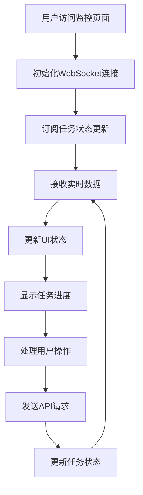
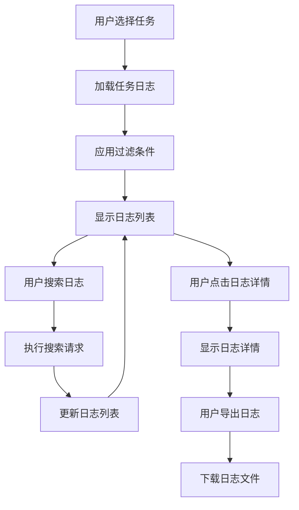
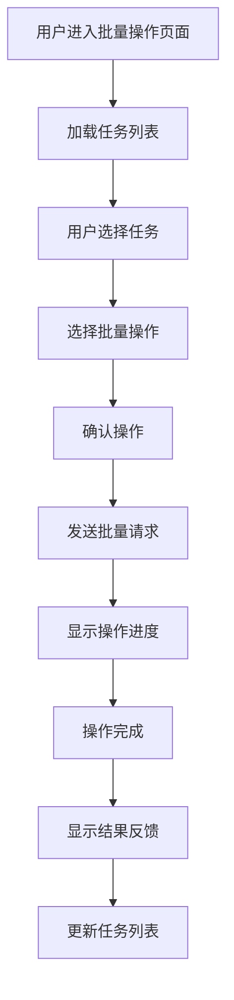
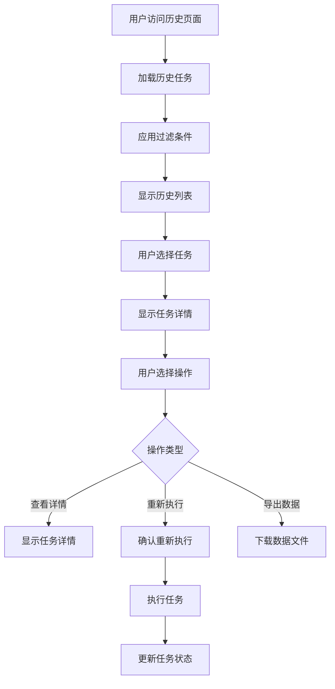

# 任务管理功能开发计划

## 项目概述

基于现有的 AIOS 数据库管理平台，完善任务管理功能的4个核心模块：实时监控、任务日志查看、批量任务处理、任务历史记录。

## 技术栈
- **前端**: Next.js 14.2.16 + TypeScript + Tailwind CSS
- **UI组件**: Radix UI + Lucide React
- **状态管理**: React Hooks + 自定义 Hooks
- **API通信**: RESTful API + WebSocket (实时监控)

---

## 1. 实时监控功能完善

### 1.1 功能描述和需求分析

**当前状态**: 部分实现 - 已有系统监控面板，缺少任务级别的实时状态更新

**目标功能**:
- 任务执行进度实时显示
- 任务状态变更实时推送
- 系统资源使用情况监控
- 任务队列状态监控
- 异常任务告警

### 1.2 前端页面路径
```
/app/tasks/monitor/page.tsx          # 任务监控主页面
/app/tasks/monitor/[taskId]/page.tsx # 单个任务详情监控
```

### 1.3 React组件列表

#### 1.3.1 核心组件
```typescript
// components/task-monitor/TaskMonitorDashboard.tsx
interface TaskMonitorDashboardProps {
  refreshInterval?: number
  autoRefresh?: boolean
}

// components/task-monitor/TaskStatusCard.tsx
interface TaskStatusCardProps {
  task: Task
  onTaskAction: (taskId: string, action: TaskAction) => void
}

// components/task-monitor/SystemMetricsPanel.tsx
interface SystemMetricsPanelProps {
  metrics: SystemMetrics
  onRefresh: () => void
}

// components/task-monitor/TaskQueueMonitor.tsx
interface TaskQueueMonitorProps {
  queue: TaskQueue
  onQueueAction: (action: QueueAction) => void
}
```

#### 1.3.2 实时更新组件
```typescript
// components/task-monitor/RealtimeStatusIndicator.tsx
interface RealtimeStatusIndicatorProps {
  isConnected: boolean
  lastUpdate: string
  onReconnect: () => void
}

// components/task-monitor/TaskProgressBar.tsx
interface TaskProgressBarProps {
  taskId: string
  progress: number
  status: TaskStatus
  estimatedTime?: number
}
```

### 1.4 后端API端点

**已有端点**:
- `GET /api/node-status` - 节点状态查询 ✅
- `GET /api/deployment-sites` - 部署站点列表 ✅

**需要新增端点**:
- `GET /api/tasks/status` - 任务状态查询 ❌
- `GET /api/tasks/{taskId}/progress` - 任务进度查询 ❌
- `WebSocket /ws/tasks/updates` - 实时状态推送 ❌
- `GET /api/system/metrics` - 系统指标查询 ❌

### 1.5 前端状态管理方案

```typescript
// hooks/use-task-monitor.ts
interface TaskMonitorState {
  tasks: Task[]
  systemMetrics: SystemMetrics
  isConnected: boolean
  lastUpdate: string
  error: string | null
}

// hooks/use-websocket.ts
interface WebSocketState {
  isConnected: boolean
  lastMessage: any
  error: string | null
}
```

### 1.6 数据流程图



### 1.7 技术实现要点

**WebSocket集成**:
```typescript
// lib/websocket.ts
class TaskMonitorWebSocket {
  private ws: WebSocket | null = null
  private reconnectAttempts = 0
  private maxReconnectAttempts = 5
  
  connect(onMessage: (data: any) => void) {
    this.ws = new WebSocket('ws://localhost:3000/ws/tasks/updates')
    this.ws.onmessage = (event) => {
      const data = JSON.parse(event.data)
      onMessage(data)
    }
  }
}
```

**实时更新机制**:
```typescript
// hooks/use-realtime-updates.ts
export function useRealtimeUpdates() {
  const [tasks, setTasks] = useState<Task[]>([])
  const [isConnected, setIsConnected] = useState(false)
  
  useEffect(() => {
    const ws = new TaskMonitorWebSocket()
    ws.connect((data) => {
      setTasks(prev => updateTaskInList(prev, data))
    })
    
    return () => ws.disconnect()
  }, [])
}
```

### 1.8 开发优先级
**P0** - 核心功能，影响用户体验

### 1.9 预估工作量
**15-20小时** (2-3天)

### 1.10 依赖关系
- 依赖后端WebSocket服务实现
- 依赖任务状态API端点

---

## 2. 任务日志查看功能

### 2.1 功能描述和需求分析

**当前状态**: 完全未实现

**目标功能**:
- 任务执行日志实时查看
- 日志级别过滤 (INFO/WARN/ERROR)
- 日志搜索和筛选
- 日志下载和导出
- 日志分页和虚拟滚动

### 2.2 前端页面路径
```
/app/tasks/logs/page.tsx              # 日志查看主页面
/app/tasks/logs/[taskId]/page.tsx     # 特定任务日志
/app/tasks/logs/[taskId]/[logId]/page.tsx # 单条日志详情
```

### 2.3 React组件列表

#### 2.3.1 日志查看组件
```typescript
// components/task-logs/LogViewer.tsx
interface LogViewerProps {
  taskId?: string
  autoScroll?: boolean
  showTimestamp?: boolean
  maxLines?: number
}

// components/task-logs/LogEntry.tsx
interface LogEntryProps {
  log: LogEntry
  onExpand?: (logId: string) => void
  onCopy?: (content: string) => void
}

// components/task-logs/LogFilters.tsx
interface LogFiltersProps {
  onFilterChange: (filters: LogFilters) => void
  availableLevels: LogLevel[]
  availableTasks: string[]
}

// components/task-logs/LogSearch.tsx
interface LogSearchProps {
  onSearch: (query: string) => void
  placeholder?: string
  debounceMs?: number
}
```

#### 2.3.2 日志管理组件
```typescript
// components/task-logs/LogDownloader.tsx
interface LogDownloaderProps {
  taskId: string
  format: 'txt' | 'json' | 'csv'
  dateRange: [Date, Date]
}

// components/task-logs/LogPagination.tsx
interface LogPaginationProps {
  currentPage: number
  totalPages: number
  onPageChange: (page: number) => void
  pageSize: number
}
```

### 2.4 后端API端点

**需要新增端点**:
- `GET /api/tasks/{taskId}/logs` - 获取任务日志 ❌
- `GET /api/tasks/logs` - 获取所有日志 ❌
- `GET /api/tasks/logs/{logId}` - 获取单条日志详情 ❌
- `POST /api/tasks/logs/search` - 日志搜索 ❌
- `GET /api/tasks/logs/export` - 日志导出 ❌
- `WebSocket /ws/tasks/{taskId}/logs` - 实时日志推送 ❌

### 2.5 前端状态管理方案

```typescript
// hooks/use-task-logs.ts
interface TaskLogsState {
  logs: LogEntry[]
  loading: boolean
  error: string | null
  filters: LogFilters
  pagination: PaginationState
}

// hooks/use-log-search.ts
interface LogSearchState {
  query: string
  results: LogEntry[]
  isSearching: boolean
  searchHistory: string[]
}
```

### 2.6 数据流程图



### 2.7 技术实现要点

**虚拟滚动实现**:
```typescript
// components/task-logs/VirtualLogList.tsx
import { FixedSizeList as List } from 'react-window'

export function VirtualLogList({ logs }: { logs: LogEntry[] }) {
  const Row = ({ index, style }: { index: number; style: any }) => (
    <div style={style}>
      <LogEntry log={logs[index]} />
    </div>
  )

  return (
    <List
      height={600}
      itemCount={logs.length}
      itemSize={50}
      width="100%"
    >
      {Row}
    </List>
  )
}
```

**日志搜索实现**:
```typescript
// hooks/use-log-search.ts
export function useLogSearch() {
  const [query, setQuery] = useState('')
  const [results, setResults] = useState<LogEntry[]>([])
  
  const debouncedSearch = useMemo(
    () => debounce(async (searchQuery: string) => {
      if (searchQuery.trim()) {
        const response = await searchLogs(searchQuery)
        setResults(response.data)
      }
    }, 300),
    []
  )
  
  useEffect(() => {
    debouncedSearch(query)
  }, [query, debouncedSearch])
}
```

### 2.8 开发优先级
**P1** - 重要功能，提升用户体验

### 2.9 预估工作量
**20-25小时** (3-4天)

### 2.10 依赖关系
- 依赖实时监控功能 (WebSocket连接)
- 依赖任务管理基础功能

---

## 3. 批量任务处理功能

### 3.1 功能描述和需求分析

**当前状态**: 完全未实现

**目标功能**:
- 批量选择任务
- 批量启动/停止/暂停任务
- 批量删除任务
- 批量修改任务优先级
- 批量任务进度监控
- 批量操作结果反馈

### 3.2 前端页面路径
```
/app/tasks/batch/page.tsx             # 批量操作页面
/app/tasks/batch/operations/page.tsx  # 批量操作历史
```

### 3.3 React组件列表

#### 3.3.1 批量选择组件
```typescript
// components/batch-operations/BatchTaskSelector.tsx
interface BatchTaskSelectorProps {
  tasks: Task[]
  selectedTasks: string[]
  onSelectionChange: (selectedIds: string[]) => void
  onSelectAll: () => void
  onSelectNone: () => void
}

// components/batch-operations/TaskSelectionCard.tsx
interface TaskSelectionCardProps {
  task: Task
  isSelected: boolean
  onToggle: (taskId: string) => void
  disabled?: boolean
}
```

#### 3.3.2 批量操作组件
```typescript
// components/batch-operations/BatchOperationPanel.tsx
interface BatchOperationPanelProps {
  selectedTasks: string[]
  onOperation: (operation: BatchOperation) => void
  disabled?: boolean
}

// components/batch-operations/BatchProgressMonitor.tsx
interface BatchProgressMonitorProps {
  operationId: string
  onComplete: (result: BatchOperationResult) => void
}

// components/batch-operations/BatchOperationHistory.tsx
interface BatchOperationHistoryProps {
  operations: BatchOperation[]
  onViewDetails: (operationId: string) => void
}
```

### 3.4 后端API端点

**需要新增端点**:
- `POST /api/tasks/batch/start` - 批量启动任务 ❌
- `POST /api/tasks/batch/stop` - 批量停止任务 ❌
- `POST /api/tasks/batch/pause` - 批量暂停任务 ❌
- `POST /api/tasks/batch/delete` - 批量删除任务 ❌
- `POST /api/tasks/batch/priority` - 批量修改优先级 ❌
- `GET /api/tasks/batch/operations` - 批量操作历史 ❌
- `GET /api/tasks/batch/operations/{id}` - 批量操作详情 ❌

### 3.5 前端状态管理方案

```typescript
// hooks/use-batch-operations.ts
interface BatchOperationsState {
  selectedTasks: string[]
  operations: BatchOperation[]
  isProcessing: boolean
  currentOperation: BatchOperation | null
}

// hooks/use-task-selection.ts
interface TaskSelectionState {
  selectedTasks: string[]
  selectAll: boolean
  indeterminate: boolean
}
```

### 3.6 数据流程图



### 3.7 技术实现要点

**批量选择实现**:
```typescript
// hooks/use-batch-selection.ts
export function useBatchSelection(tasks: Task[]) {
  const [selectedTasks, setSelectedTasks] = useState<string[]>([])
  
  const selectAll = useCallback(() => {
    setSelectedTasks(tasks.map(t => t.id))
  }, [tasks])
  
  const selectNone = useCallback(() => {
    setSelectedTasks([])
  }, [])
  
  const toggleTask = useCallback((taskId: string) => {
    setSelectedTasks(prev => 
      prev.includes(taskId) 
        ? prev.filter(id => id !== taskId)
        : [...prev, taskId]
    )
  }, [])
  
  const isSelected = useCallback((taskId: string) => {
    return selectedTasks.includes(taskId)
  }, [selectedTasks])
  
  return {
    selectedTasks,
    selectAll,
    selectNone,
    toggleTask,
    isSelected
  }
}
```

**批量操作实现**:
```typescript
// lib/batch-operations.ts
export async function executeBatchOperation(
  operation: BatchOperation,
  taskIds: string[]
): Promise<BatchOperationResult> {
  const response = await fetch('/api/tasks/batch/execute', {
    method: 'POST',
    headers: { 'Content-Type': 'application/json' },
    body: JSON.stringify({
      operation: operation.type,
      taskIds,
      parameters: operation.parameters
    })
  })
  
  return response.json()
}
```

### 3.8 开发优先级
**P1** - 重要功能，提升操作效率

### 3.9 预估工作量
**18-22小时** (3-4天)

### 3.10 依赖关系
- 依赖任务管理基础功能
- 依赖实时监控功能 (进度显示)

---

## 4. 任务历史记录功能

### 4.1 功能描述和需求分析

**当前状态**: 完全未实现

**目标功能**:
- 任务执行历史记录
- 历史任务状态查询
- 任务执行统计和分析
- 历史任务重新执行
- 任务执行报告生成
- 历史数据导出

### 4.2 前端页面路径
```
/app/tasks/history/page.tsx           # 任务历史主页面
/app/tasks/history/[taskId]/page.tsx  # 特定任务历史
/app/tasks/history/analytics/page.tsx # 任务分析页面
/app/tasks/history/reports/page.tsx   # 任务报告页面
```

### 4.3 React组件列表

#### 4.3.1 历史记录组件
```typescript
// components/task-history/TaskHistoryList.tsx
interface TaskHistoryListProps {
  tasks: TaskHistory[]
  onTaskSelect: (taskId: string) => void
  onReplay: (taskId: string) => void
}

// components/task-history/TaskHistoryCard.tsx
interface TaskHistoryCardProps {
  task: TaskHistory
  onViewDetails: (taskId: string) => void
  onReplay: (taskId: string) => void
}

// components/task-history/TaskHistoryFilters.tsx
interface TaskHistoryFiltersProps {
  onFilterChange: (filters: HistoryFilters) => void
  availableStatuses: TaskStatus[]
  availableTypes: TaskType[]
}
```

#### 4.3.2 分析统计组件
```typescript
// components/task-history/TaskAnalytics.tsx
interface TaskAnalyticsProps {
  dateRange: [Date, Date]
  onDateRangeChange: (range: [Date, Date]) => void
}

// components/task-history/TaskStatistics.tsx
interface TaskStatisticsProps {
  statistics: TaskStatistics
  period: 'day' | 'week' | 'month' | 'year'
}

// components/task-history/TaskCharts.tsx
interface TaskChartsProps {
  data: ChartData[]
  chartType: 'line' | 'bar' | 'pie'
}
```

### 4.4 后端API端点

**需要新增端点**:
- `GET /api/tasks/history` - 获取任务历史 ❌
- `GET /api/tasks/history/{taskId}` - 获取特定任务历史 ❌
- `GET /api/tasks/history/analytics` - 获取任务分析数据 ❌
- `GET /api/tasks/history/statistics` - 获取任务统计 ❌
- `POST /api/tasks/history/replay` - 重新执行历史任务 ❌
- `GET /api/tasks/history/export` - 导出历史数据 ❌
- `GET /api/tasks/history/reports` - 生成任务报告 ❌

### 4.5 前端状态管理方案

```typescript
// hooks/use-task-history.ts
interface TaskHistoryState {
  tasks: TaskHistory[]
  loading: boolean
  error: string | null
  filters: HistoryFilters
  pagination: PaginationState
}

// hooks/use-task-analytics.ts
interface TaskAnalyticsState {
  statistics: TaskStatistics
  charts: ChartData[]
  dateRange: [Date, Date]
  loading: boolean
}
```

### 4.6 数据流程图



### 4.7 技术实现要点

**历史数据管理**:
```typescript
// lib/task-history.ts
export interface TaskHistory {
  id: string
  taskId: string
  name: string
  type: TaskType
  status: TaskStatus
  startTime: string
  endTime: string
  duration: number
  result: TaskResult
  parameters: Record<string, any>
  logs: LogEntry[]
}

// hooks/use-task-history.ts
export function useTaskHistory() {
  const [tasks, setTasks] = useState<TaskHistory[]>([])
  const [loading, setLoading] = useState(false)
  
  const loadHistory = useCallback(async (filters: HistoryFilters) => {
    setLoading(true)
    try {
      const response = await fetchTaskHistory(filters)
      setTasks(response.data)
    } catch (error) {
      console.error('Failed to load task history:', error)
    } finally {
      setLoading(false)
    }
  }, [])
  
  return { tasks, loading, loadHistory }
}
```

**任务重新执行**:
```typescript
// components/task-history/TaskReplayDialog.tsx
export function TaskReplayDialog({ task, onReplay }: TaskReplayDialogProps) {
  const [parameters, setParameters] = useState(task.parameters)
  const [isReplaying, setIsReplaying] = useState(false)
  
  const handleReplay = async () => {
    setIsReplaying(true)
    try {
      await replayTask(task.id, parameters)
      onReplay(task.id)
    } catch (error) {
      console.error('Failed to replay task:', error)
    } finally {
      setIsReplaying(false)
    }
  }
  
  return (
    <Dialog>
      <DialogContent>
        <DialogHeader>
          <DialogTitle>重新执行任务</DialogTitle>
        </DialogHeader>
        <TaskParametersForm 
          parameters={parameters}
          onChange={setParameters}
        />
        <DialogFooter>
          <Button onClick={handleReplay} disabled={isReplaying}>
            {isReplaying ? '执行中...' : '确认执行'}
          </Button>
        </DialogFooter>
      </DialogContent>
    </Dialog>
  )
}
```

### 4.8 开发优先级
**P2** - 重要功能，提供历史数据支持

### 4.9 预估工作量
**25-30小时** (4-5天)

### 4.10 依赖关系
- 依赖任务管理基础功能
- 依赖任务日志功能 (历史日志查看)
- 依赖批量操作功能 (批量历史操作)

---

## 总体实施计划

### 阶段1: 基础功能实现 (P0)
1. **实时监控功能完善** (15-20小时)
   - 实现WebSocket连接
   - 完善任务状态实时更新
   - 优化系统监控面板

### 阶段2: 核心功能实现 (P1)
2. **任务日志查看功能** (20-25小时)
   - 实现日志查看界面
   - 添加日志搜索和过滤
   - 实现日志导出功能

3. **批量任务处理功能** (18-22小时)
   - 实现批量选择机制
   - 添加批量操作功能
   - 实现批量操作进度监控

### 阶段3: 高级功能实现 (P2)
4. **任务历史记录功能** (25-30小时)
   - 实现历史记录管理
   - 添加任务分析统计
   - 实现任务重新执行

### 总工作量估算
**78-97小时** (12-15天)

### 技术难点和解决方案

1. **WebSocket连接稳定性**
   - 实现自动重连机制
   - 添加连接状态监控
   - 处理网络异常情况

2. **大量日志数据渲染**
   - 使用虚拟滚动技术
   - 实现分页加载
   - 优化内存使用

3. **批量操作性能**
   - 实现操作队列管理
   - 添加进度反馈机制
   - 处理操作失败情况

4. **历史数据存储**
   - 设计合理的数据结构
   - 实现数据压缩和归档
   - 优化查询性能

### 开发建议

1. **先实现基础功能，再优化性能**
2. **使用TypeScript确保类型安全**
3. **实现完善的错误处理机制**
4. **添加单元测试和集成测试**
5. **考虑移动端适配**
6. **实现无障碍访问支持**
