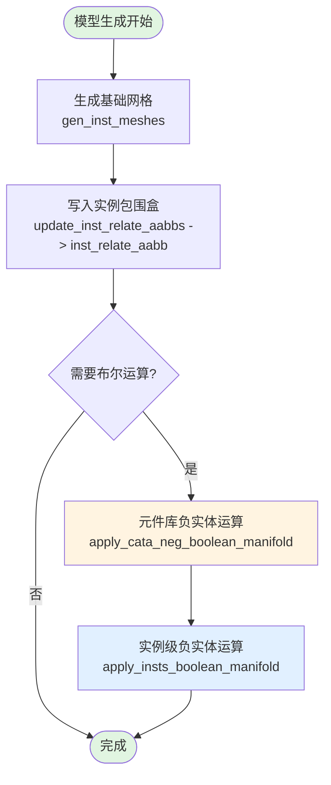
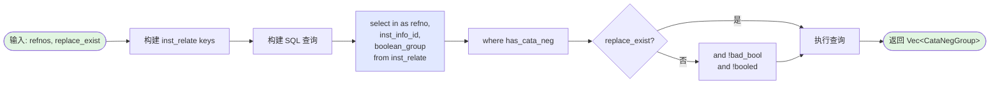
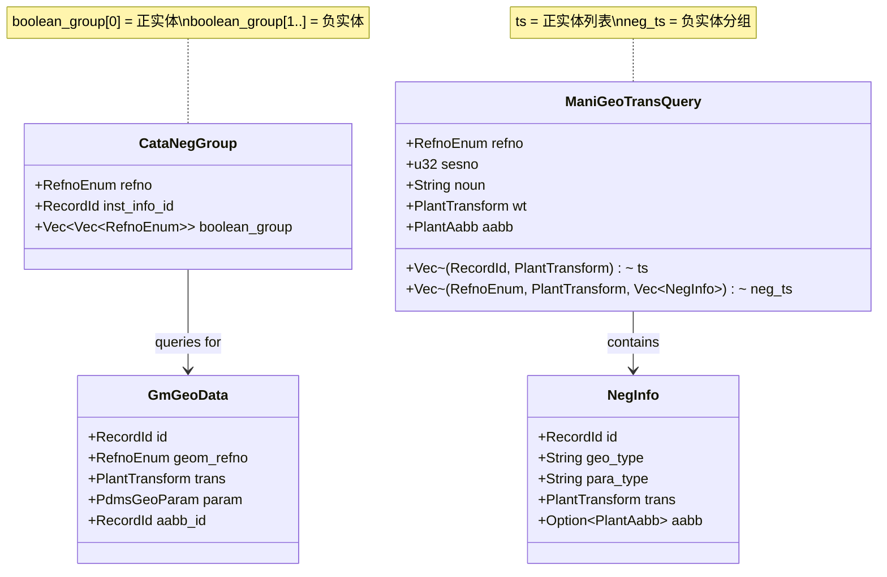
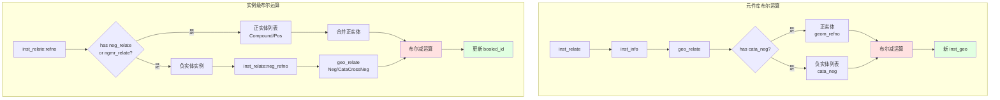

# 布尔运算流程图

## 整体架构流程



## 1. 元件库负实体布尔运算流程

```mermaid
flowchart TB
    Start([apply_cata_neg_boolean_manifold]) --> Query1[查询元件库布尔组<br/>query_cata_neg_boolean_groups]
    
    Query1 --> Check1{有数据?}
    Check1 -->|否| End1([返回 OK])
    Check1 -->|是| Chunk[分批处理<br/>每批 1/16]
    
    Chunk --> Spawn[并发任务<br/>tokio::spawn]
    
    Spawn --> Loop1[遍历 CataNegGroup]
    Loop1 --> BuildPes[构建 geom_refno 列表<br/>from boolean_group]
    
    BuildPes --> Query2[查询几何体详细信息<br/>SQL: ->inst_relate->inst_info->geo_relate]
    
    Query2 --> QueryResult{查询成功?}
    QueryResult -->|否| MarkBad1[标记 bad_bool=true]
    QueryResult -->|是| Loop2[遍历 boolean_group]
    
    Loop2 --> FindPos{找到正实体<br/>bg[0]?}
    FindPos -->|否| MarkBad2[标记 bad_bool=true]
    FindPos -->|是| LoadPos[加载正实体 Manifold<br/>precision=false]
    
    LoadPos --> LoadPosOK{加载成功?}
    LoadPosOK -->|否| MarkBad3[标记 bad_bool=true]
    LoadPosOK -->|是| Loop3[遍历负实体<br/>bg[1..]]
    
    Loop3 --> LoadNeg[加载负实体 Manifold<br/>precision=true]
    LoadNeg --> LoadNegOK{加载成功?}
    LoadNegOK -->|是| CollectNeg[收集到 neg_manifolds]
    LoadNegOK -->|否| Skip1[跳过此负实体]
    
    CollectNeg --> NextNeg{还有负实体?}
    Skip1 --> NextNeg
    NextNeg -->|是| Loop3
    NextNeg -->|否| Boolean[执行布尔减运算<br/>batch_boolean_subtract]
    
    Boolean --> GenMeshID[生成新 mesh_id<br/>hash_with_another_refno]
    GenMeshID --> SaveMesh[保存 mesh 文件]
    
    SaveMesh --> SaveOK{保存成功?}
    SaveOK -->|是| UpdateDB[更新数据库<br/>1. create inst_geo<br/>2. relate geo_relate<br/>3. set booled=true]
    SaveOK -->|否| NextBG1{还有 boolean_group?}
    
    UpdateDB --> NextBG2{还有 boolean_group?}
    MarkBad1 --> NextGroup1{还有 CataNegGroup?}
    MarkBad2 --> NextBG1
    MarkBad3 --> NextBG1
    NextBG1 -->|是| Loop2
    NextBG2 -->|是| Loop2
    NextBG1 -->|否| NextGroup2{还有 CataNegGroup?}
    NextBG2 -->|否| NextGroup2
    
    NextGroup2 -->|是| Loop1
    NextGroup2 -->|否| ExecuteSQL[执行累积的 SQL]
    NextGroup1 -->|是| Loop1
    NextGroup1 -->|否| ExecuteSQL
    
    ExecuteSQL --> NextTask{还有任务?}
    NextTask -->|是| Spawn
    NextTask -->|否| JoinAll[等待所有任务完成<br/>futures::try_join_all]
    
    JoinAll --> End2([完成])
    
    style Start fill:#e1f5e1
    style End1 fill:#e1f5e1
    style End2 fill:#e1f5e1
    style Boolean fill:#ffe1e1
    style UpdateDB fill:#e1ffe1
    style MarkBad1 fill:#ffcccc
    style MarkBad2 fill:#ffcccc
    style MarkBad3 fill:#ffcccc
```

## 2. 实例级负实体布尔运算流程

```mermaid
flowchart TB
    Start([apply_insts_boolean_manifold]) --> Loop[遍历 refnos]
    Loop --> Single[apply_insts_boolean_manifold_single]
    
    Single --> Query[查询布尔运算数据<br/>query_manifold_boolean_operations]
    
    Query --> QueryOK{查询成功?}
    QueryOK -->|否| ReturnError([返回错误])
    QueryOK -->|是| CheckEmpty{有数据?}
    
    CheckEmpty -->|否| NextRefno1{还有 refno?}
    CheckEmpty -->|是| Chunk[分批处理<br/>每批 1/16]
    
    Chunk --> LoopBatch[遍历批次中的<br/>ManiGeoTransQuery]
    
    LoopBatch --> LoadPosLoop[遍历正实体列表 ts]
    LoadPosLoop --> LoadPos[加载正实体 Manifold<br/>with transform]
    LoadPos --> LoadPosOK{加载成功?}
    LoadPosOK -->|是| CollectPos[收集到 pos_manifolds]
    LoadPosOK -->|否| SkipPos[跳过]
    
    CollectPos --> NextPos{还有正实体?}
    SkipPos --> NextPos
    NextPos -->|是| LoadPosLoop
    NextPos -->|否| CheckPosEmpty{pos_manifolds 为空?}
    
    CheckPosEmpty -->|是| MarkBad1[标记 bad_bool=true]
    CheckPosEmpty -->|否| UnionPos[合并所有正实体<br/>batch_boolean union]
    
    UnionPos --> CheckTri{三角形数量 > 0?}
    CheckTri -->|否| MarkBad2[标记 bad_bool=true]
    CheckTri -->|是| CalcInverse[计算逆变换矩阵<br/>inverse_mat]
    
    CalcInverse --> LoadNegLoop1[遍历 neg_ts]
    LoadNegLoop1 --> LoadNegLoop2[遍历 NegInfo]
    
    LoadNegLoop2 --> CheckAABB{有 AABB?}
    CheckAABB -->|否| SkipNeg[跳过]
    CheckAABB -->|是| CalcTrans[计算变换<br/>inverse_mat * neg_t * trans]
    
    CalcTrans --> LoadNeg[加载负实体 Manifold<br/>precision=true]
    LoadNeg --> LoadNegOK{加载成功?}
    LoadNegOK -->|是| CollectNeg[收集到 neg_manifolds]
    LoadNegOK -->|否| SkipNeg
    
    CollectNeg --> NextNeg1{还有 NegInfo?}
    SkipNeg --> NextNeg1
    NextNeg1 -->|是| LoadNegLoop2
    NextNeg1 -->|否| NextNegTS{还有 neg_ts?}
    
    NextNegTS -->|是| LoadNegLoop1
    NextNegTS -->|否| CheckNegEmpty{neg_manifolds 为空?}
    
    CheckNegEmpty -->|是| NextBatch1{还有批次?}
    CheckNegEmpty -->|否| Boolean[执行布尔减运算<br/>batch_boolean_subtract]
    
    Boolean --> GenMeshID[生成 mesh_id<br/>refno or refno_sesno]
    GenMeshID --> SaveMesh[保存 mesh 文件]
    
    SaveMesh --> SaveOK{保存成功?}
    SaveOK -->|是| UpdateDB[更新数据库<br/>set booled_id]
    SaveOK -->|否| MarkBad3[标记 bad_bool=true]
    
    UpdateDB --> NextBatch2{还有批次?}
    MarkBad1 --> NextBatch1
    MarkBad2 --> NextBatch1
    MarkBad3 --> NextBatch1
    
    NextBatch1 -->|是| LoopBatch
    NextBatch2 -->|是| LoopBatch
    NextBatch1 -->|否| ExecuteSQL[执行累积的 SQL]
    NextBatch2 -->|否| ExecuteSQL
    
    ExecuteSQL --> NextRefno2{还有 refno?}
    NextRefno1 -->|是| Loop
    NextRefno2 -->|是| Loop
    NextRefno1 -->|否| End([完成])
    NextRefno2 -->|否| End
    
    style Start fill:#e1f5e1
    style End fill:#e1f5e1
    style ReturnError fill:#ffcccc
    style Boolean fill:#ffe1e1
    style UpdateDB fill:#e1ffe1
    style MarkBad1 fill:#ffcccc
    style MarkBad2 fill:#ffcccc
    style MarkBad3 fill:#ffcccc
```



## 3. 数据库查询流程

### 3.1 query_cata_neg_boolean_groups



### 3.2 query_manifold_boolean_operations

```mermaid
flowchart LR
    Start([输入: refno]) --> BuildSQL[构建 SQL 查询]
    
    BuildSQL --> SQL1[select refno, sesno,<br/>noun, wt, aabb,<br/>ts, neg_ts<br/>from inst_relate:{refno}]
    
    SQL1 --> Filter1[where !bad_bool]
    Filter1 --> Filter2[and has neg_relate<br/>or ngmr_relate]
    Filter2 --> Filter3[and aabb != NONE]
    
    Filter3 --> SubQuery1[子查询 ts:<br/>正实体 Compound/Pos]
    SubQuery1 --> SubQuery2[子查询 neg_ts:<br/>负实体 Neg/CataCrossNeg]
    
    SubQuery2 --> Execute[执行查询]
    Execute --> Return([返回 Vec&lt;ManiGeoTransQuery&gt;])
    
    style Start fill:#e1f5e1
    style Return fill:#e1f5e1
    style SQL1 fill:#e1e8ff
    style SubQuery1 fill:#ffe8e1
    style SubQuery2 fill:#ffe8e1
```

## 4. 数据结构关系图



## 5. 布尔运算类型图



## 6. 关键问题标注流程

```mermaid
flowchart TB
    Start([query_cata_neg_boolean_groups]) --> Issue1{问题1:<br/>数据结构匹配}
    
    Issue1 -->|当前| Current1[返回: 一维数组<br/>flatten\[geom_refno, cata_neg\]]
    Issue1 -->|期望| Expected1[返回: 二维数组<br/>\[geom_refno, ...cata_neg\]]
    
    Current1 --> Problem1[无法区分多个正实体的负实体分组]
    Expected1 --> Solution1[每个正实体独立分组]
    
    Start2([query_manifold_boolean_operations]) --> Issue2{问题2:<br/>括号和方向}
    
    Issue2 -->|错误1| Error1[in&lt;-ngmr_relate\[0\]]
    Issue2 -->|正确1| Correct1[\(in&lt;-ngmr_relate\)\[0\]]
    
    Issue2 -->|错误2| Error2[pe:{refno}&lt;-ngmr_relate<br/>反向查询]
    Issue2 -->|正确2| Correct2[inst_relate:{refno}-&gt;ngmr_relate<br/>正向查询]
    
    Start3([apply_cata_neg_boolean_manifold]) --> Issue3{问题3:<br/>重复查询}
    
    Issue3 --> Query1[第1次: 查询 refno 列表]
    Query1 --> Query2[第2次: 查询详细几何信息]
    Query2 --> Problem3[效率低下]
    
    Issue3 --> Solution3[合并查询<br/>一次返回完整数据]
    
    style Problem1 fill:#ffcccc
    style Problem3 fill:#ffcccc
    style Solution1 fill:#ccffcc
    style Solution3 fill:#ccffcc
    style Error1 fill:#ffcccc
    style Error2 fill:#ffcccc
    style Correct1 fill:#ccffcc
    style Correct2 fill:#ccffcc
```

## 说明

- **绿色节点**：流程的开始和结束
- **黄色节点**：元件库布尔运算
- **蓝色节点**：实例级布尔运算
- **红色节点**：布尔运算操作
- **浅绿色节点**：数据库更新
- **粉红色节点**：错误处理（标记 bad_bool）
