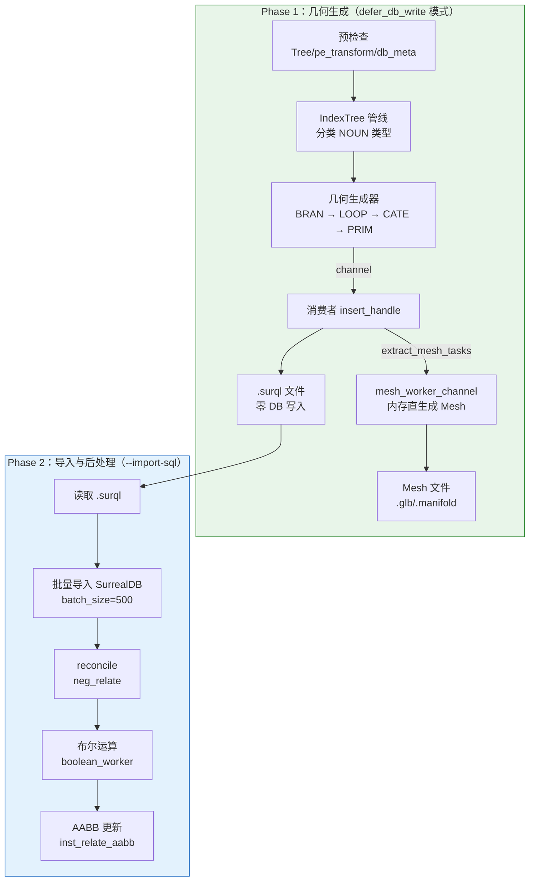
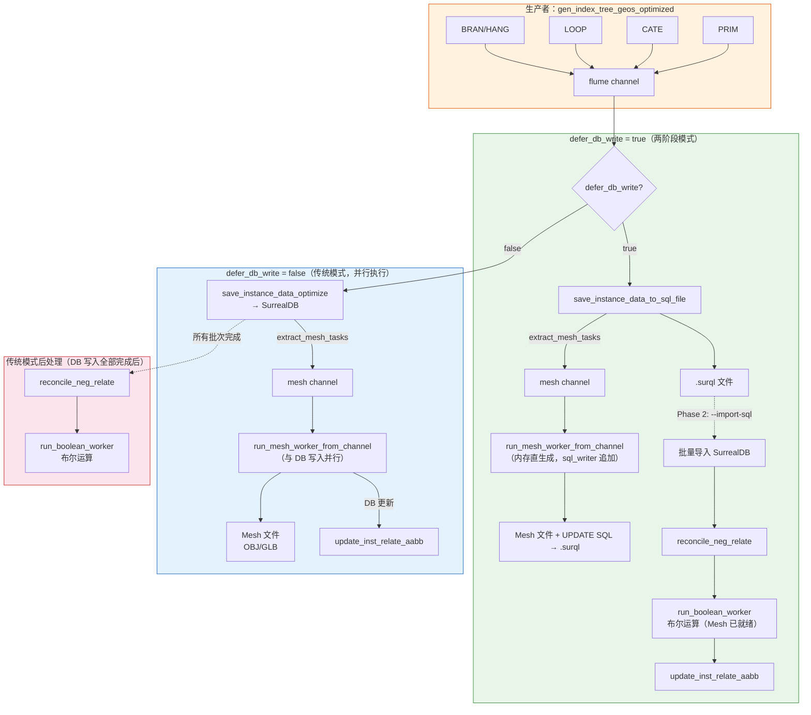
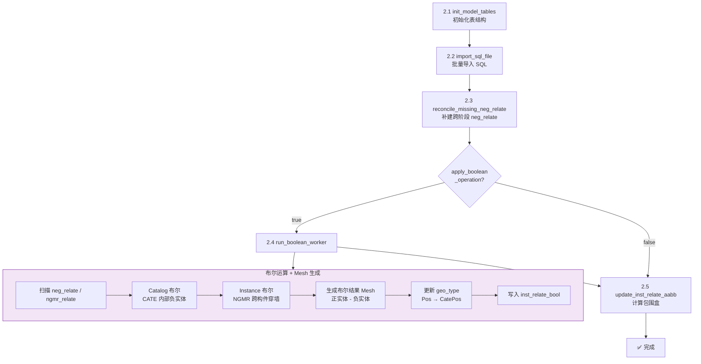
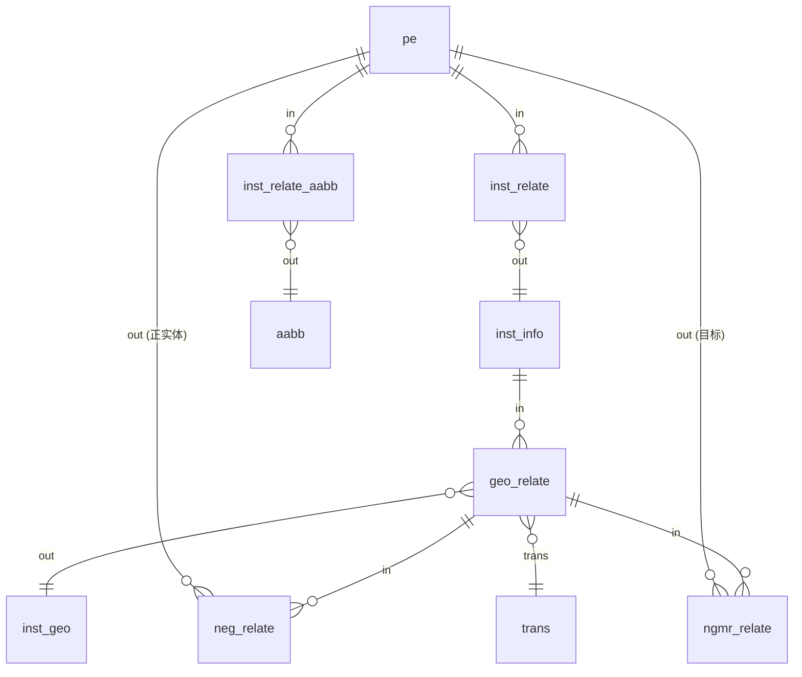

# 模型生成流程

> 最后更新：2026-02-28

## 概述

模型生成采用**两阶段分离架构**：Phase 1 生成几何数据并输出 `.surql` 文件（不写 SurrealDB），同时**从内存直接生成 Mesh 文件**（零 DB 查询）；Phase 2 将 `.surql` 导入 SurrealDB 并执行布尔运算等后处理。

这种设计将 CPU 密集的几何计算与 IO 密集的数据库写入解耦，便于调试、回放和性能分析。Mesh 在 Phase 1 内存中直接生成，避免了 Phase 2 再从 DB 查询 geo_param 的冗余操作。

## 架构总览



### 生产者-消费者管线详图



### Mesh 生成机制

两种模式下 Mesh 均在 Phase 1 从**内存直接生成**，不查询 DB 获取 geo_param：

| 模式 | Mesh 生成时机 | 触发方式 | DB 更新写入 |
|------|-------------|----------|------------|
| **传统模式** | Phase 1，与 DB 写入**并行** | `save_instance_data_optimize` 后 `extract_mesh_tasks` → mesh channel → `run_mesh_worker_from_channel` | 直接执行到 SurrealDB |
| **两阶段模式** | Phase 1，与 .surql 写入**并行** | `save_instance_data_to_sql_file` 后 `extract_mesh_tasks` → mesh channel → `run_mesh_worker_from_channel(sql_writer)` | 追加到 `.surql` 文件 |

两阶段模式下，`run_mesh_worker_from_channel` 接收可选的 `SqlFileWriter` 参数：
- Mesh 文件（.glb/.manifold）直接写入磁盘
- `UPDATE inst_geo SET meshed=true, aabb=...` 和 `INSERT IGNORE INTO aabb/vec3` 追加到 `.surql` 文件
- Phase 2 的 `run_boolean_worker` 可直接读取已生成的 Mesh 文件做布尔运算

### Phase 2 后处理流程



### 数据表关系图



## Phase 1：几何生成

### 入口

```bash
cargo run --bin aios-database -- --debug-model <REFNO> --regen-model --export-obj
```

主入口函数：`orchestrator.rs::gen_all_geos_data`

### 配置

在 `DbOption.toml` 中设置：

```toml
use_surrealdb = true
defer_db_write = true    # 启用两阶段模式
gen_model = true
gen_mesh = true
apply_boolean_operation = true
```

### 执行流程

#### 1. 预检查（Precheck）

由 `precheck_coordinator::run_precheck` 执行：

- 检查 `output/{project}/scene_tree/{dbnum}.tree` 文件存在
- 检查 `pe_transform` 变换数据就绪
- 检查 `db_meta_info.json` 数据库元数据已加载

#### 2. IndexTree 管线初始化

```
配置解析 → 创建 flume::bounded channel → 初始化 SqlFileWriter
```

- `SqlFileWriter` 输出路径：`output/{project}/deferred_sql/{timestamp}_all.surql`
- `defer_db_write=true` 时跳过 `init_model_tables`（Phase 2 负责）

#### 3. 生产者-消费者模型

**生产者**：`gen_index_tree_geos_optimized`

按 NOUN 类型分阶段并行生成几何数据：

| 阶段 | 类型 | 说明 |
|------|------|------|
| Phase 1 | BRAN/HANG | 管道与支吊架（含复杂拓扑） |
| Phase 2-1 | LOOP | 循环图形 |
| Phase 2-2 | CATE | 元件库定义件 |
| Phase 2-3 | PRIM | 基本几何体（CYL/BOX/SPHE 等） |

每个批次生成 `ShapeInstancesData`，通过 channel 发送给消费者。

**消费者**：`insert_handle`

接收 `ShapeInstancesData` 后，根据模式分叉：

| 条件 | 行为 |
|------|------|
| `defer_db_write = true` | 调用 `save_instance_data_to_sql_file` → 写入 `.surql` |
| `use_surrealdb = true` | 调用 `save_instance_data_optimize` → 直写 SurrealDB |

#### 4. SQL 文件写入逻辑

`save_instance_data_to_sql_file`（`pdms_inst.rs`）与 `save_instance_data_optimize` 逻辑完全对应，区别在于：

- 所有 SQL 写入 `SqlFileWriter` 而非执行到 SurrealDB
- `inst_relate` 中的 `fn::find_ancestor_type` / `fn::ses_date` 替换为 `InstRelatePrecomputed` 预计算的常量值

写入的 SQL 语句按**依赖顺序**排列：

1. **DELETE**（`replace_exist=true` 时）：`inst_relate` → `inst_relate_bool` → `inst_geo` → `geo_relate` → `neg_relate/ngmr_relate`
2. **INSERT inst_geo**：几何体参数数据
3. **INSERT RELATION geo_relate**：`inst_info → inst_geo` 关系
4. **INSERT RELATION neg_relate**：负实体切割关系
5. **INSERT RELATION ngmr_relate**：NGMR 跨构件切割关系
6. **INSERT inst_info**：实例信息（ptset、visible 等）
7. **INSERT RELATION inst_relate**：`pe → inst_info` 关系
8. **INSERT trans**：变换矩阵
9. **INSERT vec3**：三维向量

#### 5. Mesh 内存直生成

消费者将 `ShapeInstancesData` 写入 `.surql` 后，同时通过 `extract_mesh_tasks` 提取 `MeshTask`（`geo_hash` + `geo_param` + `is_neg`），发送到 mesh channel。`run_mesh_worker_from_channel` 并行消费：

- 调用 `generate_csg_mesh(geo_param)` 生成网格（零 DB 查询）
- 正实体 → `assets/meshes/lod_L1/`，负实体 → `assets/meshes/neg/`
- DB 更新语句（`UPDATE inst_geo SET meshed=true`）追加到 `.surql`
- `INSERT IGNORE INTO aabb/vec3` 也追加到 `.surql`

#### 6. Phase 1 输出

```
output/{project}/deferred_sql/{timestamp}_all.surql    # SQL 语句文件（含 mesh 更新）
assets/meshes/lod_L1/*.glb                              # 正实体 Mesh 文件
assets/meshes/neg/*.manifold                            # 负实体 Mesh 文件
test_output/debug_{refno}_*.obj                        # OBJ 导出（如启用）
```

## Phase 2：导入与后处理

### 入口

```bash
cargo run --bin aios-database -- --import-sql output/{project}/deferred_sql/{timestamp}_all.surql
```

实现位置：`main.rs`（`import-sql` 分支）

### 执行流程

| 步骤 | 操作 | 说明 |
|------|------|------|
| 2.1 | `init_model_tables` | 初始化/确认表结构和索引 |
| 2.2 | `import_sql_file` | 批量导入 SQL（batch_size=500，含重试） |
| 2.3 | `reconcile_missing_neg_relate` | 补建跨阶段缺失的 neg_relate |
| 2.4 | `run_boolean_worker` | 执行布尔运算（catalog + instance 级） |
| 2.5 | `update_inst_relate_aabb` | 计算并写入 AABB 包围盒 |

### 布尔运算详情

`boolean_worker` 从数据库查询 `neg_relate` / `ngmr_relate`，按依赖顺序执行：

1. **Catalog 布尔**：处理 CATE 级别的负实体（同一元件内部）
2. **Instance 布尔**：处理跨构件的负实体（NGMR 穿墙等）
3. 更新 `geo_relate.geo_type`（`Pos → CatePos`）
4. 写入 `inst_relate_bool` 布尔状态记录

### SQL 导入机制

`import_sql_file`（`sql_file_writer.rs`）：

- 按 `batch_size` 条语句为一个事务块执行
- 自动重试（最多 3 次，指数退避）
- 跳过注释行（`--` 开头）和空行
- 返回 `(成功数, 失败数)` 用于诊断

## 关键数据表

| 表名 | 类型 | 关系方向 | 说明 |
|------|------|----------|------|
| `inst_geo` | 普通表 | - | 几何体参数（geo_hash 为 ID） |
| `inst_info` | 普通表 | - | 实例信息（ptset、visible） |
| `geo_relate` | 关系表 | `inst_info → inst_geo` | 几何关系，含 geo_type/trans |
| `inst_relate` | 关系表 | `pe → inst_info` | PE 到实例，含 zone/owner 等 |
| `neg_relate` | 关系表 | `geo_relate → pe` | 负实体切割 |
| `ngmr_relate` | 关系表 | `geo_relate → pe` | NGMR 跨构件切割 |
| `inst_relate_bool` | 普通表 | - | 布尔运算状态 |
| `inst_relate_aabb` | 关系表 | `pe → aabb` | 包围盒关系 |
| `trans` | 普通表 | - | 变换矩阵（hash 去重） |
| `aabb` | 普通表 | - | 包围盒数据 |
| `vec3` | 普通表 | - | 三维向量数据 |

### geo_type 语义

| geo_type | 含义 | 是否导出 |
|----------|------|----------|
| `Pos` | 原始几何 | ✅ |
| `DesiPos` | 设计位置 | ✅ |
| `CatePos` | 布尔运算后结果 | ✅ |
| `Compound` | 组合几何体 | ❌ |
| `CataNeg` / `CataCrossNeg` | 负实体 | ❌ |

## CLI 命令速查

```bash
# Phase 1：生成 .surql（默认，defer_db_write=true）
cargo run --bin aios-database -- --debug-model 17496_106028 --regen-model --export-obj

# Phase 2：导入 DB + 布尔运算
cargo run --bin aios-database -- --import-sql output/AvevaMarineSample/deferred_sql/<file>.surql

# 传统模式：一步到位直写 SurrealDB（需配置 defer_db_write=false 或加 CLI 参数）
cargo run --bin aios-database -- --debug-model 17496_106028 --regen-model --export-obj
```

## 相关源文件

| 文件 | 职责 |
|------|------|
| `src/fast_model/gen_model/orchestrator.rs` | 主编排器，管线控制 |
| `src/fast_model/gen_model/pdms_inst.rs` | `save_instance_data_optimize` / `save_instance_data_to_sql_file` |
| `src/fast_model/gen_model/sql_file_writer.rs` | SqlFileWriter + import_sql_file |
| `src/fast_model/gen_model/index_tree_mode.rs` | IndexTree 管线核心逻辑 |
| `src/fast_model/gen_model/mesh_generate.rs` | mesh_worker_from_channel / boolean_worker / extract_mesh_tasks |
| `src/options.rs` | DbOptionExt 配置解析 |
| `src/main.rs` | CLI 入口（`--import-sql` / `--defer-db-write`） |
