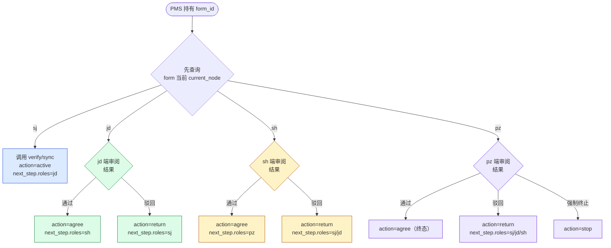

# Workflow Action 接入指南（给 PMS 调用方）

本文档面向 **外部 PMS / 上游系统**，说明如何正确调用 `/api/review/workflow/verify` 与
`/api/review/workflow/sync` 两个接口，避免最常见的 "wrong-node-for-this-action"
软阻断错误。

> 配套源码：`src/web_api/platform_api/workflow_sync.rs` / `annotation_check.rs`。
> 错误文案以及节点字典请以源码 `get_node_display_name` 为准。

---

## 1. 流程模型

三维校审 form 的生命周期由 4 个节点组成：

| 节点代码 | 中文名 | 含义 |
|---|---|---|
| `sj` | 编制 | 创建中/草稿，由编制人持有 |
| `jd` | 校对 | 已送审，由校核人持有 |
| `sh` | 审核 | 已校对，由审核人持有 |
| `pz` | 批准 | 已审核，由批准人持有；批准后进入终态 |

合法的 action 与节点关系：

| action | 允许的 `current_node` | 推进结果 | 语义 |
|---|---|---|---|
| `active` | `sj` | `sj → jd` | 编制人发起送审 |
| `agree` | `jd` / `sh` / `pz` | `jd→sh` / `sh→pz` / `pz` 终态完成 | 同意并推进到下一节点 |
| `return` | `jd` / `sh` / `pz` | 回退到比当前更早的节点 | 驳回（必须显式指定 `next_step.roles` 为回退目标） |
| `stop` | `jd` / `sh` / `pz` | 直接终态 | 强制终止流程 |

任何不满足上述配对关系的调用都会返回 **HTTP 200 + `passed=false` + `recommended_action="block"`**。

---

## 2. 推荐调用流程



**关键点**：**调用 verify/sync 前必须先知道 form 当前 `current_node`**。可以从：

- `/api/review/embed-url` 响应里的 `data.lineage.current_node`
- PMS 本地维护的 form 节点缓存（建议每次 sync 成功后更新）

---

## 3. 常见错误与排查

### 3.1 `active 仅在 form 当前节点为 sj（编制）时允许`

```json
{
  "code": 200,
  "data": {
    "passed": false,
    "action": "active",
    "current_node": "jd",
    "reason": "active 仅在 form 当前节点为 sj（编制）时允许；当前 form 节点为 jd（校对）。若需重新送审，请先 return 驳回到 sj。",
    "recommended_action": "block"
  }
}
```

| 触发场景 | 修复方案 |
|---|---|
| form 已被 active 过一次，PMS 不知情又发了一次 | 同步 form `current_node` 后再决定调用哪个 action |
| 希望"重新送审" | 先 `action=return next_step.roles=sj` 驳回，再 `action=active next_step.roles=jd` |
| 希望直接通过 jd → sh | 改用 `action=agree next_step.roles=sh` |

### 3.2 `agree/return/stop 仅在 form 当前节点为 jd/sh/pz 时允许`

form 还在 `sj` 节点。先调 `action=active` 推进到 `jd` 后再继续后续审阅。

### 3.3 `agree 从 X 仅允许推进到 Y，收到 Z`

`next_step.roles` 不是按合法路径填写。请按下表对齐：

| `current_node` | `next_step.roles` 必填 |
|---|---|
| `sj` 上调 `active` | `jd` |
| `jd` 上调 `agree` | `sh` |
| `sh` 上调 `agree` | `pz` |
| `pz` 上调 `agree` | 无需填 `next_step`（终态） |
| `*` 上调 `return` | 比 `current_node` 更早的节点 |

### 3.4 `权限不足：当前请求人 X 不是 Y 节点负责人 Z`

`actor.id` 与节点真实负责人不一致。在 **internal / manual** 模式下属于硬阻断；
**external** 模式（token 的 `workflow_mode=external` 或请求体显式带 `workflow_mode=external`）
下 owner 校验会被跳过。

---

## 4. 鉴权与 workflow_mode

| 模式 | token 来源 | owner 校验 | next_step.assignee_id 校验 |
|---|---|---|---|
| `internal` | JWT 中 `workflow_mode=internal` 或 debug_token 模式 | 严格：必须等于节点 PMS HumanCode | 必须是合法 PMS HumanCode |
| `manual` | JWT 中 `workflow_mode=manual` | 严格（同 internal） | 必须是合法 PMS HumanCode |
| `external` | JWT 中 `workflow_mode=external`（也是默认） | 跳过 | 透传调用方提供的字符串 |

建议 PMS 走 `external` 模式（默认），把"谁是节点负责人"完全交给 PMS 自己维护，
平台侧不再做内部账号映射。

---

## 5. 调用样例

### 5.1 active（sj → jd）

```bash
curl -X POST http://<host>/api/review/workflow/sync \
  -H "content-type: application/json" \
  -d '{
    "form_id": "FORM-XXXXXXXXXXXX",
    "token": "<jwt>",
    "action": "active",
    "workflow_mode": "external",
    "actor":    { "id": "SJ_USER", "name": "编制人", "roles": "sj" },
    "next_step": { "assignee_id": "JD_USER", "name": "校核人", "roles": "jd" }
  }'
```

### 5.2 agree（jd → sh）

```bash
curl -X POST http://<host>/api/review/workflow/sync \
  -H "content-type: application/json" \
  -d '{
    "form_id": "FORM-XXXXXXXXXXXX",
    "token": "<jwt>",
    "action": "agree",
    "workflow_mode": "external",
    "actor":    { "id": "JD_USER", "name": "校核人", "roles": "jd" },
    "next_step": { "assignee_id": "SH_USER", "name": "审核人", "roles": "sh" }
  }'
```

### 5.3 return（jd → sj 驳回）

```bash
curl -X POST http://<host>/api/review/workflow/sync \
  -H "content-type: application/json" \
  -d '{
    "form_id": "FORM-XXXXXXXXXXXX",
    "token": "<jwt>",
    "action": "return",
    "workflow_mode": "external",
    "actor":    { "id": "JD_USER", "name": "校核人", "roles": "jd" },
    "next_step": { "assignee_id": "SJ_USER", "name": "编制人", "roles": "sj" },
    "comments": "需要补充模型..."
  }'
```

---

## 6. 干跑（verify）vs 落库（sync）

- `/api/review/workflow/verify` ：**不写库**，仅做合法性 + 批注门禁 + owner 校验，
  返回 `passed=true/false` 与诊断字段。**推荐 PMS 在 UI 上"提交"按钮被点击时先调 verify，
  把可能的软阻断展示给用户后再调 sync**。
- `/api/review/workflow/sync` ：**落库**，把流程节点真正推进。

两者请求体 schema 完全一致，仅 endpoint 不同。
