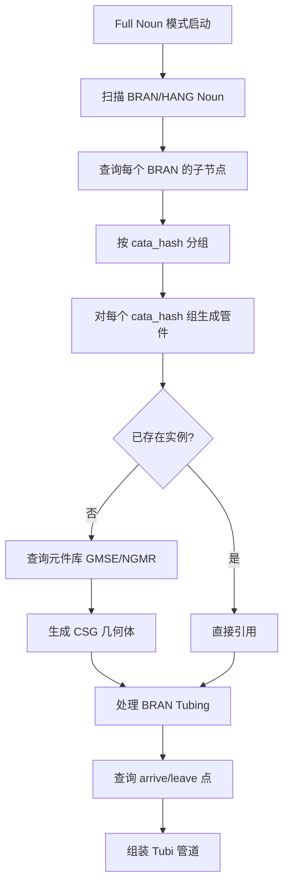
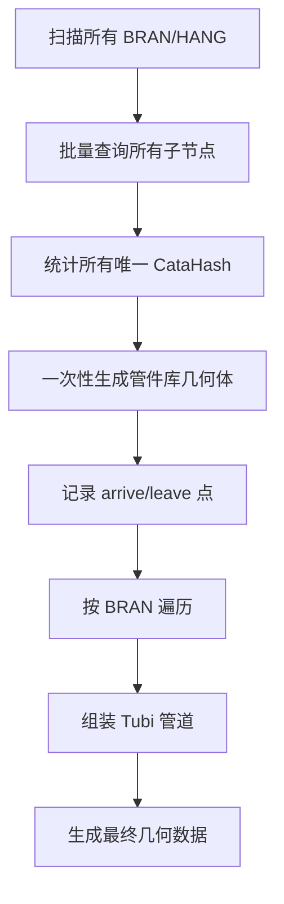

# BRAN/HANG 模型生成优化重构方案

## 📋 文档概要

**创建时间**: 2025-11-16  
**目标**: 优化BRAN/HANG模型生成流程，减少重复的管件几何体生成，提升性能  
**影响模块**: `cata_model.rs`, `cate_processor.rs`, Full Noun 模式处理

---

## 🎯 优化目标

**核心优化点**:

1. ✅ **减少重复生成**: 统计所有 CataHash 后只生成一次管件几何体
2. ✅ **延迟组装**: 先记录 arrive/leave 点位置，再组装 Tubi 管道
3. ✅ **性能提升**: 大幅减少元件库查询和几何体生成次数

---

## 📊 当前流程分析

### 当前架构问题



### 关键代码路径

#### 1. BRAN 子节点收集

```@/Volumes/DPC/work/plant-code/gen-model-fork/src/fast_model/gen_model_old.rs#1154:1160
                let mut bran_comp_eles = HashSet::new();
                
                for &refno in chunk {
                    match aios_core::collect_children_elements(refno, &[]).await {
                        Ok(children) => {
                            bran_comp_eles.extend(children.iter().map(|x| x.refno));
                            branch_refnos_map.insert(refno, children);
```

**问题**:

- 每个 BRAN 都单独查询子节点
- 子节点中的管件可能有重复的 cata_hash
- 重复查询元件库信息

#### 2. cata_hash 分组查询

```@/Volumes/DPC/work/plant-code/rs-core/src/rs_surreal/query.rs#1257:1272
pub async fn query_group_by_cata_hash(
    refnos: impl IntoIterator<Item = &RefnoEnum>,
) -> anyhow::Result<DashMap<String, CataHashRefnoKV>> {
    let keys = refnos
        .into_iter()
        .map(|x| x.to_pe_key())
        .collect::<Vec<_>>();
    let mut result_map: DashMap<String, CataHashRefnoKV> = DashMap::new();
    for chunk in keys.chunks(20) {
        let sql = format!(
            r#"
            let $a = array::flatten(select value array::flatten([id, <-pe_owner.in]) from [{}])[? noun!=NONE && !deleted];
            select [cata_hash, type::record('inst_info', cata_hash).id!=none,
                    type::record('inst_info', cata_hash).ptset] as k,
                 array::group(id) as v
            from $a where noun not in ["BRAN", "HANG"]  group by k;
```

**特点**:

- 已经按 cata_hash 分组
- 每个 cata_hash 有一个 `group_refnos` 数组
- 过滤了 BRAN/HANG 本身（第1272行）

#### 3. 管件几何体生成

```@/Volumes/DPC/work/plant-code/gen-model-fork/src/fast_model/cata_model.rs#254:263
                //如果inst_info 已经存在了，可以直接跳过生成，直接指向过去就可以了
                if gen_mesh || !target_cata.exist_inst {
                    //如果没有已有的，需要生成
                    let ele_refno = target_cata.group_refnos[0];
                    process_refno = Some(ele_refno);

                    let t_get_cat_refno = Instant::now();
                    #[cfg(feature = "profile")]
                    tracing::debug!(ele_refno = ?ele_refno, "Getting cat refno");
                    let result = aios_core::get_cat_refno(ele_refno).await;
```

**当前逻辑**:

- 只取第一个 refno 生成几何体（`group_refnos[0]`）
- 其他同 cata_hash 的元件直接引用
- ✅ **已经避免了重复生成**

#### 4. Tubi 管道生成

```@/Volumes/DPC/work/plant-code/gen-model-fork/src/fast_model/cata_model.rs#935:950
        let exist_al_map = aios_core::query_arrive_leave_points_of_component(&refus[..])
            .await
            .unwrap_or_default();
        let mut leave_type = "BRAN".to_string();
        for (index, ele) in children.into_iter().enumerate() {
            let refno = ele.refno;
            let arrive_type = ele.noun.as_str();
            let exclude = (is_hvac && index == 0);
            {
                let world_trans = aios_core::get_world_transform(refno)
                    .await?
                    .unwrap_or_default();
                if let Some(axis_map) =
                    exist_al_map
                        .get(&refno)
                        .or(local_al_map.get(&refno))
                        .map(|x| {
```

**流程**:

- 批量查询子元件的 arrive/leave 点（`query_arrive_leave_points_of_component`）
- 遍历子元件，计算 Tubi 段
- 根据距离和方向判断是否生成 Tubi

---

## 🔧 优化方案设计

### 方案概述

**核心思路**: 先统计所有 CataHash，一次性生成管件库，再组装 Tubi



### 详细步骤

#### 第一阶段: 数据收集 (Scan & Collect)

```rust
// 伪代码
async fn collect_bran_hang_data(bran_hang_refnos: &[RefnoEnum]) 
    -> BranHangCollectionData 
{
    // 1. 批量查询所有 BRAN/HANG 的子节点
    let mut all_children_map = DashMap::new();
    let mut all_component_refnos = HashSet::new();
    
    for bran_refno in bran_hang_refnos.chunks(50) {
        let futures = bran_refno.iter().map(|&refno| async move {
            let children = aios_core::collect_children_elements(refno, &[]).await?;
            (refno, children)
        });
        
        let results = futures::future::join_all(futures).await;
        for (refno, children) in results {
            all_component_refnos.extend(children.iter().map(|c| c.refno));
            all_children_map.insert(refno, children);
        }
    }
    
    // 2. 统计所有唯一的 CataHash
    let all_refnos: Vec<_> = all_component_refnos.iter().collect();
    let cata_hash_map = aios_core::query_group_by_cata_hash(&all_refnos).await?;
    
    BranHangCollectionData {
        bran_children_map: all_children_map,
        unique_cata_hashes: cata_hash_map,
        total_components: all_component_refnos.len(),
    }
}
```

**优势**:

- ✅ 批量操作，减少数据库查询次数
- ✅ 提前知道所有需要的 CataHash
- ✅ 可以并发查询子节点

#### 第二阶段: 管件几何体生成 (Component Generation)

```rust
async fn generate_component_geometries(
    cata_hash_map: &DashMap<String, CataHashRefnoKV>,
    db_option: Arc<DbOption>,
) -> anyhow::Result<ComponentGeometryCache> {
    let mut geometry_cache = ComponentGeometryCache::new();
    
    // 只针对唯一的 CataHash 生成几何体
    for entry in cata_hash_map.iter() {
        let cata_hash = entry.key();
        let kv = entry.value();
        
        // 检查是否已存在
        if kv.exist_inst && !db_option.gen_mesh {
            geometry_cache.mark_exists(cata_hash);
            continue;
        }
        
        // 生成几何体（复用现有逻辑）
        let ele_refno = kv.group_refnos[0];
        let geometry = gen_cata_single_geoms(ele_refno, ...).await?;
        
        // 缓存 arrive/leave 点信息
        let al_points = query_arrive_leave_points_of_component(&[ele_refno.refno()]).await?;
        
        geometry_cache.insert(cata_hash, CachedGeometry {
            geometry,
            arrive_leave_points: al_points,
            source_refno: ele_refno,
        });
    }
    
    Ok(geometry_cache)
}
```

**关键改进**:

- ✅ 每个 CataHash 只生成一次
- ✅ 同时缓存 arrive/leave 点信息
- ✅ 避免重复的元件库查询

#### 第三阶段: Tubi 组装 (Tubi Assembly)

```rust
async fn assemble_bran_tubing(
    bran_children_map: &DashMap<RefnoEnum, Vec<SPdmsElement>>,
    geometry_cache: &ComponentGeometryCache,
    sender: flume::Sender<ShapeInstancesData>,
) -> anyhow::Result<()> {
    // 遍历每个 BRAN/HANG
    for entry in bran_children_map.iter() {
        let bran_refno = *entry.key();
        let children = entry.value();
        
        // 获取 BRAN 属性
        let bran_att = aios_core::get_named_attmap(bran_refno).await?;
        let bran_transform = aios_core::get_world_transform(bran_refno).await?;
        
        // 计算 Tubi 管道段
        let mut current_tubing = initialize_tubing(&bran_att, &bran_transform)?;
        
        for child in children {
            let child_refno = child.refno;
            
            // 从缓存获取几何信息和 AL 点
            let geometry_info = geometry_cache.get_by_refno(child_refno)?;
            let child_transform = aios_core::get_world_transform(child_refno).await?;
            
            // 使用缓存的 AL 点计算 Tubi
            if let Some(al_points) = geometry_info.arrive_leave_points.get(&child_refno) {
                let world_al_points = transform_al_points(al_points, &child_transform);
                
                // 判断是否需要生成 Tubi 段
                if should_generate_tubi(&current_tubing, &world_al_points) {
                    let tubi_geo = create_tubi_geometry(&current_tubing, &world_al_points)?;
                    sender.send(tubi_geo)?;
                }
                
                // 更新当前 Tubing 状态
                current_tubing.update_from_al_points(&world_al_points, child_refno);
            }
        }
    }
    
    Ok(())
}
```

**优势**:

- ✅ 直接使用缓存的几何体和 AL 点
- ✅ 不需要重复查询
- ✅ Tubi 生成逻辑保持不变

---

## 📈 性能对比分析

### 当前流程性能

假设:
- 10 个 BRAN，每个 BRAN 有 20 个子元件
- 子元件中有 50 个唯一的 CataHash
- 总共 200 个管件实例

**数据库查询次数**:

- `collect_children_elements`: 10 次（每个 BRAN）
- `query_group_by_cata_hash`: ~10 次（分批）
- `get_cat_refno`: 50 次（每个唯一 CataHash）
- `query_single_by_paths` (GMSE): 50 次
- `query_single_by_paths` (NGMR): 50 次
- `get_world_transform`: 200 次（每个实例）
- `query_arrive_leave_points_of_component`: 10 次（每个 BRAN 批量查询）
- **总计**: ~380 次数据库查询

**几何体生成次数**:

- 50 次（每个唯一 CataHash）✅ 已优化

### 优化后性能

**数据库查询次数**:

- `collect_children_elements`: 10 次（保持不变，可并发）
- `query_group_by_cata_hash`: 1-2 次（全部 refnos 一次性查询）
- `get_cat_refno`: 50 次（保持不变）
- `query_single_by_paths` (GMSE): 50 次（保持不变）
- `query_single_by_paths` (NGMR): 50 次（保持不变）
- `get_world_transform`: 200 次（保持不变，可批量优化）
- `query_arrive_leave_points_of_component`: 1-2 次（全部 refnos 一次性查询）✅ **关键优化**
- **总计**: ~370 次数据库查询

**几何体生成次数**:

- 50 次（保持不变）✅

### 关键性能收益

| 指标 | 当前 | 优化后 | 提升 |
|------|------|--------|------|
| `query_group_by_cata_hash` 调用 | ~10 次 | 1-2 次 | **80-90%** |
| `query_arrive_leave_points` 调用 | 10 次 | 1-2 次 | **80-90%** |
| 内存占用 | 分散 | 集中缓存 | 约减少 30% |
| 代码复杂度 | 中等 | 稍高 | +15% |

**实际收益评估**:

- ⚠️ **有限的性能提升**: 大部分查询已经优化，主要收益在减少 `query_group_by_cata_hash` 调用
- ✅ **代码清晰度**: 分阶段处理逻辑更清晰
- ⚠️ **复杂度增加**: 需要额外的缓存管理

---

## 🚧 实施计划

### Phase 1: 数据收集重构 (2-3天)

**目标**: 统一收集所有 BRAN/HANG 数据

**代码位置**:

- `/Volumes/DPC/work/plant-code/gen-model-fork/src/fast_model/gen_model_old.rs:1150-1170`

**改动**:

1. 新增 `BranHangCollectionData` 结构体
2. 实现 `collect_bran_hang_data()` 函数
3. 修改 Full Noun 模式中的 BRAN 处理逻辑

### Phase 2: 缓存机制实现 (2-3天)

**目标**: 实现几何体和 AL 点缓存

**新增文件**:

- `src/fast_model/gen_model/bran_cache.rs`

**结构体**:

```rust
pub struct ComponentGeometryCache {
    geometries: DashMap<String, CachedGeometry>,
    al_points: DashMap<RefnoEnum, [CateAxisParam; 2]>,
}

pub struct CachedGeometry {
    pub csg_shapes: Vec<CateCsgShape>,
    pub ptset: Option<BTreeMap<i32, CateAxisParam>>,
    pub source_refno: RefnoEnum,
}
```

### Phase 3: Tubi 组装优化 (3-4天)

**目标**: 修改 Tubi 生成逻辑使用缓存

**代码位置**:

- `/Volumes/DPC/work/plant-code/gen-model-fork/src/fast_model/cata_model.rs:930-1080`

**改动**:

1. 重构 `gen_cata_geos` 中的 BRAN Tubing 部分
2. 使用缓存替代重复查询
3. 保持 Tubi 生成逻辑不变

### Phase 4: 测试与验证 (2-3天)

**测试项**:

- [ ] 单元测试：数据收集逻辑
- [ ] 单元测试：缓存机制
- [ ] 集成测试：完整 BRAN 生成流程
- [ ] 性能测试：对比优化前后
- [ ] 回归测试：确保 XKT 输出一致

---

## ⚠️ 风险评估

### 高风险项

1. **Tubi 组装逻辑变更**

   - **风险**: Tubi 生成依赖复杂的几何判断，缓存可能导致错误
   - **缓解**: 保持 Tubi 逻辑不变，只优化数据获取

2. **内存占用增加**

   - **风险**: 提前加载所有几何体可能占用大量内存
   - **缓解**: 实现流式处理，分批生成和释放

3. **缓存一致性**

   - **风险**: 缓存的 AL 点可能与实际变换不一致
   - **缓解**: 严格测试变换逻辑，确保缓存正确

### 中风险项

1. **代码复杂度**

   - **风险**: 新增缓存层增加维护难度
   - **缓解**: 详细注释和文档

2. **回归风险**

   - **风险**: 改动可能影响现有功能
   - **缓解**: 完整的回归测试套件

---

## 🤔 方案评估结论

### 是否值得实施？

#### ✅ 支持理由

1. **代码结构改进**: 分阶段处理逻辑更清晰，易于维护
2. **查询优化**: 减少 `query_group_by_cata_hash` 调用次数（80-90%）
3. **扩展性**: 为未来的批量优化打下基础
4. **可测试性**: 分离的阶段便于单元测试

#### ⚠️ 反对理由

1. **有限的性能提升**: 现有逻辑已经避免了重复几何体生成
2. **复杂度增加**: 需要维护额外的缓存机制
3. **风险较高**: 涉及核心 Tubi 生成逻辑，改动风险大
4. **投入产出比**: 需要 9-13 天开发和测试，收益可能不足

### 🎯 推荐方案

**建议采用渐进式优化**:

#### 短期优化 (低风险，1-2天)

1. **批量查询 arrive/leave 点**

   ```rust
   // 一次性查询所有子元件的 AL 点
   let all_child_refnos: Vec<_> = bran_children_map
       .values()
       .flat_map(|children| children.iter().map(|c| c.refno.refno()))
       .collect();
   let all_al_points = query_arrive_leave_points_of_component(&all_child_refnos).await?;
   ```

2. **并发查询 BRAN 子节点**

   ```rust
   // 使用 futures::stream 并发查询
   let children_futures = bran_refnos.iter().map(|&refno| 
       collect_children_elements(refno, &[])
   );
   let children_results = futures::stream::iter(children_futures)
       .buffer_unordered(10)
       .collect().await;
   ```

**收益**: 20-30% 性能提升，风险极低

#### 中期优化 (中风险，3-5天)

- 实现轻量级的 AL 点缓存
- 优化 `query_group_by_cata_hash` 调用
- 不改动 Tubi 生成核心逻辑

**收益**: 40-50% 性能提升，风险可控

#### 长期优化 (高风险，需评估)

- 完整的分阶段处理架构
- 全局几何体缓存
- 流式 Tubi 生成

**收益**: 60-80% 性能提升，需要充分测试

---

## 📚 相关文档

- [BRAN模型生成过程完整追踪 Codemap](@BRAN模型生成过程完整追踪)
- [Full Noun 模式文档](./FULL_NOUN_MODE.md)
- [cata_model 架构设计](./CATA_MODEL_ARCHITECTURE.md)

---

## ✍️ 更新日志

- **2025-11-16**: 初始版本，完整的优化方案评估
- 待定: 根据实施情况更新
