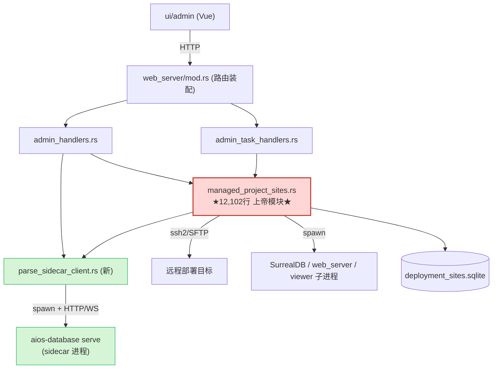

# 代码校核意见书 — `feat/multi-project-site`

> 多工程合并站点 / 站点部署打包特性分支的增量代码审查

| 项目 | 内容 |
|------|------|
| **审查对象** | 分支 `feat/multi-project-site` 相对 `origin/main` 的增量改动 |
| **Merge-base** | `7c032dc` (`chore(kv): 模型 KV 脚本切换 RocksDB`) |
| **改动规模** | 217 文件 / **+22,107** / **−6,088** / 12 commits |
| **审查范围** | 架构（分层 / 耦合 / 可维护性）+ 正确性（潜在 bug / 逻辑缺陷） |
| **审查方式** | 抽样审查（PR > 500 行，按 Brooks-Lint 指南聚焦最高风险区，非逐文件） |
| **方法论** | Iron Law：每条发现遵循 Symptom → Source → Consequence → Remedy |
| **健康评分** | **57 / 100**（1 Critical + 5 Warning + 3 Suggestion） |
| **审查日期** | 2026-06-08 |

---

## 1. 执行摘要

本分支的**总体方向是正确的**：把"读取 E3D 工程数据"的职责从控制面（`web_server`）剥离到独立的 `aios-database serve` sidecar 进程，引入 PID 复用防误杀注册表、站点配置文件降权 `0600`、端口分配的 `BEGIN IMMEDIATE` 事务保护——这些都是高质量的工程决策。

但与此同时，本分支把约 **3,000 行新逻辑继续堆进一个已经 12,102 行的"上帝模块"** `managed_project_sites.rs`，并引入了若干**进程生命周期与输入校验缺口**。结论是：**一个方向正确、但工程纪律在退化的分支**——好的解耦（sidecar 控制面/数据面分离）与坏的耦合（持续喂养上帝模块）同时发生。

**最高优先级三件事：**

1. **sidecar 孤儿进程泄漏**（运行期风险最高，长期累积）。
2. **`precheck_dbnum_conflicts` 退化为空函数**——dbnum 冲突在创建期完全不校验（坏数据可入库）。
3. **`managed_project_sites.rs` 上帝模块拆分**（最大但可分批，是其余问题的放大器）。

---

## 2. 改动概览

### 2.1 目录分布（改动文件数 Top）

| 文件数 | 目录 | 性质 |
|------:|------|------|
| 68 | `src/web_server` | **后端核心**（站点管理、部署、sidecar 客户端、admin handlers） |
| 31 | `ui/admin` | 前端（Vue admin 控制台） |
| 16 | `goals/ducklake-model-writer` | 文档/目标（跳过） |
| 12 | `resource/surreal` | SQL 资源 |
| 10 | `scripts/package` | 部署打包脚本 |
| 9 | `src/fast_model` | 模型生成 |
| 8 | `runtime/admin_sites` | 运行时配置/数据 |
| 3 | `src/web_api` | Web API 路由 |

### 2.2 后端核心文件改动量（按新增行）

| 文件 | 改动 | 当前行数 | 说明 |
|------|------|--------:|------|
| `src/web_server/managed_project_sites.rs` | **+3864 / −869** | **12,102** | 站点管理上帝模块 |
| `src/web_server/admin_handlers.rs` | +890 / −23 | 1,364 | admin HTTP handlers |
| `src/web_server/parse_sidecar_client.rs` | +634 / −0 | 585 | **新增** sidecar 客户端 |
| `src/fast_model/export_model/export_dbnum_instances_parquet.rs` | +455 / −1 | — | parquet 导出 |
| `src/web_server/models.rs` | +170 / −3 | 2,775 | 领域模型（含 `SiteProject`） |
| `src/web_server/model_runtime.rs` | +108 / −2 | 314 | 运行期实例查询 |
| `src/web_server/mod.rs` | +90 / −30 | 1,666 | 路由装配 |
| `src/web_server/admin_task_handlers.rs` | +72 / −29 | 982 | admin 任务 handlers |

### 2.3 审查跳过项

- 构建产物：`Cargo.lock`、`src/web_server/static/admin/assets/*.js`（前端打包产物）
- 文档：`*.md`、`goals/**`、`docs/**`
- 临时文件：`.tmp-*.png`

---

## 3. 架构评估

### 3.1 并发与持久化模型（合理）

`managed_project_sites.rs` 采用：

- 全局操作锁 `site_op_lock(): &'static Mutex<()>`——create/update/start/stop 写流程互斥；
- 全局共享连接 `shared_conn(): &'static Mutex<Connection>`（WAL + `busy_timeout=5000` + `foreign_keys=ON`）；
- `with_tx` 用 `BEGIN IMMEDIATE` 包裹写事务，失败 `ROLLBACK`；
- `_with_conn` 命名约定：所有需要在事务内调用的函数都接收 `&Connection` 参数，**避免了对不可重入 `std::sync::Mutex` 的二次加锁死锁**。

锁顺序一致（`site_op_lock` → `shared_conn`），`create_site` 等路径验证无误。**这是本分支做得扎实的部分。**

### 3.2 控制面 / 数据面解耦（良好方向）

`parse_sidecar_client.rs` 把工程扫描、parse 预览、db_file→dbnum 解析、db-index 重建、CLI job 执行全部代理到独立 `aios-database serve` sidecar：

- `web_server` 不再读取 E3D 数据（`scan_projects_under_root` 直接 `bail!` 指向 sidecar）；
- sidecar 以独立端口 + Bearer token 鉴权，job 类用 24h 超时 client，普通类用 30s。

**这是正确的职责切分。** 但解耦尚未完成——上帝模块仍在，且本分支继续向其堆积逻辑（见 4.1）。

### 3.3 模块依赖关系



---

## 4. 详细发现

> 排序：Critical → Warning → Suggestion。每条遵循 Iron Law。

### 🔴 Critical

#### C-1　`managed_project_sites.rs` 已成 12,102 行上帝模块，本分支继续 +3,864/−869

- **Symptom**：单文件 12,102 行、100+ 顶层自由函数，同时承担 ≥6 类完全不同职责：
  - SQLite schema + 迁移（`SCHEMA_VERSION = 8`，`ensure_schema_with_conn` ~2031–2360）
  - TOML 配置生成（`build_site_config` / `build_parse_config` / `build_generation_config`）
  - 端口分配（`resolve_create_ports_with_conn` / `first_available_port`）
  - 子进程生命周期（SurrealDB/web/viewer/npm 启停杀，`Command::new` 散布于 5757/7726/7764/8033）
  - systemd / nginx 管理（8399–8632）
  - 原生 ssh2 / SFTP 远程部署（`connect_native_ssh` / `upload_file_native`，9920–10110）
  - 连通性 / 资源探测（`probe_site_connectivity` / `resource_sampler`）
- **Source**：Ousterhout — *A Philosophy of Software Design* (Ch.4 Modules Should Be Deep)；Fowler — *Refactoring* (Divergent Change)；Brooks — *The Mythical Man-Month* (Conceptual Integrity)。
- **Consequence**：任何站点相关改动都要在该文件穿行，编译 / 审查 / 合并冲突成本极高，新人无法建立心智模型。本分支净增约 3,000 行（+33%）正是"持续恶化"的实证。
- **Remedy**：按职责拆 `mod`：`persistence`(SQLite+schema)、`config_writer`(TOML)、`process`(spawn/kill/port)、`remote_deploy`(ssh2/sftp)、`probe`(连通性/资源)、`api`(对外 `pub fn`)。**第一刀建议切边界最清晰的 ssh2/SFTP 远程部署段（约 9920–10110，~1,200 行）。**

---

### 🟡 Warning

#### W-1　`precheck_dbnum_conflicts` 名实不符，创建期 dbnum 冲突校验缺失

- **Symptom**：函数被掏空成 no-op，但 `create_site`（line 3210）仍在调用它：

```1007:1010:src/web_server/managed_project_sites.rs
fn precheck_dbnum_conflicts(projects: &[SiteProject]) -> Result<()> {
    let _ = projects;
    Ok(())
}
```

- **Source**：Evans — *Domain-Driven Design* (Ubiquitous Language，名实不符)；Feathers — *Working Effectively with Legacy Code*（验证缺口）。
- **Consequence**：可以把两个 dbnum 冲突的工程合并进同一站点而无任何提示，冲突要拖到 parse 阶段才暴露，存在静默覆盖数据的风险。
- **Remedy**：二选一——(a) 把 sidecar 的冲突预检真正接进 create/update（保持名实一致）；(b) 删掉该函数与调用点，并在 UI/文档显式标注"冲突在 parse 阶段校验"。当前"留一个空壳函数"是最坏选项（误导读者以为有保护）。

#### W-2　sidecar 竞态 spawn + 孤儿进程泄漏

- **Symptom**：
  - `ensure_sidecar` 释放锁后再加锁 spawn（TOCTOU，`parse_sidecar_client.rs` 358–372），并发同 key 会重复拉起；
  - `spawn_sidecar` 丢弃 Child 句柄：

```403:403:src/web_server/parse_sidecar_client.rs
    let _child = command.spawn().context("启动 aios-database sidecar 失败")?;
```

  - 非 job sidecar（scan/preview/resolve/db-index）**不传** `--shutdown-after-job`，而 `parse_sidecar.rs` 的 `schedule_shutdown_after_job` 在该标志为假时直接 return（718–719），即**无空闲自关闭**。
- **Source**：Hunt & Thomas — *The Pragmatic Programmer*（资源生命周期）；并发 TOCTOU。
- **Consequence**：长生命 sidecar 既无自关闭、句柄又被丢弃，`web_server` 无法回收；进程退出后在 Unix 被 reparent 到 init 继续运行 → 进程 / 内存 / DB 锁泄漏随运行时间累积。
- **Remedy**：`ensure_sidecar` 改为持锁内单飞(single-flight)或 per-key `OnceCell`；保存 `Child`/PID 以便显式 kill；给长生命 sidecar 加空闲超时自关闭（复用 `schedule_shutdown` 机制，传入 idle 时长）。

#### W-3　admin 端点鉴权策略不一致（Conceptual Integrity）

- **Symptom**：admin 路由分裂在两个 router。`admin_stateless_routes` 套了会话鉴权中间件：

```528:534:src/web_server/mod.rs
    let admin_stateless_routes: Router<AppState> = Router::new()
        .merge(admin_handlers::create_admin_routes())
        .merge(admin_task_handlers::create_admin_task_routes())
        .route_layer(middleware::from_fn(
            admin_auth_handlers::admin_session_middleware,
        ))
        .with_state(());
```

  但主 `app` router 直接挂了**免鉴权**高危端点：

```591:595:src/web_server/mod.rs
        // 一键部署测试（免鉴权快测）：建站→解析(单库)→生成→(可选)启动
        .route(
            "/api/admin/quick-deploy-test",
            post(admin_handlers::quick_deploy_test),
        )
```

  （`/api/surreal/kill-port` → `handlers::kill_port_processes_api` 同样位于主 router，628–631。）
- **Source**：Brooks — Conceptual Integrity；Martin — *Clean Architecture*（边界一致性）。
- **Consequence**：同为 `/api/admin/*`，鉴权策略不可预测；"建站+起进程""按端口杀进程"这类高危操作落在免鉴权侧（虽有 `quick_deploy_test_enabled()` 开关兜底，但策略分裂极易在后续迭代回归出真正的未授权漏洞）。
- **Remedy**：把所有 `/api/admin/*` 统一进单一带鉴权 router；确需免鉴权的快测走独立前缀（如 `/api/admin/insecure/...`）并默认 feature 关闭、上线构建剔除。

#### W-4　`kill_processes_on_port` 误伤无关进程

- **Symptom**：抓取端口上所有 LISTEN 的 PID 后直接 `kill_pid`，仅排除自身与 0（~6929–6946），**未经 `PROC_REGISTRY` start_token"同一进程"校验**，并经 `/api/surreal/kill-port` 暴露为 HTTP。
- **Source**：防御性编程 / 最小破坏面；与本模块既有的 PID 复用防护（start_token 注册表，7028+）自相矛盾。
- **Consequence**：若 8020–8999 区间端口恰被无关服务占用，会被连带杀掉；模块特地为防 PID 复用建了 start_token 注册表，这条路径却绕过了它。
- **Remedy**：杀端口前查托管注册表，只杀 `(site, role, pid, start_token)` 匹配项；对非托管进程仅 `warn!` 不 kill。

#### W-5　`run_cli_job_with_status` 无界轮询（liveness）

- **Symptom**：提交 job 后 `loop { sleep 500ms; get status }`（`parse_sidecar_client.rs` 209–248），无最大次数 / 总 deadline；仅靠终态（succeeded/failed/cancelled）或连接错误退出，而 job HTTP client 超时设为 **24 小时**。
- **Source**：可用性 / 活性（liveness）。
- **Consequence**：sidecar 若长期返回非终态 `running` 而不崩溃，任务永不返回，持续占用 task / 连接，最坏 24h 才兜底。
- **Remedy**：加最大轮询时长 + 指数退避；超时主动 `cancel_cli_job` 并返回失败。

---

### 🟢 Suggestion

#### S-1　`normalize_project_names` 按空白切分会切碎含空格工程名

- **Symptom**：`raw.split(|ch| ch==',' || ch==';' || ch.is_whitespace())`（770–786），工程名内含空格即被拆分成多个。
- **Source**：McConnell — *Code Complete*（输入处理边界）。
- **Consequence**：含空格的工程名（在 Windows/AVEVA 场景常见）会被错误拆分。
- **Remedy**：仅按显式分隔符（`,` / `;`）切分，名字内部空白保留、两端 `trim`。

#### S-2　PR 体量本身是 Change Propagation 信号

- **Symptom**：217 文件 / +22k / −6k 单分支，难以一次过审；`mod.rs` 注释自承历史上有过"漏挂载路由"教训（2026-04-23 pdms_transform）。
- **Source**：Fowler — *Refactoring* (Shotgun Surgery)。
- **Consequence**：评审遗漏风险高。
- **Remedy**：后续按"多工程站点 / 部署打包 / 数据浏览器 / sidecar 解析"拆成独立 PR。

#### S-3　`site_included_projects_and_dirs` 静默去重

- **Symptom**：按 lowercase name 去重（832–850），旧站点若存在同名不同路径工程，后者被静默丢弃。
- **Source**：Fowler — *Refactoring*（隐式数据丢失）。
- **Consequence**：历史数据迁移时可能悄无声息丢工程。
- **Remedy**：去重时若同名不同 `path`，记 `warn!` 或报错，不静默丢。

---

## 5. 修复路线图（建议顺序）

| 序 | 项 | 严重度 | 工作量 | 理由 |
|---|------|:----:|:----:|------|
| ① | W-2 sidecar 生命周期（泄漏） | 🟡 | 中 | 运行期风险最高，长期累积 |
| ② | W-1 `precheck_dbnum_conflicts` 名实一致 | 🟡 | 小 | 防坏数据入库，改动局部 |
| ③ | W-3 admin 路由鉴权统一 | 🟡 | 中 | 高危操作鉴权策略收敛 |
| ④ | W-4 `kill_processes_on_port` 走注册表 | 🟡 | 小 | 消除误伤 |
| ⑤ | W-5 轮询加 deadline | 🟡 | 小 | 消除挂死 |
| ⑥ | S-1 / S-3 输入边界与去重告警 | 🟢 | 小 | 顺手修 |
| ⑦ | C-1 拆分上帝模块 | 🔴 | 大 | 最大、可分批，先抽 `remote_deploy` |

---

## 6. 做得好的地方（保留并推广）

1. **控制面 / 数据面解耦**：sidecar 把 E3D 数据读取移出 `web_server`，方向正确（W-2 修掉生命周期即为优秀实现）。
2. **PID 复用防误杀**：`PROC_REGISTRY` + `start_token`（进程启动时刻）双重校验，防御性到位（需推广到 W-4 的端口杀路径）。
3. **并发正确性**：`site_op_lock` + `BEGIN IMMEDIATE` 事务关闭端口分配 TOCTOU；`_with_conn` 命名约定规避不可重入锁死锁。
4. **安全加固**：凭据改走环境变量（不经命令行）、配置文件降权 `0600`、`project_path` 白名单 + canonicalize 拒绝 symlink 逃逸、`assert_db_credentials_strong` 弱口令拦截。
5. **校验扎实**：`validate_and_canonicalize_projects` 强约束"≥1 工程 / 恰好 1 个 primary / ≥1 个 design / 工程名唯一"。

---

## 附录 A：健康评分计算

```
基础分 100
− 1 × Critical (−15) = −15
− 5 × Warning  (−5)  = −25
− 3 × Suggestion (−1) = −3
─────────────────────────
合计 = 57 / 100
```

## 附录 B：审查覆盖说明

本次为**抽样审查**，深度集中在 `src/web_server`（multi-project-site 后端核心），按改动量优先覆盖 `managed_project_sites.rs`、`parse_sidecar_client.rs`、`admin_handlers.rs`、`mod.rs`、`models.rs`。

**尚未深入**（如需可追加专项）：
- 前端 `ui/admin`（31 文件）的组件结构与状态管理；
- `scripts/package` 部署打包链与 `.github/workflows` CI；
- `src/fast_model/export_model/export_dbnum_instances_parquet.rs`（+455）parquet 导出正确性；
- 测试覆盖（本分支生产代码大量新增，但未见对应单测同步）。

---

*本文档由代码审查生成，遵循 Brooks-Lint Iron Law（Symptom → Source → Consequence → Remedy）。所有行号基于审查时分支 `feat/multi-project-site` HEAD。*
