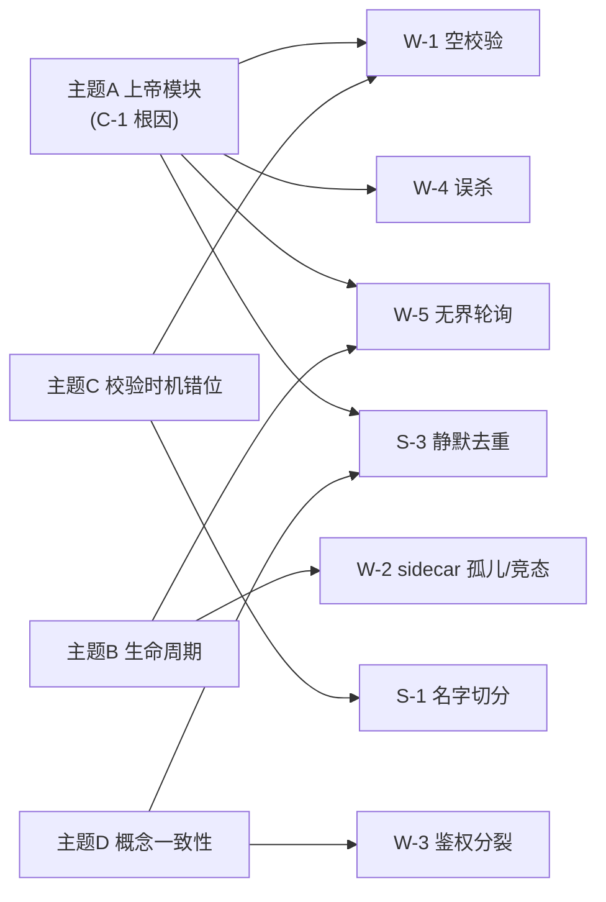

# 审核结论分析 — `feat/multi-project-site`

> 对 `MULTI_PROJECT_SITE_CODE_REVIEW.md` 的 9 条发现做**根因归纳**，并**对照刚合并进来的最新代码（HEAD = `c7b9900`）重新验证**哪些已被修复 / 部分缓解 / 仍然成立。

| 项目 | 内容 |
|------|------|
| 分析对象 | 原审查的 1 Critical + 5 Warning + 3 Suggestion |
| 当前 HEAD | `c7b9900`（已快进合并 `b9e358c..c7b9900`，新增站点部署数据校验等 3 提交） |
| 结论一句话 | **结构性根因（上帝模块）未动；进程生命周期问题被"加宽限期"部分缓解但未根治；输入校验缺口仍在，团队却在另一端补了输出校验** |

---

## 一、根因归纳（9 条 → 4 个主题）

原报告按"风险类型"逐条列出，但从**根因**看，9 条发现其实收敛到 4 个结构性源头。理解这点能避免"逐条打补丁"而错过真正要治的根。

### 主题 A：上帝模块是放大器（根因级）

- **核心**：C-1（`managed_project_sites.rs` 12,102 行）。
- **被它放大的派生问题**：W-1（空校验函数藏在巨файл里没人发现）、W-4（`kill_processes_on_port` 与 PID 注册表两套策略并存于同一文件却互不调用）、W-5（轮询逻辑混在控制流里）、S-3（静默去重）。
- **判断**：这些 Warning 不是孤立 bug，而是"单文件职责过载 → 局部决策看不到全局约束"的症状。**不拆模块，这类问题会持续再生。**

### 主题 B：进程 / 资源生命周期不完整

- **核心**：W-2（sidecar 孤儿 + TOCTOU）、W-5（CLI job 无界轮询）。
- **共性**：对"自己拉起 / 自己等待"的外部进程，**缺少完整的生命周期闭环**（创建有了，回收/超时/去重没有补齐）。
- **判断**：属于"乐观路径写完了，异常/竞态路径没收尾"。

### 主题 C：校验时机错位

- **核心**：W-1（创建期 dbnum 冲突校验缺失）、S-1（工程名按空白切分）。
- **共性**：**输入端**（create/update）校验薄弱，问题被推迟到下游才暴露。
- **新发现（见第二节）**：团队恰好在**输出端**新增了 `site_data_validation.rs`（校验导出 Parquet）——方向对，但补在了错位的一端，没堵住 W-1 的输入缺口。

### 主题 D：概念完整性 / 一致性缺失

- **核心**：W-3（admin 路由鉴权分裂在两个 router）、S-3（同名不同路径静默丢弃）。
- **共性**：同一类操作存在**两套不一致的规则**，"像是不止一个人设计的"。

---

## 二、对照最新代码的重新验证（HEAD = `c7b9900`）

刚合并的 3 个提交（站点部署数据校验 / quick deploy dbfile 路径记忆 / **sidecar job 关闭竞态修复**）直接触及两条结论。逐条核对：

| 发现 | 最新状态 | 证据 | 说明 |
|------|---------|------|------|
| **C-1** 上帝模块 | 🔴 **更严重** | 本次合并 `managed_project_sites.rs` 再 +332 行 | 不仅没拆，反而继续长大；结构性根因未触碰 |
| **W-1** dbnum 冲突校验缺失 | 🔴 **仍成立** | `precheck_dbnum_conflicts` 在 `c7b9900` 无任何改动，仍是 `let _ = projects; Ok(())` | 新增的 `site_data_validation.rs` 是**输出**校验，与本输入缺口正交，未覆盖 |
| **W-2** sidecar 孤儿 + TOCTOU | 🟡 **部分缓解** | `c7b9900` 把 job sidecar 关闭延迟 `1000ms` → 可配置 `job_sidecar_shutdown_delay_ms()`（默认 **10s**，env `ADMIN_SIDECAR_JOB_SHUTDOWN_DELAY_MS`） | 仅"加宽限期容忍竞态"。`let _child` 丢句柄、`ensure_sidecar` TOCTOU、**非 job sidecar 无自关闭（孤儿泄漏）** 三点**均未修** |
| **W-3** admin 鉴权分裂 | 🟡 仍成立 | 主 router 仍挂 `/api/admin/quick-deploy-test`（免鉴权）；本次合并 `mod.rs` 仅 +1 行未涉及该结构 | — |
| **W-4** `kill_processes_on_port` 误杀 | 🟡 仍成立 | 无相关改动 | — |
| **W-5** 无界轮询 | 🟡 仍成立 | `run_cli_job_with_status` 轮询循环无 deadline；本次只调了关闭延迟，未给轮询加上限 | 注意：sidecar 关闭延迟加长到 10s **间接**降低了"sidecar 提前消失导致轮询拿不到终态"的概率，但轮询本身仍无界 |
| **S-1 / S-2 / S-3** | 🟢 仍成立 | 无相关改动 | — |

### 关键洞察

1. **审核结论是"活"的**：W-2 在我出报告后、上游已独立提交修复（`tolerate sidecar job shutdown race`），印证该问题真实存在、且团队也感知到了——但修法是"治标"（加宽限期），没动我指出的"治本"点（句柄回收 / 单飞 / 非 job sidecar 自关闭）。
2. **校验补在了错误的一端**：团队有补校验的意愿（`site_data_validation.rs` 488 行，校验导出 Parquet 的 schema 与抽样一致性），但补的是**部署后产物校验**，而 W-1 要的是**创建期输入冲突预检**。两者都需要，但 W-1 缺口仍在。
3. **根因仍在裸奔**：C-1 上帝模块本次又长 332 行。所有"治标"修复都在往同一个超大文件里继续堆，主题 A 的放大效应持续。

---

## 三、重排优先级（风险 × 影响）

结合最新代码状态，把"仍成立 / 部分缓解"的项重新排序：

| 序 | 发现 | 现状 | 为什么现在更该做 |
|---|------|------|----------------|
| ① | **W-2 剩余部分**（孤儿 + TOCTOU + 非job自关闭） | 部分缓解 | 上游已动这块、上下文最热；趁热补齐句柄回收/单飞/空闲自关闭，一次收口 |
| ② | **W-1** dbnum 输入冲突预检 | 仍成立 | 团队刚建了校验设施（`deploy_validation_check`/spec），把输入预检接进同一框架，名实一致 |
| ③ | **W-3** 鉴权统一 | 仍成立 | 免鉴权部署端点风险随功能增多而放大 |
| ④ | **W-4 / W-5** | 仍成立 | 局部小改即可消除误杀与挂死 |
| ⑤ | **C-1** 上帝模块拆分 | 更严重 | 最大、最该做；建议以本次新增的 `site_data_validation.rs`（已是独立文件）为范本，继续把 remote_deploy / process / persistence 抽出去 |

> 反直觉但重要：**C-1 虽是 Critical，却排在最后动手**——因为它工作量最大且需分批；而 ①②③④ 是"趁上游正在改同一区域、上下文最热"时的高性价比收口。但每多往 `managed_project_sites.rs` 堆一次"治标"，C-1 的拆分成本就更高一分。

---

## 四、给团队的一句话结论

> 这次审核的结论经最新代码验证**全部成立或仅部分缓解，无一被证伪**。团队的修复动作（sidecar 关闭容忍、输出数据校验）方向正确但都是"治标"，且持续往那个 12,102 行的上帝模块里堆——**真正的杠杆是把生命周期收口（W-2 剩余）与输入校验补齐（W-1）顺手做掉，并启动上帝模块的分批拆分（C-1）**，否则"修一个、长三行"的循环会一直持续。

---

*分析日期：2026-06-08 · 基于 HEAD `c7b9900` · 配套文档见同目录 `MULTI_PROJECT_SITE_CODE_REVIEW.md`、`data-parse-save-flow.drawio`*
