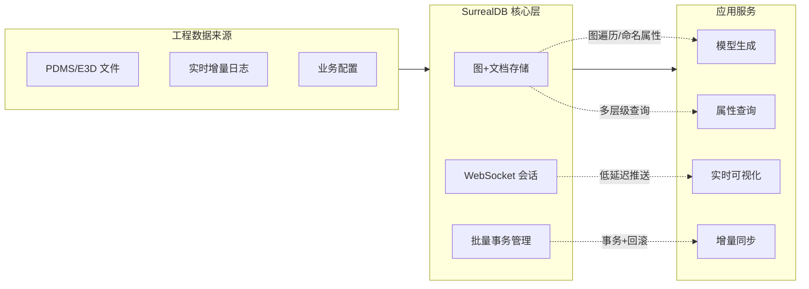

# 5. 数据库比选报告

## 5.1 比选目标
- 挑选 openGauss 与达梦 DM8 两款在国内大规模落地的自主可控数据库，比较其在复杂工程数据管理场景中的适配程度。
- 明确这两款数据库在图状关系、动态属性、实时事务和生态适配等方面的能力差异，为是否继续采用 SurrealDB 作为核心数据引擎提供依据，同时评估满足国产化合规的可行路径。

## 5.2 比选范围
- 候选数据库限定为 openGauss 和达梦 DM8，两者分别代表 PostgreSQL 技术路线和 Oracle 兼容技术路线，广泛用于政府、能源、电力等行业的信息化项目。
- 现有平台以 SurrealDB 承载核心模型数据，其多模型特性和实时通信能力作为比对基线，用于衡量候选数据库在关键能力上的差距。
- 评估过程中同步考虑团队既有的 MySQL 与 TiDB 经验，确认若引入 openGauss 或达梦 DM8，是否能够在既有运维体系中顺畅嫁接。

## 5.3 比选要素

**图关系建模能力**

| 能力点 | SurrealDB | openGauss | 达梦 DM8 | 结论 |
|---|---|---|---|---|
| 原生图模型 | 内置图与文档一体化，支持多跳遍历 | 依赖递归查询和多表 JOIN，无图引擎 | 依赖层次查询和存储过程，无图引擎 | SurrealDB 直接满足；关系型方案需自建图层 |
| 查询复杂度 | 单次查询可拿到多层级节点和属性 | 深层遍历需循环执行查询 | 深层遍历需多次嵌套 SQL | SurrealDB 在深度遍历上优势明显 |
| 架构维护 | 统一接口即可 | 需额外维护视图、CTE、缓存 | 需额外维护存储过程和缓存 | SurrealDB 运维成本最低 |

**动态属性支持**

| 能力点 | SurrealDB | openGauss | 达梦 DM8 | 结论 |
|---|---|---|---|---|
| 存储形态 | 原生对象/JSON 字段，属性自由扩展 | 提供 JSONB，但深层索引有限 | 支持 JSON，但需大量自建函数 | SurrealDB 对动态属性最友好 |
| 查询效率 | 属性级索引与函数可直接过滤 | 高维 JSON 过滤性能不稳定 | 复杂 JSON 需拆表或二次处理 | SurrealDB 应对高维属性更可靠 |
| 模式演进 | 无需频繁 DDL | 频繁变更字段可能影响性能 | 需建大量虚表或冗余列 | SurrealDB 改动成本最低 |

**实时增量与事务能力**

| 能力点 | SurrealDB | openGauss | 达梦 DM8 | 结论 |
|---|---|---|---|---|
| 实时通道 | 原生 WebSocket，支持事件推送 | 主要提供 SQL/TCP，需要外部消息组件 | 主要提供 SQL/TCP，需要外部消息组件 | SurrealDB 在实时推送上更直接 |
| 批量写入 | 支持批量事务与回滚 | 需通过批处理与锁机制保证一致性 | 需通过批处理与锁机制保证一致性 | 三者均可事务，但 SurrealDB 配合实时更简单 |
| 增量同步 | 增量记录可在同库管理 | 需结合 CDC、消息队列实现 | 需结合 CDC、消息队列实现 | SurrealDB 方案链路最短 |

**生态与接入成本**

| 能力点 | SurrealDB | openGauss | 达梦 DM8 | 结论 |
|---|---|---|---|---|
| 与现有接口适配 | 已在平台落地，无需额外适配 | 需编写适配层与异步驱动 | 需编写适配层与异步驱动 | SurrealDB 成本最低 |
| 运维工具 | 轻量但需自建监控 | 商用工具成熟 | 商用工具成熟 | 若以国产化为目标需额外权衡 |
| 社区与支持 | 活跃开源社区，快速迭代 | 企业级支持完善 | 企业级支持完善 | 可考虑 SurrealDB + 关系库混合部署 |

## 5.4 比选过程
- **需求梳理**：整理平台的数据管线，明确数据采集层、模型生成服务、属性查询服务、增量同步服务和前端可视化之间的调用关系。重点识别出元素拓扑解析、属性映射、几何实例生成、实时推送四类场景各自的数据库诉求。
- **能力对照**：重点评估 openGauss 与达梦 DM8 的官方资料和落地案例，总结它们对图结构的实现方式（递归查询、存储过程等）、JSON 字段的索引能力、批量事务性能以及对外协议支持，并与 SurrealDB 在图遍历、命名属性映射、批量事务、实时推送等方面的能力进行对照。
- **差距分析**：结合测试和既有经验，确认关系型方案在深度遍历时仍需多级 JOIN，无法避免 N+1 查询；动态属性依旧依赖大字段或复杂存储过程；实时推送需要额外中间件才能实现，从而带来较高的开发与运维投入。
- **风险评估**：根据团队能力和迁移成本，评估若强行改用关系型数据库可能引发的开发周期延长、性能劣化和维护难度上升等风险，为决策提供量化依据。

## 5.5 比选结论
- 自主可控关系型数据库目前难以直接满足项目对原生图查询、动态属性灵活存储以及 WebSocket 级实时推送的需求。即便通过存储过程、物化视图等手段可以部分补齐功能，也会显著增加实现与维护复杂度。
- SurrealDB 依靠图加文档的多模型特性和内置函数，已经支撑起整个平台在拓扑遍历、命名属性、几何实例、增量记录等方面的核心流程；结合 DashMap 缓存与 RuntimeDatabaseAdapter，可以在现有架构下快速迭代。
- 建议继续以 SurrealDB 作为核心模型数据库，并在需要国产化合规的场景下引入 openGauss 或达梦等产品承担项目管理、用户数据等结构化业务。通过统一的数据访问抽象和对照测试保持多数据库之间的数据一致性，为未来的混合部署和替换留足空间。

### SurrealDB 架构优势示意


```mermaid
flowchart LR
    subgraph RelationalAlt[关系型替代方案]
        R1[openGauss/达梦]
        R2[自研图层]
        R3[缓存 & 消息队列]
    end
    D1[工程数据] --> R1
    R1 -->|递归查询| R2
    R1 -->|批处理| R3
    R2 -->|组装拓扑| Apps[上层服务]
    R3 -->|补偿推送| Apps
    note right of Apps
        需要额外组件补足图遍历、
        实时推送与缓存一致性。
    end note
```

上述示意展示了 SurrealDB 在现有架构中的角色：
- 将图关系、命名属性、实例数据统一保存在一套多模型引擎内，不再依赖额外的图层或硬编码的递归逻辑，显著降低了拓扑遍历的复杂度。
- 原生的 WebSocket 与批量事务能力直接服务于实时可视化和增量发布，避免构建额外的消息队列与缓存同步链路。
- 若采用关系型数据库，需要叠加自研图层、缓存与消息组件才能弥补能力差距，整体链路更长、维护成本更高。
