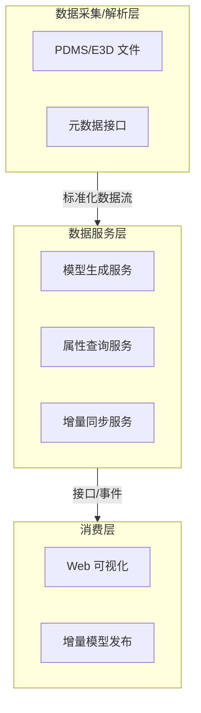
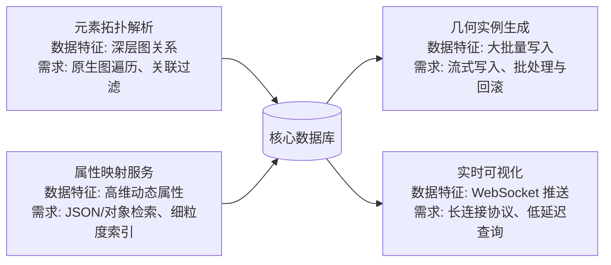

# 自主可控数据库比选报告（架构视角）

## 1. 项目背景
本项目需要对来自 PDMS/E3D 的工程数据进行解析、建模、几何生成和增量发布。核心平台以微服务方式运行，要求数据库能够支撑以下特性：
- 高度关联的设备、管线、支撑等拓扑关系查询；
- 动态属性、命名属性的灵活扩展与检索；
- 多场景并发写入（增量更新、实例数据落库、版本切换）；
- 实时接口能力，以支持 Web 可视化、模型生成等下游服务。

## 2. 系统架构概览

关键管线与数据库的关系如下：

## 3. 核心需求归纳
1. **图关系建模能力**：需直接表达元素-所有者、元素-几何、元素-属性等多种关系，并支持单次查询完成跨层级遍历。
2. **动态属性扩展能力**：属性字段高度可变，需要对象/JSON型存储与属性级索引，减轻频繁的结构调整。
3. **实时增量与批量写入**：模型生成与增量发布要求数据库在多线程写入时保持事务一致性，并支持高吞吐批处理。
4. **多协议访问与生态兼容**：既要提供标准 SQL/HTTP 接口以接入通用工具，也希望具备 WebSocket 或事件推送以满足实时场景。

## 4. 自主可控数据库产品比选

### 4.1 openGauss
- **定位**：企业级关系型数据库，兼容 PostgreSQL，擅长 OLTP/OLAP 场景。
- **优势**：安全合规体系完善；支持 JSONB 和递归 CTE；拥有丰富的 SQL 优化能力。
- **不足**：
  - 图关系缺口：依旧依赖关系表与递归 CTE，无法在架构上替代当前系统所需的多跳图查询，N+1 查询难题仍然存在。
  - 动态属性受限：JSONB 缺乏针对深层字段的高效索引策略，复杂筛选会放大查询延迟。
  - 协议能力不足：原生接口以 TCP/SQL 为主，实时推送需额外组件，无法直接对接现有 WebSocket 方案。

### 4.2 达梦 DM8
- **定位**：自主可控关系型数据库，强调事务、备份和行业合规。
- **优势**：事务和安全审计能力成熟；兼容 Oracle/SQL 标准；国产化案例丰富。
- **不足**：
  - 仅提供关系模型，对多层级拓扑仍需通过嵌套查询实现，性能与维护成本较高。
  - 动态属性依赖大字段或外部缓存，难以满足快速扩展的需求。
  - 缺少成熟的异步驱动和流式接口，需自研适配层来满足实时增量写入场景。

### 4.3 人大金仓 KingbaseES（可选对比）
- **定位**：基于 PostgreSQL 的国产数据库，面向政企行业。
- **不足**：
  - 与 openGauss 类似，缺乏原生图和对象模型，难以支撑复杂遍历。
  - JSON 支持有限，细粒度索引不足；实时接口需借助外部中间件。

## 5. 无法满足系统需求的主要原因
1. **图数据与多模型能力不足**：当前国产关系数据库主要面向传统 OLTP，缺少原生图遍历语法，难以适应图状拓扑结构的高频查询。
2. **动态属性支持薄弱**：虽然支持 JSON，但在高并发、深层嵌套场景下查询和索引能力不足，无法支撑命名属性、隐含属性的组合检索。
3. **实时增量能力欠缺**：缺少原生的 WebSocket/事件推送，事务模型以批处理为主，需要自建消息队列和缓存才能达到现有系统的实时性要求。
4. **适配成本高**：为了满足需求，需要大量存储过程、物化视图、数据同步组件，整体运维和研发投入远高于当前方案。

## 6. 建议
1. 继续以 SurrealDB 作为核心模型数据库，利用其图+文档能力承担拓扑查询与动态属性存储。
2. 若项目需符合国产化合规，可将 openGauss 或 DM8 用于结构化管理数据（项目、用户、日志），与模型数据分层存储，降低适配风险。
3. 建议形成统一的数据访问抽象层，保留针对 SurrealDB 的实时接口，同时为关系型数据库提供只读或备份通道，以便未来的混合部署。
4. 设计配套监控与同步机制，确保核心模型数据与关系型数据库之间的一致性，并制定切换与回滚预案。
