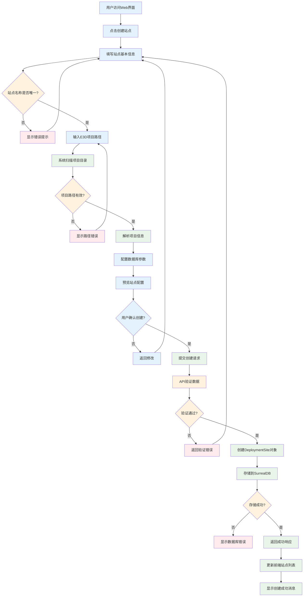
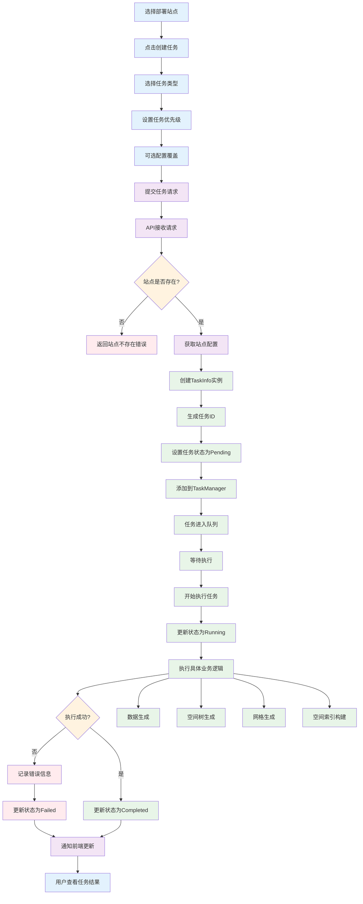
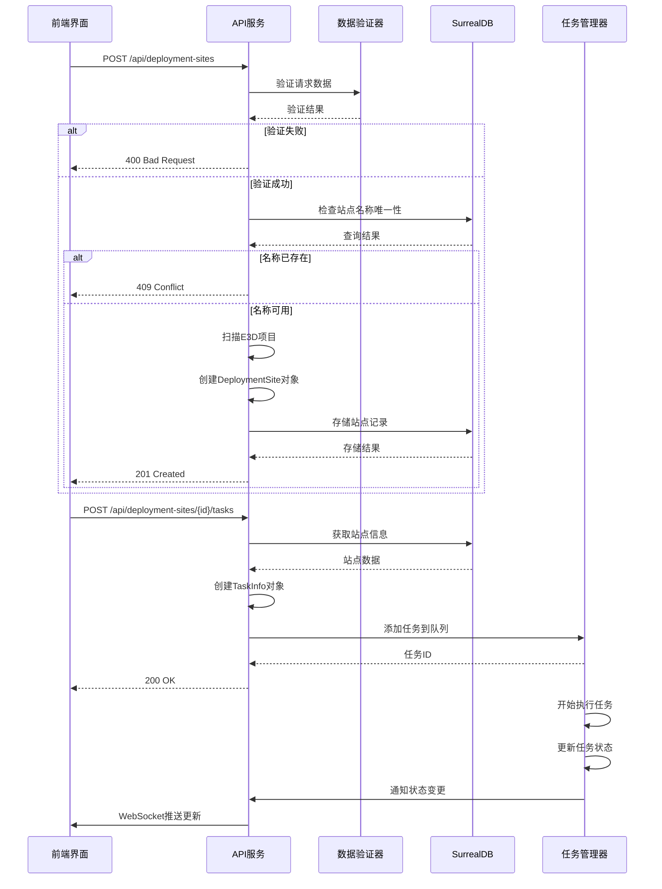
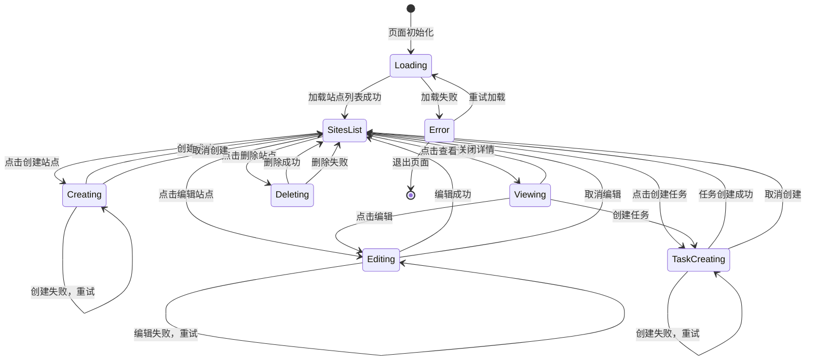
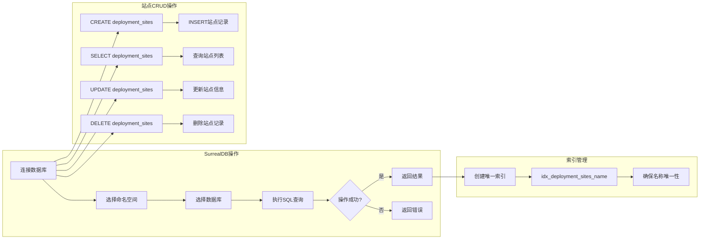
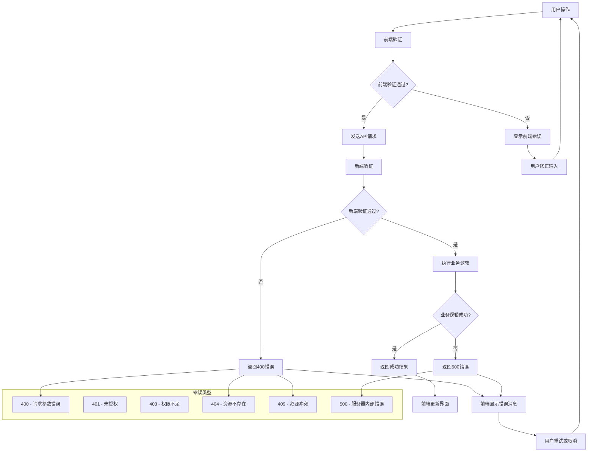
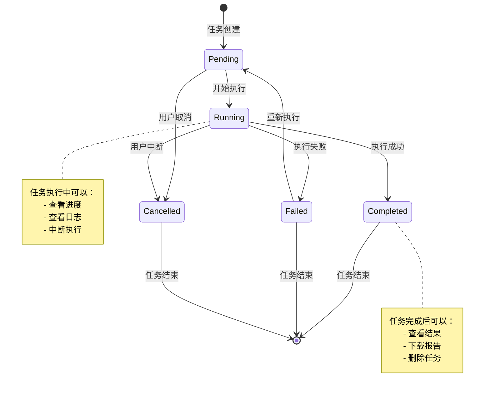

# 部署站点流程图集合

本文档包含AIOS数据库管理平台部署站点功能的各种流程图，使用Mermaid语法绘制。

## 1. 数据结构关系图

```mermaid
graph TB
    %% 前端数据结构
    subgraph "前端 JavaScript"
        JS_NewSite[newSite 表单数据]
        JS_Config[config 配置对象]
        JS_TaskReq[taskRequest 任务请求]
    end

    %% 请求数据结构
    subgraph "API 请求结构"
        CreateReq[DeploymentSiteCreateRequest]
        TaskReq[DeploymentSiteTaskRequest]
        UpdateReq[DeploymentSiteUpdateRequest]
    end

    %% 核心数据模型
    subgraph "核心数据模型"
        DeploymentSite[DeploymentSite 部署站点]
        E3dProject[E3dProjectInfo E3D项目信息]
        DatabaseConfig[DatabaseConfig 数据库配置]
        TaskInfo[TaskInfo 任务信息]
    end

    %% 枚举类型
    subgraph "状态枚举"
        SiteStatus[DeploymentSiteStatus<br/>- Configuring<br/>- Deploying<br/>- Running<br/>- Failed<br/>- Stopped]
        TaskStatus[TaskStatus<br/>- Pending<br/>- Running<br/>- Completed<br/>- Failed<br/>- Cancelled]
        TaskType[TaskType<br/>- DataGeneration<br/>- SpatialTreeGeneration<br/>- FullGeneration<br/>- MeshGeneration]
        TaskPriority[TaskPriority<br/>- Low<br/>- Normal<br/>- High<br/>- Critical]
    end

    %% 数据库存储
    subgraph "SurrealDB 存储"
        DB_Sites[(deployment_sites 表)]
        DB_Tasks[(tasks 表)]
        DB_Projects[(projects 表)]
    end

    %% 管理器
    subgraph "应用状态管理"
        AppState[AppState]
        TaskManager[TaskManager]
        ConfigManager[ConfigManager]
    end

    %% 关系连接
    JS_NewSite --> CreateReq
    JS_Config --> DatabaseConfig
    JS_TaskReq --> TaskReq

    CreateReq --> DeploymentSite
    TaskReq --> TaskInfo

    DeploymentSite --> E3dProject
    DeploymentSite --> DatabaseConfig
    DeploymentSite --> SiteStatus

    TaskInfo --> TaskStatus
    TaskInfo --> TaskType
    TaskInfo --> TaskPriority
    TaskInfo --> DatabaseConfig

    DeploymentSite --> DB_Sites
    TaskInfo --> DB_Tasks

    AppState --> TaskManager
    AppState --> ConfigManager
    TaskManager --> TaskInfo

    %% 样式
    classDef frontend fill:#e1f5fe
    classDef request fill:#f3e5f5
    classDef model fill:#e8f5e8
    classDef enum fill:#fff3e0
    classDef storage fill:#fce4ec
    classDef manager fill:#f1f8e9

    class JS_NewSite,JS_Config,JS_TaskReq frontend
    class CreateReq,TaskReq,UpdateReq request
    class DeploymentSite,E3dProject,DatabaseConfig,TaskInfo model
    class SiteStatus,TaskStatus,TaskType,TaskPriority enum
    class DB_Sites,DB_Tasks,DB_Projects storage
    class AppState,TaskManager,ConfigManager manager
```



## 2. 部署站点创建流程



## 3. 任务创建和执行流程



## 4. API请求处理流程



## 5. 前端状态管理流程



## 6. 数据库操作流程



## 7. 错误处理流程



## 8. 任务状态转换图



## 使用说明

这些流程图可以通过以下方式使用：

1. **在Markdown文档中直接渲染**（支持Mermaid的编辑器）
2. **在线Mermaid编辑器**：https://mermaid.live/
3. **VS Code插件**：Mermaid Preview
4. **导出为图片**：使用mermaid-cli工具

### 导出命令示例
```bash
# 安装mermaid-cli
npm install -g @mermaid-js/mermaid-cli

# 导出为PNG
mmdc -i deployment-sites-flowcharts.md -o flowcharts.png

# 导出为SVG
mmdc -i deployment-sites-flowcharts.md -o flowcharts.svg
```

---

*流程图版本: v1.0*  
*最后更新: 2025-01-11*  
*维护者: AIOS开发团队*
