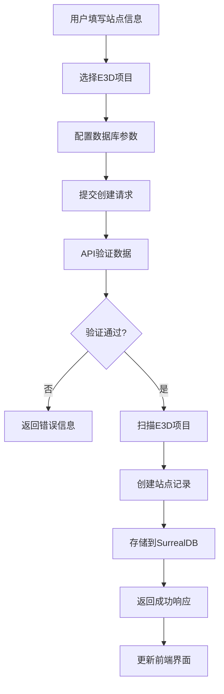
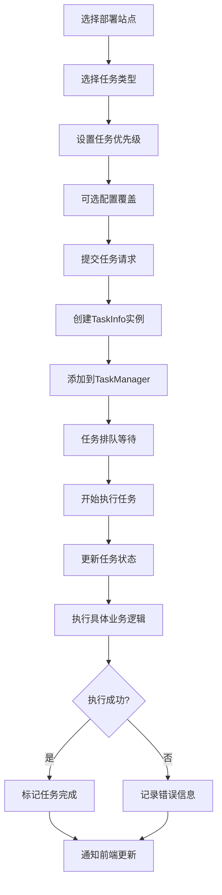

# 部署站点工作流程文档

## 📋 概述

本文档详细描述了AIOS数据库管理平台中部署站点的创建、管理和任务执行流程，包括数据结构关系、API接口和前端交互逻辑。

## 🏗️ 系统架构

### 核心组件
- **前端界面**: 基于Alpine.js的响应式Web界面
- **API服务**: 基于Axum的RESTful API
- **数据存储**: SurrealDB数据库
- **任务管理**: 异步任务执行引擎

## 📊 数据结构关系

### 主要数据模型

#### 1. DeploymentSite (部署站点)
```rust
pub struct DeploymentSite {
    pub id: Option<String>,                    // SurrealDB记录ID
    pub name: String,                          // 站点名称(唯一)
    pub description: Option<String>,           // 站点描述
    pub e3d_projects: Vec<E3dProjectInfo>,     // E3D项目列表
    pub config: DatabaseConfig,                // 数据库配置
    pub status: DeploymentSiteStatus,          // 站点状态
    pub env: Option<String>,                   // 环境标识
    pub owner: Option<String>,                 // 负责人
    pub created_at: Option<SystemTime>,        // 创建时间
    pub updated_at: Option<SystemTime>,        // 更新时间
}
```

#### 2. E3dProjectInfo (E3D项目信息)
```rust
pub struct E3dProjectInfo {
    pub name: String,                          // 项目名称
    pub path: String,                          // 项目路径
    pub project_code: Option<u32>,             // 项目代码
    pub db_file_count: u32,                    // 数据库文件数量
    pub size_bytes: u64,                       // 项目大小
    pub last_modified: SystemTime,             // 最后修改时间
    pub selected: bool,                        // 是否选中
    pub description: Option<String>,           // 项目描述
}
```

#### 3. DatabaseConfig (数据库配置)
```rust
pub struct DatabaseConfig {
    pub name: String,                          // 配置名称
    pub manual_db_nums: Vec<u32>,              // 手动指定DB编号
    pub project_name: String,                  // 项目名称
    pub project_code: u32,                     // 项目代码
    pub mdb_name: String,                      // MDB名称
    pub module: String,                        // 模块类型
    pub db_type: String,                       // 数据库类型
    pub surreal_ns: u32,                       // SurrealDB命名空间
    pub db_ip: String,                         // 数据库IP
    pub db_port: String,                       // 数据库端口
    pub db_user: String,                       // 数据库用户
    pub db_password: String,                   // 数据库密码
    pub gen_model: bool,                       // 是否生成模型
    pub gen_mesh: bool,                        // 是否生成网格
    pub gen_spatial_tree: bool,                // 是否生成空间树
    pub apply_boolean_operation: bool,         // 是否应用布尔运算
    pub mesh_tol_ratio: f64,                   // 网格容差比率
    pub room_keyword: String,                  // 房间关键字
    pub target_sesno: Option<u32>,             // 目标会话号
}
```

### 状态枚举

#### DeploymentSiteStatus (站点状态)
- `Configuring` - 配置中
- `Deploying` - 部署中
- `Running` - 运行中
- `Failed` - 失败
- `Stopped` - 已停止

#### TaskType (任务类型)
- `DataGeneration` - 数据生成
- `SpatialTreeGeneration` - 空间树生成
- `FullGeneration` - 完整生成
- `MeshGeneration` - 网格生成
- `ParsePdmsData` - 解析PDMS数据
- `GenerateGeometry` - 生成几何数据
- `BuildSpatialIndex` - 构建空间索引

## 🔄 工作流程

### 1. 部署站点创建流程



### 2. 任务创建和执行流程



## 🌐 API接口

### 部署站点管理API

#### 获取站点列表
```http
GET /api/deployment-sites?page=1&per_page=10&q=search&status=Running&env=prod
```

#### 创建部署站点
```http
POST /api/deployment-sites
Content-Type: application/json

{
    "name": "生产环境站点",
    "description": "生产环境部署站点",
    "env": "prod",
    "owner": "管理员",
    "selected_projects": [
        "/path/to/project1",
        "/path/to/project2"
    ],
    "config": {
        "name": "生产配置",
        "project_name": "AvevaMarineSample",
        "project_code": 1516,
        "db_type": "surrealdb",
        "db_ip": "localhost",
        "db_port": "8009",
        "gen_model": true,
        "gen_spatial_tree": true
    }
}
```

#### 获取站点详情
```http
GET /api/deployment-sites/{site_id}
```

#### 更新站点信息
```http
PUT /api/deployment-sites/{site_id}
Content-Type: application/json

{
    "name": "更新后的站点名称",
    "description": "更新后的描述",
    "status": "Running"
}
```

#### 删除站点
```http
DELETE /api/deployment-sites/{site_id}
```

#### 为站点创建任务
```http
POST /api/deployment-sites/{site_id}/tasks
Content-Type: application/json

{
    "task_type": "DataGeneration",
    "task_name": "数据生成任务",
    "priority": "High",
    "config_override": {
        "manual_db_nums": [7999, 8000]
    }
}
```

## 💻 前端交互

### JavaScript数据结构
```javascript
// 站点表单数据
newSite: {
    name: '',                    // 站点名称
    description: '',             // 站点描述
    env: 'dev',                  // 环境
    owner: '',                   // 负责人
    selectedProjectsText: '',    // 项目路径文本
    config: {                    // 数据库配置
        name: '默认配置',
        manual_db_nums: [],
        project_name: 'AvevaMarineSample',
        project_code: 1516,
        mdb_name: 'ALL',
        module: 'DESI',
        db_type: 'surrealdb',
        surreal_ns: 1516,
        db_ip: 'localhost',
        db_port: '8009',
        db_user: 'root',
        db_password: 'root',
        gen_model: true,
        gen_mesh: false,
        gen_spatial_tree: true,
        apply_boolean_operation: true,
        mesh_tol_ratio: 3.0,
        room_keyword: '-RM',
        target_sesno: null
    }
}
```

### 主要前端方法
- `loadSites()` - 加载站点列表
- `createSite()` - 创建新站点
- `viewSiteDetail(site)` - 查看站点详情
- `deleteSite(site)` - 删除站点
- `createSiteTask(site)` - 为站点创建任务
- `searchSites()` - 搜索站点
- `filterSites()` - 过滤站点

## 🗄️ 数据库设计

### SurrealDB表结构

#### deployment_sites表
```sql
DEFINE TABLE deployment_sites SCHEMALESS;
DEFINE INDEX idx_deployment_sites_name ON TABLE deployment_sites COLUMNS name UNIQUE;
```

存储字段：
- `id` - 记录ID
- `name` - 站点名称(唯一索引)
- `description` - 站点描述
- `e3d_projects` - E3D项目数组
- `config` - 数据库配置对象
- `status` - 站点状态
- `env` - 环境标识
- `owner` - 负责人
- `tags` - 标签
- `notes` - 备注
- `created_at` - 创建时间
- `updated_at` - 更新时间

## 🔧 配置管理

### 默认配置
```toml
# DbOption.toml
project_name = "AvevaMarineSample"
project_code = 1516
mdb_name = "ALL"
module = "DESI"

# 版本库配置
v_ip = "localhost"
v_port = 8009
v_user = "root"
v_password = ""

# 生成选项
gen_model = true
gen_mesh = false
gen_spatial_tree = true
apply_boolean_operation = true
mesh_tol_ratio = 3.0
room_keyword = "-RM"

# SQLite R-Tree 空间索引
enable_sqlite_rtree = true
```

## 📝 使用说明

### 创建部署站点步骤

1. **访问管理界面**
   - 打开Web UI: `http://localhost:8080`
   - 导航到部署站点管理页面

2. **填写站点信息**
   - 输入站点名称(必填，全局唯一)
   - 添加站点描述
   - 选择环境(dev/staging/prod)
   - 指定负责人

3. **选择E3D项目**
   - 在项目路径文本框中输入项目路径
   - 每行一个路径
   - 系统会自动扫描项目信息

4. **配置数据库参数**
   - 设置数据库连接信息
   - 配置生成选项
   - 设置空间索引参数

5. **提交创建**
   - 点击"创建站点"按钮
   - 系统验证并创建站点记录

### 任务管理

1. **创建任务**
   - 在站点列表中选择目标站点
   - 点击"创建任务"按钮
   - 选择任务类型和优先级
   - 可选择覆盖配置参数

2. **监控任务**
   - 在任务管理页面查看任务状态
   - 实时查看任务进度
   - 查看任务日志和错误信息

3. **任务操作**
   - 启动/停止任务
   - 删除已完成任务
   - 查看任务详细信息

## 🚨 错误处理

### 常见错误及解决方案

1. **站点名称重复**
   - 错误: "站点名称已存在"
   - 解决: 使用唯一的站点名称

2. **项目路径无效**
   - 错误: "无法扫描项目目录"
   - 解决: 检查路径是否存在且可访问

3. **数据库连接失败**
   - 错误: "数据库连接失败"
   - 解决: 检查数据库服务状态和连接参数

4. **任务执行失败**
   - 错误: 任务状态显示"Failed"
   - 解决: 查看任务日志，检查配置参数

## 📈 性能优化

### 建议
1. **分页查询**: 使用分页避免一次加载过多站点
2. **索引优化**: 在name字段上建立唯一索引
3. **异步处理**: 任务执行采用异步模式
4. **缓存策略**: 对频繁查询的数据进行缓存
5. **批量操作**: 支持批量创建和删除操作

## 🔒 安全考虑

1. **输入验证**: 所有用户输入都进行严格验证
2. **SQL注入防护**: 使用参数化查询
3. **XSS防护**: 对输出内容进行转义
4. **访问控制**: 实现基于角色的访问控制
5. **审计日志**: 记录所有重要操作

---

*本文档版本: v1.0*  
*最后更新: 2025-01-11*  
*维护者: AIOS开发团队*
