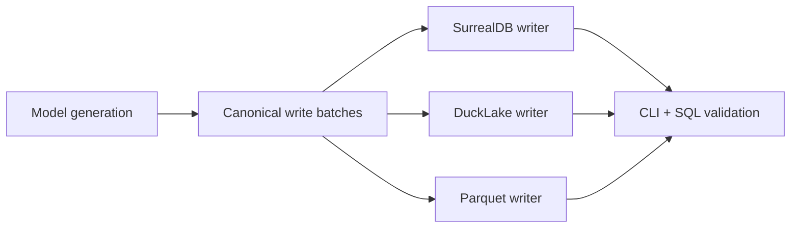

# ModelWriter Storage Mission Overview

## Mission

Design a docs-first path for moving `ModelWriter` from a SurrealDB-only writer toward a multi-backend storage architecture.

The first implementation target is a canonical write contract shared by:

- existing SurrealDB writeback
- future DuckLake writer
- future Parquet writer
- CLI + SQL validation tooling

## Scope

Phase 1 covers raw model generation persistence:

- `inst_info`
- `inst_relate`
- `inst_geo`
- `geo_relate`
- `tubi_info`
- `tubi_relate`
- `neg_relate`
- `ngmr_relate`
- `aabb`
- `trans`
- `vec3`
- `inst_relate_aabb`
- `refno_assoc_index`

Phase 2 covers boolean result tables:

- `inst_relate_bool`
- `inst_relate_cata_bool`

## Non-goals

- Do not replace the current SurrealDB backend in Phase 1.
- Do not require a completed DuckLake writer for Phase 1 raw acceptance.
- Do not use temp-Parquet-plus-SQL as the final DuckLake architecture.
- Do not use Rust tests for validation.
- Do not change Cargo source configuration for SurrealDB; it must remain `github.com/happyrust/surrealdb`.

## Target outcome

The codebase should gain a storage boundary where model generation emits canonical records once, and each backend persists those records using backend-specific mechanics while preserving the current SurrealDB contract.

