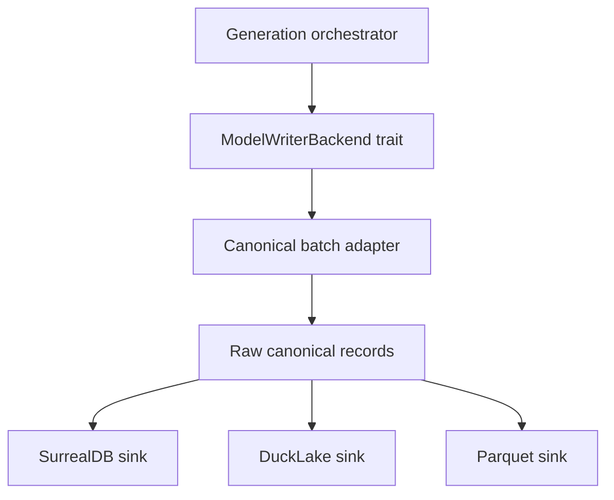

# Writer Architecture

## Current boundary

The current `ModelWriterBackend` trait already separates orchestration from persistence:

- `init`
- `cleanup`
- `write_base_batch`
- `persist_mesh_results`
- `write_inst_relate_aabb`
- `reconcile_missing_neg`
- `run_boolean_bridge`
- `finalize`

Phase 1 should keep this orchestration boundary and add a canonical record boundary beneath it.

## Proposed layers

## Responsibilities

| Layer | Responsibility | Not responsible for |
|---|---|---|
| Orchestrator | Batch order, generation lifecycle, option selection | Backend row layout |
| `ModelWriterBackend` | Storage lifecycle and error boundary | SQL dialect details for every backend |
| Canonical batch adapter | Convert in-memory generation structures into raw canonical records | Persisting records |
| Backend sink | Durable writes, backend transactions, projection refresh | Changing generation semantics |
| Validation CLI | Compare row counts, ids, and joins through SQL | Rust unit/integration tests |

## Backend selection

Phase 1 should support explicit backend selection while preserving current default behavior:

- default: SurrealDB writer
- future: DuckLake writer
- future: Parquet writer
- optional compare mode: write SurrealDB plus candidate backend, then compare via CLI + SQL
- Phase 1 canonical acceptance does not require a finished DuckLake writer; it only requires the raw canonical boundary and validation surface.

## Error handling

- Backend writes must fail fast for missing required raw records.
- Partial backend failures must include batch id and table/projection name.
- Compare mode should report mismatches without silently falling back to SurrealDB-only success.

## Boolean boundary

`run_boolean_bridge` remains Phase 2. The Phase 1 canonical writer should not require `inst_relate_bool` or `inst_relate_cata_bool` to validate raw model persistence.
