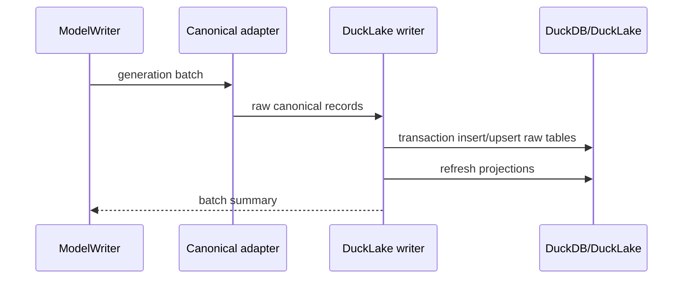

# DuckLake Writer

## Direction

The future DuckLake implementation should target the Rust DuckDB binding as the final architecture. It should not use temp-Parquet-plus-SQL as the final write path.

Temporary Parquet registration may be useful for investigation, but the mission architecture should converge on a Rust-owned DuckDB/DuckLake writer that creates and mutates canonical tables directly.

## Target design

- Open DuckDB through the Rust DuckDB binding.
- Attach/load DuckLake metadata for the configured project.
- Create the `ducklake-canonical` schema if missing.
- Write raw canonical tables in batch transactions.
- Refresh projection tables with SQL after raw writes.
- Expose CLI + SQL validation queries for parity checks.

## Write flow

## Table strategy

- Raw tables are append/upsert targets keyed by stable ids.
- Projection tables are SQL-derived and may be rebuilt for a dbnum/refno slice.
- Partitioning should start with `project_name` and `dbnum` where supported.
- Id columns should use plain scalar values, not SurrealDB record-id syntax.

## Acceptance

DuckLake Phase 1 is a later milestone. Phase 1 raw acceptance for this mission does not require DuckLake implementation completion; it only requires the canonical raw boundary, docs, and validation surfaces to remain consistent.
