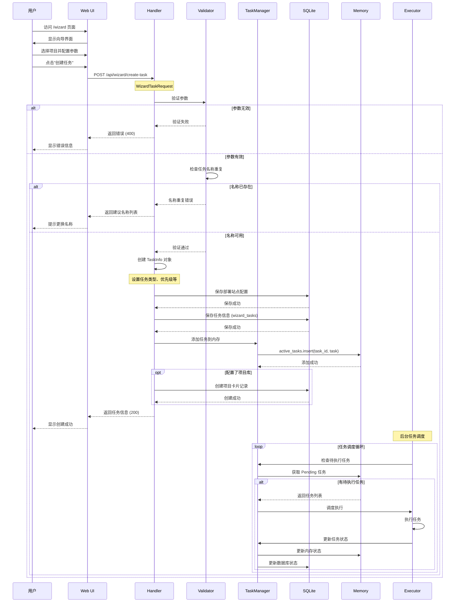
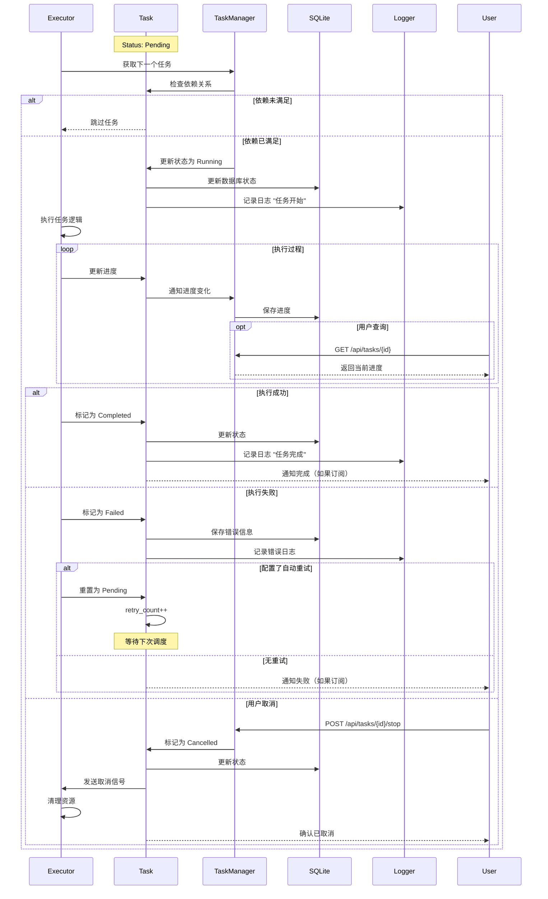
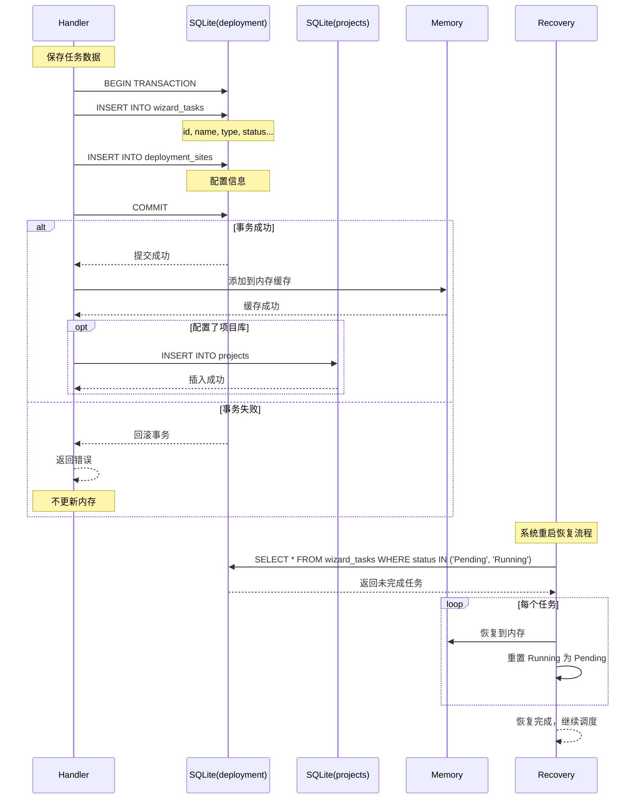
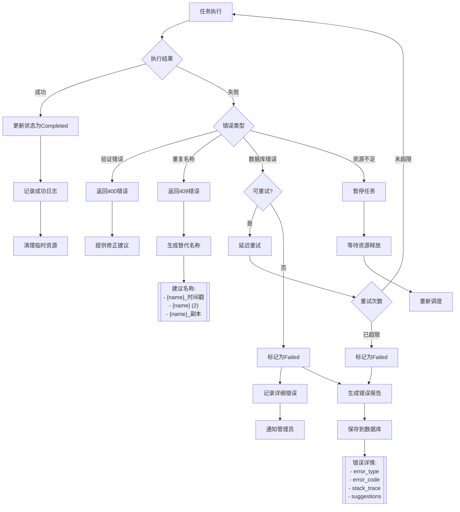
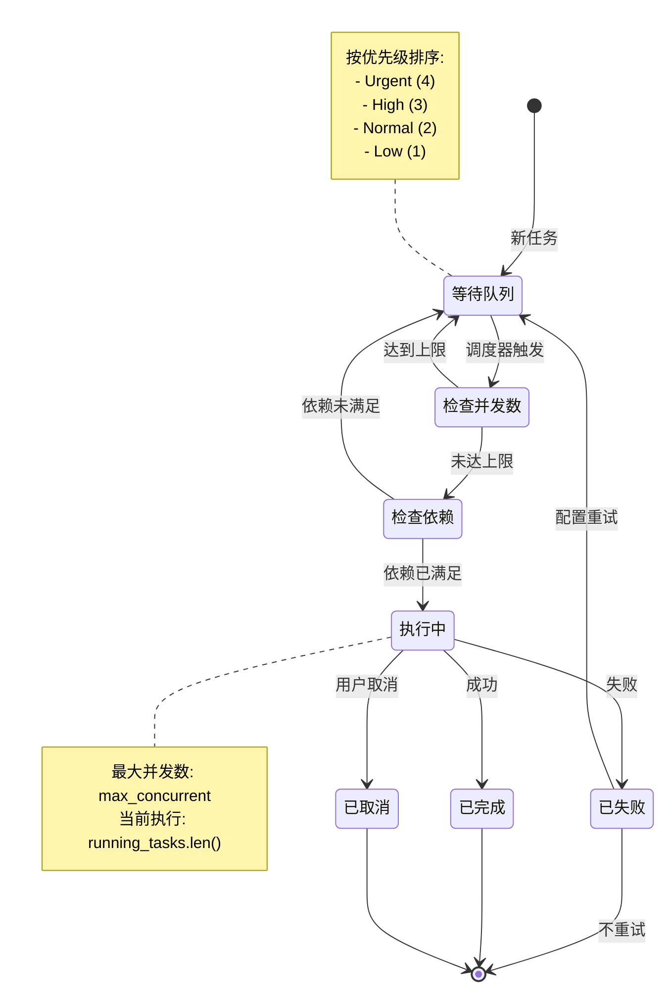

# 任务创建时序图

## 完整的任务创建流程时序

```mermaid
sequenceDiagram
    participant U as 用户
    participant W as Web UI
    participant H as Handler
    participant V as Validator
    participant TM as TaskManager
    participant DB as SQLite
    participant M as Memory
    participant E as Executor

    U->>W: 访问 /wizard 页面
    W->>U: 显示向导界面

    U->>W: 选择项目并配置参数
    U->>W: 点击"创建任务"

    W->>H: POST /api/wizard/create-task
    Note over H: WizardTaskRequest

    H->>V: 验证参数
    alt 参数无效
        V-->>H: 验证失败
        H-->>W: 返回错误 (400)
        W-->>U: 显示错误信息
    else 参数有效
        V->>V: 检查任务名称重复

        alt 名称已存在
            V-->>H: 名称重复错误
            H-->>W: 返回建议名称列表
            W-->>U: 提示更换名称
        else 名称可用
            V-->>H: 验证通过

            H->>H: 创建 TaskInfo 对象
            Note over H: 设置任务类型、优先级等

            H->>DB: 保存部署站点配置
            DB-->>H: 保存成功

            H->>DB: 保存任务信息 (wizard_tasks)
            DB-->>H: 保存成功

            H->>TM: 添加任务到内存
            TM->>M: active_tasks.insert(task_id, task)
            M-->>TM: 添加成功

            opt 配置了项目库
                H->>DB: 创建项目卡片记录
                DB-->>H: 创建成功
            end

            H-->>W: 返回任务信息 (200)
            W-->>U: 显示创建成功

            Note over E: 后台任务调度
            loop 任务调度循环
                E->>TM: 检查待执行任务
                TM->>M: 获取 Pending 任务
                alt 有待执行任务
                    M-->>TM: 返回任务列表
                    TM->>E: 调度执行
                    E->>E: 执行任务
                    E->>TM: 更新任务状态
                    TM->>M: 更新内存状态
                    TM->>DB: 更新数据库状态
                end
            end
        end
    end
```

## 任务状态变更流程

```mermaid
sequenceDiagram
    participant E as Executor
    participant T as Task
    participant TM as TaskManager
    participant DB as SQLite
    participant L as Logger
    participant U as User

    Note over T: Status: Pending

    E->>TM: 获取下一个任务
    TM->>T: 检查依赖关系

    alt 依赖未满足
        T-->>E: 跳过任务
    else 依赖已满足
        TM->>T: 更新状态为 Running
        T->>DB: 更新数据库状态
        T->>L: 记录日志 "任务开始"

        E->>E: 执行任务逻辑

        loop 执行过程
            E->>T: 更新进度
            T->>TM: 通知进度变化
            TM->>DB: 保存进度

            opt 用户查询
                U->>TM: GET /api/tasks/{id}
                TM-->>U: 返回当前进度
            end
        end

        alt 执行成功
            E->>T: 标记为 Completed
            T->>DB: 更新状态
            T->>L: 记录日志 "任务完成"
            T-->>U: 通知完成（如果订阅）
        else 执行失败
            E->>T: 标记为 Failed
            T->>DB: 保存错误信息
            T->>L: 记录错误日志

            alt 配置了自动重试
                E->>T: 重置为 Pending
                T->>T: retry_count++
                Note over T: 等待下次调度
            else 无重试
                T-->>U: 通知失败（如果订阅）
            end
        else 用户取消
            U->>TM: POST /api/tasks/{id}/stop
            TM->>T: 标记为 Cancelled
            T->>DB: 更新状态
            T->>E: 发送取消信号
            E->>E: 清理资源
            T-->>U: 确认已取消
        end
    end
```

## 数据持久化流程

```mermaid
sequenceDiagram
    participant H as Handler
    participant S1 as SQLite(deployment)
    participant S2 as SQLite(projects)
    participant M as Memory
    participant R as Recovery

    Note over H: 保存任务数据

    H->>S1: BEGIN TRANSACTION

    H->>S1: INSERT INTO wizard_tasks
    Note over S1: id, name, type, status...

    H->>S1: INSERT INTO deployment_sites
    Note over S1: 配置信息

    H->>S1: COMMIT

    alt 事务成功
        S1-->>H: 提交成功

        H->>M: 添加到内存缓存
        M-->>H: 缓存成功

        opt 配置了项目库
            H->>S2: INSERT INTO projects
            S2-->>H: 插入成功
        end

    else 事务失败
        S1-->>H: 回滚事务
        H-->>H: 返回错误
        Note over H: 不更新内存
    end

    Note over R: 系统重启恢复流程

    R->>S1: SELECT * FROM wizard_tasks WHERE status IN ('Pending', 'Running')
    S1-->>R: 返回未完成任务

    loop 每个任务
        R->>M: 恢复到内存
        R->>R: 重置 Running 为 Pending
    end

    R-->>R: 恢复完成，继续调度
```

## 错误处理流程

```mermaid
flowchart TD
    A[任务执行] --> B{执行结果}

    B -->|成功| C[更新状态为Completed]
    C --> D[记录成功日志]
    D --> E[清理临时资源]

    B -->|失败| F{错误类型}

    F -->|验证错误| G[返回400错误]
    G --> H[提供修正建议]

    F -->|重复名称| I[返回409错误]
    I --> J[生成替代名称]
    J --> K[["建议名称:<br/>- {name}_时间戳<br/>- {name} (2)<br/>- {name}_副本"]]

    F -->|数据库错误| L{可重试?}
    L -->|是| M[延迟重试]
    M --> N{重试次数}
    N -->|未超限| A
    N -->|已超限| O[标记为Failed]

    L -->|否| P[标记为Failed]
    P --> Q[记录详细错误]
    Q --> R[通知管理员]

    F -->|资源不足| S[暂停任务]
    S --> T[等待资源释放]
    T --> U[重新调度]

    O --> V[生成错误报告]
    P --> V
    V --> W[保存到数据库]
    W --> X[["错误详情:<br/>- error_type<br/>- error_code<br/>- stack_trace<br/>- suggestions"]]
```

## 并发控制机制

```mermaid
stateDiagram-v2
    [*] --> 等待队列: 新任务

    等待队列 --> 检查并发数: 调度器触发

    检查并发数 --> 等待队列: 达到上限
    检查并发数 --> 检查依赖: 未达上限

    检查依赖 --> 等待队列: 依赖未满足
    检查依赖 --> 执行中: 依赖已满足

    执行中 --> 已完成: 成功
    执行中 --> 已失败: 失败
    执行中 --> 已取消: 用户取消

    已失败 --> 等待队列: 配置重试
    已失败 --> [*]: 不重试

    已完成 --> [*]
    已取消 --> [*]

    note right of 执行中
        最大并发数: max_concurrent
        当前执行: running_tasks.len()
    end note

    note left of 等待队列
        按优先级排序:
        - Urgent (4)
        - High (3)
        - Normal (2)
        - Low (1)
    end note
```

---

*文档生成时间：2024-01-19*
*版本：1.0.0*