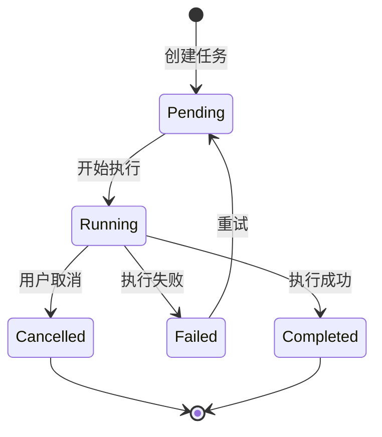

# 任务创建工作流程文档

## 概述

本文档详细描述了 gen-model 项目中任务创建的完整工作流程，包括前端交互、后端处理、数据持久化和任务执行等各个环节。

## 1. 系统架构

### 1.1 核心组件

```
┌─────────────┐     ┌─────────────┐     ┌─────────────┐
│   Web UI    │────▶│   Handlers  │────▶│  TaskManager│
└─────────────┘     └─────────────┘     └─────────────┘
                           │                     │
                           ▼                     ▼
                    ┌─────────────┐     ┌─────────────┐
                    │   SQLite    │     │   Memory    │
                    └─────────────┘     └─────────────┘
```

### 1.2 主要模块

- **wizard_handlers.rs**: 数据解析向导处理器
- **models.rs**: 数据模型定义
- **mod.rs**: 路由配置和应用状态管理
- **wizard_template.rs**: 向导页面模板

## 2. 任务创建流程

### 2.1 用户界面入口

用户可以通过以下方式创建任务：

1. **Web 界面**: 访问 `http://localhost:8080/wizard`
2. **API 调用**: `POST /api/wizard/create-task`

### 2.2 请求数据结构

```rust
pub struct WizardTaskRequest {
    /// 任务名称
    pub task_name: String,

    /// 向导配置
    pub wizard_config: DataParsingWizardConfig,

    /// 任务优先级（可选）
    pub priority: Option<TaskPriority>,

    /// 任务模式：ParseOnly | FullGeneration
    pub task_mode: Option<String>,
}

pub struct DataParsingWizardConfig {
    /// 基础数据库配置
    pub base_config: DatabaseConfig,

    /// 选中的项目列表
    pub selected_projects: Vec<String>,

    /// 根目录路径
    pub root_directory: String,

    /// 是否并行处理
    pub parallel_processing: bool,

    /// 最大并发数
    pub max_concurrent: Option<u32>,

    /// 失败时是否继续
    pub continue_on_failure: bool,

    /// 输出目录
    pub output_directory: Option<String>,
}
```

### 2.3 处理流程

#### Step 1: 参数验证

```rust
// 文件：src/web_ui/wizard_handlers.rs
// 函数：create_wizard_task()

// 1. 验证选中的项目
if request.wizard_config.selected_projects.is_empty() {
    return Err("未选择任何项目");
}

// 2. 验证任务名称
if request.task_name.trim().is_empty() {
    return Err("任务名称不能为空");
}

// 3. 检查任务名称重复性
if check_task_name_exists(&request.task_name)? {
    return Err("任务名称已存在");
}
```

#### Step 2: 创建任务对象

```rust
// 决定任务类型
let task_type = match request.task_mode.as_deref() {
    Some("full") | Some("fullgeneration") => TaskType::FullGeneration,
    _ => TaskType::DataParsingWizard,
};

// 创建任务
let task = TaskInfo::new(
    request.task_name,
    task_type,
    request.wizard_config.base_config.clone(),
);
```

#### Step 3: 数据持久化

任务数据保存到三个位置：

##### 3.1 SQLite - deployment_sites.sqlite

```sql
-- 表：wizard_tasks
CREATE TABLE wizard_tasks (
    id TEXT PRIMARY KEY,
    name TEXT NOT NULL UNIQUE,
    task_type TEXT NOT NULL,
    status TEXT NOT NULL,
    config_json TEXT,
    wizard_config_json TEXT,
    priority TEXT,
    created_at DATETIME,
    updated_at DATETIME,
    started_at DATETIME,
    completed_at DATETIME,
    progress_percentage REAL,
    current_step TEXT,
    logs_json TEXT,
    error_message TEXT
);

-- 表：deployment_tasks (用于检查名称重复)
CREATE TABLE deployment_tasks (
    id TEXT PRIMARY KEY,
    name TEXT NOT NULL UNIQUE,
    -- 其他字段...
);
```

##### 3.2 内存 - TaskManager

```rust
task_manager.active_tasks.insert(task_id, task);
```

##### 3.3 SQLite - 项目库（可选）

```sql
-- 如果配置了 project_config_sqlite_path
INSERT OR IGNORE INTO projects (
    name,
    env,
    status,
    created_at,
    updated_at
) VALUES (?, 'dev', 'Deploying', ?, ?)
```

## 3. 任务执行机制

### 3.1 任务状态流转



### 3.2 任务优先级

```rust
pub enum TaskPriority {
    Low = 1,
    Normal = 2,
    High = 3,
    Urgent = 4,
}
```

### 3.3 任务进度跟踪

```rust
pub struct TaskProgress {
    /// 当前步骤描述
    pub current_step: String,

    /// 总步骤数
    pub total_steps: u32,

    /// 当前步骤编号
    pub current_step_number: u32,

    /// 百分比进度 (0-100)
    pub percentage: f32,

    /// 已处理项目数
    pub processed_items: u64,

    /// 总项目数
    pub total_items: u64,

    /// 预计剩余时间（秒）
    pub estimated_remaining_seconds: Option<u64>,
}
```

## 4. 数据库配置

### 4.1 DatabaseConfig 结构

```rust
pub struct DatabaseConfig {
    /// 配置名称
    pub name: String,

    /// 手动指定的数据库编号
    pub manual_db_nums: Vec<u32>,

    /// 项目名称
    pub project_name: String,

    /// 项目路径
    pub project_path: String,

    /// 项目代码
    pub project_code: u32,

    /// 是否生成模型
    pub gen_model: bool,

    /// 是否生成网格
    pub gen_mesh: bool,

    /// 是否生成空间树
    pub gen_spatial_tree: bool,

    /// 是否应用布尔运算
    pub apply_boolean_operation: bool,

    /// 网格容差比率
    pub mesh_tol_ratio: f64,

    /// 房间关键字
    pub room_keyword: String,

    /// 目标会话号（增量更新用）
    pub target_sesno: Option<u32>,
}
```

### 4.2 配置文件示例

```toml
# DbOption.toml
project_name = "AvevaMarineSample"
project_path = "/path/to/project"
project_code = 1516
manual_db_nums = [7999, 8001, 8002]

gen_model = true
gen_mesh = false
gen_spatial_tree = true
apply_boolean_operation = true
mesh_tol_ratio = 3.0
room_keyword = "-RM"

# SQLite 配置
deployment_sites_sqlite_path = "deployment_sites.sqlite"
project_config_sqlite_path = "projects.sqlite"
project_config_table = "projects"
```

## 5. API 接口

### 5.1 创建任务

**请求：**
```http
POST /api/wizard/create-task
Content-Type: application/json

{
    "task_name": "数据解析任务-20240119",
    "task_mode": "FullGeneration",
    "priority": "High",
    "wizard_config": {
        "selected_projects": [
            "/path/to/project1",
            "/path/to/project2"
        ],
        "root_directory": "/data/projects",
        "parallel_processing": true,
        "max_concurrent": 4,
        "continue_on_failure": true,
        "base_config": {
            "name": "配置1",
            "manual_db_nums": [7999],
            "project_name": "Sample",
            "project_path": "/data",
            "project_code": 1516,
            "gen_model": true,
            "gen_mesh": false,
            "gen_spatial_tree": true
        }
    }
}
```

**响应（成功）：**
```json
{
    "id": "550e8400-e29b-41d4-a716-446655440000",
    "name": "数据解析任务-20240119",
    "task_type": "FullGeneration",
    "status": "Pending",
    "created_at": "2024-01-19T10:30:00Z",
    "priority": "High",
    "progress": {
        "current_step": "初始化",
        "total_steps": 1,
        "percentage": 0.0
    }
}
```

**响应（失败）：**
```json
{
    "error": "任务创建失败",
    "details": "任务名称 'xxx' 已存在",
    "error_type": "duplicate_name",
    "suggestions": [
        "xxx - 20240119_103000",
        "xxx (2)",
        "xxx - 副本"
    ]
}
```

### 5.2 查询任务列表

```http
GET /api/tasks?status=Running&limit=10
```

### 5.3 获取任务详情

```http
GET /api/tasks/{task_id}
```

### 5.4 获取任务日志

```http
GET /api/tasks/{task_id}/logs
```

### 5.5 任务控制

```http
POST /api/tasks/{task_id}/start    # 启动任务
POST /api/tasks/{task_id}/stop     # 停止任务
POST /api/tasks/{task_id}/restart  # 重启任务
DELETE /api/tasks/{task_id}        # 删除任务
```

## 6. 错误处理

### 6.1 错误类型

```rust
pub enum ErrorType {
    ValidationError,      // 参数验证失败
    DuplicateName,       // 名称重复
    DatabaseSaveError,   // 数据库保存失败
    TaskExecutionError,  // 任务执行失败
}
```

### 6.2 错误响应格式

```json
{
    "error": "错误标题",
    "details": "详细错误描述",
    "error_type": "错误类型",
    "task_id": "相关任务ID（如果有）",
    "suggestions": [
        "解决建议1",
        "解决建议2"
    ]
}
```

### 6.3 常见错误及解决方案

| 错误类型 | 原因 | 解决方案 |
|---------|------|---------|
| 任务名称重复 | 数据库中已存在同名任务 | 1. 使用带时间戳的名称<br>2. 添加序号后缀<br>3. 使用"副本"后缀 |
| 数据库保存失败 | SQLite文件权限问题 | 1. 检查文件权限<br>2. 确保磁盘空间充足<br>3. 检查数据库锁定状态 |
| 项目路径无效 | 指定路径不存在 | 1. 验证路径是否正确<br>2. 检查访问权限<br>3. 使用绝对路径 |

## 7. 扩展功能

### 7.1 批量任务创建

可以通过 `POST /api/tasks/batch` 一次创建多个任务：

```json
{
    "name_prefix": "批量任务",
    "db_nums": [7999, 8001, 8002],
    "parallel_execution": false,
    "max_concurrent": 3
}
```

### 7.2 任务依赖

任务可以设置依赖关系：

```rust
pub struct TaskInfo {
    // ...
    pub dependencies: Vec<String>,  // 依赖的任务ID列表
    // ...
}
```

### 7.3 任务模板

支持保存和复用任务配置模板：

```rust
pub struct TaskTemplate {
    pub id: String,
    pub name: String,
    pub description: String,
    pub task_type: TaskType,
    pub default_config: DatabaseConfig,
    pub allow_custom_config: bool,
}
```

## 8. 性能优化建议

1. **并发控制**：使用 `max_concurrent` 限制并发任务数
2. **批量处理**：将多个小任务合并为批量任务
3. **增量更新**：使用 `target_sesno` 实现增量数据处理
4. **缓存策略**：任务结果缓存到 SQLite，避免重复计算
5. **资源限制**：设置内存和CPU使用限制

## 9. 监控和调试

### 9.1 日志级别

```rust
pub enum LogLevel {
    Debug,
    Info,
    Warning,
    Error,
    Critical,
}
```

### 9.2 监控指标

- 任务执行时间
- 成功/失败率
- 资源使用情况
- 队列长度
- 并发任务数

### 9.3 调试工具

1. 查看实时日志：`GET /api/tasks/{id}/logs`
2. 导出任务配置：`GET /api/tasks/{id}/config`
3. 性能分析：启用 `profile` feature

## 10. 最佳实践

1. **任务命名**：使用描述性名称，包含时间戳避免重复
2. **错误恢复**：设置合理的重试策略
3. **资源管理**：根据系统资源调整并发数
4. **监控告警**：设置关键指标的告警阈值
5. **定期清理**：清理过期的任务记录和日志

## 附录

### A. 相关文件

- `/src/web_ui/wizard_handlers.rs` - 向导处理器
- `/src/web_ui/models.rs` - 数据模型
- `/src/web_ui/wizard_template.rs` - UI模板
- `/src/web_ui/mod.rs` - 路由配置
- `/deployment_sites.sqlite` - 任务数据库

### B. 环境要求

- Rust 1.75+
- SQLite 3.x
- 磁盘空间 > 1GB
- 内存 > 4GB（推荐）

### C. 相关链接

- [API 文档](./api-reference.md)
- [数据库架构](./database-schema.md)
- [部署指南](./deployment-guide.md)

---

*最后更新：2024-01-19*
*版本：1.0.0*