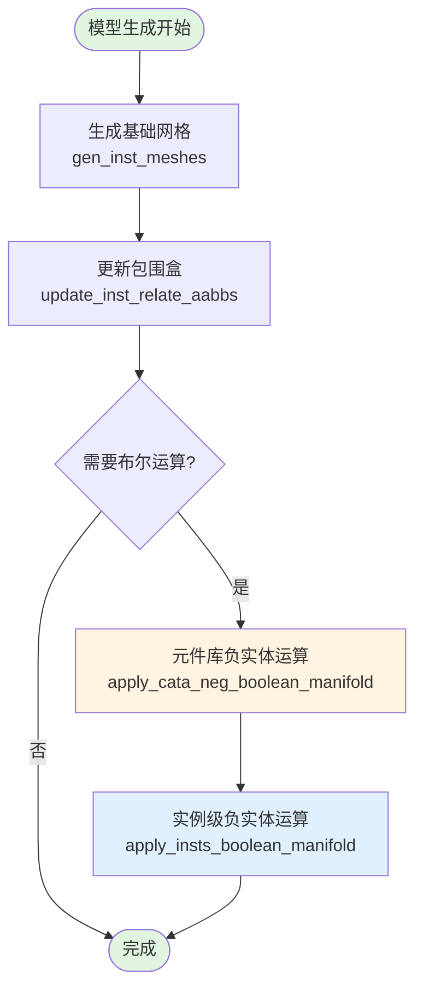
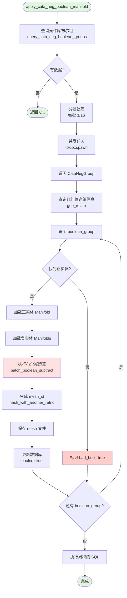
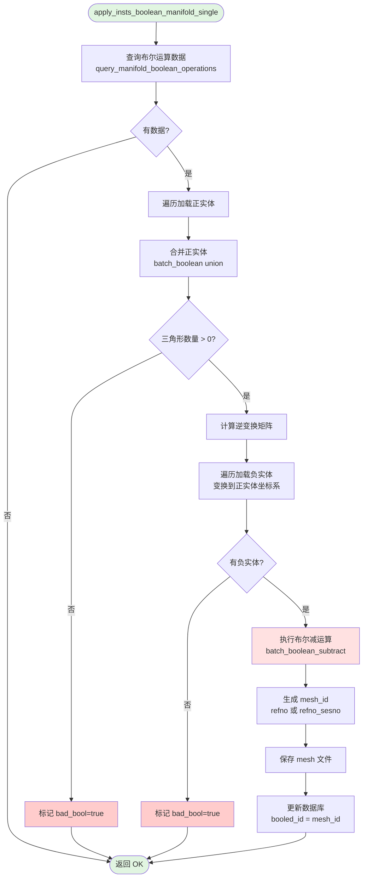
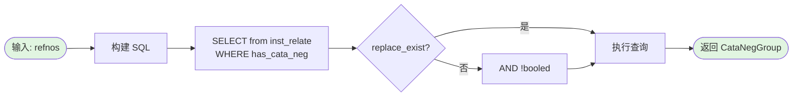
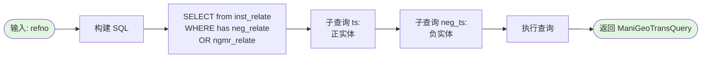
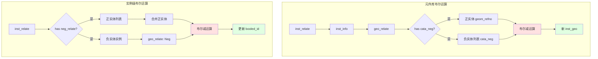
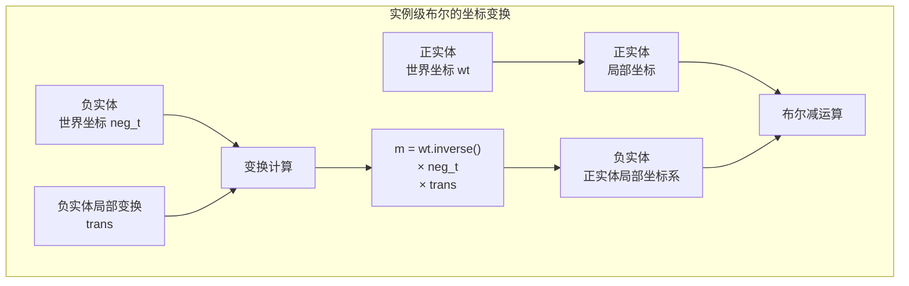
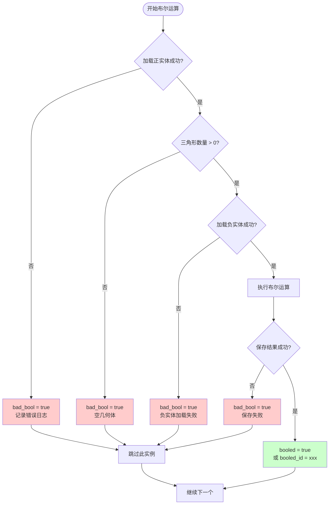

# 布尔运算流程图

## 1. 整体架构流程

```mermaid
flowchart TB
    Start([模型生成开始]) --> GenMesh[生成基础网格<br/>gen_inst_meshes]
    GenMesh --> UpdateAABB[更新包围盒<br/>update_inst_relate_aabbs]
    UpdateAABB --> BoolDecision{需要布尔运算?}
    
    BoolDecision -->|是| CataBool[元件库负实体运算<br/>apply_cata_neg_boolean_manifold]
    BoolDecision -->|否| End([完成])
    
    CataBool --> InstBool[实例级负实体运算<br/>apply_insts_boolean_manifold]
    InstBool --> End
    
    style Start fill:#e1f5e1
    style End fill:#e1f5e1
    style CataBool fill:#fff4e1
    style InstBool fill:#e1f0ff
```

## 2. 元件库负实体布尔运算流程

```mermaid
flowchart TB
    Start([apply_cata_neg_boolean_manifold]) --> Query1[查询元件库布尔组<br/>query_cata_neg_boolean_groups]
    
    Query1 --> Check1{有数据?}
    Check1 -->|否| End1([返回 OK])
    Check1 -->|是| Chunk[分批处理<br/>每批 1/16]
    
    Chunk --> Spawn[并发任务<br/>tokio::spawn]
    Spawn --> Loop1[遍历 CataNegGroup]
    
    Loop1 --> Query2[查询几何体详细信息<br/>geo_relate]
    Query2 --> Loop2[遍历 boolean_group]
    
    Loop2 --> FindPos{找到正实体?}
    FindPos -->|否| MarkBad1[标记 bad_bool=true]
    FindPos -->|是| LoadPos[加载正实体 Manifold]
    
    LoadPos --> LoadNeg[加载负实体 Manifolds]
    LoadNeg --> Boolean[执行布尔减运算<br/>batch_boolean_subtract]
    
    Boolean --> GenID[生成 mesh_id<br/>hash_with_another_refno]
    GenID --> SaveMesh[保存 mesh 文件]
    
    SaveMesh --> UpdateDB[更新数据库<br/>booled=true]
    UpdateDB --> NextBG{还有 boolean_group?}
    MarkBad1 --> NextBG
    
    NextBG -->|是| Loop2
    NextBG -->|否| ExecuteSQL[执行累积的 SQL]
    ExecuteSQL --> End2([完成])
    
    style Start fill:#e1f5e1
    style End1 fill:#e1f5e1
    style End2 fill:#e1f5e1
    style Boolean fill:#ffe1e1
    style MarkBad1 fill:#ffcccc
```

## 3. 实例级负实体布尔运算流程

```mermaid
flowchart TB
    Start([apply_insts_boolean_manifold_single]) --> Query[查询布尔运算数据<br/>query_manifold_boolean_operations]
    
    Query --> CheckEmpty{有数据?}
    CheckEmpty -->|否| End([返回 OK])
    CheckEmpty -->|是| LoadPos[遍历加载正实体]
    
    LoadPos --> UnionPos[合并正实体<br/>batch_boolean union]
    UnionPos --> CheckTri{三角形数量 > 0?}
    
    CheckTri -->|否| MarkBad1[标记 bad_bool=true]
    CheckTri -->|是| CalcInverse[计算逆变换矩阵]
    
    CalcInverse --> LoadNeg[遍历加载负实体<br/>变换到正实体坐标系]
    LoadNeg --> CheckNeg{有负实体?}
    
    CheckNeg -->|否| MarkBad2[标记 bad_bool=true]
    CheckNeg -->|是| Boolean[执行布尔减运算<br/>batch_boolean_subtract]
    
    Boolean --> GenID[生成 mesh_id<br/>refno 或 refno_sesno]
    GenID --> SaveMesh[保存 mesh 文件]
    
    SaveMesh --> UpdateDB[更新数据库<br/>booled_id = mesh_id]
    UpdateDB --> End
    MarkBad1 --> End
    MarkBad2 --> End
    
    style Start fill:#e1f5e1
    style End fill:#e1f5e1
    style Boolean fill:#ffe1e1
    style MarkBad1 fill:#ffcccc
    style MarkBad2 fill:#ffcccc
```

## 4. 数据库查询流程

### 4.1 元件库布尔查询

```mermaid
flowchart LR
    Input([输入: refnos]) --> BuildSQL[构建 SQL]
    BuildSQL --> SQL[SELECT from inst_relate<br/>WHERE has_cata_neg]
    SQL --> Filter1{replace_exist?}
    Filter1 -->|否| Filter2[AND !booled]
    Filter1 -->|是| Execute
    Filter2 --> Execute[执行查询]
    Execute --> Output([返回 CataNegGroup])
    
    style Input fill:#e1f5e1
    style Output fill:#e1f5e1
```

### 4.2 实例级布尔查询

```mermaid
flowchart LR
    Input([输入: refno]) --> BuildSQL[构建 SQL]
    BuildSQL --> SQL[SELECT from inst_relate<br/>WHERE has neg_relate<br/>OR ngmr_relate]
    SQL --> SubQuery1[子查询 ts:<br/>正实体]
    SubQuery1 --> SubQuery2[子查询 neg_ts:<br/>负实体]
    SubQuery2 --> Execute[执行查询]
    Execute --> Output([返回 ManiGeoTransQuery])
    
    style Input fill:#e1f5e1
    style Output fill:#e1f5e1
```

## 5. 布尔运算类型对比

```mermaid
graph TB
    subgraph "元件库布尔运算"
        A1[inst_relate] --> A2[inst_info]
        A2 --> A3[geo_relate]
        A3 --> A4{has cata_neg?}
        A4 -->|是| A5[正实体 geom_refno]
        A4 -->|是| A6[负实体列表 cata_neg]
        A5 --> A7[布尔减运算]
        A6 --> A7
        A7 --> A8[新 inst_geo]
    end
    
    subgraph "实例级布尔运算"
        B1[inst_relate] --> B2{has neg_relate?}
        B2 -->|是| B3[正实体列表]
        B2 -->|是| B4[负实体实例]
        B4 --> B5[geo_relate: Neg]
        B3 --> B6[合并正实体]
        B6 --> B7[布尔减运算]
        B5 --> B7
        B7 --> B8[更新 booled_id]
    end
    
    style A7 fill:#ffe1e1
    style A8 fill:#e1ffe1
    style B7 fill:#ffe1e1
    style B8 fill:#e1ffe1
```

## 6. 坐标变换流程

```mermaid
flowchart TB
    subgraph "实例级布尔的坐标变换"
        Pos[正实体<br/>世界坐标 wt] --> PosLocal[正实体<br/>局部坐标]
        
        Neg[负实体<br/>世界坐标 neg_t] --> Transform[变换计算]
        NegTrans[负实体局部变换<br/>trans] --> Transform
        
        Transform --> Formula["m = wt.inverse()<br/>× neg_t<br/>× trans"]
        Formula --> NegLocal[负实体<br/>正实体局部坐标系]
        
        PosLocal --> Boolean[布尔减运算]
        NegLocal --> Boolean
    end
```

## 7. 错误处理流程

```mermaid
flowchart TB
    Start([开始布尔运算]) --> LoadPos{加载正实体成功?}
    
    LoadPos -->|否| BadBool1[bad_bool = true<br/>记录错误日志]
    LoadPos -->|是| CheckTri{三角形数量 > 0?}
    
    CheckTri -->|否| BadBool2[bad_bool = true<br/>空几何体]
    CheckTri -->|是| LoadNeg{加载负实体成功?}
    
    LoadNeg -->|否| BadBool3[bad_bool = true<br/>负实体加载失败]
    LoadNeg -->|是| Boolean[执行布尔运算]
    
    Boolean --> Save{保存结果成功?}
    Save -->|否| BadBool4[bad_bool = true<br/>保存失败]
    Save -->|是| Success[booled = true<br/>或 booled_id = xxx]
    
    BadBool1 --> Skip[跳过此实例]
    BadBool2 --> Skip
    BadBool3 --> Skip
    BadBool4 --> Skip
    Success --> Continue[继续下一个]
    Skip --> Continue
    
    style BadBool1 fill:#ffcccc
    style BadBool2 fill:#ffcccc
    style BadBool3 fill:#ffcccc
    style BadBool4 fill:#ffcccc
    style Success fill:#ccffcc
```
