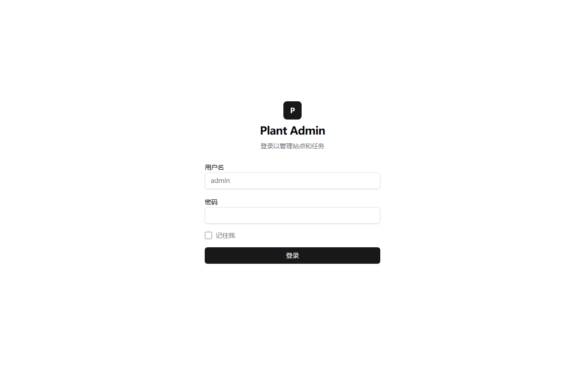
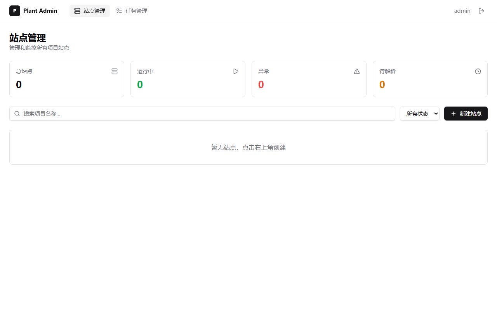
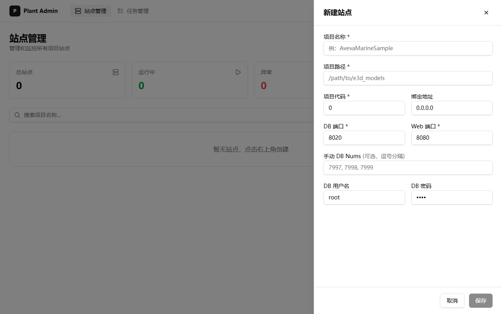
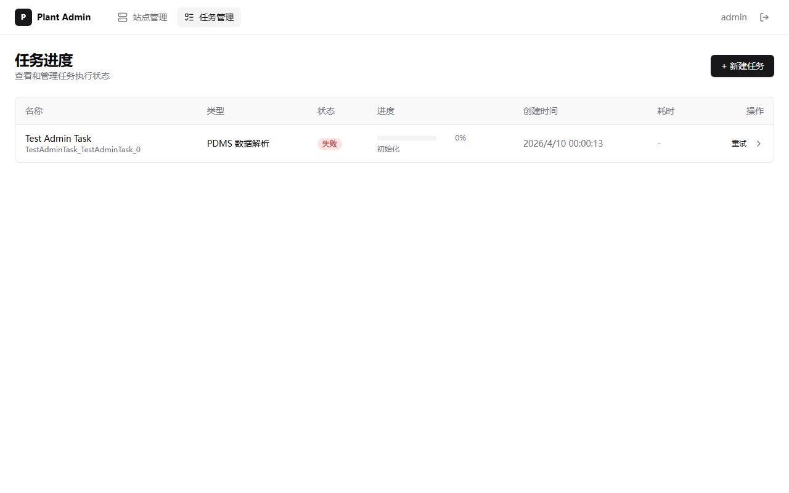

# Admin 管理模块使用教程

## 概述

Admin 模块提供站点管理、任务调度、用户认证三大功能。所有 admin API 路径以 `/api/admin/` 开头，需 Bearer Token 鉴权。

默认端口 `3100`（可通过配置文件或 `WEB_SERVER_PORT` 环境变量修改）。

访问地址：`http://localhost:3100/admin`

---

## 1. 登录

打开浏览器访问 `http://localhost:3100/admin`，自动跳转到登录页面。



输入已配置的管理员用户名和密码，点击 **登录** 按钮。

登录成功后自动跳转到站点管理页面。

### 配置管理员账号密码

通过环境变量设置（启动前）：

```bash
# Linux / macOS
export ADMIN_USER=myadmin
export ADMIN_PASS=MySecurePassword123

# Windows PowerShell
$env:ADMIN_USER = "myadmin"
$env:ADMIN_PASS = "MySecurePassword123"
```

首次启动时会将密码哈希（SHA-256 + 随机 salt）写入 SQLite。若未设置 `ADMIN_USER` 或 `ADMIN_PASS`，`/api/admin/*` 会返回 `503 管理员凭据未配置`。

### API 方式登录

```bash
curl -X POST http://localhost:3100/api/admin/auth/login \
  -H "Content-Type: application/json" \
  -d '{"username": "myadmin", "password": "MySecurePassword123"}'
```

返回 Token 后续请求需在 Header 中携带 `Authorization: Bearer <token>`。

---

## 2. 站点管理

登录后进入站点管理页面，展示站点总览统计和站点列表。



页面包含：
- **统计卡片**：总站点数、运行中、异常、待解析
- **搜索框**：按项目名称搜索
- **状态筛选**：全部 / 运行中 / 已停止 / 失败 / 草稿 / 已解析
- **新建站点** 按钮

### 2.1 新建站点

点击右上角 **+ 新建站点** 按钮，弹出创建对话框：



填写以下信息：

| 字段 | 必填 | 说明 |
|---|---|---|
| 项目名称 | 是 | 例如 `MyProject` |
| 项目代号 | 是 | 数字，例如 `1001` |
| 项目数据路径 | 是 | PDMS 数据库文件所在目录 |
| SurrealDB 端口 | 是 | 例如 `8030`（不能与已有站点冲突） |
| Web 端口 | 是 | 例如 `3200`（不能与已有站点冲突） |
| 绑定地址 | 否 | 默认 `127.0.0.1` |
| 数据库编号 | 否 | 指定要解析的数据库编号列表 |

### 2.2 站点操作

每个站点卡片提供以下操作：

| 操作 | 说明 |
|---|---|
| **解析** | 解析 PDMS 数据库文件（后台异步执行） |
| **启动** | 启动 SurrealDB + Web Server |
| **停止** | 停止所有进程 |
| **查看日志** | 查看解析/数据库/Web 服务器日志 |
| **编辑** | 修改站点配置（需先停止） |
| **删除** | 删除站点（需先停止） |

### 2.3 站点管理 API

```bash
# 设置 Token
TOKEN="<your-token>"

# 列出所有站点
curl http://localhost:3100/api/admin/sites \
  -H "Authorization: Bearer $TOKEN"

# 创建站点
curl -X POST http://localhost:3100/api/admin/sites \
  -H "Authorization: Bearer $TOKEN" \
  -H "Content-Type: application/json" \
  -d '{
    "project_name": "MyProject",
    "project_code": 1001,
    "project_path": "/data/models/myproject",
    "db_port": 8030,
    "web_port": 3200
  }'

# 解析数据
curl -X POST http://localhost:3100/api/admin/sites/{site_id}/parse \
  -H "Authorization: Bearer $TOKEN"

# 启动站点
curl -X POST http://localhost:3100/api/admin/sites/{site_id}/start \
  -H "Authorization: Bearer $TOKEN"

# 停止站点
curl -X POST http://localhost:3100/api/admin/sites/{site_id}/stop \
  -H "Authorization: Bearer $TOKEN"

# 查看运行状态
curl http://localhost:3100/api/admin/sites/{site_id}/runtime \
  -H "Authorization: Bearer $TOKEN"

# 查看日志
curl http://localhost:3100/api/admin/sites/{site_id}/logs \
  -H "Authorization: Bearer $TOKEN"

# 删除站点
curl -X DELETE http://localhost:3100/api/admin/sites/{site_id} \
  -H "Authorization: Bearer $TOKEN"
```

---

## 3. 任务管理

点击顶部导航栏的 **任务管理** 进入任务页面。



任务列表展示：
- **名称**：任务名 + ID
- **类型**：PDMS 数据解析 / 模型生成 / 完整生成 等
- **状态**：等待中 / 运行中 / 已完成 / 失败
- **进度**：进度条 + 当前步骤
- **创建时间**
- **操作**：重试

### 3.1 新建任务

点击右上角 **+ 新建任务** 按钮，填写：

| 字段 | 必填 | 说明 |
|---|---|---|
| 任务名称 | 是 | 例如 `解析 DB7999` |
| 任务类型 | 否 | 默认 `ParsePdmsData` |
| 优先级 | 否 | Low / Normal / High / Urgent |
| 关联站点 | 是 | admin 任务必须绑定站点 |

**支持的任务类型：**

| 类型 | 说明 |
|---|---|
| `ParsePdmsData` | 解析 PDMS 数据库文件 |
| `DataGeneration` | 生成模型数据 |
| `FullGeneration` | 完整生成（解析+建模+空间索引） |

### 3.2 任务操作

| 操作 | 条件 | 说明 |
|---|---|---|
| **重试** | 失败 | 创建一个新的任务记录并重新提交站点动作 |

### 3.3 任务管理 API

```bash
# 列出所有任务
curl http://localhost:3100/api/admin/tasks \
  -H "Authorization: Bearer $TOKEN"

# 创建任务
curl -X POST http://localhost:3100/api/admin/tasks \
  -H "Authorization: Bearer $TOKEN" \
  -H "Content-Type: application/json" \
  -d '{
    "task_name": "解析数据",
    "task_type": "ParsePdmsData",
    "site_id": "myproject-3200",
    "priority": "High"
  }'

# 带配置覆盖创建
curl -X POST http://localhost:3100/api/admin/tasks \
  -H "Authorization: Bearer $TOKEN" \
  -H "Content-Type: application/json" \
  -d '{
    "task_name": "自定义建模",
    "task_type": "DataGeneration",
    "site_id": "myproject-3200",
    "config_override": {
      "gen_model": true,
      "gen_mesh": true,
      "mesh_tol_ratio": 5.0,
      "manual_db_nums": [7999],
      "export_parquet": true
    }
  }'

# 查看任务详情
curl http://localhost:3100/api/admin/tasks/{task_id} \
  -H "Authorization: Bearer $TOKEN"

# 重试失败任务
curl -X POST http://localhost:3100/api/admin/tasks/{task_id}/retry \
  -H "Authorization: Bearer $TOKEN"
```

---

## 4. 完整操作流程

### 步骤 1：登录

浏览器访问 `http://localhost:3100/admin`，输入已配置的管理员凭据登录。

### 步骤 2：创建站点

1. 点击 **+ 新建站点**
2. 填写项目名称、代号、数据路径、端口
3. 点击 **创建**

### 步骤 3：解析数据

1. 在站点卡片上点击 **解析**
2. 等待后台解析完成（可通过日志查看进度）

### 步骤 4：启动站点

1. 解析完成后，点击 **启动**
2. 系统自动启动 SurrealDB 和 Web Server
3. 查看运行状态确认启动成功

### 步骤 5：创建任务

1. 切换到 **任务管理** 页面
2. 点击 **+ 新建任务**
3. 填写任务名称，选择类型和关联站点
4. 任务自动提交执行

### 步骤 6：监控进度

在任务列表中查看进度条和状态变化。失败的任务可点击 **重试**。

---

## 5. API 响应格式

所有 admin API 返回统一 JSON 格式：

```json
{
  "success": true,
  "message": "操作描述",
  "data": { ... }
}
```

**HTTP 状态码：**

| 状态码 | 含义 |
|---|---|
| 200 | 成功 |
| 201 | 创建成功 |
| 202 | 已接受（异步任务已提交） |
| 400 | 请求参数错误 |
| 401 | 未授权 |
| 503 | 管理员凭据未配置 |
| 404 | 资源不存在 |
| 409 | 冲突 |
| 500 | 服务器内部错误 |

---

## 6. 架构说明

```
admin_auth_handlers.rs   认证（login/logout/me + session SQLite 持久化 + SHA-256 密码哈希）
admin_handlers.rs        站点 CRUD + 生命周期管理（parse/start/stop）
admin_task_handlers.rs   任务 CRUD + 自动执行调度
admin_response.rs        公共 JSON 响应工具
managed_project_sites.rs 站点底层逻辑（进程管理/日志采集/配置生成）
```

**数据存储：** SQLite `deployment_sites.sqlite`

| 表 | 说明 |
|---|---|
| `managed_project_sites` | 站点配置与运行状态 |
| `admin_tasks` | 任务记录与状态 |
| `admin_sessions` | 登录会话（24h 过期，每小时自动清理） |
| `admin_users` | 用户账号（密码哈希存储） |
