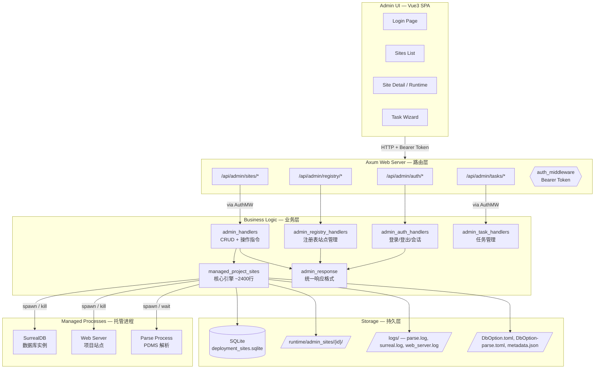
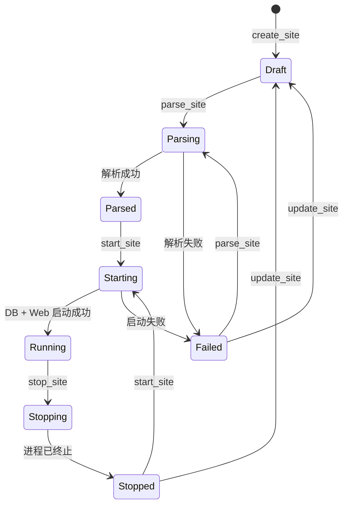
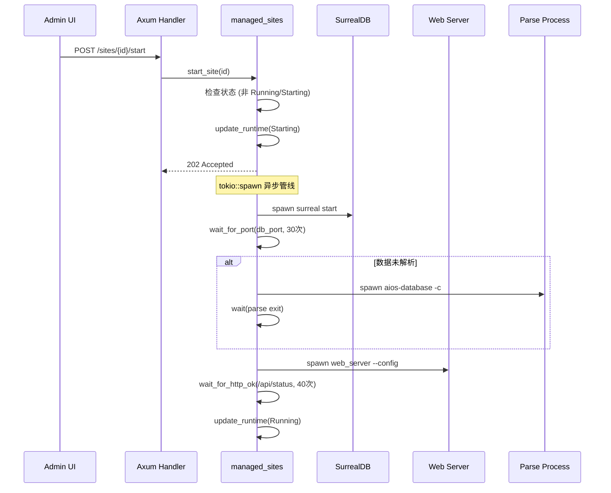

# Admin 站点管理模块 — 架构与原理

## 架构总览




## 站点生命周期




## 模块职责

### 1. 路由层 (`admin_handlers.rs`)

薄控制器，不含业务逻辑，职责：

- 接收 HTTP 请求，反序列化参数
- 调用 `managed_project_sites` 业务函数
- 通过 `admin_response` 统一格式化返回

API 端点：


| 方法     | 路径                              | 功能     |
| ------ | ------------------------------- | ------ |
| GET    | `/api/admin/sites`              | 列出所有站点 |
| POST   | `/api/admin/sites`              | 创建站点   |
| GET    | `/api/admin/sites/{id}`         | 站点详情   |
| PUT    | `/api/admin/sites/{id}`         | 更新站点配置 |
| DELETE | `/api/admin/sites/{id}`         | 删除站点   |
| POST   | `/api/admin/sites/{id}/parse`   | 触发解析   |
| POST   | `/api/admin/sites/{id}/start`   | 启动站点   |
| POST   | `/api/admin/sites/{id}/stop`    | 停止站点   |
| GET    | `/api/admin/sites/{id}/runtime` | 运行时状态  |
| GET    | `/api/admin/sites/{id}/logs`    | 日志查看   |


### 2. 鉴权层 (`admin_auth_handlers.rs`)

- 环境变量驱动：`ADMIN_USER` + `ADMIN_PASS` 配置管理员凭据
- SHA256 + UUID salt 密码哈希（TODO: 升级 argon2）
- SQLite 存储会话（`admin_sessions` 表），24 小时过期
- Bearer Token 中间件拦截所有 `/api/admin/*` 请求（auth 路由除外）
- 每小时自动清理过期 session

### 3. 核心引擎 (`managed_project_sites.rs`)

**数据模型**：`ManagedProjectSite` 保存在 SQLite，包含项目名/路径/端口/PID/状态等字段。

**配置生成**：

1. 读取模板 `DbOption.toml`
2. 按站点参数（端口、路径、凭据）覆盖字段
3. 生成运行配置 `DbOption.toml` 和解析配置 `DbOption-parse.toml`
4. 写入 `metadata.json`

**进程管理**：

- `spawn_db_process` — 启动 SurrealDB（`surreal start`），输出重定向到 `surreal.log`
- `spawn_web_process` — 启动项目 Web Server（复用当前二进制 + `--config`），输出到 `web_server.log`
- `spawn_parse_process` — 启动 PDMS 解析（`aios-database -c`），输出到 `parse.log`
- `kill_pid` — 先 SIGTERM/taskkill，等 600ms，仍存活则 SIGKILL/强制终止

**状态探活**：

- `pid_running` — Unix: `kill -0`; Windows: `tasklist /FI`
- `port_in_use` — TCP 连接探测
- `refresh_site` — 根据 PID/端口实际状态修正数据库中的状态记录

**风险评估**：

```
┌─────────────────────────────────────────┐
│ 机器级指标           阈值               │
│ CPU        Warning: 85%  Critical: 95%  │
│ Memory     Warning: 80%  Critical: 90%  │
│ Disk       Warning: 85%  Critical: 95%  │
├─────────────────────────────────────────┤
│ 进程级指标           阈值               │
│ CPU        Warning: 70%  Critical: 90%  │
│ Memory     Warning:1.5GB Critical: 3GB  │
├─────────────────────────────────────────┤
│ 解析健康              阈值              │
│ Duration   Warning:10min Critical:30min │
└─────────────────────────────────────────┘
```

**日志智能摘要**：

- 解析日志：识别数据库连接、文件读取、refno 计数等关键事件
- DB 日志：识别启动/停止信号
- Web 日志：识别服务启动和访问地址

### 4. 统一响应 (`admin_response.rs`)

所有 API 返回格式统一：

```json
{
  "success": true|false,
  "message": "描述信息",
  "data": { ... }
}
```

错误状态码自动分类：

- 包含"不存在" → 404
- 包含"不能为空"/"必须大于" → 400
- 包含"运行中"/"已被占用"/"端口" → 409
- 其他 → 500

### 5. `RuntimeUpdate` 结构体

```rust
#[derive(Default)]
pub struct RuntimeUpdate {
    pub status: Option<ManagedSiteStatus>,
    pub parse_status: Option<ManagedSiteParseStatus>,
    pub db_pid: Option<Option<u32>>,
    pub web_pid: Option<Option<u32>>,
    pub parse_pid: Option<Option<u32>>,
    pub last_error: Option<Option<String>>,
    pub entry_url: Option<Option<String>>,
    pub last_parse_started_at: Option<Option<String>>,
    pub last_parse_finished_at: Option<Option<String>>,
    pub last_parse_duration_ms: Option<Option<u64>>,
}
```

使用命名字段 + `..Default::default()` 模式，只设置需要变更的字段，避免 11 个位置参数的传参错误。

## 启动流程详解




## 目录结构

```
runtime/admin_sites/
└── {site-id}/
    ├── DbOption.toml          # 运行配置
    ├── DbOption-parse.toml    # 解析配置
    ├── metadata.json          # 站点元数据
    ├── data/
    │   └── surreal.db         # SurrealDB 数据
    └── logs/
        ├── parse.log          # 解析日志
        ├── surreal.log        # 数据库日志
        └── web_server.log     # 站点日志
```

## 跨平台支持


| 功能     | Unix                  | Windows                          |
| ------ | --------------------- | -------------------------------- |
| 进程检测   | `kill -0 {pid}`       | `tasklist /FI "PID eq {pid}"`    |
| 进程终止   | SIGTERM → SIGKILL     | `taskkill /PID {pid} /F`         |
| 端口进程查找 | `lsof -ti tcp:{port}` | `netstat -ano | findstr :{port}` |
| 端口占用检测 | TCP connect           | TCP connect                      |


