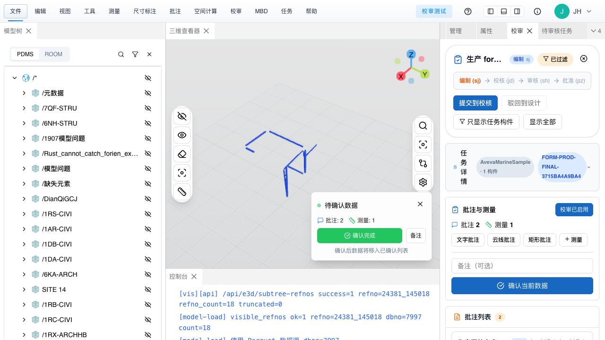
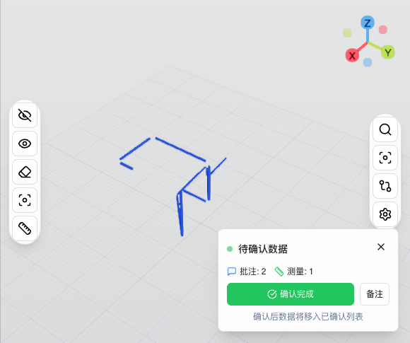

# workflow sync / form_id 联调教程（附 Playwright 截图）

> 目标：给联调人员一份**可操作教程**，用于验证以下业务目标：
>
> 1. 校对 / 校核人员在校审面板里点击“确认当前数据 / 保存”后，批注、云线、测量、备注会落库；
> 2. 之后通过单据 `form_id` 打开 reviewer 页面时，历史确认记录能够重新显示；
> 3. 送审时调用 `POST /api/review/workflow/sync`，会按 `form_id` 返回这些 records 数据。

## 相关文档导航

- **Guides 总入口**：`docs/guides/README.md`
- **完整接口 / 数据库测试模拟**：`docs/guides/WORKFLOW_SYNC_FORM_ID_TEST_SIMULATION.md`
- **PMS mock 展示层联调页**：`docs/guides/PMS_WORKFLOW_SYNC_MOCK_PAGE.md`
- **Platform API HTTP 示例**：`docs/guides/PLATFORM_API_HTTP_EXAMPLES.md`

---

## 1. 你会得到什么

这份教程交付两部分内容：

1. **一套完整手工联调步骤**
   - 从创建 `form_id`、创建任务、保存 records、到调用 `workflow/sync`
   - 再到 reviewer 页面打开与 Playwright 截图验收

2. **两张 Playwright 实际截图证据**
   - reviewer 页面截图
   - viewer canvas 截图

截图文件已整理到仓库：

- `docs/guides/assets/workflow_sync_form_id_playwright/reviewer-page.png`
- `docs/guides/assets/workflow_sync_form_id_playwright/viewer-canvas.png`

---

## 2. 适用场景

适合以下角色直接复用：

- PMS / 流程平台联调人员
- plant3d-web 前端联调人员
- plant-model-gen 后端联调人员
- 生产环境回归验证人员

---

## 3. 前置条件

### 3.1 服务准备

#### 本地联调

- 后端：`http://127.0.0.1:3100`
- 前端：`http://127.0.0.1:3101`

#### 生产联调

- 后端 / 前端统一入口：`http://123.57.182.243`

### 3.2 健康检查

先确认后端健康：

```bash
curl -fsS http://123.57.182.243/api/health
```

期望看到：

```json
{
  "database": "healthy",
  "status": "ok"
}
```

### 3.3 Playwright 浏览器要求

推荐使用：

- `channel: "chrome"`
- 即 Playwright 调用本机 Chrome

原因：

- 默认 headless chromium 在部分三维场景下可能拿不到稳定的 WebGL2 环境
- 我们此前已验证：**Chrome channel 的兼容性更稳**

---

## 4. 联调总流程

```text
1. 调 embed-url 生成/恢复 form_id
2. 用该 form_id 创建 review task
3. 模拟 reviewer 在校审面板里保存一批确认记录
4. 调 workflow/sync(form_id) 验证 records 返回
5. 构造 reviewer 嵌入 URL
6. 用 Playwright 打开 reviewer 页面
7. 截图 + 读取页面状态
8. 验证页面已恢复任务与历史记录
9. 删除测试 form_id
```

---

## 5. 第一步：生成 form_id 与 token

### 请求

```http
POST /api/review/embed-url
Content-Type: application/json

{
  "project_id": "AvevaMarineSample",
  "user_id": "SJ",
  "form_id": "FORM-EXAMPLE-1234567890AB"
}
```

### 预期

返回中至少要拿到：

- `data.token`
- `data.query.form_id`
- `data.lineage.form_id`

并确认：

- `data.query.form_id == FORM-EXAMPLE-1234567890AB`

---

## 6. 第二步：创建任务

### 请求

```http
POST /api/review/tasks
Authorization: Bearer <token>
Content-Type: application/json

{
  "title": "workflow-sync-formid-playwright",
  "description": "用于 Playwright 联调教程",
  "modelName": "AvevaMarineSample",
  "checkerId": "JH",
  "approverId": "SH",
  "reviewerId": "JH",
  "formId": "FORM-EXAMPLE-1234567890AB",
  "priority": "medium",
  "components": [
    {
      "id": "c1",
      "refNo": "24381_145018",
      "name": "管道A",
      "type": "PIPE"
    },
    {
      "id": "c2",
      "refNo": "24381_145020",
      "name": "阀门B",
      "type": "VALVE"
    }
  ]
}
```

### 预期

返回：

- `task.id`
- `task.formId == FORM-EXAMPLE-1234567890AB`

---

## 7. 第三步：模拟 reviewer 点击保存（确认当前数据）

这一步等价于 reviewer 在校审面板中：

- 画文字批注
- 画云线
- 做测量
- 填备注
- 然后点击“确认当前数据 / 保存”

### 请求

```http
POST /api/review/records
Authorization: Bearer <token>
Content-Type: application/json

{
  "taskId": "<task_id>",
  "formId": "FORM-EXAMPLE-1234567890AB",
  "type": "batch",
  "annotations": [
    {
      "id": "anno-text-001",
      "type": "text",
      "content": "Playwright 历史文字批注",
      "position": { "x": 1, "y": 2, "z": 3 }
    }
  ],
  "cloudAnnotations": [
    {
      "id": "anno-cloud-001",
      "type": "cloud",
      "shape": "ellipse",
      "points": [
        { "x": 0, "y": 0, "z": 0 },
        { "x": 1, "y": 1, "z": 1 }
      ]
    }
  ],
  "rectAnnotations": [],
  "obbAnnotations": [],
  "measurements": [
    {
      "id": "measure-001",
      "type": "distance",
      "value": 66.6,
      "unit": "mm"
    }
  ],
  "note": "Playwright 历史记录回显验收"
}
```

### 预期

返回：

- `success = true`
- `record.id` 非空

并且后端会把这批数据写入：

- `review_records.form_id`
- `review_records.task_id`
- `review_records.annotations`
- `review_records.cloud_annotations`
- `review_records.measurements`
- `review_records.note`

---

## 8. 第四步：先验证 workflow/sync

在打开浏览器前，建议先确认后端聚合已经正确。

### 请求

```http
POST /api/review/workflow/sync
Content-Type: application/json

{
  "form_id": "FORM-EXAMPLE-1234567890AB",
  "token": "<token>",
  "action": "query",
  "actor": {
    "id": "SJ",
    "name": "设计",
    "roles": "sj"
  }
}
```

### 核心断言

`data.records[0]` 应该至少包含：

- `annotations.length == 1`
- `cloud_annotations.length == 1`
- `measurements.length == 1`
- `note == "Playwright 历史记录回显验收"`

如果这里不对，就先不要做浏览器侧验收。

---

## 9. 第五步：构造 reviewer 嵌入 URL

reviewer 页面 URL 形态如下：

```text
http://123.57.182.243/?form_id=<FORM_ID>&user_token=<JWT>&user_id=JH&user_role=reviewer&project_id=AvevaMarineSample
```

关键参数说明：

- `form_id`：要恢复的单据
- `user_token`：embed-url 返回的 JWT
- `user_id=JH`：这里用 reviewer 身份打开
- `user_role=reviewer`
- `project_id=AvevaMarineSample`

---

## 10. 第六步：Playwright 截图验收

下面给出一个最小可用的 Playwright 示例，用于：

1. 打开 reviewer 页面
2. 等待页面稳定
3. 截整页图
4. 截 viewer canvas 图
5. 读取页面文本做断言

### 示例脚本（Node.js）

```js
import { chromium } from 'playwright';
import fs from 'node:fs/promises';

const url = process.env.TARGET_URL;
const outDir = process.env.OUT_DIR || '/tmp/pw-workflow-sync';

await fs.mkdir(outDir, { recursive: true });

const browser = await chromium.launch({
  channel: 'chrome',
  headless: true,
});

const page = await browser.newPage({ viewport: { width: 1600, height: 1200 } });
await page.goto(url, { waitUntil: 'networkidle', timeout: 120000 });
await page.waitForTimeout(5000);

const bodyText = await page.locator('body').innerText();
await page.screenshot({ path: `${outDir}/reviewer-page.png`, fullPage: true });

const canvas = page.locator('canvas').first();
if (await canvas.count()) {
  await canvas.screenshot({ path: `${outDir}/viewer-canvas.png` });
}

await fs.writeFile(
  `${outDir}/snapshot.json`,
  JSON.stringify({ url, bodyText }, null, 2),
  'utf-8'
);

console.log(JSON.stringify({ outDir, bodyText }, null, 2));
await browser.close();
```

### 运行方式示例

```bash
TARGET_URL='http://123.57.182.243/?form_id=FORM-EXAMPLE-1234567890AB&user_token=<JWT>&user_id=JH&user_role=reviewer&project_id=AvevaMarineSample' \
OUT_DIR=/tmp/pw-workflow-sync \
node replay-check.mjs
```

---

## 11. Playwright 页面应该看到什么

如果恢复成功，页面正文里通常应该能看到类似信息：

- 单据号：`FORM-...`
- `校审已启用`
- `批注 2`
- `测量 1`
- `审核记录 1`
- 文字批注标题
- 云线条目
- 历史备注文本
- 确认时间

### 说明

这里的 `批注 2` 常见原因是：

- 1 条文字批注
- 1 条云线批注

被页面统计为两类批注项。

---

## 12. 已整理进仓库的 Playwright 截图

### 12.1 reviewer 页面截图

文件：

- `docs/guides/assets/workflow_sync_form_id_playwright/reviewer-page.png`

预览：



### 12.2 viewer canvas 截图

文件：

- `docs/guides/assets/workflow_sync_form_id_playwright/viewer-canvas.png`

预览：



> 这两张图来自此前一次真实生产联调的 Playwright 验收产物，用来说明“页面恢复后应该长什么样、截图应该如何保存”。

---

## 13. 推荐验收顺序

建议严格按下面顺序做，避免误判：

### 阶段 A：后端数据先正确

先验证：

- `records` 保存成功
- `workflow/sync(form_id)` 已返回 `records`
- `review_records.form_id` 能在数据库里查到

### 阶段 B：浏览器恢复再正确

再验证：

- reviewer 页面通过 `form_id` 恢复到正确任务
- 页面显示历史批注 / 测量 / 审核记录
- Playwright 截到 reviewer 页面与 viewer canvas

如果阶段 A 不对，不要先纠缠前端。

---

## 14. 清理步骤

完成联调后，务必删除测试单据：

```http
POST /api/review/delete
Content-Type: application/json

{
  "form_ids": ["FORM-EXAMPLE-1234567890AB"],
  "operator_id": "SJ",
  "token": "<token>"
}
```

预期：

```json
{
  "code": 200,
  "message": "ok"
}
```

---

## 15. 常见问题

### Q1：为什么 workflow/sync 能查到，但页面没有恢复？

优先检查：

1. reviewer 页面 URL 里的 `form_id` 是否正确
2. `user_token` 是否与该 `form_id` 一致
3. 前端是否真的请求了正确后端地址，而不是用户本机 `localhost`
4. 页面是否真正 `setCurrentTask()` 成功

### Q2：为什么要用 Chrome channel，而不是默认 chromium？

因为三维 viewer 在默认 headless chromium 下，WebGL2 兼容性不稳定；我们此前联调中，Chrome channel 更稳。

### Q3：为什么保存不是实时写库，而是点保存才入库？

因为当前 reviewer 语义是：

- 编辑中数据先存在前端临时态
- 点击“确认当前数据 / 保存”时，整批写入 `review_records`

这是 batch 记录模型，不是逐操作流水模型。

---

## 16. 相关文件

| 路径 | 作用 |
|------|------|
| `docs/guides/WORKFLOW_SYNC_FORM_ID_TEST_SIMULATION.md` | 完整接口与数据库测试模拟文档 |
| `docs/guides/PMS_WORKFLOW_SYNC_MOCK_PAGE.md` | PMS mock 页联调说明 |
| `docs/guides/assets/workflow_sync_form_id_playwright/reviewer-page.png` | Playwright reviewer 页面截图 |
| `docs/guides/assets/workflow_sync_form_id_playwright/viewer-canvas.png` | Playwright viewer 截图 |
| `shells/run_pms_workflow_mock_page.sh` | 生成本地 PMS mock 页 |
| `src/web_api/review_api.rs` | 保存确认记录 |
| `src/web_api/platform_api/workflow_sync.rs` | workflow/sync 聚合 records |

---

## 17. 最终结论

如果你按这份教程执行，并同时满足：

- `POST /api/review/records` 成功
- `review_records.form_id` 可实库查到
- `POST /api/review/workflow/sync(form_id)` 能返回 `records`
- Playwright 打开的 reviewer 页面能显示历史批注 / 测量 / 审核记录

那么就可以判定：

> **“校审面板保存的数据已经落库，并且能够通过 form_id 恢复并显示” 这条链路成立。**
