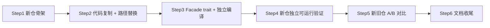

# 模型生成代码抽离至 `plant-model-core` 独立仓库开发计划

> 创建日期：2026-05-12  
> 状态：**v2 修订稿**（根据审核反馈修订：旧仓保持原样不动，本期仅搭建新仓并验证对比）  
> 关联仓库：
> - 主仓 `D:\work\plant-code\plant-model-gen`（crate：`aios-database`）— **本期不改动**
> - 新仓 `D:\work\plant-code\plant-model-core`（crate：`plant_model_core`，待建）
> - 基础库 `D:\work\plant-code\rs-core`（crate：`aios_core`，已存在）

---

## 0. 目标与约束

- **目标**：将 `plant-model-gen` 中"模型生成与导出"相关代码**复制**到独立 Git 仓 `plant-model-core`（crate 名 `plant_model_core`），使其能独立编译运行，并与旧仓产出做 **A/B 对比验证**。
- **核心原则：旧仓不动**：主仓 `plant-model-gen` 在整个本期内**不做任何代码删除、路径修改、依赖切换**。旧仓代码保持原样，供后续对比和回退。
- **抽离范围**（A1 最小化 + 整段 export_model）：
  - `src/fast_model/gen_model/` 全部
  - `src/fast_model/cal_model/` 全部
  - `src/fast_model/export_model/` 全部
  - 与上述强绑定的支撑模块：`fast_model/mod.rs` 中的 AABB 缓存全局、`error_macros.rs`、`refno_errors.rs`、`shared.rs`、`utils.rs`、`material_config.rs`、`unit_converter.rs`、`reuse_unit.rs`、`concurrency.rs`、`aabb_tree.rs`、`incremental/`、`foyer_cache/`、`instance_cache.rs`、`model_cache/`、`model_store.rs`、`precheck.rs`、`cache_flush.rs`、`cata_cache_gen.rs`、`session.rs`（feature 门控）
- **不在本期范围**：`room_model.rs` / `room_worker.rs`、`scene_tree/`、`sqlite_index/`、`spatial_index/`、`pe_transform_*`、`rvm_import/`、`web_server/`、`web_api/`、`versioned_db/` 仍留在主仓
- **API 风格（C2）**：引入 trait/Facade 接口层，新仓通过接口对外提供能力，全局静态随代码一并复制到新仓
- **依赖（aios_core）**：与主仓一致使用 `git + [patch]` 本地 path 联调
- **不要触发 test 编译**（遵循 `AGENTS.md`），所有验证通过运行 `web_server` + POST 调用 / `aios-database` CLI + JSON 完成

## 1. 整体流程（旧仓不动版）



> **与 v1 的核心区别**：Step4 不再改主仓依赖，Step6 不再删主仓文件。主仓全程零改动。

## 2. 阶段拆解

### Step 1 — 新仓骨架（0.5 天）

1. 在 `D:\work\plant-code\plant-model-core`（与 `rs-core` 同级）建空仓，`cargo new --lib plant_model_core`，edition `2024`。
2. `Cargo.toml` 基本对齐主仓中和模型生成相关的依赖子集：
   - `aios_core`、`surrealdb`、`surrealdb-types`、`pdms_io`、`parse_pdms_db`
   - `nalgebra`、`parry3d`、`parry2d`、`glam`、`indextree`、`id_tree`、`petgraph`、`rstar`
   - `rkyv`、`gltf`、`tiny-skia`
   - `dashmap`、`rayon`、`indexmap`、`tokio`、`tokio-stream`
   - `serde`、`serde_json`、`serde_with`、`bincode`、`anyhow`、`thiserror`
   - `tracing`、`tracing-subscriber`、`log`、`simplelog`、`env_logger`
   - `bitflags`、`derive_more`、`itertools`、`once_cell`、`smol_str`、`strum`
   - `num_cpus`、`num_enum`、`async-trait`、`futures`、`flume`、`twox-hash`、`urlencoding`、`walkdir`、`notify`、`indicatif`、`chrono`、`uuid`、`sha2`、`hex`、`regex`、`nom`
   - 可选：`reqwest`、`parquet` + `arrow-array` + `arrow-schema` + `polars`、`rust_xlsxwriter`、`miniacd` + `glamx`、`calamine`
   - **不引入**：`axum` / `tower-http` / `tower` / `sysinfo` / `rusqlite`（仍留主仓）
3. **Features 设计**（与主仓对齐，便于 1:1 映射）：
   ```toml
   default = ["manifold"]
   manifold = ["aios_core/manifold"]
   gen_model = ["aios_core/gen_model"]
   parquet-export = ["dep:parquet","dep:arrow-array","dep:arrow-schema","dep:polars"]
   excel-export = ["dep:rust_xlsxwriter"]
   spec-loader = ["dep:calamine","aios_core/spec-loader"]
   convex-runtime = []
   convex-decomposition = ["convex-runtime","dep:miniacd","dep:glamx"]
   surreal-save = []
   write-to-surrealdb = []
   model-writer-drain = []
   mem-kv-save = ["aios_core/mem-kv-save"]
   debug_obj_export = []
   debug_expr = ["aios_core/debug_expr"]
   debug_e3d = []
   ```
4. 加入本地 patch：
   ```toml
   [patch."https://github.com/happyrust/rs-core.git"]
   aios_core = { path = "../rs-core" }

   [patch."https://github.com/happyrust/pdms-io.git"]
   pdms_io = { path = "../pdms-io-fork" }
   parse_pdms_db = { path = "../pdms-io-fork/crates/parse_pdms_db" }
   ```
5. `.gitignore`、`AGENTS.md`（继承主仓规则：禁用 test、web_server 用 POST 验证）、`README.md`、`CHANGELOG.md`。

### Step 2 — 代码物理搬运 + 路径替换（1.5 天）

按下面的物理结构拷贝至新仓 `src/`：

```
plant-model-core/src/
├── lib.rs                  # 顶层 re-export，模块声明
├── api/                    # Facade traits（Step 3 落地）
├── gen_model/              # 来自 fast_model/gen_model/
├── cal_model/              # 来自 fast_model/cal_model/
├── export_model/           # 来自 fast_model/export_model/
├── support/                # 来自 fast_model/ 顶层文件（aabb_tree、unit_converter、material_config、concurrency、convex_decomp、reuse_unit、precheck 等）
├── cache/                  # foyer_cache、instance_cache、model_cache、model_store、cata_cache_gen、cache_flush
├── errors/                 # error_macros、refno_errors
└── shared.rs / utils.rs / session.rs
```

**路径替换规则**（在新仓内统一改）：

| 原路径 | 新路径 |
|---|---|
| `crate::fast_model::gen_model::X` | `crate::gen_model::X` |
| `crate::fast_model::export_model::X` | `crate::export_model::X` |
| `crate::fast_model::cal_model::X` | `crate::cal_model::X` |
| `crate::fast_model::<file>`（顶层文件） | `crate::support::<file>` / `crate::cache::<file>` |
| `crate::scene_tree::*` | 通过 trait（Step 3）从外部注入 |
| `crate::sqlite_index::*` / `crate::spatial_index::*` | 同上 |
| `crate::pe_transform_*` / `crate::versioned_db::*` / `crate::data_interface::*` / `crate::options::DbOptionExt` | 同上 |
| `crate::shared::*`（进度广播中心） | 同上 |
| `crate::web_server::*` / `crate::web_api::*` | 不应有反向依赖，遇到即收口（基本不存在） |

**全局静态**（按用户决定）随代码一并迁出，在新仓内集中放置：
- `EXIST_MESH_GEO_HASHES`、`AabbCacheFileV1` 序列化
- `GLOBAL_TRANSFORM_CACHE`（`gen_model::transform_cache`）
- `CAPTURE_CONFIG`、`set_capture_config` / `get_capture_config`
- `REFNO_ERROR_STORE`、debug 标志（`DEBUG_MODEL_ERRORS_ONLY` 等）
- 智能调试宏（`smart_debug_model!` / `smart_debug_error!` 等）

> **注意**：本期旧仓保持原样不动。全局静态在新仓中是**独立副本**，旧仓仍保留自己的原始版本。待 A/B 验证通过后，再在下期做主仓依赖切换。

### Step 3 — Facade trait 接口层（1 天）

在 `plant_model_core::api` 下定义对外接入点和反向回调接口，分两类。

**对外提供的 Facade（主仓调用）：**

```rust
// api/traits.rs
#[async_trait::async_trait]
pub trait ModelGenerator: Send + Sync {
    async fn gen_all_geos_data(
        &self,
        refnos: Vec<aios_core::RefU64>,
        ctx: &GenContext,
    ) -> anyhow::Result<()>;

    async fn gen_inst_meshes(&self, ctx: &GenContext) -> anyhow::Result<()>;
}

#[async_trait::async_trait]
pub trait ModelExporter: Send + Sync {
    async fn export_glb(&self, req: ExportGlbReq) -> anyhow::Result<ExportResult>;
    async fn export_gltf(&self, req: ExportGltfReq) -> anyhow::Result<ExportResult>;
    async fn export_parquet(&self, req: ExportParquetReq) -> anyhow::Result<ExportResult>;
    async fn export_instanced_bundle(&self, req: ExportBundleReq) -> anyhow::Result<ExportResult>;
}

pub struct DefaultModelStack; // 提供以上两个 trait 的默认实现，封装内部模块
```

**对外反向回调接口（依赖注入，主仓提供实现）：**

```rust
// api/hooks.rs
pub trait SpatialIndexHook: Send + Sync {
    fn refresh_from_cache(&self, dbnum: u32) -> anyhow::Result<()>;
}

pub trait SceneTreeProvider: Send + Sync {
    fn tree_index_manager(&self) -> std::sync::Arc<dyn TreeIndexManagerLike>;
}

pub trait ProgressSink: Send + Sync {
    fn emit(&self, evt: ProgressEvent);
}

pub trait DbOptionLike: Send + Sync {
    fn meshes_path(&self) -> std::path::PathBuf;
    fn project_output_dir(&self) -> std::path::PathBuf;
    // ... 仅保留 gen / export 真正需要的 getter 子集
}
```

`GenContext` 持有：
- `Arc<dyn DbOptionLike>`
- `Option<Arc<dyn SpatialIndexHook>>`
- `Option<Arc<dyn SceneTreeProvider>>`
- `Option<Arc<dyn ProgressSink>>`

替代当前对 `DbOptionExt` / `scene_tree::*` / `shared::progress` 的直接耦合。

**接口层文件**：`plant-model-core/src/api/{mod.rs, traits.rs, hooks.rs, context.rs, types.rs, default_impl.rs}`。

### Step 4 — 新仓独立可运行验证（1 天）

> **本步骤不改动主仓**。新仓自带一个轻量 CLI / example binary 来验证独立运行能力。

1. 在新仓添加 `examples/standalone_gen.rs`（或 `src/bin/standalone.rs`），实现一个最小可运行入口：
   - 接受 dbnum、meshes_path 等参数
   - 构造 `GenContext`（使用 mock 或 no-op 实现 `SpatialIndexHook` / `SceneTreeProvider` / `ProgressSink`）
   - 调用 `DefaultModelStack::gen_all_geos_data` 跑一次模型生成
   - 调用 export 接口导出 GLB / Parquet
2. 确保 `cargo build --features full` 在新仓内编译通过
3. 确保 `cargo build --features manifold,gen_model` 在新仓内编译通过
4. 修复所有编译错误（主要是路径替换遗漏、缺失的 trait bound 等）
5. 新仓内 hook trait 的 mock 实现放在 `src/api/mock_hooks.rs`，仅用于独立运行验证，不用于生产

### Step 5 — 新旧仓 A/B 对比验证（1 天）

> **主仓保持原样不动**，独立运行旧仓和新仓，对比产出一致性。

**不编译 `cargo test`**。验证矩阵：

| 验证项 | 旧仓（baseline） | 新仓（实验） |
|---|---|---|
| 编译通过 | 旧仓 `cargo build` 不变 | 新仓 `cargo build --features full` |
| 模型生成 | 旧仓 `web_server` POST 跑 dbnum | 新仓 standalone binary 跑同一 dbnum |
| GLB 导出 | 旧仓 POST `/api/export/glb` | 新仓 standalone export |
| Parquet 导出 | 旧仓 POST `/api/export/parquet/{dbnum}` | 新仓 standalone export |

**A/B 对比指标**：
- GLB 文件 hash 是否一致
- Parquet 行数是否一致
- `inst_relate` 表统计数据是否一致
- 生成耗时差异（允许 ±10%）

> 旧仓的 web_server / CLI 照常运行，不做任何改动。新仓用自己的 standalone binary 独立产出结果。

### Step 6 — 文档收尾（0.5 天）

> **主仓不做任何改动**，仅在新仓侧完成文档。

1. 新仓 `README.md`：记录 features / patch 用法 / Facade 入口示例 / standalone binary 用法
2. 新仓 `CHANGELOG.md`：记录 v0.1.0 初始版本说明
3. 新仓 `AGENTS.md`：继承主仓规则（禁用 test、验证方式说明）
4. 编写 A/B 对比验证报告（GLB hash / Parquet 行数 / 耗时对比），存放在 `docs/verification-report.md`
5. 新仓首版 tag `v0.1.0`

> **下期预告**（不在本期范围）：待 A/B 验证通过确认产出一致后，再做主仓依赖切换（原 Step 4 v1 内容）和旧代码清理（原 Step 6 v1 内容）。

## 3. 风险与缓解

| 风险 | 缓解 |
|---|---|
| 全局静态在新旧仓各有一份导致语义分歧 | 本期新旧仓独立运行，不共享进程；A/B 对比验证产出一致性后再合并 |
| Features 拆分错位导致条件编译漏链 | Step 1 一次性把 features 表对齐画好，新仓内 `--features full` 跑通即可 |
| `aios_core` 接口在两仓不一致 | 两仓均使用 `[patch]` 指向同一 `../rs-core`，保证联调期间一致 |
| 双向耦合（gen_model → scene_tree / sqlite_index） | 通过 Step 3 的 `SpatialIndexHook` / `SceneTreeProvider` trait 注入，新仓不直接依赖主仓 |
| 新仓独立运行缺少主仓上下文（DB、scene_tree 等） | Step 4 提供 mock hooks 实现，或通过 standalone binary 直接读取同一份数据文件 |
| 私有 Git 仓权限 / CI | 部署文档照搬主仓的 rs-core 配置（PAT/SSH），CI 复用现有 token |

## 4. 工期估算

| 阶段 | 估时 |
|---|---|
| Step 1 新仓骨架 | 0.5 天 |
| Step 2 代码复制 + 路径替换 | 1.5 天 |
| Step 3 Facade trait + 独立编译 | 1 天 |
| Step 4 新仓独立可运行验证 | 1 天 |
| Step 5 新旧仓 A/B 对比 | 1 天 |
| Step 6 文档收尾 | 0.5 天 |
| **合计** | **~5.5 个工作日** |

## 5. 交付物

- 新仓 `plant-model-core`（首版 tag `v0.1.0`），含 Facade traits + default impl + standalone binary
- A/B 对比验证报告：新仓 standalone vs 旧仓 web_server 产出对比（GLB hash / Parquet 行数）
- 新仓 README / CHANGELOG / AGENTS.md
- **主仓零改动**（无 PR）

## 6. 关键决策记录（与发起人对齐）

| 决策项 | 选项 |
|---|---|
| 抽离范围 | **A1 最小化**（仅 `gen_model` + `cal_model`） |
| 仓库形态 | **B1 独立 Git 仓**，git 依赖 |
| API 风格 | **C2 引入 trait/Facade 接口层** |
| 全局静态 | **随代码一起迁到新仓** |
| 新仓名 | **plant-model-core** / `plant_model_core` |
| Export 边界 | **整段 `export_model` 一起迁过去** |
| `aios_core` 依赖方式 | **git 依赖 + 本地 path patch**（与主仓一致） |
