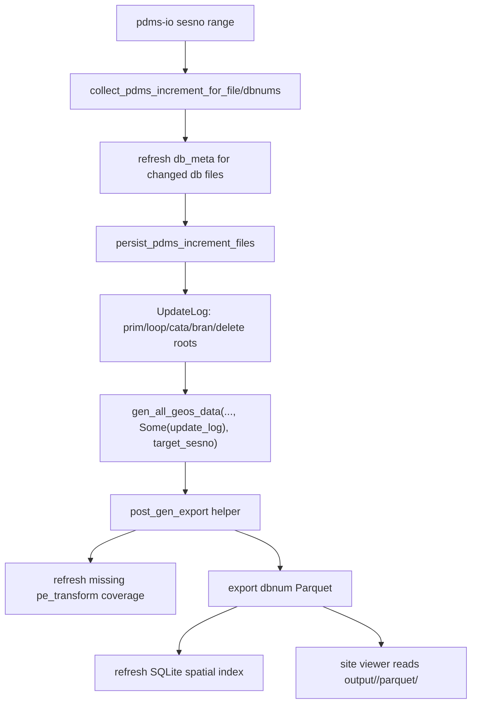
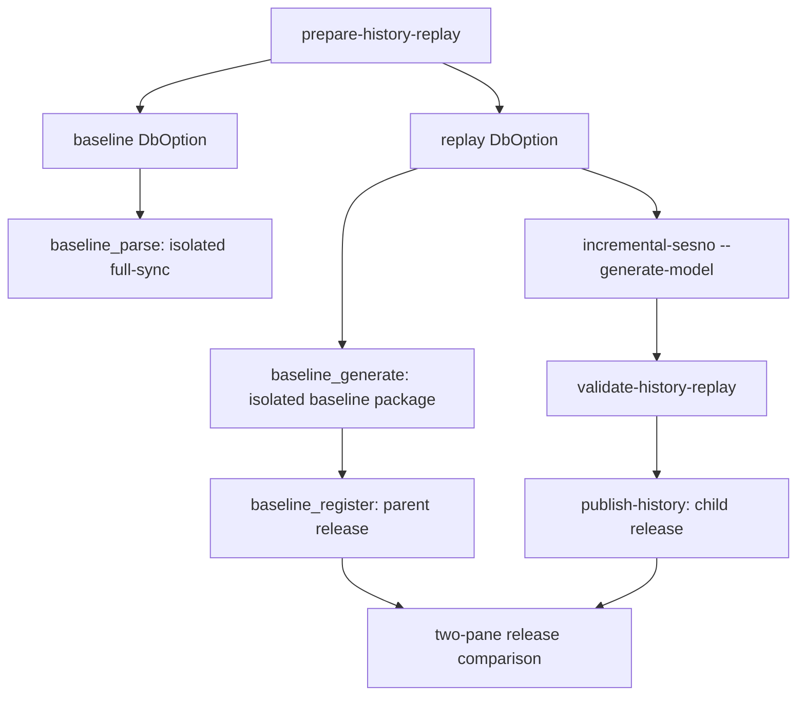

# E3D Incremental Site Model Generation Plan

## Requirement Analysis

Target scenario: use the AvevaMarineSample site at
`D:\AVEVA\Projects\E3D2.1\AvevaMarineSample` and dbnum `1112` to verify that
pdms-io can read a selected sesno range, persist incremental E3D data, generate
only the affected model data, and refresh the site-facing model export.

The immediate backend issue was that not every model generation entrypoint ran
the site-facing post-generation export. The full app path had a local Parquet
export block, while the web task path and `incremental-sesno --generate-model`
path could finish model generation without refreshing `output/<project>/parquet`.
That made the site frontend see stale or missing model assets.

Required behavior:

- Parse increment by explicit `from_sesno` and `to_sesno`.
- Persist PE/ATT/UDA/delete increment data to SurrealDB.
- Convert the increment classification into an `UpdateLog` for scoped generation.
- Restrict generation to affected dbnums when known, for example dbnum `1112`.
- After generation, export Parquet and refresh the SQLite spatial index when the
  build has `sqlite-index`.
- Return/report export status so callers can distinguish generation failures
  from post-generation export failures.

## Edge Cases

- Source file is not the expected historical db file. Example: top-level
  `ams1112_0001` latest sesno was `767`, while the test range `896 -> 897`
  exists in `ams000\ams1112_0001`.
- `to_sesno` is greater than file latest sesno.
- `from_sesno >= to_sesno`, producing no real increment.
- Increment contains no model-affecting elements.
- Increment contains deletes only.
- Increment contains unknown nouns such as `CFLOOR` or `FRMW`; they should not
  break persistence or generation.
- dbnum discovery fails because `db_meta_info.json` is unavailable.
- `manual_db_nums` is empty for a full-site task; export must discover dbnums
  from db_meta or `inst_relate`.
- `exclude_db_nums` removes all candidate dbnums.
- `pe_transform` is missing or partially stale.
- `parquet-export` feature is disabled.
- `sqlite-index` feature is disabled.
- Output directory is unwritable or disk is full.
- `scene_tree/<dbnum>.tree` is missing. Current generation can fall back to DB
  queries for some paths, but precheck remains degraded and startup should run
  `init-project` to restore the tree file.
- Replaying older sesno after newer data has already been persisted can regress
  current SurrealDB state. Historical version comparison needs an isolated DB,
  snapshot namespace, or an explicit no-save/history mode.
- A range-only replay into an empty isolated namespace is patch-only. It can
  persist PE/ATT changes but cannot guarantee roots, scene tree, catalogue
  dependencies, or non-empty model rows. Historical model comparison must first
  hydrate a complete baseline state for `from_sesno`, then apply the selected
  range.
- Parsing only DB `1112` may not be enough for model generation. Catalogue,
  dictionary, and system DB dependencies must be included explicitly or
  discovered from a known-good baseline/closure pass.
- Full-sync parsing in the current code hydrates only the source DB file's
  current visible state. It does not reconstruct an arbitrary historical
  `from_sesno` state from a newer DB file.

## Architecture

Current-state site refresh:



Historical model-version replay:



`baseline_parse` is not yet a true historical restore. It is usable as sesno
`from_sesno` evidence only when the physical source DB file already represents
that baseline. Otherwise the next implementation slice must add target-sesno
hydrate/restore before the child release can be considered a real historical
3D version.

Current target-sesno diagnostic:

```text
aios-database -c db_options/DbOption model-version inspect-history-baseline \
  --source-db-file D:\AVEVA\Projects\E3D2.1\AvevaMarineSample\ams000\ams1112_0001 \
  --target-sesno 896 \
  --parse-sample-limit 50 \
  --json
```

This resolves exact sesno `896`, but returns only
`visible_refno_count=5`, `index_error_count=1`, and
`full_state_enumeration_supported=false`. Treat this as a verified unsupported
state for target-sesno baseline hydrate. It is useful evidence for automation,
but it must not be used to publish a visual historical release.

Current physical baseline snapshot workflow:

```text
aios-database -c db_options/DbOption model-version \
  prepare-physical-baseline-snapshot \
  --snapshot-id codex-ams1112-physical-791 \
  --dbnum 1112 \
  --baseline-dbnum 1112,7997,5052,5054,5100,5101,251047,8191 \
  --source-db-file "D:\AVEVA\Projects\E3D2.1\AvevaMarineSample\ams1112_0001 copy" \
  --snapshot-root target\codex-physical-baseline\ams1112-791 \
  --config-out target\codex-physical-baseline\ams1112-791\DbOption-physical-baseline \
  --output-root target\codex-physical-baseline\ams1112-791\output \
  --surreal-ns codex_baseline_ams1112_791 \
  --force \
  --json
```

The command produces an isolated project snapshot and DbOption for a physical
history source. Validation confirmed the snapshot replacement DB1112 file
resolves exact sesno `791`, and the original active DB1112 file remains latest
sesno `897`. The next backend validation step is to run the generated baseline
parse command, then run model generation/export against the isolated baseline
state.

Core file structure:

- `src/fast_model/export_model/post_gen_export.rs`
  - Shared post-generation export helper.
  - Handles dbnum discovery, exclusions, pe_transform coverage, Parquet export,
    SQLite index refresh, metrics, and structured report output.
- `src/fast_model/export_model/mod.rs`
  - Exposes the shared helper module.
- `src/lib.rs`
  - Main app generation path now calls the shared helper instead of maintaining
    a duplicate local export block.
- `src/main.rs`
  - `incremental-sesno --generate-model` now calls the shared helper after
    scoped generation and includes `parquet_export` in JSON output.
  - `watch-incremental` reuses the same one-shot runner.
- `src/web_server/handlers.rs`
  - Full/site generation tasks call the shared helper after successful model
    generation.
  - Refno model generation tasks do the same before bundle export.
  - Post-generation export failures are surfaced as
    `PostGenerationExportError` instead of being silently ignored.

## Development Plan

1. Confirm reproduction path for dbnum `1112` and identify the valid historical
   file containing sesno `896 -> 897`.
2. Centralize post-generation export into one helper.
3. Wire the helper into CLI, watcher, main app, web full generation, and web
   refno generation paths.
4. Add structured reports and failure handling.
5. Verify by CLI + JSON and generated Parquet outputs; do not use `cargo test`
   per repo rules.
6. For UI comparison, use two isolated versions or namespaces before rendering
   side-by-side viewers.
7. For historical version comparison, use `model-version prepare-history-replay`
   to create the five-stage command plan:
   - full-sync parse into isolated namespace/output root only when the source
     file already matches the baseline session, or replace this with a real
     target-sesno hydrate provider;
   - generate/export baseline package and publish it as the parent release;
   - run `incremental-sesno --generate-model` in that same isolated namespace;
   - validate/publish the child release and compare the two releases.
8. For physical-version testing while target-sesno hydrate is unsupported, use
   `model-version prepare-physical-baseline-snapshot` to create an isolated
   project/config from the chosen historical DB file before running baseline
   parse and model generation.
9. Do not publish a range-only empty-namespace replay as a full release.
   `validate-history-replay` must classify it as `patch_only_empty_baseline`.

## Error Handling

The shared helper returns `PostGenerationParquetExportReport`:

- `enabled=false` when `export_parquet_after_gen` is off.
- `enabled=true` with `skipped_reason` when no exportable dbnum is found or the
  binary lacks `parquet-export`.
- A hard error when pe_transform refresh, Parquet export, or SQLite index refresh
  fails.

Web tasks convert hard failures into task error details with code
`POST_GEN_EXPORT_001`, preserving the fact that model generation had succeeded
but the site-facing export failed.

## Verification

Commands run:

```powershell
cargo check --bin aios-database
cargo check --bin aios-database --features sqlite-index
git diff --check -- src\fast_model\export_model\post_gen_export.rs src\fast_model\export_model\mod.rs src\lib.rs src\main.rs src\web_server\handlers.rs
target\debug\aios-database.exe -c db_options/DbOption incremental-sesno --file D:\AVEVA\Projects\E3D2.1\AvevaMarineSample\ams000\ams1112_0001 --from-sesno 896 --to-sesno 897 --json
target\debug\aios-database.exe -c db_options/DbOption --export-parquet-after-gen incremental-sesno --file D:\AVEVA\Projects\E3D2.1\AvevaMarineSample\ams000\ams1112_0001 --from-sesno 896 --to-sesno 897 --generate-model --json
```

Observed validation:

- Increment parse/save: `sessions=1`, `pe=169`, `att=169`, `deletes=0`,
  `dbnum_info=1`.
- Increment classification: `prim=20`, `loop_owner=7`, `basic_cata=91`,
  `total=118`.
- Model generation ran with `manual_db_nums -> [1112]` and incremental
  `roots=118`.
- Parquet output generated under
  `output\AvevaMarineSample\parquet\1112`.
- Manifest showed `instances.rows=106`, `geo_instances.rows=163`,
  `transforms.rows=131`, `aabb.rows=105`, `ptsets.rows=237`, and
  `missing_geo_hashes=0`.

Not run:

- `cargo test`, intentionally, per repository rule.
- Full web_server HTTP task execution. Current default config has
  `gen_model=true`, so starting the default app would trigger a heavy generation
  path before serving. A focused HTTP smoke should use an isolated runtime config
  with startup generation disabled.

## Performance And Maintainability

- Incremental generation passes a dbnum hint to avoid full-site export.
- The helper refreshes only pe_transform dbnums not already covered.
- dbnum discovery prefers explicit hints, then `manual_db_nums`, then db_meta,
  then an `inst_relate` fallback.
- The post-generation behavior is now centralized, reducing drift between CLI,
  watcher, main app, and web task entrypoints.
- Export metrics are still recorded from the shared helper.

## Review Summary

The backend generation issue was a missing post-generation export on important
entrypoints. The fix makes model generation and site-facing Parquet export a
single expected sequence. The 1112 `896 -> 897` validation proves increment
parse/save, scoped model generation, mesh availability, and Parquet output for
the site viewer.

Remaining risk: true historical side-by-side comparison still needs isolation.
Running older sesno ranges against the same current SurrealDB can overwrite
newer current-state rows. Use a cloned namespace/database, or add explicit
history/no-save support before validating two historical versions in one
environment. Current isolation tooling generates the baseline/replay command
plan and safety warnings, but the missing production piece is still true
baseline hydrate at the requested historical session.

## 2026-06-20 Physical Baseline And Backend Fix Update

Oracle review result:

- Keep SurrealDB as the generation writer/workspace.
- Treat Parquet plus GLB files as immutable release payload.
- Use DuckLake for release catalog, file/asset manifest, component/unit index,
  diff/impact index, and audit metadata.
- Do not use DuckLake as the model-generation writer or as the GLB/parquet
  binary store.
- Define model data versions as separate objects: parse increment version,
  baseline state version, model release version, asset version, and diff/index
  version. Published release packages must be immutable and idempotent.

Implemented backend fixes:

- `src/fast_model/gen_model/pdms_inst.rs`
  - `inst_relate` is now replace-on-write by relation id: delete the previous
    relation record and insert the current one in the same transaction group.
  - `inst_relate_aabb` follows the same replace-on-write behavior.
  - SQL-file output mirrors the online writer behavior.
  - This fixes SurrealDB relation conflicts where the same PE relation id first
    pointed to a refno-based `inst_info` and later to a CATA-hash `inst_info`.
- `src/main.rs`
  - Plain CLI `--regen-model --export-parquet-after-gen` now explicitly calls
    the shared post-generation Parquet helper.
  - If `--export-parquet-after-gen` is the only export request, the CLI exits
    after the helper instead of falling through into default `run_app`.
  - `--export-parquet-after-gen` without a generation request now fails fast.

Physical baseline validation:

- Chosen DB1112 historical source:
  `D:\AVEVA\Projects\E3D2.1\AvevaMarineSample\ams1112_0001 copy`.
- Resolved physical latest sesno: `791`.
- Snapshot config:
  `target\codex-physical-baseline\ams1112-791\DbOption-physical-baseline.toml`.
- Isolated namespace: `codex_baseline_ams1112_791`.
- Baseline parse completed and saved PE data:
  - `pe_1112=191967`
  - `pe_5052=347171`
  - `pe_5054=323458`
  - `pe_7997=157259`
  - `pe=1021323`
- Fixed model generation produced:
  - `pe_transform=149330`
  - `inst_relate=31044`
  - `inst_info=30632`
  - `inst_geo=1894`
  - `inst_relate_aabb=30484`
- Former failing relation now resolves correctly:
  `inst_relate:[17496,254370,0] -> inst_info:14658783752023738325`.
- Explicit DB1112 Parquet export completed:
  - output:
    `target\codex-physical-baseline\ams1112-791\validation-export-fixed\1112`
  - `instances.parquet=47698` rows
  - `geo_instances.parquet=31292` rows
  - `transforms.parquet=30495` rows
  - `aabb.parquet=28372` rows
  - `tubings.parquet=56` rows
  - `ptsets.parquet=6999` rows
  - elapsed: `145.25s`

Validation commands:

```powershell
cargo check --bin aios-database --features model-version-ducklake
cargo build --bin aios-database --features model-version-ducklake
target\debug\aios-database.exe -c target\codex-physical-baseline\ams1112-791\DbOption-physical-baseline --export-parquet --dbnum 1112 --output target\codex-physical-baseline\ams1112-791\validation-export-fixed --verbose
target\debug\aios-database.exe -c target\codex-physical-baseline\ams1112-791\DbOption-physical-baseline --export-parquet-after-gen --dbnum 1112
```

The last command intentionally fails fast with:
`--export-parquet-after-gen 需要与 --regen-model 或调试/导出模型生成请求一起使用`.

Remaining edge cases from this validation:

- The DB1112 export reports `missing_geo_hashes=24` and
  `missing_owner_refnos=42`. These missing meshes must be generated,
  materialized, or explicitly classified before a publishable visual release.
- Some diagnostics/perf files still write to default
  `output\AvevaMarineSample` instead of the isolated output root. Historical
  validation must treat this as a path-isolation bug to fix before unattended
  replay.
- A full `--regen-model --export-parquet-after-gen` run exceeded the local
  15-minute command timeout while exporting. The corrected branch was exercised
  because it entered explicit Parquet export, but long full-generation runs
  should be launched as managed jobs with progress logs.
- No physical DB1112 file with latest sesno exactly `896` was found. The 791
  physical baseline is valid for pipeline validation, but it is not a substitute
  for a true `896` baseline.
- True target-sesno hydrate from a later DB file remains the production gap for
  arbitrary historical session comparison.

Next development steps:

1. Fix or classify the 24 missing mesh hashes for DB1112 baseline export.
2. Move diagnostics/perf output through the isolated output-root resolver.
3. Publish the 791 baseline as a release only after mesh integrity passes.
4. Build a second release from the active/latest DB1112 state or another
   physical snapshot, then run DuckLake release diff and unit impact.
5. Wire the two release packages into the two-pane 3D comparison UI.

Latest consolidated plan:

- `docs/plans/2026-06-20-e3d-model-version-mesh-baseline-architecture-dev-plan.md`
  defines the current architecture and development plan for model-data version
  boundaries, mesh missing policy, DuckLake asset evidence, baseline/child
  release flow, edge cases, validation, and performance hardening.

Validated gate behavior:

- The DB1112 791 package is now explicitly classified as
  `missing_mesh_assets` with `ready_for_publish=false`.
- `publish-history` refuses the incomplete visual release before DuckLake
  registration.
- A release-list check confirmed the negative release id
  `codex-ams1112-physical-791-missing-mesh-gate` was not persisted.
