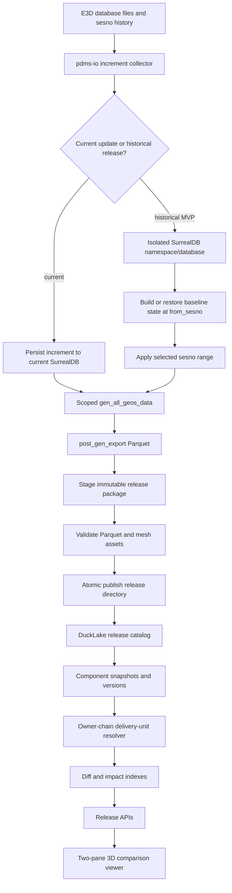
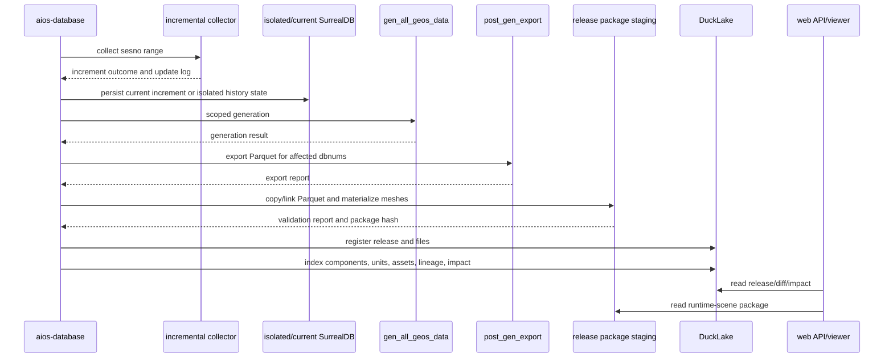

# E3D Model Version Production Architecture And Development Plan

## Purpose

This document is the implementation baseline for E3D incremental model
versioning after the Oracle MCP architecture reviews. It covers the
`AvevaMarineSample` validation path, especially DB `1112`, and the production
shape needed to let a user compare two real three-dimensional model versions.

The target outcome is:

- Read AVEVA E3D/PDMS database history by selected `sesno` ranges.
- Persist current incremental data without corrupting the current model state.
- Regenerate only affected model geometry when the update is current-state
  work.
- Publish generated model state as immutable release packages.
- Index release metadata, component versions, delivery-unit versions, and diffs.
- Load two release packages side by side in a 3D viewer and show model changes.

## Current Facts

- `collect_pdms_increment_for_file` is a read-only pdms-io collector. It reads
  a requested `cached_sesno + 1 .. target_sesno` range and returns
  `PdmsSesnoIncrementOutcome`; it does not write SurrealDB by itself.
- `run_incremental_sesno_once` currently always connects to SurrealDB and calls
  `persist_pdms_increment_files` before optional model generation.
- `incremental-sesno --generate-model` calls `gen_all_geos_data` with the
  collected `IncrGeoUpdateLog`, then calls the shared post-generation Parquet
  export helper.
- `gen_all_geos_data` supports incremental roots from `IncrGeoUpdateLog`.
  `target_sesno` is mainly used to fetch saved changes from SurrealDB when an
  explicit increment log is absent; the IndexTree generation path does not
  reconstruct a complete historical database state from a target sesno.
- A single historical sesno range is a patch, not a complete model state. A
  2026-06-19 isolated replay of DB `1112` range `896 -> 897` persisted
  non-empty changes (`element_count=169`, `actual_start_sesno=897`), but the
  isolated namespace had no baseline scene tree/root state and exported zero
  model rows. Therefore, a publishable historical release must be generated
  from a complete baseline state plus the selected increment range, or it must
  be treated as a patch artifact instead of a full 3D release.
- `post_gen_export` centralizes Parquet export and SQLite spatial-index refresh
  after generation.
- `model-version-ducklake` currently registers/list releases, indexes
  component snapshots, diffs releases, indexes delivery-unit MVP rows, indexes
  mesh assets, materializes release-local GLBs, and serves release runtime-scene
  JSON for the internal two-pane comparison page.

## Oracle Review Inputs

Completed Oracle sessions already support the layered decision:

- `ducklake-model-version-management-review-4`
- `e3d-model-version-architectu-2`
- `e3d-model-version-ducklake-review`
- `e3d-real-release-plan-review`

The repeated recommendation is to keep SurrealDB as the current generation
writer, keep Parquet/GLB as the viewer package, and use DuckLake only as the
model-version release/index/query/audit layer.

The follow-up Oracle MCP session `e3d-real-release-plan-review` included the
generation pipeline files and confirmed the main P0 decision:

- The current architecture direction is correct.
- The main blocker is still the second real session-derived release, not
  DuckLake, the diff API, or the internal viewer.
- P0 should use isolated SurrealDB namespace/database replay so the existing
  generation path can be reused without writing historical data into current
  state.
- `no-save` / history-provider generation is the cleaner long-term design, but
  it should follow after the isolated replay bridge proves real release output.
- Replaying an old sesno into the current namespace is acceptable only for
  disposable experiments. It is not production evidence for historical
  comparison.
- If `post_gen_export` writes the current `output/<project>/parquet/<dbnum>`
  path, historical replay must override the output root to a release staging
  path before publishing.

Additional follow-up in the current implementation pass:

- Oracle MCP session history was re-read through MCP for
  `e3d-real-release-plan-review`.
- A new Oracle MCP consult completed under session
  `e3d-ducklake-version-plan`:
  - Transcript:
    `C:\Users\dpc\.oracle\sessions\e3d-ducklake-version-plan\artifacts\transcript.md`
  - Input bundle: 16 files, about 148k tokens.
  - Verdict: keep SurrealDB as generation writer, keep Parquet/GLB as release
    package, use DuckLake as catalog/index/diff/audit only.
  - Additional production concerns: publish must become an atomic/idempotent
    state machine; read APIs must not auto-index or mutate DuckLake; historical
    replay must seed/restore a complete baseline before applying a sesno range.
- Source inspection confirmed that `main.rs` sets `DB_OPTION_FILE` before the
  global `aios_core::get_db_option()` initialization, and several generation,
  index, db-meta, and query helpers later re-read `DB_OPTION_FILE`.
- Source inspection also confirmed that `post_gen_export` writes to
  `DbOptionExt::get_project_output_dir()/parquet`, so an isolated replay config
  can isolate Parquet output if it is executed in its own process with its own
  `-c <DbOption>`.
- A final Oracle MCP consult completed under session
  `e3d-model-version-architectu-3`:
  - Transcript:
    `C:\Users\dpc\.oracle\sessions\e3d-model-version-architectu-3\artifacts\transcript.md`
  - Verdict: the chosen layered architecture is still the right boundary.
    DuckLake should remain the release catalog/index/diff/audit layer, while
    SurrealDB and the existing generator remain the model-generation runtime.
  - Main correction: a publishable historical model release requires a complete
    baseline hydrate at `from_sesno`; `incremental-sesno` is only a patch on top
    of existing state, and `init-project` is not a PE/ATT baseline hydrate.
  - DuckLake can record release state, package hashes, component indexes,
    lineage evidence, validation evidence, and audit snapshots, but it should
    not be the first implementation's generation writer or GLB binary store.

## Non-Goals For This Version

- Do not replace the model generation writer with DuckLake.
- Do not treat DuckLake snapshot ids as user-facing model versions.
- Do not store GLB binary assets inside DuckLake tables.
- Do not replay old `sesno` ranges into the production current namespace to
  create historical comparison releases.
- Do not depend on the incomplete `model-writer-ducklake` path for production
  model data.

## Baseline Hydrate Strategy

Source inspection during the DB `1112` replay hardening pass shows three
separate states that must not be conflated:

1. Parse baseline:
   - Run full-sync parsing in an isolated SurrealDB namespace and isolated
     `output_root`.
   - Use `manual_db_nums` to include the target design DB and any required
     catalogue/dictionary/system dependency DBs.
   - Let full-sync generate `scene_tree/*.tree` and `db_meta_info.json`, and
     write PE/ATT rows when the binary is built with the default `review`
     feature set, which includes `surreal-save`.
2. Model baseline release:
   - Run generation/export against the isolated baseline namespace with
     `total_sync=false`, `gen_model=true`, and
     `export_parquet_after_gen=true`.
   - Publish the resulting non-empty Parquet/GLB package as the parent model
     release for `from_sesno`.
3. Incremental target release:
   - Run `incremental-sesno --generate-model` in the same isolated namespace
     for `from_sesno -> to_sesno`.
   - Validate that the staged package is a complete visual release candidate.
   - Publish it as a child release of the baseline.

`init-project` is not sufficient by itself for this workflow. It generates
scene-tree/db-meta artifacts and refreshes transforms, but it assumes PE data
already exists in SurrealDB. The reproducible historical path therefore needs a
baseline parse/hydrate stage before `init-project`-style transform refresh or
model generation.

Important limitation found during source inspection:

- The existing full-sync parser can hydrate the source file's current visible
  state into an isolated namespace, but it does not reconstruct an arbitrary
  `from_sesno` state from a newer DB file.
- Therefore `baseline_parse` is safe only when the source DB file already
  represents the requested baseline session, or when a real target-sesno
  restore/hydrate provider is implemented first.
- `model-version prepare-history-replay --json` now exposes this as
  `baseline_plan_warning` plus safety flags:
  `baseline_parse_uses_current_file_state=true`,
  `baseline_target_sesno_reconstruction_supported=false`, and
  `baseline_source_must_already_match_from_sesno=true`.

For AvevaMarineSample DB `1112`, the safest plan is to make dependency dbnums
explicit in the command plan. The current sampled `db_meta_info.json` contains
DB `1112` plus dependency-like entries such as `7997`, `5052`, `5054`, `5100`,
`5101`, `251047`, and `8191`; production tooling should allow these to be
provided, discovered from a known-good baseline, or produced by a catalogue
closure pass. A hard-coded DB `1112`-only baseline is not sufficient as a
general model-version strategy.

The current orchestration helper now emits a five-stage command plan:

1. `baseline_parse`: full-sync parse into isolated namespace/output root.
2. `baseline_generate`: generate/export the isolated baseline package.
3. `baseline_register`: register the baseline package as the target release's
   parent.
4. `generate`: run `incremental-sesno --generate-model` for
   `from_sesno -> to_sesno` in the same isolated namespace/output root.
5. `publish`: validate and publish the target child release with release-local
   assets and indexes.

Until target-sesno baseline reconstruction exists, this plan is an executable
operator plan plus safety contract, not proof that DB `1112` sesno `896` can be
rebuilt from the current `ams1112_0001` file.

## Requirement Analysis

### Functional Requirements

1. The backend must read explicit `from_sesno` and `to_sesno` ranges from E3D
   database files or dbnum-index lookup.
2. Current-state increments must persist PE/ATT/UDA/delete data and update the
   current model state.
3. Model generation must be scoped to affected roots/dbnums where the increment
   can be classified.
4. Every publishable model state must be packaged immutably with Parquet
   manifests and release-local mesh asset references or copies.
5. A user-facing version is a business `release_id`, with project/site/dbnum,
   source, parent, sesno range, generation task, package hash, and status.
6. Release diff must support added, deleted, changed, unchanged, and later
   field-level change masks.
7. Delivery-unit impact must explain why a component changed a unit, not only
   that the aggregate hash changed.
8. The web API and viewer must load release-specific packages, not fallback to
   current global state when a release id is requested.

### Quality Requirements

- All publish steps must be idempotent and resumable.
- Partial packages must never become published releases.
- Release indexing must be reproducible; stable inputs produce stable hashes.
- Diff and impact must be auditable from stored evidence.
- Read APIs should not mutate DuckLake indexes in production.
- CLI/database validation uses `aios-database ... --json`.
- `web_server` validation uses a running service plus HTTP calls.
- No `cargo test` or test target compilation.

## Edge Cases

### E3D Source And Sesno

- The selected file is not the active historical file for dbnum `1112`.
- `from_sesno >= to_sesno`.
- `to_sesno` exceeds the file latest sesno.
- The requested range has no PDMS session boundary.
- `get_nearest_large_sesno` or `get_nearest_less_sesno` returns no match.
- A dbnum is found in `db_index.sqlite` but the physical file is missing.
- db index is stale and points to a copied or obsolete file.
- The same dbnum exists in multiple module folders.
- Session data contains only no-op records.
- Session data contains deletes only.
- Unknown nouns are present, for example `CFLOOR` or `FRMW`.
- Owner refno is missing, invalid, or from another dbnum.
- History file latest sesno differs from db metadata cached sesno.
- A historical patch is replayed into an empty isolated namespace and produces
  valid PE/ATT changes but no complete scene tree/root, so model export has
  zero visible rows.
- A historical patch is mistakenly published as a full release instead of being
  rejected or labelled as patch-only.

### Persistence And Current State

- Replaying old sesno data into current SurrealDB regresses current rows.
- `persist_pdms_increment_files` succeeds partially and generation fails.
- Delete records are persisted but dependent model cleanup fails.
- UDA/ATT rows are saved while PE rows fail.
- SurrealDB schema initialization fails.
- `gen_history_model` or `target_sesno` is configured but the generation path
  still reads current-state data.
- A current-state generation is interrupted after writing some model rows.

### Model Generation

- Increment classification produces no visible roots.
- A classified root is not present in tree index.
- Tree files are missing or stale.
- `pe_transform` is missing or covers only part of the target dbnum.
- Manual dbnum filtering removes all affected dbnums.
- Generated mesh exists for some geo hashes but not all.
- Numeric transform/AABB differences are below tolerance but byte hashes change.
- Built-in primitives have no external GLB file.
- CATA or PTSET dependencies changed without a direct design instance change.

### Release Package

- Package directory is missing or not under the expected output root.
- Manifest JSON is missing, corrupt, or inconsistent with Parquet metadata.
- Required Parquet files are missing.
- Parquet schema has changed without schema version bump.
- Row counts are zero for a release that should contain visible geometry.
- Release-local GLB copy is interrupted.
- Existing release-local GLB has the same name but different SHA-256.
- Global mesh store is cleaned after a release is registered.
- Release package is built from current Parquet after another generation has
  already overwritten the directory.
- Windows paths contain spaces or mixed separators.

### DuckLake And Indexing

- DuckLake extension install/load fails on an offline machine.
- Metadata path or data path is unwritable.
- Concurrent CLI/API writers contend for the local metadata file.
- A register/index process dies while holding the application lock.
- Same release id is registered with different package hashes.
- Parent release is missing, from another project, or from another dbnum set.
- Diff is requested before both releases are indexed.
- Read API auto-indexing hides a failed publish/index job.
- Index schema evolves and old releases need re-indexing.
- DuckLake local catalog is used beyond single-machine write assumptions.

### Component Identity And Lineage

- `dbnum:refno_u64` is reused after delete and recreate.
- A component moves between owners.
- A component changes dbnum or branch.
- Two releases contain the same refno but incompatible noun/owner history.
- Same component appears through shared references.
- Geometry hash changes while semantic component identity remains the same.
- CATA geometry change impacts many design instances.
- Multi-db site releases compare dbnums with different release coverage.

### Delivery Unit Impact

- Component noun is itself a unit noun, for example `BRAN` or `EQUI`.
- Component belongs through immediate owner.
- Component belongs through deeper chain, for example `VALV -> EQUI -> BRAN`.
- Owner chain crosses dbnum.
- Owner chain is cyclic or truncated.
- Unit noun dictionary has aliases, for example `EQUIP` versus `EQUI`, or
  `VALV` versus `VALE`.
- Component is unassigned and must be explainable.
- Component moves from one unit to another and should produce moved-out and
  moved-in impact.
- Attribute-only changes may or may not propagate depending on rule set.

### Web And Viewer

- Viewer receives a release id but API silently falls back to current package.
- Runtime scene is too large for one JSON response.
- One pane loads all GLBs while the other has missing assets.
- Diff table says one component changed but the viewer cannot select or
  highlight it.
- plant3d-web and the internal release viewer use different package contracts.
- The service starts full generation before serving version APIs.
- Static `/files/output/...` routing exposes unintended paths.

## Architecture Decision

Use a layered model-version architecture:



### Responsibility Split

| Layer | Responsibility | Not Responsible For |
| --- | --- | --- |
| pdms-io collector | Read E3D sesno ranges and classify increment candidates | Persisting production state by itself |
| SurrealDB current state | Current model generation source and write target | Long-term historical release catalog |
| `gen_all_geos_data` | Generate affected model geometry from current or isolated state | Reconstructing full history from only a target sesno |
| post-gen Parquet export | Produce viewer-ready tabular package | Deciding business release identity |
| Release package | Immutable replayable Parquet/GLB/runtime-scene input | Analytical diff indexing |
| DuckLake | Release catalog, file manifests, snapshot/index tables, diff and impact audit | GLB object store, generation writer, domain identity oracle |
| Web APIs | Expose release metadata, runtime scene, diff, impact, publish/index jobs | Silent write side effects on read paths |
| Viewer | Load two release-specific packages and visualize differences | Inferring release semantics from current global state |

## Model Data Version Design

### Release Package Layout

```text
output/<project>/model_versions/releases/<release_id>/
  release.json
  validation.json
  parquet/
    manifest_<dbnum>.json
    <dbnum>/
      manifest.json
      instances.parquet
      geo_instances.parquet
      transforms.parquet
      aabb.parquet
      ptsets.parquet
  meshes/
    lod_L1/
      <geo_hash>_L1.glb
  mesh_assets_manifest.json
```

`release.json` is the business identity:

```json
{
  "release_id": "ams-1112-sesno-897",
  "project": "AvevaMarineSample",
  "site_path": "D:/AVEVA/Projects/E3D2.1/AvevaMarineSample",
  "branch_id": "main",
  "parent_release_id": "ams-1112-sesno-896",
  "source": "incremental-sesno-isolated",
  "dbnums": [1112],
  "from_sesno": 896,
  "to_sesno": 897,
  "generation_task_id": "...",
  "package_hash": "...",
  "hash_version": "release-package:v1",
  "status": "published"
}
```

### DuckLake Tables

DuckLake stores queryable metadata and derived indexes:

- `model_releases`
- `model_release_edges`
- `model_release_db_packages`
- `model_release_files`
- `model_release_mesh_assets`
- `component_snapshots`
- `component_identities`
- `component_versions`
- `component_lineage`
- `delivery_unit_memberships`
- `unit_dependency_edges`
- `unit_versions`
- `propagation_rules`
- `component_unit_impacts`
- Index run tables for components, units, assets, lineage, and impacts.

DuckLake is appropriate because it gives a SQL catalog over Parquet-backed
tables, snapshot/change-feed semantics, and a clean analytical surface for
release diff. Official DuckLake/DuckDB docs describe attaching a DuckLake
catalog with a metadata database and `DATA_PATH`, querying table changes by
snapshot bounds, and using a PostgreSQL catalog for stable concurrent
read-write deployments:

- `https://ducklake.select/docs/stable/duckdb/usage/connecting.html`
- `https://ducklake.select/docs/stable/duckdb/advanced_features/data_change_feed.html`
- `https://duckdb.org/docs/current/connect/concurrency.html`

### Component Identity

MVP identity remains:

```text
component_key = <dbnum>:<refno_u64>
```

Production identity adds strategy and confidence:

```text
identity_strategy = refno_v1 | refno_owner_path_v2 | lineage_match_v1 | conflict
identity_confidence = exact | probable | conflict | unresolved
```

Identity is separate from version hash. Version hash is derived from canonical
component state:

```text
component_version_hash = sha256(
  hash_version
  + identity_hash
  + noun
  + owner_identity_hash
  + owner_path_hash
  + attribute_hash
  + geometry_hash
  + transform_hash
  + aabb_hash
  + membership_hash
)
```

### Delivery Unit Version

Delivery-unit membership must be resolved by owner graph, not only immediate
owner:

1. If component noun is a unit noun, membership is `self_unit`.
2. Else walk owner chain to nearest unit noun, membership is `owner_chain`.
3. Else apply domain-specific edges such as tubing/branch ownership.
4. Else place in `UNASSIGNED` with `unresolved_reason`.

Each membership stores:

```text
release_id
component_identity_hash
unit_key
membership_kind
owner_path_json
path_depth
confidence
unresolved_reason
membership_hash
```

Unit version hash is a stable ordered aggregate of member identity, member
version hash, role, and membership hash.

## Historical Release Strategy

### Option A: Isolated SurrealDB Namespace Or Database

Use a cloned or separate SurrealDB namespace/database for historical release
generation. Replay or seed the required state there, run existing generation,
export Parquet, publish package, then tear down or archive the namespace.

This is the production recommendation and the MVP recommendation for the next
real `AvevaMarineSample` release because it reuses the verified generation path
while avoiding pollution of current state.

Required additions:

- A planning command generates an isolated DbOption TOML and a JSON command
  plan. This avoids relying on an in-process `DbOptionExt` clone while global
  helpers still read `DB_OPTION_FILE`.
- Historical generation runs as a separate `aios-database -c <replay-config>`
  process, using an isolated SurrealDB namespace and isolated `output_root`.
- `publish-history` publishes only the replay output package, never the current
  `output/<project>/parquet/<dbnum>` directory.
- The current namespace is never used for older sesno replay.

### Option B: No-Save / History Generation Mode

Generate a read-only release directly from pdms-io increment packages and
history inputs without persisting to SurrealDB.

This is the longer-term clean architecture for deterministic historical
reconstruction, but it is not the fastest MVP because the generation pipeline
currently expects SurrealDB/current query providers for PE, attributes,
transforms, tree, CATA, and dependent data.

Use this for P2 after component lineage and release package validation are
stable.

### Option C: Current Namespace Replay Then Register

Replay historical sesno into the production current namespace, generate Parquet,
and register it as a release.

This is not recommended. It can regress current PE/ATT/UDA rows, leak future
state into a historical package, overwrite current Parquet before publish, and
make the release non-auditable.

It is acceptable only as a disposable local experiment after taking an explicit
backup and with a clear warning that the output is not production evidence.

## Publish Pipeline



Publish states:

```text
draft
collected
persisted
generated
exported
staged
validated
registered
component_indexed
unit_indexed
impact_indexed
published
failed
```

Every state transition must be idempotent. A retry should resume from the last
valid state after verifying hashes.

Production publish rule:

- Do not register a release as `published` before the package is fully staged,
  Parquet metadata is validated, release-local mesh assets are materialized and
  hash-checked, `release.json`/`validation.json` are written, and the full
  package hash is computed.
- A failure after staging but before final registration should leave a
  `draft`, `staged`, or `failed` record, never a release that read APIs treat
  as complete.
- If the current implementation registers first and indexes/assets later, treat
  that as a temporary CLI smoke path, not the final production publish contract.

### P0 Replay Planning Boundary

Do not implement the first production historical replay as an in-process
configuration override. In this repository, `incremental-sesno` receives a
`DbOptionExt`, but important downstream helpers also use the global
`DB_OPTION_FILE` path and `aios_core::get_db_option()` state. The safer P0
boundary is a process-separated CLI contract:

```text
model-version prepare-history-replay
  -> writes baseline DbOption TOML
  -> writes replay DbOption TOML
  -> prints JSON with exact baseline, replay, and publish commands

aios-database -c <baseline-config>
  -> hydrates isolated SurrealDB namespace/database from the source file's
     current visible state

aios-database -c <replay-config>
  -> generates/exports the isolated baseline model package

aios-database -c <base-config> model-version register
  -> registers the baseline model package as the parent release

aios-database -c <replay-config> incremental-sesno --generate-model
  -> applies the selected session range in the same isolated namespace
  -> exports isolated target Parquet under replay output_root

aios-database -c <base-config> model-version publish-history
  -> validates the replay Parquet directory
  -> materializes release-local mesh assets
  -> indexes components and optionally units
```

This keeps each process internally consistent: `DB_OPTION_FILE`, output root,
scene-tree/db-meta paths, transform paths, model cache paths, and SurrealDB
namespace all point to the same replay workspace during generation.

The first step is deliberately named `baseline_parse`, not
`baseline_restore`. Current source code can full-sync the file's current
visible state, but it cannot yet ask pdms-io for a complete database image at
an arbitrary historical `from_sesno`. A production historical release therefore
needs one of these before publishing the baseline as sesno `896` evidence:

- a physical source snapshot that already represents sesno `896`;
- a previously published baseline package/namespace that can be restored;
- a new target-sesno hydrate provider that reconstructs complete PE/ATT/tree
  state from history.

Current DB `1112` diagnostic result:

- `model-version inspect-history-baseline --source-db-file
  D:\AVEVA\Projects\E3D2.1\AvevaMarineSample\ams000\ams1112_0001
  --target-sesno 896 --json` resolves the exact session, but it reports only
  `visible_refno_count=5`, `index_error_count=1`, and
  `full_state_enumeration_supported=false`.
- The same diagnostic shape appears for latest sesno `897`, so the current
  public pdms-io session root/index traversal is not a proven full visible-state
  provider for this DB file.
- Therefore this path is an explicit unsupported-state contract, not a hidden
  hydrate implementation. It must not be used to publish a fake DB `1112`
  baseline release. Production must use a physical baseline snapshot, restore a
  previously published baseline package/namespace, or add a proven pdms-io
  full-state hydrate provider.

Implemented physical-source bridge:

```text
aios-database -c db_options/DbOption model-version \
  prepare-physical-baseline-snapshot \
  --snapshot-id codex-ams1112-physical-791 \
  --dbnum 1112 \
  --baseline-dbnum 1112,7997,5052,5054,5100,5101,251047,8191 \
  --source-db-file "D:\AVEVA\Projects\E3D2.1\AvevaMarineSample\ams1112_0001 copy" \
  --snapshot-root target\codex-physical-baseline\ams1112-791 \
  --config-out target\codex-physical-baseline\ams1112-791\DbOption-physical-baseline \
  --output-root target\codex-physical-baseline\ams1112-791\output \
  --surreal-ns codex_baseline_ams1112_791 \
  --force \
  --json
```

This command creates a disposable project snapshot whose `project_path`,
`output_root`, and `surreal_ns` are isolated from the current site. It hard-links
the active project DB directory where possible, replaces only the target DB file
inside the snapshot, writes a baseline DbOption, and emits JSON evidence. It is
the preferred P0 bridge when a physical historical DB file already represents
the desired baseline state. It is not a target-sesno reconstruction provider.

DB `1112` evidence:

- Source candidate `ams1112_0001 copy` has header dbnum `1112` and latest sesno
  `791`.
- Snapshot replacement
  `target\codex-physical-baseline\ams1112-791\project_path\AvevaMarineSample\ams000\ams1112_0001`
  resolves exact sesno `791`.
- Original active
  `D:\AVEVA\Projects\E3D2.1\AvevaMarineSample\ams000\ams1112_0001`
  still resolves latest sesno `897`.
- The generated config sets `total_sync=true`, `save_db=true`,
  `gen_model=false`, `gen_mesh=false`, and
  `export_parquet_after_gen=false`; model generation must be run as a separate
  baseline-generate step after the baseline parse succeeds.

Recommended CLI:

```text
aios-database -c db_options/DbOption model-version prepare-history-replay \
  --release-id ams-1112-sesno-897 \
  --release-label "AMS 1112 sesno 897" \
  --parent-release-id ams-1112-sesno-896 \
  --dbnum 1112 \
  --source-db-file D:\AVEVA\Projects\E3D2.1\AvevaMarineSample\ams000\ams1112_0001 \
  --from-sesno 896 \
  --to-sesno 897 \
  --replay-config-out output\AvevaMarineSample\model_versions\replay_configs\ams-1112-sesno-897 \
  --json
```

Default derived values:

```text
replay_surreal_ns =
  <current_surreal_ns>_history_<sanitized_release_id>

replay_output_root =
  <current_project_output_dir>/model_versions/replay_work/<release_id>/output

replay_parquet_dir =
  <replay_output_root>/<project>/parquet/<dbnum>
```

JSON response shape:

```json
{
  "release_id": "ams-1112-sesno-897",
  "project_name": "AvevaMarineSample",
  "dbnum": 1112,
  "source_db_file": "D:/AVEVA/Projects/E3D2.1/AvevaMarineSample/ams000/ams1112_0001",
  "from_sesno": 896,
  "to_sesno": 897,
  "current_surreal_ns": "1516",
  "replay_surreal_ns": "1516_history_ams_1112_sesno_897",
  "current_parquet_dir": "output/AvevaMarineSample/parquet/1112",
  "replay_config_path": "output/AvevaMarineSample/model_versions/replay_configs/ams-1112-sesno-897.toml",
  "replay_config_arg": "output/AvevaMarineSample/model_versions/replay_configs/ams-1112-sesno-897",
  "baseline_plan_warning": "baseline_parse currently runs full-sync against the source file's visible/current state; it does not reconstruct from_sesno=896 from pdms-io history.",
  "replay_output_root": "output/AvevaMarineSample/model_versions/replay_work/ams-1112-sesno-897/output",
  "replay_parquet_dir": "output/AvevaMarineSample/model_versions/replay_work/ams-1112-sesno-897/output/AvevaMarineSample/parquet/1112",
  "commands": {
    "baseline_parse": "aios-database -c <baseline_config_arg>",
    "baseline_generate": "aios-database -c <replay_config_arg>",
    "baseline_register": "aios-database -c <base_config_arg> model-version register --derivation-type historical-baseline ... --json",
    "generate": "aios-database -c <replay_config_arg> incremental-sesno --file <source_db_file> --from-sesno 896 --to-sesno 897 --generate-model --json",
    "publish": "aios-database -c db_options/DbOption model-version publish-history --release-id ams-1112-sesno-897 --dbnum 1112 --source-db-file <source_db_file> --from-sesno 896 --to-sesno 897 --parquet-dir <replay_parquet_dir> --materialize-assets --index-units --json",
    "baseline_parse_argv": ["aios-database", "-c", "<baseline_config_arg>"],
    "baseline_generate_argv": ["aios-database", "-c", "<replay_config_arg>"],
    "baseline_register_argv": ["aios-database", "-c", "<base_config_arg>", "model-version", "register", "...", "--json"],
    "generate_argv": ["aios-database", "-c", "<replay_config_arg>", "incremental-sesno", "--file", "<source_db_file>", "--from-sesno", "896", "--to-sesno", "897", "--generate-model", "--json"],
    "publish_argv": ["aios-database", "-c", "db_options/DbOption", "model-version", "publish-history", "--release-id", "ams-1112-sesno-897", "--dbnum", "1112", "--source-db-file", "<source_db_file>", "--from-sesno", "896", "--to-sesno", "897", "--parquet-dir", "<replay_parquet_dir>", "--materialize-assets", "--index-units", "--json"]
  },
  "safety_checks": {
    "replay_namespace_differs_from_current": true,
    "replay_parquet_differs_from_current": true,
    "generation_is_external_process": true,
    "baseline_parse_uses_current_file_state": true,
    "baseline_target_sesno_reconstruction_supported": false,
    "baseline_source_must_already_match_from_sesno": true
  }
}
```

Generated DbOption TOML requirements:

- Copy the base config so project paths, mesh precision, generation behavior,
  and SurrealDB connection settings stay compatible with the current station.
- Write a baseline config with the isolated `surreal_ns`,
  `output_root=replay_output_root`, `total_sync=true`, `save_db=true`,
  `gen_model=false`, `gen_mesh=false`, `export_parquet_after_gen=false`, and
  normalized `manual_db_nums` containing DB `1112` plus required dependency
  dbnums.
- Write a replay/generation config with the same isolated namespace/output
  root, `total_sync=false`, `save_db=true`, `gen_model=true`,
  `gen_mesh=true`, `export_parquet_after_gen=true`, and target
  `manual_db_nums=[1112]`.
- Override or clear custom derived paths that could otherwise point back to the
  current workspace, especially `model_cache_dir`, `transform_parquet_dir`,
  `transform_ducklake_metadata`, and `transform_ducklake_data_path`.
- Preserve `meshes_path` because mesh generation and asset materialization need
  the configured global mesh root until release-local copy/hard-link occurs.

Safety failures:

- `from_sesno >= to_sesno`.
- Source DB file missing or not a file.
- Release id is not path safe.
- Replay namespace is empty or equal to the current namespace.
- Replay Parquet directory resolves to the current Parquet directory.
- Replay config output resolves to the base config file.
- Replay config already exists and `--force` is not supplied.
- Replay output root is the current output root or current project output dir.
- Generated publish command would omit `--materialize-assets`.

The current implementation emits both copyable command strings and the
`*_argv` arrays under `commands`. Any future job-runner or
`publish-from-sesno` wrapper must consume argv directly instead of shell-joined
strings.

End-to-end `publish-from-sesno` should be a later wrapper over the same stages.
It may spawn the replay generation process and then call `publish-history`, but
it should not bypass the generated replay config or execute generation with a
temporary in-process global configuration mutation.

## Proposed File Structure

```text
src/version_management/
  cli.rs
  ducklake_store.rs
  hashing.rs
  model_release.rs
  release_package.rs
  types.rs
  publish_job.rs              # new: state machine and idempotent publish flow
  history_baseline.rs         # implemented: read-only target-sesno diagnostic
  history_replay_plan.rs      # implemented: replay DbOption and command-plan builder
  physical_baseline_snapshot.rs # implemented: isolated physical baseline project snapshot
  history_release.rs          # new: isolated historical generation orchestration
  component_identity.rs       # new: identity strategy and conflict detection
  component_lineage.rs        # new: parent-child release lineage rows
  delivery_unit_resolver.rs   # new: owner-chain and domain membership resolver
  impact_rules.rs             # new: rule set and component-unit impact materialization

src/web_api/
  model_version_api.rs        # extend with publish/index job APIs and read-only queries

docs/plans/
  2026-06-19-e3d-model-version-production-architecture-dev-plan.md
```

## API Plan

Mutating APIs:

```text
POST /api/model-version/publish-history
POST /api/model-version/releases/{release_id}/index
POST /api/model-version/releases/{release_id}/index-units
POST /api/model-version/releases/{release_id}/index-assets?materialize=true
POST /api/model-version/release-pairs/{from}/{to}/index-impact
```

Read APIs:

```text
GET /api/model-version/releases
GET /api/model-version/releases/{release_id}
GET /api/model-version/releases/{release_id}/runtime-scene
GET /api/model-version/releases/{release_id}/mesh-assets
GET /api/model-version/diff
GET /api/model-version/unit-diff
GET /api/model-version/component-impact
GET /model-version/compare
GET /model-version/release-viewer
```

Production rule: read APIs must not auto-index. If an index is missing, return a
clear `409 Conflict` or `424 Failed Dependency` with the command/API needed to
build it.

The same rule applies to domain helpers behind GET endpoints: `ensure_*`
functions that mutate DuckLake are allowed only from explicit mutating CLI/API
paths such as `register`, `publish-history`, `POST /index`,
`POST /index-units`, and `POST /index-assets`.

Implementation status: component/unit diff, impact, and release-scene read paths
now use non-mutating `require_*` guards. Missing component indexes were
validated through CLI and HTTP: `model-version diff --json` exits with an
actionable missing dependency while leaving index tables empty, and
`GET /api/model-version/diff` returns HTTP `424 Failed Dependency` without
auto-indexing.

## CLI Implementation Status

Implemented:

```text
aios-database model-version publish-history
aios-database model-version prepare-history-replay
aios-database model-version prepare-physical-baseline-snapshot
```

`publish-history` is the first P0 safety slice. It does not perform historical
generation itself. Instead, it publishes an already generated isolated/staged
Parquet package as a historical release and enforces the current-state boundary:

- `--source-db-file`, `--from-sesno`, `--to-sesno`, `--dbnum`, and
  `--parquet-dir` are required.
- `--parquet-dir` must point to an isolated or staged package. The default
  current `output/<project>/parquet/<dbnum>` directory is rejected.
- `--parquet-dir` must contain a non-empty visual model package. Packages with
  `instances.rows=0` or `geo_instances.rows=0` are rejected before DuckLake
  registration because they are patch-only replay artifacts, not full 3D
  releases.
- The release is registered with derivation type `incremental-sesno-isolated`.
- Metadata records `history_publish.replay_mode=isolated-staged-parquet` and
  `history_publish.generation_performed_by_command=false`.
- Metadata and safety checks record `instances_rows`, `geo_instances_rows`,
  `non_empty_model_package`, and `zero_model_package_guard_enabled`.
- `--materialize-assets` indexes and copies release-local GLB dependencies.
- `--index-units` rebuilds the delivery-unit MVP index after publish.

`prepare-history-replay` is the second P0 safety slice. It writes isolated
baseline and replay DbOption TOMLs and prints copyable JSON commands for the
five-stage historical plan:

- Run `baseline_parse` from the baseline config.
- Run `baseline_generate` from the replay config.
- Run `baseline_register` from the base config.
- Run `incremental-sesno --generate-model` in a separate process with the replay
  config.
- Run `publish-history` from the base config against the replay Parquet package.

Validation evidence:

- The generated baseline config sets isolated `surreal_ns`, isolated
  `output_root`, `total_sync=true`, `save_db=true`, `gen_model=false`,
  `gen_mesh=false`, `export_parquet_after_gen=false`, and normalized
  `manual_db_nums` containing DB `1112` plus dependencies.
- The generated replay config sets the same isolated namespace/output root,
  `total_sync=false`, `save_db=true`, `gen_model=true`, `gen_mesh=true`,
  `manual_db_nums=[1112]`, and `export_parquet_after_gen=true`.
- The JSON safety checks prove replay namespace, replay output root, replay
  Parquet directory, and replay config path differ from current/base paths.
- The JSON response includes `baseline_plan_warning`, `baseline_release_id`,
  `target_parent_release_id`, `baseline_dbnums`, `baseline_config_arg`, and
  `baseline_config_path`.
- The JSON safety checks also mark
  `baseline_parse_uses_current_file_state=true`,
  `baseline_target_sesno_reconstruction_supported=false`, and
  `baseline_source_must_already_match_from_sesno=true`.
- Negative CLI checks reject existing config without `--force`, equal replay
  namespace, invalid sesno range, unsafe release id, missing source DB file, and
  replay output root equal to current output root.
- `publish-history` rejects the DB `1112` empty-namespace replay package with
  `instances=0` and `geo_instances=0`; no DuckLake metadata or release package
  files are created for that failed publish.
- `publish-history` still accepts the non-empty DB `1112` fixture package with
  `instances=106`, `geo_instances=163`, and `component_count=106`.
- `prepare-history-replay --json` includes
  `commands.baseline_parse_argv`, `commands.baseline_generate_argv`,
  `commands.baseline_register_argv`, `commands.generate_argv`, and
  `commands.publish_argv`; the publish argv includes `--materialize-assets`,
  `--index-units`, and ends with `--json`.
- `model-version validate-history-replay --json` is implemented and reused by
  `publish-history`. It classifies the DB `1112` empty-namespace replay as
  `patch_only_empty_baseline`, classifies the non-empty DB `1112` fixture as
  `complete_visual_release_candidate`, and can optionally make scene_tree
  evidence a hard gate with `--require-scene-tree`.

`prepare-physical-baseline-snapshot` is the third P0 safety slice. It creates
an isolated physical project snapshot when a historical DB file already
represents a usable baseline state:

- It validates the source DB header dbnum against `--dbnum`.
- It finds the active target DB file under the current project `*000`
  directory.
- It materializes the active DB directory into an isolated snapshot directory
  with hardlinks and copy fallback.
- It replaces the active target DB file inside the snapshot with the physical
  baseline DB file.
- It writes a derived DbOption TOML with isolated `project_path`,
  `output_root`, and `surreal_ns`, normalized dependency dbnums, and
  baseline-parse flags.
- It refuses to reuse the current namespace, output root, source project
  directory, or base config path.
- It emits JSON command evidence and argv arrays; future job orchestration
  should consume argv arrays rather than shell-joined strings.
- Validation on DB `1112` created
  `target\codex-physical-baseline\ams1112-791` from
  `D:\AVEVA\Projects\E3D2.1\AvevaMarineSample\ams1112_0001 copy`,
  with `file_count=448`, `hardlinked_count=448`, and exact replacement sesno
  `791`.

Still pending:

- The generated replay command has been executed against DB `1112` `896 -> 897`
  in an empty isolated namespace. It proved collection/persistence, but exported
  zero model rows because the namespace had no complete baseline scene
  tree/root state. The baseline gate now rejects/reports that artifact before
  publish. The next implementation step is to run the physical snapshot
  baseline parse/generate flow for DB `1112`, verify a non-empty baseline
  package, then replay or pair a later historical state and publish a second
  real session-derived release.
- A later `publish-from-sesno` wrapper may orchestrate prepare, replay
  generation, and publish, but it must keep the separate replay-config process
  boundary.

## Development Plan

### P0: Real Two-Version 3D Comparison

Goal: prove two real, session-derived releases can be generated and compared
without current-state pollution.

Deliverables:

- Use the implemented `model-version prepare-history-replay` to create
  isolated baseline/replay configs and a machine-readable command plan:

```text
aios-database -c db_options/DbOption model-version prepare-history-replay \
  --release-id ams-1112-sesno-897 \
  --dbnum 1112 \
  --source-db-file D:\AVEVA\Projects\E3D2.1\AvevaMarineSample\ams000\ams1112_0001 \
  --from-sesno 896 \
  --to-sesno 897 \
  --json
```

- Build or restore the isolated baseline state for the release start point. The
  minimum acceptable P0 implementation is one of:
  - full-parse a physical DB snapshot that already represents the requested
    `from_sesno` baseline;
  - restore a previously published baseline snapshot package/namespace for
    `from_sesno`;
  - implement a read-only history provider that can answer generation queries
    as a complete state at `to_sesno`.
- Do not claim that full-parsing the current latest DB file reconstructs
  sesno `896`; that is explicitly unsupported by the current source code and
  surfaced by `baseline_plan_warning`.
- Current physical-snapshot bridge:
  `model-version prepare-physical-baseline-snapshot` can create an isolated
  project/config from a known physical DB file such as DB `1112` sesno `791`.
  Use this for physical-version-pair testing while target-sesno hydrate remains
  unsupported.
- Run the generated replay command only after the baseline gate is satisfied:

```text
aios-database -c <replay-config> incremental-sesno \
  --file D:\AVEVA\Projects\E3D2.1\AvevaMarineSample\ams000\ams1112_0001 \
  --from-sesno 896 \
  --to-sesno 897 \
  --generate-model \
  --json
```

- Publish the generated replay Parquet package with `publish-history`.
- Stage Parquet and GLB assets under release-local directories.
- Validate manifests, row counts, mesh asset hashes, and package hash.
- Register both real releases in DuckLake.
- Index components/assets for both releases.
- Load both releases in `/model-version/compare`.

Acceptance:

- `prepare-history-replay --json` shows a replay namespace different from
  current `1516` and a replay Parquet directory different from
  `output/AvevaMarineSample/parquet/1112`.
- The generated baseline TOML contains isolated `surreal_ns`, isolated
  `output_root`, `total_sync=true`, and dependency-aware baseline
  `manual_db_nums`.
- The generated replay TOML contains isolated `surreal_ns`, isolated
  `output_root`, `manual_db_nums=[1112]`, and `export_parquet_after_gen=true`.
- `prepare-history-replay --json` exposes
  `baseline_target_sesno_reconstruction_supported=false` until a real
  target-sesno hydrate or source snapshot workflow exists.
- Replay validation proves the isolated namespace has complete generation
  prerequisites before publish: scene tree/root coverage or an equivalent
  generation query provider, non-empty `instances.parquet`, non-empty
  `geo_instances.parquet`, and a manifest row count matching Parquet metadata.
  Implemented CLI gate: `model-version validate-history-replay --json` proves
  the non-empty visual package and path-safety subset now; use
  `--require-scene-tree` when tree artifacts are part of the required baseline
  evidence for a replay workflow.
- A range-only replay into an empty namespace is rejected or reported as
  `patch_only`, not published as a full 3D release. The observed DB `1112`
  `896 -> 897` empty-namespace result is `element_count=169` but
  `instances=0`, so it is not acceptable release evidence.
- CLI JSON shows two published releases with different package hashes.
- Each real release has `derivation_type=incremental-sesno-isolated` or a
  stricter successor value such as `incremental-sesno-replay`.
- Same-release diff returns zero changed rows.
- Real release-pair diff returns deterministic changed/added/deleted counts.
- Runtime-scene for both releases uses release-local mesh base URLs.
- HTTP compare page loads both panes with failed geometry count `0`.

### P1: Production Component Version And Lineage

Goal: make component diff trustworthy beyond `dbnum:refno_u64`.

Deliverables:

- `component_identities` and `component_versions` tables.
- Canonical hash serializer and explicit `hash_version`.
- Field-level hashes: attribute, geometry, transform, AABB, membership.
- `component_lineage` with delete/recreate and conflict classification.
- Diff output includes `field_change_mask`.

Acceptance:

- Controlled fixture still reports the known single changed component.
- A delete/recreate fixture does not appear as ordinary changed.
- Multi-db release metadata can register multiple dbnum packages.
- CLI JSON exposes identity confidence and diagnostics.

### P2: Delivery-Unit Owner-Chain Impact

Goal: make impact results explainable for real E3D owner chains.

Deliverables:

- `delivery_unit_resolver.rs` walking owner chains.
- Noun dictionary and alias handling for `BRAN`, `EQUI`, `EQUIP`, `WALL`,
  `FLOOR`, `HANG`, `VALV`, `VALE`, and project-specific nouns.
- `unit_dependency_edges` and persisted `component_unit_impacts`.
- Rule-set versioning with `rule_set_hash`.
- Movement classification: moved-in, moved-out, content-changed,
  attribute-changed, geometry-changed, transform-changed.

Acceptance:

- `VALV -> EQUI -> BRAN` resolves to the expected unit path.
- Unassigned components are counted with reasons.
- Re-indexing the same release produces identical unit aggregate hashes.
- Component impact API returns rule id, owner path, old/new unit versions, and
  evidence JSON.

### P3: Production Viewer And API Hardening

Goal: make the comparison usable as the final operator-facing flow.

Deliverables:

- plant3d-web or richer viewer accepts `release_id`/`parquet_base_url` and never
  falls back to current state for release mode.
- Runtime scene pagination or tree/tile/lod partitioning for large sites.
- Diff overlay states for added, deleted, moved, geometry changed, transform
  changed, attribute changed, and unresolved.
- Read-only API behavior for release/diff/impact queries.
- Project and release id path safety validation.

Acceptance:

- `GET /api/model-version/releases` and diff endpoints stay read-only.
- Two-pane viewer can select a changed component and frame it in both panes.
- Missing mesh assets produce visible degraded state and backend diagnostics.

### P4: Operations And Scale

Goal: keep DuckLake useful under realistic concurrency and site size.

Deliverables:

- Local single-writer queue for DuckLake mutations.
- Optional PostgreSQL DuckLake catalog for multi-process/multi-host writes.
- Preinstalled DuckLake extension path for offline deployments.
- Materialized release-pair diff and impact caches.
- Metrics for index duration, row counts, lock wait time, missing mesh count,
  diff latency, and viewer failed geometry count.

Acceptance:

- Concurrent read requests do not wait on unrelated publish jobs.
- A failed publish can be resumed or marked failed without manual cleanup.
- Metadata lock timeout reports actionable diagnostics.

## Verification Plan

### CLI JSON

Use `aios-database` with `--json` for:

- `incremental-sesno` collect/persist/generate smoke.
- `model-version publish-history`.
- `model-version register`.
- `model-version list`.
- `model-version index`.
- `model-version index-assets --materialize`.
- `model-version index-units`.
- `model-version diff`.
- `model-version unit-diff`.
- `model-version impact`.

### HTTP

Run `web_server` with startup generation disabled, then verify:

- `GET /api/model-version/releases`
- `GET /api/model-version/releases/{release_id}`
- `GET /api/model-version/releases/{release_id}/runtime-scene`
- `GET /api/model-version/diff`
- `GET /api/model-version/unit-diff`
- `GET /api/model-version/component-impact`
- `POST /api/model-version/releases/{release_id}/index-assets?materialize=true`
- `GET /model-version/compare?from=<releaseA>&to=<releaseB>`

### Browser

Use the internal browser or agent-browser to capture:

- Two-pane compare page.
- Both panes show release labels.
- Both panes report all geometries loaded.
- Diff table shows real changed rows.
- Selecting a changed row highlights or frames the component.

## Performance And Maintainability

- Keep generation and version indexing decoupled. Generation should not wait for
  every historical index unless publishing requires it.
- Use staging directories and atomic rename to avoid half-published releases.
- Do not build large scene JSON for full sites in one response; add paging or
  tree/tile/lod filters before production rollout.
- Hash canonical serialized records, not ad hoc delimited strings, when P1
  component versions are implemented.
- Keep DuckLake writes in explicit jobs and use a single-writer queue for the
  local DuckDB-backed catalog.
- Move to PostgreSQL catalog if multiple processes or hosts must write the same
  DuckLake catalog.
- Keep all derived indexes rebuildable from release packages.
- Store rule-set hash and hash version on every derived row that affects diff or
  impact semantics.

## Review Summary

The best architecture is not to move model generation into DuckLake. The best
architecture is:

```text
pdms-io increment collection
  + SurrealDB current or isolated-history generation state
  + existing gen_all_geos_data
  + post_gen_export Parquet
  + immutable release package with release-local GLB assets
  + DuckLake release/index/query/audit layer
  + component lineage and delivery-unit impact rules
  + release-specific two-pane viewer
```

The immediate P0 is a second real session-derived release generated in isolation
from current state. The current fixture release proves the diff machinery; it
does not prove historical reconstruction. Once the isolated real release path
works, component lineage and owner-chain delivery-unit impact become the next
production blockers.

## Update - Runtime Scene Pagination Baseline

Date: 2026-06-20 19:00 UTC+8.

The first production-viewer scaling baseline is now implemented:

- `runtime-scene` accepts `offset` with `limit`.
- The response reports `total_components`, `offset`, `next_offset`, and
  `has_more`.
- Ordering is owned by the backend with `ORDER BY refno_u64`.
- The release viewer appends pages from the same immutable release package.
- The compare page can pass `viewer_limit` into both iframes for controlled
  browser validation.

Validated against DB1112 physical releases:

```text
791 page 0: total_components=26117 offset=0 next_offset=10
791 page 1: offset=10 next_offset=20
897 page 0: total_components=28651 offset=0 next_offset=10
897 page 1: offset=10 next_offset=20
```

Browser evidence:

```text
compare?from=codex-ams1112-physical-791-quarantine&to=codex-ams1112-physical-897-quarantine&viewer_limit=10

after Load more:
  791 loadedComponents=20 loadedGeometries=20/20 failed=0
  897 loadedComponents=20 loadedGeometries=12/12 failed=0
```

This closes the "single giant scene payload" gap for the current MVP. It does
not yet replace the P3 production need for bbox/tree/tile filtering,
camera/selection sync, or diff-row highlight mapping.
