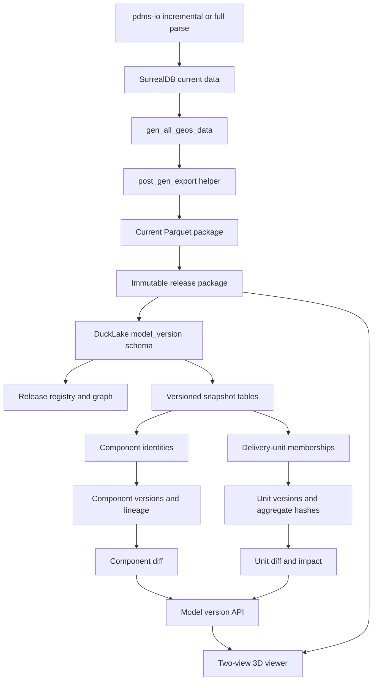

# E3D Model Version Architecture With DuckLake

Date: 2026-06-19

## Context

Production implementation baseline:
`docs/plans/2026-06-19-e3d-model-version-production-architecture-dev-plan.md`.

We already fixed and verified the backend incremental generation path:

```text
pdms-io sesno range
  -> incremental PE/ATT/UDA persistence
  -> scoped gen_all_geos_data(..., Some(update_log), ...)
  -> post-generation Parquet export
  -> site viewer reads output/<project>/parquet/<dbnum>
```

Validation case:

- Project: `AvevaMarineSample`
- DB file: `D:\AVEVA\Projects\E3D2.1\AvevaMarineSample\ams000\ams1112_0001`
- DB number: `1112`
- Sesno range: `896 -> 897`
- Increment result: `pe=169`, `att=169`, `total model changes=118`
- Generated package: `output\AvevaMarineSample\parquet\1112`
- Export manifest: `instances=106`, `geo_instances=163`, `transforms=131`,
  `aabb=105`, `ptsets=237`, `missing_geo_hashes=0`

This validation proves the current-state incremental generation/export path.
It does not prove an isolated historical model release by itself. A later
2026-06-19 replay of the same DB `1112` `896 -> 897` range into an empty
isolated namespace persisted the changes (`element_count=169`) but produced
zero model rows because no complete baseline scene tree/root state existed in
that namespace. Therefore, historical release generation must build/restore a
complete baseline state before applying a range, or label the result as a
patch-only artifact that cannot drive the two-pane 3D viewer.

The next requirement is larger: support model data versions so users can compare
two generated 3D model versions side by side, including component-level changes
and delivery-unit impact such as `BRAN`, `EQUI`, `WALL`, `FLOOR`, and `HANG`.

Oracle follow-up review:

- Session: `e3d-model-version-architectu-2`
- Saved output:
  `.planning/2026-06-17-ducklake-valv-version-diff/oracle_followup_2026-06-19.md`
- Additional Oracle MCP session: `e3d-model-version-ducklake-review`
- Transcript:
  `C:\Users\dpc\.oracle\sessions\e3d-model-version-ducklake-review\artifacts\transcript.md`
- Current Oracle MCP session: `e3d-ducklake-version-plan`
- Transcript:
  `C:\Users\dpc\.oracle\sessions\e3d-ducklake-version-plan\artifacts\transcript.md`
- Final Oracle MCP session for this slice: `e3d-model-version-architectu-3`
- Transcript:
  `C:\Users\dpc\.oracle\sessions\e3d-model-version-architectu-3\artifacts\transcript.md`

Oracle's recommendation is consistent with the existing repository findings:
use DuckLake, but only as the model-version release/index/query layer. Do not
replace the current SurrealDB generation writer in the MVP.

The additional Oracle MCP review sharpened the production blockers:

- A second real session-derived release is still required; the controlled
  fixture proves diff mechanics only.
- Release replay must include or pin GLB mesh assets, not only Parquet rows.
  The current implementation now indexes, hashes, and can materialize release
  mesh dependencies into release-local immutable storage.
- `component_key = <dbnum>:<refno_u64>` is an MVP identity and needs lineage
  hardening for delete/recreate, branch, and reconstructed-history cases.
- Delivery-unit impact needs owner-chain/tree-index semantics beyond the
  current direct-owner/self-unit rule.
- The richer plant3d-web viewer must either load release-specific packages or
  be explicitly replaced by the internal release viewer as the accepted surface.
- Historical replay must seed or restore a complete baseline state before
  applying a sesno range. A range-only replay in an empty namespace is a patch,
  not a complete model release.
- Current full-sync can hydrate only the source DB file's visible/current
  state. It is not a historical target-sesno restore from a newer DB file.
  Therefore a baseline release is valid sesno evidence only when the source
  snapshot already represents that baseline, a previous baseline package is
  restored, or a real target-sesno hydrate provider is added.
- `model-version inspect-history-baseline` now makes this boundary executable.
  On DB `1112` session `896`, it finds the exact session but reports
  `visible_refno_count=5`, `index_error_count=1`, and
  `full_state_enumeration_supported=false`. That result is read-only and
  intentionally non-publishable; the current pdms-io public index-only path is
  not enough to create the missing historical model baseline.
- Publish must be atomic at the domain level: validate package and release-local
  assets before marking a release as published.
- Read APIs must not auto-index or otherwise mutate DuckLake.

## Decision

Adopt an additive model-version layer after Parquet export.

```text
SurrealDB remains the generation writer.
Parquet remains the viewer delivery package.
DuckLake becomes the immutable release/index/query store.
Domain version tables define actual model version semantics.
```

Do not use the existing `model-writer-ducklake` as the MVP source of truth.
That backend is a generation-time writer experiment with known raw-table gaps.
Also do not depend on `pe_transform` DuckLake yet, because the current
DuckLake transform registration path is not complete.

Current production boundary after the `publish-history` safety slice:

- DuckLake remains the release catalog, package/file audit store, component and
  delivery-unit index store, diff query layer, and impact audit layer.
- DuckLake does not run historical generation, does not replace SurrealDB as the
  current generation writer, and does not store GLB binaries.
- Model data version identity is the application `release_id`. A release points
  to one immutable package plus derived DuckLake indexes. DuckLake snapshot ids
  are storage/audit evidence only; they are not the user-facing model version.
- Parsed-data state, model package state, mesh asset state, and derived diff
  indexes have separate immutability boundaries. A model release is publishable
  only after the package is non-empty, mesh dependencies are known or
  materialized, and required component/unit indexes are explicit.
- Historical release generation should run through an isolated replay DbOption
  in a separate `aios-database -c <replay-config>` process, then publish the
  resulting Parquet/GLB package into DuckLake with `model-version
  publish-history`.
- The historical replay command plan must include a complete baseline hydrate
  stage before the incremental sesno stage:
  1. parse/hydrate an isolated baseline namespace and scene tree;
  2. generate/export and publish the `from_sesno` baseline release;
  3. apply `from_sesno -> to_sesno`, generate/export, validate, and publish the
     child release.
- `model-version prepare-history-replay` writes baseline and replay DbOptions
  and prints the exact command plan. The current implementation emits
  `baseline_parse`, `baseline_generate`, `baseline_register`, `generate`, and
  `publish` commands plus process-safe argv arrays for each step.
- The current `baseline_parse` command is a current-visible-state full sync,
  not a target-sesno restore. Its JSON response includes
  `baseline_plan_warning` and safety flags documenting this limitation.
- A later `publish-from-sesno` job may orchestrate those same stages, but it
  should not bypass the isolated config boundary or the baseline warning.
- The remaining P0 proof is to build or restore a complete isolated baseline
  for DB `1112`, execute the generated replay command for a real session range,
  validate a non-empty replay package, and then publish that replay package as
  the second real session-derived release.
- A release registered before asset materialization/index completion is only a
  temporary smoke artifact. Production read APIs should expose only completed
  releases, or explicitly report `draft`/`failed`/`staged` state.
- Implemented safety gate: `publish-history` rejects historical packages whose
  `instances` or `geo_instances` row count is zero before DuckLake
  registration. The DB `1112` `896 -> 897` empty-namespace replay is now a
  validated negative case.
- Implemented orchestration aid: `prepare-history-replay --json` emits
  baseline/replay config paths, baseline release id, baseline dbnums,
  baseline safety warning, and argv arrays for all five command-plan stages.
- Implemented read-path no-mutation guard: component/unit diff, impact, and
  release-scene read helpers now require existing derived indexes and return
  actionable missing-index errors instead of auto-indexing. CLI validation
  proved `model-version diff --json` leaves missing index tables at zero rows;
  HTTP validation proved `GET /api/model-version/diff` returns `424 Failed
  Dependency` without mutating DuckLake.
- Implemented baseline gate command: `model-version validate-history-replay`
  reads staged replay Parquet packages, classifies empty-namespace output as
  `patch_only_empty_baseline`, classifies non-empty visual packages as
  `complete_visual_release_candidate`, reports row/path/scene-tree evidence as
  JSON, and is reused by `publish-history` before release registration.
- Implemented physical-source bridge:
  `model-version prepare-physical-baseline-snapshot` creates an isolated
  AVEVA project snapshot and DbOption when a physical DB file already
  represents a usable baseline. DB `1112` validation created
  `target\codex-physical-baseline\ams1112-791` from
  `D:\AVEVA\Projects\E3D2.1\AvevaMarineSample\ams1112_0001 copy`; the
  replacement file resolves exact sesno `791`, while the original active file
  remains latest sesno `897`.

## Why DuckLake

DuckLake is suitable here because it is a lightweight lakehouse format backed by
DuckDB. Official documentation describes it as a data lake with a catalog,
supporting time travel, partitioning, schema evolution, and multi-file storage.
DuckDB's `ducklake` extension supports attaching a DuckLake catalog with:

```sql
ATTACH 'ducklake:metadata.ducklake' AS my_ducklake (DATA_PATH 'data_files');
USE my_ducklake;
```

DuckLake time travel lets queries target a snapshot version or timestamp, and
its data change feed can return insert/update/delete changes between snapshot
bounds. These are useful storage features, but they are not enough to represent
business model releases. The application still needs explicit release IDs,
release graph metadata, component identity, component lineage, unit versions,
and deterministic impact rules.

References:

- DuckLake docs: `https://ducklake.select/docs/stable/`
- DuckDB DuckLake extension: `https://duckdb.org/docs/current/core_extensions/ducklake.html`
- DuckLake time travel: `https://ducklake.select/docs/stable/duckdb/usage/time_travel.html`
- DuckLake change feed: `https://ducklake.select/docs/stable/duckdb/advanced_features/data_change_feed.html`
- DuckLake partitioning: `https://ducklake.select/docs/stable/duckdb/advanced_features/partitioning.html`
- DuckLake catalog database selection:
  `https://ducklake.select/docs/stable/duckdb/usage/choosing_a_catalog_database.html`
- DuckDB concurrency model:
  `https://duckdb.org/docs/current/connect/concurrency.html`

## Options

| Option | Pros | Cons | Verdict |
| --- | --- | --- | --- |
| Versioned Parquet folders plus JSON only | Fastest and viewer-friendly | Diff, lineage, unit impact become custom ad hoc code | Useful fallback, not enough for full version management |
| Replace generation writer with DuckLake | Cleaner long-term idea | Current DuckLake writer and transform paths are incomplete; high regression risk | Not for MVP |
| Keep SurrealDB generation, publish immutable Parquet releases, index with DuckLake | Preserves verified generation; keeps viewer contract; gives SQL query/index layer | Requires new publish/index pipeline | Recommended |
| Store each historical version in isolated SurrealDB namespaces | Faithful runtime state | Heavy, not viewer-native, hard to diff and operate | Use only for reconstruction jobs |

## Target Architecture



Important separation:

- `fast_model/export_model` continues to produce viewer-compatible Parquet.
- `version_management` owns model releases, DuckLake indexing, hashes, and diff.
- Web APIs expose release packages and diff/impact results.
- The viewer renders two release packages and applies API-provided diff states.

## Files And Modules

Current files to keep stable:

- `src/fast_model/export_model/export_dbnum_instances_parquet.rs`
- `src/fast_model/export_model/post_gen_export.rs`
- `src/fast_model/gen_model/model_writer.rs`
- `src/fast_model/gen_model/model_writer_ducklake.rs`
- `src/pe_transform_store.rs`

New or expanded modules:

```text
src/version_management/
  mod.rs
  types.rs
  hashing.rs
  ducklake_store.rs
  model_release.rs
  release_graph.rs
  release_package.rs
  snapshot_import.rs
  component_identity.rs
  component_version.rs
  component_lineage.rs
  delivery_unit.rs
  unit_version.rs
  propagation_rules.rs
  unit_dependency.rs
  component_diff.rs
  unit_impact.rs
  cli.rs

src/web_api/
  model_version_api.rs
```

Cargo feature:

```toml
model-version-ducklake = ["dep:duckdb", "parquet-export"]
```

Keep this separate from `model-writer-ducklake`.

## Release Package Layout

Current package remains:

```text
output/<project>/parquet/
  manifest_<dbnum>.json
  <dbnum>/
    manifest.json
    instances.parquet
    geo_instances.parquet
    transforms.parquet
    aabb.parquet
    tubings.parquet
    ptsets.parquet
    primitive_keypoints.parquet
```

Versioned release package:

```text
output/<project>/model_versions/
  releases/
      <release_id>/
      release.json
      validation.json
      parquet/
        manifest_<dbnum>.json
        <dbnum>/
          manifest.json
          instances.parquet
          geo_instances.parquet
          transforms.parquet
          aabb.parquet
          tubings.parquet
          ptsets.parquet
          primitive_keypoints.parquet
      meshes/
        lod_<lod_tag>/
          <geo_hash>_<lod_tag>.glb
      mesh_assets_manifest.json
  ducklake/
    metadata.ducklake
    data/
```

Do not let DuckLake take ownership of the live viewer package. Either import
rows into DuckLake-managed tables or register/copy files under the DuckLake data
path. Keep release package files immutable for viewer replay.

Current asset status:

- Implemented: release mesh dependency index derived from immutable
  `geo_instances.parquet`.
- Implemented: per-asset GLB path, URL, byte size, SHA-256, existence flag, and
  builtin primitive flag stored in DuckLake.
- Implemented: derived manifest under
  `output/<project>/model_versions/asset_indexes/<release_id>/<dbnum>/mesh_assets_manifest.json`.
- Implemented: `index-assets --materialize` and the matching HTTP
  `?materialize=true` path copy GLB assets into release-local `meshes/`
  storage.
- Implemented: runtime-scene URLs prefer release-local pinned
  `/files/output/<project>/model_versions/releases/<release_id>/meshes/...`
  URLs when that directory exists, with `/files/meshes/...` retained as the
  fallback for older releases.
- Future optimization: replace copy with hard-link/reflink or
  content-addressed object-store publishing for large production deployments.

## Version Data Model

Use DuckLake schema:

```sql
CREATE SCHEMA IF NOT EXISTS model_version;
```

### Release Tables

`model_version.model_releases`

| Column | Purpose |
| --- | --- |
| `release_id` | Application release id, not just DuckLake snapshot id |
| `project` | Project name, for example `AvevaMarineSample` |
| `site` | Optional site id |
| `dbnums_json` | Source dbnums |
| `release_label` | Human label |
| `semantic_version` | Optional business version |
| `branch_id` | Release stream, default `main` |
| `parent_release_id` | Previous release |
| `derivation_type` | `full`, `incremental_sesno`, `manual_import`, `reconstructed_history` |
| `source_kind` | `e3d_sesno_range`, `current_parquet`, `archived_parquet` |
| `from_sesno` / `to_sesno` | Increment source range |
| `target_sesno` | Optional historical generation target |
| `generation_task_id` | Web/CLI task id |
| `manifest_root` | Release package root |
| `parquet_package_root` | Release Parquet root |
| `release_hash` | Aggregate release fingerprint |
| `hash_version` | Hash algorithm version |
| `rule_set_hash` | Impact rule set version |
| `status` | `draft`, `generated`, `packaged`, `registered`, `indexed`, `published`, `failed` |
| `generation_report_json` | Generator diagnostics |
| `export_report_json` | Parquet export diagnostics |
| `validation_report_json` | Asset/schema validation |

`model_version.model_release_edges`

| Column | Purpose |
| --- | --- |
| `edge_id` | Stable edge id |
| `old_release_id` | Parent/baseline |
| `new_release_id` | Child/comparison release |
| `edge_kind` | `parent`, `compare`, `branch`, `merge` |
| `branch_id` | Stream |
| `derivation_type` | How child was produced |
| `created_at` | Creation time |
| `edge_metadata_json` | Notes/evidence |

`model_version.model_release_files`

| Column | Purpose |
| --- | --- |
| `release_id` | Owning release |
| `dbnum` | DB number |
| `table_name` | `instances`, `geo_instances`, `transforms`, etc. |
| `file_path` | Immutable file path |
| `file_size_bytes` | File size |
| `content_sha256` | File content hash |
| `row_count` | Imported row count |
| `schema_hash` | Schema fingerprint |
| `source_manifest_path` | Original manifest |
| `mesh_lod_tag` | LOD |
| `missing_geo_hashes` | Mesh validation |
| `missing_owner_refnos` | Mesh validation |

`model_version.model_release_mesh_assets`

| Column | Purpose |
| --- | --- |
| `release_id` | Owning release |
| `project_name` | Project |
| `dbnum` | DB number |
| `lod_tag` | Mesh LOD, for example `L1` |
| `geo_hash` | Geometry mesh hash from `geo_instances.parquet` |
| `builtin` | Whether the hash is a builtin primitive |
| `asset_exists` | Whether the GLB exists at index time |
| `mesh_relative_path` | Path relative to mesh root |
| `mesh_absolute_path` | Resolved filesystem path for diagnostics |
| `mesh_url` | Current viewer URL |
| `bytes` | GLB byte size |
| `sha256` | GLB content hash |
| `indexed_at` | Index time |

`model_version.model_release_mesh_asset_index_runs`

| Column | Purpose |
| --- | --- |
| `release_id` | Indexed release |
| `project_name` | Project |
| `dbnum` | DB number |
| `lod_tag` | Mesh LOD |
| `geo_hash_count` | Unique geometry hashes referenced by the release |
| `present_count` | Existing or builtin assets |
| `missing_count` | Missing non-builtin assets |
| `builtin_count` | Builtin assets |
| `total_bytes` | Total bytes for present GLBs |
| `asset_index_hash` | Stable hash of all indexed rows |
| `manifest_path` | Derived manifest path |
| `indexed_at` | Index time |

### Snapshot Tables

Mirror existing Parquet tables and add `release_id` + `dbnum`.

Required for MVP:

- `model_version.versioned_instances`
- `model_version.versioned_geo_instances`
- `model_version.versioned_transforms`
- `model_version.versioned_aabb`

Recommended next:

- `model_version.versioned_tubings`
- `model_version.versioned_ptsets`
- `model_version.versioned_primitive_keypoints`

### Component Tables

Phase 2 MVP intentionally starts with one denormalized table,
`model_version.component_snapshots`, before expanding into the full identity,
version, and lineage tables below. This gives the CLI/API a stable diff surface
without forcing all delivery-unit semantics into the first production slice.

`model_version.component_snapshots`

| Column | Purpose |
| --- | --- |
| `release_id` | Owning model release |
| `project_name` | Project, for example `AvevaMarineSample` |
| `dbnum` | DB number |
| `component_key` | MVP identity key, `<dbnum>:<refno_u64>` |
| `refno_str` / `refno_u64` | Instance refno |
| `noun` | Component noun |
| `owner_refno_*` / `owner_noun` | Immediate ownership |
| `cata_hash` | Catalog shape fingerprint, when present |
| `trans_hash` | Instance transform dictionary key |
| `aabb_hash` | AABB dictionary key |
| `spec_value` | Spec information exported with the instance |
| `has_neg` | Boolean-operation marker |
| `geo_signature` | Ordered `geo_index:geo_hash:geo_trans_hash` list |
| `component_hash` | Stable Phase 2 component fingerprint |
| `hash_version` | `component_snapshot:v1` |
| `indexed_at` | Index time |

Initial component hash:

```text
sha256(
  "component_snapshot:v1|"
  + dbnum
  + refno_str
  + refno_u64
  + noun
  + owner refno/noun
  + cata_hash
  + trans_hash
  + aabb_hash
  + spec_value
  + has_neg
  + sorted geo_signature
)
```

This table is derived from immutable release package files:

- `instances.parquet`
- `geo_instances.parquet`

`trans_hash` and `aabb_hash` are included by reference in Phase 2 because the
current exporter already writes them as content-addressed dictionary keys.
Phase 3 can widen the hash payload to join full transform/AABB rows when
tolerance-aware geometric diff is required.

`model_version.component_identities`

| Column | Purpose |
| --- | --- |
| `component_identity_hash` | Cross-release identity |
| `project` | Project |
| `dbnum` | DB number |
| `refno_u64` / `refno_str` | Initial identity anchor |
| `identity_strategy` | Start with `refno:v1` |
| `identity_confidence` | `1.0` for refno match |
| `diagnostics_json` | Future non-refno diagnostics |

Initial hash:

```text
sha256("component_identity:v1|project|dbnum|refno_u64")
```

`model_version.component_versions`

| Column | Purpose |
| --- | --- |
| `component_version_id` | One component in one release |
| `release_id` | Release |
| `component_identity_hash` | Stable component identity |
| `refno_u64` / `refno_str` | Refno |
| `noun` | Component noun |
| `owner_refno_*` / `owner_noun` | Ownership |
| `owner_path_json` | Resolved path |
| `geometry_hash` | Geometry rows hash |
| `transform_hash` | Transform hash |
| `aabb_hash` | AABB hash |
| `attribute_hash` | Noun/cata/spec/flags |
| `membership_hash` | Delivery-unit membership hash |
| `component_hash` | Combined fingerprint |
| `hash_version` | Algorithm version |
| `is_deleted` | Tombstone flag |
| `diagnostics_json` | Details |

`model_version.component_lineage`

| Column | Purpose |
| --- | --- |
| `edge_id` | Release edge |
| `component_identity_hash` | Identity |
| `old_release_id` / `new_release_id` | Compared releases |
| `old_component_version_id` / `new_component_version_id` | Versions |
| `change_kind` | `unchanged`, `added`, `deleted`, `changed`, `moved`, `identity_conflict` |
| `field_change_mask` | `geometry`, `transform`, `aabb`, `attribute`, `membership` |
| `old_component_hash` / `new_component_hash` | Fingerprints |
| `identity_confidence` | Confidence |
| `diagnostics_json` | Evidence |

### Delivery Unit Tables

Delivery unit nouns:

- `BRAN`
- `EQUI`
- `WALL`
- `FLOOR`
- `HANG`
- `UNASSIGNED`

Current implementation note:

The first validated slice stores delivery-unit data directly in DuckLake tables
inside `src/version_management/ducklake_store.rs`:

- `model_version.delivery_unit_memberships`
- `model_version.unit_versions`
- `model_version.unit_index_runs`

It intentionally uses `component_key = <dbnum>:<refno_u64>` from
`component_snapshots` instead of the future `component_identity_hash` tables.
This keeps the DB `1112` MVP aligned with the implemented component diff while
leaving room for lineage-based identity later.

`model_version.delivery_units`

| Column | Purpose |
| --- | --- |
| `unit_key` | Stable unit key |
| `project` | Project |
| `dbnum` | DB number |
| `unit_refno_*` | Unit refno |
| `unit_noun` | Unit type |
| `unit_identity_hash` | Unit identity |
| `identity_strategy` | Identity strategy |
| `diagnostics_json` | Evidence |

`model_version.delivery_unit_membership_versions`

| Column | Purpose |
| --- | --- |
| `release_id` | Release |
| `unit_key` | Delivery unit |
| `component_identity_hash` | Member identity |
| `component_refno_*` | Member refno |
| `component_noun` | Member noun |
| `membership_kind` | `direct_owner`, `owner_chain`, `tubing_owner`, `inferred`, `unassigned` |
| `member_role` | `physical_member`, `semantic_owner`, etc. |
| `owner_path_json` | Path evidence |
| `path_confidence` | Confidence |
| `unresolved_reason` | Why membership failed |
| `membership_hash` | Membership fingerprint |

Implemented membership rule set `unit_impact_rules:v1`:

- If the component noun is `BRAN`, `EQUI`, `WALL`, `FLOOR`, or `HANG`, the
  component is its own delivery unit with `membership_kind=self_unit`.
- Otherwise, if its immediate owner noun is one of those unit nouns, the
  component belongs to that owner with `membership_kind=direct_owner`.
- Otherwise, the component is assigned to `UNASSIGNED` and the unresolved reason
  is stored.

This is production-safe as a conservative first slice because it never invents a
deep owner path. It is not yet complete for indirect paths such as
`VALV -> EQUI -> BRAN`; that requires owner-chain/tree-index resolution.

`model_version.unit_versions`

| Column | Purpose |
| --- | --- |
| `unit_version_id` | One unit in one release |
| `release_id` | Release |
| `unit_key` | Delivery unit |
| `unit_noun` | Type |
| `parent_unit_version_id` | Optional hierarchy |
| `aggregate_hash` | Unit version fingerprint |
| `hash_version` | Hash algorithm |
| `rule_set_hash` | Impact rule set |
| `member_count` | Members |
| `added_count` / `deleted_count` / `changed_count` | Counters |
| `moved_in_count` / `moved_out_count` | Move counters |
| `unresolved_member_count` | Unassigned/unknown |
| `diagnostics_json` | Details |

Aggregate hash:

```text
sha256(
  "unit_version:v1|"
  + unit_key
  + unit_noun
  + rule_set_hash
  + sorted(component_identity_hash, component_hash, member_role, membership_hash)
)
```

### Impact Tables

`model_version.propagation_rules`

| Column | Purpose |
| --- | --- |
| `rule_set_hash` | Rule-set version |
| `rule_id` | Rule id |
| `rule_version` | Rule version |
| `source_change_kind` | `geometry`, `transform`, `aabb`, `attribute`, `membership`, `add`, `delete` |
| `source_noun_filter` | `VALV`, `TUBI`, `*`, etc. |
| `target_unit_noun` | `BRAN`, `EQUI`, etc. |
| `impact_kind` | `content_changed`, `moved_in`, `moved_out`, etc. |
| `severity` | `info`, `minor`, `major`, `blocking` |
| `threshold_json` | Tolerances |
| `enabled` | Enabled flag |

`model_version.unit_dependency_edges`

| Column | Purpose |
| --- | --- |
| `release_id` | Release |
| `component_identity_hash` | Component |
| `unit_key` | Unit |
| `dependency_kind` | `owner_chain`, `direct_owner`, `tubi_owner`, `shared_ref`, `inferred` |
| `path_json` | Path |
| `path_confidence` | Confidence |
| `evidence_json` | Evidence |

`model_version.component_unit_impacts`

| Column | Purpose |
| --- | --- |
| `edge_id` | Release edge |
| `component_identity_hash` | Component |
| `unit_key` | Impacted unit |
| `old_unit_version_id` / `new_unit_version_id` | Versions |
| `impact_kind` | Impact |
| `rule_set_hash` / `rule_id` | Rule evidence |
| `dependency_path_json` | Path evidence |
| `evidence_json` | Details |

The current endpoint computes component-to-unit impact on demand from component
diff rows, old/new `delivery_unit_memberships`, and old/new `unit_versions`.
Persisting `component_unit_impacts` remains a scale/traceability hardening step
once owner-chain rules are complete.

## Incremental Flow

The existing incremental generation flow remains the production update path.

New publish flow after successful `post_gen_export`:

```text
post_gen_export success
  -> create release metadata
  -> copy/hardlink current Parquet package to immutable release package
  -> checksum files and write release.json
  -> register release in DuckLake
  -> import snapshot tables
  -> compute component identities
  -> resolve delivery-unit memberships
  -> compute component_versions
  -> build lineage against parent release
  -> compute unit_versions
  -> apply propagation rules
  -> mark release published
```

For MVP, re-index the full affected dbnum package. Optimize later using
`IncrGeoUpdateLog` and delivery-unit expansion.

Do not replay old sesno ranges into the same current SurrealDB namespace. For
old versions use one of:

- archived Parquet package -> register as release;
- isolated SurrealDB namespace -> generate/export/register;
- future no-save/history generation mode.

## CLI Plan

Add commands or flags:

```text
model-version register
model-version list
model-version index-components
model-version index-units
model-version diff-component
model-version impact-component
model-version diff-unit
model-version compare
```

Suggested CLI arguments:

```text
--model-version-ducklake-metadata <PATH>
--model-version-ducklake-data-path <PATH>
--project <PROJECT>
--dbnum <DBNUM>
--release-id <ID>
--parent-release-id <ID>
--old-release-id <ID>
--new-release-id <ID>
--release-label <LABEL>
--branch-id <ID>
--derivation-type <TYPE>
--parquet-dir <DIR>
--refno <REFNO>
--unit-key <KEY>
--json
```

Keep orchestration thin:

```text
main.rs -> cli_modes.rs -> version_management::cli
```

No SQL or hashing logic should live in `main.rs`.

## Web API Plan

Add `src/web_api/model_version_api.rs`.

Implemented MVP APIs:

```text
GET  /api/model-version/releases
GET  /api/model-version/releases/{release_id}
GET  /api/model-version/releases/{release_id}/runtime-scene
POST /api/model-version/releases/{release_id}/index
GET  /api/model-version/diff
GET  /model-version/compare
GET  /model-version/release-viewer
```

Implemented response behavior:

- `GET /api/model-version/releases` reads the current project model-version
  DuckLake catalog, optionally filters by `dbnum`, and returns release rows plus
  browser-safe `package_url`, `manifest_url`, `viewer_url`, and
  `release_viewer_url` fields.
- `GET /api/model-version/releases/{release_id}` returns one release plus its
  immutable package `manifest.json`.
- `GET /api/model-version/releases/{release_id}/runtime-scene` reads
  `instances.parquet`, `geo_instances.parquet`, `transforms.parquet`, and
  `aabb.parquet` from the immutable package and returns a viewer-ready scene
  JSON with component metadata, transform hashes, matrices, AABBs, geometry
  hashes, and mesh URL pattern information.
- `POST /api/model-version/releases/{release_id}/index` rebuilds component
  snapshots for an existing immutable release package.
- `GET /api/model-version/diff` returns added/deleted/changed/unchanged
  component counts and emitted component rows. Supported query parameters:
  `from_release_id`, `to_release_id`, `change_type=added|deleted|changed`,
  `limit`, and optional `project`.
- Long-running DuckLake/Parquet work is wrapped in `spawn_blocking` so axum's
  async runtime is not blocked by synchronous file/catalog work.
- HTTP errors are classified into 400/404/409/503/500 with JSON envelopes.

Implemented compare entry:

- `GET /model-version/compare` is a lightweight two-pane comparison page.
- It lists releases, calls the diff API, displays diff metrics and rows, and
  embeds two internal release viewer panes via `release_viewer_url`.
- The page is intentionally thin: domain diff stays in the backend.

Implemented internal release viewer:

- `GET /model-version/release-viewer` is an internal xeokit/GLTF viewer for one
  immutable release package.
- It calls the runtime-scene API, builds GLB URLs from `mesh_base_url` and
  `mesh_lod_tag`, multiplies instance and geometry matrices in the browser, and
  loads each geometry through the existing `/files/meshes/...` static service.
- This viewer is intentionally small and operationally useful for validation
  and side-by-side comparison. The full plant3d-web viewer should still learn
  to honor `model_release_id`/`parquet_base_url` so production users can use the
  richer existing viewer.

Read APIs:

```text
GET  /api/model-version/releases
GET  /api/model-version/releases/{release_id}
GET  /api/model-version/releases/{release_id}/runtime-scene
GET  /api/model-version/releases/{release_id}/package/{dbnum}/manifest
GET  /api/model-version/releases/{release_id}/package/{dbnum}/file/{table}
```

Index and diff APIs:

```text
POST /api/model-version/releases/{release_id}/index
POST /api/model-version/releases/{release_id}/index-units
POST /api/model-version/releases/{release_id}/index-assets
GET  /api/model-version/releases/{release_id}/mesh-assets
GET  /api/model-version/diff
GET  /api/model-version/unit-diff
GET  /api/model-version/component-impact
```

Compare response must include:

- old/new release ids;
- old/new manifest URLs;
- changed component summaries;
- impacted unit summaries;
- rule id and dependency path evidence;
- degraded/missing asset warnings.

## Viewer Plan

Keep the existing Parquet viewer contract.

Two-view comparison:

```text
left viewport  = old release manifest
right viewport = new release manifest
camera         = synchronized
selection      = linked by component_identity_hash
diff overlay   = API result
```

Visual states:

- unchanged
- added
- deleted
- geometry changed
- transform changed
- attribute changed
- moved unit
- unresolved/unassigned

The viewer must not implement domain diff logic. It only renders two packages
and colors/selects entities according to backend diff output.

## Edge Cases

Generation/export:

- wrong historical db file path;
- `to_sesno` greater than latest sesno;
- `from_sesno >= to_sesno`;
- no model-affecting increment;
- delete-only increment;
- unknown nouns;
- dbnum discovery failure;
- `exclude_db_nums` removing all candidates;
- missing/stale `pe_transform`;
- disabled `parquet-export` or `sqlite-index`;
- unwritable output;
- missing `scene_tree/<dbnum>.tree`;
- replaying old sesno into current SurrealDB.

Versioning:

- release id already registered;
- same release id points to different content;
- optional Parquet tables missing;
- required Parquet columns missing;
- schema drift across exporter versions;
- old mesh assets missing;
- component deleted and recreated;
- component moved between units;
- indirect ownership such as `VALV -> EQUI -> BRAN`;
- shared references over-propagating impact;
- tiny geometry/transform changes below tolerance;
- floating point instability in hashes;
- unassigned delivery-unit membership;
- branch/merge comparisons.

## Validation Strategy

Repository constraints:

- Do not use `cargo test`.
- For backend CLI behavior, use CLI + JSON.
- For web behavior, run the service and verify with HTTP/POST.

Phase validation:

1. DB1112 history candidate discovery
   - Scan candidate sesno windows before selecting a visual comparison sample.
   - Record PE/ATT/UDA/delete counts, classified affected roots, visible root
     count, unknown nouns, and expected dbnums.
   - Treat `896 -> 897` empty-namespace replay as a negative baseline case
     until a complete baseline state is available.

2. Generation/export stays green
   - Run `incremental-sesno --generate-model --json`.
   - Verify `parquet_export.enabled=true`.
   - Verify release package manifest and row counts.
   - Implemented: run `model-version validate-history-replay --json` before
     publish. It reports whether the staged package is a non-empty visual
     release candidate or only a patch-only empty-baseline artifact.
   - In isolated historical replay, verify the baseline gate first: scene tree
     can be required with `--require-scene-tree` when a workflow depends on it;
     by default the MVP hard gate follows the current viewer contract and
     requires non-zero `instances` and `geo_instances`.

3. Release registration
   - Register two packages, for example `ams-1112-sesno-896` and
     `ams-1112-sesno-897`.
   - Verify `model_releases`, `model_release_edges`, `model_release_files`.
   - Re-register with same checksums must be idempotent.

4. Component indexing
   - Verify stable `component_identity_hash`.
   - Verify deterministic `component_hash`.
   - Re-index same release and compare hashes.

5. Unit indexing
   - Verify `BRAN`/`EQUI`/`WALL`/`FLOOR`/`HANG` unit versions.
   - Verify unassigned count is reported.
   - Verify aggregate hashes are deterministic.
   - Verify same-release unit diff returns zero changes.
   - Verify cross-release fixture diff changes only the affected unit when only
     one component hash changes.

6. Diff and impact
   - Pick a known changed refno from the 896 -> 897 increment.
   - Verify component diff returns field-level change mask.
   - Verify old/new delivery-unit membership.
   - Verify impacted delivery units include rule id and owner path evidence.
   - Verify containing unit aggregate hash changes when rule says the member
     change is version-significant.

7. HTTP/viewer
   - Run web_server with startup generation disabled.
   - `GET /api/model-version/releases`
   - `GET /api/model-version/diff`
   - `POST /api/model-version/releases/{release_id}/index`
   - `POST /api/model-version/releases/{release_id}/index-units`
   - `GET /api/model-version/unit-diff`
   - `GET /api/model-version/component-impact`
   - `GET /model-version/compare`
   - Load old/new release manifests in two viewports once the viewer supports
     `parquet_base_url`/`model_release_id`.
   - Selecting one changed entity highlights its paired identity.

## Development Plan

### Phase 0: Boundary Lock

Deliverable:

- Confirm existing generation/export path remains unchanged.
- Keep DuckLake generation writer out of the MVP.
- Keep current viewer Parquet package format unchanged.

### Phase 1: Feature And DuckLake Store

Files:

- `Cargo.toml`
- `src/version_management/types.rs`
- `src/version_management/hashing.rs`
- `src/version_management/ducklake_store.rs`
- `src/version_management/model_release.rs`
- `src/version_management/release_graph.rs`
- `src/version_management/snapshot_import.rs`
- `src/version_management/cli.rs`

Deliverable:

- Create DuckLake schema.
- Register one release.
- Import `instances`, `geo_instances`, `transforms`, `aabb`.
- List releases as JSON.

### Phase 2: Immutable Release Package

Files:

- `src/version_management/release_package.rs`
- `src/fast_model/export_model/post_gen_export.rs` integration hook or caller-level publish step

Deliverable:

- Copy/hardlink current package to `model_versions/releases/<release_id>`.
- Generate `release.json`.
- Checksum and row-count files.
- Store `model_release_files`.
- Convert publish into an idempotent state machine: stage, validate Parquet,
  materialize release-local meshes, compute full package hash, then register as
  `published`.
- Keep failed or incomplete packages as `draft`, `staged`, or `failed`; read
  APIs must not expose them as completed releases.
- Status: zero-row visual package rejection is implemented in `publish-history`.
  The broader multi-state publish job remains pending.

### Phase 3: Component Versions

Files:

- `component_identity.rs`
- `component_version.rs`
- `component_lineage.rs`

Deliverable:

- Build `component_identities`.
- Build `component_versions`.
- Compare old/new component hashes.
- Persist lineage rows.

### Phase 4: Delivery Units And Impact

Files:

- `delivery_unit.rs`
- `unit_version.rs`
- `propagation_rules.rs`
- `unit_dependency.rs`
- `unit_impact.rs`

Deliverable:

- Resolve delivery-unit memberships.
- Build `unit_versions`.
- Compute component-to-unit impacts.
- Status: first slice implemented in `ducklake_store.rs` with direct-owner and
  self-unit membership, `unit_versions`, `unit-diff`, and on-demand impact.
- Remaining: owner-chain/tree-index membership resolver, persisted dependency
  edges, movement classification, and non-refno lineage.

### Phase 5: API And Viewer

Files:

- `src/web_api/model_version_api.rs`
- router registration in `src/web_api/mod.rs` or `src/web_server/mod.rs`
- frontend two-view compare surface

Deliverable:

- Release list API. Status: implemented.
- Component index API. Status: implemented.
- Component diff API. Status: implemented.
- Release package serving API. Status: implemented via existing
  `/files/output/...` static serving plus API-provided package URLs.
- Lightweight compare page. Status: implemented.
- Release detail API. Status: implemented.
- Runtime scene API. Status: implemented.
- Internal release viewer. Status: implemented and browser-validated against
  DB `1112`.
- Unit index API. Status: implemented and HTTP-validated.
- Unit diff API. Status: implemented and HTTP-validated.
- Component unit impact API. Status: implemented and HTTP-validated for the
  direct-owner/self-unit rule set.
- Release mesh asset index API. Status: implemented and HTTP-validated; it
  indexes mesh dependencies, detects missing GLBs, and can materialize
  release-local mesh copies.
- Read-only GET behavior. Status: implemented for component/unit diff, impact,
  and release-scene paths; missing indexes return dependency errors and do not
  call mutating `ensure_*` helpers.
- Release-specific two-view 3D model loading. Status: implemented through the
  internal release viewer; plant3d-web release URL support remains a future
  integration task.

### Phase 6: Optimization

Deliverable:

- Partition DuckLake by `release_id` and `dbnum` after measuring row counts.
- Cache common compare results.
- Incrementally re-index affected components/units from `IncrGeoUpdateLog`.
- Add non-refno identity strategies.
- Add no-save/history generation mode for old sesno reconstruction.
- Add a single-writer publish/index queue for local DuckLake metadata.
- For multi-process or multi-host production writes, move the DuckLake catalog
  to PostgreSQL rather than relying only on the local lock file.
- Preinstall or vendor the DuckLake extension for offline deployments.

## Final Recommendation

The best architecture is not "move model generation to DuckLake". The best
architecture is:

```text
existing generation and current model delivery stay stable
  + immutable release packaging
  + DuckLake release/index/query store
  + domain version graph, component lineage, unit versions, impact rules
  + side-by-side viewer loading two release packages
```

This gives us the two UI comparison goal without destabilizing the now-verified
incremental generation pipeline, while still creating a real model version
system rather than a pile of historical files.

## 2026-06-20 Oracle Review And Validation Notes

The Oracle review confirmed the architectural boundary:

- SurrealDB remains the mutable generation workspace and query provider for the
  current generator.
- Parquet and GLB files are the immutable model release payload.
- DuckLake is valuable as the release catalog, file manifest, mesh asset
  manifest, component/unit snapshot index, diff/impact index, and audit store.
- DuckLake should not become the online model writer, large-asset body store, or
  replacement for release-local Parquet/GLB packages.

Version vocabulary to keep:

- Parse increment version: `dbnum + from_sesno + to_sesno + source_file +
  parser_config`.
- Baseline state version: full PE/ATT/tree/transform state at a target sesno in
  an isolated namespace or future history provider.
- Model release version: immutable, user-visible package identified by
  `release_id`, with parent links, derivation type, package hash, and generation
  config hash.
- Asset version: content-hashed Parquet/GLB/material files in the release
  package.
- Diff/index version: derived component/unit/delivery impact data bound to a
  release pair and hash-rule version.

DB1112 physical baseline evidence:

- `codex_baseline_ams1112_791` generated a complete non-empty model state from
  the physical `ams1112_0001 copy` file.
- The SurrealDB relation writer conflict is fixed by replace-on-write relation
  updates; the previously failing `inst_relate:[17496,254370,0]` now points to
  the CATA-hash `inst_info` record.
- The isolated export
  `target\codex-physical-baseline\ams1112-791\validation-export-fixed\1112`
  produced:
  - `instances=47698`
  - `geo_instances=31292`
  - `transforms=30495`
  - `aabb=28372`
  - `tubings=56`
  - `ptsets=6999`
- The package still has `missing_geo_hashes=24`, so a publish operation should
  fail or remain staged until mesh assets are complete.

Architecture adjustment from validation:

- Release publish must include a mesh-asset completeness gate. Non-empty Parquet
  is necessary but not sufficient for a visual release.
- Historical replay jobs must be managed jobs, not blocking CLI runs, because
  full DB1112 generation plus export can exceed short local shell timeouts.
- Isolated replay config must also route perf and failed-SQL diagnostics into
  the isolated output root.
- The next two-pane comparison milestone should use two publishable release
  packages, not live SurrealDB state, so that both panes are reproducible and do
  not mutate during viewing.

Follow-up architecture document:

- `docs/plans/2026-06-20-e3d-model-version-mesh-baseline-architecture-dev-plan.md`
  is now the latest consolidated plan for the DB1112 physical baseline,
  missing mesh handling, DuckLake asset evidence, release gates, and the
  two-pane development sequence.

Additional validation after the missing-mesh gate:

- `model-version validate-history-replay --json` classifies the DB1112 791
  physical baseline package as `missing_mesh_assets`.
- The package remains a non-empty visual candidate by row count, but is not
  ready for publish:
  - `instances=47698`
  - `geo_instances=31292`
  - `missing_mesh_geo_hashes=24`
  - `missing_mesh_owner_refnos=42`
  - `mesh_assets_complete=false`
- `publish-history` refuses
  `codex-ams1112-physical-791-missing-mesh-gate` before release registration.
  A release-list check confirmed that id was not written to DuckLake.

Updated decision:

- Missing mesh assets are first-class release validation evidence, not a
  warning to ignore.
- DuckLake should record asset validation and mesh-generation evidence, but not
  own GLB bodies.
- File-mode mesh generation may skip heavy mesh body persistence, but it must
  persist success/failure status or an equivalent sidecar that the exporter and
  release validator can trust.
