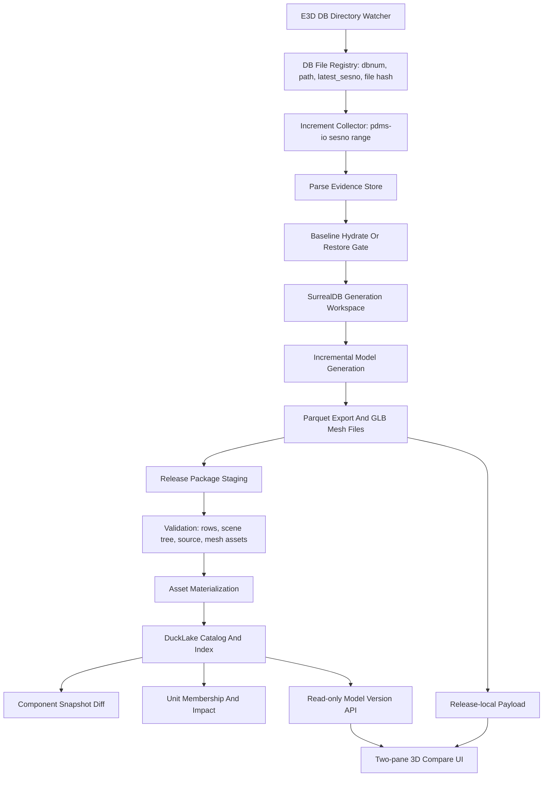

# E3D 增量更新、模型版本与 DuckLake 架构方案

日期: 2026-06-20

## 1. 结论

本方案基于当前源码、DB1112 本地验证结果，以及 Oracle MCP 第二视角审查。

最终建议:

- 使用 DuckLake，但只作为模型发布的 catalog、manifest、索引、diff、impact、审计查询层。
- 不把 DuckLake 作为三维模型生成的第一写入器，也不把 GLB/Parquet 二进制本体写入 DuckLake。
- 模型数据版本使用业务级 `release_id` 表示，不使用原始 `sesno` 或 DuckLake snapshot id 作为用户可见版本。
- `sesno` 范围只是来源证据。只有在完整 baseline state 存在、模型生成成功、包验证通过、资产物化、索引完成、发布状态变为 `published` 后，才是可对比的模型版本。
- 当前最重要的 P0 不是再扩 DuckLake 表，而是解决真实 baseline hydrate/restore，以及发布状态机。

Oracle MCP 证据:

- 已复读完成会话: `e3d-model-version-architectu-3`, `e3d-ducklake-version-plan`, `e3d-model-version-ducklake-review`。
- 本轮完成会话: `e3d-model-version-architectu-20260620`，使用 13 个当前源码/文档文件，输入约 146k tokens，输出约 5.1k tokens。
- Transcript:
  `C:\Users\dpc\.oracle\sessions\e3d-model-version-architectu-20260620\artifacts\transcript.md`。
- 已完成 Oracle 结论一致: DuckLake 是 catalog/index/audit 层，SurrealDB 仍是生成 workspace，Parquet/GLB release package 才是发布 payload。
- 新会话补充强调: `ModelReleaseRecord` 缺少 release status/source manifest/baseline state/generation job/asset hash 等字段；DuckLake store 应拆 `open_readonly()` 和 `open_writer()`；published release 的 runtime-scene 不应 fallback 到 global mesh root。

## 2. 需求分析

用户目标:

1. 监控 AVEVA E3D/PDMS 数据库目录。
2. 发现 DB 文件和 session 变化。
3. 增量解析并保存 PE/ATT/UDA/delete 等数据。
4. 基于完整 baseline state 做模型增量生成。
5. 把每个模型状态发布为不可变 release。
6. 选择 DB1112 的某个历史记录做测试。
7. 最终在两个界面看到两个三维模型版本对比。

测试站点:

```text
D:\AVEVA\Projects\E3D2.1\AvevaMarineSample
DB1112
```

当前可验证证据:

- DB1112 physical `791` baseline 已能生成并发布 quarantined visual release:
  `codex-ams1112-physical-791-quarantine`。
- 当前 DB1112 `897` partial package 已注册为链路验证 release:
  `codex-ams1112-current-897-partial`。
- 两个 release 的 DuckLake catalog、asset index、component diff、HTTP runtime-scene、two-pane compare 均可跑通。
- Web compare 现在能显示 AABB proxy 3D geometry，并且 release-local GLB 加载失败数为 `0`。

仍未完成的生产目标:

- 真实 target-sesno full-state hydrate 尚未解决。
- 897 full physical snapshot parse/generate 未在实际验证窗口内完成。
- 当前 897 partial release 只能证明链路，不证明真实增量模型变化。
- 发布流程缺少完整状态机和原子性。
- direct-owner unit membership 只是 MVP，不是最终交付单影响规则。

## 3. Edge Cases

### 3.1 数据源与 session

- source DB 文件不存在或被占用。
- source DB header dbnum 与请求 dbnum 不一致。
- 选择了错误分支或错误项目目录下的同名 DB 文件。
- 请求的 `from_sesno` 或 `to_sesno` 不存在。
- `from_sesno >= to_sesno`。
- `to_sesno` 超过 source latest sesno。
- 文件 latest session 与用户期望历史 session 不匹配。
- 物理历史文件与当前项目依赖 DB 不一致。
- 依赖 catalogue/system DB 未纳入 baseline。
- pdms-io 只能解析 session delta，无法枚举 target-sesno 完整可见状态。

### 3.2 Baseline hydrate

- 空 namespace 上直接跑 `incremental-sesno --generate-model`，导致解析到 changes 但模型 rows 为 0。
- current-file full sync 被误认为 target-sesno restore。
- baseline config 写了 `save_db=true`，但二进制未编译 `surreal-save`，实际无法保存 PE/ATT baseline。
- baseline namespace 等于 current namespace。
- baseline output 等于 current mutable output。
- hydrate 只写 tree/meta，不写 PE/ATT/UDA/transform。
- hydrate 写入了 future session 数据，污染历史版本。
- hydrate 成功但缺少验证 evidence，后续无法审计。

### 3.3 增量解析与保存

- 删除-only session。
- 属性-only session。
- 无模型影响的 session。
- owner root 缺失，导致增量无法定位可见生成 root。
- changed refno 的 ancestor/descendant 未纳入重新生成范围。
- CATA 依赖变更但 DESI 实例没有直接变更。
- 同一 session 重复 replay，幂等性失败。
- 多进程并发写同一 SurrealDB namespace 或 DuckLake catalog。

### 3.4 模型生成与资产

- `inst_geo` 存在但 GLB 文件缺失。
- GLB 生成失败未被持久化为失败状态。
- builtin primitive 被误判为 missing GLB。
- bad geometry 被静默隐藏。
- stale global mesh cache 让历史 release fallback 到 current mesh。
- 变换/AABB 缺失导致 viewer 可加载但不可见。
- file-mode mesh 只落盘 GLB，不落盘 generation attempt evidence。

### 3.5 Release 与 DuckLake

- 同一 `release_id` 用不同 package hash 重复注册。
- parent release 缺失或属于不同 project/dbnum。
- package copy 中断后留下半成品目录。
- asset materialize 失败但 release 已被正常查询到。
- read API 为了回答请求自动 index/mutate DuckLake。
- DuckLake extension 离线不可安装。
- Windows path 空格、反斜杠、大小写和 path traversal。
- 本地 metadata.ducklake 多 writer 文件锁。

### 3.6 UI 与对比

- 左右 pane 实际加载了同一个 release。
- runtime-scene fallback 到 current global meshes。
- GLB 请求 200，但材质/相机/AABB 导致模型不可见。
- diff 表与渲染 component identity 不一致。
- large DB1112 scene 一次性 JSON 过大。
- same-release diff 非零。

## 4. 架构

### 4.1 分层



职责:

| 层 | 职责 | 是否可变 | 真相边界 |
| --- | --- | --- | --- |
| E3D source | 原始 DB 文件与 session | 外部可变 | source manifest |
| Parse evidence | 增量变化记录、解析 provenance | append-only | parse version |
| SurrealDB workspace | 当前生成所需 PE/ATT/tree/transform/model state | 可变 | 生成中间态 |
| Release package | Parquet、GLB、manifest、validation report | 不可变 | payload truth |
| DuckLake | release catalog、asset manifest、component/unit/diff index | 受控写入 | catalog/index truth |
| API/UI | 只读查询和三维对比 | 不应写发布数据 | presentation |

### 4.2 模型数据版本定义

不要把所有版本揉成一个字段。

| 版本对象 | 标识 | 内容 | 用途 |
| --- | --- | --- | --- |
| Parse version | `dbnum + source_file_id + from_sesno + to_sesno + parser_build` | 解析到的增量变化 | 证明数据变化来源 |
| Baseline state version | `baseline_id + target_sesno + namespace/output + config hash` | 完整 PE/ATT/tree/transform 可生成状态 | 增量生成前提 |
| Generated model state | `workspace_id + generation_config_hash + tool_build` | inst/model/mesh 中间结果 | 导出 package |
| Release version | `release_id` | 不可变 package、source manifest、parent、validation evidence | 用户可见版本 |
| Asset version | `geo_hash + lod_tag + sha256 + bytes + status` | release-local GLB/material/manifest | viewer 加载 |
| Diff/index version | `release_id pair + hash_version + rule_set_hash + indexer_build` | component/unit snapshots、diff、impact | 查询与审计 |

核心规则:

- `release_id` 是唯一用户可见模型版本 id。
- `sesno` 是 source evidence，不是模型版本。
- DuckLake snapshot id 可作为底层审计信息，但不作为业务版本。
- 同一 `release_id + package_hash` 重复 publish 应幂等。
- 同一 `release_id` 但不同 `package_hash` 必须 hard error。
- 已发布 package 不允许原地修改。修复必须产生新 release 或显式 degraded/repair release。

### 4.3 DuckLake 边界

使用 DuckLake:

- `model_releases`
- `model_release_edges`
- `model_release_files`
- `model_release_mesh_assets`
- `component_snapshots`
- `delivery_unit_memberships`
- `unit_versions`
- `diff/index runs`
- `validation reports`
- `audit evidence`

不使用 DuckLake:

- 不直接写在线生成过程中的大体量模型 state。
- 不存 GLB body。
- 不存 Parquet body。
- 不替代 SurrealDB 当前生成 query provider。
- 不把 DuckLake time travel 当业务 release graph。

DuckLake 适合这个版本，因为它让 release catalog、Parquet manifest、component/unit index 和 SQL diff 查询统一在一个可审计层里。它不适合直接做生成 writer，因为当前生成路径依赖 SurrealDB query/provider、transform/cache、CATA 解析和已有模型流程。

### 4.4 状态机

Release publish 状态:

```text
planned
  -> baseline_ready
  -> generating
  -> exported
  -> validating
  -> assets_materialized
  -> indexed
  -> published
```

失败状态:

```text
failed
degraded
quarantined
patch_only
```

状态规则:

- 正常 GET release/list/runtime-scene 只返回 `published`。
- `degraded`、`quarantined` 必须显式请求或在 UI 中显示醒目标识。
- `patch_only` 不能作为普通 3D visual release。
- `failed` 必须保留 report path、error kind、stage、partial output，用于恢复和审计。

Baseline replay 状态:

```text
prepare_plan
  -> create_isolated_config
  -> hydrate_or_restore_baseline
  -> validate_baseline
  -> apply_increment
  -> generate_model
  -> export_package
  -> validate_package
  -> publish_release
```

## 5. 文件结构

当前相关文件:

```text
src/version_management/
  cli.rs
  types.rs
  model_release.rs
  ducklake_store.rs
  release_package.rs
  history_replay_plan.rs
  history_baseline.rs
  history_replay_validation.rs
  physical_baseline_snapshot.rs
  missing_mesh_repair.rs

src/data_interface/
  db_index.rs
  increment_record.rs
  sesno_increment.rs

src/fast_model/gen_model/
  orchestrator.rs
  pdms_inst.rs
  mesh_generate.rs

src/fast_model/export_model/
  export_dbnum_instances_parquet.rs
  post_gen_export.rs

src/web_api/
  model_version_api.rs

src/web_server/
  mod.rs
```

建议演进结构:

```text
src/version_management/
  baseline/
    hydrate.rs
    restore.rs
    validate.rs
    source_manifest.rs
  release/
    package.rs
    publish_state.rs
    materialize_assets.rs
    validation.rs
  ducklake/
    store.rs
    release_schema.rs
    asset_schema.rs
    component_schema.rs
    unit_schema.rs
    migrations.rs
  index/
    component_snapshot.rs
    unit_membership.rs
    diff.rs
    impact.rs
  cli.rs
  types.rs

src/web_api/model_version/
  routes.rs
  release_scene.rs
  diff_handlers.rs
  viewer_pages.rs
```

第一阶段不要大重构。先在现有文件中补齐安全边界和状态字段，等行为稳定后再拆分 `ducklake_store.rs`。

## 6. 核心实现方案

### 6.1 目录监控与增量解析

输入:

- project path
- dbnum
- DB file path
- previous latest_sesno
- current latest_sesno

输出:

- parse increment version
- element changes
- source manifest
- replay command plan

要求:

- watcher 只负责检测和排队，不直接 publish release。
- 增量解析结果先成为 evidence，不直接等同模型版本。
- 对同一 dbnum/session range 做 idempotency key。
- 对 delete-only/no-op session 也要生成明确 result，而不是静默忽略。

建议新增 source manifest 结构:

```text
source_manifest_id
project_name
dbnum
source_db_file
source_db_header_dbnum
source_latest_sesno
source_file_size
source_file_mtime
source_file_sha256
dependency_dbnums
dependency_file_hashes
parser_build
db_option_hash
created_at
```

建议新增 parse run 结构:

```text
parse_run_id
source_manifest_id
dbnum
from_sesno
to_sesno
actual_start_sesno
actual_end_sesno
added_count
modified_count
deleted_count
unchanged_count
unknown_nouns
persisted_rows
status
error_kind
report_path
```

### 6.2 Baseline hydrate/restore

短期可支持三种 source:

1. physical baseline source snapshot:
   历史物理 DB 文件本身 latest_sesno 等于目标 baseline session。
2. restored baseline namespace:
   从已验证的 baseline state snapshot 恢复到隔离 namespace。
3. target-sesno provider:
   pdms-io 或 parser 提供完整 visible state at sesno 枚举能力。

当前 DB1112 证据显示 target-sesno provider 还不成立:

```text
inspect-history-baseline:
  full_state_enumeration_supported=false
```

所以 `prepare-history-replay` 必须继续诚实暴露:

```text
baseline_parse_uses_current_file_state=true
baseline_target_sesno_reconstruction_supported=false
baseline_source_must_already_match_from_sesno=true
```

已验证安全字段:

```text
baseline_config_requests_save_db=true
baseline_binary_supports_surreal_save=true
baseline_target_sesno_reconstruction_supported=false
```

生成的 baseline config 必须包含:

```text
save_db = true
total_sync = true
gen_tree_only = false
gen_model = false
manual_db_nums = [1112]
isolated surreal_ns
isolated output_root
```

建议新增 baseline state 结构:

```text
baseline_state_id
source_manifest_id
project_name
dbnum
target_sesno
source_type                  -- physical_snapshot, target_hydrate, restored_release
surreal_ns
output_root
config_hash
pe_rows
att_rows
tree_ready
transform_rows
complete
validation_report_path
status
error_kind
created_at
```

建议 release 记录新增字段:

```text
release_status
source_manifest_id
baseline_state_id
generation_job_id
asset_manifest_hash
validation_report_hash
component_index_run_id
unit_index_run_id
published_at
```

### 6.3 增量模型生成

生成入口必须基于完整 baseline state:

```text
complete baseline state at from_sesno
  -> incremental-sesno from_sesno+1..to_sesno
  -> affected roots
  -> gen_model scoped generation
  -> post_gen_export Parquet
```

禁止:

- 空 namespace 直接跑 historical increment 后发布 visual release。
- 用 current output 目录作为 historical release package。
- 用 current global mesh fallback 满足 historical runtime-scene。

### 6.4 Release package

package 必须包含:

```text
manifest.json
instances.parquet
geo_instances.parquet
transforms.parquet
aabb.parquet
optional: tubings.parquet, ptsets.parquet, primitive_keypoints.parquet
meshes/lod_<tag>/*.glb
validation_report.json
source_manifest.json
```

必备验证:

- manifest 可读。
- required parquet 文件存在。
- manifest row count 与 parquet metadata 一致。
- `instances > 0` 与 `geo_instances > 0`，除非显式 `patch_only`。
- source dbnum/source file/from-to sesno 一致。
- package path 不等于 current output。
- 非 builtin `geo_hash` 均有 release-local asset 或显式 degraded/quarantine evidence。

### 6.5 Release publish

建议 publish 顺序:

```text
stage release row as planned/staged
validate package
materialize release-local assets
validate asset manifest
index component snapshots
index unit memberships
write validation/index evidence
commit state published
```

如果中途失败:

- 状态写为 `failed`。
- 保存 stage、error_kind、message、report_path。
- 正常 read API 不返回 failed release。
- 重跑同一 release_id 必须检查 package_hash 是否一致。

### 6.6 Web compare

API:

```text
GET /api/model-version/releases
GET /api/model-version/releases/{release_id}
GET /api/model-version/releases/{release_id}/runtime-scene
GET /api/model-version/diff
GET /api/model-version/unit-diff
GET /api/model-version/component-impact
GET /model-version/compare?from=<old>&to=<new>
```

要求:

- runtime-scene 优先 release-local mesh URL。
- published runtime-scene 不允许 fallback 到 current/global mesh。
- read API 不 auto-index。
- missing index 返回 actionable dependency error。
- compare 页面显示 release label/status/source evidence。
- proxy AABB 可保留为内部 fallback，但生产验收要修复真实 GLB/XKT 渲染。

## 7. 开发计划

### P0: 文档与安全边界

状态: 进行中，已基本完成。

交付:

- 本文档。
- `GOAL.md` 与 `progress.md` 更新。
- `prepare-history-replay` JSON 暴露 baseline 安全字段。
- build 验证:
  `cargo build --bin aios-database --features model-version-ducklake`。

验收:

- `baseline_config_requests_save_db=true`。
- `baseline_binary_supports_surreal_save=true`。
- `baseline_target_sesno_reconstruction_supported=false`。
- baseline config 确认 `save_db=true`, `total_sync=true`, `gen_tree_only=false`, `gen_model=false`。

### P1: Publish 状态机

当前状态:

- 第一片已实现: `release_status` 字段、DuckLake 兼容迁移、
  `model_release_status_events`、published-only list、read path published
  gate、`publish-history` staged -> published/failed transition。
- 第二片已实现: visual `publish-history` 必须 `--materialize-assets`；
  materialize 后 `missing_count > 0` 会阻止发布。
- 低层 `model-version register` 已改为默认创建 `staged` release；它可用于
  诊断/编排，但不会绕过 visual asset gate 进入默认 published 列表。
- 仍需生产补强: 发布过程仍需进一步收敛为单一事务/可恢复 job，并把
  source manifest、baseline state、generation job、asset manifest hash 写入
  release metadata。

交付:

- `ModelReleaseStatus`。
- DuckLake release status 字段和 status transition 记录。
- `publish-history` 改为 staged -> published。
- read API 默认只返回 published。
- failed/degraded/quarantined 显式可见。

验收:

- publish 成功后 status=`published`。
- asset/index 失败后 status=`failed`，普通 list 不返回。
- 同 release_id 同 hash 幂等。
- 同 release_id 不同 hash 失败。

### P2: DuckLake read/write 分离

当前状态:

- 已实现并验证。
- `open_writer()` 是唯一允许 schema mutation、status update、index、publish
  的路径。
- `open_readonly()` 是 release list、diff、unit diff、component impact、
  mesh-assets read、runtime-scene read 的默认路径。
- readonly open 不创建目录、不获取 writer lock、不运行 `ensure_schema()`。
- 旧 catalog 缺少 `release_status` 时 readonly fail fast，并提示运行
  writer 命令迁移。

交付:

- `open_writer()`:
  - 获取 metadata writer lock。
  - 必要时 install/load DuckLake extension。
  - attach read-write catalog。
  - 允许 `ensure_schema()` 和 index/publish 写入。
- `open_readonly()`:
  - 不获取 writer lock。
  - 不运行 `ensure_schema()`。
  - 不触发 index 或 schema mutation。
  - catalog/schema 缺失时 fail fast。
- Web GET 和 CLI read 命令默认走 readonly。
- POST index/publish/register 才走 writer。

验收:

```text
GET /api/model-version/releases 不创建 schema、不安装 extension、不拿 writer lock
GET /api/model-version/diff 在 index 缺失时返回 index_missing/dependency error
POST index/publish 才允许 open_writer
两个并发 GET 不互相阻塞
GET 与 publish 并发时 GET 要么读到旧 published 状态，要么返回明确 busy/dependency error
```

已验证:

```text
cargo fmt --check passed
aios-database build passed
web_server build passed
CLI list: release_count=2, statuses=published,published
CLI diff: added=106, deleted=29545, changed=0, emitted=1
manual metadata.ducklake.lock present: readonly list still succeeds
HTTP list/diff on 127.0.0.1:3910 match CLI results
runtime-scene returns release-local mesh_base_url for both validation releases
direct register temporary smoke: release_status=staged, default_list_count=0
negative runtime-scene without release-local mesh directory: HTTP 424
```

剩余风险:

- `READ_ONLY` 能保证 DuckLake attach/read 不写 catalog，但业务层仍必须继续禁止
  GET 自动 index/repair。
- Published runtime-scene 的 current/global mesh fallback 已移除；缺少
  release-local mesh 目录或完整资产索引时返回显式 dependency error。

### P3: Baseline hydrate/restore entrypoint

交付:

- `model-version hydrate-history-baseline` 或等价命令。
- 支持 physical baseline source snapshot。
- 对 unsupported target-sesno provider 返回 JSON error，不静默 fallback。
- baseline validation evidence:
  PE/ATT/tree/transform rows、target_sesno、namespace、output、source hash。

验收:

- DB1112 physical 791 source 能产生完整 baseline evidence。
- DB1112 896/897 current file target-sesno hydrate 如果仍不支持，必须 JSON 明确失败。
- 不污染原 AVEVA project 和 current namespace。

### P4: True second release

优先方案:

```text
restore/hydrate baseline at from_sesno
  -> apply from_sesno..to_sesno increment
  -> generate/export
  -> validate/package
  -> publish as child release
```

备选方案:

```text
complete physical 897 snapshot generation
  -> publish full snapshot release
  -> compare with 791 quarantine baseline
```

不接受作为最终证明:

- partial current output。
- empty-namespace patch replay。
- current global mesh fallback。

### P5: 生产 viewer

交付:

- release-local GLB 或 XKT 正常可见。
- 两 pane camera sync。
- component selection/highlight。
- diff row 与模型对象映射。
- 大场景分页/tile。

验收:

- 两个 pane 都非空。
- GLB/XKT failure count 为 0。
- same-release diff 为 0。
- cross-release diff 与 CLI 一致。
- UI 明确显示 degraded/quarantined 状态。

### P6: Unit impact 生产化

交付:

- owner-chain resolver。
- `VALV -> EQUI -> BRAN` 等嵌套归属。
- moved component impact。
- unknown/unassigned bucket evidence。
- rule_set_hash 与 indexer_build。

验收:

- unit aggregate hash 稳定。
- moved member 显示 old/new unit。
- impact output 包含 path evidence。

### P7: 运维与性能

交付:

- full snapshot parse/generate 进度、timeout、checkpoint、resume。
- DuckLake single-writer queue。
- 离线 DuckLake extension 部署。
- PostgreSQL catalog 选项。
- release retention policy。
- large runtime-scene paging。

## 8. 错误处理要求

错误输出必须面向 CLI JSON 和 HTTP JSON。

建议 error kind:

```text
source_db_missing
source_dbnum_mismatch
invalid_sesno_range
target_sesno_not_found
target_sesno_hydrate_unsupported
baseline_incomplete
namespace_unsafe
output_path_unsafe
binary_missing_surreal_save
package_missing_manifest
package_row_count_mismatch
package_empty_visual_rows
mesh_assets_missing
release_id_conflict
parent_release_missing
parent_release_incompatible
ducklake_unavailable
ducklake_write_conflict
index_missing
publish_state_invalid
viewer_asset_missing
```

HTTP 映射:

- 400: 用户参数错误，如 invalid sesno、bad release id。
- 404: release/source/package 不存在。
- 409: release id conflict、state conflict、write lock。
- 422: package/baseline 验证失败。
- 424: missing index 或依赖状态未完成。
- 500: 非预期内部错误。
- 503: DuckLake/SurrealDB 不可用。

## 9. 验证方式

仓库约束:

- 不运行 `cargo test`。
- `aios-database` 用 CLI + JSON 验证。
- `web_server` 用启动服务 + HTTP/browser 验证。

当前已跑验证:

```powershell
$env:CARGO_TARGET_DIR='target\codex-cli-validate-build'
cargo build --bin aios-database --features model-version-ducklake
```

结果:

- build 通过。
- 剩余 warnings 来自既有 `pdms_io` / `parse_pdms_db`。

`prepare-history-replay --json` 安全验证:

```text
release_id=codex-ams1112-safety-check-897
baseline_release_id=codex-ams1112-safety-check-896
baseline_config_requests_save_db=true
baseline_binary_supports_surreal_save=true
baseline_target_sesno_reconstruction_supported=false
```

baseline config 摘要:

```text
gen_model = false
gen_tree_only = false
manual_db_nums = [1112]
save_db = true
total_sync = true
surreal_ns = "codex_baseline_ams1112_791_history_codex_ams1112_safety_check_897"
```

Web 验证继续使用:

```text
http://127.0.0.1:3910/model-version/compare?from=codex-ams1112-physical-791-quarantine&to=codex-ams1112-current-897-partial
```

当前 evidence:

- left pane loaded geometries: `2090/2090`。
- right pane loaded geometries: `163/163`。
- failed geometries: `0`。
- proxy geometries: left `1200`, right `106`。

## 10. 性能与可维护性

性能:

- full parse/generate 必须有阶段进度和 heartbeat。
- mesh repair 只针对 missing/changed `geo_hash`。
- package materialize 用 hardlink/reflink/copy fallback。
- DuckLake 写入串行化，读取不加写锁。
- runtime-scene 需要分页或 tile，不要一次返回全站大型 JSON。

可维护性:

- 保持 generation 与 release publish 分离。
- 先不重构大文件，先补状态机和安全 gate。
- 稳定后拆分 `ducklake_store.rs`。
- 所有 hash 都带 `hash_version`。
- unit rule 都带 `rule_set_hash`。
- release package 必须自描述，不能依赖当前运行目录。

## 11. 最终开发顺序

推荐顺序:

1. 完成本轮文档和 Oracle 结论归档。
2. 实现 publish 状态机，避免半成品 release 被 read API 当成成功。
3. 实现或显式封装 baseline hydrate/restore entrypoint。
4. 对 DB1112 生成一个真实 second release。
5. 用 HTTP/browser 验证两个真实 release 的三维对比。
6. 再做 unit owner-chain、生产 viewer、性能与多 writer hardening。

当前不建议优先做:

- 直接 parser-to-DuckLake writer。
- 把 GLB body 存进 DuckLake。
- 基于 current output 伪造 session-derived release。
- 在 GET read API 里自动补 index。
- 在 target-sesno full-state hydrate 未解决前声称 896 -> 897 是完整模型版本对比。

## 12. 当前实现补充: Release Provenance 字段

状态: 已实现并验证。

落地内容:

- `model_releases` 显式保存 source manifest path/hash、baseline state
  manifest path/hash、generation job id、asset manifest path/hash。
- register 会 hash source package `manifest.json`。
- register 可从 metadata JSON 读取 baseline state manifest，并在 hash 不匹配
  时拒绝注册。
- idempotent register 会补齐旧 release 缺失的 provenance 字段，但不覆盖已有
  值。
- `index-assets` 会把 asset manifest path/hash 回写到 release record。
- HTTP release list/detail 可以直接展示这些字段。

验证摘要:

```text
CLI register smoke:
release_status=staged
source_manifest_hash_present=True
baseline_state_manifest_hash_present=True
generation_job_id present

negative baseline hash:
exit_code=1
metadata_exists=False

missing baseline path:
exit_code=1
metadata_exists=False

HTTP list:
release_count=2
source_manifest_hashes_present=2
asset_manifest_hashes_present=2

HTTP diff:
added=106
deleted=29545
changed=0
emitted=1
```

剩余生产缺口:

- 需要真实 DB1112 second release，而不是 current-output partial fixture。
- 需要把真实 baseline state manifest 绑定到该 release pair。
- true release pair 完成后再跑 browser two-pane 三维对比。

## 13. 当前实现补充: Physical Baseline State Manifest

状态: 已实现并验证。

落地内容:

- `prepare-physical-baseline-snapshot` 现在会在 snapshot root 下写
  `baseline_state_manifest.json`。
- manifest version 为 `physical_baseline_state_manifest:v1`。
- manifest 记录 source DB hash、replacement DB hash、snapshot/config/output
  路径、Surreal namespace、copy/link 统计和 safety checks。
- CLI JSON 返回 `baseline_state_manifest_path` 与
  `baseline_state_manifest_hash`；非 JSON 输出也会打印二者。
- `publish-history` 已验证可以通过 metadata JSON 绑定该 manifest path/hash。

验证摘要:

```text
prepare-physical-baseline-snapshot:
source_db=D:\AVEVA\Projects\E3D2.1\AvevaMarineSample\ams1112_0001
baseline_state_manifest_hash=29372c887b997481fb27ad77391d73cc40fc86336d921c8dafd7525daf4eec68
replacement_db_sha256_matches=True
file_count=448
original_project_not_modified=True

publish-history with baseline manifest:
release_status=published
baseline_hash_matches=True
mesh_missing=0
component_count=29545
```

仍然不能声称完成:

- 这个 manifest 证明 physical baseline 文件状态，不等于 pdms-io
  target-sesno hydrate。
- 最终验收仍需真实第二个 DB1112 full release 和 browser two-pane 三维对比。

## 14. Oracle 二次评审后的最佳方案固化

结论:

- DuckLake 继续作为模型版本的 catalog/index/diff/audit 层，不进入
  E3D parser 写入路径，也不保存 GLB/Parquet body。
- 用户可见版本必须是 app-level `release_id`，并绑定 source manifest、
  baseline state manifest、generation job、asset manifest、component/unit
  index evidence。
- 增量解析保存、增量模型生成、模型版本发布必须保持三段式边界:
  - parse/increment 只产出变化证据和工作区数据变更；
  - generation 必须在完整 baseline state 上执行；
  - publish 只消费 release candidate package，并通过状态机 gate 后变成
    `published`。
- `sesno`、DuckLake snapshot、package hash 都不能单独代表模型版本。

当前已落地的对应修复:

- `model_releases` 已有 `release_status` 和 release status events。
- read API 只返回 `published` release，runtime-scene 不再使用全局 mesh
  fallback。
- published visual release 需要 release-local mesh asset 完整。
- release provenance 字段已经进入 DuckLake record 和 HTTP release list/detail。
- physical baseline snapshot 已有 hashable baseline-state manifest。

## 15. DB1112 物理候选审计: 897 Full Release 输入

本轮审计发现 DB1112 有两个物理候选文件:

```text
D:\AVEVA\Projects\E3D2.1\AvevaMarineSample\ams1112_0001
latest_sesno=767
sha256=1529B93C6329AA6719D06A39006DD38EA134F59D3E36D50F22A79F0A1FAF7BF0

D:\AVEVA\Projects\E3D2.1\AvevaMarineSample\ams000\ams1112_0001
latest_sesno=897
sha256=70F18C70116F392EAE533B75FB8F4043D031A5F049448531CC1DFC43FAF7D3C2
```

`ams000\ams1112_0001` 是当前最可信的第二个完整物理 release
候选；它比现有 `codex-ams1112-current-897-partial` 更适合作为 897
full release 的输入。后者只有 106 个 instances，只能作为链路 smoke
fixture，不能作为真实模型 delta 证据。

已生成隔离 snapshot:

```text
snapshot_id=codex-ams1112-897-candidate-20260620-053630
snapshot_root=target\codex-physical-baseline\ams1112-897-candidate-20260620-053630
baseline_state_manifest_hash=8766d612b70e6aa3e09200b54fb9daa9b7a10545a811d85324ac589fd03d0082
source_db_latest_sesno=897
source_db_sha256=70f18c70116f392eae533b75fb8f4043d031a5f049448531cc1dfc43faf7d3c2
replacement_db_sha256=70f18c70116f392eae533b75fb8f4043d031a5f049448531cc1dfc43faf7d3c2
hashes_match=True
file_count=448
hardlinked_count=448
copied_count=0
original_project_not_modified=True
```

新实现补强:

- `ModelPhysicalBaselineStateManifest` 新增 `source_db_latest_sesno`。
- `ModelPhysicalBaselineSnapshotResponse` 新增 `source_db_latest_sesno`。
- `prepare-physical-baseline-snapshot` 通过 `PdmsIO::get_latest_sesno`
  读取源 DB 最新 session。
- 非 JSON CLI 输出也会打印 `source_db_latest_sesno`。
- `ModelPhysicalBaselineSnapshotCommands` 新增 `generate_full_model` /
  `generate_full_model_argv`，直接给出同一隔离站点上的 full generation
  + Parquet export 命令:

```text
aios-database -c <snapshot-config> --regen-model --dbnum 1112 --export-parquet-after-gen
```

命令链验证:

```text
snapshot_id=codex-ams1112-897-command-check-20260620-054350
source_db_latest_sesno=897
generate_full_model=aios-database -c target\codex-physical-baseline\ams1112-897-command-check-20260620-054350\DbOption-physical-897 --regen-model --dbnum 1112 --export-parquet-after-gen
generate_has_regen_model=True
generate_has_export=True
file_count=448
hardlinked_count=448
original_project_not_modified=True
```

下一步开发路径:

1. 使用上述 897 snapshot JSON 的 `commands.parse` 先跑 parse/save_db，
   确认 isolated Surreal namespace 和 output_root 可用。
2. 使用同一 JSON 的 `commands.generate_full_model` 生成 DB1112 897 full
   package，并导出 Parquet。
3. `validate-history-replay` 验证 package 非空、mesh assets 完整、scene
   tree evidence 可用。
4. `publish-history --materialize-assets` 发布 897 full release，并绑定
   `baseline_state_manifest_hash=8766d612...`。
5. 对 791/767 baseline release 与 897 full release 跑 same-release diff、
   cross-release diff、runtime-scene HTTP、browser two-pane 对比。

仍需注意:

- `inspect-history-baseline` 对 897 session 仍显示
  `full_state_enumeration_supported=false`，因此这条路线是 full physical
  snapshot comparison，不是 target-sesno hydrate proof。
- 最终如果要证明 896 -> 897 真增量，仍需要从 896 complete workspace
  继续应用 session 897，或实现可靠的 target-sesno hydrate provider。

## 16. 897 Physical Parse Attempt 与新增生产化要求

真实 parse/save_db 尝试:

```text
snapshot_id=codex-ams1112-897-parse-20260620_054746
surreal_ns=codex_baseline_ams1112_897_parse_20260620_054746
command=aios-database -c target\codex-physical-baseline\ams1112-897-parse-20260620_054746\DbOption-physical-897
started_at=2026-06-20T05:48:12+08:00
stopped_at=2026-06-20T06:34:39+08:00
cpu_seconds_at_stop=2814.64
db1112_refnos_read=422107
scene_tree_files_written=True
source_db_sha256_after_stop=70F18C70116F392EAE533B75FB8F4043D031A5F049448531CC1DFC43FAF7D3C2
```

结论:

- 897 physical source 可以被隔离 snapshot 打开，且 DB1112 可以解析到
  `422107` 个 refno。
- 这次 debug-build parse 没有在交互验证窗口内完成，因此不能进入
  `generate_full_model` 或 publish。
- 不能把这次 run 伪装成成功；它暴露了生产化缺口:
  - full parse/generation 需要 release build 或专门 worker；
  - 需要阶段进度、计数、heartbeat 和 timeout/取消策略；
  - 需要 checkpoint/resume 或至少可重入的 clean rerun；
  - web/server 触发时必须是后台任务，不应阻塞请求。

下一步要求:

1. 增加或复用 bounded runner 运行 physical full parse/generation。
2. 给 DB 文件解析阶段增加进度可观测性，至少输出 dbnum、refno 总量、
   已处理数量、保存批次数和耗时。
3. 用 release 构建或生产构建重新跑 `commands.parse` 到成功退出。
4. 成功后再运行 `commands.generate_full_model`。

当前可观测性补强:

- `sync_total_async_threaded` full parse 路径已增加 stdout heartbeat:

```text
[parse-progress] file_start project=AvevaMarineSample file=ams1112_0001 dbnum=1112 db_type=DESI save_db=true
[parse-progress] db_basic_done project=AvevaMarineSample file=ams1112_0001 dbnum=1112 refnos=422107 chunks=5 db_basic_ms=1211
```

- heartbeat smoke 使用 snapshot
  `codex-ams1112-897-heartbeat-20260620_064024`，观测到 14 条
  `[parse-progress]` 输出。
- 停止验证进程后无遗留 `aios-database` 进程，源 DB hash 仍为
  `70F18C70116F392EAE533B75FB8F4043D031A5F049448531CC1DFC43FAF7D3C2`。

仍未完成:

- stdout heartbeat 不是完整 bounded runner；还缺持久化状态 JSON、退出码、
  取消原因、超时策略、resume/checkpoint 和 web task 集成。

## 17. 持久化 Parse Progress Metrics

本轮继续把可观测性从 stdout 推进到可由 sidecar/web 读取的 JSON 文件:

- `src/perf_metrics.rs`
  - `ParseStageMetrics` 增加 `progress`。
  - 新增 `ParseProgressMetrics` 与 `ParseProgressUpdate`。
  - 新增 `record_parse_progress(...)`，复用 `AIOS_TASK_METRICS_PATH` 的
    原子 JSON 落盘机制。
- `src/versioned_db/database.rs`
  - `file_start` / `db_basic_done` / `chunk_done` 三个 heartbeat 同步写
    metrics。
  - metrics 记录当前 DB 文件、dbnum、db_type、refno 总量、chunk 总量、
    已完成 chunk、已解析属性数、elapsed ms 与更新时间。

验证:

```text
cargo fmt --check: passed
cargo build --bin aios-database --features model-version-ducklake --target-dir target\codex-cli-validate-build: passed
snapshot_id=codex-ams1112-897-metrics-20260620_065144
metrics_path=target\codex-physical-baseline\ams1112-897-metrics-20260620_065144\parse-metrics.json
observed_stage=db_basic_done
observed_dbnum=1112
observed_refnos_total=422107
observed_chunks_total=5
source_db_sha256_after_stop=70F18C70116F392EAE533B75FB8F4043D031A5F049448531CC1DFC43FAF7D3C2
HTTP release list: success=True release_count=2 statuses=published,published
```

架构结论保持不变:

- DuckLake 继续作为 model-version catalog / release manifest / component
  index / unit diff / impact query 层。
- 模型数据版本由不可变 release package、manifest hash、asset manifest、
  baseline state manifest 和 generation job id 共同定义。
- 解析和模型生成仍先写现有 SurrealDB/cache/Parquet/GLB 管线；通过发布
  gate 进入 DuckLake catalog。

下一开发切片:

1. 把 `commands.parse` 包装成 bounded runner。
2. runner 持久化 pid、started_at、last_heartbeat_at、metrics path、exit
   status、timeout/cancel reason。
3. 正常退出后再自动/手动运行 `commands.generate_full_model`。
4. full generation 成功后发布 `codex-ams1112-897-physical-full`，再执行
   CLI/HTTP/browser 两界面对比验收。

## 18. Oracle Follow-Up Review: Production Corrections

本轮继续使用 Oracle:

```text
session=e3d-version-inline-review
engine=browser
model=gpt-5.5-pro
delivery=--browser-attachments never
transcript=C:\Users\dpc\.oracle\sessions\e3d-version-inline-review\artifacts\transcript.md
```

Oracle 结论与主方案一致:

- DuckLake 可以使用，但边界应严格限定在 release catalog、manifest、
  component/unit index、diff/impact query、audit/status 层。
- 模型数据版本不应等同于 DuckLake table snapshot。业务可见版本应是
  `release_id`，并由以下 evidence 共同支撑:
  - immutable Parquet/GLB/XKT package；
  - `manifest.json`；
  - `package_hash`；
  - `source_manifest_hash`；
  - `baseline_state_manifest_hash`；
  - `generation_job_id`；
  - `asset_manifest_hash`；
  - validation report hash。
- DuckLake 不应成为 parser target、generation workspace、GLB body store、
  Parquet body store 或用户可见的版本时钟。

需要纳入架构的修正:

1. Release 状态拆分:
   - lifecycle: `staged | validating | assets_materialized | indexed |
     published | failed`
   - quality: `complete_visual | quarantined_visual | degraded_visual |
     patch_only | non_visual`
2. 迁移结束后移除或隔离 `release_status=None -> published` 的兼容回退。
3. DuckLake 写操作需要 single-writer queue，覆盖 register、publish、asset
   index、component/unit index、failure record、repair/backfill。
4. runtime-scene GET 必须是纯读:
   - 不 repair；
   - 不自动 index；
   - 不 fallback 到当前全局 mesh；
   - 缺 release-local asset/index 时返回 HTTP 424。
5. 当前 `codex-ams1112-physical-791-quarantine` 与
   `codex-ams1112-current-897-partial` 只能证明 catalog/API/UI smoke，不是
   DB1112 真实模型变化的 production evidence。

新增 edge cases:

- hardlink snapshot 指向可变源文件；parse/generate/publish 前必须重新 hash；
- source DB hash 在长时间 parse 中变化；
- package manifest hash 与 registered `source_manifest_hash` 不一致；
- asset manifest 在 published 后变化；
- release-local asset path 越过 release root；
- same package hash 被注册到不同 project/dbnum；
- runtime-scene 截断导致 diff 行对应不到可见 component；
- same-release diff 因 hash 序列化变化而非零；
- child process 退出但 metrics `success` 仍为 null；
- runner 被 kill 但子进程残留；
- parse 成功后 generation 使用了错误的 `surreal_ns`。

更新后的开发顺序:

1. 拆分 release lifecycle / quality，并调整 CLI/HTTP 默认过滤。
2. 增加 publish validation report 与 append-only status/failure evidence。
3. 实现 bounded runner:
   - argv 数组，不走 shell command string；
   - pid/process group；
   - metrics/stdout/stderr/config/artifact path；
   - timeout、stale heartbeat、cancel reason；
   - Windows process-tree kill；
   - source hash before/after。
4. 扩展 parse metrics，并新增 generation/export metrics。
5. 897 physical parse 正常退出后才允许启动 `commands.generate_full_model`。
6. 发布 `codex-ams1112-897-physical-full`。
7. 使用 CLI JSON、HTTP runtime-scene、browser two-pane real GLB/XKT 完成最终
   comparison acceptance。

## 19. 已落地切片: Release Lifecycle / Quality 拆分

根据 Oracle 的第一条生产修正，当前实现已把 release 的“是否发布可见”和
“模型视觉质量是否完整”分开。

新增数据语义:

- `release_lifecycle`
  - `staged`
  - `validating`
  - `assets_materialized`
  - `indexed`
  - `published`
  - `failed`
- `release_quality`
  - `complete_visual`
  - `quarantined_visual`
  - `degraded_visual`
  - `patch_only`
  - `non_visual`

实现边界:

- DuckLake `model_releases` 增加 `release_lifecycle` 与
  `release_quality`。
- 旧 `release_status` 保留为 legacy 兼容字段。
- schema migration 对旧 catalog row 回填 lifecycle/quality。
- `register_model_release` 按 metadata、legacy status、label、
  derivation、row count 推断质量。
- CLI list 显示 lifecycle、quality、legacy status。
- HTTP release list 返回 lifecycle/quality，并支持:
  - `quality=complete_visual`
  - `quality=quarantined_visual`
  - `quality=degraded_visual`
  - `quality=patch_only`
  - `quality=non_visual`
  - `complete_visual_only=true`

验证结果:

```text
cargo fmt --check: passed
cargo build --bin aios-database --features model-version-ducklake --target-dir target\codex-cli-validate-build: passed
cargo check --bin web_server --features "web_server,model-version-ducklake" --target-dir target\codex-web-validate-build: passed
cargo build --bin web_server --features "web_server,model-version-ducklake" --target-dir target\codex-web-validate-build: passed
git diff --check on touched source files: passed
```

目录迁移/索引验证:

```text
codex-ams1112-current-897-partial:
  lifecycle=published
  quality=degraded_visual
  component_count=106

codex-ams1112-physical-791-quarantine:
  lifecycle=published
  quality=quarantined_visual
  component_count=29545
```

HTTP 验证:

```text
GET /api/model-version/releases?project=AvevaMarineSample&dbnum=1112
  -> 2 releases
GET /api/model-version/releases?project=AvevaMarineSample&dbnum=1112&quality=degraded_visual
  -> codex-ams1112-current-897-partial
GET /api/model-version/releases?project=AvevaMarineSample&dbnum=1112&quality=quarantined_visual
  -> codex-ams1112-physical-791-quarantine
GET /api/model-version/releases?project=AvevaMarineSample&dbnum=1112&complete_visual_only=true
  -> 0 releases
GET /api/model-version/releases?project=AvevaMarineSample&dbnum=1112&quality=bad
  -> HTTP 400
```

当前选择:

- 默认 HTTP list 仍返回所有 `published` lifecycle release，保持 smoke
  workflow 可用。
- UI 和最终验收必须读取 `release_quality`，不能只看 `published`。
- 当完整 897 physical release 生成后，应以 `complete_visual` 作为生产两界面
  对比的默认候选。

剩余生产工作:

1. 移除或隔离 `release_status=None -> published` 的 legacy fallback。
2. 增加 single-writer DuckLake write queue。
3. 增加 append-only validation/failure evidence。
4. 实现 bounded runner、扩展 parse metrics、增加 generation/export metrics。
5. 重新运行 DB1112 897 physical parse/generate/publish，并发布
   `codex-ams1112-897-physical-full`。

## 20. 已落地切片: Bounded Runner CLI

当前已经实现 Oracle 建议中的 bounded runner 第一版。它是 CLI-first 的前台
监督器，可以被 web_server/sidecar 后台启动，但它监督的业务命令始终用 argv
数组启动，不拼 shell command string。

新增命令:

```text
model-version run-command
model-version run-status
model-version cancel-run
```

关键能力:

- 每个 run 写入 `<state-dir>/<run-id>/run.json`。
- 记录 run id、kind、status、pid、executable、argv、cwd、env keys。
- 记录 stdout/stderr 路径。
- 可绑定 `metrics_path`，并快照 metrics JSON 中的 `stage`、`success`、
  `updated_at`。
- 支持 hard timeout。
- 支持 cancel marker 和 Windows process-tree kill。
- 支持 source DB hash before/after，证明长时间 parse/generate 没有修改源 DB。

验证:

```text
cargo fmt --check: passed
cargo build --bin aios-database --features model-version-ducklake --target-dir target\codex-cli-validate-build: passed
cargo check --bin web_server --features "web_server,model-version-ducklake" --target-dir target\codex-web-validate-build: passed
```

E2E CLI 验证:

```text
runner-help-smoke:
  command=aios-database --help
  status=succeeded
  exit_code=0
  stdout_bytes=12891

runner-list-smoke:
  command=aios-database -c db_options/DbOption model-version list --json
  status=failed
  exit_code=1
  stderr captured expected catalog migration error

runner-timeout-smoke:
  command=powershell Start-Sleep 10
  timeout_secs=1
  status=timed_out
  child_pid=58048
  child_after_timeout=not_found

runner-cancel-smoke2:
  before_status=running
  before_child_pid=8928
  cancel_kill_attempted=True
  after_status=cancelled
  child_still_alive=False

runner-hash-metrics-smoke:
  status=succeeded
  source_db_hash_unchanged=True
  metrics_stage=fixture_done
  metrics_success=True
```

HTTP 健康检查:

```text
GET /api/model-version/releases?project=AvevaMarineSample&dbnum=1112&complete_visual_only=true
  -> success=True release_count=0
```

下一步:

- 用 bounded runner 包装真实 DB1112 897 `commands.parse`，并传入:
  - `AIOS_TASK_METRICS_PATH`
  - `--source-db-file`
  - `--source-db-sha256`
  - 合理 timeout
  - stdout/stderr paths
- parse 正常退出后，再在 generation/export 路径写 metrics，然后用同一 runner
  启动 `commands.generate_full_model`。

## 21. Command-Plan Argv 兼容与 897 Runner Smoke

本轮继续把 bounded runner 从通用监督器推进到可直接消费
`prepare-physical-baseline-snapshot` / `prepare-history-replay` 产出的命令计划。

修正:

- command-plan 的 argv 数组可能以 `aios-database` 开头。
- runner 现在保留原始 `argv`，并把实际传给 child process 的参数记录为
  `child_argv`。
- 当 argv 首项与 configured executable 文件名或 stem 匹配时，runner 会自动
  剥离该首项。
- `run.json` 新增 `argv_included_executable`。
- 新增字段带 serde default，旧 runner 状态文件仍可被 `run-status` /
  `cancel-run` 读取。

兼容性验证:

```text
run_id=runner-command-plan-argv-smoke
input_argv=["aios-database","--help"]
status=succeeded
exit_code=0
argv_included_executable=True
child_argv=["--help"]
```

真实 DB1112 897 短窗口验证:

```text
snapshot_id=codex-ams1112-897-runner-smoke-20260620_0810
source_db_file=D:\AVEVA\Projects\E3D2.1\AvevaMarineSample\ams000\ams1112_0001
source_db_latest_sesno=897
source_db_sha256=70F18C70116F392EAE533B75FB8F4043D031A5F049448531CC1DFC43FAF7D3C2
baseline_state_manifest_hash=77e4bf240a935cfb548405b3dd24a3315438650f38b7b253a7e88cb90ff3ee9d
run_id=runner-897-parse-smoke-20260620_0810
timeout_secs=30
```

结果:

```text
status=timed_out
exit_code=1
argv_included_executable=True
child_argv=["-c","target\\codex-physical-baseline\\codex-ams1112-897-runner-smoke-20260620_0810\\DbOption-physical-897"]
metrics_stage=db_basic_done
db1112_refnos=422107
db1112_chunks=5
source_db_hash_unchanged=True
aios_database_processes_after_timeout=0
```

结论:

- 这次 smoke 证明 runner 能直接运行 planner 产出的 argv，并能监督真实
  DB1112 897 parse 进入 `db_basic_done` 阶段。
- 30 秒 timeout 是刻意的安全边界，不是 parse 成功。
- 下一次完整验证必须沿用同一 runner 路径，设置 operator-approved timeout，
  等 parse 正常退出后再启动 `commands.generate_full_model`。

Oracle MCP 后续:

- 已通过 `mcp__oracle.consult` 启动一次瘦身后的二次审阅:
  `e3d-version-ducklake-architectu-slim`。
- 工具调用在 120 秒窗口内超时；随后 session 结束为 `error`。
- 失败原因是附件上传超时:
  `Attachments did not finish uploading before timeout`。
- 该新会话没有产生架构回答；当前方案仍以已完成的 Oracle sessions
  `e3d-model-version-architectu-20260620` 与
  `e3d-version-inline-review`，以及本地 DB1112 runner 验证为依据。

## 22. Generation Metrics 首段实现与失败路径验证

本轮把模型生成路径接入 bounded runner 可观察的 metrics 文件。

已实现:

- `TaskMetrics.generate.progress` 增加当前阶段、阶段详情、已耗时毫秒数和
  更新时间。
- 新增 `record_generate_progress(stage, detail, elapsed_ms)`，用于 CLI 与生成
  内部写轻量进度。
- 新增 `finish_generate_stage_from_model_store(duration_ms)`，在生成进入终态时
  从 SurrealDB 读取当前模型工作区计数，并写入同一份 metrics JSON。
- 已接入:
  - `run_generate_model`;
  - `run_regen_model`;
  - `incremental-sesno --generate-model`;
  - IndexTree 生成主流程。
- `main` 中的 direct generation、incremental generation、post generation
  export 错误路径会调用 `finalize_task_metrics(false)`，避免留下永远
  in-progress 的 metrics 文件。

当前可见阶段:

```text
connect_surreal
collect_transform_refresh_roots
collect_generation_targets
pre_cleanup_for_regen
gen_all_geos_data_started
gen_all_geos_data_finished
gen_all_geos_data_failed
incremental_sesno_generate_started
incremental_sesno_generate_finished
incremental_sesno_generate_failed
index_tree_init
geometry_generation
geometry_generation_done
instance_data_write
batch_barrier_done
boolean_operation
web_bundle_export
sqlite_spatial_index
index_tree_finished
```

失败路径 runner 验证:

```text
run_id=runner-generate-metrics-fail-20260620_082231
command=aios-database -c db_options/DbOption --regen-model --dbnum 0 --export-parquet-after-gen
AIOS_TASK_METRICS_PATH=target\codex-generation-metrics-smoke\20260620_082231\generate-metrics.json
AIOS_TASK_METRICS_KIND=generate
status=failed
exit_code=1
argv_included_executable=True
metrics_exists=True
metrics_success=False
metrics_stage=collect_transform_refresh_roots
stderr=Error: dbnum=0 下未找到任何 SITE，无法刷新 pe_transform
```

验证结论:

- runner 现在可以看到生成命令的最新阶段，并能在早期失败时得到
  `success=false` 的终态 metrics。
- 这不是成功生成验证。`duration_ms=0` 出现在该失败样例中是因为错误发生在
  `gen_all_geos_data` 前；真正成功路径还需要 DB1112 897 完整 parse 正常退出后
  再运行。
- 下一步必须继续沿用同一 runner 路径完成:
  1. DB1112 897 parse 正常退出；
  2. `commands.generate_full_model` 成功；
  3. release package / register / diff；
  4. 两个版本的三维模型双窗对比。

Oracle MCP 再次尝试:

```text
session=e3d-model-version-ducklake-no
status=error
error=Missing OPENAI_API_KEY

session=e3d-model-version-ducklake-browser
status=completed
attachments=none
elapsed=6m28s
transcript=C:\Users\dpc\.oracle\sessions\e3d-model-version-ducklake-browser\artifacts\transcript.md
```

Oracle 新结论摘要:

- 总体链路应保持为:
  `SourceObservation -> ParseRun -> CanonicalSnapshot -> Diff ->
  GenerationPlan -> Immutable ReleasePackage -> Rebuildable DuckLake Catalog`。
- 文件事件只能产生 observation，不能直接触发 parse/publish。进入 parse 前必须
  有 quiescence、hash before/after、staging copy、resolved sesno。
- DB1112 的第一条生产级验证路径应先做 full-state diff:
  1. 完整解析 `sesno=897`；
  2. 完整解析 resolved latest；
  3. 对 canonical snapshots 做 diff；
  4. 用 diff 驱动增量生成。
- native sesno-range delta 是后续优化，必须证明
  `apply_delta(previous_snapshot, native_delta).canonical_hash ==
  full_parse(target_sesno).canonical_hash` 后才能进入主路径。
- 用户可见模型版本仍然是不可变 `release_id`。`sesno`、source observation、
  parse run、canonical snapshot、generation run、payload hash、DuckLake
  snapshot、软件版本都只能作为 evidence/version domain，不能混成一个版本号。
- DuckLake 适合做 release/entity/chunk/diff/metrics/audit 查询层，但必须可删除后
  从 release packages 重建；不能作为 payload truth、mutable workspace、job
  coordinator 或用户版本号。
- Oracle 特别提醒的高风险点包括: E3D partial write、把 latest 持久化成版本、
  用 path/name 做 identity、hash 输入不稳定、依赖变更未传播、单大 GLB 难以复用、
  以及把唯一 release Parquet 交给 DuckLake maintenance 管理。

## 当前实现切片: HTTP Runner Management API

这一切片为后续长时间 DB1112 parse / generate 提供后端运维面。

已实现:

- `POST /api/model-version/runs`: 后台启动受限的 `aios-database` runner。
- `GET /api/model-version/runs/{run_id}`: 从 runner state 目录读取持久化状态。
- `POST /api/model-version/runs/{run_id}/cancel`: 写 cancel marker，并在适用时终止子进程。
- HTTP API 只允许启动 `aios-database`，显式拒绝任意 executable。
- runner 在 child process spawn 失败后会写终态 `failed run.json`，避免残留
  `running` 假状态。
- 非 `model-version-ducklake` 构建下的 DuckLake stub 已补齐
  `open_writer` / `open_readonly` / `update_release_status`，web_server 可在不编译
  DuckDB 的情况下服务 runner API，并对 DuckLake release 操作返回明确 feature 错误。

真实 HTTP 验证:

```text
cargo build --bin web_server --features web_server --target-dir target\codex-web-runner-api-lite-build
WEB_SERVER_PORT=3921
web_server -c db_options/DbOption-codex-live-view
GET /api/version -> 0.3.34

POST /api/model-version/runs
  run_id=http-runner-help-20260620-0904
  executable=target\codex-cli-validate-build\debug\aios-database.exe
  argv=["aios-database","--help"]

Observed:
  launch_observed=True
  argv_included_executable=True
  child_argv=["--help"]

GET /api/model-version/runs/http-runner-help-20260620-0904
  status=succeeded
  exit_code=0

POST /api/model-version/runs/http-runner-help-20260620-0904/cancel
  previous_status=succeeded
  kill_attempted=False

Negative executable check:
  powershell.exe rejected before launch
```

临时 web_server 进程和临时 lite build target 已在验证后清理；smoke 运行记录保留在
`target\codex-http-runner-api-smoke`。

## 当前模型数据版本实现决策

本版本的用户可见模型版本应由不可变 release package 表达:

```text
release_id/
  manifest.json
  entities.parquet
  geo_instances.parquet
  entity_diff_from_parent.parquet
  chunk_index.parquet
  assets/
    chunks/*.glb
    meshes/*
  metrics.json
```

`manifest.json` 是 truth boundary，必须记录:

- `release_id`、parent release、project、dbnum、label。
- source evidence: requested sesno、resolved sesno、source DB path、source sha256。
- parser/generator/profile/software versions 与 command-plan hash。
- canonical entity-set hash、payload hash、asset manifest hash。
- parse/generation runner ids、metrics 路径、row/chunk/entity counts。

双窗对比界面只选择两个 `release_id`，不直接选择裸 `sesno`。比较 API 应提供:

- 两个 release 的 scene/chunk manifests。
- diff summary: added / deleted(tombstone) / moved / transform changed /
  geometry changed / material-spec changed / unchanged。
- per-entity provenance，说明差异来自 source data、parser/generator profile，
  还是 catalog/index rebuild。
- dirty chunks 与 reusable chunks，支撑增量生成和前端局部高亮。

DuckLake 在本版本的定位:

- 使用: `release_index`、`entity_index`、`chunk_index`、`entity_diff`、
  `unit_index`、metrics、audit SQL 查询。
- 不使用: payload truth、唯一 Parquet 副本、mutable workspace、job coordinator、
  用户版本号。
- 必须提供 rebuild 命令，证明 DuckLake catalog 可以从 immutable release package
  删除后重建。

## 下一阶段开发计划

1. 用 bounded runner 完成 DB1112 `sesno=897` 正常 full parse。
2. 用同一链路完成 DB1112 resolved latest full parse，禁止把 `latest` 写入 manifest。
3. 生成两个 canonical snapshots，并实现稳定 entity hash。
4. 先实现 full-state diff，输出 added/removed/tombstone/changed/moved 和变更原因。
5. 用 diff 生成 chunked release package，并验证同输入重跑 hash 稳定。
6. 将 release/entity/chunk/diff 派生索引写入 DuckLake，并验证 catalog 可重建。
7. 暴露 compare API 和两个三维模型并排查看界面。
8. full-state diff 稳定后，再做 native sesno-range delta，并用 full parse hash 做等价证明。

## Oracle Current Review Delta - 2026-06-20

新的附件版 Oracle MCP 审阅已完成:

```text
session=e3d-model-version-ducklake-current
status=completed
transcript=C:\Users\dpc\.oracle\sessions\e3d-model-version-ducklake-current\artifacts\transcript.md
input_tokens=~79k
elapsed=5m52s
```

它确认当前架构方向正确，但要求下一阶段补强这些点:

- HTTP runner 不能长期暴露为“任意 `aios-database argv`”。生产 API 应改成
  domain-specific run kinds:
  `prepare-physical-snapshot`、`parse-baseline`、`generate-full-model`、
  `validate-package`、`publish-release`、`index-release`、`compare-release-pair`。
- `state_dir`、`cwd`、stdout/stderr/metrics path 必须由 server 生成并限制在
  `<output_root>/<project>/model_versions/runs/{run_id}` 下。
- source hash 证据应升级为 `source_observation_manifest.json`，覆盖 primary DB、
  dependency DB、catalog/spec/material 文件、quiescence 窗口、staging copy/hash，
  不能只记录单个 DB 文件。
- metrics/heartbeat 应增加 `heartbeat_seq`、`stage_started_at`、
  `stage_budget_secs`、`items_done/total`、checkpoint 和 terminal metrics
  completeness，用于区分卡住、慢、已退出但 metrics 未终结等情况。
- 在 DB1112 `sesno=897` 正常 full parse / full generate / release publish 完成前，
  不应继续把 DuckLake 扩成生成主链路；DuckLake 仍只做可重建索引。

这些 delta 进入开发计划的优先级:

1. 先把现有 generic runner API 包一层 domain-specific request builder。
2. 再补 source observation manifest 与多文件 hash guard。
3. 然后执行 DB1112 897 成功路径。
4. 最后扩展 DuckLake index/rebuild 和 two-pane compare 的分页/tile API。

## 当前已实现切片: Structured Pipeline Runner + Source Observation

本轮已经完成 Oracle delta 的第一步和第二步的最小可验证实现。

新增代码边界:

```text
src/version_management/source_observation.rs
src/version_management/types.rs
src/web_api/model_version_api.rs
src/web_api/mod.rs
```

新增数据契约:

```text
ModelSourceObservationManifest
  manifest_version
  observation_id
  project_name
  dbnum
  requested_sesno
  resolved_sesno
  observed_at
  primary: path/role/bytes/modified_at/sha256
  dependencies[]
  quiescence: stable, checks, before/after sha256/bytes, timestamps
```

新增 HTTP endpoint:

```text
POST /api/model-version/runs/prepare-physical-snapshot
```

该 endpoint 不接收任意 argv，而是由服务端根据结构化参数生成:

```text
aios-database -c <base_config>
  model-version prepare-physical-baseline-snapshot
  --snapshot-id <snapshot_id>
  --project <project>
  --dbnum <dbnum>
  --source-db-file <observed primary file>
  --base-config <base_config>
  --config-out output/<project>/model_versions/physical_baselines/<snapshot_id>/DbOption-physical-baseline
  --snapshot-root output/<project>/model_versions/physical_baselines/<snapshot_id>
  --output-root output/<project>/model_versions/physical_baselines/<snapshot_id>/output
  --json
```

服务端约束:

- `run_id` 和 `snapshot_id` 必须 path-safe。
- `state_dir` 固定在 `output/<project>/model_versions/runs`。
- stdout、stderr、metrics 固定在 `<state_dir>/<run_id>`。
- source observation manifest 固定在
  `<state_dir>/_source_observations/<run_id>/source_observation_manifest.json`。
- physical baseline snapshot 固定在
  `output/<project>/model_versions/physical_baselines/<snapshot_id>`。
- `executable` 必须解析为 `aios-database`，并且先于 source manifest 写入前校验。
- source DB 文件必须是实际文件；dependency files 必须存在。

真实 HTTP 验证:

```text
server=http://127.0.0.1:3922
endpoint=POST /api/model-version/runs/prepare-physical-snapshot
run_id=http-prepare-physical-1112-20260620-0937
source_db_file=D:\AVEVA\Projects\E3D2.1\AvevaMarineSample\ams000\ams1112_0001
dbnum=1112
primary_sha256=70f18c70116f392eae533b75fb8f4043d031a5f049448531cc1dfc43faf7d3c2
source_observation_manifest_hash=106f1e741665c74add5ad91e2658cb3562a2c236b8a0baaa02e3e366a9d8c821
quiescence_stable=True
status=succeeded
source_db_hash_unchanged=True
source_db_latest_sesno=897
file_count=448
hardlinked_count=448
copied_count=0
baseline_state_manifest_hash=c9dc2ff8bedb6b8ebd5b75d0a78697ab4f8d2fdd20659b2eef6d20111672cc7d
```

负向验证:

```text
executable=powershell.exe -> rejected, no source observation manifest created
executable=C:\Windows\System32\WindowsPowerShell\v1.0\powershell.exe -> rejected by allowlist, no source observation manifest created
```

当前实现结论:

- 结构化 pipeline endpoint 已经证明可行。
- 当前只覆盖 `prepare-physical-snapshot`，还不是完整 parse/generate/publish
  pipeline。
- DuckLake 仍不进入生成主链路。这个版本的模型数据版本仍然以 immutable
  release package 为 truth，DuckLake 只做 catalog/index/diff/audit。
- 下一步应增加 `parse-baseline`、`generate-full-model`、`validate-package`、
  `publish-release`、`index-release` 这些结构化 endpoint，然后再执行 DB1112
  897 full path。

## 当前已实现切片: Structured Parse Baseline Endpoint

继 `prepare-physical-snapshot` 之后，后端已经实现第二个结构化 pipeline
endpoint:

```text
POST /api/model-version/runs/parse-baseline
```

设计边界:

- 调用方只提供 `snapshot_id`，不提供任意 DbOption 路径或 argv。
- 服务端从以下目录读取 snapshot evidence:

```text
output/<project>/model_versions/physical_baselines/<snapshot_id>/baseline_state_manifest.json
```

- 服务端验证 manifest 内的 project、snapshot id、dbnum、config path、output root
  和 replacement DB file 均处于受控 snapshot root 下。
- 服务端重新计算 `baseline_state_manifest_hash`。
- 服务端重新观察 snapshot replacement DB，并要求观测 hash 与
  baseline-state manifest 中的 `replacement_db_sha256` 一致。
- parse 命令固定为:

```text
aios-database -c output/<project>/model_versions/physical_baselines/<snapshot_id>/DbOption-physical-baseline
```

验证摘要:

```text
server=http://127.0.0.1:3923
snapshot_id=http-prepare-physical-1112-20260620-0937
run_id=http-parse-baseline-1112-timeout-20260620-0954
timeout_secs=15
status=timed_out
source_db_hash_unchanged=True
metrics_stage=stages.parse.progress.stage=db_basic_done
metrics_dbnum=1112
metrics_refnos_total=422107
source_observation_manifest_hash=77066c1a8911a374d1c2a1daac24edad02ccadb5d49623b315fc3a153d2dd80c
baseline_state_manifest_hash=c9dc2ff8bedb6b8ebd5b75d0a78697ab4f8d2fdd20659b2eef6d20111672cc7d
child_process_after_timeout=not_found
```

负向验证:

- 非 `aios-database` executable 被拒绝，且没有创建 source observation manifest。
- 缺失 snapshot 的请求被拒绝，提示必须先 prepare physical snapshot，且没有创建
  source observation manifest。

当前开发顺序更新:

1. `prepare-physical-snapshot`: 已完成。
2. `parse-baseline`: 已完成短窗口真实 parser smoke；下一次可用同一 endpoint
   运行 operator-approved 长 timeout 到正常退出。
3. `generate-full-model`: 已实现结构化 endpoint，生产模式默认要求成功的
   `parse_baseline` bounded run 证据；诊断模式必须显式设置
   `allow_incomplete_parse=true` 和 `diagnostic_reason`。
4. `validate-package` / `publish-release` / `index-release`: 后续结构化 endpoint。
5. DB1112 897 normal parse/generate/publish 后，再进入 full-state diff 与双窗对比。

## 当前已实现切片: Structured Generate Full Model Endpoint

第三个结构化 pipeline endpoint 已实现并通过真实 web_server + HTTP 验证:

```text
POST /api/model-version/runs/generate-full-model
```

设计边界:

- 调用方提供 `snapshot_id`，不提供任意 DbOption 路径或 argv。
- 服务端从以下目录读取 snapshot evidence:

```text
output/<project>/model_versions/physical_baselines/<snapshot_id>/baseline_state_manifest.json
```

- 服务端验证 baseline state manifest 的 project、snapshot id、dbnum、config
  path、output root、replacement DB file 均处于受控 snapshot root 下。
- 服务端重新计算 `baseline_state_manifest_hash`。
- 服务端重新观察 snapshot replacement DB，并要求观测 hash 与
  baseline-state manifest 中的 `replacement_db_sha256` 一致。
- 生产模式要求 `parse_run_id` 指向:
  - `kind=parse_baseline`;
  - `status=succeeded`;
  - `source_db_hash_unchanged=true`;
  - source DB path 与 baseline replacement DB file 一致;
  - before/after source hash 与 baseline replacement hash 一致。
- 诊断模式必须显式声明:

```text
allow_incomplete_parse=true
diagnostic_reason=<non-empty reason>
```

生成命令固定为:

```text
aios-database -c <snapshot DbOption> --regen-model --dbnum <dbnum> --export-parquet-after-gen
```

HTTP 验证摘要:

```text
server=http://127.0.0.1:3924
snapshot_id=http-prepare-physical-1112-20260620-0937

missing parse_run_id:
  status=400
  source_observation_manifest_exists=false

timed_out parse_run_id=http-parse-baseline-1112-timeout-20260620-0954:
  status=424
  source_observation_manifest_exists=false

diagnostic smoke:
  run_id=http-generate-full-diagnostic-1112-20260620-1019
  status=200
  launch_observed=true
  final_status=failed
  source_db_hash_unchanged=true
  child_process_after_terminal=not_found
  metrics_stage=collect_transform_refresh_roots

bad executable:
  executable=powershell.exe
  status=400
  source_observation_manifest_exists=false
```

架构影响:

- `generate-full-model` 现在是受控 pipeline job，而不是 HTTP 任意 argv 执行。
- DuckLake 仍然不进入生成写路径；它只应在 release/package 已经验证后承担
  catalog/index/diff/audit。
- 这个 endpoint 只产生生成 run evidence，不直接发布 release。
- 下一步必须先跑 DB1112 897 `parse-baseline` 到正常成功，再用该 parse run id
  启动生产模式 `generate-full-model`。

## 2026-06-20 Oracle MCP Consolidated Decision: Model Version Data for This Release

Oracle MCP session:

```text
session_id=e3d-model-version-ducklake-current
engine=browser
model=gpt-5.5-pro / Pro Extended
status=completed
input_tokens=79215
output_tokens=4372
```

Final architecture decision:

```text
SourceObservation
  -> ParseRun
  -> BaselineStateManifest
  -> GenerateRun
  -> ReleaseCandidatePackage
  -> ValidationGate
  -> ImmutableReleasePackage
  -> Rebuildable DuckLake catalog/index/diff/audit
  -> Read-only API + two-pane compare
```

The production model version is not `sesno`, not a DuckLake snapshot, and not a
SurrealDB namespace. The production model version is `release_id` plus an
immutable package:

```text
release/<release_id>/
  manifest.json
  source_observation_manifest.json
  baseline_state_manifest.json
  generation_run.json
  validation_report.json
  asset_manifest.json
  parquet/
  meshes/
  web_bundle/
```

DuckLake is in scope for this version, but only as a rebuildable query/index
layer. Its responsibilities are:

```text
model_releases
model_release_edges
model_release_files
model_release_mesh_assets
model_release_asset_validations
component_snapshots
unit_versions
delivery_unit_memberships
component_diffs
unit_diffs
component_unit_impacts
run_audit_events
```

DuckLake must not own:

```text
raw E3D/PDMS files
SurrealDB mutable generation workspace
the only copy of Parquet/GLB/XKT payloads
process supervision / job queue truth
user-facing version identity
```

Two-pane comparison contract:

```text
release_manifest:
  release_id
  package_hash
  source_observation_manifest_hash
  baseline_state_manifest_hash
  generation_run_id
  asset_manifest_hash
  hash_version
  components[]
  assets[]
  tombstones[]

component identity:
  stable_instance_id = dbnum + refno_u64 + source lineage evidence
  component_version_id = stable_instance_id + component_hash
  render_object_id = release_id + component_key + geo_index + geo_hash

comparison_manifest:
  from_release_id
  to_release_id
  added[]
  deleted[] with tombstone evidence
  changed[] with change_reasons
  unchanged_count
```

Mandatory edge cases before production sign-off:

```text
source DB mutates during parse/generate -> source hash mismatch, no publish
dependency DB mutates while primary DB is stable -> dependency hash mismatch
partial parse or timed-out parse -> generation blocked unless explicit diagnostic bypass
same release diff -> must be zero
deleted element -> tombstone retained for left-pane highlight
added element -> right-pane highlight with no left geometry
transform-only change -> changed reason includes transform/aabb, mesh may be reused
catalogue/CATA change -> dependent DESI instances invalidated
owner/unit move -> component diff plus unit impact
refno delete/recreate -> lineage evidence required, not name/path identity
missing mesh asset -> release quarantined or degraded, never silently published
large scene truncation -> cursor/tile/paging evidence, UI must show truncation
GET API missing index -> dependency error; no implicit DuckLake write on GET
DuckLake catalog removed -> rebuild from immutable release packages
worker crash after payload write before publish -> staged package not listed as published
stale heartbeat while stdout is active -> task metrics must include stage heartbeat
```

Development gates:

1. Stabilize DB1112 897 full physical parse/generate evidence.
2. Publish one immutable full release package with release-local assets.
3. Build same-release diff validation and require zero diff.
4. Build second full release for a different physical/sesno source.
5. Add full-state canonical diff and generation plan.
6. Only after full-state replay is stable, enable native pdms-io sesno delta as an optimization.
7. Index published releases into DuckLake via explicit POST/CLI operation.
8. Serve two-pane compare from release manifests + DuckLake diff rows.

Current implementation consequence:

- Keep shrinking HTTP from generic argv to typed pipeline endpoints.
- Keep generation and parse long-stage heartbeats as part of correctness, not
  just observability, because stale supervision can otherwise kill healthy
  production work.
- Treat `http-prepare-physical-1112-smallchunk-long-20260620-1113`,
  `http-parse-baseline-1112-smallchunk-long-20260620-1113`, and
  `http-generate-full-1112-cleanup-heartbeat-20260620-1241` as the first real
  DB1112 897 evidence chain.

## DB1112 897 Current Release Data Decision - 2026-06-20

The DB1112 897 evidence chain now proves the backend can complete:

```text
physical source observation
  -> full parse-baseline
  -> production-gated generate-full-model
  -> post-generation Parquet export
```

Observed package evidence:

```text
instances.parquet=52020 rows
geo_instances.parquet=28704 rows
transforms.parquet=29001 rows
aabb.parquet=27649 rows
mesh_generated=983
mesh_cache_hit=6009
missing_geo_hashes=23
missing_owner_refnos=208
```

The package is therefore valid generation evidence, but not a complete visual
release. `validate-history-replay` classifies it as:

```text
classification=missing_mesh_assets
ready_for_publish=false
```

`repair-missing-meshes` was attempted after a dry-run showed all 23 hashes were
eligible. The actual run produced:

```text
generated_hashes=0
still_missing_hashes=23
status=generation_failed_bad
message="generation did not produce a GLB and inst_geo is marked bad"
```

Best implementation decision for this model-data version:

1. Do not publish the 897 package as `complete_visual`.
2. Keep the immutable candidate package and all run evidence as audit data.
3. Either fix the bad geometry generation path and regenerate/export, or
   explicitly quarantine the affected render rows and refresh the package
   manifest so render missing counts become zero.
4. Only then publish a new immutable release with quality
   `quarantined_visual` or `complete_visual`.
5. Index that published release into DuckLake after validation, not before.

DuckLake should store this 897 version as catalog/index evidence only:

```text
model_releases:
  release_id
  lifecycle=published only after validation
  quality=complete_visual | quarantined_visual
  package_hash
  source_observation_manifest_hash
  baseline_state_manifest_hash
  generation_run_id
  validation_report_hash
  asset_manifest_hash

model_release_mesh_assets:
  geo_hash
  lod_tag
  asset_status=present | builtin | quarantined | failed
  required_for_visual
  owner_refnos_json
  classification_reason

component_snapshots / component_diffs:
  derived from the immutable release package
```

This keeps the user-facing version as `release_id`, keeps bad/missing geometry
visible as release quality evidence, and prevents DuckLake from becoming the
payload truth.

## DB1112 791 vs 897 Quarantined Visual Release Update - 2026-06-20

This section supersedes the earlier "do not publish 897" interim state above.
After validating the missing mesh quarantine path, the 897 package was re-exported
with bad mesh rows excluded from the renderable package and was published as an
honest quarantined visual release.

Published release pair:

```text
from_release_id=codex-ams1112-physical-791-quarantine
  lifecycle=published
  quality=quarantined_visual
  package_hash=770d6470a32d8699a60c4fc2b0037a48db39f30804b28a54fe1eedd961c68c4c
  asset_manifest_hash=b627f30958693fc15b42ef770f8c098220b9d66a953cb6a0464bc2d2b3e6eae4
  baseline_state_manifest_hash=7b6fbada31126a9a19add6707fb09bbbcc87a64565dc781966c95584de182948
  generation_job_id=reused-surreal-namespace-codex_baseline_ams1112_791

to_release_id=codex-ams1112-physical-897-quarantine
  lifecycle=published
  quality=quarantined_visual
  package_hash=f01dde24c706e3127007c0df080123a378c44f77bf8e586da2087b8d8422290d
  asset_manifest_hash=1100d09b9173edda45eb06c972051eb20b9085f125c1bfd412a8a0c305de8c2d
  baseline_state_manifest_hash=a15de8ff2efa6945cbfba7a03b689842319df89fa1c8622f757784bf8b89f4ab
  generation_job_id=http-generate-full-1112-cleanup-heartbeat-20260620-1241
```

CLI and HTTP diff evidence:

```text
component diff 791 -> 897:
  added=5059
  deleted=2525
  changed=43
  unchanged=23549
  total_old=26117
  total_new=28651

unit diff 791 -> 897:
  added=91
  deleted=17
  changed=119
  unchanged=548
  total_old=684
  total_new=758

mesh-assets --missing-only:
  791 missing_count=0
  897 missing_count=0
```

Browser validation:

```text
url=http://127.0.0.1:3926/model-version/compare?project=AvevaMarineSample&from=codex-ams1112-physical-791-quarantine&to=codex-ams1112-physical-897-quarantine
left pane:
  badge=quarantined_visual
  components=2000
  geometries=2288/2288
  failed=0
  webgl=true
right pane:
  badge=quarantined_visual
  components=2000
  geometries=2041/2041
  failed=0
  webgl=true
screenshot=.planning/2026-06-17-ducklake-valv-version-diff/model-version-compare-791-897-quality-agent-browser.png
```

Architecture decision:

- DuckLake remains the release catalog, diff index, unit impact index, and audit
  lookup layer.
- The immutable Parquet/manifest/GLB release directory remains the payload truth.
- SurrealDB remains a generation workspace/cache; it is not the durable version
  truth.
- Missing mesh quarantine is acceptable for a `quarantined_visual` release only
  when render-missing mesh dependencies are zero after quarantine and the UI
  makes the quality visible.
- A `complete_visual` release still requires no raw missing mesh rows or a
  successful repair/regeneration of the affected geometry.

Open caveats:

- The 791 package reused an existing Surreal namespace and should be rerun from a
  clean physical snapshot before final operator handoff.
- The 791 export logged `spec_info` fallback to `0`; this must remain visible in
  release-quality notes or be repaired with a reproducible spec-info build.
- Runtime scene is still capped for browser practicality and needs paging/tile
  APIs for full-site production comparison.
- Native pdms-io sesno delta is still an optimization; the current proven model
  version strategy is full-state physical baseline diff.

## Oracle MCP Follow-Up And Final Storage Decision - 2026-06-20 14:45

Oracle MCP session `e3d-ducklake-review-core-inline` completed with GPT-5.5 Pro
browser mode. The second opinion agrees with the current direction:

- Use DuckLake as the release/catalog/diff metadata layer.
- Keep immutable Parquet release packages and content-addressed GLB assets as the
  payload truth.
- Keep SurrealDB as replay/generation workspace only.
- Do not create a second release registry in SQLite; SQLite can be a local
  DuckLake catalog backend or a watcher/job ops database.

The model-version storage contract for this repository should therefore be:

```text
E3D physical DB file / pdms-io sesno history
  -> isolated replay or physical baseline snapshot
  -> SurrealDB workspace namespace for parse/generation
  -> immutable Parquet release package
  -> mesh asset validation/quarantine
  -> DuckLake catalog rows:
       model_releases
       component_snapshots
       component_diffs
       unit_versions
       unit_diffs
       mesh_asset_index
  -> HTTP runtime-scene and compare UI
```

DuckLake is a good fit because it stores table data as Parquet while keeping SQL
catalog metadata, supports snapshots/time travel, and supports transactional
metadata changes. The relevant public docs are:

- https://ducklake.select/
- https://ducklake.select/docs/stable/duckdb/usage/snapshots
- https://ducklake.select/docs/stable/duckdb/usage/time_travel
- https://ducklake.select/docs/stable/duckdb/advanced_features/transactions
- https://ducklake.select/docs/stable/duckdb/usage/choosing_a_catalog_database
- https://ducklake.select/docs/stable/duckdb/unsupported_features

Important caveat: DuckLake does not replace application-level invariants. Release
id uniqueness, legal lifecycle transitions, package hash immutability, and
quarantine evidence must be enforced by the Rust publish workflow and CLI gates.

## Hardened Publish Gate Implemented

The Oracle review identified a dangerous default in historical replay validation:
a non-empty visual package without `mesh_validation` could previously look
complete because missing fields fell back to zero. This has been hardened:

```text
src/version_management/history_replay_validation.rs
  mesh_validation must be present
  render missing geo_hashes must be 0
  render missing owner_refnos must be 0
  raw_missing == quarantined + render_missing for geo_hashes
  raw_missing == quarantined + render_missing for owner_refnos

src/version_management/types.rs
  ModelHistoryReplayPackageEvidence includes:
    mesh_validation_present
    quarantine_counts_consistent

src/version_management/model_release.rs
  release_id path-safety validation
  nested history_publish.user_metadata release_quality support
  reject baseline_state_manifest_hash without path
  return failure-status update errors with context
  reload final DuckLake release after Published
```

The DB1112 791/897 packages now pass the stricter JSON gate:

```text
791:
  classification=quarantined_visual_release_candidate
  ready_for_publish=true
  raw_missing_geo_hashes=22 quarantined_geo_hashes=22 render_missing_geo_hashes=0
  raw_missing_owner_refnos=40 quarantined_owner_refnos=40 render_missing_owner_refnos=0
  mesh_validation_present=true
  quarantine_counts_consistent=true

897:
  classification=quarantined_visual_release_candidate
  ready_for_publish=true
  raw_missing_geo_hashes=23 quarantined_geo_hashes=23 render_missing_geo_hashes=0
  raw_missing_owner_refnos=208 quarantined_owner_refnos=208 render_missing_owner_refnos=0
  mesh_validation_present=true
  quarantine_counts_consistent=true
```

## Development Plan From Here

Phase 1 - Make quarantined visual releases production explicit:

- Add `validation_flags` and `release_quality_reason` to release records.
- Record `quarantine_report_path/hash`, validation report hash, and source
  observation hash as first-class catalog fields.
- Preserve `spec_info_fallback_count` and `spec_source` instead of silently
  treating fallback zero as real spec zero.
- Keep `quarantined_visual` visible in API and UI.

Phase 2 - Incremental data generation:

- Use directory watcher + source observation manifest to detect stable E3D DB
  file changes.
- Use pdms-io sesno inspection for target version selection when reliable.
- For the first robust implementation, generate isolated full-state baseline
  packages per selected physical/historical version, then compute DuckLake diffs.
- Add native delta replay only after full-state baseline diff is stable.

Phase 3 - Incremental model generation:

- Map changed/deleted/added PDMS elements to affected component refs.
- Expand affected refs by ownership, CATA dependencies, negative boolean
  dependencies, PTSET/transform dependencies, and delivery unit aggregation.
- Reuse unchanged mesh assets by geo_hash/lod content address.
- Write a new immutable release package and index it; never mutate an existing
  published package.

Phase 4 - Comparison UI:

- Keep the two-pane compare page as the first operator-facing surface.
- Add paging/tile APIs for full-site runtime-scene loading.
- Show raw quarantined counts and semantic quality warnings next to each pane.
- Add side-by-side filters for added/deleted/changed and unit-level impact.

## Quality Annotation Slice - 2026-06-20 15:38

The latest implementation turns Oracle's "quality semantic explicitness" item
into a persisted catalog path.

Implemented files:

```text
src/version_management/types.rs
  ModelReleaseRegisterRequest / ModelHistoryReleasePublishRequest:
    release_quality
    release_quality_reason
    validation_flags
    spec_info_fallback_count

  ModelReleaseRecord:
    release_quality_reason
    validation_flags
    spec_info_fallback_count

src/version_management/ducklake_store.rs
  model_releases migration columns:
    release_quality_reason
    validation_flags_json
    spec_info_fallback_count
  annotate_release_quality():
    updates only catalog metadata
    merges validation flags without duplicating them
    does not mutate immutable Parquet packages or GLB assets

src/version_management/model_release.rs
  publish-history derives:
    quarantined_visual from strict validation classification
    mesh_missing_rows_quarantined flag
    spec_info_fallback flag when count is known or provided
  annotate_model_release():
    explicit wrapper for catalog-only release evidence updates

src/version_management/cli.rs
  model-version annotate:
    --release-quality
    --release-quality-reason
    --validation-flag
    --spec-info-fallback-count

src/web_api/model_version_api.rs
  compare/release metadata displays:
    quality reason
    flags
    spec fallback
```

Catalog annotations applied to the real DB1112 release pair:

```text
codex-ams1112-physical-791-quarantine:
  release_quality=quarantined_visual
  validation_flags=[
    mesh_missing_rows_quarantined,
    spec_info_fallback,
    spec_info_fallback_unquantified
  ]
  spec_info_fallback_count=null
  reason=Renderable after quarantining missing mesh rows; 791 generation reused
         an existing Surreal namespace and has documented spec_info
         fallback-to-zero risk.

codex-ams1112-physical-897-quarantine:
  release_quality=quarantined_visual
  validation_flags=[mesh_missing_rows_quarantined]
  spec_info_fallback_count=null
  reason=Renderable after quarantining missing mesh rows; complete visual
         release still requires repairing or regenerating quarantined bad geometry.
```

Validation evidence:

```text
cargo fmt --check
  passed

cargo build --bin aios-database --features "model-version-ducklake"
  passed, existing pdms-io warnings only

cargo build --bin web_server --features "web_server,model-version-ducklake"
  passed, existing pdms-io warnings only

model-version index --release-id codex-ams1112-physical-791-quarantine
  component_count=26117

model-version list --project AvevaMarineSample --json
  shows release_quality_reason, validation_flags, spec_info_fallback_count
  for both physical DB1112 releases

HTTP /api/model-version/releases?project=AvevaMarineSample
  exposes the same quality notes and flags

HTTP /api/model-version/diff
  added=5059 changed=43 deleted=2525 unchanged=23549

HTTP runtime-scene:
  791: components=2000 geometries=2288 quality=quarantined_visual
  897: components=2000 geometries=2041 quality=quarantined_visual

agent-browser screenshot:
  .planning/2026-06-17-ducklake-valv-version-diff/
    model-version-compare-791-897-quality-annotated-agent-browser.png
  Both panes render WebGL model geometry and display quality reason metadata.
```

Oracle MCP follow-up status:

- Completed session `e3d-ducklake-review-core-inline` remains the authoritative
  second opinion for the storage decision.
- A larger follow-up attempt completed as `e3d-version-arch-followup-core-2`,
  but ChatGPT returned only `Something went wrong`; no new Oracle answer from
  that session was used.

## Explicit DuckLake Catalog Migration Slice - 2026-06-20 16:20

### Architecture Decision

The read side remains read-only. `web_server` and GET APIs must not install
extensions, create tables, add columns, backfill rows, or repair indexes as a
side effect of serving release, diff, mesh asset, or runtime-scene requests.

The writer side owns compatible catalog migration:

```text
operator/CI
  -> aios-database model-version migrate --project <project> --json
  -> DuckLake writer open
  -> create/alter catalog schema
  -> readiness report
  -> start read-only web_server
```

This keeps DuckLake in its intended role:

- authoritative catalog/index/audit metadata;
- never the payload truth for Parquet/GLB release bodies;
- never the mutable generation writer;
- never a hidden repair path behind user-facing read APIs.

### Implemented Files

```text
src/version_management/types.rs
  ModelVersionCatalogMigrationReport:
    project name
    DuckLake metadata/data paths
    catalog/schema names
    release count
    required table readiness map
    required release-column readiness map
    release-quality column presence
    migrated flag

src/version_management/ducklake_store.rs
  required_tables()
  required_release_columns()
  catalog_migration_report()
  table_exists()
  read-schema error message that points to:
    aios-database model-version migrate --project <project>

src/version_management/model_release.rs
  migrate_model_version_catalog()

src/version_management/cli.rs
  model-version migrate:
    --project
    --ducklake-metadata
    --ducklake-data
    --json
```

### Verified Command Contract

```text
aios-database model-version migrate --project AvevaMarineSample --json
```

Observed report:

```text
project_name=AvevaMarineSample
release_count=4
required_tables all true
required_release_columns all true
release_quality_columns_present=true
migrated=true
```

The command was run twice with the same result. It did not publish releases,
index releases, generate models, or mutate immutable release packages.

### Regression Evidence After Migration

CLI:

```text
model-version list --project AvevaMarineSample --json
  returns both DB1112 physical releases with quality reasons and flags

component diff 791 -> 897:
  added=5059 deleted=2525 changed=43 unchanged=23549

unit diff 791 -> 897:
  added=91 deleted=17 changed=119 unchanged=548
```

HTTP:

```text
GET /api/version
  version=0.3.34
  buildDate=2026-06-20 16:01:25 UTC+8

GET /api/model-version/releases?project=AvevaMarineSample
  release_quality_reason and validation_flags are exposed

GET /api/model-version/diff?...791...897...
  stable component diff counts

GET /api/model-version/releases/{release_id}/runtime-scene?limit=20
  both 791 and 897 return release-local mesh URL patterns
```

Browser:

```text
.planning/2026-06-17-ducklake-valv-version-diff/
  model-version-compare-791-897-post-migrate-agent-browser.png
```

The screenshot shows both WebGL panes, `quarantined_visual` quality badges,
quality reasons, and stable 791 -> 897 diff cards.

### Remaining Development Plan

P0/P1 hardening still required before declaring the whole feature
production-grade:

- Add a schema migration id/version table so `migrate` can report exactly which
  migrations were applied versus already present.
- Extend the report with `missing_tables`, `missing_release_columns`,
  catalog backend type, and DuckLake/extension version.
- Move compatibility-only `NULL status -> published` handling behind an
  explicit one-time backfill.
- Add append-only publish attempt records and a `reconcile-release` command for
  crash recovery.
- Add validation/quarantine report path/hash columns.
- Add GLB readability/hash validation beyond missing-count validation.
- Add paged/tiled runtime-scene APIs for full-site DB1112 comparison.

## DuckLake Schema Migration Audit Slice - 2026-06-20 16:45

This slice completes the catalog audit item above: the explicit `migrate`
command now records which compatible schema/backfill migrations have run, and
read-only deployments require that migration audit infrastructure before
serving model-version GET routes.

### Oracle MCP And DuckLake Boundary

Authoritative Oracle MCP inputs used here:

- `e3d-model-version-ducklake-current`: confirms the chain
  `SourceObservation -> ParseRun -> Surreal workspace -> immutable Parquet/GLB
  release package -> DuckLake catalog/index/diff/audit -> read-only API and
  two-pane compare`.
- `e3d-ducklake-review-core-inline`: confirms DuckLake is appropriate for
  release metadata, release graph, file manifests, component/unit/asset indexes,
  diff rows, quality/provenance evidence, and migration/audit tables, but not
  for raw E3D DB files, mutable generation workspace, GLB bodies, Parquet
  payload truth, or the user-facing version id.
- `e3d-version-arch-followup-core-2` is ignored as evidence because the stored
  transcript contains only `Something went wrong`.

The current model data version remains the explicit `release_id`. `sesno`,
source hashes, baseline manifest hash, generation job id, package hash,
asset manifest hash, and DuckLake snapshots are evidence. DuckLake is used in
this version because its stable architecture matches a rebuildable
catalog/index layer: SQL catalog metadata, Parquet storage, transaction/snapshot
semantics, and selectable catalog backends. Local validation can use the current
catalog, while multi-process production should serialize writers or move toward
a server catalog such as PostgreSQL.

### Architecture And File Structure

```text
operator/CI
  -> aios-database model-version migrate --project <project> --json
  -> ModelVersionDuckLakeStore::open_writer()
  -> ensure_schema()
  -> create required tables, including model_version_schema_migrations
  -> apply compatible ALTER/backfill statements
  -> record idempotent migration ids
  -> catalog_migration_report()
  -> web_server read-only paths validate schema without mutation
```

```text
src/version_management/types.rs
  ModelVersionCatalogMigrationReport now reports schema_migration_count,
  applied_schema_migrations, missing_tables, and missing_release_columns.

src/version_management/ducklake_store.rs
  required_tables includes model_version_schema_migrations.
  ensure_schema creates the migration audit table.
  ensure_schema_migrations records ids 0001..0005.
  validate_read_schema requires the migration audit table.
  catalog_migration_report reports readiness and migration ids.

src/version_management/model_release.rs
  exposes migrate_model_version_catalog().

src/version_management/cli.rs
  exposes aios-database model-version migrate --project <project> --json.
```

Catalog table:

```text
model_version_schema_migrations(
  migration_id TEXT,
  applied_at TEXT,
  note TEXT
)
```

Recorded ids:

```text
0001_base_model_version_schema
0002_release_lifecycle_quality_columns
0003_release_quality_evidence_columns
0004_release_provenance_columns
0005_release_status_lifecycle_quality_backfill
```

### Verification Evidence

No `cargo test` was run.

```text
cargo fmt --check
  passed

cargo build --bin aios-database --features "model-version-ducklake" \
  --target-dir E:\codex-targets\plant-cli-ducklake-build
  passed with existing pdms-io warnings only

cargo build --bin web_server --features "web_server,model-version-ducklake" \
  --target-dir target\codex-web-compare-quality-build
  passed with existing pdms-io warnings only
```

Operational note: one CLI build attempt failed during link with `no space on
device` on `E:`. Space was freed only by deleting old generated target
directories after verifying their resolved paths stayed inside
`E:\codex-targets`.

CLI migration audit:

```text
aios-database model-version migrate --project AvevaMarineSample --json
  release_count=4
  schema_migration_count=5
  applied_schema_migrations=
    0001_base_model_version_schema,
    0002_release_lifecycle_quality_columns,
    0003_release_quality_evidence_columns,
    0004_release_provenance_columns,
    0005_release_status_lifecycle_quality_backfill
  required_tables.model_version_schema_migrations=true
  release_quality_columns_present=true
  missing_tables=[]
  missing_release_columns=[]
  migrated=true

same command repeated
  schema_migration_count remained 5, proving idempotent audit recording
```

CLI read/diff regression:

```text
list
  release_count=4
  791/897 lifecycle=published quality=quarantined_visual
  asset_manifest_hash present for both physical releases

component diff 791 -> 897:
  added=5059 deleted=2525 changed=43 unchanged=23549
  total_old=26117 total_new=28651 emitted=200

unit diff 791 -> 897:
  added=91 deleted=17 changed=119 unchanged=548
  total_old=684 total_new=758 emitted=200

component diff 897 -> 897:
  added=0 deleted=0 changed=0 unchanged=28651 emitted=0
```

HTTP after rebuilding and restarting `web_server`:

```text
web_server pid=56044
port=3926

GET /api/version
  buildDate=2026-06-20 16:28:25 UTC+8

GET /api/model-version/releases?project=AvevaMarineSample
  success=true
  release_count=4
  791/897 expose release_quality_reason and validation_flags

GET /api/model-version/diff?...791...897
  success=true
  added=5059 changed=43 deleted=2525 unchanged=23549

GET /api/model-version/releases/{791}/runtime-scene?limit=10
  quality=quarantined_visual
  mesh_url_pattern points at release-local meshes/lod_L1
  component_count=10 geometry_count=10 truncated=true

GET /api/model-version/releases/{897}/runtime-scene?limit=10
  quality=quarantined_visual
  mesh_url_pattern points at release-local meshes/lod_L1
  component_count=10 geometry_count=2 truncated=true
```

Browser evidence:

```text
.planning/2026-06-17-ducklake-valv-version-diff/
  model-version-compare-791-897-schema-audit-agent-browser.png
```

The screenshot shows both real DB1112 releases selected, two WebGL panes,
`quarantined_visual` badges, quality reasons, and the stable diff cards:

```text
Added=5059
Deleted=2525
Changed=43
Unchanged=23549
Emitted=200
```

### Edge Cases Covered

- Older catalog missing the migration audit table: read-only open fails with
  explicit `model-version migrate --project <project>` remediation.
- Older catalog missing release quality/provenance columns: `migrate` applies
  compatible `ALTER TABLE` migrations and reports readiness.
- Re-running migration: ids are recorded only once by app-level idempotence.
- Read-only web_server deployment: GET APIs do not auto-create tables or
  backfill columns.
- Existing DB1112 releases after migration: list, diff, unit diff, runtime-scene,
  and compare UI remain stable.
- Package safety: migration does not touch immutable release Parquet/GLB files.
- Windows process lock: old validation `web_server` PID was verified before
  stopping to release the executable.

### Remaining P0/P1

- Add publish attempt/event log and `reconcile-release` for crash recovery.
- Remove compatibility-only missing-status-as-published behavior after old
  catalogs are explicitly migrated/backfilled.
- Add a writer lock/single-writer queue or server catalog before concurrent
  CLI/web/watcher writers share the same local catalog.
- Add DuckLake extension/catalog backend/version fields to the migration report.
- Extend source observation dependency discovery beyond the primary DB file.
- Productionize the two-pane viewer with paged/tiled loading, synchronized
  camera/selection, and diff-row-to-render-object mapping.

## Update - Required Migration Id Enforcement

Date: 2026-06-20 16:55 UTC+8.

Oracle MCP inputs used:

```text
e3d-model-version-ducklake-current
e3d-ducklake-review-core-inline
```

The accepted storage/versioning decision remains:

```text
release_id = user-facing model version
immutable Parquet + release-local GLB package = payload truth
DuckLake = rebuildable catalog/index/diff/audit metadata
SurrealDB = mutable parse/generation workspace
sesno/source hash/baseline hash/job id/package hash/asset hash = evidence
```

### Implemented Contract

`model-version migrate --json` now distinguishes three schema states:

```text
applied_schema_migrations
  migrations present in the catalog audit table

required_schema_migrations
  ids required by the current binary

missing_schema_migrations
  required ids absent from the catalog
```

Read-only DuckLake open now fails when `missing_schema_migrations` is non-empty
and returns the same operator remediation: run
`aios-database model-version migrate --project <project>`.

The required ids for this binary are:

```text
0001_base_model_version_schema
0002_release_lifecycle_quality_columns
0003_release_quality_evidence_columns
0004_release_provenance_columns
0005_release_status_lifecycle_quality_backfill
```

### Verification Evidence

No `cargo test` was run.

```text
cargo fmt --check
  passed

cargo build --bin aios-database --features "model-version-ducklake" \
  --target-dir E:\codex-targets\plant-cli-ducklake-build
  passed with existing pdms-io warnings only

cargo check --bin aios-database \
  --target-dir E:\codex-targets\plant-cli-ducklake-build
  passed with existing pdms-io warnings only
```

Negative schema check used only a temporary catalog:

```text
target/codex-ducklake-migration-id-negative

delete required id 0005_release_status_lifecycle_quality_backfill
read-only list exits 1 and names the missing id
rerun migrate restores missing_schema_migrations=[]
read-only list succeeds again
```

Real AvevaMarineSample catalog:

```text
model-version migrate --project AvevaMarineSample --json
  schema_migration_count=5
  required_schema_migrations=5 ids
  missing_schema_migrations=[]

same command repeated
  schema_migration_count=5
  missing_schema_migrations=[]
```

Regression evidence:

```text
component diff 791 -> 897:
  added=5059 deleted=2525 changed=43 unchanged=23549 emitted=200

unit diff 791 -> 897:
  added=91 deleted=17 changed=119 unchanged=548 emitted=200

component diff 897 -> 897:
  added=0 deleted=0 changed=0 unchanged=28651 emitted=0
```

HTTP/browser evidence after rebuilding `web_server`:

```text
web_server pid=65428
port=3926
buildDate=2026-06-20 17:00:54 UTC+8

GET /api/model-version/releases?project=AvevaMarineSample
  success=true release_count=4

GET /api/model-version/diff?...791...897
  added=5059 changed=43 deleted=2525 unchanged=23549 emitted=200

GET /api/model-version/releases/{791}/runtime-scene?limit=10
  quality=quarantined_visual
  flags include spec_info_fallback and mesh_missing_rows_quarantined

GET /api/model-version/releases/{897}/runtime-scene?limit=10
  quality=quarantined_visual
  flags include mesh_missing_rows_quarantined
```

Browser screenshot:

```text
.planning/2026-06-17-ducklake-valv-version-diff/
  model-version-compare-791-897-required-migration-ids-agent-browser.png
```

The screenshot shows two WebGL panes with release-local models,
`quarantined_visual` badges, quality reasons, and stable diff cards.

### Updated Remaining P0/P1

1. Add publish attempt/event log and `reconcile-release` for crash recovery.
2. Remove compatibility-only missing-status-as-published behavior after catalog
   backfill is complete.
3. Add a writer lock/single-writer queue or server catalog before concurrent
   CLI/web/watcher writers share the same local catalog.
4. Add DuckLake extension/catalog backend/version fields to the migration
   report.
5. Extend source observation dependency discovery beyond the primary DB file.
6. Add validation/quarantine report path/hash and GLB unreadable/hash-mismatch
   counters.
7. Replace the two-iframe MVP with paged/tiled runtime-scene and synchronized
   selection/highlight for production-scale comparison.

## Update - Diff Row Selection And Targeted Component Loading

Date: 2026-06-20 19:30 UTC+8.

This update closes the first operator-facing gap in the two-pane comparison UI:
the diff table is no longer passive. A clicked diff row now resolves to the
same `component_key` in both release-viewer iframes, loads that component from
the immutable release package if it is outside the current page, then highlights
and focuses the selected render object.

### Architecture Delta

The implementation keeps Oracle's storage boundary intact:

```text
DuckLake:
  release/catalog/component index/diff metadata

immutable release package:
  Parquet runtime-scene payload
  release-local GLB assets

release-viewer iframe:
  xeokit model ids
  component_key -> model ids/AABB index
  selection/highlight/camera focus

compare page:
  diff rows
  selected row state
  from/to selection evidence
```

Targeted selection deliberately does not scan or auto-page the full site:

```text
diff row click
  -> component_key
  -> iframe select API
  -> if local component index misses:
       GET /api/model-version/releases/{release_id}/runtime-scene
           ?component_key=<dbnum:refno_u64>&limit=1
  -> append one release-local component
  -> highlight/focus or report found=false
```

This keeps the workflow bounded while still making arbitrary diff rows
actionable. Future production navigation can add bbox/tree/tile queries without
changing the release catalog model.

### Validation

No `cargo test` was run.

```text
cargo fmt --check
  passed

cargo build --bin aios-database --features "model-version-ducklake" --target-dir E:\codex-targets\plant-cli-ducklake-build
  passed with existing pdms-io warnings only

cargo build --bin web_server --features "web_server,model-version-ducklake" --target-dir E:\codex-targets\plant-cli-ducklake-build
  passed with existing pdms-io warnings only

cargo check --bin aios-database --target-dir E:\codex-targets\plant-cli-ducklake-build
  passed with existing pdms-io warnings only
```

Live web validation:

```text
web_server:
  pid=64892
  url=http://127.0.0.1:3100
  buildDate=2026-06-20 19:17:06 UTC+8

diff 791 -> 897:
  added=5059 deleted=2525 changed=43 unchanged=23549 emitted=200

targeted runtime-scene:
  1112:75144748061193 on 791: component_count=1 geometry_count=1
  1112:75144748061193 on 897: component_count=1 geometry_count=1
```

Browser validation used `viewer_limit=10` to prove the selected changed row was
loaded through the targeted `component_key` path, not because it happened to be
in the first page:

```text
selected component:
  component_key=1112:75144748061193
  refno=17496_250377
  noun=BOX

from pane:
  selectionFound=true
  selectedModelCount=1
  loadedComponents=11
  loadedGeometries=11/11
  failedGeometries=0

to pane:
  selectionFound=true
  selectedModelCount=1
  loadedComponents=11
  loadedGeometries=3/3
  failedGeometries=0
```

Screenshot:

```text
.planning/2026-06-17-ducklake-valv-version-diff/
  model-version-compare-791-897-diff-selection-agent-browser.png
```

### Remaining Compare Hardening

1. Add spatial/tiled runtime-scene queries so full-site inspection does not
   rely on component-row pagination.
2. Persist a stronger component-to-asset bridge so visual diff explanations can
   cite the exact release-local GLB assets used by each selected component.

## Update - Two-Pane Camera Sync

Date: 2026-06-20 19:45 UTC+8.

The compare page now supports explicit camera synchronization between the two
release-viewer iframes. This is the next production hardening step after
diff-row-to-render-object selection: an operator can align both panes from
either side without manually matching view orientation and zoom.

### Architecture Delta

```text
release-viewer iframe:
  __MODEL_VERSION_GET_CAMERA()
  __MODEL_VERSION_SET_CAMERA(snapshot, options)
  __MODEL_VERSION_GET_CAMERA_SIGNATURE()

compare page:
  Camera sync checkbox
  rounded signature polling
  bidirectional propagation
  sync status: active / from -> to / to -> from / waiting / blocked
```

The sync bridge stays in the UI layer. It does not alter DuckLake release data,
immutable Parquet packages, or release-local GLB asset rules.

### Validation

No `cargo test` was run.

```text
cargo fmt --check
  passed

cargo build --bin web_server --features "web_server,model-version-ducklake" --target-dir E:\codex-targets\plant-cli-ducklake-build
  passed with existing pdms-io warnings only

cargo build --bin aios-database --features "model-version-ducklake" --target-dir E:\codex-targets\plant-cli-ducklake-build
  passed with existing pdms-io warnings only

cargo check --bin aios-database --target-dir E:\codex-targets\plant-cli-ducklake-build
  passed with existing pdms-io warnings only
```

Live validation:

```text
web_server:
  pid=56480
  url=http://127.0.0.1:3100
  buildDate=2026-06-20 19:34:08 UTC+8

HTTP:
  /model-version/compare contains Camera sync and camera APIs
  DB1112 791 -> 897 changed diff remains added=5059 deleted=2525 changed=43 unchanged=23549

Browser:
  opened compare page with viewer_limit=10
  enabled Camera sync
  from pane camera change propagated to to pane
  to pane camera change propagated to from pane
  final camera signatures matched exactly after rounding
  failedGeometries=0 in both panes
```

Screenshot:

```text
.planning/2026-06-17-ducklake-valv-version-diff/
  model-version-compare-791-897-camera-sync-agent-browser.png
```

## Update - Added/Deleted Absence Visualization

Date: 2026-06-20 20:05 UTC+8.

Added/deleted diff rows now produce an explicit missing-side visual state in the
affected release-viewer iframe. This closes the ambiguity where `found=false`
could look like a page-load or selection bug instead of an expected version
difference.

### Architecture Delta

```text
compare page:
  derives expected presence from change_type
  added   => from absent, to present
  deleted => from present, to absent
  changed => both present

release-viewer:
  targeted component_key lookup
  renderable component found    => highlight/focus geometry
  component absent              => show "Absent in this release"
  component present, no geometry => show "No renderable geometry"
```

The UI does not draw ghost geometry from `old_aabb_hash`/`new_aabb_hash`.
Spatial tombstone boxes require a future diff/scene contract that carries full
old/new AABB coordinates or a tombstone scene payload.

### Validation

No `cargo test` was run.

```text
cargo fmt --check
  passed

cargo build --bin web_server --features "web_server,model-version-ducklake" --target-dir E:\codex-targets\plant-cli-ducklake-build
  passed with existing pdms-io warnings only

cargo build --bin aios-database --features "model-version-ducklake" --target-dir E:\codex-targets\plant-cli-ducklake-build
  passed with existing pdms-io warnings only

cargo check --bin aios-database --target-dir E:\codex-targets\plant-cli-ducklake-build
  passed with existing pdms-io warnings only
```

Live validation:

```text
web_server:
  pid=60464
  url=http://127.0.0.1:3100
  buildDate=2026-06-20 19:55:46 UTC+8

added row:
  component_key=1112:75144748078198
  refno=17496_267382
  noun=CYLI
  from side: expected absent, absence notice visible
  to side: found 1 geometry

deleted row:
  component_key=1112:75144747883391
  refno=17496_72575
  noun=FLOOR
  from side: found 1 geometry
  to side: expected absent, absence notice visible
```

Screenshots:

```text
.planning/2026-06-17-ducklake-valv-version-diff/
  model-version-compare-791-897-added-absence-agent-browser.png
  model-version-compare-791-897-deleted-absence-agent-browser.png
```

## Update - Oracle MCP Architecture Review And GLB Readability Gate

Date: 2026-06-20 18:30 UTC+8.

### Oracle MCP Result

本轮使用 Oracle MCP 对 DuckLake/模型版本方案做第二模型审阅：

```text
dry-run broad bundle:
  ~302,687 tokens, rejected as too large

dry-run narrowed bundle:
  ~181,089 tokens, accepted

live consult:
  session=e3d-ducklake-architectu-current
  status=completed
```

Oracle 的关键结论：

- 推荐混合架构，不推荐把 GLB/运行时图整体塞进 DuckLake。
- DuckLake 应承担 release registry、snapshot index、diff event index、
  lineage DAG、asset pointer、quality gate status。
- SurrealDB 保留为生成/运行态图辅助，不作为发布版本源。
- Parquet/JSON/GLB immutable release package 是发布数据平面。
- 最高风险是 `diff` 正确但三维展示不可信，典型原因是 global mesh
  fallback、GLB 不可读、runtime-scene 没有绑定 release-local index。

### Current Architecture Boundary

```text
E3D DB1112 physical/history source
  -> pdms-io / incremental parser
  -> SurrealDB generation working state
  -> Parquet package export
  -> release-local GLB materialization
  -> mesh asset index with SHA-256 + GLB readability evidence
  -> DuckLake catalog/index/lineage/gates
  -> HTTP runtime-scene and two-pane browser compare
```

Data placement:

```text
DuckLake:
  release metadata
  release events
  component/unit indexes
  mesh asset index stats and pointers
  diff/reconcile evidence
  migration audit ids

Parquet/JSON/GLB release package:
  immutable data plane for viewer/runtime
  source/package/baseline manifests
  release-local meshes/lod_<tag>/{geo_hash}_{tag}.glb

SurrealDB:
  existing generation writer/runtime helper
  not the published version source of truth
```

### File Structure

Current implementation files:

```text
src/version_management/types.rs
  typed release/index/asset/reconcile data contracts

src/version_management/ducklake_store.rs
  DuckLake schema, migrations, release/index persistence, reconcile gates,
  GLB readability validation

src/version_management/model_release.rs
  public facade for register/publish/index/diff/reconcile/runtime-scene

src/version_management/cli.rs
  aios-database model-version commands and JSON output

src/web_api/model_version_api.rs
  HTTP API for releases, diff, mesh-assets, runtime-scene, reconcile

output/AvevaMarineSample/model_versions/releases/<release_id>/
  immutable release packages:
    parquet/1112/*.parquet
    meshes/lod_L1/*.glb

output/AvevaMarineSample/model_versions/asset_indexes/<release_id>/1112/
  mesh_assets_manifest.json
```

### Implemented GLB Gate

`index-assets --materialize` now records per-asset readability evidence:

```text
model_release_mesh_assets:
  glb_readable
  glb_validation_error

model_release_mesh_asset_index_runs:
  glb_checked_count
  glb_readable_count
  glb_unreadable_count
```

The validation parses the GLB with `gltf::import`, requires at least one mesh
primitive, and requires non-empty `POSITION` accessors. Reconcile and
runtime-scene fail closed when readability evidence is missing, incomplete, or
unreadable for a visual release.

### Verification

No `cargo test` was run.

```text
migrate:
  schema_migration_count=6
  missing_schema_migrations=[]
  required includes 0006_mesh_asset_glb_readability_columns

791 index-assets:
  present=1192 glb_checked=1192 glb_readable=1192 glb_unreadable=0

897 index-assets:
  present=1303 glb_checked=1303 glb_readable=1303 glb_unreadable=0

reconcile:
  791 publishable=true problems=0
  897 publishable=true problems=0
  old ams-1112-sesno-897-phase1 publishable=false because GLB readability evidence is missing

diff 791 -> 897:
  added=5059 deleted=2525 changed=43 unchanged=23549 emitted=200

HTTP/browser:
  server=http://127.0.0.1:3100
  897 mesh-assets exposes glb_readable=true and release-local paths
  897 runtime-scene uses release-local mesh URL pattern
  compare page loads both iframe viewers
  791 geometries 2288/2288 failed 0
  897 geometries 2041/2041 failed 0
```

Screenshot evidence:

```text
.planning/2026-06-17-ducklake-valv-version-diff/
  model-version-compare-791-897-glb-readability-agent-browser.png
```

### Updated Development Plan

P0 for this version:

1. Keep DuckLake as the release catalog/index/lineage layer.
2. Keep immutable Parquet/JSON/GLB packages as the published data plane.
3. Fail closed when release-local mesh assets are missing, unreadable, or lack
   readability evidence.
4. Keep DB1112 791/897 CLI+HTTP+browser validation as the regression suite.

P1 after this version:

1. Add stored GPU/drawability evidence, not only GLB parseability.
2. Persist component-to-mesh asset lineage for precise visual diff
   explanation.
3. Add automatic reconcile repair jobs for missing asset/unit indexes.
4. Add a service-owned single-writer queue or server catalog.
5. Replace the two-iframe MVP with tiled runtime-scene loading and synchronized
   selection/highlight.

## Local DuckLake Catalog Serialization Update - 2026-06-20 18:05

### Oracle MCP Result

- `oracle --help` was run as required for this session.
- A broad MCP dry run was too large (`~367,780 tokens`), so the review bundle
  was reduced to the model-version type/orchestration/package/baseline files
  plus inline DuckLake lock/reconcile excerpts.
- The narrowed MCP dry run was acceptable (`~36,824 tokens`).
- The live Oracle browser consult did not complete because the local Oracle
  Chrome profile had no ChatGPT cookies and the ChatGPT model selector could
  not be located.
- No API-cost Oracle run was started. The architecture decision below is based
  on the local source review plus the failed/dry-run Oracle MCP evidence.

### Best-Fit Architecture Decision

DuckLake remains a good fit for the current model-version layer, but only if
its boundary is kept precise:

- DuckLake owns cataloged release metadata, schema migrations, release status
  events, component snapshots, mesh asset index rows, delivery-unit membership,
  unit versions, diff queries, and reconcile evidence queries.
- Immutable Parquet/JSON release packages remain the durable data plane and
  are addressed by path plus content hashes.
- Generated GLB/mesh assets remain files under release-local immutable package
  roots, with DuckLake storing only index/evidence rows and hashes.
- SurrealDB/SQLite remain generation and runtime helpers; they must not be the
  source of truth for a published model release.

For this version, release data should be modeled as:

```text
release
  immutable identity, project/dbnum/branch/history/sesno context,
  package/hash/provenance paths, lifecycle/status/quality evidence

baseline/snapshot
  deterministic component rows and hashes that can be recomputed from release
  artifacts; stored/indexed for fast diff

asset/package
  immutable package directory, manifest.json, Parquet files, mesh files,
  content hashes; never mutate after publish

event
  append-only lifecycle/status evidence; not recomputed

diff
  query result derived from indexed component/unit snapshots; recomputable

reconcile
  deterministic evidence check over immutable files and DuckLake indexes;
  read-only by default, explicit flags can publish/fail

quality gate
  explicit published/quarantined/failed reason and flags; never silently infer
  production quality from renderability alone
```

### DuckLake Concurrency Decision

The local DuckLake file catalog showed a real metadata lock failure when
read-only and writer opens overlapped. The short-term fix is intentionally
conservative:

- `ModelVersionDuckLakeStore::open_inner` now acquires the same
  `MetadataFileLock` for both writer and read-only opens.
- The lock is held through DuckLake `ATTACH`, schema validation/creation, and
  the store operation lifetime.
- Error context includes open mode and metadata path.

This resolves the validated single-machine CLI/HTTP collision. It is not the
final production concurrency model. Production should still add at least one of:

- a single-writer queue around publish/index/reconcile/write tasks;
- a long-lived service that owns the catalog connection and serializes writes;
- a server catalog/backend, such as PostgreSQL-backed catalog metadata, when
  multi-process or multi-host writers become a requirement.

### Verification Evidence

No `cargo test` was run.

```text
cargo fmt
cargo fmt --check
  passed

cargo build --bin aios-database --features "model-version-ducklake" \
  --target-dir E:\codex-targets\plant-cli-ducklake-build
  passed with existing pdms-io warnings only

cargo check --bin aios-database \
  --target-dir E:\codex-targets\plant-cli-ducklake-build
  passed with existing pdms-io warnings only

cargo build --bin web_server --features "web_server,model-version-ducklake" \
  --target-dir E:\codex-targets\plant-cli-ducklake-build
  passed after stopping the old web_server that had locked the exe
```

CLI:

```text
sequential release-events/reconcile:
  791 event_count=5 published/published
  897 event_count=5 published/published
  both reconcile publishable=true applied=false problems=0 warnings=0

parallel CLI read/write jobs:
  6/6 exited 0
  no metadata.ducklake "another program is using this file" failure

791 -> 897 diff:
  added=5059 deleted=2525 changed=43 unchanged=23549 emitted=200
```

HTTP:

```text
web_server:
  pid=38960
  url=http://127.0.0.1:3100
  buildDate=2026-06-20 17:56:25 UTC+8

events/reconcile/diff/runtime-scene:
  success=true
  event_count=5
  reconcile publishable=true applied=false problems=0
  diff added=5059 deleted=2525 changed=43 unchanged=23549 emitted=200
  runtime-scene quality=quarantined_visual component_count=10 geometry_count=2

parallel HTTP read/write jobs:
  6/6 success=true
```

### Updated Development Plan

P0 for this version:

1. Keep immutable release package + DuckLake catalog as the model-version
   source of truth.
2. Keep local DuckLake read/write opens serialized for deterministic CLI/web
   validation.
3. Keep release status events and reconcile evidence available through CLI and
   HTTP.
4. Keep 791/897 DB1112 CLI diff and two-pane compare as the regression case.

P1 after this version:

1. Add a single-writer job queue or service-owned catalog connection.
2. Add validation/quarantine report path/hash columns.
3. Add GLB readability and content-hash validation.
4. Add automatic reconcile repair for missing asset/unit index jobs.
5. Replace two-iframe compare with paged/tiled runtime-scene and synchronized
   selection/highlight.

## Update - Release Events And Reconcile Diagnostics

Date: 2026-06-20 17:45 UTC+8.

本轮补齐发布生命周期的基础可诊断能力：

- DuckLake 中已有的 `model_release_status_events` 现在可以通过 CLI/HTTP
  读取；
- 新增 `reconcile-release` 能力，用于解释一个 release 是否具备发布所需证据；
- reconcile 默认只读，不改变状态；
- 只有显式 `publish_if_complete` / `fail_if_unusable` 时，才会根据证据安全地
  转为 `published` 或 `failed`；
- 该能力不修改 immutable Parquet/GLB package。

新增入口：

```text
CLI:
  aios-database model-version release-events --release-id <id> --json
  aios-database model-version reconcile-release --release-id <id> --json

HTTP:
  GET  /api/model-version/releases/{release_id}/events
  POST /api/model-version/releases/{release_id}/reconcile
```

本轮验证：

```text
791 release-events:
  event_count=5

791 reconcile:
  publishable=true applied=false problem_count=0 warning_count=0

897 reconcile:
  publishable=true applied=false problem_count=0 warning_count=0

791 -> 897 diff:
  added=5059 deleted=2525 changed=43 unchanged=23549 emitted=200

web_server:
  http://127.0.0.1:3100
  buildDate=2026-06-20 17:39:04 UTC+8

browser screenshot:
  .planning/2026-06-17-ducklake-valv-version-diff/
    model-version-compare-791-897-reconcile-events-agent-browser.png
```

真实观察：

- 并行运行两个 DuckLake writer/reconcile 命令会触发 metadata 文件锁冲突；
- 这进一步确认生产部署必须有 single-writer queue 或 server catalog；
- 本轮最终验证全部改为串行 writer 操作。

更新后的剩余 P0/P1：

1. 将目前的本地 writer lock 升级为进程级/服务级 single-writer queue。
2. 给 reconcile 增加可选的自动补跑 asset/unit index job。
3. 移除 missing-status-as-published 兼容默认值。
4. 增加 validation/quarantine report path/hash 与 GLB unreadable/hash-mismatch
   计数。
5. 将两 iframe MVP 升级为 tiled runtime-scene 与同步选择/高亮。

## Update - Paged Runtime Scene Loading

Date: 2026-06-20 19:00 UTC+8.

This slice moves the two-pane DB1112 comparison from a single bounded scene
payload to deterministic component-row pagination.

### Architecture Delta

```text
GET /api/model-version/releases/{release_id}/runtime-scene
  query:
    project
    limit
    offset

  response.scene:
    total_components
    offset
    limit
    next_offset
    has_more
    truncated
    components[]
```

Decisions:

- Backend owns page order with `ORDER BY refno_u64`.
- Page unit is one component row and all its geometry rows.
- `offset=0` is the default for existing `limit`-only callers.
- `limit=0` is clamped to `1` by the web handler for compatibility.
- The release viewer appends pages and de-duplicates `component_key` before
  requesting GLBs.
- The compare page accepts `viewer_limit` and passes it into both iframes so
  pagination can be validated without loading thousands of components.

### Verification Evidence

No `cargo test` was run.

```text
cargo fmt
  passed

cargo build --bin aios-database --features "model-version-ducklake" --target-dir E:\codex-targets\plant-cli-ducklake-build
  passed with existing pdms-io warnings only

cargo build --bin web_server --features "web_server,model-version-ducklake" --target-dir E:\codex-targets\plant-cli-ducklake-build
  passed with existing pdms-io warnings only

cargo check --bin aios-database --target-dir E:\codex-targets\plant-cli-ducklake-build
  passed with existing pdms-io warnings only
```

HTTP after rebuilding `web_server`:

```text
web_server pid=3792
url=http://127.0.0.1:3100
buildDate=2026-06-20 18:54:59 UTC+8

897 offset=0 limit=10:
  next_offset=10 has_more=true total_components=28651
  component_count=10 geometry_count=2 first_refno=9304_0

897 offset=10 limit=10:
  next_offset=20 has_more=true total_components=28651
  component_count=10 geometry_count=10 first_refno=17496_72469

791 offset=0 limit=10:
  next_offset=10 has_more=true total_components=26117
  component_count=10 geometry_count=10 first_refno=17496_72443

791 offset=10 limit=10:
  next_offset=20 has_more=true total_components=26117
  component_count=10 geometry_count=10 first_refno=17496_72625

897 offset=999999:
  component_count=0 geometry_count=0 has_more=false next_offset=null
```

Browser after opening:

```text
http://127.0.0.1:3100/model-version/compare?from=codex-ams1112-physical-791-quarantine&to=codex-ams1112-physical-897-quarantine&viewer_limit=10

initial:
  791 loadedComponents=10 loadedGeometries=10/10 failed=0 nextOffset=10
  897 loadedComponents=10 loadedGeometries=2/2 failed=0 nextOffset=10

after Load more in both iframes:
  791 loadedComponents=20 loadedGeometries=20/20 failed=0 nextOffset=20
  897 loadedComponents=20 loadedGeometries=12/12 failed=0 nextOffset=20
  diffRows=200
```

Screenshot:

```text
.planning/2026-06-17-ducklake-valv-version-diff/
  model-version-compare-791-897-paged-runtime-scene-agent-browser.png
```

### Updated Remaining P0/P1

1. Replace component-row pagination with bbox/tree/tile runtime-scene filtering
   for full-site production navigation.
2. Add synchronized camera, selection, and diff-row-to-render-object highlight
   between the two panes.
3. Add client-side eviction/LOD policy for pages loaded beyond the initial
   inspection window.
4. Keep the stronger invariant from Oracle: every rendered GLB still comes from
   release-local asset evidence, not a global fallback.

## Update - Publish Input Safety And Provenance Ordering

Date: 2026-06-20 17:15 UTC+8.

This slice closes the writer-path safety gap for `register` and
`publish-history`.

### Architecture Delta

Writer paths now validate before package materialization:

```text
register/publish-history request
  -> release/project/branch/parent id validation
  -> parent != release guard
  -> baseline manifest path/hash validation
  -> release package path boundary validation
  -> materialize immutable package
  -> DuckLake register/index/status updates
```

Release package path boundaries:

```text
reject destination inside source_parquet_dir
reject source_parquet_dir inside destination
reject destination inside current_parquet_dir
reject current_parquet_dir inside destination
allow source == destination only for same existing immutable package
```

### Verification Evidence

No `cargo test` was run.

```text
cargo fmt --check
  passed

cargo build --bin aios-database --features "model-version-ducklake"
  passed with existing pdms-io warnings only

cargo check --bin aios-database
  passed with existing pdms-io warnings only
```

Temporary CLI matrix under `target/codex-publish-safety`:

```text
bad release_id
  exit=1; no release root created

bad project_name
  exit=1; no release root created

bad branch_id
  exit=1; no release root created

baseline_state_manifest_hash without baseline_state_manifest_path
  exit=1; package directory not created

release_root nested inside source_parquet_dir
  exit=1; nested release root not created

publish-history release_root nested inside current_parquet_dir
  exit=1; nested release root not created

valid temporary register
  exit=0; immutable manifest exists under target/codex-publish-safety
```

AvevaMarineSample regression:

```text
release_count=4
791 -> 897 component diff:
  added=5059 deleted=2525 changed=43 unchanged=23549 emitted=200
897 -> 897 component diff:
  added=0 deleted=0 changed=0 unchanged=28651 emitted=0
```

HTTP after rebuilding `web_server`:

```text
web_server pid=39416
port=3926
buildDate=2026-06-20 17:14:36 UTC+8

release list / diff / 791 runtime-scene / 897 runtime-scene
  success=true
```

### Updated Remaining P0/P1

1. Add publish attempt/event log and `reconcile-release` for crash recovery.
2. Remove compatibility-only missing-status-as-published behavior after catalog
   backfill is complete.
3. Add a writer lock/single-writer queue or server catalog before concurrent
   CLI/web/watcher writers share the same local catalog.
4. Add DuckLake extension/catalog backend/version fields to the migration
   report.
5. Extend source observation dependency discovery beyond the primary DB file.
6. Add validation/quarantine report path/hash and GLB unreadable/hash-mismatch
   counters.
7. Replace the two-iframe MVP with paged/tiled runtime-scene and synchronized
   selection/highlight for production-scale comparison.
