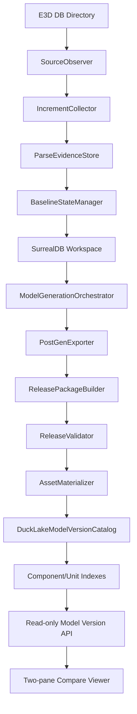
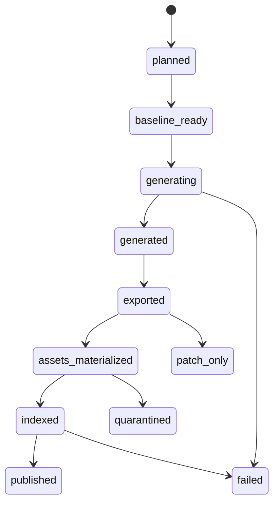

# E3D 增量模型版本架构与开发计划（Oracle MCP 收敛版）

日期：2026-06-20

范围：`D:\AVEVA\Projects\E3D2.1\AvevaMarineSample`，重点验证 DB `1112` 的历史 sesno 增量更新、模型增量生成和双界面对比。

Oracle MCP 证据：

- 会话：`e3d-incrementa-ducklake-architectu-core-2`
- Transcript：`C:\Users\dpc\.oracle\sessions\e3d-incrementa-ducklake-architectu-core-2\artifacts\transcript.md`
- 结论：DuckLake 可以进入本版本，但只能作为 release catalog、manifest、index、diff、impact、audit 层；不能作为三维模型生成 writer，不能存 GLB/Parquet 本体，也不能承担历史 baseline restore。

## 1. 最终结论

本版本推荐收敛到一条主路径：

```text
E3D 源 DB 文件
  -> source observation 与 sesno increment evidence
  -> verified baseline state
  -> isolated SurrealDB generation workspace
  -> model generation and export
  -> immutable release package
  -> DuckLake release catalog and indexes
  -> read-only model version API
  -> two-pane 3D comparison
```

用户可见的模型版本只能是不可变 `release_id`。`sesno` 只是源数据变化证据，DuckLake snapshot id 只是底层审计信息，mutable output 目录也不是版本。

当前 P0 缺口不是继续扩 DuckLake 表，而是实现 `BaselineStateManager`：在应用增量之前，必须证明 `from_sesno` 对应的完整 PE/ATT/tree/transform/AABB/CATA closure 生成状态存在。没有 baseline，就不能发布可信的历史模型 release。

## 2. 完整需求

系统必须做到：

1. 监控 E3D 数据库目录，按 dbnum 识别 DB 文件变化。
2. 读取并记录 DB 文件路径、文件 hash、latest sesno、稳定观察窗口。
3. 通过 `pdms-io` 或现有 `incremental-sesno` 采集指定 sesno 范围的增量变化。
4. 以 append-only 形式保存增量解析 evidence。
5. 对 `from_sesno` 构建或恢复完整 baseline state。
6. 在隔离 SurrealDB namespace/output root 中应用增量。
7. 在安全时只生成受影响模型范围；影响范围不确定时扩大到 owner、unit、dbnum 或 full release。
8. 导出 Parquet 和 release-local GLB。
9. 只发布通过验证的不可变 release package。
10. 用 DuckLake 注册 release metadata、asset manifest、component/unit index、diff 和 audit。
11. 查询 added/deleted/changed/unchanged component diff。
12. 在两个 3D pane 中对比两个 release，支持相机同步和选中 diff row 后定位组件。

系统必须禁止：

1. 把 `sesno` 当成模型版本。
2. 把空 namespace 上的 patch-only replay 当成完整模型 release。
3. 在 HTTP GET/read path 里自动写 DuckLake、建索引、修复资产。
4. runtime-scene fallback 到 current/global mesh root。
5. 把 GLB/Parquet payload body 写进 DuckLake。
6. 用 `model-writer-ducklake` 或 generation-time DuckLake 实验替代当前版本管理 truth。

## 3. Edge Cases

### 3.1 源 DB 观察

- 源目录不存在。
- DB 文件缺失、被占用、复制中、大小变化中。
- dbnum 与文件 header 不匹配。
- 同名 dbnum 来自错误项目或错误分支。
- 文件 hash 在 preflight 与 parse 之间变化。
- timestamp 变化但 latest sesno 不变。
- latest sesno 回退，说明文件被恢复、替换或回滚。
- physical historical DB 文件与依赖 DB 来自不同项目状态。
- 多个 watcher 同时观察同一 dbnum。
- 网络盘或移动盘导致瞬时 IO 失败。

### 3.2 Sesno 范围与增量解析

- `from_sesno >= to_sesno`。
- `to_sesno` 超过 source latest sesno。
- 指定 sesno 没有精确 pdms-io offset。
- nearest large/less sesno 导致实际范围不同于请求范围。
- sesno gap 需要以 warning/evidence 形式记录。
- session 只有 delete、只有 attribute、或没有模型影响。
- 同一 refno 在范围内多次变化。
- owner 删除、child 变化、ancestor 缺失同时发生。
- CATA/catalogue 变化没有直接 design instance 变化。
- 同一范围重复 replay 必须幂等。

### 3.3 Baseline State

- 没有 `from_sesno` 的 physical snapshot 或 restore package。
- current DB full parse 被误当成 historical baseline。
- baseline namespace 与 live namespace 相同。
- baseline output root 与 current mutable output 相同。
- baseline hydrate 只写 tree/meta，不写 PE/ATT/UDA/transform。
- baseline 混入 future session 数据。
- baseline manifest hash 与替换 DB 文件 hash 不一致。
- 依赖 dbnum 没纳入 baseline。
- baseline parse 后模型 rows 为 0，应判定为 patch-only 或 invalid。
- baseline 缺少机器可读验证 evidence。

### 3.4 模型增量生成

- changed refnos 未包含必要 ancestors/descendants。
- CATA closure、negative boolean、owner context 未纳入影响集。
- 删除组件在新版本无 geometry，这是 expected absence。
- 新增组件在旧版本无 geometry，这是 expected absence。
- component 存在但无可渲染 geometry，这是 no renderable geometry，不等于 expected absence。
- transform、AABB、unit membership 缺失。
- file-mode mesh 只落 GLB，缺少 generation attempt evidence。
- 生成进程崩溃后留下 partial Parquet/GLB。
- 增量影响范围不可信时，必须扩大生成范围而不是发布不完整模型。

### 3.5 Release Package 与资产

- 同一 `release_id` 对应不同 package hash。
- package staging copy 中断。
- manifest 引用了 release package root 之外的文件。
- GLB 缺失、不可读、0 字节或 stale。
- builtin primitive 被误报为 missing GLB。
- asset index 来自旧 package。
- release-local asset URL 指向 current/global mesh。
- zero-row visual package 被发布。
- release 视觉质量不足，应 quarantine 而不是正常 published。

### 3.6 DuckLake

- read-only API 打开 DuckLake 时 metadata 文件不存在。
- schema migration 缺失。
- 多 writer 同时写 catalog。
- parent release 缺失或属于其他 project/dbnum。
- component index 缺失却请求 diff。
- asset index 缺失却请求 runtime-scene。
- DuckDB/DuckLake extension 在部署环境不可用。
- GET 请求试图自动 migrate、index 或 repair，必须失败。

### 3.7 API 与 3D 对比

- 左右 pane 意外加载同一个 release。
- diff row 与 runtime-scene component identity 不一致。
- selected component 被 paging limit 排除，必须支持 `component_key` targeted load。
- same-release diff 非零。
- large DB1112 scene 一次性 JSON 过大。
- 相机同步因浮点漂移循环触发。
- GLB 请求成功但模型因 AABB/camera/material 问题不可见。

## 4. 架构分层



| 层 | 负责 | 不负责 |
| --- | --- | --- |
| SourceObserver | DB 文件身份、稳定 hash、latest sesno | 模型状态 |
| IncrementCollector | sesno 范围、changed refnos、解析 evidence | 完整历史状态 |
| ParseEvidenceStore | append-only parse facts | release truth |
| BaselineStateManager | 完整 baseline readiness contract | live current state |
| SurrealDB Workspace | 可丢弃的生成中间态 | 用户可见版本 |
| ModelGenerationOrchestrator | 执行生成、记录 attempt | release 注册 |
| ReleasePackageBuilder | 不可变 Parquet/GLB package | DuckLake SQL index |
| DuckLakeModelVersionCatalog | release metadata、index、diff、audit | GLB/Parquet payload body |
| Web API | 只读 release/diff/runtime-scene 查询 | repair 或隐式 mutation |

## 5. 版本对象定义

| 对象 | 标识 | 含义 |
| --- | --- | --- |
| Source file version | `project + dbnum + file_path + latest_sesno + sha256` | 源 DB 文件观察状态 |
| Increment version | `dbnum + from_sesno + to_sesno + parser_build + source_file_hash` | 解析到的变化证据 |
| Baseline state | `baseline_state_id` | baseline 时刻的完整可生成状态 |
| Generation job | `generation_job_id` | 一次隔离生成尝试与配置 |
| Release version | `release_id` | 用户可见不可变模型版本 |
| Asset version | `release_id + geo_hash + lod + sha256` | release-local mesh payload identity |
| Index version | `release_id + index_kind + rule_hash + indexer_build` | 派生查询索引 |

关键规则：

- 同一 `release_id + package_hash` 重复发布应幂等。
- 同一 `release_id` 但不同 `package_hash` 必须 hard error。
- 已发布 package 不允许原地修改。修复必须产生新 release 或显式 repair/quarantine release。
- DuckLake transaction id 只可作为审计信息，不作为业务版本。

## 6. DuckLake 边界

本版本使用 DuckLake 存：

- `model_releases`
- `model_release_edges`
- `model_release_files`
- `model_release_status_events`
- `model_release_mesh_assets`
- `component_snapshots`
- `delivery_unit_memberships`
- `unit_versions`
- `component_unit_impacts`
- diff/index run metadata
- schema migration audit

本版本不使用 DuckLake 做：

- generation-time model writer。
- SurrealDB workspace 替代。
- GLB body 存储。
- Parquet body 存储。
- baseline restore/hydrate。
- HTTP read path auto-repair。

理由：

- DuckLake 适合 SQL diff、manifest、component/unit index、release graph 和审计。
- 当前生成路径已经依赖 SurrealDB query provider、CATA resolution、transform/cache 和现有 export pipeline。
- 在 baseline 正确性未闭环前，把 generation writer 换到 DuckLake 会制造第二套 model truth。

## 7. 推荐文件结构

```text
src/version_management/
  baseline_state.rs              # BaselineStateManager 与 baseline contract
  source_observation.rs          # DB 文件稳定观察和 hash 检查
  parse_evidence.rs              # append-only 增量解析 evidence
  release_state_machine.rs       # planned -> published/quarantined 状态机
  release_package.rs             # 不可变 package 构建与校验
  ducklake_store.rs              # DuckLake writer/read-only catalog
  model_release.rs               # release publish/query orchestration
  history_replay_plan.rs         # 历史 sesno replay 计划
  history_replay_validation.rs   # patch-only/full-release 分类
  physical_baseline_snapshot.rs  # physical baseline provider

src/web_api/
  model_version_api.rs           # release/diff/runtime-scene read API 与 run trigger

output/<project>/model_versions/
  releases/<release_id>/         # 不可变 release package
  runs/<generation_job_id>/      # run logs/status/evidence
  physical_baselines/<id>/       # physical baseline snapshots
  metadata.ducklake              # DuckLake metadata catalog
  data/                          # DuckLake managed data files
```

保持独立：

```text
src/fast_model/gen_model/        # 生成引擎
src/fast_model/export_model/     # Parquet/GLB 导出
src/data_interface/              # pdms-io/session/db index
src/versioned_db/                # DB 解析与落库
```

`model-version-ducklake` 与 `model-writer-ducklake` 必须继续分离。

## 8. 核心流程

### 8.1 目录监控

1. 监听项目 DB 目录。
2. 按 dbnum debounce 文件事件。
3. 在 quiet window 内两次观察 size、mtime、latest sesno、SHA-256。
4. 稳定后生成 source observation。
5. 与上次 processed observation 比较。
6. latest sesno 增加时 enqueue incremental parse job。
7. latest sesno 回退或 hash 异常变化时标记 rollback/replacement，要求重新建立 baseline。

### 8.2 历史 replay

1. 选择 DB1112 的 `from_sesno -> to_sesno`。
2. 解析并验证 `from_sesno` baseline source。
3. 创建隔离 DbOption、SurrealDB namespace、output root。
4. parse baseline 并生成 baseline evidence。
5. 应用 sesno 增量。
6. 计算 conservative impact scope。
7. 生成模型并导出 Parquet/GLB。
8. 校验 release package。
9. materialize release-local mesh assets。
10. 写 DuckLake release metadata、asset index、component/unit index。
11. publish 或 quarantine。

### 8.3 增量生成影响集

影响集至少包含：

```text
changed_refnos
  + added_refnos
  + deleted_refnos
  + affected owners
  + visible ancestors
  + required descendants
  + CATA dependency closure
  + boolean/negative geometry dependencies
```

影响集不完整时扩大范围：

```text
component scope -> owner unit scope -> dbnum scope -> full release regeneration
```

## 9. Release 状态机

推荐状态：

```text
planned
baseline_ready
generating
generated
exported
assets_materialized
indexed
published
quarantined
patch_only
failed
```



规则：

- `published` 必须有完整 package validation 和 ready asset index。
- `quarantined` 可查询，但 UI 必须显示质量原因。
- `patch_only` 不能作为完整 visual release。
- `failed` 必须保留日志、source observation、baseline evidence 和 generation attempt。
- 状态变化必须 append-only 记录到 DuckLake status events。

## 10. CLI 合约

### 10.1 Source observation

```text
aios-database model-version observe-source
  --project AvevaMarineSample
  --site-root D:\AVEVA\Projects\E3D2.1\AvevaMarineSample
  --dbnum 1112
  --json
```

必须输出：dbnum、DB 文件路径、latest sesno、文件大小、SHA-256、稳定窗口结果、rollback/replacement 分类。

### 10.2 Baseline

```text
aios-database model-version prepare-physical-baseline-snapshot --json ...
aios-database model-version parse-baseline --json ...
aios-database model-version validate-baseline-state --json ...
```

必须输出：`baseline_state_id`、source hash、target sesno evidence、namespace、output root、dependency dbnums、row counts、validation flags。

### 10.3 Replay 与 publish

```text
aios-database model-version prepare-history-replay --json ...
aios-database incremental-sesno --generate-model ...
aios-database model-version validate-history-replay --json ...
aios-database model-version publish-history --json ...
aios-database model-version index-components --json ...
aios-database model-version index-assets --materialize --json ...
aios-database model-version diff --json ...
```

`publish-history` 必须拒绝：

- baseline evidence 缺失。
- patch-only empty baseline package。
- mesh asset index 缺失。
- GLB 缺失或不可读。
- source manifest 不一致。
- 同一 release id 对应不同 package hash。

## 11. HTTP API 合约

Read-only APIs：

```text
GET /api/model-version/releases
GET /api/model-version/releases/{release_id}
GET /api/model-version/releases/{release_id}/mesh-assets
GET /api/model-version/releases/{release_id}/runtime-scene
GET /api/model-version/diff
GET /api/model-version/component-impact
GET /model-version/compare
```

Mutation/run-trigger APIs：

```text
POST /api/model-version/runs/prepare-physical-snapshot
POST /api/model-version/runs/parse-baseline
POST /api/model-version/runs/generate-incremental
POST /api/model-version/releases/{release_id}/index-components
POST /api/model-version/releases/{release_id}/index-assets
```

Read-only invariants：

- 只能通过 `open_readonly` 打开 DuckLake。
- 缺 index 必须失败并提示依赖命令。
- 缺 release-local asset 必须失败。
- 不得 fallback 到 global/current mesh。
- 不得 migrate schema、创建 index 或 repair assets。

## 12. 错误处理

建议统一机器可读错误码：

| Code | 含义 | 用户动作 |
| --- | --- | --- |
| `source_unstable` | DB 文件观察窗口内变化 | 文件稳定后重试 |
| `sesno_out_of_range` | sesno 不在源 DB 中 | 选择有效范围 |
| `baseline_missing` | 缺少完整 baseline evidence | 准备 physical baseline 或 restore baseline release |
| `baseline_hash_mismatch` | baseline manifest 与 DB hash 不一致 | 重建 baseline snapshot |
| `patch_only_package` | package 不能代表完整 visual release | 先 hydrate baseline |
| `asset_index_missing` | runtime-scene 无法证明 release-local mesh | 运行 asset indexing |
| `mesh_asset_missing` | GLB 缺失或不可读 | repair 或 regenerate assets |
| `catalog_migration_required` | DuckLake schema 过旧 | 用 CLI writer path migrate |
| `read_path_mutation_forbidden` | GET path 试图 mutation | 修复 API 路径 |
| `release_conflict` | 同一 release id 对应不同 package hash | 换 release id 或修正 package |

CLI JSON 应包含：`ok`、`code`、`message`、`release_id`、`baseline_state_id`、`source_observation_id`、evidence paths、recommended next command。

## 13. 数据模型

最小 release record：

```text
release_id
project_name
dbnum
from_sesno
to_sesno
parent_release_id
baseline_state_id
baseline_state_manifest_path
baseline_state_manifest_hash
generation_job_id
source_manifest_path
source_manifest_hash
package_root
package_hash
asset_manifest_path
asset_manifest_hash
release_status
release_quality
release_quality_reason
created_at
tool_build
```

最小 component snapshot：

```text
release_id
component_key = <dbnum>:<refno_u64>
refno
noun
owner_key
unit_key
component_hash
aabb_hash
transform_hash
geometry_count
mesh_asset_count
renderable_status
hash_version
```

最小 asset record：

```text
release_id
geo_hash
lod_tag
relative_path
sha256
bytes
exists
glb_readable
builtin
materialized_at
```

最小 diff record：

```text
from_release_id
to_release_id
component_key
change_kind = added | deleted | changed | unchanged
old_component_hash
new_component_hash
old_aabb_hash
new_aabb_hash
old_renderable_status
new_renderable_status
```

## 14. 验证方案

禁止使用 `cargo test`。

### 14.1 CLI + JSON

用 `aios-database` 验证：

1. observe DB1112 source。
2. prepare physical baseline snapshot。
3. parse baseline 到隔离 namespace。
4. validate baseline state。
5. 运行历史 replay。
6. validate history replay package。
7. publish release。
8. index components、units、assets。
9. 查询 diff。

必须断言：

- 同一 `release_id + package_hash` 幂等。
- 同一 `release_id` 不同 package hash 失败。
- patch-only package 默认 publish 失败。
- missing asset index 让 runtime-scene 返回可执行错误。
- read-only list/diff 在 writer lock 存在时仍可读。

### 14.2 Web server + HTTP/browser

运行 `web_server` 后通过 HTTP/browser 验证：

1. `/api/version` 返回当前构建。
2. `/api/model-version/releases` 返回目标 releases。
3. runtime-scene 返回 release-local mesh URL。
4. diff 返回 expected added/deleted/changed counts。
5. compare page 加载两个不同 release iframe。
6. changed row 在两边都有 geometry。
7. added row 旧 pane 显示 expected absence，新 pane 显示 geometry。
8. deleted row 旧 pane 显示 geometry，新 pane 显示 expected absence。
9. camera sync 双向生效。
10. GET/read path 不写 DuckLake。

### 14.3 DB1112 当前验收锚点

当前已验证 release：

```text
codex-ams1112-physical-791-quarantine
codex-ams1112-physical-897-quarantine
```

当前已验证 diff：

```text
added=5059
deleted=2525
changed=43
unchanged=23549
```

验收截图或 browser assertion 至少覆盖：

- changed component 两边可见。
- added component 旧版本 expected absence，新版本可见。
- deleted component 旧版本可见，新版本 expected absence。
- camera sync。
- selected components 的 release-local GLB failed count 为 0。

## 15. 性能与可维护性

性能原则：

- 文件监控 debounce，并按 project/dbnum 进入 single-writer queue。
- 大 DB 文件 hash 只在 quiet window 后计算。
- parse evidence append-only，后续单独 compact。
- component snapshots 批量生成。
- runtime-scene 必须支持 paging 和 targeted `component_key`。
- DuckLake 用于 SQL diff 和聚合，不用于 viewer per-frame 数据。
- GLB assets 按 release materialize 一次并用 sha256 索引。

可维护性原则：

- 生成引擎保持 DuckLake-free。
- `model-version-ducklake` 与 `model-writer-ducklake` 分 feature。
- read-only API 结构上不能写。
- publish 每一步都可恢复、可审计、有 evidence。
- release status 用状态机，不用零散 boolean。
- manifest 使用可读 JSON 和可校验 hash。

## 16. 开发计划

### P0：让历史 release 可信

1. 新增 `src/version_management/baseline_state.rs`。
2. 定义 `BaselineStateManager` 和 `BaselineStateManifest`。
3. 在 `publish-history` 中强制 baseline evidence。
4. 新增 `release_state_machine.rs`，把 publish 改为状态机。
5. 默认拒绝 patch-only package。
6. DuckLake writer path 记录 status events。
7. runtime-scene 强制 release-local asset index。
8. 用 DB1112 的 791/897 release 完成 CLI JSON 与 browser compare 验证。

### P1：模型增量生成影响集

1. 实现 conservative impact resolver。
2. 纳入 owner ancestors、descendants、visible roots、CATA closure、boolean dependencies。
3. 增加 scope escalation。
4. 持久化 generation attempts、skipped/no-renderable reasons。
5. 在 runtime-scene 和 compare status 中展示 component-to-asset lineage。

### P2：目录监控与自动化

1. 实现 DB directory watcher。
2. 增加 stable observation window。
3. 增加 project/dbnum single-writer queue。
4. 持久化 source observations 和 parse evidence。
5. 增加 rollback/replacement 分类。
6. 暴露 monitor status API。

### P3：大场景 viewer 加固

1. 增加 bbox/tiled runtime-scene query。
2. 增加 diff table pagination 和 component search。
3. 明确 no-renderable 与 expected-absence 视觉状态。
4. 增加 selected component asset lineage 面板。
5. 增加 same-release self-diff sanity UI。

## 17. 拒绝方案

| 方案 | 决策 | 原因 |
| --- | --- | --- |
| DuckLake 作为 generation writer | 拒绝 | baseline 正确性未闭环前会制造第二套 model truth |
| DuckLake 存 GLB/Parquet body | 拒绝 | 大 payload 更适合不可变文件 package + hash |
| sesno 等同模型版本 | 拒绝 | sesno 只是 source provenance |
| 空 namespace replay 直接发布 | 拒绝 | 只会得到 patch-only 或空 visual release |
| GET runtime-scene 自动 index assets | 拒绝 | read path 必须无副作用 |
| 历史 release fallback current/global mesh | 拒绝 | 会让视觉对比失真 |
| 永久 full dbnum regen | 暂缓 | 可作为安全 fallback，但不是最终性能目标 |

## 18. Review 总结

本版本最佳方案是保留已经验证的 release package + DuckLake catalog/index 方向，但把 baseline state 与 release lifecycle 提升为一等概念。

优先级应是：

```text
BaselineStateManager
  + release state machine
  + strict publish validation
  + release-local asset lineage
```

这条路径先保证模型版本可信，再把目录监控和更细粒度增量生成叠上去。DuckLake 在这个设计里是非常适合的，但它是索引与审计层，不是模型 payload 或生成层。
