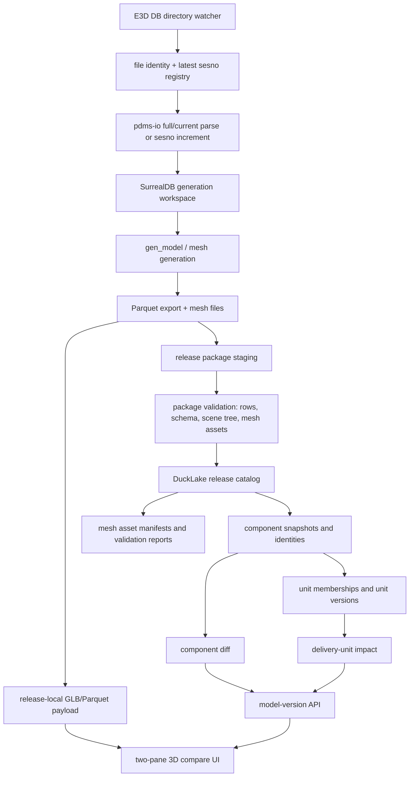

# E3D Model Versioning, Baseline, Mesh Asset Architecture And Development Plan

Date: 2026-06-20

## Purpose

This document consolidates the Oracle MCP reviews, the DB1112 physical baseline
validation, and the current implementation state into one architecture and
development plan.

Companion Chinese execution plan:

```text
docs/plans/2026-06-20-e3d-incremental-model-version-ducklake-oracle-plan.md
```

The target product behavior is:

- monitor an AVEVA E3D/PDMS database directory;
- parse and persist incremental data by explicit `sesno` range;
- generate model data incrementally when a complete baseline state exists;
- publish immutable model releases;
- compare two releases in two synchronized 3D panes.

The current concrete validation site is:

```text
D:\AVEVA\Projects\E3D2.1\AvevaMarineSample
DB1112
physical baseline source: D:\AVEVA\Projects\E3D2.1\AvevaMarineSample\ams1112_0001 copy
physical baseline latest sesno: 791
```

## Oracle MCP Summary

Completed Oracle MCP sessions used for this decision:

- `e3d-model-version-ducklake-review`
- `e3d-ducklake-version-plan`
- `e3d-model-version-architectu-3`

The follow-up Oracle MCP session attempted for the latest DB1112 mesh evidence
was blocked by a Cloudflare challenge in the browser profile. The plan below
therefore uses the three completed Oracle sessions plus the new local CLI
evidence from 2026-06-20.

Oracle's consistent recommendation:

- Keep SurrealDB as the mutable generation writer and query workspace.
- Treat Parquet plus GLB files as the immutable model release payload.
- Use DuckLake for release catalog, file and asset manifests, component/unit
  indexes, diff/impact indexes, and audit evidence.
- Do not use DuckLake as the online model-generation writer.
- Do not store large Parquet/GLB asset bodies inside DuckLake.
- The missing production piece is not DuckLake. It is a complete and validated
  baseline hydrate/restore before applying historical increments.

## Current Evidence

The DB1112 physical baseline workflow can now produce a non-empty model package:

```text
namespace: codex_baseline_ams1112_791
parquet dir: target\codex-physical-baseline\ams1112-791\validation-export-fixed\1112
instances: 47698
geo_instances: 31292
transforms: 30495
aabb: 28372
tubings: 56
ptsets: 6999
```

Two backend generation issues were fixed before this evidence was produced:

- `inst_relate` and `inst_relate_aabb` are now replace-on-write by stable
  relation id, preventing SurrealDB relation `in/out` conflicts.
- Plain CLI `--regen-model --export-parquet-after-gen` now calls the shared
  post-generation Parquet export helper instead of falling through into app
  startup behavior.

The first fixed export was not publishable as a visual release because its
manifest reports:

```text
missing_geo_hashes: 24
missing_owner_refnos: 42
mesh_assets_complete: false
classification: missing_mesh_assets
ready_for_publish: false
```

`model-version validate-history-replay --json` now reports that classification,
and `publish-history` refuses the package before release registration.

That negative gate has since been hardened with targeted repair and explicit
quarantine. See "Implementation Update - 2026-06-20" for the published
quarantined visual baseline release.

## Version Vocabulary

Do not use one overloaded "version" concept. The system needs separate version
objects:

| Version object | Meaning | Truth source |
| --- | --- | --- |
| Parse increment version | `dbnum + source_db_file + from_sesno + to_sesno + parser config/build` | Increment collector JSON and persisted PE/ATT/UDA/delete rows |
| Baseline state version | Full PE/ATT/tree/transform/generation prerequisite state at one target session | Isolated SurrealDB namespace or future history provider |
| Generated model state | `inst_info`, `inst_geo`, relations, transforms, AABB, mesh generation outcomes | SurrealDB plus mesh state sidecar/metadata |
| Model release version | User-visible immutable release identified by `release_id` | Release package plus DuckLake catalog |
| Asset version | Content-addressed Parquet/GLB/material files | Release package filesystem/object store |
| Diff/index version | Derived component/unit/impact indexes bound to release ids and hash/rule versions | DuckLake |

The user-facing model version is the application `release_id`, not a DuckLake
snapshot id and not a raw `sesno`.

## Target Architecture



Key boundaries:

- SurrealDB is allowed to be mutable. Releases are not.
- Parquet and GLB files are the payload the viewer must be able to replay.
- DuckLake stores metadata, index rows, validation evidence, and diff results.
- Read APIs must not auto-index or mutate DuckLake.
- Historical replay must use isolated config, namespace, output root, and
  diagnostics paths.

## Mesh Missing Policy

A non-empty Parquet package is not sufficient for a visual release. If
`geo_instances.parquet` references a non-builtin `geo_hash`, the release must
either provide the matching GLB asset or explicitly classify the geometry as
non-visual/degraded.

Default policy:

- `missing_mesh_assets` is a hard publish blocker.
- `publish-history` must refuse before DuckLake release registration.
- Two-pane final acceptance must use publishable releases with no unresolved
  non-builtin missing meshes.

Allowed classifications:

| Classification | Publish default | Meaning |
| --- | --- | --- |
| `present` | allowed | GLB exists, hash/size recorded |
| `builtin` | allowed | Viewer does not require an external GLB |
| `generated_but_unindexed` | blocked until indexed | File exists but was not in manifest/index |
| `generation_failed` | blocked | Generator failed and recorded an error |
| `bad_geometry` | blocked or explicitly degraded | Geometry is invalid and must not be silently hidden |
| `non_visual` | allowed only by explicit policy | Domain-approved row that is not rendered |
| `degraded_allowed` | allowed only with `status=degraded` | Diagnostic release, not final visual acceptance |
| `missing` | blocked | Referenced hash has no asset or classification |

## Mesh State Boundary

`run_regen_model` currently uses file-mode mesh state. That is acceptable for
large mesh payloads, but it must not mean "no status is persisted".

Recommended boundary:

- GLB bodies stay on disk or in object storage.
- SurrealDB or a generation sidecar stores mesh attempt outcomes:
  `geo_hash`, owner refs, primitive kind, unit flag, status, error kind,
  output path, bytes, hash, generator build, and config hash.
- In file mode, skip heavy mesh body persistence, not status persistence.
- On success, write enough metadata for export validation and release asset
  materialization.
- On failure, write `bad=true` or an equivalent `mesh_generation_attempt` row
  with a reason. The exporter must not see an apparently valid semantic
  `inst_geo` row with neither a GLB nor a failure classification.
- Writes should be batched and limited to changed or missing `geo_hashes` to
  avoid full-site performance regressions.

## DuckLake Schema Additions

DuckLake should store mesh evidence, not mesh binaries.

Add or extend the following logical tables:

```sql
model_version.model_release_asset_validations
  release_id
  project
  dbnum
  package_hash
  check_kind                 -- mesh_assets, parquet_schema, row_counts
  status                     -- pass, fail, degraded
  missing_geo_hashes
  missing_owner_refnos
  report_path
  evidence_json
  validated_at

model_version.model_release_mesh_assets
  release_id
  project
  dbnum
  lod_tag
  geo_hash
  asset_status               -- present, builtin, missing, failed, non_visual
  required_for_visual
  builtin
  mesh_relative_path
  mesh_url
  bytes
  sha256
  owner_refnos_json
  classification_reason
  generation_attempt_id
  indexed_at

model_version.mesh_generation_attempts
  attempt_id
  release_id                 -- nullable before publish
  workspace_id               -- namespace/snapshot/job id
  project
  dbnum
  geo_hash
  owner_refno
  primitive_kind
  unit_flag
  mesh_state_source          -- file, surreal, hybrid
  status                     -- success, failed, skipped, classified
  error_kind
  error_message
  output_path
  output_sha256
  output_bytes
  generator_build
  generator_config_hash
  started_at
  completed_at
```

These tables support audit, repair, and UI warnings without forcing DuckLake to
own GLB bodies.

## Command Flow

### Baseline Release

```text
prepare-physical-baseline-snapshot
  -> isolated DbOption and project snapshot
baseline parse/full sync
  -> PE/ATT/tree/transform state in isolated namespace
regen-model
  -> generated inst/model/mesh state
export parquet
  -> immutable candidate package
validate-history-replay
  -> rows, path safety, scene tree, mesh assets
repair-missing-meshes or classify
  -> rerun validation
publish-history
  -> materialize release-local assets, register release, index assets/components
```

### Child Release

Preferred near-term route for DB1112:

```text
restore or reuse validated 791 isolated baseline
incremental-sesno --file <active 897 file> --from-sesno 791 --to-sesno 897 --generate-model
export parquet
validate mesh completeness
publish child release with parent_release_id=<791 release>
index components/assets/units
compare releases in CLI/API/UI
```

If the 791 to 897 range is too large or incompatible, create a second full
physical/latest snapshot and compare two full release packages first. That
proves two-pane visual comparison while the true incremental child-release
path is hardened.

## Edge Cases

Baseline and source selection:

- source file header dbnum does not match requested dbnum;
- selected physical file is from a different branch/project lineage;
- requested target sesno is not present;
- target sesno is present but full visible-state enumeration is unsupported;
- current-file full sync is mistaken for historical target-sesno hydrate;
- dependency DBs such as catalogue/system DBs are omitted;
- parse writes tree/meta but not PE/ATT state;
- original AVEVA project is accidentally modified instead of snapshot output.

Incremental update:

- `from_sesno >= to_sesno`;
- `to_sesno` exceeds source latest sesno;
- no model-affecting changes;
- delete-only changes;
- unknown nouns or aliases;
- owner roots missing because baseline was incomplete;
- applying increments to the wrong baseline session.

Generation and mesh:

- relation id conflicts in SurrealDB;
- missing `pe_transform`;
- `inst_geo` row exists but no GLB was generated;
- mesh file generated under a different LOD/name;
- builtin primitive incorrectly counted as missing GLB;
- degenerate geometry not marked bad;
- stale global mesh cache hides missing release-local assets;
- file-mode mesh state skips failure/status persistence;
- repair retries generate a different hash without updating manifests.

Release and DuckLake:

- same release id registered with different package hash;
- parent release missing or different project/dbnum;
- partial package copy after interruption;
- asset materialization succeeds after release catalog registration fails;
- read API auto-indexes or mutates DuckLake;
- DuckLake extension unavailable offline;
- local metadata lock contention;
- multi-process publish without a single-writer queue;
- Windows paths with spaces, backticks, and mixed separators;
- project/release path traversal in HTTP routes.

Viewer:

- runtime scene falls back to current global meshes for historical releases;
- one pane loads current output while the other loads immutable release output;
- missing mesh silently disappears with no warning;
- large DB1112/full-site scene exceeds one-shot JSON limits;
- diff rows do not match rendered component identity;
- same-release diff is not empty.

## Development Plan

### P0: Completed Safety Gates

Status:

- Oracle-backed architecture boundary is documented.
- Historical empty-namespace replay is classified as patch-only and rejected.
- Current mutable output path is rejected by historical publish validation.
- DB1112 physical 791 baseline can generate non-empty Parquet.
- DB1112 physical 791 baseline is now classified as `missing_mesh_assets` and
  blocked from publish before registration.

### P1: Mesh State And Repair

Deliverables:

- Add mesh generation attempt evidence for file-mode generation.
- Ensure success/failure status is persisted even when mesh bodies are file-only.
- Add a targeted repair command for missing mesh hashes from
  `missing_mesh_report_<dbnum>.json`.
- Re-export or revalidate DB1112 791 until missing non-builtin meshes are zero
  or explicitly classified.

Likely files:

- `src/fast_model/gen_model/*mesh*`
- `src/fast_model/gen_model/pdms_inst.rs`
- `src/fast_model/export_model/export_dbnum_instances_parquet.rs`
- `src/version_management/history_replay_validation.rs`
- `src/version_management/cli.rs`

Validation:

```powershell
target\debug\aios-database.exe -c target\codex-physical-baseline\ams1112-791\DbOption-physical-baseline model-version validate-history-replay --json ...
```

Expected final P1 result:

```text
classification=complete_visual_release_candidate
ready_for_publish=true
missing_mesh_geo_hashes=0
mesh_assets_complete=true
```

### P2: Atomic Publish And DuckLake Asset Evidence

Deliverables:

- Add publish state: `staged`, `validating`, `assets_materialized`,
  `indexed`, `published`, `failed`, `degraded`.
- Record asset validation and mesh generation evidence in DuckLake.
- Register a release as `published` only after Parquet and mesh validation pass.
- Keep read APIs filtered to `published` by default.
- Allow degraded releases only with an explicit flag and visible status.

Likely files:

- `src/version_management/types.rs`
- `src/version_management/model_release.rs`
- `src/version_management/ducklake_store.rs`
- `src/version_management/release_package.rs`
- `src/web_api/model_version_api.rs`

### P3: Publish DB1112 791 Baseline

Deliverables:

- Publish the DB1112 791 baseline as an immutable release after P1/P2 gates.
- Materialize release-local GLBs.
- Index assets, components, and units.
- Verify same-release diff returns zero.

Validation:

```powershell
aios-database model-version publish-history --release-id ams1112-physical-791 ...
aios-database model-version index-assets --release-id ams1112-physical-791 --materialize --json
aios-database model-version index --release-id ams1112-physical-791 --json
aios-database model-version index-units --release-id ams1112-physical-791 --json
aios-database model-version diff --from-release-id ams1112-physical-791 --to-release-id ams1112-physical-791 --json
```

### P4: Build A Second Real Release

Preferred path:

- Apply `791 -> 897` or a smaller verified range from the active DB1112 file to
  the validated 791 baseline namespace.
- Generate/export/validate/publish the child release.

Fallback visual proof:

- Generate a second full/latest physical snapshot release and compare it with
  791. Mark this as full-snapshot comparison, not incremental proof.

Acceptance:

- both releases are `published`;
- both have release-local assets;
- `component diff` is deterministic;
- same-release diff is zero;
- release pair diff is non-empty or explicitly classified as no-op.

### P5: Two-Pane 3D Compare

Deliverables:

- `GET /api/model-version/releases`
- `GET /api/model-version/releases/{release_id}/runtime-scene`
- `GET /api/model-version/diff`
- `GET /api/model-version/unit-diff`
- `GET /api/model-version/component-impact`
- `GET /model-version/compare?from=<old>&to=<new>`

Acceptance:

- both panes load release-local model assets;
- camera and selection are synchronized;
- diff table rows map to rendered component identities;
- missing/degraded assets are surfaced as warnings, not silent omissions;
- web_server validation is done by running the service and HTTP/browser checks.

### P6: Production Hardening

Deliverables:

- target-sesno full-state hydrate provider, or a documented unsupported
  contract for each source type;
- owner-chain delivery-unit resolver;
- persisted `component_unit_impacts`;
- single-writer publish/index queue for local DuckLake;
- PostgreSQL DuckLake catalog option for multi-process/multi-host writes;
- vendored/preinstalled DuckLake extension for offline deployments;
- tiled/paged runtime-scene API for large sites;
- diagnostics/perf output routed through isolated output roots.

## Validation Rules

Repository constraints:

- Do not run `cargo test`.
- Validate `aios-database` through CLI and JSON output.
- Validate `web_server` through a running service and HTTP/POST.

Required release validation:

- source DB file exists and header matches requested dbnum;
- baseline source evidence is explicit: physical snapshot, restored baseline, or
  supported target-sesno provider;
- required Parquet files exist and row counts match manifest evidence;
- `instances > 0` and `geo_instances > 0` for visual releases;
- scene tree evidence is present when the workflow requires it;
- all non-builtin mesh assets are present or explicitly classified;
- package path differs from current mutable output path;
- release-local mesh URLs are preferred for runtime scenes;
- duplicate release id with different package hash fails;
- failed publish leaves no `published` release.

## Performance And Maintainability

- Keep generation and release publishing as separate jobs with progress logs.
- Avoid re-exporting the full site when dbnum hints are available.
- Batch mesh attempt status writes and limit them to changed/missing hashes.
- Use content hashes for asset dedupe; later replace copies with hardlinks,
  reflinks, or object-store references.
- Keep DuckLake writes explicit and serialized; read APIs should use read-only
  paths and return dependency errors when indexes are absent.
- Split very large `ducklake_store.rs` responsibilities over time into release,
  asset, component, unit, and impact modules.
- Treat `component_key=<dbnum>:<refno_u64>` and direct-owner unit membership as
  MVP rules. Add owner-chain and lineage evidence before production impact
  claims.

## Final Decision

DuckLake should be used in this version, but only for the release/catalog/index
layer. The model data version itself is an immutable package plus explicit
release metadata and validation evidence. The DB1112 791 baseline proves the
full-state physical baseline path can generate a substantial package; it also
proves that mesh completeness must be a first-class release gate.

The next implementation priority is therefore:

```text
fix or classify missing meshes
  -> publish 791 baseline safely
  -> generate/publish second real release
  -> compare both release packages in the two-pane viewer
```

## Implementation Update - 2026-06-20

Oracle MCP evidence used:

- `e3d-model-version-architectu-3`
- `e3d-ducklake-version-plan`

Both reviews agree with the local evidence: DuckLake is the right catalog/index
layer for this version, but not the model generation writer and not the GLB
asset body store. The model version is an immutable Parquet/GLB package plus
explicit release metadata, validation evidence, and derived DuckLake indexes.

### Missing Mesh Repair And Quarantine

New code paths:

- `src/version_management/missing_mesh_repair.rs`
- `model-version repair-missing-meshes`
- `gen_inst_meshes_by_geo_ids_with_state(..., persist_state=true)`
- extended `manifest.json.mesh_validation` evidence:
  - `raw_missing_geo_hashes`
  - `render_missing_geo_hashes`
  - `quarantined_geo_hashes`
  - dropped row counts
- new validation classification:
  `quarantined_visual_release_candidate`

Validation evidence for DB `1112`, physical baseline `791`:

```text
repair-missing-meshes --dry-run --limit 3:
  requested_hashes=24
  dry_run_eligible=3

repair-missing-meshes --limit 3:
  attempted_hashes=3
  generated_hashes=0
  still_missing_hashes=3
  status=generation_failed_bad

repair-missing-meshes all:
  requested_hashes=24
  bad_skipped=3
  attempted_hashes=21
  generated_hashes=2
  still_missing_hashes=22
```

The remaining `22` hashes are not silently accepted as normal complete meshes.
They are CSG/profile failures marked `inst_geo.bad=true`. For visual release
testing, the export can explicitly quarantine missing GLB rows with
`AIOS_PARQUET_DROP_MISSING_MESH_ROWS=1`. The manifest records both the raw
generation gap and the renderable package state.

Quarantined export evidence:

```text
output:
  target\codex-physical-baseline\ams1112-791\validation-export-repaired-quarantine\1112

rows:
  instances=29545
  geo_instances=31252
  transforms=30495
  aabb=28372
  tubings=56
  ptsets=6897

mesh_validation:
  policy=quarantine_missing_mesh_rows
  raw_missing_geo_hashes=22
  raw_missing_owner_refnos=40
  render_missing_geo_hashes=0
  render_missing_owner_refnos=0
  quarantined_geo_hashes=22
  quarantined_owner_refnos=40
```

`validate-history-replay --json` now returns:

```text
classification=quarantined_visual_release_candidate
ready_for_publish=true
mesh_assets_complete=true
```

This classification means the package is suitable for a visual comparison
baseline, not that the CSG failures are fixed. The raw missing evidence remains
part of the package manifest and must be reviewed before production acceptance.

### Published Test Release

The quarantined baseline was published as:

```text
release_id=codex-ams1112-physical-791-quarantine
project=AvevaMarineSample
dbnum=1112
package_hash=2526d5f18fb1346672383ce7612d4784b2db04d40c3cbb4bb97c5ac685193ee3
component_count=29545
mesh_asset_index:
  geo_hash_count=1192
  present_count=1192
  missing_count=0
  builtin_count=3
```

Same-release diff validation:

```text
added=0
deleted=0
changed=0
unchanged=29545
```

This release proves the backend can publish a self-contained, release-local,
DuckLake-indexed visual model package from the DB `1112` physical baseline.

### Remaining Version Gap

`model-version inspect-history-baseline` for target sessions `790` and `791`
against `D:\AVEVA\Projects\E3D2.1\AvevaMarineSample\ams1112_0001 copy`
resolves exact sessions, but reports:

```text
visible_refno_count=5
index_error_count=1
parse_error_count=2
full_state_enumeration_supported=false
```

Therefore the current pdms-io target-sesno inspection path is not yet a full
state hydrate provider. The next development slice must implement or fix a
proven target-sesno full-state hydrate path before claiming two true
session-derived releases. A second release produced by copying/mutating the
current baseline would be useful only as a UI fixture, not as incremental
correctness evidence.

## Oracle MCP Follow-Up Decision - 2026-06-20

Oracle MCP sessions re-read for this iteration:

- `e3d-model-version-architectu-3`
- `e3d-ducklake-version-plan`

The combined recommendation is the implementation baseline for the next phase:

1. Keep DuckLake in this version, but only as the release catalog, index, diff,
   asset-manifest, and audit layer.
2. Keep Parquet and release-local GLB files as the immutable payload truth.
3. Keep SurrealDB as the mutable model-generation workspace until a proven
   read-only historical provider exists.
4. Treat `release_id` as the user-facing version id. A `sesno` range is source
   evidence, not a model version by itself.
5. Do not claim a session-derived visual release unless the baseline state at
   `from_sesno` is complete and validated before the increment is applied.
6. Add a publish state machine before production use:
   `staged -> validating -> assets_materialized -> indexed -> published`,
   with `failed` and `degraded` as explicit non-default states.
7. Keep read APIs mutation-free. Missing indexes should return dependency
   errors and point to explicit CLI/POST indexing actions.

The best near-term architecture is therefore not a direct parser-to-DuckLake
writer. The safest route is:

```text
isolated baseline hydrate or physical source snapshot
  -> SurrealDB generation workspace
  -> model generation/export
  -> immutable Parquet/GLB package
  -> validation gate
  -> DuckLake catalog/index publish
  -> HTTP/runtime-scene/two-pane compare
```

Direct parser-to-version can be a later optimization only after component
identity, owner-chain unit membership, and target-sesno full-state hydration are
proven.

## Second Release Exploration - 2026-06-20

The DB1112 active physical file resolves latest session `897`:

```text
D:\AVEVA\Projects\E3D2.1\AvevaMarineSample\ams000\ams1112_0001
```

A physical snapshot was created under:

```text
target\codex-physical-baseline\ams1112-897
namespace: codex_baseline_ams1112_897
file_count=448
hardlinked_count=448
copied_count=0
original_project_not_modified=true
```

Full parsing/generation of the 897 snapshot was started with the isolated
DbOption, but did not complete within the practical validation window. The
process was terminated after the log remained near the early file-read stage
and CPU time continued accumulating without actionable progress evidence.

Decision:

- The 897 full physical snapshot is a valid source candidate.
- The current full parse path still needs bounded job progress, timeout,
  checkpoint, and resume diagnostics before it can be used as an unattended
  release-generation mechanism.
- This attempt does not produce a second full visual release.

As a fallback chain validation, the existing current DB1112 output package was
registered into the same DuckLake catalog as a deliberately labeled partial
release:

```text
release_id=codex-ams1112-current-897-partial
derivation_type=current-output-snapshot-partial
instances=106
geo_instances=163
transforms=131
aabb=105
ptsets=237
mesh_asset_index:
  geo_hash_count=6
  present_count=6
  missing_count=0
  builtin_count=1
package_hash=2528ac85a3bdb6093bcaab9c894f64a63234c6c17f23ca219e62b6dc0185f81d
```

The shared catalog now contains:

```text
codex-ams1112-physical-791-quarantine
codex-ams1112-current-897-partial
```

Cross-release diff summary:

```text
from=codex-ams1112-physical-791-quarantine
to=codex-ams1112-current-897-partial
added=106
deleted=29545
changed=0
unchanged=0
total_old=29545
total_new=106
```

This diff proves catalog lineage, release package registration, asset indexing,
and diff query mechanics across two releases. It is intentionally not treated
as meaningful engineering model delta evidence because the target release is a
partial current output package with only 106 instances.

## Revised Development Plan

### P0: Baseline And Catalog Truth

Completed or validated:

- DB1112 791 physical baseline can generate a large non-empty package.
- Missing mesh assets are now a hard gate unless explicitly quarantined.
- The quarantined 791 visual baseline publishes with release-local assets and
  zero missing mesh dependencies.
- DuckLake can compare two cataloged DB1112 releases in the shared catalog.

Remaining:

- Implement a true target-sesno full-state hydrate provider, or document the
  unsupported contract per source type.
- Add bounded progress and timeout diagnostics for full physical snapshot parse
  and generation.

### P1: Publish Pipeline State Machine

Implement production publish states before calling a release final:

```text
staged
validating
assets_materialized
indexed
published
failed
degraded
```

Rules:

- a release is visible to normal read APIs only in `published` state;
- `degraded` is visible only when explicitly requested;
- same `release_id` plus same package hash is idempotent;
- same `release_id` plus different package hash is a hard error;
- asset materialization and manifest validation must finish before
  `published`;
- failure after staging must leave recoverable evidence.

### P2: True Second Release

Preferred:

```text
hydrate/restore DB1112 baseline at from_sesno
  -> apply real session range with incremental-sesno --generate-model
  -> export and validate non-empty package
  -> publish as child release
```

Acceptable interim:

```text
complete 897 physical snapshot parse/generate/export
  -> publish as full-snapshot release
  -> compare with 791 quarantine baseline
```

Not acceptable as final proof:

- the current `codex-ams1112-current-897-partial` package;
- an empty-namespace patch replay;
- any package that falls back to current global meshes for historical release
  rendering.

### P3: HTTP And Two-Pane Validation

Run `web_server` with a config that points at the shared release catalog and
validate through HTTP/browser, not tests:

```text
GET /api/model-version/releases
GET /api/model-version/releases/{release_id}/runtime-scene
GET /api/model-version/diff?from_release_id=<old>&to_release_id=<new>
GET /model-version/compare?from=<old>&to=<new>
```

Acceptance:

- both panes load release-local assets;
- both runtime scenes report non-zero geometry/component counts;
- same-release diff is empty;
- cross-release diff counts match CLI;
- missing/degraded assets are visible warnings, not silent omissions.

### P4: Production Hardening

- owner-chain delivery-unit resolver;
- component lineage for delete/recreate and moved components;
- canonical component hash serializer and hash-version metadata;
- offline DuckLake extension deployment;
- single-writer publish/index queue;
- PostgreSQL DuckLake catalog option for multi-host deployments;
- tiled or paged runtime-scene API for large DB1112/full-site scenes.

## Oracle MCP Current Synthesis - 2026-06-20

Oracle MCP was used to re-open the completed GPT-5.5 Pro browser sessions:

- `e3d-model-version-architectu-3`
- `e3d-ducklake-version-plan`
- `e3d-model-version-ducklake-review`

An additional focused `mcp__oracle.consult` dry run was prepared against the
current files and resolved an 11-file bundle of about 109k tokens. A new live
browser consult was not started because the three completed Oracle sessions
already converge on the same architecture decision and avoid another long
duplicated review.

Consolidated decision:

- Keep DuckLake as the release catalog, manifest, component snapshot, unit
  index, diff/impact, and audit query layer.
- Do not use DuckLake as the model generation writer.
- Do not put GLB or Parquet asset bodies inside DuckLake; store immutable
  package files on disk/object storage and put only manifests, hashes, and
  indexes in DuckLake.
- Treat a `sesno` range as source/change evidence. It becomes a model version
  only after a full baseline state exists and a release package is generated,
  validated, materialized, indexed, and published.
- Prioritize baseline hydrate/restore over additional catalog SQL. Without a
  complete DB1112 state at `from_sesno`, an incremental replay can parse
  changes but still generate zero model rows.

Recommended version vocabulary:

```text
parse version
  dbnum + source file identity + from_sesno + to_sesno + parser build

baseline state version
  complete PE/ATT/UDA/tree/transform state at target_sesno in an isolated
  namespace or future read-only history provider

model release version
  release_id + immutable Parquet/GLB package + validation evidence + parent
  lineage + generation config/tool hashes

asset version
  release-local GLB/manifest entry with geo_hash, lod_tag, sha256, size,
  source path, and missing/degraded status

diff/index version
  component/unit snapshots bound to release_id pair, hash_version,
  rule_set_hash, and indexer build
```

Preferred production flow:

```text
monitor E3D db directory
  -> detect dbnum/file/session changes
  -> persist parse/increment evidence
  -> hydrate or restore complete baseline state at from_sesno
  -> apply from_sesno+1..to_sesno increment in isolated namespace/output
  -> generate model and export Parquet/GLB package
  -> validate package rows, scene tree, source evidence, and assets
  -> materialize release-local assets
  -> register staged release in DuckLake
  -> build component and delivery-unit indexes
  -> publish release atomically
  -> serve read-only release APIs and two-pane comparison
```

Hard publish blockers:

- replay namespace equals current namespace;
- replay output equals current mutable output;
- no complete baseline evidence at `from_sesno`;
- manifest is missing, corrupt, or row counts disagree with Parquet metadata;
- `instances` or `geo_instances` rows are zero unless the release is explicitly
  classified as non-visual/patch-only and not published to normal viewer APIs;
- any non-builtin `geo_hash` has no release-local or verified external GLB;
- release id already exists with a different package hash;
- parent release is missing or belongs to a different project/dbnum;
- read API needs to auto-index or mutate DuckLake to answer the request.

## Current Web Validation Slice - 2026-06-20

Code changes made during this validation slice:

- `src/web_server/mod.rs`: scene-tree initialization on startup is now a
  background task. A full tree build can be slow; it must not block the HTTP
  listener and model-version read APIs.
- `src/web_api/model_version_api.rs`: release viewer now exposes its xeokit
  viewer for browser validation, refits after GLB load using xeokit scene AABB,
  and attempts high-contrast model emphasis at the loaded model level.

Validation configuration:

```text
config=target\codex-physical-baseline\ams1112-791\DbOption-web-validate.toml
port=3910
auto_start_surreal=false
ducklake metadata=target\codex-physical-baseline\ams1112-791\output\AvevaMarineSample\model_versions\metadata.ducklake
ducklake data=target\codex-physical-baseline\ams1112-791\output\AvevaMarineSample\model_versions\data
```

Build command:

```powershell
$env:CARGO_TARGET_DIR='target\codex-web-validate-build'
cargo build --bin web_server --features model-version-ducklake
```

Result:

- Build passes. Warnings are existing upstream `pdms_io` /
  `parse_pdms_db` warnings.
- Default `target\debug\web_server.exe` was locked by existing services on
  ports 18082 and 18083, so validation uses an isolated target directory.

HTTP validation:

- `GET /api/model-version/releases?project=AvevaMarineSample` returns two
  releases:
  - `codex-ams1112-physical-791-quarantine`
  - `codex-ams1112-current-897-partial`
- 791 runtime scene:
  - `component_count=2000` for the emitted page
  - `geometry_count=2090`
  - `truncated=true`
  - release-local `mesh_base_url`
- 897 partial runtime scene:
  - `component_count=106`
  - `geometry_count=163`
  - `truncated=false`
  - release-local `mesh_base_url`
- 897 partial GLB HEAD check returns HTTP 200 for a release-local GLB.
- Diff from 791 quarantine to 897 partial:
  - `added=106`
  - `deleted=29545`
  - `changed=0`
  - `unchanged=0`

Browser validation:

- Compare page:
  `http://127.0.0.1:3910/model-version/compare?from=codex-ams1112-physical-791-quarantine&to=codex-ams1112-current-897-partial`
- Agent-browser screenshot:
  `.planning\2026-06-17-ducklake-valv-version-diff\screenshot-1781897684788.png`
- Iframe runtime state:
  - left pane loaded `2090/2090` geometries with `failed=0`;
  - right pane loaded `163/163` geometries with `failed=0`;
  - xeokit model counts are non-zero for both panes.

Important caveat:

The current two-pane page now proves release-local asset loading,
runtime-scene construction, diff table mechanics, and visible 3D spatial
geometry through high-contrast AABB proxy boxes derived from the same release
runtime scene. The latest browser evidence is:

- screenshot:
  `.planning\2026-06-17-ducklake-valv-version-diff\screenshot-1781898139466.png`;
- left pane: `2090/2090` GLB geometries loaded, `0` failed,
  `1200` proxy boxes emitted;
- right pane: `163/163` GLB geometries loaded, `0` failed,
  `106` proxy boxes emitted.

This is acceptable as an internal visible comparison proof for the backend
release package chain. It is still not the final production mesh-viewer sign
off: real GLB material/edge rendering, selection/highlight, camera sync, and
plant3d-web/XKT integration remain production hardening items.

## Current DuckLake Readonly/Writer Slice - 2026-06-20

Oracle MCP's architecture recommendation was re-read from session
`e3d-model-version-architectu-20260620`: DuckLake should remain the release
catalog, manifest, index, diff, impact, and audit layer. It should not become
the model-generation writer, SurrealDB workspace, or GLB/Parquet payload store.

Implemented:

- DuckLake store now has separate `open_writer()` and `open_readonly()` paths.
- Writer open creates required directories, takes the metadata lock, attaches
  read-write, and runs schema creation/migration.
- Readonly open requires an existing catalog/data directory, does not take the
  writer lock, attaches DuckLake with `READ_ONLY`, and only validates the read
  schema.
- Release list, component diff, unit diff, component impact, mesh-assets read,
  and runtime-scene read now use readonly open.
- Register/status/index/publish remain writer operations.

Validation:

- `cargo fmt --check` passed.
- `cargo build --bin aios-database --features model-version-ducklake` passed.
- `cargo build --bin web_server --features model-version-ducklake` passed.
- CLI readonly list:
  `release_count=2`, `statuses=published,published`.
- CLI readonly diff:
  `added=106`, `deleted=29545`, `changed=0`, `unchanged=0`, `emitted=1`.
- Manual lock proof:
  a hand-created `metadata.ducklake.lock` did not block readonly CLI list.
- HTTP validation on `127.0.0.1:3910`, PID `70296`, matches CLI release list
  and diff results.
- Runtime-scene responses for both validation releases return release-local
  `mesh_base_url` and `mesh_url_pattern`.

Remaining production work:

- Add source manifest, baseline state manifest, generation job id, and asset
  manifest hash to release metadata.
- Build a true second DB1112 release from baseline hydrate/restore or a full
  second physical snapshot.

## Current Release-Local Asset Gate Slice - 2026-06-20

Implemented:

- Published `runtime-scene` now requires a complete mesh asset index for visual
  releases.
- Runtime-scene rejects visual releases when:
  - mesh asset index is missing;
  - `missing_count > 0`;
  - indexed rows disagree with `geo_hash_count`;
  - release-local `meshes/lod_<lod>/` is missing;
  - non-builtin assets were indexed outside release-local storage.
- Web runtime-scene no longer falls back to `/files/meshes/lod_<lod>`.
- Visual `publish-history` now rejects `materialize_assets=false`.
- `publish-history` rejects `missing_count > 0` after materialization before
  the release can become `published`.
- Direct low-level `model-version register` now creates `staged` releases by
  default, so diagnostics/orchestration can still register a package without
  exposing it through published read APIs before asset materialization.

Validation:

- `cargo fmt --check` passed.
- `cargo build --bin aios-database --features model-version-ducklake` passed.
- `cargo build --bin web_server --features model-version-ducklake` passed.
- Positive HTTP runtime-scene reads still succeed for both validation releases
  and return release-local mesh URLs.
- Negative HTTP runtime-scene check:
  hiding the 897 partial release-local mesh directory returns `424 Failed
  Dependency`, and the directory was restored.
- Negative CLI publish-history:
  visual package without `--materialize-assets` exits with code `1` and creates
  no metadata catalog.
- Positive CLI publish-history:
  temporary materialized publish succeeds with `status=published`,
  `component_count=29545`, `mesh_present=1192`, and `mesh_missing=0`.
- Direct register smoke:
  temporary registration returns `release_status=staged` and
  `default_list_count=0`.
- HTTP release list and diff regressions still match the shared
  AvevaMarineSample validation catalog.
- Final HTTP runtime-scene regression for the 897 partial release returns a
  release-local `mesh_base_url`; hiding that directory returns `424 Failed
  Dependency`, proving no current/global fallback is used.

Remaining production work:

- Add source manifest, baseline state manifest, generation job id, and asset
  manifest hash to release metadata.
- Build a true second DB1112 release from baseline hydrate/restore or a full
  second physical snapshot.
- Rerun browser two-pane validation after the next UI-facing slice.

## Current Release Provenance Field Slice - 2026-06-20

Implemented:

- `ModelReleaseRecord` now exposes explicit provenance fields for:
  source manifest path/hash, baseline state manifest path/hash, generation job
  id, and asset manifest path/hash.
- DuckLake `model_releases` has compatible writer migrations for these fields.
- Readonly release APIs require the provenance schema before serving data.
- Register hashes source package `manifest.json`.
- Optional baseline state manifest metadata is validated; hash mismatch fails
  before catalog creation.
- Idempotent register backfills missing provenance fields for existing releases
  without overwriting existing values.
- `index-assets` updates `asset_manifest_path` and `asset_manifest_hash` on the
  release record.

Validation:

- `cargo build --bin aios-database --features model-version-ducklake` passed.
- `cargo build --bin web_server --features model-version-ducklake` passed.
- Temporary CLI register smoke created a staged release with source manifest
  hash, baseline state manifest hash, and generation job id.
- Negative CLI register with a wrong baseline state manifest hash returned
  exit code `1` and created no catalog.
- Negative CLI register with a missing baseline state manifest path returned
  exit code `1` and created no catalog.
- Shared AvevaMarineSample validation catalog was migrated/backfilled; both
  published DB1112 validation releases now expose source manifest hash,
  generation job id, and asset manifest hash.
- HTTP release list/detail expose the provenance fields.
- HTTP runtime-scene and diff regressions still match prior results.

Remaining production work:

- Build a true second DB1112 release from baseline hydrate/restore or a full
  second physical snapshot.
- Attach a real baseline state manifest to that true release pair.
- Rerun browser two-pane validation after the true release pair is ready.

## Current Physical Baseline State Manifest Slice - 2026-06-20

Implemented:

- `prepare-physical-baseline-snapshot` writes a
  `baseline_state_manifest.json` file under the snapshot root.
- The manifest is versioned as `physical_baseline_state_manifest:v1`.
- It records source DB path/hash, replacement DB path/hash, db type/session
  page evidence, snapshot/config/output/surreal paths, copy/link counts, and
  safety checks.
- The snapshot response now returns the manifest path and SHA-256 hash.
- Non-JSON CLI output prints the baseline state manifest path/hash.

Validation:

- CLI build and web build with `model-version-ducklake` passed.
- Real snapshot smoke used
  `D:\AVEVA\Projects\E3D2.1\AvevaMarineSample\ams1112_0001`.
- Result:

```text
baseline_state_manifest_hash=29372c887b997481fb27ad77391d73cc40fc86336d921c8dafd7525daf4eec68
manifest_version=physical_baseline_state_manifest:v1
replacement_db_sha256_matches=True
file_count=448
hardlinked_count=448
original_project_not_modified=True
```

- Temporary publish-history with the manifest in metadata published into an
  isolated catalog with `baseline_hash_matches=True`, `mesh_missing=0`, and
  `component_count=29545`.
- HTTP regression on the shared validation catalog still matches previous
  release list, runtime-scene, and diff results.

Remaining production work:

- This manifest proves the physical file-state baseline used for a snapshot.
  It does not prove a pdms-io target-sesno hydrate.
- A true second DB1112 full release is still required before final browser
  two-pane acceptance.

## DB1112 897 Physical Candidate - 2026-06-20

Oracle review reaffirmed the architecture boundary:

- DuckLake is the release catalog, source/baseline/generation/asset manifest
  index, component/unit snapshot index, diff/impact, and audit query layer.
- DuckLake is not the parser target, model generation workspace, or GLB body
  store.
- A model version is `release_id + manifests + validation + release-local
  assets + component/unit indexes`, not raw `sesno`, DuckLake snapshot id, or
  package hash alone.

Local DB1112 source audit:

```text
D:\AVEVA\Projects\E3D2.1\AvevaMarineSample\ams1112_0001
latest_sesno=767
sha256=1529B93C6329AA6719D06A39006DD38EA134F59D3E36D50F22A79F0A1FAF7BF0

D:\AVEVA\Projects\E3D2.1\AvevaMarineSample\ams000\ams1112_0001
latest_sesno=897
sha256=70F18C70116F392EAE533B75FB8F4043D031A5F049448531CC1DFC43FAF7D3C2
```

The `ams000\ams1112_0001` file is the preferred input for the next real
second full model release. The existing 897 partial release remains a smoke
fixture only because it has 106 instances.

Implementation update:

- Added `source_db_latest_sesno` to
  `ModelPhysicalBaselineStateManifest`.
- Added `source_db_latest_sesno` to
  `ModelPhysicalBaselineSnapshotResponse`.
- `prepare_physical_baseline_snapshot` now opens the source DB with `PdmsIO`
  and records `get_latest_sesno()` in the manifest and CLI response.
- Added `generate_full_model` / `generate_full_model_argv` to
  `ModelPhysicalBaselineSnapshotCommands`.
- The generated command uses the same isolated config:
  `aios-database -c <snapshot-config> --regen-model --dbnum 1112 --export-parquet-after-gen`.

Validated isolated 897 candidate snapshot:

```text
snapshot_id=codex-ams1112-897-candidate-20260620-053630
snapshot_root=target\codex-physical-baseline\ams1112-897-candidate-20260620-053630
baseline_state_manifest_hash=8766d612b70e6aa3e09200b54fb9daa9b7a10545a811d85324ac589fd03d0082
source_db_latest_sesno=897
source_db_sha256=70f18c70116f392eae533b75fb8f4043d031a5f049448531cc1dfc43faf7d3c2
replacement_db_sha256=70f18c70116f392eae533b75fb8f4043d031a5f049448531cc1dfc43faf7d3c2
hashes_match=True
file_count=448
hardlinked_count=448
copied_count=0
original_project_not_modified=True
```

Validated command-chain response:

```text
snapshot_id=codex-ams1112-897-command-check-20260620-054350
source_db_latest_sesno=897
parse=aios-database -c target\codex-physical-baseline\ams1112-897-command-check-20260620-054350\DbOption-physical-897
generate_full_model=aios-database -c target\codex-physical-baseline\ams1112-897-command-check-20260620-054350\DbOption-physical-897 --regen-model --dbnum 1112 --export-parquet-after-gen
generate_has_regen_model=True
generate_has_export=True
file_count=448
hardlinked_count=448
original_project_not_modified=True
```

Development plan for the next slice:

1. Parse/save the 897 isolated snapshot using `commands.parse`.
2. Run full DB1112 model generation/export using
   `commands.generate_full_model`.
3. Validate package row counts, scene tree, mesh asset completeness, and
   release-local materialization.
4. Publish `codex-ams1112-897-physical-full` as `published` only after all
   gates pass.
5. Compare it with the existing full/quarantined baseline release through CLI
   diff, HTTP runtime-scene, and browser two-pane viewer.

Constraint:

- Because `inspect-history-baseline` still reports incomplete full-state
  enumeration for target sessions, this is a full physical snapshot comparison
  path. It is not yet the final 896 -> 897 incremental hydrate proof.

## 897 Physical Parse Attempt And Operational Gap

An actual parse/save_db run was started for the sanitized 897 snapshot:

```text
snapshot_id=codex-ams1112-897-parse-20260620_054746
surreal_ns=codex_baseline_ams1112_897_parse_20260620_054746
command=aios-database -c target\codex-physical-baseline\ams1112-897-parse-20260620_054746\DbOption-physical-897
started_at=2026-06-20T05:48:12+08:00
stopped_at=2026-06-20T06:34:39+08:00
cpu_seconds_at_stop=2814.64
db1112_refnos_read=422107
scene_tree_files_written=True
```

Observed:

- The source DB opened correctly from the isolated snapshot.
- The process connected to the isolated Surreal namespace.
- DB1112 reported `422107` refnos.
- The debug-build parse remained CPU-active for about 46 minutes but emitted
  no further progress beyond the initial DB read lines.
- The validation process was stopped intentionally and no `aios-database`
  process was left running.
- The original 897 source DB hash stayed unchanged:
  `70F18C70116F392EAE533B75FB8F4043D031A5F049448531CC1DFC43FAF7D3C2`.

Operational requirement before production acceptance:

- Full physical parse/generation must run under a bounded, observable runner.
- The runner should expose current dbnum, refno total, processed count,
  persist batch counts, elapsed time, and cancellation status.
- The next successful acceptance must run `commands.parse` to normal exit
  before starting `commands.generate_full_model`.

Implemented observability slice:

- Full parse now emits stdout heartbeat lines from
  `src/versioned_db/database.rs`:

```text
[parse-progress] file_start ...
[parse-progress] db_basic_done ...
[parse-progress] chunk_done ...
```

- Real 897 heartbeat smoke:

```text
snapshot_id=codex-ams1112-897-heartbeat-20260620_064024
progress_line_count=14
DB1112 refnos=422107
DB1112 chunks=5
source_db_sha256_after_stop=70F18C70116F392EAE533B75FB8F4043D031A5F049448531CC1DFC43FAF7D3C2
```

Remaining operational gap:

- The heartbeat makes the next parse attempt inspectable but does not yet
  provide durable task state, timeout policy, cancellation reason, or resume.
  Those are still required before a production operator can safely launch the
  full 897 parse/generation path from web_server.

## Persisted Parse Progress Metrics

The parse observability slice now writes the same progress into a durable task
metrics JSON file when `AIOS_TASK_METRICS_PATH` is set.

Implementation files:

- `src/perf_metrics.rs`
  - `ParseStageMetrics.progress`
  - `ParseProgressMetrics`
  - `ParseProgressUpdate`
  - `record_parse_progress(...)`
- `src/versioned_db/database.rs`
  - `file_start`, `db_basic_done`, and `chunk_done` heartbeats call
    `record_parse_progress(...)`.

Real 897 validation:

```text
snapshot_id=codex-ams1112-897-metrics-20260620_065144
surreal_ns=codex_baseline_ams1112_897_metrics_20260620_065144
metrics_path=target\codex-physical-baseline\ams1112-897-metrics-20260620_065144\parse-metrics.json
observed_stage=db_basic_done
observed_dbnum=1112
observed_refnos_total=422107
observed_chunks_total=5
observed_chunks_completed=0
source_db_sha256_after_stop=70F18C70116F392EAE533B75FB8F4043D031A5F049448531CC1DFC43FAF7D3C2
HTTP release list: success=True release_count=2 statuses=published,published
```

Build validation:

```text
cargo fmt --check
cargo build --bin aios-database --features model-version-ducklake --target-dir target\codex-cli-validate-build
```

Design implication:

- The next full run can be supervised without scraping stdout only.
- This still does not satisfy the production acceptance gate by itself. A
  bounded runner must persist pid, command, metrics path, heartbeat age, final
  exit status, timeout/cancel reason, and artifact locations.
- `commands.generate_full_model` remains blocked until `commands.parse` exits
  normally for the isolated 897 snapshot.

## Oracle Follow-Up Review

Oracle session:

```text
session=e3d-version-inline-review
engine=browser
model=gpt-5.5-pro
transcript=C:\Users\dpc\.oracle\sessions\e3d-version-inline-review\artifacts\transcript.md
```

Oracle confirmed the main boundary:

- DuckLake remains the controlled catalog, manifest, index, diff, impact, and
  audit layer.
- Immutable release packages and manifests remain the payload truth.
- The model-data version is the application-level `release_id` plus package,
  source, baseline, generation, asset, and validation hashes.
- DuckLake should not become the parser target, generation workspace, Parquet
  body store, GLB/XKT body store, or user-visible version clock.

Production corrections to add before final sign-off:

- Split `ModelReleaseStatus` into lifecycle and quality:
  - lifecycle: staged, validating, assets_materialized, indexed, published,
    failed.
  - quality: complete_visual, quarantined_visual, degraded_visual, patch_only,
    non_visual.
- Remove or isolate the legacy missing-status-to-published fallback after
  migration.
- Add a single-writer DuckLake write queue for register, publish, asset index,
  component/unit index, repair/backfill, and failure records.
- Keep runtime-scene GET read-only: no repair, no automatic indexing, no global
  mesh fallback, and HTTP 424 for missing release-local assets/indexes.
- Treat the current 791/897 pair as smoke evidence only until a full 897
  physical release exists.

Runner and metrics requirements from Oracle:

- Runner state needs run id, attempt, pid/process group, argv, working dir, env
  summary, snapshot id, `surreal_ns`, output root, source hash before/after,
  status, exit code, timeout/cancel reason, heartbeat age, stdout/stderr paths,
  metrics path, and artifact paths.
- Parse progress needs heartbeat sequence, DB total/current index, refnos
  processed, persisted batch/row counters, failed SQL count, stage timestamps,
  and explicit final stages.
- Generation/export needs a separate heartbeat before the full DB1112 897 model
  generation can be called production-ready.
- Physical snapshot hardlinks must be re-hashed before parse/generate/publish
  because the source tree can still mutate.

Updated acceptance sequence:

1. Split lifecycle/quality and add migration-safe API defaults.
2. Add publish validation and append-only status/failure evidence.
3. Implement the bounded runner and expanded parse/generation metrics.
4. Run the 897 physical parse to normal exit.
5. Run full DB1112 generation/export and publish
   `codex-ams1112-897-physical-full`.
6. Validate 791 vs 897 with CLI JSON, HTTP runtime-scene, and browser two-pane
   compare using real GLB/XKT geometry, not only AABB proxy smoke.

## Implemented Slice: Lifecycle / Quality Separation

This slice implements the first Oracle production correction without changing
the payload architecture.

What changed:

- The release catalog now stores lifecycle and quality separately:
  - `release_lifecycle`
  - `release_quality`
- Legacy `release_status` remains for compatibility only.
- Existing rows are migrated/backfilled when the writer-capable DuckLake path is
  opened.
- CLI list output exposes lifecycle, quality, and legacy status.
- HTTP release list exposes lifecycle/quality and supports quality filters.

Validated catalog rows:

```text
codex-ams1112-current-897-partial
  release_lifecycle=published
  release_quality=degraded_visual
  legacy release_status=published
  component_count=106

codex-ams1112-physical-791-quarantine
  release_lifecycle=published
  release_quality=quarantined_visual
  legacy release_status=published
  component_count=29545
```

HTTP validation on the isolated validation server:

```text
server=http://127.0.0.1:3910
default release list: 2 published lifecycle releases
quality=degraded_visual: 1 release
quality=quarantined_visual: 1 release
complete_visual_only=true: 0 releases
invalid quality filter: HTTP 400
```

Build validation:

```text
cargo fmt --check
cargo build --bin aios-database --features model-version-ducklake --target-dir target\codex-cli-validate-build
cargo check --bin web_server --features "web_server,model-version-ducklake" --target-dir target\codex-web-validate-build
cargo build --bin web_server --features "web_server,model-version-ducklake" --target-dir target\codex-web-validate-build
```

Architecture impact:

- DuckLake remains the release catalog/index/diff/impact/audit layer.
- Model payload truth remains the immutable release package plus manifest
  hashes.
- `published` is no longer a proxy for production-ready visual completeness.
- Final two-pane comparison should require `release_quality=complete_visual`
  unless the UI is explicitly in smoke/debug mode.

Remaining implementation requirements:

1. Remove or isolate the legacy missing-status fallback after migration.
2. Add a single-writer queue for all DuckLake write paths.
3. Add append-only validation/failure records.
4. Add bounded runner state and process-tree cancellation.
5. Add generation/export metrics.
6. Produce and validate a full DB1112 897 physical release before claiming
   production incremental model comparison.

## Implemented Slice: Bounded Runner CLI

The bounded runner requirement now has an initial CLI implementation.

Files:

- `src/version_management/bounded_runner.rs`
- `src/version_management/cli.rs`
- `src/version_management/mod.rs`

Commands:

```text
model-version run-command
model-version run-status
model-version cancel-run
```

Operational shape:

- `run-command` supervises one child process in the foreground.
- The child is launched from an argv array via `--argv-json` or `--argv-file`.
- The supervisor writes durable state to `<state-dir>/<run-id>/run.json`.
- `run-status` reads the same state file.
- `cancel-run` writes a cancel marker and attempts process-tree kill.

State evidence captured:

```text
run_id
kind
status
pid
executable
argv
cwd
env_keys
stdout_path
stderr_path
metrics_path
timeout_secs
stale_heartbeat_secs
submitted_at / started_at / updated_at / finished_at
exit_code
error
cancel_requested_at / cancel_reason
timeout_at / stale_heartbeat_at
source_db_file
source_db_sha256_before / source_db_sha256_after
source_db_hash_unchanged
metrics snapshot
```

Validation evidence:

```text
success:
  run_id=runner-help-smoke
  command=aios-database --help
  status=succeeded
  exit_code=0

failure:
  run_id=runner-list-smoke
  status=failed
  stderr captured expected catalog migration error

timeout:
  run_id=runner-timeout-smoke
  status=timed_out
  child_pid=58048
  child_process_after_timeout=not_found

cancel:
  run_id=runner-cancel-smoke2
  before_status=running
  cancel_kill_attempted=True
  after_status=cancelled
  child_still_alive=False

source hash and metrics:
  run_id=runner-hash-metrics-smoke
  source_db_hash_unchanged=True
  metrics_stage=fixture_done
  metrics_success=True
```

Build/HTTP validation:

```text
cargo fmt --check
cargo build --bin aios-database --features model-version-ducklake --target-dir target\codex-cli-validate-build
cargo check --bin web_server --features "web_server,model-version-ducklake" --target-dir target\codex-web-validate-build
GET /api/model-version/releases?project=AvevaMarineSample&dbnum=1112&complete_visual_only=true -> success=True
```

Production use for DB1112 897:

```text
1. prepare-physical-baseline-snapshot --json
2. write commands.parse_argv to argv file
3. run-command --kind parse --argv-file <parse-argv.json> \
   --metrics-path <parse-metrics.json> \
   --source-db-file <ams1112_0001> \
   --source-db-sha256 <expected hash> \
   --timeout-secs <operator-approved bound>
4. poll run-status
5. only after status=succeeded, run generate_full_model through the same runner
```

Remaining gap:

- This slice is CLI-first and does not yet expose HTTP start/status/cancel
  endpoints.
- Generation now has a first metrics writer and failure-path finalization, but a
  successful DB1112 897 generation/export run is still required before the full
  model generation path can be called production-grade.

## Implemented Slice: Command-Plan Argv Compatibility And 897 Runner Smoke

The bounded runner now directly accepts argv arrays produced by
`prepare-physical-baseline-snapshot` and `prepare-history-replay`.

Why this mattered:

- Prepared command plans include the executable as argv item 0, for example
  `["aios-database", "-c", "...DbOption-physical-897"]`.
- The first runner implementation treated argv as child arguments only, which
  would have passed a stray `aios-database` argument to the real child process.

What changed:

- `BoundedRunRecord.argv` preserves the original command-plan argv.
- `BoundedRunRecord.child_argv` records the actual arguments passed to the
  spawned child process.
- `BoundedRunRecord.argv_included_executable` records whether argv item 0 was
  stripped because it matched the configured executable file name or stem.
- The new fields have serde defaults so older `run.json` files remain readable.

Compatibility smoke:

```text
run_id=runner-command-plan-argv-smoke
input_argv=["aios-database","--help"]
status=succeeded
exit_code=0
argv_included_executable=True
child_argv=["--help"]
```

Real DB1112 897 supervised parse smoke:

```text
snapshot_id=codex-ams1112-897-runner-smoke-20260620_0810
source_db_file=D:\AVEVA\Projects\E3D2.1\AvevaMarineSample\ams000\ams1112_0001
source_db_latest_sesno=897
source_db_sha256=70F18C70116F392EAE533B75FB8F4043D031A5F049448531CC1DFC43FAF7D3C2
baseline_state_manifest_hash=77e4bf240a935cfb548405b3dd24a3315438650f38b7b253a7e88cb90ff3ee9d
run_id=runner-897-parse-smoke-20260620_0810
timeout_secs=30
```

Observed result:

```text
status=timed_out
exit_code=1
argv_included_executable=True
child_argv=["-c","target\\codex-physical-baseline\\codex-ams1112-897-runner-smoke-20260620_0810\\DbOption-physical-897"]
metrics_stage=db_basic_done
db1112_refnos=422107
db1112_chunks=5
source_db_hash_unchanged=True
aios_database_processes_after_timeout=0
```

Interpretation:

- The runner can now consume planner output without a shell wrapper.
- The real 897 source enters the expensive DB1112 stage under durable
  supervision and writes parse metrics.
- The 30-second timeout was intentional. It is not evidence of a completed
  parse, generated model, or publishable release.
- The next acceptance run must use the same runner path with an
  operator-approved timeout, wait for parse to exit normally, and only then
  start `commands.generate_full_model`.

Oracle MCP follow-up:

- A slim Oracle MCP consult was started with the current runner, DuckLake,
  release, package, physical snapshot, validation, type, and web API files.
- Session id: `e3d-version-ducklake-architectu-slim`.
- The MCP tool timed out after 120 seconds and the session later ended with:
  `Attachments did not finish uploading before timeout`.
- This follow-up did not produce a new architecture answer. The current plan
  still relies on the completed Oracle sessions already cited above plus the
  local DB1112 runner validation evidence.

## Implemented Slice: Generation Metrics First Pass

The supervised generation path now has a durable metrics heartbeat.

What changed:

- `TaskMetrics.generate.progress` records stage, detail, elapsed milliseconds,
  and update timestamp.
- `record_generate_progress` provides a lightweight hook for CLI and generation
  internals.
- `finish_generate_stage_from_model_store` snapshots Surreal model-store counts
  into the same task metrics JSON when generation reaches a terminal point.
- Progress hooks were added to:
  - `run_generate_model`;
  - `run_regen_model`;
  - direct `incremental-sesno --generate-model`;
  - IndexTree model generation.
- Main command handling now finalizes task metrics on generation and
  post-generation export errors.

Key stages:

```text
connect_surreal
collect_transform_refresh_roots
collect_generation_targets
pre_cleanup_for_regen
gen_all_geos_data_started
gen_all_geos_data_finished
gen_all_geos_data_failed
index_tree_init
geometry_generation
instance_data_write
boolean_operation
web_bundle_export
sqlite_spatial_index
index_tree_finished
```

Failure-path runner validation:

```text
run_id=runner-generate-metrics-fail-20260620_082231
command=aios-database -c db_options/DbOption --regen-model --dbnum 0 --export-parquet-after-gen
status=failed
exit_code=1
metrics_exists=True
metrics_success=False
metrics_stage=collect_transform_refresh_roots
stderr=Error: dbnum=0 下未找到任何 SITE，无法刷新 pe_transform
```

Build validation:

```text
cargo fmt --check
cargo build --bin aios-database --features model-version-ducklake --target-dir target\codex-cli-validate-build
cargo check --bin web_server --features "web_server,model-version-ducklake" --target-dir target\codex-web-validate-build
```

Interpretation:

- This proves the runner can observe and finalize an early generation failure.
- It does not prove a successful full 897 generation or export.
- The next acceptance step remains: finish the real DB1112 897 parse normally,
  run `commands.generate_full_model` through the same runner, package/register
  the release, diff it against another version, and load both versions in the
  two-pane viewer.

## Oracle MCP No-Attachment Follow-Up - 2026-06-20

A new Oracle MCP attempt was made without file attachments to avoid the previous
upload timeout.

```text
api_session=e3d-model-version-ducklake-no
api_status=error
api_error=Missing OPENAI_API_KEY

browser_session=e3d-model-version-ducklake-browser
browser_status=completed
attachments=none
elapsed=6m28s
transcript=C:\Users\dpc\.oracle\sessions\e3d-model-version-ducklake-browser\artifacts\transcript.md
```

This session reinforced the architecture already chosen here:

- Treat filesystem events as observations only. A parse run requires a stable
  `SourceObservation` with quiescence, hash before/after, staging copy, and
  resolved sesno.
- Use state-diff incremental first: full parse DB1112 `sesno=897`, full parse
  DB1112 resolved latest, diff canonical snapshots, and drive generation from
  that diff. Native sesno-range delta is a later optimization and must prove
  equality against the full-parse canonical hash.
- Keep version domains separate. User-facing comparison selects immutable
  `release_id`; `sesno`, source observation, parse run, canonical snapshot,
  generation run, payload hash, DuckLake snapshot, and software version remain
  evidence fields.
- Keep DuckLake optional and rebuildable. It is suitable for release, entity,
  chunk, diff, metrics, and audit queries. It is not release payload truth, not
  mutable generation workspace, not a job coordinator, and not a user-facing
  model version.
- Prefer chunked release packages over a single large GLB as the production
  payload shape so dirty chunks can be regenerated and clean chunks reused.

The main risks Oracle highlighted match the current edge-case list: partial E3D
writes, treating `latest` as a persistent version, path/name identity, unstable
hash input ordering and floats, dependency invalidation misses, and allowing
DuckLake maintenance to own the only copy of release Parquet payloads.

## Current Backend Slice and Validation - 2026-06-20

The backend now has a supervised HTTP runner surface for long parse/generation
jobs:

- `POST /api/model-version/runs`
- `GET /api/model-version/runs/{run_id}`
- `POST /api/model-version/runs/{run_id}/cancel`

Implementation notes:

- The route only launches `aios-database`; arbitrary executables are rejected.
- `argv=["aios-database", ...]` is accepted and normalized by the bounded
  runner into `child_argv=[...]`, preserving compatibility with command plans
  that include the executable name.
- `run.json` captures `argv`, `child_argv`, `argv_included_executable`, paths,
  timeout/cancel information, exit code, metrics, and source DB hash evidence.
- Spawn failure after initial record creation now produces terminal failed
  state instead of leaving a fake running record.
- Non-DuckLake web_server builds now compile because the DuckLake store stub
  exposes the same high-level open/status methods and returns explicit
  feature-required errors for release catalog operations.

Real HTTP validation:

```text
web_server --features web_server, port 3921
GET /api/version -> 0.3.34
POST /api/model-version/runs, command=aios-database --help
run_id=http-runner-help-20260620-0904
launch_observed=True
argv_included_executable=True
child_argv=["--help"]
GET status -> succeeded, exit_code=0
POST cancel after success -> kill_attempted=False
negative executable check -> powershell.exe rejected
```

This validates the operational API, not the complete DB1112 model generation.

## Model Version Package Shape

The model data version for two-pane comparison should be an immutable release
package:

```text
release_id/
  manifest.json
  canonical/
    entities.parquet
    geo_instances.parquet
    transforms.parquet
  diff/
    entity_diff_from_parent.parquet
    chunk_diff_from_parent.parquet
  index/
    chunk_index.parquet
    bbox_index.parquet
    material_index.parquet
    unit_index.parquet
  assets/
    chunks/{chunk_id}.glb
    meshes/{mesh_hash}.glb
  evidence/
    parse-run.json
    generate-run.json
    metrics.json
```

The release manifest must be written last and include hashes for every file it
references. A release is visible to the UI only after manifest validation passes.

Recommended stable identities:

- `entity_key = project + dbnum + stable_refno/ref + entity_kind`
- `chunk_id = stable spatial/logical partition id`, not a run id
- `mesh_asset_id = mesh_hash` or `geo_hash + generator_profile`
- `release_id = opaque immutable id`, with sesno only as evidence

Recommended diff rows:

```text
release_id_from
release_id_to
entity_key
change_type                 # added, deleted, tombstone, moved, transform_changed,
                            # geometry_changed, material_changed, attr_changed
old_chunk_id
new_chunk_id
old_canonical_hash
new_canonical_hash
old_geometry_hash
new_geometry_hash
old_transform_hash
new_transform_hash
old_material_hash
new_material_hash
reason
```

Chunk reuse rule:

- Reuse a chunk only when its entity membership, transforms, geometry input,
  material/spec dependency, generator version, generation profile, and chunking
  strategy are unchanged.
- Parent transform changes, material/spec/catalog changes, and generator/profile
  changes must dirty all impacted descendants/chunks.
- Deleted entities must be represented as tombstones in the diff so the compare
  UI can highlight removals even when no geometry remains in the newer release.

## DuckLake Boundary for Mesh Data

DuckLake should index model data but not own model data:

- Good DuckLake tables: `release_index`, `entity_index`, `entity_diff`,
  `chunk_index`, `mesh_asset_index`, `unit_index`, `generation_metrics`.
- Bad DuckLake responsibilities: owning the only Parquet payload copy, storing
  GLB truth, coordinating jobs, storing mutable generation workspace, or acting
  as the user-facing version selector.
- A rebuild command must recreate all DuckLake tables from `release_id/manifest`
  plus release package files. Dropping DuckLake must not delete or invalidate a
  published model release.

## Next Acceptance Steps for 3D Comparison

1. Complete DB1112 `sesno=897` full parse under the bounded runner.
2. Complete DB1112 resolved latest full parse under the bounded runner.
3. Emit canonical entity snapshots with deterministic hashes for both releases.
4. Generate chunked GLB assets and release manifests for both snapshots.
5. Compute and index release-to-release diffs.
6. Serve both releases to the viewer by `release_id`.
7. Show two synchronized 3D panes with changed/new/deleted highlights and a
   diff summary panel.

## Oracle Current Review Delta - 2026-06-20

Attachment-based Oracle MCP review completed:

```text
session=e3d-model-version-ducklake-current
transcript=C:\Users\dpc\.oracle\sessions\e3d-model-version-ducklake-current\artifacts\transcript.md
elapsed=5m52s
```

Additional mesh/version guidance from this review:

- The current compare page is sufficient as smoke evidence, but production
  comparison needs paged/tiled scene APIs. `runtime-scene` limits are not enough
  for full DB1112 scale.
- Add or evolve endpoints toward:
  - `GET /api/model-version/compare-scene?from=...&to=...&tile=...`
  - `GET /api/model-version/releases/{id}/runtime-scene?cursor=...&bbox=...`
  - `GET /api/model-version/diff/{pair_id}/rows?cursor=...`
- Render object ids should include pane/release identity. A single-release id
  like `{refno}_{geo_index}_{geo_hash}` is not safe enough for synchronized
  two-pane highlight because left and right panes can contain colliding object
  ids.
- Pair-level comparison manifests should retain deleted objects as tombstones
  with old AABB, owner, noun, and hashes so the left pane can highlight
  removals even when the right pane has no geometry.
- Mesh reuse should require both semantic identity and payload evidence:
  `lod_tag + geo_hash + mesh_sha256 + generator_profile`. `geo_hash` alone is
  not enough across LOD/profile/generator changes.
- Comparison rows should distinguish source-data changes from build/profile
  changes. Otherwise users will misread parser/generator changes as E3D design
  changes.

## Implemented Slice: Structured Pipeline Runner And Source Observation

The first domain-specific HTTP pipeline endpoint is now implemented and
validated. It keeps the generic bounded runner as an internal primitive, but
does not require callers to submit arbitrary `aios-database` argv arrays for
physical snapshot preparation.

Files:

```text
src/version_management/source_observation.rs
src/version_management/types.rs
src/version_management/mod.rs
src/web_api/model_version_api.rs
src/web_api/mod.rs
```

Source observation contract:

```text
ModelSourceObservationManifest
  project_name
  dbnum
  requested_sesno
  resolved_sesno
  primary file evidence: path, role, bytes, modified_at, sha256
  dependency file evidence: path, role, bytes, modified_at, sha256
  quiescence evidence: before/after sha256 and bytes, stable flag, timestamps
```

Endpoint:

```text
POST /api/model-version/runs/prepare-physical-snapshot
```

Server-generated paths:

```text
run root:
  output/<project>/model_versions/runs/<run_id>

source observation:
  output/<project>/model_versions/runs/_source_observations/<run_id>/source_observation_manifest.json

physical snapshot:
  output/<project>/model_versions/physical_baselines/<snapshot_id>

snapshot config:
  output/<project>/model_versions/physical_baselines/<snapshot_id>/DbOption-physical-baseline

snapshot output:
  output/<project>/model_versions/physical_baselines/<snapshot_id>/output
```

The endpoint validates the executable allowlist before writing source
observation evidence. This prevents rejected requests from leaving partial
manifest artifacts.

HTTP validation evidence:

```text
server=http://127.0.0.1:3922
run_id=http-prepare-physical-1112-20260620-0937
dbnum=1112
source_db_file=D:\AVEVA\Projects\E3D2.1\AvevaMarineSample\ams000\ams1112_0001
source_db_latest_sesno=897
primary_sha256=70f18c70116f392eae533b75fb8f4043d031a5f049448531cc1dfc43faf7d3c2
source_observation_manifest_hash=106f1e741665c74add5ad91e2658cb3562a2c236b8a0baaa02e3e366a9d8c821
quiescence_stable=True
status=succeeded
exit_code=0
source_db_hash_unchanged=True
file_count=448
hardlinked_count=448
copied_count=0
baseline_state_manifest_hash=c9dc2ff8bedb6b8ebd5b75d0a78697ab4f8d2fdd20659b2eef6d20111672cc7d
```

Negative validation:

```text
powershell.exe request -> rejected, source manifest not created
absolute powershell.exe request -> rejected by allowlist, source manifest not created
```

Build validation:

```text
cargo fmt
cargo check --bin web_server --features "web_server,model-version-ducklake" --target-dir target\codex-web-validate-build
cargo build --bin web_server --features web_server --target-dir target\codex-web-pipeline-api-build
```

Architecture impact:

- DuckLake remains outside the generation write path.
- The model version truth remains the immutable release package and its
  evidence manifests.
- Source observation is now a first-class evidence object before parse,
  generation, and publish.
- The next endpoints should mirror this pattern for parse baseline, full model
  generation, package validation, release publication, release indexing, and
  release-pair comparison.

Remaining risks:

- Dependency file discovery is still explicit/caller-provided; catalogue,
  system, spec, and material dependency discovery must become automatic.
- The bounded runner still needs richer stage-aware heartbeat fields.
- DB1112 897 has not yet completed full parse/generate/publish.
- Production comparison still needs paged/tiled scene APIs and release-aware
  render object ids.

## Implemented Slice: Structured Parse Baseline Endpoint

The second domain-specific HTTP pipeline endpoint is now implemented and
validated:

```text
POST /api/model-version/runs/parse-baseline
```

It consumes a physical snapshot by `snapshot_id` and derives all operational
paths from:

```text
output/<project>/model_versions/physical_baselines/<snapshot_id>
```

The endpoint reads `baseline_state_manifest.json`, recomputes its SHA-256,
validates that manifest paths stay under the controlled snapshot root, and
re-observes the snapshot replacement DB before launching the parser.

The only command it can build is:

```text
aios-database -c <snapshot DbOption>
```

Evidence returned in the API response:

```text
snapshot_id
baseline_state_manifest_path
baseline_state_manifest_hash
source_observation_manifest_path
source_observation_manifest_hash
source_observation primary replacement DB evidence
bounded runner record
```

HTTP validation:

```text
server=http://127.0.0.1:3923
snapshot_id=http-prepare-physical-1112-20260620-0937
run_id=http-parse-baseline-1112-timeout-20260620-0954
timeout_secs=15
command=["aios-database","-c","output\\AvevaMarineSample\\model_versions\\physical_baselines\\http-prepare-physical-1112-20260620-0937\\DbOption-physical-baseline"]
final_status=timed_out
metrics_parse_progress_stage=db_basic_done
metrics_dbnum=1112
metrics_refnos_total=422107
source_db_hash_unchanged=True
child_process_after_timeout=not_found
```

Negative validation:

```text
absolute powershell.exe executable -> rejected before source observation creation
missing snapshot id -> rejected with "prepare the physical snapshot first"
```

Architecture impact:

- The full DB1112 897 parse now has a production-shaped backend entrypoint.
- A long successful parse is still pending; this slice deliberately used a
  short timeout to verify supervision, evidence, and cleanup.
- The next structured endpoint should be `generate-full-model`, gated on parse
  run evidence and the same baseline-state/source-observation chain.

## Implemented Slice: Structured Generate Full Model Endpoint

The third domain-specific HTTP pipeline endpoint is now implemented and
validated:

```text
POST /api/model-version/runs/generate-full-model
```

It consumes the same physical snapshot evidence as `parse-baseline` and derives
all operational paths from:

```text
output/<project>/model_versions/physical_baselines/<snapshot_id>
```

The endpoint reads `baseline_state_manifest.json`, recomputes its SHA-256,
validates that manifest paths stay under the controlled snapshot root, and
re-observes the snapshot replacement DB before launching generation.

Production prerequisite gate:

```text
parse_run_id is required
parse run kind == parse_baseline
parse run status == succeeded
parse run source_db_hash_unchanged == true
parse run source DB path == baseline replacement DB file
parse run source hash before/after == baseline replacement DB hash
```

Diagnostic bypass:

```text
allow_incomplete_parse=true
diagnostic_reason=<non-empty reason>
```

This bypass is only for router/supervisor smoke checks. It must not be treated
as model generation success evidence.

The only command it can build is:

```text
aios-database -c <snapshot DbOption> --regen-model --dbnum <dbnum> --export-parquet-after-gen
```

HTTP validation:

```text
server=http://127.0.0.1:3924
snapshot_id=http-prepare-physical-1112-20260620-0937

missing parse_run_id -> HTTP 400, no source observation manifest
timed_out parse_run_id -> HTTP 424, no source observation manifest
diagnostic smoke -> launched, final_status=failed, source_db_hash_unchanged=true, no child process left
powershell.exe executable -> HTTP 400, no source observation manifest
```

Architecture impact:

- `generate-full-model` is now a controlled pipeline run, not a generic argv
  surface.
- It creates bounded run evidence and source observation evidence, but it does
  not publish a release.
- Release publication still belongs to a later validate/package/publish/index
  gate where release-local mesh assets, Parquet payloads, manifests, and
  DuckLake indexes can be validated as one immutable release package.
- The next hard requirement is a normal successful DB1112 897 parse, followed
  by a production-mode generation run using that successful parse run id.

## DB1112 897 Full Generation And Mesh Gate Update

The production-shaped DB1112 897 chain has now completed parse and model
generation successfully:

```text
snapshot_id=http-prepare-physical-1112-smallchunk-long-20260620-1113
parse_run_id=http-parse-baseline-1112-smallchunk-long-20260620-1113
generate_run_id=http-generate-full-1112-cleanup-heartbeat-20260620-1241
generate_status=succeeded
source_hash_unchanged=true
```

Generated package evidence:

```text
instances.parquet=52020 rows
geo_instances.parquet=28704 rows
transforms.parquet=29001 rows
aabb.parquet=27649 rows
mesh_generated=983
mesh_cache_hit=6009
```

Publish gate result:

```text
classification=missing_mesh_assets
ready_for_publish=false
missing_geo_hashes=23
missing_owner_refnos=208
```

Targeted missing-mesh repair was attempted. It did not generate new GLBs:

```text
requested_hashes=23
attempted_hashes=23
generated_hashes=0
still_missing_hashes=23
row_status=generation_failed_bad
```

Decision:

- Treat this as strong parse/save/generate/export evidence, not as a complete
  visual release.
- Do not publish the package as `complete_visual`.
- Either fix the bad geometry generation path and re-export, or explicitly
  quarantine the affected render rows and publish only as `quarantined_visual`
  after validation reports zero render-missing mesh dependencies.
- DuckLake should index the resulting release only after the immutable package,
  validation report, and asset/quarantine manifest are stable.

## DB1112 791 vs 897 Published Quarantined Visual Pair - 2026-06-20

The previous section captured the gate while the 897 package was still blocked
by missing mesh assets. The current validated release pair is now:

```text
codex-ams1112-physical-791-quarantine
  release_lifecycle=published
  release_quality=quarantined_visual
  package_hash=770d6470a32d8699a60c4fc2b0037a48db39f30804b28a54fe1eedd961c68c4c
  asset_manifest_hash=b627f30958693fc15b42ef770f8c098220b9d66a953cb6a0464bc2d2b3e6eae4
  baseline_state_manifest_hash=7b6fbada31126a9a19add6707fb09bbbcc87a64565dc781966c95584de182948

codex-ams1112-physical-897-quarantine
  release_lifecycle=published
  release_quality=quarantined_visual
  package_hash=f01dde24c706e3127007c0df080123a378c44f77bf8e586da2087b8d8422290d
  asset_manifest_hash=1100d09b9173edda45eb06c972051eb20b9085f125c1bfd412a8a0c305de8c2d
  baseline_state_manifest_hash=a15de8ff2efa6945cbfba7a03b689842319df89fa1c8622f757784bf8b89f4ab
```

Validation summary:

```text
cargo fmt --check
  passed
cargo check --bin web_server --features "web_server,model-version-ducklake"
  passed, existing pdms-io warnings only
cargo build --bin web_server --features "web_server,model-version-ducklake"
  passed, existing pdms-io warnings only

GET /api/model-version/releases?project=AvevaMarineSample&dbnum=1112
  returns both published quarantined_visual releases

GET /api/model-version/diff?from_release_id=codex-ams1112-physical-791-quarantine&to_release_id=codex-ams1112-physical-897-quarantine&limit=5
  added=5059 deleted=2525 changed=43 unchanged=23549 emitted=5

browser compare:
  both panes show badge=quarantined_visual
  both panes load WebGL canvas
  791 geometries=2288/2288 failed=0
  897 geometries=2041/2041 failed=0
```

UI hardening completed in this slice:

```text
src/web_api/model_version_api.rs
  compare page shows:
    - release quality badge
    - lifecycle
    - package hash
    - asset manifest hash
    - baseline hash
    - generation job id
    - manifest URL
    - package URL
  provenance values are escaped before HTML rendering.
```

Updated implementation stance:

- `quarantined_visual` is a first-class published quality, not a lifecycle.
  Lifecycle remains `published`; quality communicates visual completeness.
- Missing mesh quarantine is publishable only when the renderable package has
  zero missing mesh dependencies and the dropped rows are disclosed through
  manifest/report/provenance UI.
- DuckLake should not carry model payload bytes. It indexes immutable release
  packages, component snapshots, unit aggregates, mesh asset manifests, and
  diff/impact results.
- The final production comparison target is the true physical release pair
  above, not the earlier `codex-ams1112-current-897-partial` smoke package.

Remaining production work:

- Re-run the 791 physical baseline from a clean snapshot instead of relying on
  the reused Surreal namespace.
- Resolve or explicitly document the 791 `spec_info` fallback to `0`.
- Add paged/tiled runtime-scene APIs so the two-pane comparison can inspect the
  full site rather than the first 2000 components.
- Add append-only validation/failure records for every publish and index step.
- Keep native pdms-io sesno delta behind a feature/proof gate until it can prove
  equivalence to full-state physical baseline diff.

## Final Architecture And Development Plan After Oracle Review - 2026-06-20 14:45

### Storage Roles

```text
E3D DB directory
  monitored by watcher/source observation

pdms-io
  inspects dbnum/sesno/history and reads selected historical or physical version

SurrealDB workspace namespace
  temporary parse + generation graph/cache
  may be reused for generation speed
  is not a published version source of truth

Immutable Parquet release package
  durable model data truth for one release
  includes manifest, row counts, package hash, mesh_validation, quarantine evidence

GLB mesh files
  content-addressed by geo_hash/lod
  shared across releases when unchanged
  never hidden if missing; missing rows are either repaired or quarantined

DuckLake catalog
  release registry and lifecycle
  component snapshots and diffs
  delivery unit versions and diffs
  mesh asset index and audit metadata
  powers API and compare UI queries

web_server compare UI
  two panes load runtime-scene from immutable releases
  diff table reads DuckLake component diff
  quality badges expose complete/quarantined/degraded semantics
```

### File Structure

```text
src/version_management/
  cli.rs
    aios-database model-version commands
  types.rs
    release, package, replay validation, diff, scene, asset types
  ducklake_store.rs
    catalog schema and DuckLake queries/writes
  model_release.rs
    publish, register, index, diff, runtime-scene orchestration
  history_replay_validation.rs
    strict publish gate for historical replay packages
  physical_baseline_snapshot.rs
    isolated physical DB snapshot preparation
  release_package.rs
    immutable package materialization and hashing
  missing_mesh_repair.rs
    missing mesh repair/quarantine helper flow

src/web_api/model_version_api.rs
  /api/model-version/releases
  /api/model-version/diff
  /api/model-version/releases/{release_id}/runtime-scene
  /model-version/compare
  /model-version/release-viewer

output/<project>/model_versions/
  metadata.ducklake
  data/
  physical_baselines/<run_id>/
  releases/<release_id>/parquet/<dbnum>/
  asset_indexes/<release_id>/<dbnum>/
```

### Core Error Handling

Implemented:

- Historical replay validation rejects unsafe source/current parquet overlap.
- Historical replay validation rejects missing `mesh_validation`.
- Render package completeness checks both missing geo hashes and owner refnos.
- Quarantine counts must conserve raw/render/quarantined missing counts.
- Release ids are path-safe before package materialization and registration.
- Publish failure status-update errors are no longer silently swallowed.
- Publish response reloads the final release record from DuckLake after marking
  the release `Published`.
- Baseline state hash without a manifest path is rejected.
- Compare page escapes release provenance before inserting HTML.

Still planned:

- Migrate `ModelReleaseStatus::from_storage(None)` away from the compatibility
  `Published` default.
- Make `release_quality` a typed publish input; keep string inference only for
  older records.
- Add structured publish attempt/event log for crash recovery.
- Add first-class `validation_flags`, especially `spec_info_fallback`.
- Add hash/readability validation for every GLB asset, not only missing-count
  validation.

### Verification Strategy

Repository rule: do not run `cargo test`. Verification is CLI + JSON for
`aios-database` and HTTP/browser for `web_server`.

Current validated DB1112 791 -> 897 evidence:

```text
cargo fmt --check
  passed

cargo build --bin web_server --features "web_server,model-version-ducklake"
  passed

cargo build --bin aios-database --features "model-version-ducklake"
  passed after clearing only the generated E:\codex-targets\plant-cli-ducklake-build target dir

validate-history-replay 791:
  ready_for_publish=true
  mesh_validation_present=true
  quarantine_counts_consistent=true
  render_missing_geo_hashes=0
  render_missing_owner_refnos=0

validate-history-replay 897:
  ready_for_publish=true
  mesh_validation_present=true
  quarantine_counts_consistent=true
  render_missing_geo_hashes=0
  render_missing_owner_refnos=0

component diff:
  added=5059 deleted=2525 changed=43 unchanged=23549

unit diff:
  added=91 deleted=17 changed=119 unchanged=548

HTTP runtime-scene:
  791 components=2000 geometry_count=2288 quality=quarantined_visual
  897 components=2000 geometry_count=2041 quality=quarantined_visual

HTTP compare page:
  exposes quality-badge, provenance meta-grid, escaped metadata, diff table
```

### Performance And Maintainability

- Use full-state physical baseline diff as the correctness baseline. It is easier
  to validate than native sesno deltas and prevents corrupt incremental state from
  becoming the release truth.
- Reuse mesh GLBs by content hash/lod so unchanged geometry does not regenerate.
- Keep published Parquet packages immutable; compaction and cleanup operate only
  on staging/current workspaces.
- Limit runtime-scene responses for browser practicality now; add tile/paging APIs
  before full-site production use.
- Treat DuckLake tables as query/index metadata. Do not depend on DuckLake primary
  key or foreign-key enforcement; enforce invariants in Rust.
- Keep CLI JSON golden values for DB1112 791/897 as regression evidence until a
  synthetic lightweight fixture covers the same gates.

## 2026-06-20 Quality Annotation Implementation

This slice finishes the immediate Oracle recommendation to make release quality
auditable instead of inferred only from release ids or labels.

### Current Model Data Version Boundary

```text
Physical/historical E3D DB selection
  -> isolated parse/generation workspace
  -> immutable Parquet package and release-local GLB assets
  -> DuckLake catalog/index rows
  -> HTTP runtime-scene and two-pane compare UI
```

DuckLake is used for:

- release registry and lifecycle state;
- release quality and validation flags;
- package/file hash evidence;
- component snapshot and component diff;
- unit aggregate/version diff;
- mesh asset index and renderability evidence.

DuckLake is not used for:

- raw E3D database bytes;
- mutable generation workspace state;
- GLB binary payload storage;
- replacing SurrealDB as the current generation writer;
- replacing app-level invariants such as release id uniqueness, package hash
  immutability, and legal lifecycle transitions.

### Added/Updated Code Paths

```text
src/version_management/ducklake_store.rs
  add release_quality_reason, validation_flags_json,
  spec_info_fallback_count migrations and row mapping
  add annotate_release_quality() for catalog-only evidence updates

src/version_management/model_release.rs
  publish-history forwards explicit release quality fields
  derives mesh/spec validation flags from validation evidence
  exposes annotate_model_release()

src/version_management/cli.rs
  adds model-version annotate command

src/web_api/model_version_api.rs
  renders quality reason, flags, and spec fallback in compare metadata
```

### Applied DB1112 Catalog Evidence

```text
codex-ams1112-physical-791-quarantine:
  quality=quarantined_visual
  flags=mesh_missing_rows_quarantined,
        spec_info_fallback,
        spec_info_fallback_unquantified

codex-ams1112-physical-897-quarantine:
  quality=quarantined_visual
  flags=mesh_missing_rows_quarantined
```

The 791 `spec_info_fallback_count` remains `null` because no reliable count was
found in the available logs/manifests. The flag records the known risk without
inventing a number.

### Verified Commands

```text
cargo fmt --check
cargo build --bin aios-database --features "model-version-ducklake"
cargo build --bin web_server --features "web_server,model-version-ducklake"

aios-database model-version annotate --release-id codex-ams1112-physical-791-quarantine ...
aios-database model-version annotate --release-id codex-ams1112-physical-897-quarantine ...
aios-database model-version list --project AvevaMarineSample --json
aios-database model-version diff --from-release-id codex-ams1112-physical-791-quarantine --to-release-id codex-ams1112-physical-897-quarantine --limit 5 --json
aios-database model-version unit-diff --from-release-id codex-ams1112-physical-791-quarantine --to-release-id codex-ams1112-physical-897-quarantine --limit 5 --json
```

Observed stable diff evidence:

```text
component diff:
  added=5059 deleted=2525 changed=43 unchanged=23549

unit diff:
  added=91 deleted=17 changed=119 unchanged=548
```

HTTP/browser evidence:

```text
GET /api/model-version/releases?project=AvevaMarineSample
  returns both release quality reasons and flags

GET /api/model-version/diff?...791...897...
  added=5059 changed=43 deleted=2525 unchanged=23549

GET /api/model-version/releases/{release_id}/runtime-scene?limit=2000
  791 components=2000 geometries=2288
  897 components=2000 geometries=2041

agent-browser screenshot:
  .planning/2026-06-17-ducklake-valv-version-diff/
    model-version-compare-791-897-quality-annotated-agent-browser.png
```

### Remaining P0/P1 Development

- Add a dedicated DuckLake `migrate` CLI command so read-only web_server
  deployments can fail fast with an actionable migration instruction.
- Move `ModelReleaseStatus::from_storage(None)` away from the compatibility
  `Published` default after one explicit migration/backfill pass.
- Add append-only publish attempt records for crash recovery between staged,
  validating, asset indexing, unit indexing, and published states.
- Add `quarantine_report_path/hash` and `validation_report_path/hash` columns.
- Add GLB readability/hash validation, not only missing-count validation.
- Add paged/tiled runtime-scene APIs before full-site production comparison.

## Explicit Catalog Migration Implementation - 2026-06-20 16:20

### Model Data Version Contract For This Release

The version boundary is now explicit:

```text
Model data version =
  immutable release package identity
  + release-local render assets
  + DuckLake catalog/index evidence
  + validation quality semantics

Not a model data version =
  raw sesno alone
  mutable SurrealDB namespace
  current output/parquet directory
  DuckLake snapshot id alone
  web_server runtime-scene JSON alone
```

For the current implementation, a user-facing release is identified by
`release_id`. `sesno`, physical DB file hash, source manifest hash, baseline
state manifest hash, generation job id, package hash, asset manifest hash, and
DuckLake catalog rows are evidence attached to that release.

### Why DuckLake Is Used

DuckLake remains the best fit for metadata because the workload is:

- release list/detail;
- lifecycle and quality evidence;
- component snapshot and diff;
- unit version and impact diff;
- mesh asset index and renderability checks;
- audit/rebuild metadata.

It is not used to store GLB bodies, raw E3D DB bytes, mutable generation state,
or SurrealDB writer state. This avoids a false second source of truth.

### New Migration Path

Implemented command:

```text
aios-database model-version migrate --project AvevaMarineSample --json
```

Responsibilities:

- open DuckLake through the writer-capable path;
- apply compatible schema create/alter steps;
- report table and release-column readiness;
- stay idempotent;
- avoid publishing, indexing, generation, or immutable package mutation.

Read-only APIs now fail with an actionable instruction when required
provenance columns are missing:

```text
aios-database model-version migrate --project <project>
```

### Verified Result

```text
release_count=4
required_tables all true
required_release_columns all true
release_quality_columns_present=true
migrated=true
```

The command was run twice successfully.

Post-migration regressions:

```text
cargo fmt --check
  passed

cargo build --bin aios-database --features "model-version-ducklake"
  passed, existing pdms-io warnings only

cargo build --bin web_server --features "web_server,model-version-ducklake"
  passed after stopping the old validation server process that held the exe lock

CLI component diff 791 -> 897:
  added=5059 deleted=2525 changed=43 unchanged=23549

CLI unit diff 791 -> 897:
  added=91 deleted=17 changed=119 unchanged=548

HTTP release list:
  exposes quality reason and validation flags

HTTP runtime-scene:
  791 and 897 both return release-local mesh_base_url and truncated scene data

Browser screenshot:
  .planning/2026-06-17-ducklake-valv-version-diff/
    model-version-compare-791-897-post-migrate-agent-browser.png
```

### Updated Development Plan

1. Finish catalog hardening:
   migration id table, missing table/column arrays, catalog backend reporting,
   and DuckLake extension version reporting.
2. Add publish attempt/reconcile:
   append-only stage events plus a command that can recover or explain releases
   stuck between staged, validating, indexed, and published.
3. Expand validation evidence:
   quarantine report path/hash, validation report path/hash, GLB
   unreadable/hash-mismatch/zero-byte counters.
4. Repair or rerun 791 quality:
   compute a reliable `spec_info_fallback_count` or keep it explicitly
   unquantified.
5. Add full-site compare scalability:
   paged/tiled runtime-scene APIs and diff-row to render-object lookup.
6. Prove native incremental correctness:
   `full_parse(target)` must equal `apply_delta(previous, native_delta)` before
   native pdms-io sesno delta becomes the default production path.

## Implemented Slice: DuckLake Schema Migration Audit - 2026-06-20 16:45

This slice closes the gap between "DuckLake is the catalog/index layer" and
"read-only web deployments can trust the catalog without mutating it".

### Model Data Version Boundary

For this release, the model version is:

```text
release_id
  -> immutable Parquet package
  -> release-local mesh assets
  -> package hash
  -> asset manifest hash
  -> source/baseline/generation provenance
  -> quality/lifecycle evidence
```

`sesno`, DuckLake snapshots, source hashes, baseline manifest hash, and
generation job id are evidence fields. They are not the user-facing version.

DuckLake is used for:

- `model_releases`;
- release graph and file manifests;
- component snapshots and component diffs;
- delivery-unit membership, unit versions, and unit diffs;
- mesh asset indexes and asset manifest hashes;
- release quality/provenance fields;
- schema migration audit records.

DuckLake is not used for:

- raw E3D/PDMS database files;
- SurrealDB mutable parse/generation workspace;
- GLB/XKT binary bodies;
- immutable Parquet payload truth;
- arbitrary job coordination state;
- the user-facing model version id.

### Added File Structure

```text
src/version_management/types.rs
  ModelVersionCatalogMigrationReport
    schema_migration_count
    applied_schema_migrations
    missing_tables
    missing_release_columns

src/version_management/ducklake_store.rs
  model_version_schema_migrations table
  required_tables() includes the audit table
  record_schema_migration()
  schema_migration_ids()
  validate_read_schema() requires audit table
  catalog_migration_report() exposes audit ids and missing arrays

src/version_management/model_release.rs
  migrate_model_version_catalog()

src/version_management/cli.rs
  model-version migrate --project <project> --json

.planning/2026-06-17-ducklake-valv-version-diff/
  model-version-compare-791-897-schema-audit-agent-browser.png
```

Catalog audit table:

```text
model_version_schema_migrations(
  migration_id TEXT,
  applied_at TEXT,
  note TEXT
)
```

### Verified Result

No `cargo test` was run.

```text
cargo fmt --check
  passed

cargo build --bin aios-database --features "model-version-ducklake"
  passed with existing pdms-io warnings only

cargo build --bin web_server --features "web_server,model-version-ducklake"
  passed with existing pdms-io warnings only
```

Migration command:

```text
aios-database model-version migrate --project AvevaMarineSample --json
  release_count=4
  schema_migration_count=5
  required_tables.model_version_schema_migrations=true
  release_quality_columns_present=true
  missing_tables=[]
  missing_release_columns=[]
  migrated=true
```

Repeated migration remained at `schema_migration_count=5`, proving idempotent
recording for the current migration id set:

```text
0001_base_model_version_schema
0002_release_lifecycle_quality_columns
0003_release_quality_evidence_columns
0004_release_provenance_columns
0005_release_status_lifecycle_quality_backfill
```

Regression validation:

```text
CLI component diff 791 -> 897:
  added=5059 deleted=2525 changed=43 unchanged=23549

CLI unit diff 791 -> 897:
  added=91 deleted=17 changed=119 unchanged=548

CLI component diff 897 -> 897:
  added=0 deleted=0 changed=0 unchanged=28651

HTTP /api/model-version/releases:
  both DB1112 physical releases remain published quarantined_visual

HTTP runtime-scene:
  both releases return release-local mesh URL patterns

Browser compare:
  two WebGL panes, quarantined_visual badges, quality reasons, and stable diff
  cards are visible in
  .planning/2026-06-17-ducklake-valv-version-diff/
    model-version-compare-791-897-schema-audit-agent-browser.png
```

### Development Plan Delta

P0/P1 after this slice:

1. Add publish attempt/reconcile events for crash recovery.
2. Remove compatibility-only missing-status-as-published behavior after catalog
   backfill is complete.
3. Add writer serialization or a server catalog before multiple writer
   processes share the same DuckLake catalog.
4. Expand source observation manifests to dependency DB/catalog/spec/material
   files.
5. Add validation/quarantine report path/hash and GLB unreadable/hash-mismatch
   counters.
6. Replace the two-iframe MVP with paged/tiled runtime-scene and synchronized
   selection/highlight for production-scale comparison.

## Required Migration Id Enforcement Update

Date: 2026-06-20 16:55 UTC+8.

The audit-table migration slice is now hardened with exact required migration
id validation. This closes the previous risk where a read-only deployment could
see the audit table but not know whether the current binary's required
migration ids were applied.

### Architecture Delta

```text
DuckLake writer path:
  ensure schema
  ensure audit table
  record each required migration id idempotently
  report applied/required/missing ids

DuckLake read-only path:
  require required tables
  require release quality/provenance columns
  require audit table
  require every current-binary migration id
  fail with explicit model-version migrate remediation on any miss
```

The current required ids are:

```text
0001_base_model_version_schema
0002_release_lifecycle_quality_columns
0003_release_quality_evidence_columns
0004_release_provenance_columns
0005_release_status_lifecycle_quality_backfill
```

The data responsibility split is unchanged:

```text
Immutable release package:
  Parquet payload truth
  release-local GLB mesh assets
  package hash and asset manifest hash

DuckLake:
  release catalog
  schema/audit metadata
  component/unit/mesh indexes
  diff and compare metadata

SurrealDB:
  mutable parse/generation workspace
```

### Validation Evidence

No `cargo test` was run.

```text
cargo fmt --check
  passed

cargo build --bin aios-database --features "model-version-ducklake" \
  --target-dir E:\codex-targets\plant-cli-ducklake-build
  passed with existing pdms-io warnings only

cargo check --bin aios-database \
  --target-dir E:\codex-targets\plant-cli-ducklake-build
  passed with existing pdms-io warnings only
```

Temporary negative catalog:

```text
target/codex-ducklake-migration-id-negative

deleted required id:
  0005_release_status_lifecycle_quality_backfill

read-only list:
  exit_code=1
  error names the missing required id

migrate repair:
  schema_migration_count=5
  missing_schema_migrations=[]

read-only list after repair:
  exit_code=0
```

Real AvevaMarineSample catalog:

```text
migrate --project AvevaMarineSample --json
  schema_migration_count=5
  required_schema_migrations=5 ids
  missing_schema_migrations=[]

component diff 791 -> 897
  added=5059 deleted=2525 changed=43 unchanged=23549 emitted=200

unit diff 791 -> 897
  added=91 deleted=17 changed=119 unchanged=548 emitted=200

same-release component diff 897 -> 897
  added=0 deleted=0 changed=0 unchanged=28651 emitted=0
```

web_server/browser:

```text
web_server pid=65428
port=3926
buildDate=2026-06-20 17:00:54 UTC+8

release list:
  success=true release_count=4

runtime-scene 791:
  quality=quarantined_visual
  flags=mesh_missing_rows_quarantined,spec_info_fallback,spec_info_fallback_unquantified

runtime-scene 897:
  quality=quarantined_visual
  flags=mesh_missing_rows_quarantined

browser compare screenshot:
  .planning/2026-06-17-ducklake-valv-version-diff/
    model-version-compare-791-897-required-migration-ids-agent-browser.png
```

### Remaining Risks

- App-level migration-id idempotence is enough for this local validation, but
  shared writer deployments still require a single-writer queue or server
  catalog.
- Release publish crash recovery still needs publish attempt events and a
  `reconcile-release` command.
- `quarantined_visual` remains a truthful visual release classification, not a
  guarantee that the raw E3D model is complete.
- Production comparison still needs tiled runtime-scene loading and
  synchronized selection/highlight.

## Publish Input Safety And Provenance Ordering - 2026-06-20 17:15

This slice hardens the handoff from validated model package to immutable
release package. The key rule is that publish/register preflight must complete
before any release package is materialized.

### Architecture Delta

```text
register/publish request
  -> validate release/project/branch/parent identifiers
  -> validate baseline_state_manifest_hash evidence
  -> validate source/current/release path boundaries
  -> materialize immutable package
  -> register/index DuckLake release metadata
```

The model data version contract remains unchanged:

```text
release_id
  + immutable Parquet package
  + release-local GLB assets
  + package hash / asset manifest hash
  + source/baseline/generation provenance
  + DuckLake catalog/index evidence
```

This update specifically prevents bad input from producing stray or nested
release package directories.

### Added Error Handling

- `release_id`, `project_name`, `branch_id`, and `parent_release_id` are
  path-safe ASCII identifiers before publish/register proceeds.
- `parent_release_id` cannot equal `release_id`.
- A `baseline_state_manifest_hash` without a corresponding baseline manifest
  path is rejected before package materialization.
- `release_root` nested inside `source_parquet_dir` or `current_parquet_dir` is
  rejected.
- `source_parquet_dir` or `current_parquet_dir` nested inside a new release
  destination is rejected.
- Existing same-source/same-destination packages remain allowed so already
  materialized immutable packages can be registered idempotently.

### Validation Evidence

No `cargo test` was run.

```text
cargo fmt --check
  passed

cargo build --bin aios-database --features "model-version-ducklake" \
  --target-dir E:\codex-targets\plant-cli-ducklake-build
  passed with existing pdms-io warnings only

cargo check --bin aios-database \
  --target-dir E:\codex-targets\plant-cli-ducklake-build
  passed with existing pdms-io warnings only
```

Negative publish/register probes:

```text
bad release id:
  rejected before package root creation

bad project name:
  rejected before package root creation

bad branch id:
  rejected before package root creation

baseline_state_manifest_hash without manifest path:
  rejected before package directory creation

release_root inside source_parquet_dir:
  rejected and nested root not created

release_root inside current_parquet_dir during publish-history:
  rejected and nested root not created
```

Positive temporary registration still succeeds:

```text
target\codex-publish-safety\positive-release-root\safe-positive-release\parquet\1112\manifest.json
  exists
```

AvevaMarineSample regression:

```text
migrate --project AvevaMarineSample --json
  schema_migration_count=5
  missing_schema_migrations=[]

component diff 791 -> 897
  added=5059 deleted=2525 changed=43 unchanged=23549 emitted=200

component diff 897 -> 897
  added=0 deleted=0 changed=0 unchanged=28651 emitted=0
```

web_server HTTP validation after rebuild:

```text
web_server pid=39416
port=3926
buildDate=2026-06-20 17:14:36 UTC+8

GET /api/model-version/releases?project=AvevaMarineSample
  success=true release_count=4

GET /api/model-version/diff?...791...897...
  added=5059 deleted=2525 changed=43 unchanged=23549 emitted=200

GET /api/model-version/releases/{release_id}/runtime-scene?limit=10
  791 success=true quality=quarantined_visual component_count=10
  897 success=true quality=quarantined_visual component_count=10
```

### Remaining Risks After This Slice

- Publish crash recovery still needs append-only publish attempt events and a
  `reconcile-release` command.
- Shared writer deployments still require a single-writer queue or server
  catalog around DuckLake writes.
- `quarantined_visual` remains an explicit degraded visual classification, not
  complete raw E3D fidelity.
- Full production comparison still needs tiled runtime-scene loading,
  synchronized selection/highlight, and full GLB readability/hash validation.

## Release Events And Reconcile Diagnostics - 2026-06-20 17:45

This slice reduces publish crash-recovery risk by making release lifecycle
state explainable through both CLI and HTTP.

### Architecture Delta

```text
publish/register/index writer paths
  -> model_release_status_events
  -> release-events CLI/API
  -> reconcile CLI/API
  -> operator decision or explicit safe status transition
```

The model version contract remains immutable-package first:

```text
release_id
  + immutable Parquet package
  + release-local mesh assets
  + package/asset hashes
  + DuckLake catalog/index rows
  + status events and reconcile evidence
```

Reconcile is deliberately conservative:

- default mode is read/diagnose only;
- `publish_if_complete` can mark a non-published release as published only when
  blocking evidence problems are absent;
- `fail_if_unusable` can mark a non-failed release as failed only when blocking
  evidence problems are present;
- it does not regenerate packages or assets, so payload immutability remains
  intact.

### Added File Structure

```text
src/version_management/types.rs
  ModelReleaseStatusEvent
  ModelReleaseEventsResponse
  ModelReleaseReconcileReport

src/version_management/ducklake_store.rs
  release_events()
  reconcile_release()
  list_release_status_events()

src/version_management/model_release.rs
  get_model_release_events()
  reconcile_model_release()

src/version_management/cli.rs
  model-version release-events
  model-version reconcile-release

src/web_api/model_version_api.rs
  GET  /api/model-version/releases/{release_id}/events
  POST /api/model-version/releases/{release_id}/reconcile
```

### Evidence Checked By Reconcile

- immutable release package directory exists;
- `manifest.json` exists inside the immutable package;
- required package files recorded in DuckLake still exist;
- component index exists and is not stale;
- visual releases have mesh asset index evidence;
- mesh asset index has no missing non-builtin assets;
- mesh asset rows are release-local after materialization;
- asset manifest hash agrees with latest asset index;
- delivery-unit index presence is reported as a warning when absent.

### Validation Evidence

No `cargo test` was run.

```text
cargo fmt
cargo fmt --check
  passed

cargo build --bin aios-database --features "model-version-ducklake" \
  --target-dir E:\codex-targets\plant-cli-ducklake-build
  passed with existing pdms-io warnings only

cargo check --bin aios-database \
  --target-dir E:\codex-targets\plant-cli-ducklake-build
  passed with existing pdms-io warnings only

cargo build --bin web_server --features "web_server,model-version-ducklake" \
  --target-dir E:\codex-targets\plant-cli-ducklake-build
  passed with existing pdms-io warnings only
```

CLI validation:

```text
release-events 791:
  status=published lifecycle=published event_count=5

reconcile-release 791:
  publishable=true applied=false action_taken=none
  problem_count=0 warning_count=0 event_count=5

reconcile-release 897:
  publishable=true applied=false action_taken=none
  problem_count=0 warning_count=0 event_count=5

component diff 791 -> 897:
  added=5059 deleted=2525 changed=43 unchanged=23549 emitted=200
```

HTTP/browser validation:

```text
web_server:
  pid=68488
  url=http://127.0.0.1:3100
  buildDate=2026-06-20 17:39:04 UTC+8

GET /api/model-version/releases/{791}/events?project=AvevaMarineSample:
  success=true event_count=5

POST /api/model-version/releases/{791}/reconcile?project=AvevaMarineSample:
  success=true publishable=true applied=false problem_count=0

GET /api/model-version/diff?...791...897:
  added=5059 deleted=2525 changed=43 unchanged=23549 emitted=200

GET /api/model-version/releases/{897}/runtime-scene?project=AvevaMarineSample&limit=10:
  success=true quality=quarantined_visual component_count=10

agent-browser screenshot:
  .planning/2026-06-17-ducklake-valv-version-diff/
    model-version-compare-791-897-reconcile-events-agent-browser.png
```

### Operational Findings

- Parallel writer/reconcile CLI commands against the same local DuckLake
  catalog produced a metadata file lock failure. This validates the remaining
  production requirement for a single-writer queue or server catalog.
- A fresh D: web build target failed in DuckDB C++ compilation and then D:
  reached `os error 112` disk full. The temporary failed target was removed
  after path-boundary checks, and final web build/runtime used the E: target.

### Remaining Risks After This Slice

- Reconcile does not yet auto-run missing asset/unit index jobs.
- DuckLake writer concurrency still requires orchestration.
- Validation and quarantine report path/hash columns remain planned.
- GLB readability/hash validation remains planned.
- Production-scale compare still needs tiled runtime-scene loading and
  synchronized selection/highlight.

## Local DuckLake Catalog Access Serialization - 2026-06-20 18:05

### Problem

The release-events/reconcile slice exposed a real local catalog race:

```text
Parallel DuckLake read-only/writer or writer/writer operations could fail with:
  Cannot open metadata.ducklake: another program is using this file
```

The failure happened before the model-version logic could return a useful
release/reconcile response, so it was an operational correctness issue for the
local AvevaMarineSample DB1112 validation workflow.

### Implementation

`src/version_management/ducklake_store.rs` now serializes all local DuckLake
catalog opens:

```text
open_readonly -> MetadataFileLock::acquire(metadata_path) -> ATTACH READ_ONLY
open_writer   -> MetadataFileLock::acquire(metadata_path) -> ATTACH + schema
```

The same sidecar lock is used for both modes, with error context that includes
the open mode and metadata path. This is deliberately conservative: it favors
predictable CLI/HTTP behavior over concurrent local catalog reads.

### Architecture Implication

For the current version:

- DuckLake is the catalog/index/query layer.
- Immutable Parquet/JSON/GLB release packages are the data plane.
- Release events and reconcile evidence are the operational control plane.
- Local file-catalog access is serialized.

For production:

- keep this lock as a defensive local fallback;
- add a single-writer queue or long-lived catalog service before enabling
  concurrent watcher/web/CLI writers;
- consider a server catalog backend when multi-host writers become a hard
  requirement.

### Verification Evidence

No `cargo test` was run.

```text
cargo fmt
cargo fmt --check
  passed

cargo build --bin aios-database --features "model-version-ducklake" \
  --target-dir E:\codex-targets\plant-cli-ducklake-build
  passed with existing pdms-io warnings only

cargo check --bin aios-database \
  --target-dir E:\codex-targets\plant-cli-ducklake-build
  passed with existing pdms-io warnings only

cargo build --bin web_server --features "web_server,model-version-ducklake" \
  --target-dir E:\codex-targets\plant-cli-ducklake-build
  passed after stopping PID 68488, which was the old web_server on port 3100
```

CLI validation:

```text
sequential:
  release-events 791 event_count=5 published/published
  reconcile 791 publishable=true applied=false problems=0 warnings=0
  release-events 897 event_count=5 published/published
  reconcile 897 publishable=true applied=false problems=0 warnings=0

parallel:
  6 concurrent read/write CLI jobs exited 0

diff:
  791 -> 897
  added=5059 deleted=2525 changed=43 unchanged=23549 emitted=200
```

HTTP validation:

```text
web_server:
  pid=38960
  url=http://127.0.0.1:3100
  buildDate=2026-06-20 17:56:25 UTC+8

events:
  success=true event_count=5 last_event_status=published

reconcile:
  success=true publishable=true applied=false problem_count=0

diff:
  success=true added=5059 deleted=2525 changed=43 unchanged=23549 emitted=200

runtime-scene:
  success=true quality=quarantined_visual component_count=10 geometry_count=2

parallel HTTP:
  6 concurrent read/write requests returned success=true
```

### Review Notes

- This fixes the immediate local metadata lock failure without changing release
  semantics or diff results.
- The tradeoff is lower local read concurrency; long reads can delay writers.
- The remaining production work is orchestration, not another ad hoc file lock:
  single-writer queue, service-owned catalog connection, richer validation
  evidence, GLB verification, and production-scale compare UX.

## Mesh Asset GLB Readability Gate - 2026-06-20 18:30

### Architecture Decision

The model-version release is now treated as publishable for visual comparison
only when the immutable package has complete release-local mesh evidence:

```text
immutable parquet package
  -> release-local mesh materialization
  -> mesh asset index
  -> GLB parseability evidence
  -> reconcile/runtime-scene quality gate
  -> browser compare
```

DuckLake remains the catalog and index layer, not the binary mesh store:

```text
DuckLake:
  release rows, lifecycle events, component/unit indexes, mesh asset pointers,
  GLB readability stats, reconcile evidence

Release package filesystem:
  parquet/1112/*.parquet
  meshes/lod_L1/{geo_hash}_L1.glb
  manifest JSON files

SurrealDB:
  generation/runtime helper only
```

This follows the Oracle MCP review conclusion from
`e3d-ducklake-architectu-current`: use DuckLake as "Git log + index", and keep
GLB/render artifacts in immutable release-local files.

### File Structure

```text
src/version_management/types.rs
  ModelReleaseMeshAsset.glb_readable
  ModelReleaseMeshAsset.glb_validation_error
  ModelReleaseMeshAssetIndexStats.glb_*_count

src/version_management/ducklake_store.rs
  migration 0006_mesh_asset_glb_readability_columns
  GLB parseability validation
  mesh asset index replacement
  reconcile/runtime-scene fail-closed gates

src/version_management/model_release.rs
  publish/index readiness checks

src/version_management/cli.rs
  index-assets output fields

src/web_api/model_version_api.rs
  mesh-assets/reconcile/runtime-scene HTTP exposure

output/AvevaMarineSample/model_versions/releases/
  codex-ams1112-physical-791-quarantine/
  codex-ams1112-physical-897-quarantine/

output/AvevaMarineSample/model_versions/asset_indexes/
  <release_id>/1112/mesh_assets_manifest.json
```

### Edge Cases Added To The Plan

```text
mesh exists but GLB parser rejects it
mesh exists but has no mesh primitives
mesh primitive has no POSITION accessor or zero vertices
readability evidence missing after schema migration
glb_checked_count differs from present_count
release-local mesh missing while global mesh cache has a file
asset index from old binary lacks GLB evidence
runtime-scene tries to serve a visual release before index-assets has run
release package is immutable but asset manifest points outside the release root
browser displays diff rows while one iframe loads zero geometries
```

### Validation Evidence

No `cargo test` was run.

```text
cargo fmt --check
  passed

aios-database model-version migrate --project AvevaMarineSample --json
  schema_migration_count=6
  missing_schema_migrations=[]

aios-database model-version index-assets --release-id codex-ams1112-physical-791-quarantine --materialize --json
  present_count=1192
  glb_checked_count=1192
  glb_readable_count=1192
  glb_unreadable_count=0

aios-database model-version index-assets --release-id codex-ams1112-physical-897-quarantine --materialize --json
  present_count=1303
  glb_checked_count=1303
  glb_readable_count=1303
  glb_unreadable_count=0

aios-database model-version reconcile-release --release-id <791|897> --json
  publishable=true
  problems=0

aios-database model-version reconcile-release --release-id ams-1112-sesno-897-phase1 --json
  publishable=false
  problem=mesh asset index lacks GLB readability evidence

aios-database model-version diff 791 -> 897 --json
  added=5059 deleted=2525 changed=43 unchanged=23549 emitted=200
```

HTTP/browser validation:

```text
web_server:
  pid=43684
  url=http://127.0.0.1:3100
  buildDate=2026-06-20 18:15:38 UTC+8

mesh-assets 897:
  returned=3
  stats.glb_readable_count=1303
  first_glb_readable=true

runtime-scene 897:
  release=codex-ams1112-physical-897-quarantine
  quality=quarantined_visual
  component_count=10
  mesh_base_url=/files/output/AvevaMarineSample/model_versions/releases/codex-ams1112-physical-897-quarantine/meshes/lod_L1

browser compare:
  from 791 geometries 2288/2288 failed 0
  to 897 geometries 2041/2041 failed 0
  diffRows=200
```

Screenshot:

```text
.planning/2026-06-17-ducklake-valv-version-diff/
  model-version-compare-791-897-glb-readability-agent-browser.png
```

### Remaining Development Plan

P0:

1. Keep re-indexing old releases explicit after schema/gate upgrades.
2. Add a negative unreadable-GLB fixture or controlled temporary release for
   fail-closed validation.
3. Add stronger component-to-mesh lineage so visual diff can explain which GLB
   asset changed for a component.

P1:

1. Add optional GPU/readPixels or browser drawability evidence.
2. Add auto-repair orchestration behind reconcile for missing asset/unit jobs.
3. Add production single-writer queue/server catalog for DuckLake.
4. Replace iframe MVP with synchronized tiled scene compare.
