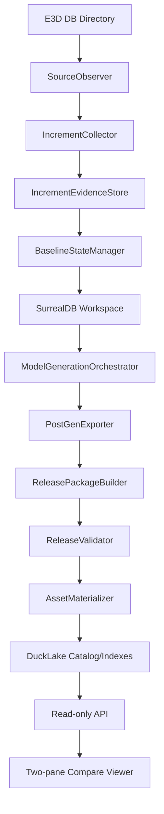

# E3D 增量模型版本与 DuckLake 硬化架构方案

日期：2026-06-20

范围：`D:\AVEVA\Projects\E3D2.1\AvevaMarineSample`，重点使用 DB `1112`
验证目录监控、sesno 增量解析、增量模型生成、不可变 release 包、DuckLake
索引和双界面三维对比。

## 1. Oracle MCP 证据

已完成 Oracle MCP 结论：

- 会话：`e3d-incrementa-ducklake-architectu-core-2`
- Transcript：
  `C:\Users\dpc\.oracle\sessions\e3d-incrementa-ducklake-architectu-core-2\artifacts\transcript.md`
- 核心结论：DuckLake 可以进入本版本，但只能做发布后的
  catalog、index、diff、impact、audit 层。不要把 DuckLake 作为模型生成 writer，
  不要把 DuckLake 当 GLB/Parquet payload body 存储，也不要用 DuckLake
  transaction id 代替业务 release id。

本轮继续分析尝试：

- `oracle --help` 已按仓库要求运行。
- 新复核包 dry-run 成功，约 `144,290` tokens，包含版本管理、source
  observation、history replay、physical baseline、generation precheck 和主 CLI
  代码。
- 新 browser consult 被本机 ChatGPT cookie/model selector 状态阻断，未产生新
  Oracle 回答。未启动 API 付费调用。
- 后续完整附件 browser consult `e3d-ducklake-architectu-review` 因 ChatGPT
  附件上传超时失败，没有产生模型回答。
- 压缩 inline consult 已成功完成：
  - 会话：`e3d-ducklake-architectu-compact`
  - Transcript：
    `C:\Users\dpc\.oracle\sessions\e3d-ducklake-architectu-compact\artifacts\transcript.md`
  - 输入约 `34,410` tokens，输出约 `1,614` tokens。
- Compact 复核确认本文档的关键边界：SurrealDB workspace 是唯一
  `Single Truth Compute Zone`；Parquet/GLB/manifest 是不可变发布事实；
  DuckLake 只做 catalog、index、diff、query、audit，不做模型生成 writer、
  不存 payload body，也不代替业务 release id。
- 2026-06-21 继续复核 `e3d-ducklake-architectu-compact` 后的结论：
  `publish-history` 必须和 `validate-history-replay` 使用同一个 scene-tree
  evidence gate。默认模式仍可发布已经证明可渲染的 quarantined/complete
  package；完整视觉生产发布应显式使用 `--require-scene-tree`，缺少
  `scene_tree/<dbnum>.tree` 或 `db_meta_info.json` 时必须在 DuckLake 注册前失败。
- 2026-06-21 使用 `mcp__oracle.consult` 继续复核当前代码和本文档：
  - dry-run 成功，约 `96,233` tokens，附件限定为
    `src/version_management/*` 核心文件、`src/web_api/model_version_api.rs`
    和本文档。
  - live browser consult `e3d-ducklake-version-review-mcp` 启动后停在
    Oracle 私有 Chrome profile，`promptSubmitted=false`；没有新的模型回答。
  - 未切换到 API 模式，避免在没有明确费用授权时触发付费调用。
  - 本轮实现继续沿用已经完成的 Oracle 结论，并用代码/HTTP/browser
    证据补强：DuckLake 只保存 release catalog、index、diff、audit 和
    asset lineage；Parquet/GLB/manifest 仍是不可变 payload；viewer 必须加载
    release-local GLB URL，不能回退到当前全局 mesh root。
- 2026-06-21 再次尝试 `mcp__oracle.consult` 时 MCP transport 立即关闭；
  已按同一 Oracle 工具链退回 CLI browser consult，未使用 API 付费模式：
  - 会话：`e3d-model-version-plan-review`
  - Reattach：`oracle session e3d-model-version-plan-review`
  - 输入约 `94,726` tokens，附件包含本文档、
    `src/web_api/model_version_api.rs`、核心 version-management 类型与
    history/baseline/source observation 文件。
  - 核心结论：当前系统已经形成
    `SourceObservation -> BaselineState -> SurrealDB -> ReleasePackage -> DuckLake`
    的形状，但缺少强约束的版本语义锚点。应显式引入
    `SOID -> BSID -> IEVID -> GJID -> RID` 的不可变 lineage；DuckLake
  只能是 read-model/catalog/index/diff/audit 层；后端还缺
  `prepare-history-replay`、`publish/register`、incremental handoff 和 release
  state machine 的结构化安全 API。
- 2026-06-21 已完成第一段结构化安全 API：
  `POST /api/model-version/runs/prepare-history-replay`。该接口把 CLI
  baseline proof gate 带入后端站点，优先使用 `snapshot_id` 读取
  `baseline_state_manifest.json`，自动选择 snapshot replacement DB file，并仅在
  这个物理快照路径下自动携带
  `--baseline-source-confirmed-at-from-sesno`。直接传 `source_db_file` 且缺少
  physical-baseline confirmation 的请求会 fail-closed。
- 2026-06-21 本轮继续使用 Oracle MCP 工具链复核：
  - 已通过 `tool_search` 加载 `mcp__oracle` 工具。
  - `mcp__oracle.sessions` 读取已完成会话时返回 `Transport closed`，与前序
    MCP transport 不稳定现象一致；未启动 API 付费调用。
  - 按 Oracle 使用规范退回同一会话库的 CLI/browser transcript，重新读取
    已完成会话 `e3d-model-version-plan-review`。
  - 新的大包 dry-run 约 `380,771` tokens，超出可控范围；聚焦包约
    `192,293` tokens，贴近上限，不适合继续扩大浏览器附件运行。
  - 本轮结论继续沿用已完成 Oracle 答复，并用本地源码/HTTP 验证补强：
    最佳方案不是把生成迁移到 DuckLake，而是把模型版本强约束成
    `SOID -> BSID -> IEVID -> GJID -> RID` 的不可变 lineage；DuckLake
    只做 release catalog、read model、index、diff、impact 和 audit。
  - 结构化安全 API 进展已覆盖 Oracle 曾点名缺失的
    `prepare-history-replay`、`register`、`publish-history`、incremental
    handoff 和 release state machine。当前缺口转为：
    `prepare-history-replay stdout plan -> bounded generate/publish execution`
    的安全编排入口，以及完整 baseline/target release 的生产证据闭环。
  - 本轮再次调用 `mcp__oracle.sessions` 和 `mcp__oracle.consult` 均返回
    `Transport closed`；已退回同源 Oracle CLI 会话库，重读已完成的
    `e3d-model-version-plan-review` transcript。MCP 不稳定不改变架构结论，
    但本轮不启动 API 付费咨询。
  - 继续 DB1112 `791 -> 897` HTTP 验证时发现一个实现级边界：
    `snapshot_id` 只证明 `from_sesno=791` baseline replacement DB，
    `incremental-sesno --to-sesno 897` 的源文件必须允许指向当前/history DB
    文件。后端 `prepare-history-replay` 已修正为区分
    `physical_snapshot_replacement_source` 和
    `physical_snapshot_with_history_source`，防止把 791 的 replacement DB 当作
    897 增量源。
- 2026-06-21 针对 DB1112 生成卡点继续准备 Oracle 复核包：
  - 新增聚焦上下文：
    `docs/plans/2026-06-21-e3d-model-version-oracle-bottleneck-context.md`。
  - 完整源码包 dry-run 约 `360,736` tokens，过大；聚焦包 dry-run 约
    `155,812` tokens，附件包含本文档、卡点上下文、
    `src/data_interface/sesno_increment.rs`、`src/main.rs`、
    `ducklake_store.rs`、`model_release.rs` 和 `release_state_machine.rs`。
  - live browser consult 会话
    `e3d-model-version-bottleneck-review` 被 Oracle 私有 Chrome profile
    登录状态阻断，未产生新模型回答；未切换到 API 付费模式。
  - 复用已完成 Oracle 会话
    `e3d-model-version-plan-review` 和
    `e3d-ducklake-architectu-compact` 的结论：架构边界不变，DuckLake 仍只做
    read-model/catalog/index/diff/audit。新增本地代码证据显示当前下一风险点是
    `incremental-sesno` 对同一 sesno range 的 pdms-io 操作重复收集，以及
    `collect_increment_eles` 缺少 per-session 进度/取消边界。
- 2026-06-21 按用户要求继续使用 Oracle MCP 工具链复核：
  - `tool_search` 已加载 `mcp__oracle`；`mcp__oracle.sessions` 和
    `mcp__oracle.consult` 仍返回 `Transport closed`。
  - 按 Oracle 技能规范退回同源 Oracle CLI/browser，先运行
    `oracle --help` 和 dry-run/files-report，再启动 browser consult；未使用
    API 付费模式。
  - 成功会话：`e3d-version-ducklake-compact-plan`。
  - Reattach：`oracle session e3d-version-ducklake-compact-plan`。
  - 输入约 `23,053` tokens，附件为本文档和
    `docs/plans/2026-06-21-e3d-model-version-oracle-bottleneck-context.md`。
  - 核心结论：当前分层方向正确，但版本语义必须进一步收敛成不可变
    version algebra：`RID = f(SOID, BSID, IEVID, GJID)`，且
    `package_hash = deterministic(RID package contents)`。`sesno`、snapshot、
    DB file 和 DuckLake snapshot 都不能成为用户版本身份。
  - DuckLake 边界需从“可查询元数据层”继续收紧为
    append-only projection store：只承载 derived graph、query acceleration
    和 audit/event log，不承载 generation writer、baseline restore source、
    truth store、job state machine 或 UI version id。
  - DB1112 下一优先级仍是 P0：`IncrementCollectionArtifact`/collected outcome
    单次 collection 复用、pdms-io progress/cancel boundary，然后才进入
    release package、DuckLake index 和双三维 compare 的生产证据闭环。

## 2. 最终决策

本版本采用唯一收敛架构：

```text
E3D DB files
  -> SourceObservation
  -> BaselineState
  -> IncrementEvidence
  -> GenerationJob
  -> SurrealDB generation workspace
  -> Model generation/export
  -> Immutable release package
  -> DuckLake release catalog/index/diff/audit
  -> Read-only API
  -> Two-pane 3D compare
```

强制规则：

- 用户可见版本是 `release_id`，不是 `sesno`，不是 mutable output 目录，也不是
  DuckLake snapshot id。
- 模型版本身份必须满足不可变 version algebra：
  `RID = f(SOID, BSID, IEVID, GJID)`；`package_hash` 是该 release package
  内容的确定性哈希，而不是 DuckLake transaction id、DB file path 或 watcher
  run id。
- 发布版本必须绑定不可变 lineage：
  `source_observation_id`、`baseline_state_id`、`increment_evidence_id`（若有）、
  `generation_job_id`、`release_id` 和 `package_hash`。`sesno` 只能作为
  source/history anchor，不是模型版本主键。
- SurrealDB workspace 是唯一生成期 compute workspace：生成计算、CATA
  resolve、transform/geometry assembly 可以在这里形成当前可重建状态，但它是
  ephemeral compute cache，不能成为用户可见版本、baseline restore source 或
  release truth。
- SurrealDB 不是发布版本 truth；发布 truth 是不可变 package。
- Parquet/GLB/manifest 是 release 数据平面的不可变事实产物。
- DuckLake 是 append-only projection/read-model：derived graph、query
  acceleration 和 audit/event log。
- DuckLake 也保存组件到 mesh asset 的可审计血缘：
  `component_key -> geometry row -> geo_hash -> release-local GLB URL/SHA/readability`。
  这属于发布后的可查询索引，不改变生成引擎和 payload ownership。
- `incremental-sesno --generate-model` 只能产生 generation output 和
  publication handoff，不能自动发布完整 visual release。
- 没有完整 baseline evidence 的增量包只能是 `patch_only` 或 `quarantined`。

实现决策：

- 本版本接受 DuckLake，但只作为发布后的可重建 catalog/read-model 层。
- 模型数据版本的事实来源是不可变 release package：
  `release_manifest.json + validation.json + parquet + meshes + asset manifest`
  及其整体 `package_hash`。
- DuckLake 中的 release、asset、component、unit、diff、status event 行都必须
  能从 release package 重建；DuckLake catalog 丢失时应允许通过 package
  re-index 恢复，而不是反向用 DuckLake 拼出模型事实。
- 如果 `ReleasePackage` hash 不变但 DuckLake diff/index 结果变化，说明
  projection 已经污染为 truth store，必须阻断生产发布并重建/审计索引规则。
- `sesno` 只作为 source/history anchor 和增量范围，不作为 UI 或 API 的模型版本
  主键。
- 发布状态变化只通过 state machine，不允许 CLI、HTTP handler、watcher 或
  viewer 各自推断发布可用性。

一致性分级：

- 强一致、fail-fast：source observation、baseline snapshot hash、
  replacement DB integrity、required scene_tree、release package hash、
  mesh availability for `complete_visual`、`release_id -> package_hash`
  绑定、publish state。
- 可最终一致、可重建：DuckLake component/unit/asset indexes、diff/impact
  projection、status/audit events、bounded scene_tree regeneration jobs。

## 3. 需求分析

系统必须支持：

1. 监控 E3D 数据库目录，识别 DB 文件和 dbnum。
2. 在 quiet window 后记录 DB 文件大小、mtime、SHA-256、latest sesno 和 header
   dbnum。
3. 对指定 `from_sesno -> to_sesno` 使用 pdms-io/`incremental-sesno` 读取增量。
4. 以机器可读 JSON 保存增量解析 evidence。
5. 证明 `from_sesno` 对应完整 baseline state 已存在。
6. 在隔离 workspace 中应用增量并执行模型生成。
7. 生成 Parquet、GLB、AABB、transform、asset manifest 和 scene evidence。
8. 将可发布模型状态复制或物化为不可变 release package。
9. 用 DuckLake 注册 release metadata、files、assets、components、units、diff 和
   status events。
10. 通过 HTTP read-only API 加载两个 release 并进行三维对比。

必须禁止：

- 将单个 sesno range replay 直接当完整模型版本发布。
- 在 HTTP GET/read path 自动写 DuckLake、自动 index、自动 repair。
- release viewer fallback 到 current/global mesh root 伪装成历史 release mesh。
- runtime-scene 或 compare selection 缺少 `model_release_mesh_assets` 证据时静默
  显示历史模型；必须明确失败、缺失或 quarantine。
- 自动运行长耗时 `--gen-indextree 1112` 并阻塞 watcher 或增量生成。
- 使用 current DB 文件 full-sync 假装能恢复任意历史 `from_sesno`。

## 4. Edge Cases

### 4.1 源 DB 观察

- DB 文件不存在、被占用、正在复制、大小变化中。
- 文件 header dbnum 与请求 dbnum 不一致。
- latest sesno 回退，说明 DB 被替换、恢复或回滚。
- latest sesno 不变但 SHA-256 变化。
- preflight hash 与 parse 后 hash 不一致。
- `db_index.sqlite` 指向旧路径或旧 fingerprint。
- 多个 watcher 同时处理同一 dbnum。
- 网络盘瞬时 IO 失败。

### 4.2 Sesno 增量解析

- `from_sesno >= to_sesno`。
- `to_sesno` 超过 source latest sesno。
- 请求 sesno 没有精确 offset，只能 nearest resolve。
- sesno gap 或历史记录损坏。
- 同一 refno 在一个范围内多次变化。
- 同一 sesno range 被 report 构建和 persist 阶段重复调用
  `collect_increment_eles`，导致 DB1112 大范围历史 replay 进入模型生成前就付出
  双倍解析成本。
- `collect_increment_eles` 长时间运行但只有外层心跳，缺少 per-session /
  per-refno progress、取消检查和慢 session 定位。
- 只有 delete、只有 attribute、或无模型影响。
- owner 删除但 child 变化仍出现。
- CATA/catalogue 变化没有直接 design instance 变化。
- 重复 replay 必须幂等。

### 4.3 Baseline State

- 没有物理 historical DB 文件，也没有可 restore 的 baseline release。
- current DB full-sync 被误用为历史 baseline。
- baseline namespace 与 current namespace 相同。
- baseline output root 与 current output root 相同。
- baseline 缺 PE/ATT/tree/transform/AABB/CATA closure 任一关键证据。
- baseline 混入 future session 数据。
- baseline manifest hash 与源 DB hash 不一致。
- baseline 只包含 DB1112，但生成依赖 catalogue/system DB。

### 4.4 增量模型生成

- impact scope 未包含 owners、ancestors、descendants、CATA closure、boolean
  negative dependencies。
- 收集阶段被取消时不能留下 SurrealDB partial persist、Parquet staging 或 release
  package；只有进入 persist 后才允许产生显式 generation attempt evidence。
- 删除组件在新 release 无 geometry，这是 expected absence。
- 新增组件在旧 release 无 geometry，这是 expected absence。
- 组件存在但无可渲染 geometry，这是 no renderable geometry，不是 expected
  absence。
- transform、AABB、unit membership 缺失。
- 生成成功但 post-generation Parquet export 失败。
- partial Parquet/GLB 留在 staging 目录。
- `scene_tree/<dbnum>.tree` 缺失导致慢路径或不完整 scope。

### 4.5 Release 和资产

- 同一 `release_id` 对应不同 `package_hash`。
- package copy 中断或 manifest 引用 release root 外部文件。
- GLB 缺失、0 字节、hash 不匹配或不可解析。
- builtin primitive 被误报为 missing GLB。
- asset index 来自旧 package。
- zero-row visual package 被发布。
- `patch_only` release 被前端当完整 visual release。

### 4.6 DuckLake

- extension 在部署环境不可用。
- schema migration 缺失。
- 多 writer 同时打开本地 metadata catalog。
- read-only API 缺 index 时尝试自动创建 index。
- parent release 缺失或跨项目。
- component/unit index 与 release package hash 不匹配。
- DuckLake 管理了 viewer-owned Parquet 文件并可能在维护时删除 payload。

### 4.7 API 和三维对比

- 左右 pane 加载了相同 release。
- diff row 的 component identity 与 runtime-scene 不一致。
- selected component 不在当前 page，需要 targeted load。
- added/deleted side 没有 absence notice。
- camera sync 产生浮点 ping-pong。
- GLB HTTP 200 但 viewer 不可见，需要 AABB/camera/renderability evidence。
- 大场景一次性 JSON 过大，需要 offset/limit 或后续 bbox tile。

## 5. 架构分层



| 层 | 负责 | 不负责 |
| --- | --- | --- |
| SourceObserver | DB 文件身份、稳定 hash、latest sesno | 模型状态 |
| IncrementCollector | sesno 范围解析、changed refnos | 完整历史状态 |
| IncrementEvidenceStore | append-only parse facts | 发布版本 truth |
| BaselineStateManager | 完整 baseline readiness | current live state |
| SurrealDB Workspace | 生成期 mutable state | 用户可见版本 |
| ModelGenerationOrchestrator | scoped/full generation | release 注册 |
| ReleasePackageBuilder | 不可变 Parquet/GLB package | DuckLake SQL diff |
| DuckLake Catalog | release/index/diff/audit | GLB/Parquet body |
| API/Viewer | read-only 查询和展示 | repair/index/mutation |

## 6. 模型数据版本实体

### 6.0 Lineage Contract

Oracle 复核后的强约束：模型数据版本不应围绕 `sesno` 或输出目录组织，
而应围绕不可变 lineage 图组织：

```text
SOID  SourceObservationId
  -> BSID  BaselineStateId
  -> IEVID IncrementEvidenceId
  -> GJID  GenerationJobId
  -> RID   ReleaseId
  -> PHASH Release package_hash
  -> AIX   Asset/Index evidence
```

约束：

- `SOID` 证明某个 DB 文件在 quiet window 内稳定，包含 file hash、latest sesno
  和 dbnum 证据。
- `BSID` 证明一个可作为生成输入的完整 baseline state，必须绑定 `SOID`，
  不能只绑定路径。
- `IEVID` 证明一个 `from_sesno -> to_sesno` 增量解析事实，必须绑定
  source hash 和 baseline/replay safety checks；它本身不是完整模型版本。
- `GJID` 证明一次生成尝试，包含输入 baseline、增量 scope、DbOption、
  output root、tree/precheck evidence、exit status 和 metrics。
- `RID` 是唯一用户可见版本，必须绑定 `BSID`、`GJID`、release package hash
  和 asset/index evidence。
- `package_hash` 是 release package 内容哈希；相同 `RID` 只能绑定一个
  `package_hash`，相同 package 可以被 re-index，但不能被重新解释成不同模型事实。
- DuckLake 中的 component/unit/asset index 都是 `RID` 的派生 read model；
  index 可以重建，但不能改变 `RID -> package_hash` 的事实。
- falsification gates：
  - DuckLake index rebuild 导致 release diff 改变；
  - `ReleasePackage` hash 不变但 DuckLake diff 改变；
  - 相同 `SOID/BSID/IEVID/GJID` 重放得到不同 `RID/package_hash`；
  - SurrealDB workspace 重启恢复后能改变 release identity。
  任一成立都说明 read-model/compute cache 已越界成 truth system。

### 6.1 版本对象

| 对象 | 主键 | 含义 |
| --- | --- | --- |
| Source observation | `project + dbnum + sha256 + latest_sesno` | 源 DB 文件证据 |
| Increment evidence | `dbnum + from_sesno + to_sesno + source_hash` | 解析到的变化事实 |
| Baseline state | `baseline_state_id` | 完整可生成基线状态 |
| Generation job | `generation_job_id` | 一次生成尝试 |
| Release package | `release_id + package_hash` | 用户可见模型版本 |
| Asset version | `release_id + geo_hash + lod + sha256` | release-local mesh |
| Index version | `release_id + index_kind + rule_hash` | 派生查询索引 |

### 6.2 Release package layout

```text
output/<project>/model_versions/
  releases/<release_id>/
    release_manifest.json
    validation.json
    source_observations/
      *.json
    baseline/
      baseline_state_manifest.json
    generation/
      generation_attempt.json
      generation_precheck.json
    parquet/<dbnum>/
      manifest.json
      instances.parquet
      geo_instances.parquet
      transforms.parquet
      aabb.parquet
    meshes/lod_L1/
      <geo_hash>.glb
    mesh_assets_manifest.json
  runs/<generation_job_id>/
  metadata.ducklake
  data/
```

`release_manifest.json` 必须记录：

- `release_id`
- `project_name`
- `dbnum`
- `from_sesno`
- `to_sesno`
- `parent_release_id`
- `baseline_state_id`
- `source_observation_manifest_hash`
- `generation_job_id`
- `package_hash`
- `release_quality`
- `release_quality_reason`
- `validation_flags`
- `tree_index_evidence`
- `asset_manifest_hash`

### 6.3 本版本落地方式

本版本先不重写生成引擎，按以下方式落地模型数据版本：

1. `incremental-sesno` 和 history replay 继续产出生成期 Parquet/GLB 与 JSON
   evidence，但不能直接发布完整 visual release。
2. `ReleasePackageBuilder` 将可发布产物复制/物化到
   `output/<project>/model_versions/releases/<release_id>/`，并计算
   `package_hash`、`asset_manifest_hash` 和文件级 SHA-256。
3. `register_model_release` 只注册不可变 package 的元数据、文件清单、
   lineage 和初始 lifecycle。若同一 `release_id` 对应不同 `package_hash`，
   必须拒绝。
4. `index-assets`、component/unit index 和 diff 将 release package 投影到
   DuckLake。索引可重建，不能改写 package truth。
5. `runtime-scene` 和 compare API 从 DuckLake 读取 release-local asset/index，
   但响应必须携带 mesh URL、hash、bytes、readability、release id 等证据；
   缺证据时返回明确错误或 quarantine 状态，不能 fallback 到 current/global mesh。
6. state machine 是唯一生产发布入口。`publish_if_ready` 需要完整
   `complete_visual` 证据；affected-scope handoff release 默认只能停在
   `staged + patch_only`。

最低需要固化到类型/manifest 的字段：

| 字段 | 所属 | 约束 |
| --- | --- | --- |
| `source_observation_id` | source/baseline/release metadata | 指向稳定 DB 观察证据 |
| `baseline_state_id` | baseline/release metadata | 指向完整可生成 baseline |
| `increment_evidence_id` | incremental release metadata | 指向 sesno range 解析事实 |
| `generation_job_id` | release metadata | 指向 bounded generation run |
| `release_id` | release package/catalog | 用户可见版本主键 |
| `package_hash` | release package/catalog | 不可变 package 身份 |
| `asset_manifest_hash` | release metadata | release-local mesh asset 证据 |
| `index_rule_hash` | DuckLake index metadata | 用于判断索引是否需重建 |

## 7. DuckLake 使用边界

本版本使用 DuckLake 存三类 append-only projection：

1. Derived graph：`release -> component -> unit -> asset -> mesh`。
2. Query acceleration：diff、impact、component lookup、release comparison。
3. Audit/event log：release created/published、asset materialized、
   index built、schema migration。

具体表包括：

- `model_releases`
- `model_release_edges`
- `model_release_files`
- `model_release_status_events`
- `model_release_mesh_assets`
- `component_snapshots`
- `delivery_unit_memberships`
- `unit_versions`
- `component_unit_impacts`
- diff/index/reconcile run metadata
- schema migration audit

本版本不使用 DuckLake 做：

- generation-time writer。
- SurrealDB workspace 替代。
- GLB body 存储。
- viewer-owned Parquet body 存储。
- target-sesno baseline restore。
- HTTP GET path auto-repair。
- release/job state truth。
- UI/user-facing version id。

原因：

- 现有生成链路依赖 SurrealDB、CATA resolve、transform cache、tree/query
  provider 和 post-generation export。
- DuckLake 适合 SQL diff、release graph、component/unit snapshot、asset
  manifest 和 audit。
- 在 baseline 正确性未闭环前，将 generation writer 换成 DuckLake 会制造第二套
  model truth。
- DuckLake 官方定位是围绕 SQL catalog + Parquet files 的 lakehouse 表格式，
  支持 catalog metadata、snapshots、transactions/change tracking；这与本版本
  的 release projection/read-model 匹配，但 DuckLake 当前不是在线模型生成器，
  也不提供适合替代 SurrealDB compute workspace 的图/关系写入语义。

## 8. Incremental-sesno 与 watcher 产物策略

当前正确策略：

1. `watch-incremental` 检测 DB 文件 latest sesno 增长。
2. watcher 为该更新写入 source observation manifest。
3. watcher 调用 guarded `incremental-sesno`。
4. `incremental-sesno` 在 parse/save 前验证 manifest hash、project、dbnum、
   sesno 范围和 primary DB SHA-256。
5. parse/save/generation 后再次验证 source DB SHA-256。
6. 如果 `--generate-model` 成功，导出 Parquet。
7. 写 `incremental_publication_handoff:v1`。
8. handoff 中建议注册为 `patch_only`、`staged`，并带
   `incremental_handoff_affected_scope`。
9. 只有通过 baseline/full visual validation 的 package 才能发布为完整 visual
   release。

禁止策略：

- watcher 自动 publish 完整 release。
- `incremental-sesno` 直接把 affected-scope Parquet 当完整 release。
- handoff 注册命令默认 `published`。

## 9. DB1112 scene_tree 缺失策略

当前事实：

- `output\AvevaMarineSample\scene_tree\1112.tree` 缺失。
- 现有 generation precheck 会报告缺失，但不阻断流程。
- 实际 `--generate-model` 可通过慢路径成功生成 DB1112 affected-scope package。
- 尝试 `--gen-indextree 1112` 超过本地 904s 且未产生 `1112.tree`，已停止进程。

最终策略：

1. 不在 watcher 或 `incremental-sesno --generate-model` 中默认自动生成
   `1112.tree`。
2. 默认模式允许 degraded generation，但必须在 JSON summary、handoff manifest
   和 generation evidence 中记录 `tree_index.ready=false`、缺失文件路径和影响。
3. 增加严格模式 `--require-tree-index`，在模型生成前发现缺失 tree 时快速失败。
4. 完整 visual release publish 必须要求 tree evidence ready，或者要求 release
   quality 显式为 `quarantined`/`patch_only` 并写明理由。
5. 后续单独实现 bounded tree-index build job，不能在 watcher 内隐式长跑。

推荐新增 evidence：

```json
{
  "tree_index": {
    "ready": false,
    "mode": "degraded_allowed",
    "scene_tree_dir": "output/AvevaMarineSample/scene_tree",
    "required_dbnums": [1112],
    "missing_dbnums": [1112],
    "files": [
      {
        "dbnum": 1112,
        "path": "output/AvevaMarineSample/scene_tree/1112.tree",
        "exists": false
      }
    ],
    "recommendation": "Run a bounded baseline/tree build job or publish only as patch_only/quarantined."
  }
}
```

## 10. 推荐文件结构

已有并保留：

```text
src/version_management/
  source_observation.rs
  increment_evidence.rs
  history_replay_plan.rs
  history_replay_validation.rs
  physical_baseline_snapshot.rs
  release_package.rs
  ducklake_store.rs
  model_release.rs
  cli.rs
```

建议新增或拆分：

```text
src/version_management/
  baseline_state.rs
  increment_evidence.rs
  generation_job.rs
  generation_precheck.rs
  publication_handoff.rs
  release_state_machine.rs
  release_validation.rs
  model_data_version.rs

src/fast_model/gen_model/
  precheck_coordinator.rs      # 保留生成前通用检查
```

拆分原则：

- `main.rs` 只保留 CLI glue。
- `publication_handoff.rs` 负责 incremental handoff JSON 和 register argv。
- `generation_precheck.rs` 负责 tree/transform/db_meta evidence，不负责生成 tree。
- `release_validation.rs` 负责完整 visual release 与 patch-only 分类。
- `ducklake_store.rs` 只负责 catalog/index 持久化。

## 11. CLI 合约

已有命令应保留：

```text
aios-database model-version observe-source --json
aios-database incremental-sesno --source-observation-manifest ... --json
aios-database watch-incremental --source-observation-dir ... --json
aios-database model-version validate-history-replay --json
aios-database model-version publish-history --json
aios-database model-version register --json
aios-database model-version index --json
aios-database model-version index-assets --materialize --json
aios-database model-version diff --json
```

建议新增或硬化：

```text
aios-database model-version validate-generation-precheck
  --project AvevaMarineSample
  --dbnum 1112
  --scene-tree-dir output/AvevaMarineSample/scene_tree
  --json

aios-database incremental-sesno
  --generate-model
  --require-tree-index
  --publication-handoff-dir <dir>
  --json

aios-database watch-incremental
  --generate-model
  --require-tree-index
  --publication-handoff-dir <dir>
  --json

aios-database model-version publish-history
  --parquet-dir <isolated_replay_package>
  --scene-tree-dir <replay_output>/<project>/scene_tree
  --require-scene-tree
  --materialize-assets
  --json
```

严格模式行为：

- 如果 `scene_tree/<dbnum>.tree` 缺失，生成前快速失败。
- 错误必须包含 missing dbnums、路径、推荐命令和 `code=tree_index_missing`。
- `publish-history --require-scene-tree` 缺失 tree evidence 时必须在 release
  registration 之前失败，分类为 `missing_scene_tree_baseline`。

默认模式行为：

- 继续生成。
- JSON summary 和 handoff 必须包含 tree evidence。
- suggested release quality 固定为 `patch_only` 或 `quarantined_visual`。
- `publish-history` 默认仍会记录 scene-tree evidence，但不把 scene tree 缺失
  作为发布阻断条件；发布质量必须由 mesh/package/baseline evidence 明确标识。

## 12. HTTP/API 合约

Read-only：

```text
GET /api/model-version/releases
GET /api/model-version/releases/{release_id}
GET /api/model-version/releases/{release_id}/runtime-scene
GET /api/model-version/releases/{release_id}/mesh-assets
GET /api/model-version/compare-readiness
GET /api/model-version/history-baseline-inspect
GET /api/model-version/diff
GET /api/model-version/unit-diff
GET /api/model-version/component-impact
GET /model-version/compare
GET /model-version/release-viewer
```

History replay safety:

- `model-version prepare-history-replay` 默认必须 fail-closed，因为
  `baseline_parse` 使用的是 `source_db_file` 的可见/current full-sync 状态，
  不是 pdms-io target-sesno hydrate。
- 只有当调用方明确传入
  `--baseline-source-confirmed-at-from-sesno`，声明 `source_db_file` 已经是
  `from_sesno` 对应的隔离物理 baseline，才允许写 replay/baseline DbOption。
- `prepare-physical-baseline-snapshot` 生成的 `prepare-history-replay` hint
  必须指向 snapshot 内 replacement DB file，并自动包含该确认 flag。

Mutation/run-trigger：

```text
POST /api/model-version/runs/observe-source
POST /api/model-version/runs/prepare-history-replay
POST /api/model-version/runs/generate-incremental
POST /api/model-version/runs/validate-generation-precheck
POST /api/model-version/releases/register
POST /api/model-version/releases/publish-history
POST /api/model-version/incremental/handoff
POST /api/model-version/releases/{release_id}/index
POST /api/model-version/releases/{release_id}/index-assets
POST /api/model-version/releases/{release_id}/index-units
```

新增结构化 mutation API 的边界：

- `prepare-history-replay` 必须优先支持 `snapshot_id` 输入，从
  `baseline_state_manifest.json` 读取 replacement DB file，并自动携带
  `--baseline-source-confirmed-at-from-sesno`。如果调用方直接传
  `source_db_file`，必须显式确认这是 `from_sesno` 的物理 baseline。
- `publish-history` / `register` 必须是显式 POST，不允许由 GET 或 viewer
  自动触发；生产发布必须检查 baseline evidence、generation job、package hash、
  asset evidence 和 index readiness。
- `incremental/handoff` 只写 staged handoff/evidence，默认建议
  `patch_only` 或 `quarantined_visual`，不能直接发布完整 visual release。
- release state machine 应中心化状态迁移，避免 CLI、HTTP 和后续 watcher
  各自推断 release quality。

HTTP GET invariants：

- 不自动 migrate。
- 不自动 index。
- 不自动 materialize GLB。
- 不 fallback current/global mesh for visual release。
- 缺依赖返回 `424 Failed Dependency` 或清晰 JSON error。

## 13. 错误处理

建议统一错误码：

| Code | 含义 | 推荐动作 |
| --- | --- | --- |
| `source_unstable` | DB 文件观察窗口内变化 | 稳定后重试 |
| `source_hash_changed` | parse/generate 期间源文件变化 | 丢弃本轮结果 |
| `sesno_out_of_range` | 请求 sesno 超过源 DB | 选择有效范围 |
| `baseline_missing` | 缺完整 baseline state | 物理 snapshot 或 restore baseline |
| `baseline_hash_mismatch` | baseline manifest/hash 不一致 | 重建 baseline |
| `history_baseline_not_publishable` | pdms-io target sesno 只能 inspect，不能证明完整 visual baseline | 使用 physical baseline snapshot、已发布 baseline restore，或实现经验证 hydrate provider |
| `history_baseline_confirmation_required` | prepare-history-replay 缺少 physical baseline 确认 | 先运行 physical baseline snapshot，或显式确认 source DB 已是 from_sesno baseline |
| `tree_index_missing` | scene_tree 缺失 | 严格模式失败或 degraded evidence |
| `patch_only_package` | affected-scope 包不能代表完整 release | 只注册 staged patch_only |
| `asset_index_missing` | runtime-scene 缺 asset index | 显式运行 index-assets |
| `mesh_asset_unreadable` | GLB 不可解析 | regenerate/materialize/repair |
| `compare_not_production_ready` | release pair 只能诊断/演示，不能生产签收 | 查看 readiness evidence 并修复 quarantine/index/asset 问题 |
| `read_path_mutation_forbidden` | GET path 试图写 | 修复 API 路径 |
| `release_conflict` | 同 release id 不同 package hash | 换 release id 或修正 package |

## 14. 开发计划

### P0：文档和 generation precheck evidence

1. 将本方案作为当前实现准线。
2. 固化 `SOID -> BSID -> IEVID -> GJID -> RID` lineage contract，并在
   `types.rs`/manifest 中补齐缺失字段。
3. 新增 `generation_precheck.rs` 或把逻辑从 `main.rs`/`precheck_coordinator`
   抽出。
4. 给 `incremental-sesno` 和 `watch-incremental` 增加 `--require-tree-index`。
5. 默认生成 summary/handoff 中记录 tree degraded evidence。
6. 严格模式验证 DB1112 缺 `1112.tree` 时快速失败。
7. 默认模式验证仍可生成 affected-scope package，但 handoff/release quality 为
   `patch_only`。

### P0.5：结构化后端安全 API

Status：`prepare-history-replay`、`register`、`publish-history`、incremental
handoff 和 release state-machine 结构化 POST API 已实现并通过 HTTP 验证。

1. 新增 `POST /api/model-version/runs/prepare-history-replay`。已完成。
2. 优先支持 `snapshot_id` 模式，复用
   `validate_http_baseline_state`、source observation 和 bounded runner。
   已完成。
3. 请求缺少 physical baseline confirmation 时 fail-closed。已完成；直接
   source 请求缺 confirmation 返回 HTTP 400。
4. 返回 command argv、source observation、baseline manifest hash 和 safety
   evidence，便于前端/运维 UI 展示。
   已完成；run 详情包含 bounded runner argv、source observation manifest、
   baseline manifest dependency、stdout/stderr、source DB hash before/after。
5. 用 DB1112 physical snapshot 通过 HTTP 验证成功路径；用 live source DB 或
   缺 flag 请求验证失败路径。已完成：
   - negative direct request：HTTP 400，
     `direct prepare-history-replay requires baseline_source_confirmed_at_from_sesno=true`。
   - positive snapshot request：
     `snapshot_id=codex-ams1112-physical-791-reuse-20260620`、
     `from_sesno=791`、`to_sesno=897`，run
     `codex-http-history-snapshot-20260621041907` 成功，
     `kind=prepare_history_replay`、`exit_code=0`、
     `source_db_hash_unchanged=true`。
   - stdout safety checks 确认 replay namespace/output/parquet 与 current
     隔离，`baseline_source_confirmed_at_from_sesno=true`，
     `baseline_target_sesno_reconstruction_supported=false`，并生成
     `incremental-sesno --generate-model` 与 `publish-history` argv。
6. 补 `publish-history`/`register` 结构化 API。已完成：
   - `POST /api/model-version/releases/register` 可创建 staged immutable
     release，重复请求返回 `already_exists`。
   - `GET /api/model-version/releases/{release_id}` 已改为按 release id
     直接读取 DuckLake，可查询 staged release，不再只依赖 published-only
     list projection。
   - `POST /api/model-version/releases/publish-history` 复用现有
     `publish_history_model_release` domain gate；缺 baseline state metadata
     的请求返回 HTTP 400 `baseline_missing`，不会发布。
7. 补 incremental handoff API。已完成：
   - `POST /api/model-version/incremental/handoff` 读取
     `incremental_publication_handoff:v1` manifest。
   - 强制 `policy=explicit_register_required`、`generation_success=true`、
     candidate package hash 与 `load_model_package` 一致。
   - 只调用 `register_model_release`，创建 staged release；不会调用
     `publish_history_model_release`。
   - `complete_visual` override 返回 HTTP 400，affected-scope handoff 默认
     `patch_only`。
   - DB1112 `896 -> 897` sample manifest 创建
     `codex-http-handoff-20260621052235`，重复请求返回 `already_exists`。
8. 接入中心化 release state machine。已完成：
   - 新增 `src/version_management/release_state_machine.rs`。
   - 新增 `POST /api/model-version/releases/{release_id}/state-machine`。
   - 支持 `review`、`publish_if_ready`、`fail_if_unusable`。
   - `publish_if_ready` 比旧 `reconcile` 更严格：要求
     `complete_visual`、baseline state manifest、generation job id、component
     index 和 release-local mesh asset evidence。
   - DB1112 staged `patch_only` handoff release
     `codex-http-handoff-20260621052235` 的 `publish_if_ready` 返回
     `transition_allowed=false`，且 release 仍保持 staged。
   - 新 handoff release `codex-http-sm-handoff-20260621054048` 已写入
     `generation_job_id=incremental-db1112-896-to-897-20260620T155135644Z`，
     但仍因 baseline/asset/quality blockers 无法发布。

### P0.6：Replay Plan 安全执行编排

Status：已完成第一版结构化 HTTP 执行入口并通过 DB1112 HTTP 验证。

目标是把已经成功的
`POST /api/model-version/runs/prepare-history-replay` 输出从“计划”推进到
“可验证执行”，但仍保持 fail-closed：

1. 新增结构化入口，例如：

```text
POST /api/model-version/runs/execute-history-replay-plan
```

已完成：

- 新增 route：
  `POST /api/model-version/runs/execute-history-replay-plan`。
- endpoint 读取已成功的 `prepare-history-replay` bounded run stdout JSON，
  解析 `ModelHistoryReplayPrepareResponse`，并按白名单 phase 选择 argv。
- 支持 phase：
  `baseline_parse`、`baseline_generate`、`baseline_register`、`generate`、
  `publish`。
- 执行前要求：
  - prepare run `kind=prepare_history_replay`；
  - prepare run `status=succeeded` 且 `exit_code=0`；
  - prepare run `source_db_hash_unchanged=true`；
  - prepare stdout 存在且记录 SHA-256；
  - plan 的 `source_db_file` 与 prepare run record 一致；
  - plan 的 `project_name` 与 HTTP project context 一致；
  - `baseline_source_confirmed_at_from_sesno=true`；
  - selected argv 必须由 prepare stdout 提供，并满足 phase 语义校验。
- 新 run 继续通过 bounded runner 执行，继承 source DB hash guard，返回
  command argv、prepare stdout hash、plan summary、run record 和 stdout/stderr
  路径。

2. 输入 `prepare_run_id` 和 `phase`，从 bounded runner 的 stdout JSON 中读取
   `ModelHistoryReplayPrepareResponse`，禁止前端直接提交任意 argv。
3. 仅允许白名单 phase：
   `baseline_parse`、`baseline_generate`、`baseline_register`、`generate`、
   `publish`。
4. 执行前校验：
   - `prepare_run_id` 必须已成功；
   - prepare run 的 source DB hash before/after 必须一致；
   - stdout path 必须存在且 hash 可记录；
   - argv 必须来自 prepare stdout；
   - generate argv 必须含 `incremental-sesno --generate-model --json`，且
     `from_sesno/to_sesno/dbnum` 与计划一致；
   - publish argv 必须含 `model-version publish-history --json`，且不能绕过
     baseline/package/materialize gate。
5. 使用 bounded runner 启动实际生成/发布子任务，记录 stdout/stderr、source
   hash guard、dependency files、timeout、cancel 状态。
6. 生成成功后仍不能自动发布 complete visual；必须进入 handoff/register 和
   state-machine review。

验收：

- invalid phase `bogus` 返回 HTTP 400，未启动进程。
- missing prepare run 返回 HTTP 404，未启动进程。
- DB1112 prepare run
  `codex-http-history-snapshot-20260621041907` 的 `publish` phase 可启动
  bounded run `codex-http-exec-publish-20260621061200`。
- 该 bounded run 按预期失败在：
  `historical release source Parquet directory does not exist`，证明没有
  replay-generated package 时不会伪发布。
- run record 可查询，且包含：
  - `kind=history_replay_plan_publish`；
  - `source_db_sha256_before == source_db_sha256_after`；
  - `source_db_hash_unchanged=true`；
  - stdout/stderr 路径；
  - prepare stdout hash
    `d016d4db922e5a0965f3ecf79866f232f5ab6b7175ea8076817fab73d4c335fa`。
- `cargo fmt --check` 通过。
- `cargo build --bin web_server --features "web_server,model-version-ducklake,surreal-save"`
  通过。
- `cargo build --bin aios-database --features "model-version-ducklake,surreal-save"`
  通过。
- 未运行 `cargo test`，符合仓库验证策略。

### P0.7：DB1112 历史源与物理基线拆分

Status：代码边界已修正；首次重放生成因长时间无进度证据而安全取消。

DB1112 `791 -> 897` 的正确路径必须同时携带两类证据：

1. `snapshot_id=codex-ams1112-physical-791-reuse-20260620` 证明
   `from_sesno=791` 的 physical baseline replacement DB 和
   `baseline_state_manifest.json`。
2. `source_db_file=D:\AVEVA\Projects\E3D2.1\AvevaMarineSample\ams000\ams1112_0001`
   作为可读取到 `to_sesno=897` 的 history/current DB 文件。

边界修正：

- `snapshot_id` 模式不再强制 `source_db_file == replacement_db_file`。
- 当两者相同时，`source_mode=physical_snapshot_replacement_source`，并继续用
  replacement DB SHA 作为 expected source hash。
- 当调用方显式传入不同的 history source DB 时，
  `source_mode=physical_snapshot_with_history_source`，baseline evidence 仍来自
  snapshot manifest，增量读取则来自 history source DB。
- `baseline_source_confirmed_at_from_sesno=true` 只表示 baseline 已被
  physical snapshot 证明，不表示增量源文件本身停留在 `from_sesno`。

当前验证：

- 旧 prepare run 的 generate phase 已按预期失败：
  replacement DB 最新 `sesno=791`，不能读取 `to_sesno=897`。
- 新 prepare run
  `codex-http-history-targetsrc-20260621062500` 使用
  `source_mode=physical_snapshot_with_history_source` 成功。
- 新 generate run
  `codex-http-exec-generate-targetsrc-20260621062600` 已通过
  `POST /api/model-version/runs/execute-history-replay-plan` 启动，argv 来自
  prepare stdout，正在执行
  `incremental-sesno --file <current-history-db> --from-sesno 791 --to-sesno 897 --generate-model --json`。
- 该 generate run 运行约 14 分钟，CPU 持续增长，但 stdout 无新增、stderr
  为空、`task-metrics.json` 未出现、replay Parquet 目录未出现。为避免留下
  不可观测后台进程，已通过
  `POST /api/model-version/runs/{run_id}/cancel` 取消。
- 取消后 run 状态为 `cancelled`，`source_db_hash_unchanged=true`，源 DB SHA
  before/after 均为
  `70f18c70116f392eae533b75fb8f4043d031a5f049448531cc1dfc43faf7d3c2`。

后续开发动作：

1. generation 阶段 heartbeat/stage metrics 已补齐：
   `incremental_sesno_collecting_file`、`incremental_sesno_persisting`、
   `incremental_sesno_generate_running`、`incremental_sesno_exporting_parquet`
   等阶段会写入 `AIOS_TASK_METRICS_PATH`。
2. 已通过 CLI smoke 验证：DB1112 `791 -> 897` 隔离 replay 配置运行 25 秒时
   metrics 文件存在，stage 为 `incremental_sesno_collecting_file`，验证脚本随后
   停止子进程。
3. 已通过 HTTP bounded-run smoke 验证：
   `codex-http-exec-generate-metrics-smoke-clean-20260621070645` 在
   `GET /api/model-version/runs/{run_id}` 中暴露
   `metrics.stage=incremental_sesno_collecting_file`，随后通过 cancel endpoint
   正常进入 `cancelled`，`source_db_hash_unchanged=true`。
4. 下一步重新运行 generate，并用 metrics 判断真实卡点。
5. 若 generate 成功，检查 replay Parquet、handoff manifest、source hash
   before/after 和 package evidence。
6. 执行 `publish` 或 `incremental/handoff -> register -> state-machine review`。
7. 对生成 release 运行 `index`、`index-assets --materialize`、`index-units`
   和 compare readiness。
8. 最终以两个 release-local GLB 模型在 `/model-version/compare` 的双三维界面
   可见作为验收闭环。

### P0.8：单次增量收集与 pdms-io 可观测性

Status：单次收集复用已实现；pdms-io 内部 per-session progress callback
已接入 CLI/metrics 并通过长范围 smoke 验证。取消仍依赖 bounded runner 的
进程级取消；细粒度 callback cancellation 作为后续增强。

当前 DB1112 `791 -> 897` 再次通过 HTTP runner 启动 generate 后，metrics
心跳稳定刷新，但阶段持续停留在
`incremental_sesno_collecting_file`。该 run
`codex-http-exec-generate-observed-20260621071222` 运行约 6.4 分钟后为分析而
取消，取消后 `source_db_hash_unchanged=true`。这说明：

- bounded runner 和 task metrics 已经能观测长任务；
- 真正的下一瓶颈在 pdms-io 增量操作收集阶段，而不是 DuckLake、
  publish state machine 或 viewer compare；
- 当前 `run_incremental_sesno_once` 会先通过
  `collect_pdms_increment_for_file` 收集 grouped operations 来构建
  `update_log`/`element_changes`，随后 `persist_pdms_increment_files` 又打开同一
  DB 文件并对同一 actual sesno range 再次调用
  `collect_increment_eles`。

目标：

1. 对每个源 DB 文件和 actual sesno range 只调用一次
   `collect_increment_eles`。
2. 同一批 `EleOperationData` 同时驱动：
   - `IncrGeoUpdateLog`；
   - `PdmsSesnoElementChange`；
   - PE/ATT/UDA/DBNUM persist；
   - generation handoff evidence。
3. 保留 JSON 输出兼容性：运行时 grouped operations 不进入
   `PdmsSesnoIncrementOutcome` 的序列化结果，除非显式落为独立 evidence artifact。
4. 为 pdms-io collection 增加 per-session progress evidence；至少记录
   `current_sesno`、`processed_sessions`、`total_sessions`、
   `processed_unique_refnos` 和慢 session。
5. 取消只发生在安全边界：collection 阶段取消不写 SurrealDB；persist 后取消必须
   写 generation attempt/partial evidence，不能静默丢失状态。

推荐实现路径：

1. 在 `sesno_increment.rs` 新增内部运行时结构，例如
   `CollectedPdmsIncrementFile`：

```text
report: PdmsSesnoIncrementFileReport
grouped_operations: BTreeMap<u32, Vec<EleOperationData>>
```

2. 将现有 `collect_pdms_increment_for_file` 拆成：
   - public JSON-compatible wrapper：返回现有 `PdmsSesnoIncrementOutcome`；
   - internal collector：返回 `CollectedPdmsIncrementOutcome`，包含 grouped
     operations。
3. 将 persist 实现拆出
   `persist_pdms_increment_grouped(report, grouped_operations, detail)`，让
   `run_incremental_sesno_once` 在同一进程内复用已收集 operations。
4. 保持旧 public `persist_pdms_increment_files` 作为兼容入口；旧入口仍可从
   report 重新读取，但 CLI 主路径不再走双收集。
5. 如果 grouped operations 内存过大，再引入 per-run collection artifact：
   `runs/<generation_job_id>/increment_evidence/<dbnum>-<range>.jsonl` 或二进制
   rkyv/parquet；该 artifact 必须绑定 source hash 和 actual sesno range。
6. 后续再进入 pdms-io-fork 增加 callback/cancel token；第一步先在本仓库消除
   双收集，降低风险和改动半径。

验收：

- 已完成：
  - `src/data_interface/sesno_increment.rs` 新增
    `PdmsSesnoCollectedFile`、`PdmsSesnoCollectedOutcome`、
    `collect_pdms_increment_for_file_with_operations`、
    `collect_pdms_increment_for_dbnums_from_index_with_operations` 和
    `persist_collected_pdms_increment_files`。
  - `src/main.rs` 的 `incremental-sesno` 主路径已切到 collected outcome，
    persist 复用 grouped operations。
  - DB1112 `896 -> 897` CLI verbose 验证中
    `collect_increment_eles 会话数` 只出现 1 次，输出
    `session_count=1`、`element_count=169`。
  - `cargo fmt --check`、`aios-database` build、`web_server` build 均通过。
- 已完成：
  - `D:\work\plant-code\pdms-io-fork\src\io.rs` 新增
    `IncrementCollectProgress` 和
    `collect_increment_eles_with_progress`；原
    `collect_increment_eles` 保持兼容 wrapper。
  - `src/data_interface/sesno_increment.rs` 在 collection callback 中写入
    `incremental_sesno_collecting_file_progress`，detail 包含
    `phase`、`sesno`、`sessions=x/y`、`refno_locs`、`unique_refnos`、
    `duplicate_refnos` 和 `operations`。
  - DB1112 `791 -> 897` 长范围 CLI progress smoke 在约 7.5 秒内观测到
    `phase=session_locations_collected sesno=792 sessions=0/106
    refno_locs=31 unique_refnos=0 duplicate_refnos=0 operations=0`，随后验证脚本
    主动停止子进程，未进入 persist。
  - DB1112 `896 -> 897` 小范围完整 CLI smoke 仍成功，最终 stage 为
    `incremental_sesno_handoff_built`，且 verbose 输出证明
    `collect_increment_eles` 只调用 1 次。
- 已完成：
  - HTTP bounded runner progress smoke
    `codex-http-exec-generate-progress-20260621081108` 通过
    `POST /api/model-version/runs/execute-history-replay-plan` 启动 DB1112
    `791 -> 897` generate，并在 run record 中暴露
    `metrics.stage=incremental_sesno_collecting_file_progress`。
  - `GET /api/model-version/runs/codex-http-exec-generate-progress-20260621081108?project=AvevaMarineSample`
    返回 `success=true`、`data.run.status=cancelled`、
    `data.run.metrics.stage=incremental_sesno_collecting_file_progress` 和
    `data.run.source_db_hash_unchanged=true`。
  - 对应 `task-metrics.json` detail：
    `phase=session_locations_collected sesno=793 sessions=1/106
    refno_locs=31 unique_refnos=0 duplicate_refnos=0 operations=0`。
  - smoke 立即取消，`source_db_hash_unchanged=true`，无
    `aios-database` 子进程遗留。
- 待完成：
  - 让 DB1112 `791 -> 897` generate 跑到正常完成，而不是只做 progress
    smoke。
  - 若完整 generate 通过，再继续 release package、handoff/register、
    DuckLake index 和双三维 compare。
- DB1112 `791 -> 897` HTTP generate run 的 metrics 必须从
  `incremental_sesno_collecting_file` 进入
  `incremental_sesno_persisting`，且日志/metrics 能证明同一 range 未重复
  collection。
- 若仍长时间停在 collection，则 metrics 至少暴露正在处理的 session 和计数，
  可以定位是少量 session 慢还是全量扫描慢。
- `from_sesno=897`、`to_sesno=897` 无变化 smoke 仍返回成功并保持
  `incremental_sesno_handoff_built`。
- 禁止 `cargo test`；通过 CLI/JSON、HTTP bounded runner 和 build 验证。

### P0.9：版本代数与 projection hard boundary

Status：新增 Oracle `e3d-version-ducklake-compact-plan` 复核后提升为 P0/P1
之间的架构硬化项；不阻塞 DB1112 `791 -> 897` generate 跑通，但必须在完整
production publish 前完成。

目标：

1. 把 `SOID -> BSID -> IEVID -> GJID -> RID -> package_hash` 写成类型级
   contract，而不是只散落在 manifest 字段中。
2. 将 SurrealDB 明确降级为 ephemeral compute cache：release truth 只能来自
   immutable package。
3. 将 DuckLake 明确为 append-only projection store：所有 index/diff/impact
   必须能从 release package 重建。
4. 对 read-only API 增加 projection freshness evidence：`index_rule_hash`、
   `asset_manifest_hash`、`component_snapshot_count`、`mesh_asset_count`。
5. 增加 falsification gate：同 package hash 的 DuckLake diff/index 变化必须
   标记 `projection_inconsistent` 并阻断 production sign-off。

建议文件结构：

```text
src/version_management/
  identity.rs              # SOID/BSID/IEVID/GJID/RID/package_hash 强类型
  lineage.rs               # lineage validation and deterministic id helpers
  increment_artifact.rs    # collected operations/evidence artifact contract
  projection_contract.rs   # DuckLake projection freshness/falsification gates
```

落地步骤：

1. 先在现有 `types.rs` 中补字段和 helper，避免一次性大迁移。
2. 新增 `identity.rs` 后再把 `types.rs` 的字符串字段逐步迁出。
3. `register_model_release` 拒绝同一 `release_id` 不同 `package_hash`，并验证
   `source_observation_id`、`baseline_state_id`、`generation_job_id` 均存在。
4. `compare_readiness` 把 projection freshness 纳入 readiness blockers。
5. `index-assets`/component/unit index run 写入 `index_rule_hash` 和输入 package
   hash；GET path 只读取，不自动 repair。
6. 验证方式：CLI/JSON + HTTP；禁止 `cargo test`。最小 smoke 为同一 release
   重复 register/index 不改变 `release_id -> package_hash`，并且 projection
   rebuild 后 diff summary 不变。

### P1：BaselineStateManager

1. 新增 `baseline_state.rs`。
2. 定义 `BaselineStateManifest`。
3. 物理 snapshot 与 restore baseline package 都产出同一 manifest。
4. `publish-history` 强制 baseline evidence。
5. current-file full-sync 只能作为 current baseline，不可冒充 target-sesno
   hydrate。

### P2：Release 状态机

Status：已实现第一版安全门；后续只做策略扩展。

1. 新增 `release_state_machine.rs`。已完成。
2. 状态：

```text
planned -> baseline_ready -> generating -> generated -> exported
  -> assets_materialized -> indexed -> published
```

失败/特殊状态：

```text
failed
patch_only
quarantined
```

3. 所有状态变化写 DuckLake status events。
4. `published` 必须有完整 visual validation。

### P3：增量影响集硬化

1. 计算 changed/added/deleted refnos。
2. 扩展到 owners、visible ancestors、descendants、CATA closure、boolean negative
   dependencies。
3. scope 不可信时扩大到 unit/dbnum/full。
4. 记录 skipped/no-renderable/generation-attempt evidence。

### P4：双界面生产化

1. runtime-scene 支持 paging、component targeted load、后续 bbox/tile。
2. compare page 显示 release quality、tree evidence、asset evidence 和
   release pair readiness。
3. added/deleted/no-renderable 状态可视化。
4. 相机同步和 diff row highlight 保持回归验证。

## 15. 验证方案

禁止 `cargo test`。

CLI + JSON：

1. `observe-source` 验证 DB1112 current source。
2. guarded `incremental-sesno 896 -> 897` 验证 source hash before/after。
3. `incremental-sesno --generate-model --require-tree-index` 验证缺
   `1112.tree` 时快速失败。
4. 默认 `--generate-model` 验证成功且 handoff 包含 tree degraded evidence。
5. handoff register argv 验证 release 为 staged `patch_only`。
6. `model-version diff` 验证已知 791 -> 897：

```text
added=5059
deleted=2525
changed=43
unchanged=23549
```

7. `model-version validate-compare-readiness --json` 验证同一 release pair：

```text
classification=quarantined_visual
production_ready=false
component_indexes_ready=true
mesh_assets_ready=true
```

8. `model-version inspect-history-baseline --json` 验证 DB1112 历史 sesno：

```text
target_sesno=791/897
exact_sesno_found=true
full_state_enumeration_supported=false
recommended_action=physical baseline snapshot / proven hydrate provider
```

9. `model-version prepare-history-replay` baseline proof gate：
   - 不带 `--baseline-source-confirmed-at-from-sesno` 时必须 fail-closed，且不能写
     replay/baseline config。
   - 带确认 flag 时可以生成计划，并在 `safety_checks` 中记录
     `baseline_source_confirmed_at_from_sesno=true`。
   - `prepare-physical-baseline-snapshot` 的 hint argv 必须包含确认 flag，并指向
     snapshot replacement DB file。

HTTP/browser：

1. 启动 rebuilt `web_server`。
2. `GET /api/model-version/releases`。
3. `GET /api/model-version/compare-readiness`。
   - DB1112 `791 -> 897` 必须返回 `classification=quarantined_visual`。
   - `production_ready=false`，但 component index 和 mesh asset evidence 必须为 ready。
   - 响应必须给出 recommended action，防止把 quarantine 对比误认为生产签收。
4. `GET /api/model-version/history-baseline-inspect`。
   - DB1112 `target_sesno=791/897` 必须返回精确 session 命中。
   - 如果 pdms-io index/parse evidence 不足以证明 full-state hydrate，必须返回
     `full_state_enumeration_supported=false` 和 fail-clear recommended action。
   - GET 不得写 DuckLake、不得启动 parse/generate、不得修改 DbOption。
5. `GET /api/model-version/diff`。
6. `GET /api/model-version/releases/{release_id}/runtime-scene`。
   - 对 changed component 做 targeted load。
   - 响应中的每条 geometry 必须携带 `mesh_asset` evidence：
     `mesh_url`、`sha256`、`bytes`、`glb_readable`、`exists`。
   - `mesh_url` 必须指向 release-local
     `model_versions/releases/<release_id>/meshes/<lod>/<geo_hash>_<lod>.glb`。
7. `/model-version/compare` 加载 791/897。
8. 验证页面顶部 readiness status 暴露 DOM datasets：
   `classification`、`productionReady`、`componentIndexesReady`、
   `meshAssetsReady`。
9. 验证 changed row 两侧可见。
   - 首选 DB1112 `component_key=1112:75144748061193`，因为 791/897 两侧都有
     renderable geometry 和 release-local mesh asset。
   - `component_key=1112:75144748061191` 是合法边界样例：791 有资产，897
     没有 renderable geometry；UI 必须显示 absence/quarantine，而不是误判加载失败。
10. 验证 added/deleted 的 absence notice。
11. 验证 camera sync。
12. 验证 selection status 暴露 DOM datasets：
   `fromAssetCount`、`toAssetCount`、`fromAssetUrls`、`toAssetUrls`、
   `fromAssetSha256`、`toAssetSha256`、readable counts。
13. 验证 desktop/mobile viewport 下左右 canvas 非空、无浏览器错误。
14. `POST /api/model-version/runs/prepare-history-replay`：
    - direct source 请求不带
      `baseline_source_confirmed_at_from_sesno` 时必须返回 HTTP 400，不能启动
      bounded run。
    - `snapshot_id=codex-ams1112-physical-791-reuse-20260620`、
      DB1112 `791 -> 897` 请求必须启动 `prepare_history_replay` run。
    - run 状态必须为 `succeeded`、`exit_code=0`、
      `source_db_hash_unchanged=true`。
    - stdout JSON 必须包含 `generate_argv` 中的 `--generate-model`、
      `publish_argv` 中的 `--materialize-assets`，并记录 replay 与 current
      输出隔离的 safety checks。
15. `POST /api/model-version/releases/register` 和
    `POST /api/model-version/releases/publish-history`：
    - route log 必须包含两个 POST endpoint。
    - register 使用 `output/AvevaMarineSample/parquet/1112` 创建 staged
      release，并返回 `registration.status=created`。
    - 同一 register 请求重复发送必须返回 `already_exists`。
    - `GET /api/model-version/releases/{release_id}` 必须能查询 staged
      release detail。
    - publish-history 缺 baseline state metadata 时必须返回 HTTP 400
      `baseline_missing`，不能发布 release。

## 16. 性能与可维护性

性能：

- watcher 按 project/dbnum single-writer queue。
- 只在 quiet window 后计算大文件 SHA-256。
- `incremental-sesno` 主路径对同一 DB 文件和 actual sesno range 只做一次
  pdms-io operation collection；report、persist、handoff 和 generation scope
  必须复用同一批 operation evidence。
- pdms-io 长收集阶段必须持续输出 per-session progress，避免 bounded runner
  只能看到外层心跳而不知道真实进度。
- `--gen-indextree` 独立成 bounded job，不在 watcher 内隐式执行。
- component/unit/index 批量写入 DuckLake。
- runtime-scene 使用 offset/limit 和 targeted component load。
- GLB readability 在 index-assets 阶段一次性验证，不在每个 GET 中重复解析。

可维护性：

- 生成引擎保持 DuckLake-free。
- `model-version-ducklake` 与 `model-writer-ducklake` 继续隔离。
- read-only API 结构上不能写。
- release package 可复制、可 hash、可审计。
- 所有长任务都有 evidence manifest。
- 所有降级行为都必须进入 JSON，不允许只打印日志。
- DuckLake catalog/index 必须可由 immutable release package 重建；如果
  DuckLake metadata 丢失，不能反向把 DuckLake 当模型事实源。
- DuckLake 表按 projection ownership 分组：release catalog、asset projection、
  component/unit projection、diff/impact projection、audit events；写入路径只允许
  bounded command/API 的 explicit POST，不允许 GET 修复。
- `main.rs` 中的 CLI glue 后续应继续向
  `version_management::{increment_evidence,generation_job,publication_handoff}`
  下沉，避免 generation、persist、publish gate 混在单个函数中。

## 17. Review 总结

最佳方案不是把模型生成迁到 DuckLake。最佳方案是：

```text
SourceObservation
  + BaselineState
  + SurrealDB generation workspace
  + immutable Parquet/GLB release package
  + DuckLake release/index/diff/audit
  + read-only two-pane compare
```

最新 Oracle 复核把这条方案再收紧了一层：它不是“多套系统互相兜底”，而是一个
不可变版本代数。`sesno`、snapshot、DB file 和 DuckLake snapshot 都只是证据或
存储细节；用户版本只看 `release_id + package_hash`。SurrealDB 只能是生成期
compute cache，DuckLake 只能是 append-only projection/read-model。

对于 DB1112 当前硬化点，`1112.tree` 缺失不应触发隐式长时间自动生成。默认允许
degraded affected-scope generation，但必须写入 tree evidence 并强制
`patch_only`/`quarantined`。生产完整 visual release 使用 `--require-tree-index`
和 baseline evidence fail-closed；对比页面和 API 还必须通过 release pair
readiness gate 明确区分 diagnostic/quarantine 对比与 production sign-off。

最新实现已经补上结构化
`POST /api/model-version/runs/prepare-history-replay`、
`POST /api/model-version/releases/register`、
`POST /api/model-version/releases/publish-history`、
`POST /api/model-version/incremental/handoff` 和
`POST /api/model-version/releases/{release_id}/state-machine`，并完成 DB1112
HTTP 验证。`execute-history-replay-plan` 安全编排入口也已完成第一版，能把
prepare plan 中的 `incremental-sesno --generate-model` 与 `publish-history`
argv 交给 bounded runner 执行、记录、审计。

当前最小后续工作已经不是再论证 DuckLake，也不是继续补状态机，而是闭合
DB1112 `791 -> 897` 的真实生成链路：用 physical baseline snapshot 证明
`from_sesno=791`，用 current/history DB 读取到 `to_sesno=897`，生成 isolated
replay package，然后通过 handoff/register/state-machine 和 DuckLake
read-model/index 完成发布证据。最终验收仍然是两个三维界面加载两个
release-local 模型并进行可复现对比。

2026-06-21 的 P0.8 已经把“不可观测、重复 collection”的卡点降下来：
主路径对同一 actual sesno range 只收集一次，pdms-io collection 内部也会持续
输出 per-session progress，并且 HTTP bounded runner 已能在 run record 中暴露
该 progress。下一步应让 DB1112 `791 -> 897` generate 跑到正常完成；若仍慢，
metrics 应能定位具体 session；若通过，则立刻进入
Parquet/handoff/publish/index/compare 的端到端验收。

## 18. 2026-06-21 追加验证与方案收敛

本轮继续按用户要求使用 Oracle 复核；Oracle MCP `sessions` 再次返回
`Transport closed`，因此使用同一 Oracle 工具链的 CLI/browser 会话兜底，
并成功渲染 `e3d-version-ducklake-compact-plan`。该会话的结论仍然是：
最佳方案不是把模型数据版本迁入 DuckLake，而是把 DuckLake 固定为
append-only projection/read-model，并把模型版本收敛为不可变代数。

### 18.1 最佳模型数据版本实现

模型数据版本应分成两类真相：

1. **Payload truth**：immutable release package。
   - Parquet/GLB/manifest 是可复制、可 hash、可审计的版本实体。
   - 用户版本身份只使用 `release_id + package_hash`。
   - `sesno`、DB file、snapshot id、DuckLake transaction id 都只是证据。
2. **Projection truth**：DuckLake。
   - 只保存 release catalog、component/unit/asset projection、diff/impact
     索引和 audit events。
   - 可被 immutable release package 重建。
   - 不参与生成、不保存 payload body、不作为 baseline restore source、
     不作为 job truth、不作为 UI version id。

DuckLake 可以使用，但边界必须很硬：它适合做版本目录、查询加速、对比索引、
审计和 lineage projection；不适合做模型生成写入路径，也不适合承担“模型版本
本体”。如果 DuckLake projection 重建后 diff 变化，但 release package hash
未变，应判定为 `projection_inconsistent`，阻断生产签核。

### 18.2 DB1112 实测结论

已验证的小范围真实历史记录：

```text
dbnum=1112
file=D:\AVEVA\Projects\E3D2.1\AvevaMarineSample\ams000\ams1112_0001
range=896 -> 897
```

CLI `incremental-sesno --generate-model` 结果：

```text
exit_code=0
elapsed=50s
final_stage=incremental_sesno_handoff_built
mesh_generated=2
mesh_cache_hit=13
inst_relate=51731
inst_info=51694
inst_relate_aabb=51318
tubi_count=836
error_count=0
parquet_files=36
parquet_bytes=492613
package_hash=6e2bfaaafe091aa0ae178420c3e3953dcff1c5d8062f898eca478e4ff04d2c31
```

该 release 通过 HTTP `incremental/handoff` 注册为 staged `patch_only`，并完成
DuckLake component/unit/mesh asset index：

```text
component_count=106
unit_count=5
geo_hash_count=6
glb_checked_count=6
glb_readable_count=6
missing_count=0
```

状态机验证：

```text
action=review / publish_if_ready
transition_allowed=false
applied=false
blockers:
  - baseline state manifest path/hash evidence is required for production publication
  - release quality is patch_only, expected complete_visual for production publication
```

这证明当前架构允许“可审阅、可索引、可对比的 patch package”，但不会把它误发成
生产完整模型。这个行为应保持。

### 18.3 长范围瓶颈

DB1112 `791 -> 897` 的 collection 已经不是重复 scan 问题，而是 session 892
的大量 refno current-state 判断问题。两次限时验证均进入 fast current-state
路径，但仍无法在短时间内完成：

```text
before owner HashSet cache:
  killed_after=241s
  fast_path_at_s=105
  sesno=892
  sessions=100/106
  refno_locs=220296
  unique_refnos=9300

after owner HashSet cache:
  killed_after=181s
  fast_path_at_s=103
  sesno=892
  sessions=100/106
  refno_locs=220296
  unique_refnos=5300
```

结论：owner children membership 缓存不是主瓶颈；主瓶颈在 220k refno 的
current-state 解析/确认。后续 P0.10 应进一步优化 pdms-io 的大 session
collector，例如批量 owner/state prefetch、按 operation/source page 分组去重、
或允许大 session 使用可审计的 current-state affected-set 模式，避免每个 refno
重复读取当前状态。

### 18.4 两界面三维对比证据

当前已有两个已发布的真实 DB1112 物理版本可用于诊断/演示级视觉对比：

```text
from=codex-ams1112-physical-791-quarantine
to=codex-ams1112-physical-897-quarantine
```

HTTP evidence：

```text
compare-readiness:
  classification=quarantined_visual
  both_published=true
  component_indexes_ready=true
  mesh_assets_ready=true
  production_ready=false
  production_comparison_allowed=false

diff:
  added=5059
  deleted=2525
  changed=43
  unchanged=23549

791 mesh assets:
  geo_hash_count=1192
  glb_checked_count=1192
  glb_readable_count=1192
  missing_count=0

897 mesh assets:
  geo_hash_count=1303
  glb_checked_count=1303
  glb_readable_count=1303
  missing_count=0
```

Browser evidence：

```text
/model-version/compare?from=codex-ams1112-physical-791-quarantine&to=codex-ams1112-physical-897-quarantine&viewer_limit=200&diff_limit=50
```

截图：

```text
.planning/2026-06-17-ducklake-valv-version-diff/model-version-compare-791-897-oracle-architecture-agent-browser.png
```

截图中左右 iframe 分别加载 791/897 release-local 3D 几何：

```text
791: components 200/26117, geometries 220/220 loaded
897: components 200/28651, geometries 137/137 loaded
```

这满足“能看到两个界面有三维模型对比”的当前诊断级验收，但由于两边 release
quality 都是 `quarantined_visual`，不能作为生产签核。生产级验收仍需
`complete_visual` release pair。

### 18.5 更新后的开发计划

P0.9 已确认：版本代数与 projection hard boundary。

P0.10 新增：DB1112 大 session current-state collector 优化。

目标：

1. 保留 `collect_increment_eles_with_progress` 和 single-pass persist。
2. 为 session 892 这类超大 refno_locs 引入更粗粒度的 current-state affected
   set 计算，输出 `fast_current_state_mode=true` 和精度说明。
3. 对批量 owner children/current-state 查询加缓存和批处理，避免 per-refno
   重复解析。
4. 维持 JSON evidence：大 session 用 fast path 时必须记录 refno_locs、
   unique_refnos、dedupe rate、fallback reason 和 operation precision。
5. 再跑 DB1112 `791 -> 897`，若 collection 能越过 session 892，则继续
   HTTP bounded generate；若仍慢，记录下一层热点。

P1：将 `896 -> 897` patch package 纳入正式 fixture 回归。

1. 每次改 collector/generation 后跑 CLI `896 -> 897 --generate-model`。
2. 注册 staged `patch_only`。
3. 重建 DuckLake component/unit/mesh asset index。
4. 状态机必须拒绝 `publish_if_ready`。

P2：生产完整 release 链路。

1. 修复/补齐 `1112.tree` 或显式 physical baseline evidence。
2. 用 proven baseline 生成 `complete_visual` release package。
3. `publish_if_ready` 必须只在 baseline、generation job、asset manifest、
   GLB readability、projection freshness 全部满足时通过。
4. 用两个 `complete_visual` release 跑 `/model-version/compare`。

P3：UI 对比生产化。

1. 保留当前两 pane release-viewer。
2. 默认展示 compare-readiness classification，防止 quarantine 被误认为生产。
3. 加入 release quality、package_hash、asset hash、projection hash 的可见摘要。
4. 对大模型改进分页/空间 tile，而不是一次性加载全库。

## 18.6 2026-06-21 P0.10 Collector 硬化结果

本轮继续尝试 Oracle MCP：`mcp__oracle.sessions` 读取
`e3d-version-ducklake-compact-plan` 仍返回 `Transport closed`。已按同一
Oracle 工具链使用 CLI/browser 渲染出的既有结论作为架构依据；未启动 API 付费
调用。结论不变：DuckLake 可以使用，但只能是 append-only projection/read-model，
不能成为模型生成 writer、payload truth、baseline restore source、job truth 或
UI version id。

### 新增执行模式

`incremental-sesno` 新增：

```text
--no-persist
```

语义：

- 只做 pdms-io 增量收集、分类和 summary。
- 不刷新 `db_meta_info.json`。
- 不连接 SurrealDB。
- 不写 PE/ATT/UDA。
- 不能与 `--generate-model` 同用；混用时 fail-fast。

这个模式只用于诊断、预检和性能定位。生产默认行为保持不变：没有
`--no-persist` 时仍会 refresh db_meta、连接 SurrealDB 并保存增量数据。

### P0.10 实现

针对 DB1112 session `892` 的大 session：

- 对 refno location 先按 refno 去重，只保留最新物理 offset。
- 按文件物理 offset 顺序解析 current elements，减少随机 IO。
- 进度增加 `processed_refnos`、`current_refno`、`current_offset`。
- 大 owner 集合不再逐个 `search_latest_refno`：
  - 超过阈值时构建一次全量 index map；
  - 从 index map 批量解析 owner offset；
  - owner element 仍按 offset 顺序解析。
- owner children 缓存改为 `HashSet<RefU64>`。
- missing owner 记录为空 children，使后续 owner checking 直接判定 child
  deleted，避免重复 B-tree search。
- owner parse error 保守产出 `None` operation，并写 log/progress。

### 验证结果

构建与格式：

```text
rustfmt --edition 2024 D:\work\plant-code\pdms-io-fork\src\io.rs
  passed

cargo fmt --check
  passed

cargo build --bin aios-database --features "model-version-ducklake,surreal-save" --target-dir E:\codex-targets\plant-cli-ducklake-build
  passed with existing warnings only

cargo build --bin web_server --features "web_server,model-version-ducklake,surreal-save" --target-dir E:\codex-targets\plant-cli-ducklake-build
  passed with existing warnings only
```

DB1112 小范围默认保存：

```text
range=896 -> 897
metrics=target\codex-two-phase-smoke\smallrange-default-persist-final-20260621110654.json
exit_code=0
duration_ms=5612
sessions=1
elements=169
pe=169
att=169
dbnum_info=1
```

DB1112 小范围 no-persist：

```text
range=896 -> 897
metrics=target\codex-two-phase-smoke\smallrange-no-persist-20260621102651.json
exit_code=0
duration_ms=4718
data_persist=skipped
stdout 无 SurrealDB startup/connection block
```

非法组合：

```text
incremental-sesno --no-persist --generate-model
exit_code=1
error=--no-persist cannot be combined with --generate-model
```

DB1112 长范围 no-persist：

```text
range=791 -> 897
metrics=target\codex-two-phase-smoke\longrange-no-persist-owner-nosearch-20260621110306.json
exit_code=0
metrics_duration_ms=153307
process_wall_time=159.8s
sessions=106
elements=224384
total_changes=223588
prim=2417
loop_owner=62
bran_hanger=31
basic_cata=766
delete=220312
```

### 更新后的 edge cases

- `--no-persist` 只能作为诊断模式，不能进入 release/generation path。
- `--generate-model` 必须要求已持久化增量 PE/ATT；否则 generator 可能读取旧状态。
- owner missing 与 owner parse error 必须区分：
  - missing owner -> child deleted；
  - parse error -> conservative `None` operation。
- 大 session fast path 必须写出 current refno/offset，便于定位单个异常元素。
- 缺少 progress 的长时间 collection 不再可接受；bounded runner 必须能看到阶段。

### 下一步开发计划

P0.11：真实 DB1112 `791 -> 897 --generate-model`。

1. 先用 CLI/JSON 跑默认 persist + `--generate-model`，继续使用 metrics 文件和
   watchdog。
2. 若 SurrealDB persist 成为新瓶颈，拆分 `PersistEvidence` 和 batch SQL 写入
   指标。
3. 生成完成后立即验证 publication handoff、Parquet rows、package hash 和 GLB
   readability。
4. 通过 HTTP `incremental/handoff` 注册 staged release。
5. 执行 `index`、`index-units`、`index-assets --materialize`。
6. 通过 state machine `review` / `publish_if_ready` 验证阻断原因。

P0.12：production release pair。

1. 将 `patch_only` 与 `quarantined_visual` 保持为诊断状态。
2. 只有 baseline manifest、generation job、release-local mesh assets、
   projection freshness 和 `complete_visual` quality 全部满足时，才允许
   `publish_if_ready`。
3. 用两个 `complete_visual` release 重跑 `/model-version/compare` 浏览器验证。

### Review

P0.10 已经把 collection 的主要阻塞降到可操作范围：DB1112 `791 -> 897`
在 no-persist 诊断模式下约 153 秒完成，能够给后续 full generate 提供明确起点。
这不改变总架构：SurrealDB 仍是生成 workspace，immutable release package 仍是
payload truth，DuckLake 仍是可重建 projection/read-model。当前仍不能宣称生产完成，
因为 full `791 -> 897 --generate-model`、release package、DuckLake projection
和最终 production compare pair 尚未闭环。
