# E3D 模型数据版本与 DuckLake 架构方案 v3

日期：2026-06-21

## 1. Oracle 证据与约束

本轮按用户要求继续尝试 Oracle MCP：

- `mcp__oracle.consult`：本轮仍返回 `Transport closed`，MCP transport 未能保持会话。
- Oracle CLI dry-run：成功组装 12 个核心文件，约 `133,702` tokens。
- Oracle CLI browser 实跑：会话 `e3d-ducklake-architectu-20260621` 完成。
- Oracle 输出文件：
  `target\oracle-e3d-ducklake-architecture-20260621.md`。
- 未启动 API/付费 Oracle 调用。

Oracle 结论可以压成三条硬约束：

1. 当前分层方向正确：`SourceObservation -> BaselineState -> IncrementEvidence
   -> GenerationJob -> SurrealDB workspace -> ReleasePackage -> DuckLake projection
   -> read-only API -> two-pane compare`。
2. 模型版本语义必须收敛成不可变代数：`RID = f(SOID, BSID, IEVID, GJID)`。
   `sesno`、DB 文件路径、输出目录、DuckLake snapshot 都不能成为用户版本身份。
3. DuckLake 可以使用，但只能是 append-only projection/read-model。它不能成为模型生成
   writer、payload truth、baseline restore source、job truth 或 UI version id。

## 2. 最终推荐方案

采用“不可变 release package 为事实源，DuckLake 为发布后投影”的方案。

```mermaid
flowchart LR
    A["E3D DB directory watcher"] --> B["SourceObservation (SOID)"]
    B --> C["BaselineState (BSID)"]
    C --> D["IncrementEvidence (IEVID)"]
    D --> E["Persist PE/ATT/UDA into SurrealDB workspace"]
    E --> F["GenerationJob (GJID)"]
    F --> G["Post-generation Parquet/GLB export"]
    G --> H["Immutable ReleasePackage (RID + package_hash)"]
    H --> I["DuckLake append-only projection"]
    I --> J["Read-only model-version API"]
    H --> J
    J --> K["Two-pane 3D compare UI"]
```



核心原则：

- 事实源是 immutable `ReleasePackage`，不是 DuckLake。
- DuckLake 可丢可重建；`ReleasePackage` 不可丢、不可原地改写。
- 用户看到的模型版本是 `release_id + package_hash`。`sesno 791 -> 897` 只是
  source/history anchor。
- 增量模型生成的 MVP 不要求生成器一步变成全量 copy-on-write 引擎。先用增量解析缩小
  PE/ATT 变更范围，再生成 scoped/parquet 输出，发布时必须形成可独立查看的完整 release
  或明确标记为 `patch_only/quarantined_visual`。
- 两个三维模型对比只能比较两个 release package，不能比较两个 mutable output 目录。

## 3. 模型数据版本契约

### 3.1 五个不可混淆的身份

| 身份 | 含义 | 可变性 | 可作为 UI 版本 |
| --- | --- | --- | --- |
| `SOID` | 对源 DB 文件/目录的一次观察：路径、dbnum、hash、latest sesno、mtime、size | 不可变 | 否 |
| `BSID` | 生成前可复现 baseline：物理快照、tree/db_meta、baseline release anchor | 不可变 | 否 |
| `IEVID` | `from_sesno -> to_sesno` 解析得到的操作证据 | 不可变 | 否 |
| `GJID` | 一次模型生成作业：输入、配置、runtime、metrics、错误 | 不可变事件 | 否 |
| `RID` | 发布后的模型数据产品：manifest、Parquet/GLB、hash、quality | 不可变 | 是 |

推荐计算关系：

```text
SOID = hash(source_path, dbnum, source_file_hash, latest_sesno, observed_at, db_basic)
BSID = hash(SOID, baseline_manifest_hash, tree_hash, db_meta_hash, replay_policy_hash)
IEVID = hash(BSID, from_sesno, to_sesno, operation_set_hash, collector_version)
GJID = hash(IEVID, generation_config_hash, binary_version, feature_flags, runtime_env)
RID = release_id + package_hash
package_hash = deterministic_hash(release_manifest + file_hashes + lineage + quality)
```

`release_id` 可以是人类可读的稳定名字，例如：

```text
ams1112-791-897-20260621-db1112-sesno897-pkg<hash12>
```

但 API 必须同时返回 `package_hash`。任何只靠 `release_id` 不校验 `package_hash` 的比较、
发布、下载行为都不算生产安全。

### 3.2 事实源与派生物

| 数据 | 事实源 | 派生/缓存 |
| --- | --- | --- |
| PE/ATT/UDA 当前工作状态 | SurrealDB workspace，仅限生成期 | 不发布给 UI 当 truth |
| 增量操作 | `IncrementEvidence` JSON/Parquet | metrics、summary |
| 模型实例、transform、AABB、ptset | ReleasePackage Parquet | DuckLake index、API cache |
| GLB/mesh asset | ReleasePackage asset 文件 + hash | web static cache |
| release lineage | Release manifest | DuckLake release catalog |
| diff/impact/component/unit | DuckLake projection | 可从 package 重建 |

## 4. DuckLake 是否使用

结论：使用，但只在 release 之后使用。

### 4.1 DuckLake 应承担的职责

1. Release catalog：记录 `release_id`、`package_hash`、`quality_status`、lineage、
   package 路径和投影状态。
2. Derived graph：`release -> component -> unit -> asset -> mesh`。
3. Query acceleration：diff、impact、component lookup、unit membership、asset lineage。
4. Append-only audit：`release_registered`、`projection_built`、`projection_failed`、
   `release_reviewed`、`release_published`。
5. Projection freshness：记录 `index_rule_hash`、`package_hash`、row counts、projection hash。

### 4.2 DuckLake 禁止承担的职责

- 不做模型生成 writer。
- 不存 GLB/Parquet payload body 的唯一副本。
- 不作为 baseline restore source。
- 不作为 job state machine 的事实源。
- 不作为 UI/API 的唯一版本 id。
- 不在 HTTP GET/read path 自动修复或写入。

### 4.3 DuckLake 一致性门禁

以下任一情况必须让 release 进入 `projection_failed` 或 `quarantine`：

- 同一 `package_hash` 重新 index 后 diff 结果变化。
- DuckLake index row count 与 release manifest row count 不一致。
- asset hash 与 manifest 不一致。
- DuckLake catalog 有 release，但 package manifest 缺失。
- DuckLake diff 能返回结果，但 release quality 不是 `complete_visual`。

## 5. Edge Cases

### 5.1 源 DB 与 watcher

- DB 文件在扫描中被 E3D 写入，mtime/size/hash 漂移。
- 同一路径被恢复到旧版本，`sesno` 回退或重复。
- watcher 抖动导致同一修改事件重复进入队列。
- 多 dbnum 依赖只观察到一个 DB 文件，跨库引用不一致。
- 网络盘/机械盘读取超时，hash 与 parse 阶段看到的文件不一致。
- DB 文件缺失、权限不足、文件锁定或被杀毒软件占用。

### 5.2 Sesno 增量解析

- `from_sesno >= to_sesno`、目标 session 不存在、session 范围跨越空洞。
- 同一 refno 在一个大 session 中被多次更新，必须保留最新 offset。
- delete 后又新增同 refno，operation ordering 必须稳定。
- owner 缺失和 owner parse error 必须分开处理。
- 大 owner 集合不能逐个 `search_latest_refno`。
- collector 崩溃后不能复用 partial artifact。
- `--no-persist` 不能与 `--generate-model` 同用。

### 5.3 Baseline 与持久化

- `scene_tree/<dbnum>.tree` 缺失时不能进入 release 注册。
- baseline manifest 与物理 project_path 不匹配。
- SurrealDB workspace 复用导致上一次 job 状态泄漏。
- 批量 PE/ATT/UDA 写入部分成功，必须有 metrics 和失败重试边界。
- `db_meta_info.json` 与当前源 DB hash 不一致。

### 5.4 模型生成

- `pe_transform` 对特殊 datum/marker 类型进入慢路径或阻塞。
- transform query 超时但 timeout 不能抢占同步阻塞。
- scoped generation 只生成 patch，不能伪装为完整模型。
- 缺 mesh、缺 geo hash、GLB 无法读取、AABB 缺失。
- boolean/negative geometry 依赖未生成，component 视觉不完整。
- 大模型内存/句柄/文件数压力。

### 5.5 Release Package

- package 写到一半进程退出，必须使用 temp dir + atomic finalize。
- manifest hash 非确定性，例如包含本机绝对路径或不稳定时间字段。
- release package 中 Parquet 行数和 manifest 统计不一致。
- GLB 文件存在但 hash 属于另一个 release。
- package 被人工修改，`package_hash` 校验失败。
- patch-only release 被误发布为 production release。

### 5.6 DuckLake/API/UI

- DuckLake extension 不可用或 catalog 损坏。
- 并发 index 同一 release，产生重复行或半成品。
- API 从 DuckLake 读到 stale projection。
- compare 左右版本质量等级不同，UI 需要显式显示 quarantine/reason。
- 两 pane camera sync、selection、asset 404、large scene pagination 失败。
- HTTP GET 自动触发写入，造成不可重复的 read path 副作用。

## 6. 架构与文件结构

当前文件可继续沿用，并建议补强边界：

```text
src/version_management/
  types.rs                       # 版本 DTO、release 状态、diff/compare DTO
  source_observation.rs          # SOID 生成与源 DB 观察
  baseline_state.rs              # BSID、baseline manifest、precheck
  history_baseline.rs            # 历史物理 baseline 生成/复用
  history_replay_plan.rs         # 791 -> 897 replay plan
  history_replay_validation.rs   # replay safety checks
  model_release.rs               # release 注册、查询、状态转换入口
  release_package.rs             # package manifest/file hash/finalize
  release_state_machine.rs       # staged/reviewed/published/quarantine
  ducklake_store.rs              # append-only projection/read-model
  physical_baseline_snapshot.rs  # source DB 物理快照
  missing_mesh_repair.rs         # release-local mesh repair
  hashing.rs                     # deterministic hash helpers

建议新增/收敛：
  lineage_contract.rs            # SOID/BSID/IEVID/GJID/RID invariant
  release_validator.rs           # manifest/package/projection validation
  projection_consistency.rs      # DuckLake rebuild/freshness checks
```

相关入口：

```text
src/data_interface/sesno_increment.rs
  # IncrementEvidence collection + metrics

src/pe_transform_refresh.rs
  # transform refresh, timeout/marker bypass, DB1112 blocker diagnostics

src/fast_model/export_model/post_gen_export.rs
  # generation 后导出 Parquet/GLB 到 release package

src/web_api/model_version_api.rs
  # release register/index/compare/read-only API

src/main.rs
  # aios-database CLI: incremental-sesno, generate-model, publication handoff
```

## 7. CLI/API 合约

### 7.1 CLI

必须保留并硬化：

```text
aios-database incremental-sesno
  --file <db-file>
  --from-sesno <n>
  --to-sesno <n>
  [--no-persist]
  [--generate-model]
  [--publication-handoff-dir <dir>]
  [--release-id-prefix <prefix>]
  --json
```

规则：

- `--no-persist --generate-model` 必须 fail-fast。
- `--generate-model` 必须要求 `scene_tree`、baseline manifest、PE/ATT persist 成功。
- 命令输出 JSON 必须包含 `SOID/BSID/IEVID/GJID`、release handoff path、row counts、
  package hash 或失败阶段。

建议新增：

```text
aios-database release validate --manifest <release.json> --json
aios-database release reindex-ducklake --release-id <id> --package-hash <hash> --json
aios-database release compare --from <rid> --to <rid> --json
```

### 7.2 HTTP/API

推荐 API 边界：

```text
POST /api/model-version/releases/register-handoff
POST /api/model-version/releases/{release_id}/index
POST /api/model-version/releases/{release_id}/review
POST /api/model-version/releases/{release_id}/publish-if-ready
GET  /api/model-version/releases/{release_id}
GET  /api/model-version/releases/{release_id}/runtime-scene
GET  /api/model-version/compare?from=<rid>&to=<rid>
```

HTTP GET 必须只读。任何 index、repair、publish 都必须是显式 POST。

## 8. 错误处理与恢复

- 所有 stage 都写 `stage_started/stage_done/stage_failed` metrics。
- release package 使用 `tmp/<release_id>` 写入，完成校验后 rename 到 immutable path。
- DuckLake projection 使用 append-only event + projection status，失败可从 package 重建。
- SurrealDB workspace 必须绑定 `GJID`，job 结束后不能被 UI 当版本读取。
- 对 DB1112 长任务使用 bounded runner：无 progress 超过阈值时记录当前 refno/stage。
- 错误分类至少包含：
  - `source_observation_error`
  - `increment_collect_error`
  - `persist_error`
  - `transform_refresh_error`
  - `generation_error`
  - `package_validation_error`
  - `projection_error`
  - `compare_readiness_error`

## 9. 开发计划

### P0：生产闭环最小可用

目标：DB1112 `791 -> 897` 能完成增量解析、模型生成、release package、两版本对比，
并且不把 quarantine 误认为生产 release。

交付：

1. 固化 `SOID/BSID/IEVID/GJID/RID` 字段和 manifest invariant。
2. 完成 `791 -> 897 --generate-model` 的 transform/persist/generation blocker 修复。
3. release package validator：hash、row counts、asset existence、GLB readability。
4. handoff register + state machine：`staged -> reviewed -> published/quarantine`。
5. compare API 和两 pane UI 只接受 release package。
6. DuckLake 可先只注册 release catalog + minimal asset/component index；不可阻塞 package
   自身可查看。

验证：

```text
cargo build --bin aios-database --features "model-version-ducklake,surreal-save" --target-dir E:\codex-targets\plant-cli-ducklake-build
cargo build --bin web_server --features "web_server,model-version-ducklake,surreal-save" --target-dir E:\codex-targets\plant-cli-ducklake-build

aios-database ... incremental-sesno --file D:\AVEVA\Projects\E3D2.1\AvevaMarineSample\ams000\ams1112_0001 --from-sesno 791 --to-sesno 897 --generate-model --json

web_server 启动后用 HTTP/POST register/index/review/publish-if-ready，再用浏览器验证 compare。
```

### P1：DuckLake 投影生产化

目标：DuckLake 成为可靠的 read-model，而不是事实源。

交付：

1. `release_catalog`、`release_files`、`release_assets`、`components`、`units`、
   `component_diff`、`unit_diff`、`projection_events`。
2. projection rebuild 命令和 `projection_hash`。
3. compare/impact API 全部带 `package_hash` 和 `projection_status`。
4. 同 package rebuild diff 不变的 falsification gate。

验证：

- 删除 DuckLake catalog 后从 release package 重新 index，compare 结果一致。
- 人工破坏 asset hash，review/publish 必须失败。
- 同一 release 并发 index 不产生重复/半成品。

### P2：目录监控与增量生成优化

目标：将手工 CLI 验证升级为长期运行的站点监控。

交付：

1. watcher service：debounce、quiescence、source hash 二次确认。
2. replay queue：同一 dbnum 串行，跨 dbnum 可并发。
3. asset copy-on-write：未变化 mesh/GLB 复用上一 release，变化 component 重算。
4. 大模型 runtime scene 分页/空间 tile。
5. release retention 和 package GC，仅允许删除未发布或被策略淘汰且有备份的 package。

验证：

- 连续两次无变化 watcher event 不产生新 RID。
- 同 source/hash/replay 输入重跑得到相同 package hash。
- 大模型 compare 不一次性加载全量资产，UI 仍可选择/定位变化组件。

## 10. 性能与可维护性

- collection 阶段只允许一次 `collect_increment_eles`，persist/generate 复用 artifact。
- 大 session 使用 offset 顺序读取和 owner children cache。
- transform refresh 按小 batch 写入，并记录当前 refno；特殊 marker 类型走 passthrough。
- DuckLake index 是离线投影任务，不进入生成关键路径。
- release package 使用内容 hash 做去重和复用，避免重复复制大 mesh。
- 所有 public API DTO 带 `schema_version`，防止 UI 与后端版本漂移。
- 重要状态转换只允许 state machine 修改，禁止散落 SQL/JSON patch。

## 11. Review 总结

最佳方案不是把模型生成迁移到 DuckLake，而是把当前已验证的 SurrealDB 生成路径后面接
一个强约束的发布层。模型数据版本的 truth 是 immutable release package；DuckLake 是
可重建的 append-only projection/read-model。DB1112 `791 -> 897` 是 P0 验证样本，
必须证明：增量解析可完成、模型生成可完成、release package 可自校验、DuckLake 可重建、
两 pane UI 可比较两个 release，并且所有不完整产物都被明确标记为 quarantine。

## 12. 2026-06-21 P0 验证增补

### 12.1 DB1112 全量增量生成

已完成真实 DB1112 `791 -> 897 --generate-model` 验证：

```text
metrics=target\codex-full-generate\full-791-897-marker-20260621123126\task-metrics.json
handoff=target\codex-full-generate\full-791-897-marker-20260621123126\handoffs\incremental-db1112-791-to-897-20260621T050159936Z.json
duration_ms=1837576
generation_success=true
package_hash=b509906b4f83f876cd874266366dcd3cc7237eb0e3312575648a9f72cf0069e5
```

生成的 affected-scope package 行数：

```text
instances=46469
geo_instances=1867
transforms=2631
aabb=2434
tubings=0
ptsets=0
primitive_keypoints=0
```

质量结论：

- `1112.tree` 缺失，因此不能发布为 `complete_visual`。
- `missing_mesh_report_1112.json` 显示 1 个 `geo_hash` 缺失，owner sample 为
  `17496_271516`。
- CATE 阶段仍有 ref0->dbnum mapping 缺失 `{25688}`，但本次 handoff 可作为
  `patch_only` 增量包注册。

### 12.2 DuckLake 采用边界和实现修补

验证过程中确认 DuckLake 适合作为本版本的 release read-model，但需要以下工程约束：

1. `read_parquet()` 必须使用绝对路径，不能依赖 web_server/CLI 的相对工作目录。
2. DuckLake catalog 若历史上用相对 `DATA_PATH` 初始化，后续 attach 必须显式使用
   `OVERRIDE_DATA_PATH true`。
3. Windows 下 DuckDB/DuckLake 对长路径敏感；长 `release_id` 不应直接作为磁盘目录名。
   当前实现保持完整 user-facing `release_id`，但 package storage dir 在过长时折叠为
   `prefix-hash`。
4. 当 `project_output_dir/model_versions/data/...` 预测会超过安全路径长度时，DuckLake
   metadata/data 自动回退到短路径：

```text
output\<project>\model_versions_ducklake\metadata.ducklake
output\<project>\model_versions_ducklake\data
```

这些修补保持了设计边界：ReleasePackage 仍是 truth；DuckLake 只是可重建 projection。

### 12.3 HTTP/POST 验证结果

后端按项目约束通过真实 HTTP/POST 验证：

```text
web_server=http://127.0.0.1:3100
run_logs=target\codex-web-server\full-generate-handoff-fixed3-202606211350
release_id=codex-fullrange-791-897-marker-20260621123126-db1112-sesno897-pkgb509906b4f83-http-fixed
ducklake_metadata_path=output\AvevaMarineSample\model_versions_ducklake\metadata.ducklake
ducklake_data_path=output\AvevaMarineSample\model_versions_ducklake\data
```

接口结果：

```text
POST /api/model-version/incremental/handoff
status=200
success=true
release_lifecycle=staged
release_quality=patch_only
component_count=46469
distinct_component_hashes=46469
```

```text
POST /api/model-version/releases/{release_id}/state-machine
status=200
applied=false
transition_allowed=false
blockers=baseline evidence missing; mesh asset index missing; patch_only is not complete_visual; asset manifest evidence missing
```

```text
POST /api/model-version/releases/{release_id}/index-units
status=200
unit_count=1470
member_count=46469
unresolved_member_count=42565
```

```text
POST /api/model-version/releases/{release_id}/index-assets?materialize=false
status=200
geo_hash_count=59
present_count=58
missing_count=1
glb_readable_count=58
```

### 12.4 当前 P0 结论

本阶段已经证明：

- DB1112 `791 -> 897` 增量解析、持久化、模型生成和 handoff 可以完成。
- handoff 可以通过 HTTP 注册为 immutable release package，并投影到 DuckLake。
- component/unit/mesh asset 三类索引可以重建。
- 状态机能阻止 `patch_only` 增量包被误发布为生产 `complete_visual`。

尚未完成的生产目标：

- 构建或恢复 DB1112 完整 `scene_tree/1112.tree`。
- 修复或明确处置缺失的 1 个 mesh asset。
- 获得两个 `complete_visual` release，再做最终两 pane 3D 对比验收。

## 13. 2026-06-21 Oracle 复审后的最终架构收敛

Oracle session `e3d-version-ducklake-compact-plan` 已完成并作为第二意见
纳入本方案。结论不是继续加一层存储，而是把版本语义压实为一个不可变链路：

```text
SOID  SourceObservation   物理 DB 文件观察事实：路径、sha256、latest sesno
BSID  BaselineState       生成前可复现世界：完整状态/索引/manifest
IEVID IncrementEvidence   sesno range 对应的变更事实：operation set
GJID  GenerationJob       一次计算事件：输入、运行时、日志、输出元数据
RID   Release             唯一用户可见模型版本：release_id + package_hash
```

强约束：

- `ReleasePackage` 是模型版本真相；`package_hash` 必须能重新校验 package 内容。
- `sesno` 只允许作为源历史锚点，不能作为 UI 版本 ID。
- SurrealDB 只是生成 workspace/cache，不允许作为版本恢复真相。
- DuckLake 是 append-only projection/read-model，不允许成为 generation writer、
  baseline restore source、job state machine 或 UI version id。
- 如果 DuckLake catalog 损坏，必须能从 ReleasePackage 重建 projection；重建后的
  diff 不应改变。

当前推荐文件结构：

```text
src/version_management/
  source_observation.rs       # SOID: source DB observation manifest
  baseline_state.rs           # BSID: baseline validation/restoration evidence
  history_replay_plan.rs      # IEVID planning from sesno/history evidence
  history_replay_validation.rs
  release_package.rs          # immutable package load/validate/hash
  model_release.rs            # register/index/diff/reconcile releases
  release_state_machine.rs    # lifecycle and quality gates
  ducklake_store.rs           # projection/read-model only
  scene_tree_artifact.rs      # controlled scene_tree artifact restore
  missing_mesh_repair.rs      # quarantine repair attempts and reports
  cli.rs                      # CLI verification entrypoints

src/web_api/
  model_version_api.rs        # read-only release APIs and compare UI

output/<project>/model_versions/
  releases/<release_id>/      # immutable release package truth
  physical_baselines/         # source/baseline evidence snapshots

output/<project>/model_versions_ducklake/
  metadata.ducklake           # short-path DuckLake catalog
  data/                       # append-only projection data
```

### 13.1 DuckLake 是否应采用

结论：本版本可以采用 DuckLake，但只作为可重建 projection/read-model。

适合放进 DuckLake 的内容：

- `release -> component -> unit -> mesh asset` 派生图。
- component/unit/asset 索引。
- release diff、impact query、审计事件。
- API 查询加速和 compare 页面 read-model。

不适合放进 DuckLake 的内容：

- PDMS/E3D 解析写入主路径。
- 模型生成中间 workspace。
- baseline restore 的唯一来源。
- job truth、状态机 truth。
- 用户可见版本 ID。

这样做的原因：

- DuckLake 对 Parquet 投影、增量 read-model、diff 查询是合适的。
- 但模型生成本身依赖 CSG/mesh/scene_tree 等文件级证据，必须由
  ReleasePackage manifest 和 hash 保证不可变与可重建。
- DuckLake 目录、catalog 或索引出现路径/版本问题时，应只影响查询性能和可用性，
  不能改变版本真相。

### 13.2 当前真实验证结果

本轮已经通过真实 CLI、HTTP 和浏览器验证当前 DB1112 `791 -> 897` 链路：

```text
GET /api/model-version/compare-readiness
classification=quarantined_visual
production_ready=false
both_published=true
both_complete_visual=false
component_indexes_ready=true
mesh_assets_ready=true
from.problems=mesh_missing_rows_quarantined; spec_info_fallback
to.problems=mesh_missing_rows_quarantined
```

```text
GET /api/model-version/diff?limit=50
added=5059
deleted=2525
changed=43
unchanged=23549
emitted=50
```

```text
GET /model-version/compare
title=Model Version Compare
iframe_count=2
diff_rows=50
left_viewer.non_white_ratio=0.2820
right_viewer.non_white_ratio=0.2845
screenshot=.planning\2026-06-17-ducklake-valv-version-diff\model-version-compare-791-897-readiness-hardening-agent-browser.png
```

这证明：

- 双三维模型对比界面可以加载两个 release-local 3D pane。
- diff/readiness API 可用，且前端能展示 `quarantined_visual / not production ready`。
- 当前质量门不会把带缺失 mesh 的 release pair 误判为生产完成。

### 13.3 生产阻塞与下一阶段开发计划

当前不能发布为 `complete_visual` 的原因已经被缩小到数据/几何质量问题，而不是
DuckLake 或 compare UI 架构问题：

- `codex-ams1112-physical-791-quarantine` 仍有缺失 mesh 行，并携带
  `spec_info_fallback` 风险。
- `codex-ams1112-physical-897-quarantine` 仍有缺失 mesh 行。
- 已确认 missing mesh 不是单一故障，而是三类混合：
  `non_renderable_input`、可安全修复的退化内孔、以及仍需轮廓算法修复/人工签收的
  FRADIUS 自交轮廓。
- `ProfileProcessor` 已改为跳过退化内孔。真实修复后，897 先恢复 3 个共享 GLB：
  `12654697601786016860`、`8937215077082469557`、`14319542730487621827`。
- 新增显式环境开关 `AIOS_CSG_ALLOW_DEGRADED_PROFILE_FALLBACK=1`，仅在开启时尝试
  无 FRADIUS 降级轮廓，并可通过 `AIOS_CSG_DEGRADED_PROFILE_FALLBACK_LOG` 写入审计日志。
- 897 开启降级 fallback 后又生成 3 个 GLB，但响应明确返回
  `degraded_fradius_fallback_rows=3`，发布时必须标记
  `degraded_geometry_fallback` / `degraded_visual`，不能当作 `complete_visual`。
- 791 在共享上述已生成 GLB 后 `skipped_existing=6`，但仍有
  `missing_inst_geo=1`、`non_renderable_inputs=6`、`still_missing_hashes=16`。

下一阶段按以下顺序推进：

1. 修复 CSG/profile 几何生成：定位失败 profile 的输入来源、容错策略和可审计降级策略。
2. 将 missing mesh quarantine 分成可修复、可忽略、必须阻断三类，并形成 signed-off evidence。
3. 重新生成 DB1112 791/897 release package，要求 missing mesh 为 0 或有显式非视觉豁免契约。
4. 重新跑 `validate-history-replay --require-scene-tree`、`validate-compare-readiness`、
   `index-assets` 和 package hash 校验。
5. 只有当两个 release 都达到 `complete_visual`，再执行最终 `/model-version/compare`
   browser 验收。

### 13.4 降级几何与质量门

新增质量约束：

- `degraded_geometry_fallback` 是 compare readiness 的硬阻断 flag。
- `self_intersecting_input` / `self_intersecting_profile` 也是 compare
  readiness 的硬阻断 flag，除非有明确的 ReleasePackage 视觉豁免契约。
- fallback 生成的 GLB 可用于诊断对比、截图、差异定位，但不能静默提升为
  production `complete_visual`。
- `repair-missing-meshes` JSON 响应必须作为发布证据保留：
  `non_renderable_inputs`、`missing_inst_geo`、`generated_hashes`、
  `degraded_fradius_fallback_rows`、`recommended_action`。
- 如果后续人工确认某些源数据不可视觉化，必须在 ReleasePackage 中记录非视觉豁免契约，
  不能只靠删除 rows 或 DuckLake projection 过滤来掩盖。

最终验收门：

- CLI: `cargo fmt --check`、`cargo build --bin aios-database`、
  `cargo build --bin web_server`。
- CLI/JSON: `model-version validate-compare-readiness --json` 必须返回
  `production_ready=true`。
- HTTP: `/api/model-version/compare-readiness` 和 `/api/model-version/diff`
  返回一致证据。
- Browser: `/model-version/compare` 两个 pane 加载真实三维模型，截图像素检查非空。
- Rebuild: 从 ReleasePackage 重建 DuckLake projection 后 diff 结果不变。

### 13.5 Self-Intersect 分类验证补充

本轮继续按 Oracle 建议收敛架构边界：

```text
Oracle session=e3d-version-ducklake-compact-plan
result=completed and rendered through Oracle CLI
new dry_run=488,767 tokens, not executed as a new browser/API run
decision=ReleasePackage truth; DuckLake append-only projection/read-model
```

代码层新增的质量契约是：剩余 CSG/profile 失败不能继续以
`generation_failed_bad` 混在一起，而要在 `repair-missing-meshes` 响应中拆成
可审计状态：

```text
already_present
generated
missing_inst_geo
non_renderable_input
self_intersecting_input
generation_failed_bad
```

其中 `self_intersecting_input` 表示源 `PrimExtrusion` 的 2D wire 存在交叉段。
这类数据不能被 DuckLake projection 或 compare UI 静默过滤；如果后续不做精确轮廓修复，
只能通过 ReleasePackage 中的显式 degraded/quarantine/非视觉豁免契约进入诊断流程，
不能发布为 `complete_visual`。

验证结果：

```text
DB1112 897
output=target\codex-mesh-repair\repair-897-self-intersect-classify-20260621\repair-897-self-intersect-classify.out
requested_hashes=23
skipped_existing=6
missing_inst_geo=0
non_renderable_inputs=8
self_intersecting_inputs=9
attempted_hashes=5
generated_hashes=0
degraded_fradius_fallback_rows=0
still_missing_hashes=17
```

```text
DB1112 791
output=target\codex-mesh-repair\repair-791-self-intersect-classify-20260621\repair-791-self-intersect-classify.out
requested_hashes=22
skipped_existing=6
missing_inst_geo=1
non_renderable_inputs=6
self_intersecting_inputs=9
attempted_hashes=5
generated_hashes=0
degraded_fradius_fallback_rows=0
still_missing_hashes=16
```

构建验证：

```text
cargo fmt --check
status=passed

cargo build --bin aios-database --features "model-version-ducklake,surreal-save" --target-dir E:\codex-targets\plant-cli-ducklake-build
status=passed

cargo build --bin web_server --features "web_server,model-version-ducklake,surreal-save" --target-dir E:\codex-targets\plant-cli-ducklake-build
status=passed
warning_scope=existing pdms-io/parse_pdms_db warnings
```

当前结论：

- 当前 791/897 两个 release 仍是诊断用 `quarantined_visual`，不是生产
  `complete_visual`。
- DuckLake/compare UI 架构不是主要 blocker；主要 blocker 是源几何质量与发布质量契约。
- 注册/发布链路现在可从 `missing_mesh_repair` / `mesh_repair` /
  `repair_missing_meshes` metadata 自动推导质量 flags，避免漏标
  `self_intersecting_input`、`non_renderable_input`、`missing_inst_geo`、
  `degraded_geometry_fallback` 和 `mesh_missing_rows_quarantined`。
- 下一步不是让 DuckLake 修复数据，而是选择：
  1. 实现精确自交轮廓修复；
  2. 或把这些 row 写入 ReleasePackage 的正式非视觉/降级签收证据；
  3. 然后重新生成/发布两个可验收 release，再跑最终两 pane 3D 对比。

### 13.6 ReleasePackage sidecar 质量证据补充

实现层新增一个不改变 DuckLake schema、不改变 Parquet payload hash 的硬化点：

```text
<model_versions>/releases/<release-storage-id>/release.json
```

它记录 release wrapper 证据：

```text
schema_version=model_release_sidecar:v1
release_id/project/branch/dbnum
release_lifecycle/release_quality/release_quality_reason/release_status
validation_flags/spec_info_fallback_count
package_hash/rows_by_table/source_manifest_hash
baseline_state_manifest_hash/asset_manifest_hash
```

边界：

- `release.json` 让 ReleasePackage 在离开 DuckLake catalog 后仍可被人工和工具审计。
- `package_hash` 仍表示 viewer payload，不把 sidecar 纳入现有 payload hash，避免递归
  hash 和历史 package 兼容问题。
- `register`、`publish-history`、`annotate` 都会写回 sidecar；DuckLake 仍是查询
  projection，不是唯一质量证据来源。

验证：

```text
release_id=codex-sidecar-smoke-897
sidecar=target\codex-release-sidecar-smoke\20260621-release-json\releases\codex-sidecar-smoke-897\release.json
release_quality=quarantined_visual
validation_flags=mesh_missing_rows_quarantined,self_intersecting_input,non_renderable_input
rows_by_table.instances=28651
rows_by_table.geo_instances=28496
```

### 13.7 Reconcile 对 sidecar 的生产门禁

`release.json` 写入后，必须被发布健康检查消费；否则它只是旁路文档。实现上把检查放进
已有 `reconcile-release`，不新增命令：

```text
reconcile-release
  -> 检查 immutable package dir
  -> 检查 parquet manifest
  -> 检查 DuckLake file manifest
  -> 检查 ReleasePackage release.json sidecar
  -> 检查 component/mesh/unit indexes
```

sidecar gate 校验：

```text
schema_version=model_release_sidecar:v1
release_id/project/branch/dbnum
release_lifecycle/release_quality/release_quality_reason/release_status
package_hash
validation_flags
rows_by_table
```

验证结果：

```text
sidecar present:
  output=target\codex-release-sidecar-reconcile\20260621-sidecar-gate\reconcile-sidecar-present.out
  release_sidecar_exists=true
  release_sidecar_hash=f2dcff034416efafd41360fe92a5ebf030d631fd15235b37cacbec8aaf38c6ad
  sidecar-specific problems=0

sidecar missing:
  output=target\codex-release-sidecar-reconcile\20260621-sidecar-gate\reconcile-sidecar-missing.out
  release_sidecar_exists=false
  problems include "release sidecar is missing"
```

这意味着旧 release 若没有 sidecar，不能再通过 reconcile 进入生产发布状态。修复方式是用
当前版本重新注册、重新发布，或执行会写回 sidecar 的质量 annotation。

### 13.8 状态迁移后的 sidecar 同步不变式

生产不变式：

```text
如果 DuckLake release status/lifecycle 被正式迁移，
同一个操作必须同步写回 ReleasePackage release.json。
```

当前覆盖路径：

```text
register                -> writes release.json
publish-history          -> writes release.json after final Published readback
annotate                 -> writes release.json after quality/flag mutation
reconcile-release apply  -> writes release.json after publish/fail transition
state-machine apply      -> writes release.json after publish/fail transition
```

验证：

```text
release_id=codex-sidecar-status-sync-897
step1=reconcile-release --fail-if-unusable
result1.current_status=failed
sidecar.release_status=failed
sidecar.release_lifecycle=failed

step2=reconcile-release
result2.current_status=failed
exact_sidecar_problem_count=0
```

这个不变式避免了“reconcile 正确改了 DuckLake，下一次 reconcile 因 sidecar 旧状态失败”的
自制造漂移。

### 13.9 Oracle 2026-06-21 架构复审结论

Oracle session:

```text
session=e3d-ducklake-architectu-20260621
engine=browser
model=gpt-5.5-pro
input_tokens~=133702
output=target\oracle-e3d-ducklake-architecture-20260621.md
```

复审结论与当前实现方向一致，但把生产边界进一步收紧：

```text
ReleasePackage = truth
DuckLake       = projection/cache/index/audit
SurrealDB      = generation workspace/cache
HTTP GET       = strictly read-only
HTTP POST      = register/index/reconcile/publish/repair
```

模型版本身份继续固定为：

```text
RID = release_id + package_hash
```

`sesno` 只是源历史锚点，不能直接作为用户可见模型版本；DuckLake transaction/snapshot
也不能作为用户版本身份。

#### DB1112 端到端生产链路

目标链路：

```text
source observation
  -> physical baseline snapshot
  -> baseline parse/generate
  -> incremental-sesno replay
  -> immutable ReleasePackage
  -> DuckLake register/publish/index
  -> HTTP read-only API
  -> /model-version/release-viewer + /model-version/compare
```

DB1112 `791 -> 897` 目前已证明增量解析、保存、模型生成、handoff、DuckLake 投影、
component/unit/mesh index、诊断 compare 能跑通；但当前 791/897 仍只能作为
`quarantined_visual` / `patch_only` 诊断 release，不能作为生产 `complete_visual`。

当前生产 blocker：

```text
scene_tree/1112.tree evidence incomplete in earlier runs
missing/non-renderable/self-intersecting mesh inputs remain
affected-scope incremental handoff cannot prove complete visual package alone
two complete_visual release packages are not yet validated end-to-end
```

#### P0 开发方案：先保证不能误发布

核心文件：

```text
src/version_management/types.rs
src/version_management/source_observation.rs
src/version_management/baseline_state.rs
src/version_management/history_replay_plan.rs
src/version_management/history_replay_validation.rs
src/version_management/model_release.rs
src/version_management/release_package.rs
src/version_management/release_state_machine.rs
src/version_management/ducklake_store.rs
src/web_api/model_version_api.rs
```

建议新增或收敛：

```text
src/version_management/lineage_contract.rs
src/version_management/release_validator.rs
```

任务：

1. 明确 `SOID/BSID/IEVID/GJID/RID` lineage DTO 与 hash helper。
2. `publish-history`、`incremental/handoff`、`register` 共用 release validator。
3. `incremental/handoff` 对 affected-scope package 强制打
   `incremental_handoff_affected_scope`，默认不能注册为 `complete_visual`。
4. 生产 publish 只能走 state machine 或 reconcile apply；其他路径只允许 staged、
   validating、assets_materialized、indexed、failed 等中间状态。
5. `reconcile-release`、`state-machine`、`compare-readiness` 必须把 sidecar 缺失或
   mismatch 当成 blocker。
6. visual publish 必须有 release-local mesh assets、GLB readability evidence、
   baseline manifest/hash、asset manifest/hash、component index 和 release sidecar。

P0 验证：

```text
cargo build --bin aios-database --features "model-version-ducklake,surreal-save"
cargo build --bin web_server --features "web_server,model-version-ducklake,surreal-save"

aios-database model-version validate-compare-readiness --json
POST /api/model-version/incremental/handoff
POST /api/model-version/releases/{release_id}/index
POST /api/model-version/releases/{release_id}/index-units
POST /api/model-version/releases/{release_id}/index-assets?materialize=true
POST /api/model-version/releases/{release_id}/reconcile
POST /api/model-version/releases/{release_id}/state-machine
GET  /api/model-version/compare-readiness
GET  /api/model-version/diff
GET  /model-version/compare
```

#### P1 开发方案：DuckLake projection 可重建

建议新增：

```text
src/version_management/projection_consistency.rs
```

DuckLake schema 后续补强：

```text
projection_runs
projection_events
projection_hash
index_rule_hash
package_hash
asset_index_hash
unit_rule_set_hash
```

任务：

1. 实现从 ReleasePackage 重建 DuckLake projection 的显式命令/API。
2. `diff`、`unit-diff`、`component-impact` 响应带 package/projection hash。
3. 删除 DuckLake catalog 后重建，diff summary 必须不变。
4. 人工篡改 release-local GLB 或 manifest 后，review/publish 必须失败。
5. 并发 index 同一 release 时，最终 projection hash、row count、asset hash 必须一致。

#### P2 开发方案：长期 watcher 与大模型 UI

建议新增：

```text
src/version_management/watcher_service.rs
src/version_management/replay_queue.rs
src/version_management/asset_reuse.rs
src/version_management/release_retention.rs
```

任务：

1. watcher 只产生 `SourceObservation`，不直接 publish。
2. replay queue key 使用
   `hash(SOID, BSID, from_sesno, to_sesno, generation_config_hash)`。
3. 同 dbnum 串行 replay，跨 dbnum 可并发。
4. asset copy-on-write 复用未变化 GLB，但当前 release 必须写自己的 asset manifest。
5. `/runtime-scene` 支持分页、component_key 定位，并为后续 spatial tile 留接口。

#### 最终验收标准

```text
two DB1112 releases:
  release_lifecycle=published
  release_quality=complete_visual
  release_status=published
  package_hash stable
  release.json sidecar matches DuckLake catalog
  component/unit/mesh asset indexes current
  mesh missing/unreadable count=0

compare readiness:
  production_ready=true
  production_comparison_allowed=true

browser:
  /model-version/release-viewer loads each release
  /model-version/compare loads two release-local 3D panes
  screenshot/canvas pixel check is nonblank

rebuild:
  delete DuckLake projection
  rebuild from ReleasePackage
  diff/unit-diff/impact summaries unchanged
```

### 13.10 P0 Readiness Baseline Gate

实现：

```text
src/version_management/ducklake_store.rs
  release_readiness() now treats missing baseline state manifest evidence as a
  problem for complete_visual releases, not just a warning.
```

目的：

- 让 `GET /api/model-version/compare-readiness` 和 state-machine 的生产发布门禁一致。
- 防止一个 `complete_visual` release 只因 component/mesh index 完整就被 pair readiness
  判为 production-ready，而没有可复现 baseline 证据。

验证：

```text
rustfmt --edition 2024 --check src\version_management\ducklake_store.rs
cargo build --bin aios-database --features "model-version-ducklake,surreal-save"
cargo build --bin web_server --features "web_server,model-version-ducklake,surreal-save"

smoke_catalog=target\codex-readiness-baseline-gate\20260621\metadata.ducklake
release_id=codex-baseline-gate-complete-897
release_quality=complete_visual
baseline_state_manifest_path/hash=missing
readiness.production_ready=false
readiness.from.problems includes "release has no baseline state manifest evidence"
readiness.to.problems includes "release has no baseline state manifest evidence"
```

### 13.11 Index-Assets Sidecar Sync

实现：

```text
src/version_management/model_release.rs
  index_model_release_mesh_assets() now refreshes release.json after DuckLake
  updates asset_manifest_path/hash.
```

目的：

- 显式 `model-version index-assets` 或 HTTP `POST /index-assets` 会更新 DuckLake
  `asset_manifest_path/hash`。
- 这个更新必须同步到 ReleasePackage `release.json`，否则下一次 reconcile 会把一次有效的
  asset index 操作变成 sidecar/catalog 漂移。

验证：

```text
rustfmt --edition 2024 --check src\version_management\model_release.rs src\version_management\ducklake_store.rs
cargo build --bin aios-database --features "model-version-ducklake,surreal-save"
cargo build --bin web_server --features "web_server,model-version-ducklake,surreal-save"

smoke_catalog=target\codex-index-assets-sidecar-sync\20260621\metadata.ducklake
release_id=codex-index-assets-sidecar-sync-1112
index_assets.asset_index_hash=88095cedb89f8c701cc3c3badc54e1c984dc22a2d81b3a8db6fec869c45d3d16
reconcile.sidecar_problems=0
release.json.asset_manifest_hash == DuckLake release.asset_manifest_hash
```

### 13.12 Compare Readiness Sidecar Gate

实现：

```text
src/version_management/ducklake_store.rs
  release_readiness() now resolves the ReleasePackage root and validates
  release.json with the same sidecar/catalog checks used by reconcile-release.
```

目的：

- `GET /api/model-version/compare-readiness` 是前端双模型对比入口的安全闸门，
  不能只相信 DuckLake projection。
- ReleasePackage 是可重建事实源；如果 `release.json` 缺失或和 DuckLake release
  行不一致，readiness 必须直接降级为 problem。
- 这让只读 GET readiness、显式 `reconcile-release`、以及发布状态机共享同一组
  ReleasePackage 完整性前提。

验证：

```text
rustfmt --edition 2024 --check src\version_management\ducklake_store.rs src\version_management\model_release.rs
cargo build --bin aios-database --features "model-version-ducklake,surreal-save"
cargo build --bin web_server --features "web_server,model-version-ducklake,surreal-save"

smoke_catalog=target\codex-readiness-sidecar-gate\20260621\metadata.ducklake
release_id=codex-readiness-sidecar-gate-1112
mutation=delete ReleasePackage release.json
readiness.production_ready=false
readiness.from.problems includes "release sidecar is missing:"
readiness.to.problems includes "release sidecar is missing:"
```

### 13.13 Sidecar Evidence Field Gate

实现：

```text
src/version_management/ducklake_store.rs
  validate_release_sidecar() now compares ReleasePackage evidence fields:
  derivation_type, generation_job_id, immutable/source package dirs,
  source_manifest path/hash, baseline_state_manifest path/hash, and
  asset_manifest path/hash.
```

目的：

- `release.json` 已经写出这些字段；只校验 `package_hash` 和行数仍会漏掉
  source/baseline/asset 证据漂移。
- Readiness 和 reconcile 现在都会把 sidecar/catalog 证据不一致作为 problem，
  防止 DuckLake projection 或 release row 看似可用但 ReleasePackage 证据已经陈旧。

验证：

```text
rustfmt --edition 2024 --check src\version_management\ducklake_store.rs src\version_management\model_release.rs
cargo build --bin aios-database --features "model-version-ducklake,surreal-save"
cargo build --bin web_server --features "web_server,model-version-ducklake,surreal-save"
git diff --check -- src\version_management\ducklake_store.rs src\version_management\model_release.rs

smoke_catalog=target\codex-sidecar-evidence-gate\20260621\metadata.ducklake
release_id=codex-sidecar-evidence-gate-1112
mutation=release.json source_manifest_hash -> codex-tampered-source-manifest-hash
readiness.production_ready=false
readiness.from.problems includes "release sidecar source_manifest_hash mismatch:"
readiness.to.problems includes "release sidecar source_manifest_hash mismatch:"
```

### 13.14 Evidence File Hash Gate

实现：

```text
src/version_management/ducklake_store.rs
  validate_release_sidecar() now verifies evidence files declared by the
  release row:
    source_manifest path/hash
    baseline_state_manifest path/hash
    asset_manifest path/hash
```

目的：

- 只校验 sidecar/catalog 字段一致还不够；证据文件本身可能已经被删除或被改写。
- `compare-readiness` 和 `reconcile-release` 现在会现场检查这些 evidence 文件存在，
  并用 sha256 和 release row 中的 hash 对比。
- 这继续保持边界简单：ReleasePackage/evidence 文件是事实，DuckLake 是可重建投影。

验证：

```text
rustfmt --edition 2024 --check src\version_management\ducklake_store.rs src\version_management\model_release.rs
cargo build --bin aios-database --features "model-version-ducklake,surreal-save"
cargo build --bin web_server --features "web_server,model-version-ducklake,surreal-save"

smoke_catalog=target\codex-evidence-file-gate\20260621\metadata.ducklake
release_id=codex-evidence-file-gate-1112
mutation=delete release-local manifest.json
readiness.production_ready=false
readiness.from.problems includes "release evidence source_manifest is missing:"
readiness.to.problems includes "release evidence source_manifest is missing:"
```

### 13.15 Release-Local Source Manifest Evidence

实现：

```text
src/version_management/model_release.rs
  register_model_release() now records source_manifest_path/hash from the
  immutable ReleasePackage manifest.json, not the original source parquet dir.
```

目的：

- `source_package_dir` 仍保留原始输入目录用于追溯。
- `source_manifest_path/hash` 是生产 readiness/reconcile 证据，必须跟随
  ReleasePackage 自身，而不是依赖后续可能被清理的原始 parquet 输出。
- 这让 ReleasePackage 在离开原始构建目录后仍可被审计和比较。

验证：

```text
rustfmt --edition 2024 --check src\version_management\ducklake_store.rs src\version_management\model_release.rs
cargo build --bin aios-database --features "model-version-ducklake,surreal-save"
cargo build --bin web_server --features "web_server,model-version-ducklake,surreal-save"

smoke_catalog=target\codex-release-local-source-manifest\20260621\metadata.ducklake
release_id=codex-release-local-source-manifest-1112
sidecar.source_manifest_path=target\codex-release-local-source-manifest\20260621\releases\...\parquet\1112\manifest.json
delete original copied source dir -> no source_manifest readiness problem
delete release-local manifest.json -> readiness problem "release evidence source_manifest is missing:"
```

### 13.16 Source Manifest Release-Local Gate

实现：

```text
src/version_management/ducklake_store.rs
  validate_release_sidecar() now requires source_manifest evidence to be
  equal to or nested under immutable_package_dir.
```

目的：

- 13.15 让新注册 release 的 `source_manifest_path/hash` 指向 ReleasePackage
  内部的 `manifest.json`。
- 但历史 release 或手工修补过的 catalog/sidecar 仍可能把
  `source_manifest_path` 指向外部目录，并且外部文件本身存在、hash 也正确。
- Readiness/reconcile 现在把这种状态判定为 problem，防止生产对比依赖
  ReleasePackage 外部的可变证据。

验证：

```text
rustfmt --edition 2024 --check src\version_management\ducklake_store.rs src\version_management\model_release.rs
cargo build --bin aios-database --features "model-version-ducklake,surreal-save"
cargo build --bin web_server --features "web_server,model-version-ducklake,surreal-save"

smoke_catalog=target\codex-source-manifest-release-local-gate\20260621\metadata.ducklake
release_id=codex-source-manifest-local-gate-1112
mutation=copy release-local manifest.json to external-source, then update sidecar/catalog source_manifest_path to that external file
readiness.production_ready=false
readiness.from.problems includes "release evidence source_manifest is not release-local:"
readiness.to.problems includes "release evidence source_manifest is not release-local:"
readiness has no source_manifest missing/hash mismatch problem
```

### 13.17 Index-Assets Repair Hint Alignment

实现：

```text
src/version_management/ducklake_store.rs
  compare-readiness recommended_action now uses the actual index-assets CLI flag:
  --materialize
```

目的：

- `publish-history` 的资产复制开关是 `--materialize-assets`。
- `index-assets` 的资产复制开关是 `--materialize`。
- 生产 readiness 的修复建议必须指向真实可执行命令，否则缺 mesh/非 release-local
  asset 的恢复链路会卡在操作层。

验证：

```text
rustfmt --edition 2024 --check src\version_management\ducklake_store.rs
cargo build --bin aios-database --features "model-version-ducklake,surreal-save"
cargo build --bin web_server --features "web_server,model-version-ducklake,surreal-save"

aios-database model-version index-assets --help
  shows --materialize
  does not show --materialize-assets

validate-compare-readiness on target\codex-source-manifest-release-local-gate\20260621:
  recommended_action contains index-assets --materialize: 2
  recommended_action contains index-assets --materialize-assets: 0
```

### 13.18 Reconcile Evidence Repair

实现：

```text
src/version_management/ducklake_store.rs
  index-assets now writes release.asset_manifest_hash as sha256(mesh_assets_manifest.json)
  repair_release_source_manifest_to_package() repairs old releases to use
  immutable_package_dir/manifest.json as source manifest evidence.

src/version_management/model_release.rs
  reconcile_model_release() performs source-manifest repair, restores release.json,
  then refreshes the reconcile report.
```

目的：

- 13.14-13.16 把 evidence hash、sidecar、release-local source manifest 变成
  readiness gate。
- DB1112 791/897 quarantine releases 是这些 gate 之前注册的历史 release：
  source manifest 指向 validation export，sidecar 缺失，asset manifest hash
  曾使用 asset index hash。
- 显式 `reconcile-release` 现在可以修复这些 metadata/evidence drift，同时保留
  `quarantined_visual` 质量门禁。

验证：

```text
rustfmt --edition 2024 --check src\version_management\ducklake_store.rs src\version_management\model_release.rs
cargo build --bin aios-database --features "model-version-ducklake,surreal-save"
cargo build --bin web_server --features "web_server,model-version-ducklake,surreal-save"

CLI:
  index-assets --materialize on codex-ams1112-physical-791-quarantine:
    missing_count=0 glb_unreadable_count=0
  index-assets --materialize on codex-ams1112-physical-897-quarantine:
    missing_count=0 glb_unreadable_count=0
  reconcile-release on both:
    sidecar_exists=true
    source_manifest_path points under output\AvevaMarineSample\model_versions\releases\<release>\parquet\1112
    source_not_local=0
    asset_manifest_hash_mismatch=0
    problems=[]

HTTP:
  temporary web_server port=3997
  GET /api/model-version/compare-readiness?from_release_id=codex-ams1112-physical-791-quarantine&to_release_id=codex-ams1112-physical-897-quarantine
    classification=quarantined_visual
    production_ready=false
    both_published=true
    both_complete_visual=false
    mesh_assets_ready=true
```

当前结论：

- DB1112 `791 -> 897` 的 package/source/asset/sidecar 证据漂移已清理。
- 剩余阻断是业务质量问题：`mesh_missing_rows_quarantined`，以及 791 的
  `spec_info_fallback` 风险；不能把它们自动提升为 `complete_visual`。

### 13.19 Oracle MCP Follow-up, DuckLake Boundary, and Compare UI Fresh-Link Validation

Oracle MCP 状态：

```text
mcp__oracle.consult dryRun:
  engine=browser
  model=gpt-5.5-pro
  attachments=5
  estimated_tokens=124339
  status=passed

mcp__oracle.consult real browser run:
  status=failed
  reason=Oracle private Chrome profile C:\Users\dpc\.oracle\browser-profile
         is not signed in to ChatGPT

No API-mode Oracle run was started, because API mode can incur usage cost and
needs explicit consent.
```

DuckLake 结论：

- 可以采用 DuckLake/DuckDB-backed catalog 作为模型版本的查询目录、快照目录和
  delta 分析层。官方 DuckDB DuckLake extension 支持 `ATTACH
  'ducklake:metadata.ducklake' ... DATA_PATH ...`，DuckLake time travel 支持
  snapshot version/timestamp 查询。
- 不应把 DuckLake catalog 本身作为唯一生产交付边界。生产可复现边界仍应是
  immutable ReleasePackage：`release.json`、release-local source manifest、
  parquet/tree snapshot manifest、mesh asset manifest、content hashes、readiness
  verdict、reconcile report。
- 原始 E3D DB 文件是 provenance/source input；parsed parquet/tree 是可查询数据态；
  GLB/mesh assets 是派生可视化态；ReleasePackage manifest 是版本承诺边界。

推荐架构：

```text
E3D db dir watcher
  -> debounce + stable-file fingerprint + dbnum/sesno/version detection
  -> append-only parse run manifest
  -> parquet/tree snapshot or delta package
  -> impacted refno/noun/owner graph
  -> selective model generation + asset materialization
  -> release-local package + DuckLake catalog rows
  -> reconcile/readiness gates
  -> compare UI by release_id pair
```

增量模型生成边界：

- 数据增量以 db file fingerprint、sesno/version、parsed element hash 和 owner/tree
  impact set 为准。
- 模型增量以 impacted refno closure 为准，不只看直接变更元素；需要包含 owner
  transform、catalog/spec/negative boolean、deleted/renamed/moved refno 的影响。
- 可视化发布只接受 release-local GLB/manifest；非 release-local asset、hash drift、
  unreadable GLB、sidecar missing 一律停在 readiness/reconcile，而不是在 viewer 内静默降级。

必须覆盖的 edge cases：

- Windows 文件仍在写入或被 E3D 锁定；mtime 变化但内容未稳定；clock skew。
- 同一 sesno/version 被覆盖、回滚或内容不同；历史版本选择不连续。
- DB1112 只变 DESI，但 CATA/spec/DICT 依赖导致模型变；或 CATA 变更影响多个 DESI。
- owner/tree 变更导致子节点 transform/hash 改变，但子 refno 自身未改。
- 删除、移动、重命名 refno；duplicate release id；release 目录被手工清理。
- DuckLake catalog 与 release sidecar 不一致；source manifest 或 asset manifest
  指向 ReleasePackage 外部路径；路径大小写/分隔符差异。
- GLB 存在但不可读、空 geometry、missing mesh rows、spec fallback、negative boolean
  cache miss、unit conversion drift。
- 生成中断后半成品被索引；并发 parse/generate/reconcile 争用；catalog schema migration。
- 浏览器无 WebGL、iframe 未加载、超大模型分页、camera sync 只同步一侧。

开发计划：

1. P0 固化版本边界：ReleasePackage manifest 为 canonical，DuckLake 只做 catalog；
   readiness 明确区分 `production_ready`、`quarantined_visual`、`diagnostic_only`。
2. P1 DB 监控/增量解析：对 AvevaMarineSample `ams000` 做 stable fingerprint、
   version selector、parse-run manifest、dbnum 1112 smoke。
3. P2 增量保存：把 parsed parquet/tree snapshot 与 delta manifest 写入 release-local
   package，同时写 DuckLake catalog rows，保证可重放。
4. P3 增量模型生成：根据 impacted refno closure 选择性生成 mesh/GLB，记录 generated、
   reused、deleted、failed 和 fallback 原因。
5. P4 发布/修复门禁：`index-assets --materialize`、`reconcile-release`、compare-readiness
   形成一个闭环，禁止 evidence drift 进入 production compare。
6. P5 UI 验收：compare page 支持 canonical query params，双 iframe viewer、diff table、
   readiness banner、截图/HTTP/browser 自动验证。

本轮实现补充：

```text
src/web_api/model_version_api.rs
  compare page now accepts both canonical query params:
    from_release_id / to_release_id
  and legacy params:
    from / to
```

验证：

```text
rustfmt --edition 2024 --check src\web_api\model_version_api.rs
cargo build --bin web_server --features "web_server,model-version-ducklake,surreal-save" --target-dir E:\codex-targets\plant-cli-ducklake-build

temporary web_server port=3997
fresh URL:
  /model-version/compare?from_release_id=codex-ams1112-physical-791-quarantine&to_release_id=codex-ams1112-physical-897-quarantine

selected_from=codex-ams1112-physical-791-quarantine
selected_to=codex-ams1112-physical-897-quarantine
readiness=quarantined_visual
production_ready=false
mesh_assets_ready=true
from iframe:
  release=codex-ams1112-physical-791-quarantine
  components=2000/26117
  geometries=2288/2288
  visible_canvas_count=3
to iframe:
  release=codex-ams1112-physical-897-quarantine
  components=2000/28651
  geometries=2041/2041
  visible_canvas_count=3
screenshot=.planning\2026-06-17-ducklake-valv-version-diff\model-version-compare-after-evidence-repair-agent-browser.png
```

### 13.20 Missing Mesh Repair Guard and Degraded Fallback Evidence

实现：

```text
src/version_management/missing_mesh_repair.rs
  repair-missing-meshes now refuses non-dry-run writes under:
    model_versions/releases/<release-id>/...
  unless AIOS_ALLOW_RELEASE_PACKAGE_MESH_REPAIR=1 is set.
```

目的：

- `repair-missing-meshes` 是对 missing mesh 报告的修复工具，但生产版本边界要求
  ReleasePackage 不可变。
- 真实修复应写入 scratch/new package，然后注册或发布一个新的 release；不能把已
  发布 release 的 `meshes` 目录当作修复输出目录悄悄改写。
- `--dry-run` 仍允许指向 release-local mesh root，用于诊断现有包。

DB1112 evidence：

```text
release-local dry-run:
  791 requested=22 missing_inst_geo=19 non_renderable=1 still_missing=20
  897 requested=23 missing_inst_geo=20 non_renderable=1 still_missing=21

release-local non-dry-run before guard:
  791 attempted=2 generated=0 still_missing=22
  897 attempted=2 generated=0 still_missing=23
  status for attempted rows=generation_failed_bad

scratch degraded fallback smoke:
  AIOS_CSG_ALLOW_DEGRADED_PROFILE_FALLBACK=1
  791 attempted=2 generated=2 degraded_fradius_fallback_rows=2 still_missing=20
  897 attempted=2 generated=2 degraded_fradius_fallback_rows=2 still_missing=21
  recommended_action=register degraded_visual + validation flag degraded_geometry_fallback

guard validation after implementation:
  release-local non-dry-run exit_code=1
  error contains "refusing to write missing-mesh repair into immutable ReleasePackage path"
  scratch non-dry-run exit_code=0
```

结论：

- 两个可生成的 hash 只能通过 degraded FRADIUS fallback 生成，不满足
  `complete_visual`。
- 当前 791/897 仍应保持 `quarantined_visual`，除非后续发布新的
  `degraded_visual` 包并带上 `degraded_geometry_fallback` 证据，或修复上游几何后
  重新生成完整视觉包。
- 这个 guard 防止修复命令破坏已经登记的 ReleasePackage，可维护性优先于就地改包。

### 13.21 Spec Info Fallback Readiness Evidence

实现：

```text
src/version_management/ducklake_store.rs
  compare-readiness now reports spec_info fallback as:
    quantified:   release has <count> spec_info fallback rows
    unquantified: release has unquantified spec_info fallback risk
```

背景：

- 791 sidecar 同时带有 `spec_info_fallback`、`spec_info_fallback_unquantified`
  且 `spec_info_fallback_count=null`。
- 旧 readiness 文案只说明存在 spec fallback，不能区分“已经统计到 N 行”和“证据仍
  未量化”。
- 增量版本比较需要把这类风险显式暴露给 operator，否则容易把证据不完整误读为只
  有少量可接受 fallback。

验证：

```text
rustfmt --edition 2024 --check src\version_management\ducklake_store.rs
cargo build --bin aios-database --features "model-version-ducklake,surreal-save" --target-dir E:\codex-targets\plant-cli-ducklake-build
cargo build --bin web_server --features "web_server,model-version-ducklake,surreal-save" --target-dir E:\codex-targets\plant-cli-ducklake-build

cli evidence:
  target\codex-db1112-791-897-readiness-after-spec-message-20260621.json
  classification=quarantined_visual
  production_ready=false
  mesh_assets_ready=true
  791 problems include:
    release has unquantified spec_info fallback risk; quantify or regenerate before complete_visual production comparison

http evidence:
  target\codex-spec-message-web-20260621\compare-readiness.json
  classification=quarantined_visual
  production_ready=false
  mesh_assets_ready=true
  from_problem_count=2
  to_problem_count=1
  has_unquantified_spec_info_message=true
```

结论：

- 这只是 readiness 证据质量补强，不是 release 质量提升。
- 791/897 仍保持 `quarantined_visual`；后续要么补齐/重建 spec_info 统计，要么发布
  带明确质量标记的新 visual package。

### 13.22 Spec Info Fallback Count in Generated Packages

实现：

```text
src/fast_model/export_model/export_dbnum_instances_parquet.rs
  export now records spec_info fallback evidence in manifest.json:
    spec_info_fallback_count
    spec_info_validation.fallback_count
    spec_info_validation.instance_fallback_rows
    spec_info_validation.tubing_fallback_rows

src/version_management/model_release.rs
  register_model_release now reads spec_info_fallback_count from:
    1. explicit CLI/API request
    2. extra metadata JSON
    3. package manifest.json
  and appends validation flag:
    spec_info_fallback
  when the count is greater than zero.

src/cli_modes.rs
  parquet export summary prints:
    spec_info fallback 数量
```

计数定义：

```text
raw/default zero spec_value unresolved by spec_info self or owner lookup
```

原因：

- `register`/`publish-history` 之前必须依赖人工传入
  `--spec-info-fallback-count` 或 metadata。
- 这导致真实导出包即使已经经历 spec 回填，也可能在 release catalog 里留下
  `spec_info_fallback_count=null`。
- 把 count 放入 generated package manifest 后，ReleasePackage 自身携带质量证据；
  DuckLake catalog 只是读取并索引它。

验证：

```text
rustfmt --edition 2024 --check src\fast_model\export_model\export_dbnum_instances_parquet.rs src\version_management\model_release.rs
cargo build --bin aios-database --features "model-version-ducklake,surreal-save" --target-dir E:\codex-targets\plant-cli-ducklake-build
cargo build --bin web_server --features "web_server,model-version-ducklake,surreal-save" --target-dir E:\codex-targets\plant-cli-ducklake-build

synthetic register smoke:
  target\codex-spec-info-manifest-register-smoke-20260621\assertion.json
  manifest count=7
  sidecar spec_info_fallback_count=7
  validation_flags=spec_info_fallback

real DB1112 export:
  target\codex-db1112-spec-info-manifest-export-20260621\assertion.json
  manifest=target\codex-db1112-spec-info-manifest-export-20260621\1112\manifest.json
  spec_info_fallback_count=40072
  instance_fallback_rows=40072
  tubing_fallback_rows=0
  instances_rows=47490
  geo_instances_rows=163

real DB1112 register smoke:
  target\codex-db1112-spec-info-real-register-20260621\assertion.json
  manifest count=40072
  sidecar spec_info_fallback_count=40072
  validation_flags=spec_info_fallback
```

结论：

- 后续新生成的 DB1112 model package 可以自动把 spec fallback 风险量化到 release
  sidecar 和 catalog。
- 现有 791/897 不应被就地改写；若要消除 791 的
  `spec_info_fallback_unquantified`，应重新生成/注册对应 historical package，或用可
  追溯的同版本 manifest evidence 做 annotation。

### 13.23 Legacy Spec Info Audit Gate

实现：

```text
src/version_management/cli.rs
  model-version audit-spec-info --release-id <ID> --project <PROJECT> --json

行为：
  - 只读 DuckLake catalog 和 immutable ReleasePackage。
  - 读取 package manifest 的 spec_info_fallback_count / spec_info_validation。
  - 若 manifest 缺少 generated evidence，则扫描 instances.parquet 与
    tubings.parquet 的 spec_value == 0 行数。
  - 不自动 annotate，不修改 sidecar，不修改 catalog。
```

原因：

- 791/897 是历史包，manifest 没有新生成的 `spec_info_fallback_count`。
- 仅依赖 release flag 不够：897 没有 `spec_info_fallback` flag，但 legacy parquet
  里也存在全量级别的 `spec_value == 0`。
- HTTP readiness 不应在页面加载时扫描大 parquet；这个检查属于 operator/reconcile
  前置审计门。

验证：

```text
rustfmt --edition 2024 --check src\version_management\cli.rs
cargo build --bin aios-database --features "model-version-ducklake,surreal-save" --target-dir E:\codex-targets\plant-cli-ducklake-build

target\codex-db1112-spec-info-legacy-audit-20260622\summary.json

791:
  manifest_count=null
  instance_rows=26117
  instance_zero=26117
  tubing_rows=56
  tubing_zero=56
  legacy_zero=26173

897:
  manifest_count=null
  instance_rows=28651
  instance_zero=28651
  tubing_rows=42
  tubing_zero=42
  legacy_zero=28693
```

结论：

- 791/897 均不能因为只有 791 带 `spec_info_fallback_unquantified` 就认为 897 的 spec
  evidence 干净。
- 后续若要把任一 release 推到 `complete_visual`，必须先用 generated manifest count
  重新发布，或明确以 legacy zero-row audit evidence 作为 quarantine/degraded 的质量说明。

### 13.24 Manifest-Level Spec Info Evidence Readiness Gate

最终方案补强：

```text
DuckLake / release catalog:
  records release identity, immutable package path, state, validation flags.

ReleasePackage manifest.json:
  carries generated package evidence:
    spec_info_fallback_count
    spec_info_validation.fallback_count
    spec_info_validation.instance_fallback_rows
    spec_info_validation.tubing_fallback_rows

compare-readiness:
  reads release sidecar + manifest evidence only.
  does not scan large parquet files during UI/API readiness.
```

原因：

- Legacy audit 证明 897 虽然没有历史 `spec_info_fallback` flag，但 parquet 中也存在
  `legacy_zero=28693`。
- 因此 readiness 不能只信任 sidecar flag，也不能在 HTTP 页面加载时扫描大 parquet。
- 最佳边界是：新生成包必须在 manifest 内携带 spec evidence；旧包若没有该 evidence，
  在 `complete_visual` 生产对比前必须被阻断，在 quarantine/degraded 场景作为 warning 暴露。

行为：

```text
complete_visual release:
  manifest lacks generated spec_info evidence -> readiness problem

quarantined_visual / degraded_visual release:
  manifest lacks generated spec_info evidence -> readiness warning

evidence fields:
  spec_info_manifest_evidence_present
  spec_info_manifest_fallback_count
```

验证：

```text
rustfmt --edition 2024 --check src\version_management\ducklake_store.rs src\version_management\types.rs src\version_management\cli.rs
cargo build --bin aios-database --features "model-version-ducklake,surreal-save" --target-dir E:\codex-targets\plant-cli-ducklake-build
cargo build --bin web_server --features "web_server,model-version-ducklake,surreal-save" --target-dir E:\codex-targets\plant-cli-ducklake-build

cli evidence:
  target\codex-db1112-readiness-spec-manifest-gate-20260622.json
  classification=quarantined_visual
  production_ready=false
  from.spec_info_manifest_evidence_present=false
  to.spec_info_manifest_evidence_present=false

http evidence:
  target\codex-readiness-spec-manifest-web-20260622\compare-readiness.json
  classification=quarantined_visual
  production_ready=false
  from.spec_info_manifest_evidence_present=false
  to.spec_info_manifest_evidence_present=false
  warnings include:
    manifest lacks generated spec_info fallback evidence
```

结论：

- DuckLake 仍是当前最佳方案：适合作为轻量 release catalog、增量版本索引和 UI
  查询入口；模型大数据仍保存在 immutable ReleasePackage parquet/manifest/mesh asset 中。
- `complete_visual` 的生产门禁应以 package manifest 的生成证据为准；旧包可用
  `audit-spec-info` 做人工审计，但不应把审计结果静默写回历史包。
- 791/897 仍保持 `quarantined_visual`，可以用于两个三维界面的差异观察，但不能作为
  production-ready 视觉基线。

### 13.25 ReleasePackage File Integrity Gate

补强点：

```text
DuckLake model_release_files:
  logical_name
  relative_path
  bytes
  sha256
  rows
  required

reconcile / compare-readiness:
  resolve every catalog file under immutable_package_dir
  reject unsafe relative paths
  verify required files exist
  verify bytes and sha256 still match catalog evidence
  verify catalog file rows still hash to release.package_hash
```

原因：

- `release.json`、`manifest.json`、baseline manifest、asset manifest 已经有 hash gate。
- 但 immutable package payload 本体也必须被守住，否则手工改动 parquet 文件后，
  DuckLake projection 可能仍然看起来可用。
- 不新增 DuckLake schema，不新增 dependency；直接复用注册时已经写入的
  `model_release_files`。

验证：

```text
rustfmt --edition 2024 --check src\version_management\ducklake_store.rs
cargo build --bin aios-database --features "model-version-ducklake,surreal-save" --target-dir E:\codex-targets\plant-cli-ducklake-build
cargo build --bin web_server --features "web_server,model-version-ducklake,surreal-save" --target-dir E:\codex-targets\plant-cli-ducklake-build

negative smoke:
  target\codex-package-file-gate-20260622
  registered isolated release codex-package-file-gate-1112
  appended one byte to release-local instances.parquet
  reconcile and compare-readiness both reported:
    release file bytes mismatch
    release file sha256 mismatch

real DB1112 regression:
  target\codex-package-file-gate-real-readiness-20260622.json
  target\codex-package-file-gate-http-20260622b\compare-readiness.json
  classification=quarantined_visual
  production_ready=false
  no package file integrity false positive
```

结论：

- ReleasePackage 现在不只在注册时被 hash；readiness/reconcile 也能发现后续 payload
  漂移。
- 这不改变 791/897 的质量结论：它们仍然是可诊断对比的 `quarantined_visual`，不是
  `complete_visual`。

### 13.26 CompleteVisual Validation Flag Publish Gate

Oracle 复核：

```text
npx -y @steipete/oracle --help
oracle session e3d-ducklake-architectu-20260621

session artifact:
  target\oracle-e3d-ducklake-architecture-20260621.md

oracle conclusion used here:
  ReleasePackage = truth
  DuckLake = rebuildable projection/read-model
  production publish must be centralized behind state-machine/reconcile gates
```

补强点：

```text
reconcile-release:
  publish_if_complete=true requires release_quality=complete_visual

complete_visual release or publish_if_complete=true:
  validation_flags are converted into blocking problems
  mesh_missing_rows_quarantined -> release has quarantined missing mesh rows
  spec_info_fallback -> release has spec_info fallback rows
  incremental_handoff_affected_scope -> affected-scope handoff cannot be production complete
  self_intersecting_input/non_renderable_input/degraded_fradius_fallback -> production blocker
```

原因：

- `compare-readiness` 已经把 validation flags 作为 production blockers。
- 但 `reconcile-release --publish-if-complete` 和 release state machine 的 `review` 路径依赖
  reconcile 结果；如果人工把一个带 quarantine flag 的 release 标成 `complete_visual`，
  reconcile 也必须给出 blocker。
- 这个变更不新增 schema，不改变 ReleasePackage payload，只把已有 quality/flag 契约
  统一到发布/状态机门禁。

实现：

```text
src\version_management\ducklake_store.rs
  reconcile_release()
    if publish_if_complete && release_quality != complete_visual:
      add release-quality blocker
    if release_quality == complete_visual || publish_if_complete:
      add release_validation_flag_problems()
      sort/dedup problems

  release_validation_flag_problems()
    visibility changed to pub(crate) for shared release gate usage.
```

验证：

```text
sigmap ask "complete_visual validation flags publish gate model release reconcile state machine"
status=passed

rustfmt --edition 2024 --check src\version_management\ducklake_store.rs
status=passed

cargo build --bin aios-database --features "model-version-ducklake,surreal-save" --target-dir E:\codex-targets\plant-cli-ducklake-build
status=passed
warning_scope=existing pdms-io/parse_pdms_db warnings

cargo build --bin web_server --features "web_server,model-version-ducklake,surreal-save" --target-dir E:\codex-targets\plant-cli-ducklake-build
status=passed
warning_scope=existing pdms-io/parse_pdms_db warnings
```

Negative smoke：

```text
root=target\codex-complete-visual-flag-gate-20260622-005325

release_id=codex-complete-visual-flag-gate-1112
quality=complete_visual
validation_flag=mesh_missing_rows_quarantined
command=reconcile-release --publish-if-complete
result:
  publishable=false
  applied=false
  status=staged
  lifecycle=staged
  problems include "release has quarantined missing mesh rows"

release_id=codex-publish-quality-gate-1112
quality=quarantined_visual
command=reconcile-release --publish-if-complete
result:
  publishable=false
  applied=false
  status=staged
  lifecycle=staged
  problems include "release quality is quarantined_visual, expected complete_visual for publish_if_complete"

evidence:
  target\codex-complete-visual-flag-gate-20260622-005325\flagged-reconcile.json
  target\codex-complete-visual-flag-gate-20260622-005325\quality-reconcile.json
```

Real DB1112 regression：

```text
cli:
  target\codex-complete-visual-flag-gate-real-20260622\compare-readiness-791-897.json
  target\codex-complete-visual-flag-gate-real-20260622\reconcile-791.json
  target\codex-complete-visual-flag-gate-real-20260622\reconcile-897.json

http:
  target\codex-complete-visual-flag-gate-http-20260622\releases.json
  target\codex-complete-visual-flag-gate-http-20260622\http-reconcile-791.json
  target\codex-complete-visual-flag-gate-http-20260622\http-compare-readiness-791-897.json

result:
  reconcile applied=false
  compare-readiness classification=quarantined_visual
  production_ready=false
  production_comparison_allowed=false
```

State-machine HTTP isolation smoke：

```text
root=target\codex-state-machine-flag-gate-http-20260622-010754
cwd=root
config=db_options\DbOption-codex-live-view.toml
source_parquet_dir=root\output\AvevaMarineSample\parquet\1112
ducklake=root\output\AvevaMarineSample\model_versions\metadata.ducklake

POST /api/model-version/releases/register
  release_id=codex-http-state-machine-flag-gate-1112
  release_quality=complete_visual
  validation_flags=[mesh_missing_rows_quarantined]

POST /api/model-version/releases/codex-http-state-machine-flag-gate-1112/state-machine
  action=publish_if_ready
  require_generation_job_id=false
  require_baseline_state=false
  require_asset_manifest=false

result:
  transition_allowed=false
  applied=false
  action_taken=none
  current_status=staged
  current_lifecycle=staged
  blockers include:
    release has quarantined missing mesh rows

evidence:
  target\codex-state-machine-flag-gate-http-20260622-010754\http-register.json
  target\codex-state-machine-flag-gate-http-20260622-010754\http-state-machine-publish-if-ready.json
```

结论：

- `complete_visual` 不能再绕过已有 validation flags；`publish_if_complete` 也不能把非
  `complete_visual` 的 release 推成生产发布。
- DB1112 791/897 仍是诊断可用、生产不可用的 `quarantined_visual`。下一步仍然是修复
  scene_tree/missing mesh/self-intersect/spec evidence 后重新生成两个可验收 release，再做
  最终双 pane 三维对比。

## 13.27 Current Two-Pane 3D Compare Regression

目标：

- 在不提升 release 质量等级的前提下，验证当前 791/897 历史版本的诊断型双 pane
  三维对比界面仍可打开、可加载模型、可显示差异表。
- 明确区分“可诊断演示”和“可生产验收”：当前 791/897 仍是
  `quarantined_visual`，不能作为最终 production comparison 基线。

运行环境：

```text
date=2026-06-22
server=http://127.0.0.1:4026
exe=E:\codex-targets\plant-cli-ducklake-build\debug\web_server.exe
config=db_options\DbOption-codex-live-view.toml
pid=66484
```

HTTP/API 证据：

```text
target\codex-current-compare-ui-20260622\compare-readiness.json
  classification=quarantined_visual
  both_published=true
  both_complete_visual=false
  component_indexes_ready=true
  mesh_assets_ready=true
  production_ready=false
  diff added=5059 changed=43 deleted=2525 unchanged=23549

target\codex-current-compare-ui-20260622\runtime-scene-791-sample.json
  release-local mesh URL is under:
    /files/output/AvevaMarineSample/model_versions/releases/codex-ams1112-physical-791-quarantine/meshes/lod_L1/
  sampled mesh asset exists=true, glb_readable=true

target\codex-current-compare-ui-20260622\runtime-scene-897-sample.json
  API returns release-local mesh base for 897.
```

Browser/UI 证据：

```text
page=/model-version/compare?from_release_id=codex-ams1112-physical-791-quarantine&to_release_id=codex-ams1112-physical-897-quarantine

main compare page:
  from release=codex-ams1112-physical-791-quarantine | db 1112
  to release=codex-ams1112-physical-897-quarantine | db 1112
  two iframe panes present: "from model" and "to model"
  diff table present with added/deleted/changed rows
  readiness banner shows quarantined_visual and not production ready

iframe src:
  /model-version/release-viewer?project=AvevaMarineSample&release_id=codex-ams1112-physical-791-quarantine&limit=2000
  /model-version/release-viewer?project=AvevaMarineSample&release_id=codex-ams1112-physical-897-quarantine&limit=2000
```

独立 viewer DOM/canvas 结果：

```text
791 viewer:
  canvasCount=3
  components=2000/26117
  geometries=2288/2288
  failed=0
  errors=[]

897 viewer:
  canvasCount=3
  components=2000/28651
  geometries=2041/2041
  failed=0
  errors=[]
```

截图证据：

```text
.planning\2026-06-17-ducklake-valv-version-diff\model-version-compare-current-791-897-20260622-agent-browser.png
.planning\2026-06-17-ducklake-valv-version-diff\release-viewer-791-20260622.png
.planning\2026-06-17-ducklake-valv-version-diff\release-viewer-897-20260622.png
```

结论：

- 当前双 pane 三维对比链路是“诊断可用”的：API、差异表、两个 iframe、两个独立 viewer
  和 canvas 渲染均通过真实浏览器验证。
- 这不是最终 Done：readiness 明确返回 `production_ready=false`，
  `both_complete_visual=false`。必须先修复底层质量 blocker，并重新生成
  `complete_visual` release，才能进入最终生产验收对比。

## 13.28 Builtin/Sentinel Geo Hash Mesh-Gate Fix

问题：

- DB1112 897 历史 `missing_mesh_report_1112.json` 中 `geo_hash=0` 占 169 行。
- 现有外部 GLB 缺失检查只跳过 `1/2/3`，没有跳过 `0`。
- 但生成链路里 `0` 已作为“未生成/无效/标准单位几何”的哨兵值使用，不应被当作需要
  `0_L1.glb` 的普通外部 mesh。

最小修复：

```text
src\fast_model\export_model\export_dbnum_instances_parquet.rs
src\version_management\ducklake_store.rs
src\web_server\site_data_validation.rs
src\version_management\missing_mesh_repair.rs

external mesh check now treats 0/1/2/3 as builtin/sentinel geometry.
```

验证：

```text
rustfmt --edition 2024 --check
  src\fast_model\export_model\export_dbnum_instances_parquet.rs
  src\version_management\ducklake_store.rs
  src\web_server\site_data_validation.rs
  src\version_management\missing_mesh_repair.rs
status=passed

cargo build --bin aios-database --features "model-version-ducklake,surreal-save" --target-dir E:\codex-targets\plant-cli-ducklake-build
status=passed

cargo build --bin web_server --features "web_server,model-version-ducklake,surreal-save" --target-dir E:\codex-targets\plant-cli-ducklake-build
status=passed
warning_scope=existing pdms-io warnings
```

Report-level proof:

```text
897 historical report before skip:
  old_missing_hashes=23
  old_missing_rows=208

897 external mesh-missing set after skipping 0/1/2/3:
  external_missing_hashes=22
  external_missing_rows=39
  skipped_builtin_or_sentinel_rows=169

791 unchanged:
  old_missing_hashes=22
  external_missing_hashes=22
  skipped_builtin_or_sentinel_rows=0
```

CLI proof:

```text
command=aios-database model-version repair-missing-meshes --dry-run --retry-bad --json
release=codex-ams1112-physical-897-quarantine
json=target\codex-builtin-geo-hash-fix-20260622\repair-897-dry-run.json

result:
  requested_hashes=23
  row_count=22
  has_zero_row=false
```

HTTP proof for touched `web_server` path:

```text
web_server=http://127.0.0.1:4031
POST /api/admin/auth/login
POST /api/admin/sites/quicktest-7997-8080/deploy-validation
json=target\codex-builtin-geo-hash-fix-20260622\web-auth\deploy-validation-quicktest-7997-8080.json

result:
  success=true
  mesh_refs_sample_7997=pass
```

Readiness regression:

```text
json=target\codex-builtin-geo-hash-fix-20260622\compare-readiness-791-897.json
classification=quarantined_visual
production_ready=false
both_complete_visual=false
```

结论：

- 该修复减少未来 897 重新导出/修复时的假 missing mesh 噪声，但不会篡改历史
  ReleasePackage，也不会把现有 791/897 自动提升为 `complete_visual`。
- 剩余真实 blocker 仍是外部 mesh 缺失、自交/不可渲染输入，以及 spec-info evidence。

## 13.29 Spec Info Fallback Quantification

问题：

- 791/897 仍带有 `spec_info_fallback_unquantified`，说明 release gate 知道风险，
  但无法给出风险规模。

最小修复：

- 复用已有 `model-version audit-spec-info`，统计 immutable release package 中
  `spec_value=0` 的 legacy 证据。
- 修正 `annotate --spec-info-fallback-count`：显式 count 会移除
  `spec_info_fallback_unquantified`，并在 count > 0 时维护 `spec_info_fallback`。
- 不重写 release package，只更新 DuckLake release metadata 和 `release.json` sidecar。

验证：

```text
rustfmt --edition 2024 --check src\version_management\ducklake_store.rs
status=passed

cargo build --bin aios-database --features "model-version-ducklake,surreal-save" --target-dir E:\codex-targets\plant-cli-ducklake-build
status=passed
warning_scope=existing pdms-io warnings
```

DB1112 spec audit：

```text
791:
  legacy_zero_spec_value_count=26173
  instances=26117/26117
  tubings=56/56

897:
  legacy_zero_spec_value_count=28693
  instances=28651/28651
  tubings=42/42
```

Annotation proof：

```text
target\codex-builtin-geo-hash-fix-20260622\annotate-spec-info-791.json
  quality=quarantined_visual
  spec_info_fallback_count=26173
  flags=mesh_missing_rows_quarantined,spec_info_fallback

target\codex-builtin-geo-hash-fix-20260622\annotate-spec-info-897.json
  quality=quarantined_visual
  spec_info_fallback_count=28693
  flags=mesh_missing_rows_quarantined,spec_info_fallback
```

Readiness regression：

```text
target\codex-builtin-geo-hash-fix-20260622\compare-readiness-791-897-after-spec-annotation.json
classification=quarantined_visual
production_ready=false
both_complete_visual=false

from problems:
  release has 26173 spec_info fallback rows
  release has quarantined missing mesh rows

to problems:
  release has 28693 spec_info fallback rows
  release has quarantined missing mesh rows
```

结论：

- spec_info 风险已从“未量化”变成“已量化且仍阻塞”。
- 两个历史包的 instances/tubings `spec_value` 全为 0，不能作为 production-ready
  visual package 使用。
- 下一步应修复/重新生成 spec_info 数据链路，而不是继续注解历史 quarantine 包。

## 13.30 Spec Info Generation Repair

问题：

- 旧 `spec_info` 构建只识别 SITE 名称中的 `PIPE/ELEC/INST/HVAC`。
- AvevaMarineSample DB1112 的真实 SITE 名称包含
  `CIVI/ARCH/STRU/ELECHB/DianQiGCJ`，导致历史 `spec_info_1112.parquet`
  全部 `spec_value=0`。
- 导出侧只查自身和直接 owner，PANE/FITT/CWALL 等深层几何节点即使位于可识别 SITE
  下，也无法继承专业码。

最小修复：

- `spec_info.rs` 保留原有编码 `PIPE=1, ELEC=2, INST=3, HVAC=4`，补充：
  `CIVI/CIVIL/ARCH=5`，`STRU/STRUCT=6`，`DIANQI/电气=2`。
- `spec_info` parquet 现在写出 SITE 自身以及 BRAN/HANG/EQUI/WALL/FLOOR。
- `export_dbnum_instances_parquet` 在 raw `spec_value=0` 时，沿 TreeIndex owner 链向上
  查找最近的非零 spec，最大深度 64。
- manifest fallback 定义更新为：
  `self, owner, or ancestor lookup`。

E2E 验证：

```text
rustfmt --edition 2024 --check
  src\fast_model\export_model\export_dbnum_instances_parquet.rs
  src\fast_model\export_model\spec_info.rs
status=passed

cargo build --bin aios-database --features "model-version-ducklake,surreal-save" --target-dir E:\codex-targets\plant-cli-ducklake-build
status=passed
warning_scope=existing pdms-io warnings

command:
  aios-database -c db_options\DbOption-codex-live-view --export-parquet --dbnum 1112 --output target\codex-spec-info-site-ancestor-fix-20260622\parquet -v
status=passed
```

Parquet proof：

```text
legacy release 791:
  instances.parquet: 26117 rows, zero_spec=26117
  tubings.parquet: 56 rows, zero_spec=56

scratch export after SITE token mapping only:
  spec_info_1112.parquet: 901 rows, zero=275, nonzero=626
  instances.parquet: 47490 rows, nonzero=1160
  manifest spec_info_fallback_count=38975

scratch export after SITE + ancestor lookup:
  spec_info_1112.parquet: 917 rows, zero=282, nonzero=635
  instances.parquet: 47490 rows, zero=12232, nonzero=35258
  distribution: spec_value 2=1589, 5=31943, 6=1726
  manifest spec_info_fallback_count=12232
```

剩余 fallback：

- `target\codex-spec-info-site-ancestor-fix-20260622\unmapped-sites-1112.json`
  显示剩余未映射 SITE 是空名、元数据、模型问题、缺失元素、问题汇总等非生产专业站点。
- 不把这些 SITE 硬猜成专业码；它们应保持 fallback，或由后续显式业务码表/UDA major
  接管。

结论：

- 新导出已经不再把 DB1112 的生产专业 SITE 全部写成 0。
- 这修复的是后续模型版本 package 的生成链路；历史 791/897 release package 仍保持
  immutable/quarantined，不能原地提升。
- 下一步应基于该导出链路重新生成 791/897 candidate package，再重新跑 missing mesh、
  asset index、readiness 和双 pane 3D 对比。

## 13.31 Oracle MCP Follow-up and DuckLake Version Architecture

本节记录 2026-06-22 的补充架构分析，目标是把“监控 E3D DB 目录 -> 增量解析保存
-> 增量模型生成 -> 双 pane 3D 对比”的方案固定下来，并明确模型版本数据是否继续使用
DuckLake。

### Oracle MCP 状态

- 已按仓库约定读取 Oracle skill，并执行
  `npx -y @steipete/oracle --help`。
- Oracle MCP dry-run 首次上下文约 `384,976` tokens，已收窄。
- 最终 dry-run 上下文约 `92,934` tokens，覆盖
  `ducklake_store.rs`、`release_package.rs`、`types.rs`、history replay、
  source observation、missing mesh、spec_info 和 web validation。
- 真实浏览器咨询被 ChatGPT/Cloudflare `Just a moment...` challenge 拦下。
- 未切换 Oracle API 计费路径；本节结论来自本地代码复核、现有验证证据和官方 DuckLake
  文档核验。

官方 DuckLake 事实核验：

- DuckDB 官方文档显示 DuckLake 1.0 已在 2026-04 发布，DuckDB 通过
  `INSTALL ducklake; LOAD ducklake; ATTACH 'ducklake:metadata.ducklake' ...`
  使用 DuckLake。
- DuckLake 的基本形态是 SQL metadata catalog + Parquet data files，支持 snapshot、
  table insertions/deletions/changes 查询。
- DuckLake 支持更新、删除、schema 变更和 time-travel 风格的版本查询，但官方文档也说明
  lakehouse 表不提供传统 indexes、primary keys、foreign keys、unique/check constraints。
- 结论：DuckLake 适合做模型版本 catalog 和分析查询层，但业务发布状态机、证据签名、
  完整性门禁仍必须由本项目代码显式维护。

参考：

- https://duckdb.org/docs/current/core_extensions/ducklake.html
- https://ducklake.select/docs/stable/duckdb/introduction
- https://ducklake.select/docs/stable/duckdb/usage/snapshots

### 架构决策

推荐继续使用 DuckLake/DuckDB/Parquet，但边界要收紧：

- `ReleasePackage` 是不可变事实源：`manifest.json`、Parquet、missing mesh report、
  asset manifest、scene tree evidence、hash 是最终发布证据。
- DuckLake 是可重建 catalog/index：`model_releases`、`model_release_files`、
  `component_snapshots`、`model_release_mesh_assets`、`unit_versions` 等用于查询、diff、
  readiness 和 UI。
- Source observation/baseline manifest 是增量来源证据：证明 DB 文件在解析时稳定，并绑定
  `project_name/dbnum/from_sesno/to_sesno/source_db_sha256/baseline_state_hash`。
- 增量模型生成以 component hash 为边界：如果 refno、CATA、transform、AABB、几何签名、
  spec_value、negative boolean 状态不变，则复用旧 release 的 mesh/scene 投影；否则重算。
- UI 只读 release catalog，不直接读当前 mutable output；生产 compare 只允许
  `published + complete_visual + indexes/assets ready`，diagnostic compare 可以展示
  `quarantined_visual`。

```mermaid
flowchart LR
  A["E3D DB directory watcher"] --> B["Source observation manifest"]
  B --> C["Increment planner: sesno/dbnum/baseline"]
  C --> D["Isolated replay or full baseline workspace"]
  D --> E["Incremental parse facts + tree/spec_info"]
  E --> F["Impacted component resolver"]
  F --> G["Incremental model generation and mesh reuse"]
  G --> H["Immutable ReleasePackage"]
  H --> I["DuckLake catalog/index projection"]
  I --> J["Readiness/diff/runtime-scene APIs"]
  J --> K["Two-pane xeokit compare UI"]
```



### 文件结构

现有结构保留，并补充明确职责：

```text
output/<project>/model_versions/
  metadata.ducklake               # DuckLake catalog, rebuildable projection
  data/                           # DuckLake Parquet data files managed by extension
  releases/<release_id>/
    release.json                  # catalog sidecar and human-readable status
    parquet/<dbnum>/
      manifest.json               # immutable package manifest and row counts
      instances.parquet
      geo_instances.parquet
      transforms.parquet
      aabb.parquet
      tubings.parquet
      ptsets.parquet
      primitive_keypoints.parquet
      spec_info_<dbnum>.parquet   # production packages should require evidence
      missing_mesh_report_<dbnum>.json
    assets/<lod_tag>/*.glb        # release-local materialized mesh assets
    mesh_asset_manifest.json
  source_observations/<observation_id>.json
  baseline_states/<snapshot_id>.json
  replay_work/<run_id>/           # isolated mutable workspace, never published directly
  physical_baselines/<run_id>/    # source-file replacement/baseline evidence
```

核心源码职责：

- `src/version_management/source_observation.rs`: DB 文件稳定性和 hash 证据。
- `src/version_management/history_replay_plan.rs`: 历史范围和隔离 workspace 计划。
- `src/version_management/release_package.rs`: 不可变 package materialize/hash/row 校验。
- `src/version_management/ducklake_store.rs`: catalog schema、release index、diff、readiness。
- `src/version_management/model_release.rs`: publish/register/reconcile 状态机入口。
- `src/fast_model/export_model/export_dbnum_instances_parquet.rs`: package 表导出和 manifest。
- `src/fast_model/export_model/spec_info.rs`: 专业码 evidence 生成。
- `src/web_api/model_version_api.rs`: runtime-scene、diff、compare-readiness、run APIs。

### 版本数据模型

Release identity 必须至少包含：

```text
release_id
project_name
branch_id
parent_release_id
dbnum
derivation_type: full-baseline | incremental-sesno-isolated | physical-baseline
source_db_file
source_db_sha256
from_sesno
to_sesno
source_observation_manifest_path/hash
baseline_state_manifest_path/hash
package_hash
release_lifecycle: staged | validating | assets_materialized | indexed | published | failed
release_quality: complete_visual | quarantined_visual | incomplete_visual
validation_flags[]
spec_info_fallback_count
```

Package-level manifest 必须表达：

- 每张 Parquet 表的文件名、行数、sha256 和 schema/version。
- `mesh_validation`：raw missing、render missing、builtin/sentinel、quarantine 计数。
- `spec_info` evidence：是否存在、fallback_count、fallback 定义、business mapping version。
- `scene_tree` evidence：tree file、db_meta_info、hash、是否 required。
- `source` evidence：source observation、baseline state、history replay range。
- `generation` evidence：job id、tool version、feature flags、model hash version。

Component/version hash 建议固定为：

```text
component_key = dbnum + refno_u64
cata_hash     = normalized catalog/shape input identity
trans_hash    = transform matrix + unit conversion version
aabb_hash     = world AABB + tolerance/hash version
geo_signature = ordered geo_hash + geo_trans_hash + neg/builtin flags
component_hash = hash(component_key, noun, owner, cata_hash, trans_hash, aabb_hash,
                      geo_signature, spec_value, has_neg, hash_version)
```

这样 791/897 对比时可以稳定输出 added/deleted/changed/unchanged，UI 也能把 diff rows
和 runtime scene 组件对应起来。

### Edge Cases

- DB 文件仍在写入：必须通过 quiescence window + before/after hash 拦截。
- watcher 收到重复事件：按 `dbnum/source_sha/from_sesno/to_sesno` 做幂等 run key。
- `to_sesno < from_sesno` 或 sesno 缺口：拒绝生成 release，只允许 diagnostic plan。
- 只有 patch、没有 baseline：不能发布完整 3D release，必须先恢复 physical baseline 或已发布 parent。
- pdms-io 指定历史版本但源 DB 当前态不匹配：必须记录 source observation 和 baseline_state，
  不允许假装重建到 `from_sesno`。
- current mutable parquet 被误传入 publish：继续拒绝，必须来自 isolated replay package。
- package 为空：拒绝发布完整 visual release。
- `geo_hash` 为 `0/1/2/3`：按 builtin/sentinel 处理，不算外部 GLB 缺失。
- 外部 GLB 缺失或不可读：release 可 `quarantined_visual`，不能 `complete_visual`。
- `spec_value=0`：必须量化 fallback；生产 release 需要 fallback 为 0 或有明确业务豁免。
- SITE 名称未知/空名/问题汇总站点：不猜专业码，保留 fallback。
- scene tree 缺失：如果 release 声明 `require_scene_tree=true`，必须阻断。
- DuckLake extension 首次安装失败或离线：CLI 要返回可操作错误，不能部分注册 release。
- DuckLake catalog 损坏：以 immutable ReleasePackage 重建 catalog。
- release id 过长或含路径字符：继续使用 path-safe validation 和 hash-short storage dir。
- 并发注册/索引：保留 metadata lock，状态事件必须追加记录。
- schema migration 缺失：read-only API 明确要求 migrate，不做隐式危险写入。
- 单个 release package 重复 materialize：同 hash 幂等，不同 hash 拒绝覆盖。
- path 超过 Windows 限制：保持 short DuckLake path fallback，release id 目录短化。
- DB1112 791/897 历史 release 已发布但质量差：不得原地改 package，只能生成新 candidate。
- compare 两个 release project/dbnum 不一致：readiness 返回 not production-ready。
- UI 分页加载 runtime scene：需要稳定 offset/limit，避免加载中途 release 被 mutable 文件替换。

### 开发计划

1. Source watcher and observation
   - 增加站点 DB 目录 watcher 配置：project、dbnum、file glob、quiescence、依赖文件。
   - 每次事件生成 `source_observation_manifest:v1`，落盘并 hash。
   - HTTP/CLI 都只接受稳定 observation。

2. Increment planner
   - 基于 last published release、baseline_state、requested sesno 范围生成 plan。
   - 对 DB1112 明确支持 791 -> 897：先确认 baseline source，然后 isolated replay。
   - 输出 machine-readable plan，禁止直接写 current output。

3. Incremental parse/save
   - 先实现 release 粒度增量：变化范围解析到 isolated Parquet package。
   - 再引入 element-level delta table：`db_change_events`、`parsed_element_versions`。
   - 每条 delta 绑定 source observation、sesno、dbnum、refno、noun、owner、hash。

4. Incremental model generation
   - 从 delta refnos 扩展 impacted set：self、children、owner chain、CATA dependency、
     negative boolean dependency、unit membership。
   - 对 unchanged component 复用 parent release component hash 和 release-local asset。
   - 对 changed/new/deleted component 写新 package 和 component index。

5. Release gate
   - production package 必须具备 non-empty model、mesh assets ready、spec_info evidence、
     scene tree evidence、component index、unit index。
   - `complete_visual` 不能携带 quarantine/fallback blocking flags。
   - `quarantined_visual` 可以用于诊断 UI，但不能被 production compare 误认为完成。

6. Compare UI
   - 继续使用 `/api/model-version/compare-readiness`、`/diff`、`/runtime-scene`。
   - 双 pane 默认只读 immutable release assets。
   - 对 quarantined release 显示 warning 和 blocker counts；对 production release 允许正式对比。

7. DuckLake hardening
   - 保持 DuckLake 作为 catalog adapter，不把业务真相只放进 snapshot。
   - 为 catalog 增加 rebuild command：扫描 `releases/*/release.json + manifest.json` 重建索引。
   - 对官方 DuckLake `ducklake_table_changes` 只作为诊断/优化，不作为唯一 diff 逻辑。

### 验证方案

- CLI validation：
  - `aios-database model-version prepare-history-replay ... --json`
  - isolated export/generate package。
  - `validate-history-replay --json`
  - `publish-history --materialize-assets --index-units --json`
  - `index / index-assets / validate-compare-readiness --json`
- Web validation：
  - 启动 `web_server`。
  - 通过 HTTP/POST 创建/执行 run。
  - 调 `/api/model-version/compare-readiness`、`/diff`、`/runtime-scene`。
  - 用浏览器截图验证 791/897 两个 pane 都有 3D 模型。
- Data validation：
  - DuckDB 查询 package Parquet row counts、spec distribution、missing mesh counts。
  - package hash、release sidecar hash、mesh asset manifest hash 一致。
- Regression：
  - 现有 791/897 quarantine release 不被误提升。
  - 新 candidate 若仍有 fallback/missing mesh，必须保持 `quarantined_visual`。

### Review 结论

- DuckLake 可以继续使用，而且当前代码已经走官方 `ducklake` extension attach 路径。
- 最佳边界不是“把模型版本等同于 DuckLake snapshot”，而是：
  `immutable ReleasePackage = truth`，`DuckLake = query/index projection`，
  `state machine = release authority`。
- 下一步实现重点不应再扩大 catalog 抽象，而是用修复后的 spec_info/mesh gate 重新生成 DB1112
  791/897 candidate package，并用真实 CLI + HTTP + 双 pane UI 验证模型增量变化。

## 13.32 DB1112 791/897 Candidate Regeneration Audit

本轮目标：用已修复的 spec_info 和 builtin/sentinel mesh gate，验证 DB1112 两个历史物理
baseline 是否能生成更可信的 candidate package。

证据目录：

```text
target\codex-regenerate-791-897-20260622\
  export-791.log
  gen-indextree-791.log
  export-791-after-tree.log
  export-897.log
  repair-791-after-tree-baseline-dry-run.json
  repair-897-baseline-dry-run.json
  summary.json
```

旧 replay package 校验：

```text
command=model-version validate-history-replay --from-sesno 791 --to-sesno 897 --allow-patch-only --json
json=target\codex-791-897-candidate-audit-20260622\validate-history-replay-existing.json

classification=missing_mesh_assets
ready_for_publish=false
instances=46469
geo_instances=1867
render_missing_geo_hashes=1
scene_tree_ready=true
```

结论：该 replay workdir 是非空隔离包，但不是可发布完整 visual release；它仍缺 render-required
mesh，且生成时间早于当前 spec_info 修复。

物理 baseline 重新导出：

```text
791 first export:
  config=output\AvevaMarineSample\model_versions\physical_baselines\codex-ams1112-physical-791-reuse-20260620\DbOption-physical-baseline
  status=passed
  issue=spec_info failed because scene_tree\1112.tree was missing
  fallback=31100

791 scene_tree repair:
  command=--gen-indextree 1112
  status=passed
  nodes=191967
  log=target\codex-regenerate-791-897-20260622\gen-indextree-791.log

791 after scene_tree:
  status=passed
  spec_info_rows=847
  instances=47698
  geo_instances=31292
  spec_info_fallback_count=11601
  render_missing_geo_hashes=16

897 export:
  config=output\AvevaMarineSample\model_versions\physical_baselines\http-prepare-physical-1112-smallchunk-long-20260620-1113\DbOption-physical-baseline
  status=passed
  spec_info_rows=917
  instances=52020
  geo_instances=28704
  spec_info_fallback_count=15032
  render_missing_geo_hashes=16
```

Mesh repair dry-run, using each baseline's own Surreal namespace:

```text
791:
  requested_hashes=16
  missing_inst_geo=0
  non_renderable_inputs=6
  self_intersecting_inputs=9
  dry_run_eligible=1

897:
  requested_hashes=16
  missing_inst_geo=0
  non_renderable_inputs=7
  self_intersecting_inputs=9
  dry_run_eligible=0
```

决策：

- 不注册这两个新 candidate 到主 DuckLake catalog：它们仍有 render-required mesh 缺口和
  spec_info fallback，注册只会制造一个已知不可发布节点。
- 不生成 791 的单个 eligible mesh：即使修掉 1 个 hash，仍有 15 个不可渲染/自交 blocker，
  不能改变 release quality。
- 791 的后端模型生成问题已定位并修复到 evidence 层：缺失 `scene_tree/1112.tree` 会导致
  spec_info 全量 fallback；补 indextree 后 fallback 明显下降。

下一步：

- 对剩余 fallback 做分类：区分非生产 SITE、owner-chain 缺口、UDA/业务码缺口。
- 对 16 个 render missing hash 做源几何分类，决定是业务 quarantine、degraded diagnostic
  fallback，还是修复几何生成器。
- 只有当 missing mesh 和 spec_info blockers 都有明确处理策略后，再注册新的
  `quarantined_visual` 或 `complete_visual` candidate。
