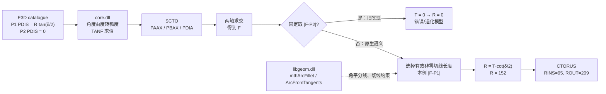

# core.dll / libgeom.dll 的 SCTO 弯头半径逆向分析报告

> 分析日期：2026-07-31  
> 工具链：IDA Professional 9.2、ida-pro-mcp 1.0.0、静态源码对照  
> 目标构件：BRAN `24381_145018` 下的 ELBO `24381_145019`

## 结论

`core.dll` 中没有一段可直接照搬的 `SCTO -> CTORUS` 网格转换函数。它负责：

1. 注册 `SCTO` noun 和相关属性；
2. 按“角度”类型计算目录表达式；
3. 通过导入表把圆弧、求交和圆角几何交给 `libgeom.dll`。

真正决定正确几何规则的原生证据位于 `libgeom.dll`：

- `mth::mthArcFillet` 使用两条切线的夹角平分线构造圆心；
- 对半径 `R` 和两条外向射线的夹角 `α`，切点退距为  
  `T = R * cot(α / 2)`；
- E3D 的弯头转角为 `δ = π - α`，因此目录中的等价规则是  
  `T = R * tan(δ / 2)`，反求半径为  
  `R = T * cot(δ / 2)`；
- `mth::ArcFromTangents` 会综合有效切线约束，不固定偏信第二条切线。

目标 ELBO 的 PDIS 只定义在 P1，P2 的 PDIS 为空并求值为 0。现有 Rust 实现固定取 P2 到交点的距离，得到 `T = 0` 和 `R = 0`，这是模型错误的直接根因。正确处理是：P2 退化到交点时使用 P1 的有效切线长度。

## 目标文件

| 文件 | 版本 | 大小 | SHA-256 |
|---|---:|---:|---|
| `core.dll` | 1.3.13.0 | 50,071,544 B | `3c1f52da4e893d939ed646b8ad91db7dabbd8307bfce66ab7f4d5ae5a419417d` |
| `libgeom.dll` | 8.300.2.0 | 498,728 B | `d48e3be5f587173f9af1d7578418ed3495c277f94a12fe071807a16f0f64f8f9` |

原始文件来自本机 E3D 3.1 安装目录；IDA 分析使用副本，未修改原始 DLL。

## core.dll 中确认的职责边界

| 地址 | 符号/函数 | 反编译证据 | 结论 |
|---|---|---|---|
| `0x057FAF50` | `sub_57FAF50` | 构造 `DB_Noun("SCTO", true)` 并写入 `NOUN_SCTO` | 这里只注册数据库 noun，不生成几何 |
| `0x059DED80` | `DBE_AngleFunction::evaluate` | 输入乘以 `π / 180` 后调用具体角函数 | E3D 角度属性以度表示，求值前转弧度 |
| `0x059C7D30` | `DBE_Tan::evaluate2` | 调用 `_libm_sse2_tan` | `TANF ... DDANGLE` 使用标准正切 |
| `0x055FD2D8` | `MBXTOR` | 对已经给出的 torus 参数求包围盒 | 不负责从 PDIS 推导半径 |
| `0x0560A4C0` | `CORNER` | 用显式半径偏移线段、求交并投影 | 证明原生圆角以切线、偏移线和交点构造 |

`mth2Arc`、`mthIntersect` 等核心几何符号在 `core.dll` 中都是指向 `libgeom.dll` 的导入。搜索整个 E3D 安装目录时，`SCTO` 字面量只出现在数据库层组件；几何库没有按 noun 名称暴露一个专用入口。

## libgeom.dll 中的正确几何

### mthArcFillet

`mth::mthArcFillet` 位于 `0x10043470`。反编译中先计算两条射线单位向量的点积：

```text
cos_alpha = dot(ray1, ray2)
inv_sin_half = 1 / sqrt((1 - cos_alpha) / 2)
tangent_setback =
    sqrt((1 + cos_alpha) / 2) * radius * inv_sin_half
```

化简后：

```text
tangent_setback = radius * cot(alpha / 2)
```

随后函数沿两条射线分别移动 `tangent_setback` 得到切点，沿角平分线移动 `radius / sin(alpha / 2)` 得到圆心，再构造 `mth3Arc` 和 `mth2Arc`。

### ArcFromTangents

二维 `mth::ArcFromTangents` 位于 `0x10044EB0`，执行顺序是：

1. 求三条候选切线的两两交点；
2. 为交点生成半角平分线；
3. 求角平分线交点作为候选圆心；
4. 用圆心到切线的垂距作为候选半径；
5. 去重并选择有效候选；
6. 将圆心投影回切线，得到圆弧起止点。

这个实现的重要语义是：使用所有有效约束构造圆弧，而不是固定使用“B 侧距离”。

## 目标 ELBO 的数值闭环

数据库和目录表达式给出：

| 项 | 值 |
|---|---|
| P1 PAXI | `-Y` |
| P1 PDIS | `TANF PARAM 3 DDANGLE` |
| P2 PAXI | `Y DDANGLE X` |
| P2 PDIS | 空，求值为 `0` |
| `PARAM 3` | `152` |
| `DDANGLE` | `89.747°` |
| `PDIA` | `114` |

`core.dll` 的角函数求值规则将 `DDANGLE` 从度转换为弧度，因此：

```text
δ = 89.747°
T = 152 * tan(δ / 2)
  = 151.33029370004164

R = T * cot(δ / 2)
  = 152

RINS = R - PDIA / 2 = 95
ROUT = R + PDIA / 2 = 209
```

P2 的位置恰好是两轴交点，所以交点到 P2 的长度为 0；这不是“零半径弯头”，而是 P2 没有额外切线退距。

## 错误路径与正确路径



## 对当前 Rust 实现的映射

共享根因位于 [`RotateInfo::cal_rotate_info`](../../../rs-core/src/prim_geo/helper.rs)：

```rust
let b_tangent_len = f_pt.length();
let tangent_len = if b_tangent_len <= dist.max(1.0) * 1.0e-5 {
    (f_pt - pt_a).length()
} else {
    b_tangent_len
};
let r = tangent_len * (PI / 2.0 - angle / 2.0).tan();
```

这里 `angle` 是弯头转角 `δ`，所以：

```text
tan(π/2 - δ/2) = cot(δ/2)
```

该最小修复保持了原有正常 B 侧数据行为，只在 B 侧退化到交点时回退到 A 侧有效切线长度。用于目标数据的可运行断言入口位于 [`check_elbo_ctorus.rs`](../../../rs-core/examples/check_elbo_ctorus.rs)。

## 复核方法

数值公式可独立复核：

```powershell
node -e "const d=89.747*Math.PI/180,R=152,T=R*Math.tan(d/2); console.log({T,recovered:T/Math.tan(d/2),rins:R-57,rout:R+57})"
```

预期输出中的 `recovered` 为 `152`、`rins` 为 `95`、`rout` 为 `209`。

在 IDA 中可按以下地址复核：

1. `core.dll:0x059DED80`：角度转弧度；
2. `core.dll:0x059C7D30`：正切求值；
3. `libgeom.dll:0x10043470`：圆角退距与角平分线；
4. `libgeom.dll:0x10044EB0`：多切线求交和候选圆心。

## 限制与下一步

- 静态分析没有找到按 `SCTO` 命名的专用几何适配器；结论来自 `core.dll` 的导入边界、`libgeom.dll` 的原生圆角实现以及目标目录数据三者的闭环。
- 本报告完成的是算法确认。Rust 示例尚需按仓库规则以非 test 方式编译运行，随后通过 `web_server` HTTP/POST 生成目标 ELBO，并在 `plant3d-web` 中截图验证最终网格。
