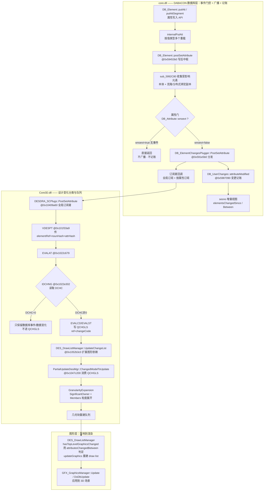
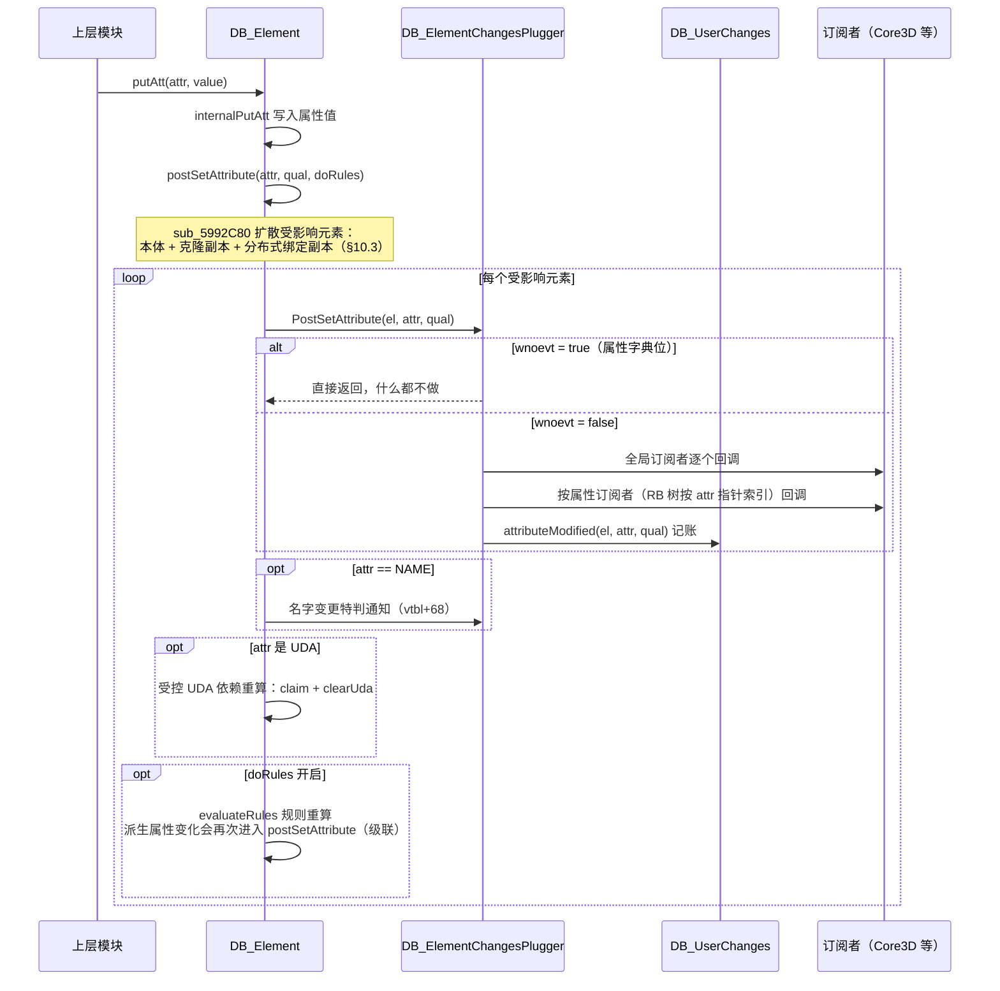
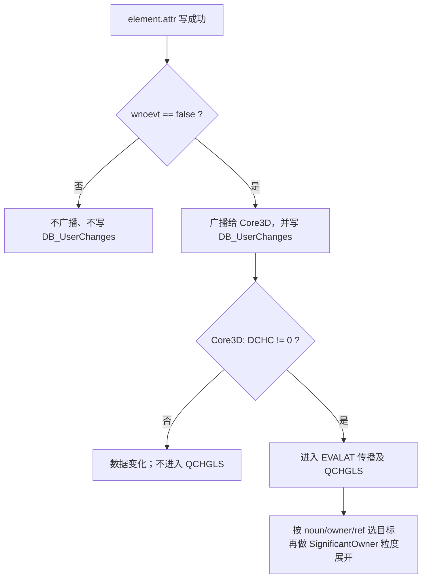
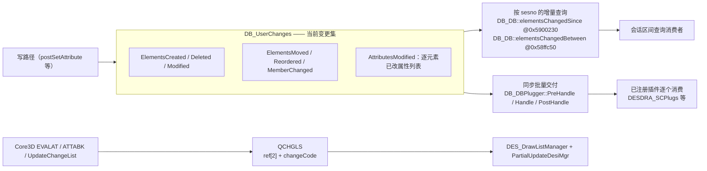
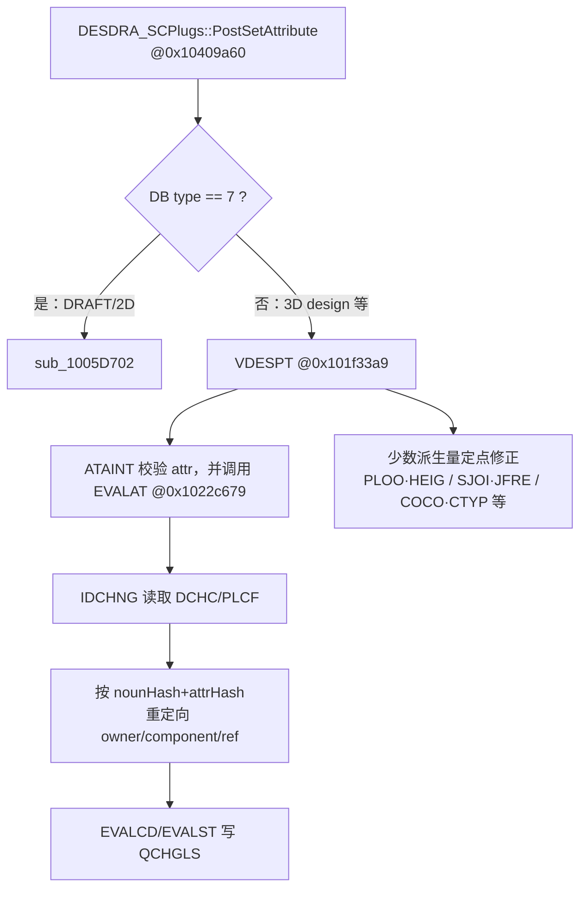
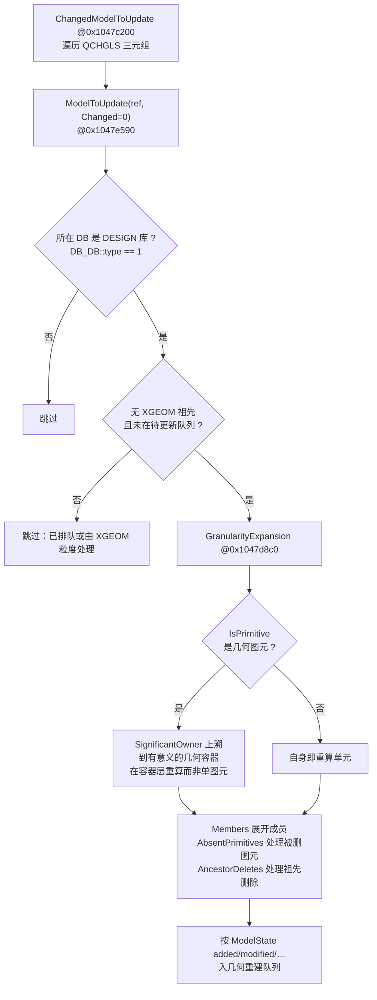
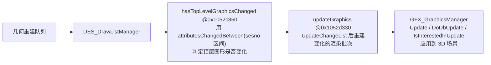
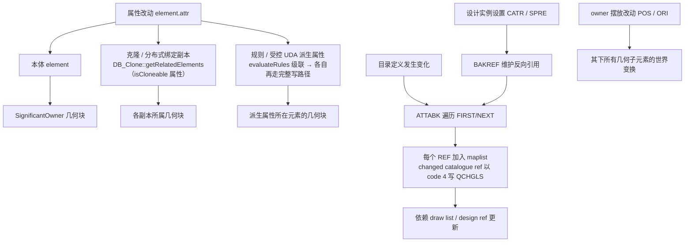

# core.dll 增量更新机制总览（流程图版）

> 本文把 AVEVA Everything3D `core.dll`（DABACON 数据库层）+ `Core3D.dll`（设计/图形消费层）的
> **属性改动 → 增量重算模型** 全链路整理成一份带流程图的文档。
> 逆向证据（反编译片段、地址、字典字段号、复现方法）见
> `docs/reverse/core_dll_noun_att_model_update.md`（下称「证据文档」，引用形如 §3）；
> 与本仓库 Rust 实现的逐层对照见 `docs/reverse/incremental_update_vs_core_dll.md`。
> 日期：2026-07-23。
>
> 证据文档与 ADR-0009 已在 2026-07-23 同步纠偏：统一采用
> `wnoevt=事件边界、DCHC/EVALAT=模型影响、noun/ref/SignificantOwner=目标与粒度`。
>
> 地址前缀约定：`core!` 表示 DABACON 数据库层 `core.dll`，`Core3D!` 表示
> 设计/图形消费层 `Core3D.dll`。证据标记中，**强**表示可由当前版本直接反编译
> 或交叉引用确认，**中**表示控制流已闭合但部分全局量/业务名仍靠语义推断，
> **待动态**表示还需运行时断点确认最终效果。
>
> **2026-07-23 纠偏**：继续下钻 `Core3D.dll::EVALAT/IDCHNG` 后，原先把
> 「是否重算」概括为 `wnoevt × geomset` 过于粗糙。`wnoevt` 只是数据库事件总闸；
> 真正进入 Core3D 设计/图形变化队列前，还会读取属性字典字段 **`DCHC`**。
> 本文以下以新链路为准。

---

## 0. 一句话总结

**「是否进入事件系统」看 `wnoevt`；「是否进入设计/图形更新队列」看属性字典 `DCHC`；「重算哪个对象、按多大粒度」再由 noun/引用关系与 `SignificantOwner` 决定。**

core.dll 自己不算几何——它做数据库事件门控、广播和 `DB_UserChanges` 记账。真正的设计变化分类、依赖扩散和几何重建由消费方 `Core3D.dll` 完成。这里有两套并行但相关的数据：

- core.dll 的 `DB_UserChanges` / sesno 历史；
- Core3D 的 legacy change list **`QCHGLS`**（三元组 `ref[2] + changeCode`）。

---

## 1. 端到端总览

三层结构：core.dll（数据库层）→ Core3D.dll（设计层）→ 图形层。



要点：

- core.dll 内搜索 `geometry/rebuildModel/makeGeom` 命名的函数为空——**几何重建不在 core.dll**（§5.2）。
- Core3D 通过 core.dll 导出 API 在运行时注册订阅。
- `DB_UserChanges` 与 `QCHGLS` 不能混为一谈：当前静态证据已经确认各自的生产/消费，
  但没有发现“把整批 `DB_UserChanges` 直接转换为 `QCHGLS`”的单一桥接函数。

---

## 2. 写路径：一次属性写入发生了什么

`putAtt` 到广播完成的完整时序（证据 §1、§2、§3、§6）：



两个容易忽略的级联源（§6）：

1. **规则/派生属性**（`desrul`/`catrul` 类）：`evaluateRules` 可产生新的属性改动，再次走完整写路径——这是 PDMS「改一个参数、一串派生属性跟着变」的根源。
2. **克隆/分布式副本**：可克隆属性（`isCloneable`）的改动通过 `DB_Clone::getRelatedElements` 扩散到所有副本，各副本独立走一遍事件与记账。

引用类属性同样受 `wnoevt` 门控，但有一个容易误判的双阶段顺序（**强**）：

1. 单引用 `core!DB_Element::internalPutAtt @0x593f220` 的关键参数是
   `(source, attr, qualifier, newTarget, doRules)`。新旧值相同会直接返回；否则先在
   `0x593f55a` 调
   `core!DB_ElementChangesPlugger::PostSetRefAttribute @0x591e720`
   （vtbl+60），完成实际写入后才在 `0x593f5cd` 调通用
   `core!DB_Element::postSetAttribute @0x59453b0`。
2. `PostSetRefAttribute(source, attr, newTarget)` 自身只在
   `!attr.wnoevt()` 时遍历引用专用订阅者；它没有 `qualifier`/`oldTarget` 参数，
   也**不调用** `DB_UserChanges::attributeModified`。由于回调发生在实际写入前，
   此时数据库中的 `source.attr` 仍是旧目标，而参数已经携带新目标；这给
   Core3D 的 `BAKREF` 提供了维护旧/新反向边所需的时序条件。
3. 引用列表 `core!internalPutAtt @0x59410c0` 同样先在 `0x5941490` 调
   `PostSetRefListAttribute @0x591e780`（vtbl+64），写入成功后在
   `0x5941548` 调通用写后中枢。
4. 随后的通用 `core!PostSetAttribute @0x591e5b0` 才完成普通订阅分发，并调用
   `core!DB_UserChanges::attributeModified @0x5987090`。

等价的伪代码顺序为：

```c
PostSetRefAttribute(source, attr, newTarget); // 写前；专用订阅者
if (write_ref(source, attr, newTarget))
    postSetAttribute(source, attr, qualifier, doRules); // 写后；通用分发 + 记账
```

因此，“引用专用回调不直接记账”是真的，但“标准引用 setter 不记属性变化”是错的。

---

## 3. 三段判定：事件、设计变化、几何粒度

### 3.1 `wnoevt`：是否产生数据库事件



`wnoevt` 是事件总闸，而不是“影响几何”的完整判据。一个属性可以
`wnoevt=false`（业务订阅者与历史都应看见），同时 `DCHC=0`（Core3D 不把它放入设计变化队列）。

### 3.2 `DCHC` / `PLCF`：Core3D 的属性影响码

`EVALAT @0x1022c679` 调 `IDCHNG @0x1022e302`；后者通过 core 导出
`ATAINT @0x58de220` 读取两个属性字典字段：

| 门 | 字典载体 | 关键字段 | 语义 |
|---|---|---|---|
| 事件门 | `DB_Attribute` | `wnoevt`（`299311034`，off 184） | 置位后不广播、不记属性变化 |
| 设计变化码 | `DB_Attribute` | **`DCHC` = `596407`**；`dchc() @0x58cf550` 返回 off 92 | `0` 跳过 QCHGLS；非零决定目标选择/传播强度 |
| plot/clash 标记 | `DB_Attribute` | **`PLCF` = `652066`**；`plcf() @0x58d2830` | 值为 1 时置 `dword_10E98500`，`UPDATD` 开头调用 `PLCDEL` |
| NOUN 几何元数据 | `DB_Noun` | `geomset` / `graphicsBehaviour` / `extrusion` | 描述 noun 的几何能力，供后续消费者判定 |

`IDCHNG` 伪代码摘要：

```c
changeCode = ATAINT(attrHash, DCHC);       // DCHC=596407
if (lookup_error) changeCode = 0;
else if (ATAINT(attrHash, PLCF) == 1) plcDeletePending = true;
return changeCode;
```

`EVALAT` 对 `REDRAW`（hash `331445106`）强制 code 4，对 `INTUBE`
（`73767168`）强制 code 1；其余属性以 `DCHC` 为起点，再按 noun、owner、
component/ref 特例决定真正入队的 ref。当前控制流只显式比较 `0..4`，
**DCHC 是「作用域路由选择器」**（完整实证与专例表见证据文档 §15）：

- `0`：NoChange，属性改动**不进** QCHGLS；
- `1`：重定向到**关联/被引用元素**（`DGETF(REF=535968)`），提升为 code 4 后入队该目标；
- `2`：**自身**重建，提升为 code 4 后入队自身；
- `3/4`：**自身 + 组件/点/owner/引用依赖闭包**传播（两者在 EVALAT 中行为等价）；
- 重复 ref 由 `EVALST` 保留更大的 change code；下游 `ChangedModelToUpdate` 传
  `ModelState=0`，**不消费**存下的 code 值。

### 3.3 NOUN / owner：决定更新目标和粒度

`geomset` 仍是权威 noun 几何元数据，但当前静态调用链**没有证据支持**
“`wnoevt × geomset` 是同一函数里的严格与门”。实际是分层消费：

- `EVALAT` 按 noun/属性硬编码特例扩散或重定向；
- `ModelToUpdate` 只接收 DESIGN DB（`DB_DB::type == 1`），排除 `XGEOM` 祖先；
- `GranularityExpansion` 用 noun 字段、`IsPrimitive`、`SignificantOwner`、`Members`
  决定块级重建。

---

## 4. 两类变化集合：`DB_UserChanges` 与 `QCHGLS`

core.dll 把「谁变了」维护成当前会话的变更集，并按 sesno 提供增量查询（证据 §5）：



- **变更单元是「元素 × 属性」**：不但知道哪个元素变了，还知道**改了哪些属性**（`AttributesModified(el, vector<DB_Attribute*>)`）。
- **增量范围按 sesno（session 号）区间**给出：`elementsChangedSince(sesno)` / `elementsChangedBetween(a, b)`——这正是本仓库 `sesno_version_anchor` + `collect_increment_eles(start..=end)` 对齐的语义。
- `core!USCHGO @0x5951020` 进入
  `DB_UserChanges::TransmitChanges @0x5986dd0`，后者同步依次调用
  `DB_DBPlugger::PreHandleUserChanges @0x591b7f0`、
  `handleUserChanges @0x591bd20`、`PostHandleUserChanges @0x591b5c0`
  （插件 vtbl `+44/+48/+52`）。它先移交并清空 `m_current`，回调重入产生的
  新变化作为下一批再次交付，不是异步任务队列；完整证据见 §6.2.3。
- `QCHGLS` 由 `sub_1022C3D7 @0x1022c3d7` 返回全局 handle
  `dword_10E98540`。`EVALCD @0x1022e020` 包装调用
  `EVALST @0x1022e0a7`：
  - 每项为两个 ref 整数加一个 change code；
  - 相同 ref 去重；
  - 新 code 更大时覆盖旧 code。
- `PartialUpdateDesiMgr::ChangedModelToUpdate` 读取每个三元组的 ref，但调用
  `ModelToUpdate(ref, 0)`，**不会把 QCHGLS change code 直接当成
  `PartialUpdateDesiMgr::ModelState`**。两套状态值不能混用。

---

## 5. 消费方 Core3D：重算什么、重算多大

### 5.1 实时属性入口：`PostSetAttribute → EVALAT`

`DESDRA_SCPlugs` 在 `Init`（`0x10409160`）向 core.dll 注册为**全局订阅者**（不逐属性订阅），接收所有过闸变更后自行分派（证据 §11.1、§11.2）：



此前“未命中特例就只交给 sesno 通用路径”的表述不准确：只要 `ATAINT`
能识别属性，VDESPT 就调用通用 `EVALAT`；特例是附加联动，不是唯一入口。

### 5.2 `UPDATD`：消费 QCHGLS 的更新入口

`Core3D!UPDATD @0x1022e5ac` 的第二个显式参数是状态字指针 `status`。
直接反编译得到的主条件分支如下（**强**）：

```c
if (plcDeletePending & 1)
    PLCDEL();

if (UQGRAF(...) & 1) {                 // 图形子系统激活
    if (!UQUCUR()) {                    // 当前不在嵌套/占用中的 update
        USCHGO(status);
        DrawListManager::updateGraphics();
        PartialUpdateDesiMgr::ChangedModelToUpdate();
        HLENIR(&QCHGLS, ...);           // 两个消费者之后清空 change list
    }
    if ((*status & 1) == 0)
        FDBUPD();                       // 状态位只门控这些后续动作
} else {
    USCHGO(status);
    IDGTCE(...);
    EVNTCE(...);                        // 此分支没有 DrawList/PartialUpdate 调用
}
```

具体地址和含义：

1. `dword_10E98500 & 1` 置位时先调导入的 `PLCDEL`；
2. 只有 `UQGRAF(...) & 1` 且 `!UQUCUR()` 时，才先经
   `Core3D!sub_1050EA70 @0x1050ea70` 取得单例并调用
   `DES_DrawListManager::updateGraphics @0x1052d330`，再经
   `Core3D!sub_1041FA10 @0x1041fa10` 从 `Resolver` 取得
   `PartialUpdateDesiMgr` 并调 `ChangedModelToUpdate @0x1047c200`；
3. 两个消费者按上述顺序完成后，`HLENIR` 清空 `QCHGLS`
   (`dword_10E98540`)；因此 PartialUpdate 能看到 DrawList 刚扩入的依赖；
4. `*status & 1` **不门控** DrawList/PartialUpdate，只门控 `FDBUPD`、
   draft/CPS 和若干后续通知；若 `UQUCUR()` 为真，本次调用内既不消费也不清空
   QCHGLS，静态语义表现为延后处理（最终何时重入为**中**证据）。

`Core3D!UPDATN @0x1022e3e7` 也会刷新 draw list，但当前静态引用中没有调用
`ChangedModelToUpdate` wrapper；两者不能简单视为同义入口。

`Core3D!DES_DrawListManager::updateGraphics @0x1052d330` 一进入就调用
`UpdateChangeList @0x1052b3c0`。后者仅在 QCHGLS 非空时按三元组步长读取直接
变化 ref，经 `sub_1062A960` 匹配注册的 draw-list 依赖，并对扩出的设计 ref
调用 `EVALCD(ref, 4)` 写回 QCHGLS（**强**）。真正触发底层图形刷新 helper
`sub_1022FCD0` 时还要求 draw list 是 global/带相应标记，并且
`DES_DrawListManager::m_suppressGraphicsUpdate == false`。

### 5.3 通用增量重建：PartialUpdateDesiMgr 粒度展开

进入 QCHGLS 后不再逐属性精算；属性精算已在 `DCHC/EVALAT` 阶段完成：



`ChangedModelToUpdate` 自身还有三个直接可见的门（**强**）：
`this+28 != 0`、`DB_Element(this+8).isOK()`、`this+29 == 0`。满足后才取得
QCHGLS，从索引 1 开始每次跨 3 项读取两个 ref 整数，并调用
`ModelToUpdate(element, 0)`；第三项 change code 不会作为 `ModelState` 传入。

粒度语义：**改一个图元 → 重算它所属的「有意义几何容器」整块**（如 EQUI 子装配、BRAN），而不是只算那一个图元，也不是全库重算。

已确认的 `ModelState` 静态入口：

- changed = `0`：`ChangedModelToUpdate`；
- new = `1`：`NewModelNotify/NewModelToUpdate @0x1047e670/0x1047e6e0`；
- deleted = `3`：`DeletedModelToUpdate @0x1047c2e0`；
- `GranularityExpansion` 对值 `4` 也有删除式分支，但尚未定位一个静态
  `ModelToUpdate(..., 4)` 调用者。

### 5.4 图形层落地



---

## 6. 引用、目录和层级的波及闭包



| 改动类型 | 波及范围 | 机制 |
|---|---|---|
| 普通几何属性 | 本体所属 significant-owner 块 | `GranularityExpansion` |
| 可克隆属性 | 全部克隆/绑定副本 | `sub_5992C80` + `DB_Clone::getRelatedElements`（§10.3） |
| 规则/UDA 驱动属性 | 派生属性所在元素（可级联） | `evaluateRules` / 受控 UDA（§6） |
| 目录/规格引用 | 反向引用实例与依赖 draw-list | `BAKREF` + `ATTABK` + maplist/QCHGLS |
| owner 摆放 | 几何子树的世界变换 | 摆放传播（§13.4） |

### 6.1 `CATR` / `SPRE` 的静态证据

1. `core.dll` 的写前回调把 `(source, attr, newTarget)` 交给
   `Core3D!DESDRA_SCPlugs::PostSetRefAttribute @0x10409be0`。该函数提取
   `sourceRef`、`source.hardType().hashValue()`、`attr.hashValue()` 和
   `newTargetRef`，传给 `VDESPF @0x101f2a27`（**强**）。此时旧目标仍可从
   `source.attr` 读取；“写前传新值、库内仍存旧值”的时序是确定事实。
2. `Core3D!VDESPF` 无条件调用 `BAKREF @0x102d4724`，关键输入可归纳为
   `(sourceRef, sourceNounHash, attrHash, newTargetRef)`。因此标量
   `CATR`（`0xDBCF9`）和 `SPRE`（`0x9D165`）无需专门分支也进入
   反向引用维护（**强**）；BAKREF 内部各业务字段的官方命名仍有部分推断。
3. 引用列表由 `Core3D!VDESFA @0x101f2d4b` 对新增/移除目标调用
   `BAKREF/BREAKF`；其排除项是 `PSARFA/PSLRFA/ALERFA` 等，不含
   `CATR/SPRE`（**强**）。
4. `BAKREF` 使用的持久字段已解码为：
   `FIRST=11547609`、`NEXT=942746`、`REF=535968`、
   `ATTA=566245`、`TYPE=642215`。
5. `Core3D!ATTABK @0x101f0dee`（trace 名 `descat/ATTABK`）的参数指向事件码；
   case 4/5 都遍历 `FIRST/NEXT`，取每个 `REF`，调用
   `MLSADD @0x10220f82` 加入 maplist；若找到反向引用，再
   `EVALCD(changedCatalogueRef, 4)`（**强**）。
6. `Core3D!VDEMPR @0x102208c7` 在
   `Core3D!DDES_WriteMngr::clearPending @0x1052f6e0` 中逐项消费 maplist；
   `Core3D!UpdateChangeList` 又会把注册依赖扩为 design ref 并写回
   QCHGLS（**强**）。

静态证据足以证明 Core3D **持久维护并枚举目录反向引用**，而不是只更新
“被直接改 CATR/SPRE 的那个实例”。但“某次 SCOM 属性修改最终让每一个
引用实例都走完整 mesh rebuild”仍需运行时断点确认；静态上能确认的是
反向引用枚举、pending/map 更新和 QCHGLS/DrawList 依赖传播。

### 6.2 删除与 owner/层级变化

层级操作不是普通属性修改；core 为删除、跨父移动、同父重排维护不同集合，
并显式把受影响 owner 纳入成员变化。

#### 6.2.1 删除

完整主链（**强**）：

```text
DB_Element::elDelete              core!0x59314d0
  → ELDEL                         core!0x5194ad1
  → LGDEL                         core!0x595d1e0
  → SCDEL                         core!0x595c9a0
  → DB_ElementChangesPlugger::PreDelete
                                  core!0x591e920
  → DB_UserChanges::elementDeleted
                                  core!0x5987b70
  → PURGE                         core!0x5194c5a
  → DREMOV（物理移除）
```

`PreDelete` 用 Plugger 偏移 `+68` 的 `preDeleteCount` 包住整次递归删除，
避免每个后代各自开启一批。`elementDeleted` 遍历
`DB_LogicalTreeDefinition`（包含根元素）：凡不是本批刚创建的根/后代均进入
`Deleted(+8)`，同时从 `Modified(+40)` 剔除；删除前的 owner 进入
`MemberChanged(+24)`。因此“元素消失”和“父容器成员集合变化”会同时保留。
`SCDEL` 成功后才由 `PURGE` 执行物理移除，记账发生在数据仍可检查的阶段。

Core3D 侧，`PartialUpdateDesiMgr::DeletedModelToUpdate @0x1047c2e0`
把 `ModelState=3` 送入 `GranularityExpansion`。
`AbsentPrimitives @0x1047be10` 为 changed/new 路径找出“不再存在于 IDList
的旧成员”；`AncestorDeletes @0x1047c060` 对 state 3/4 沿 owner 向上补入
祖先删除项（**强**）。

#### 6.2.2 跨父移动与同父重排

跨父移动的主链（**强**）：

```text
includeAfter / includeBefore      core!0x593dd50 / 0x593e090
  → INCLUD                        core!0x51959a9
  → LGMOVO                        core!0x595d370
  → SCINC1 (PreInclude, vtbl+40)  core!0x595cad0
  → DREMOV / DINSER
  → SCINCR (PostInclude, vtbl+36) core!0x595cb60
  → PostInclude                   core!0x591e470
  → elementIncluded               core!0x5987ea0
```

移动既有元素时，元素进入 `Moved(+16)`，旧 owner 与新
`owner(moved)` 都进入 `MemberChanged(+24)`。这保留了跨父移动对两棵子树的
影响，而不是只把它记成 `OWNER` 属性变化。

同父重排走另一条链（**强**）：

```text
reorderAfter / reorderBefore      core!0x594bce0 / 0x594c100
  → REORDE                        core!0x51965d6
  → SCREO1 (vtbl+44)              core!0x595ce00
  → DREMOV / DINSER
  → SCREOR (vtbl+48)              core!0x595ce80
  → PostReorder                   core!0x591e4d0
  → elementReordered              core!0x5988040
```

此时 owner 进入 `MemberChanged(+24)`，元素进入 `Reordered(+32)`；不会误记成
跨父 `Moved`。

#### 6.2.3 sesno 重建、交付与缓存边界

- `core!DB_DB::elementsChangedBetween @0x58ffc50` 在重建会话区间变化时，
  对 `ATT_OWNER` 切到旧会话取得 `oldOwner` 后调用 `elementIncluded`；
  主成员表 diff 的 `op==3` 调 `elementReordered` 并记录 `ATT_MEMB`；
  `DeletedBetween` / `InsertedBetween` 分别调用 `elementDeleted` /
  `elementCreated`。`elementsChangedSince @0x5900230` 只是以 `end=0`
  委托该函数（**强**）。
- 交付链为 `USCHGO @0x5951020` →
  `DB_UserChanges::TransmitChanges @0x5986dd0` →
  `DB_DBPlugger::{PreHandleUserChanges,handleUserChanges,PostHandleUserChanges}`
  (`0x591b7f0` / `0x591bd20` / `0x591b5c0`)，同步调用插件
  `vtbl+44/+48/+52`。它先移走并清空 `m_current`，回调重入产生的变化形成
  第二批再交付；这不是异步或通用任务队列（**强**）。
- `ELCREA/INCLUD/REORDE/CDELET` 都调用 `sub_5a34750`，清空全局
  sibling/type ordinal/count RB-tree（用途由 `0x5988fd0/0x59890d0`
  交叉确认）。`DB_DBPlugger::ClearCaches @0x591b240` 另清
  `DataPropertyCache` 并调用插件 `vtbl+20`，但已见调用点位于 sesno 会话切换、
  refresh/undo/bulk DB 操作，**不是每次层级写入**。
- 低层 `DB_Element::dabRemoveChild @0x59310b0` /
  `dabIncludeChild @0x592e860` 自身不触发 Plugger 或 `DB_UserChanges`，当前只见
  内部 `sub_5cb8300` 使用；它们不能被当成模型增量主入口（**强，限当前静态
  xref 范围**）。

---

## 7. 与 plant-model-gen 的对应（速览）

逐层详细对照（含缺口分析）见 `docs/reverse/incremental_update_vs_core_dll.md`；此处仅列映射：

| core.dll / Core3D | plant-model-gen | 状态 |
|---|---|---|
| `wnoevt` 事件门 | 没有完全等价层；sesno 数据采集、数据提交与模型筛选彼此分离 | **不是 Rust 模型白名单的对应物** |
| `DCHC` + `EVALAT` 设计变化分类 | `classify_attribute_model_impact` + `classify_modified_element` | **最接近的语义对应**；Rust 收敛为 trigger / neutral / unknown-fallback，未保留 1..4 code |
| `geomset` 等 NOUN 元数据 | `insert_change_by_noun` / `targets_from_candidates` 的 noun 名单分桶 | 只近似“直接生成目标与执行路由”，不是与 `wnoevt` 组成的严格前置与门 |
| `elementsChangedBetween(sesno)` | `collect_increment_eles(anchor+1..=end)` + `sesno_version_anchor` | 一致 |
| `DB_UserChanges::AttributesModified` | `EleOperationData` / `ModifiedElement` / `PdmsSesnoElementChange` | 原始变化层基本一致 |
| `QCHGLS(ref, changeCode)` | `IncrGeoUpdateLog` → `GenerationTargets` | 目标集合近似，但 change code、反向依赖和传播原因会丢失 |
| `DCHC=0` 数据-only | `KnownNeutral`（当前为 NAME/DESC/PURP/FUNCTION） | 语义近似；未知属性/UDA 会保守触发，不会静默跳过 |
| owner / members 结构变化 | `apply_critical_model_expansion` 补入旧/新 owner 与 children 差集 | 已部分覆盖结构波及 |
| `SignificantOwner + Members` 通用粒度 | loop 容器→owner 上溯 ≤6 层，加上述结构特例 | **仍缺通用粒度展开** |
| 克隆/CATR→实例 波及闭包 | 当前代码仅把 CATR/SPRE 作为直接影响属性；未见 SCOM→实例反查 | **缺口**（后续项） |
| 摆放传播 | 子树 `pe_transform` BFS 失效（mesh 仍整体重算） | 部分覆盖 |
| 当前批变化的同步交付 | data anchor → `model_gen_debt` → 连续欠账合并/追平 → model_gen anchor | Rust 的持久化容错扩展，不应与 `DB_UserChanges` 或 `QCHGLS` 混为一个对象 |

因此，Rust 侧也应保持三层概念分离：**原始 sesno 数据变化**、**模型影响分类**、
**生成目标/粒度扩展**。`IncrGeoUpdateLog` 是经过筛选和分桶后的模型欠账，不是
原始 `DB_UserChanges` 的同义替代。

---

## 8. 关键符号速查（精简）

完整表（含全部地址与字典字段号）见证据文档 §8、§11.6。

| 环节 | 符号 | 地址 |
|---|---|---|
| 写后中枢 | `DB_Element::postSetAttribute` | core `0x59453b0` |
| 门控+分发 | `DB_ElementChangesPlugger::PostSetAttribute` | core `0x591e5b0` |
| 属性门 | `DB_Attribute::wnoevt` | core `0x58d5290` |
| 设计变化码 | `DB_Attribute::dchc` / `plcf` | core `0x58cf550` / `0x58d2830` |
| NOUN 门 | `DB_Noun::geomset` / `graphicsBehaviour` | core `0x58d8a20` / `0x58d9760` |
| 变更记账 | `DB_UserChanges::attributeModified` | core `0x5987090` |
| sesno 增量 | `DB_DB::elementsChangedSince` / `Between` | core `0x5900230` / `0x58ffc50` |
| 波及扩散 | `sub_5992C80` / `DB_Clone::getRelatedElements` | core `0x5992c80` / `0x59ac380` |
| 删除记账 | `PreDelete` / `DB_UserChanges::elementDeleted` | core `0x591e920` / `0x5987b70` |
| 跨父移动 | `PostInclude` / `DB_UserChanges::elementIncluded` | core `0x591e470` / `0x5987ea0` |
| 同父重排 | `PostReorder` / `DB_UserChanges::elementReordered` | core `0x591e4d0` / `0x5988040` |
| 变化交付 | `DB_UserChanges::TransmitChanges` | core `0x5986dd0` |
| 事件订阅入口 | `DESDRA_SCPlugs::Init` / `PostSetAttribute` | core3d `0x10409160` / `0x10409a60` |
| 属性影响分类 | `VDESPT` / `EVALAT` / `IDCHNG` | core3d `0x101f33a9` / `0x1022c679` / `0x1022e302` |
| change list | `EVALCD` / `EVALST` / `QCHGLS` | core3d `0x1022e020` / `0x1022e0a7` / `0x1022c3d7` |
| 更新入口 | `UPDATD` / `UPDATN` | core3d `0x1022e5ac` / `0x1022e3e7` |
| 引用闭包 | `VDESPF` / `BAKREF` / `ATTABK` | core3d `0x101f2a27` / `0x102d4724` / `0x101f0dee` |
| 通用粒度 | `PartialUpdateDesiMgr::ModelToUpdate` / `GranularityExpansion` | core3d `0x1047e590` / `0x1047d8c0` |
| 图形落地 | `DES_DrawListManager::updateGraphics` / `GFX_GraphicsManager::Update` | core3d `0x1052d330` / `0x10797060` |

---

## 9. 证据强度与仍未闭合的问题

| 结论 | 强度 | 依据 / 限制 |
|---|---|---|
| `wnoevt` 只决定事件/记账 | 强 | `PostSetAttribute/Ref/List` 直接反编译 |
| 标准引用 setter 最终仍写 `DB_UserChanges` | 强 | `core!internalPutAtt` 的专用回调→实际写入→通用 postSet 顺序 |
| 引用专用回调可同时获得“库内旧值 + 参数新值” | 强（时序）/中（BAKREF 内部字段命名） | 回调在实际写入前，参数为 `newTarget`；BAKREF 持久链字段已解码 |
| `DCHC` 是 Core3D 进入设计变化队列的主属性码 | 强 | `IDCHNG` 的 `ATAINT(DCHC)` 与 `EVALAT` 的 `code==0` 分支 |
| QCHGLS 为 `ref[2]+code` 且按最大 code 去重 | 强 | `EVALST @0x1022e0a7` |
| `UPDATD` 在图形激活且 `!UQUCUR()` 时串接 DrawList→PartialUpdate→清空 QCHGLS | 强 | `UPDATD`、`sub_1050EA70`、`sub_1041FA10`、`HLENIR` 静态调用 |
| `status bit0` 不门控 DrawList/PartialUpdate | 强 | 两个消费者位于 status 判断之前；bit0 仅包围后续通知/FDBUPD |
| PartialUpdate 另有 enable/root-valid/suppress 三个门 | 强 | `ChangedModelToUpdate` 对 `this+28`、`this+8`、`this+29` 的直接分支 |
| CATR/SPRE/目录定义存在反向引用闭包 | 强（枚举）/中（最终 mesh） | BAKREF/ATTABK/maplist 已闭合；最终每实例 mesh rebuild 待动态断点 |
| 删除、跨父移动、同父重排进入不同变化集合 | 强 | `elementDeleted/Included/Reordered` 对 `Deleted/Moved/Reordered/MemberChanged` 的直接写入 |
| `TransmitChanges` 为同步插件交付且允许回调重入形成下一批 | 强 | `m_current` 移交/清空顺序与 Plugger 三阶段直接调用 |
| 低层 dab child helper 不是主增量入口 | 强（当前静态范围） | 函数自身无 Plugger/UserChanges 调用，现有 xref 仅内部维护路径 |
| `DCHC=1..4` 的**操作语义** | 强（2026-07-24 补） | 见证据文档 §15：0=NoChange、1=重定向到关联/owner(REF)、2=自身、3/4=自身+依赖闭包传播；REDRAW→4、INTUBE→1 |
| `DCHC=1..4` 的官方**枚举名** | 未知（无法静态恢复） | 二进制仅有串 `"DCHC = "` 与符号 `?dchc@…`，取值是 DDL 裸整数，无枚举名表 |
| QCHGLS 与整批 `DB_UserChanges` 的唯一桥接点 | 未知 | 两条链都已确认，但未发现单一直接转换函数 |
| `ModelState=4` 的静态入口 | 未知 | Granularity 有分支，现有静态 callers 只传 0/1/3 |

对当前 Rust 实现最重要的修正是：`attribute_affects_model` 通过
`classify_attribute_model_impact` / `classify_modified_element` 使用时，更接近
**`DCHC != 0`（再加 EVALAT 的引用/owner 传播规则）**，而不是简单等价于
`wnoevt == false`。当前实现还会让未知属性与 UDA 走 `unknown_fallback` 保守触发；
只有明确的 known-neutral 才跳过模型欠账。`wnoevt` 只适合解释 core 的事件边界，
不能用于跳过 Rust 的版本数据提交；仅导出 `wnoevt` 清单也不足以复刻 Core3D 的
增量模型判定。
