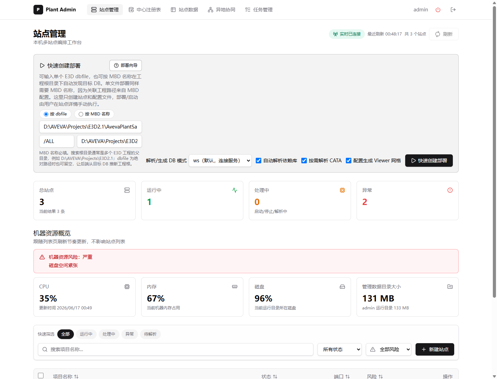
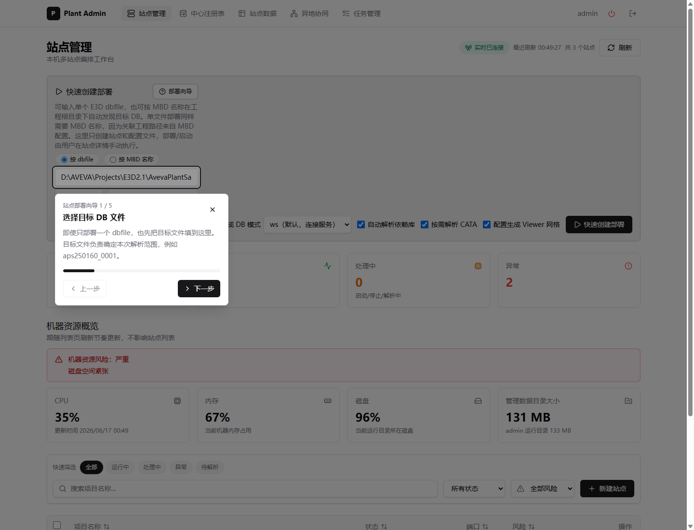
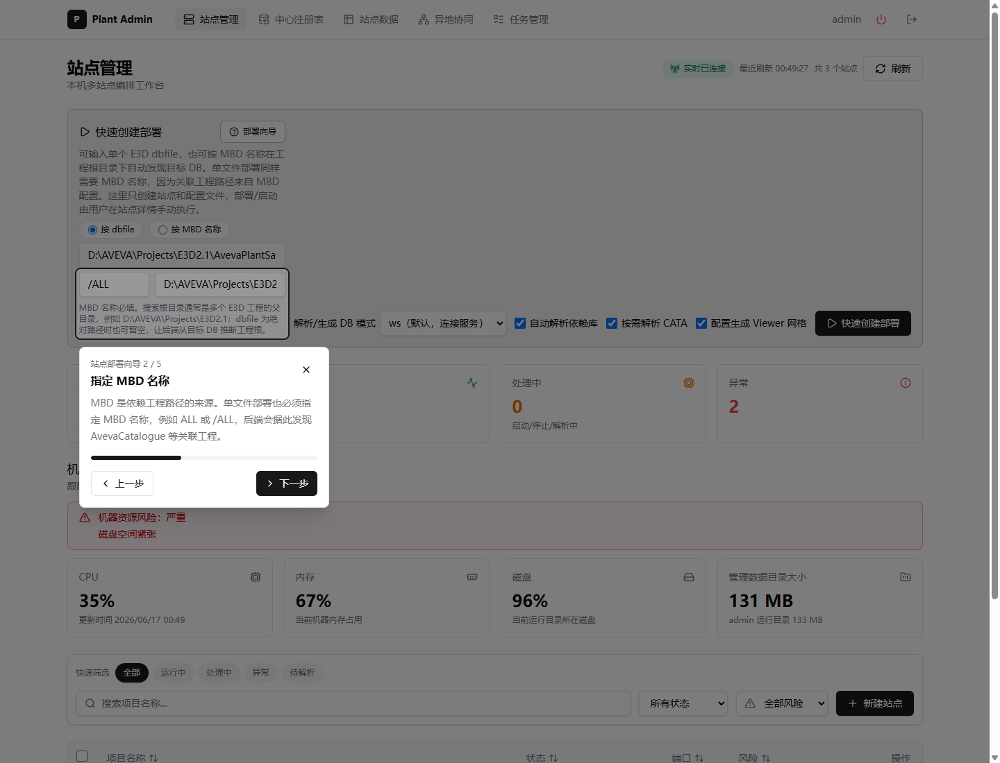
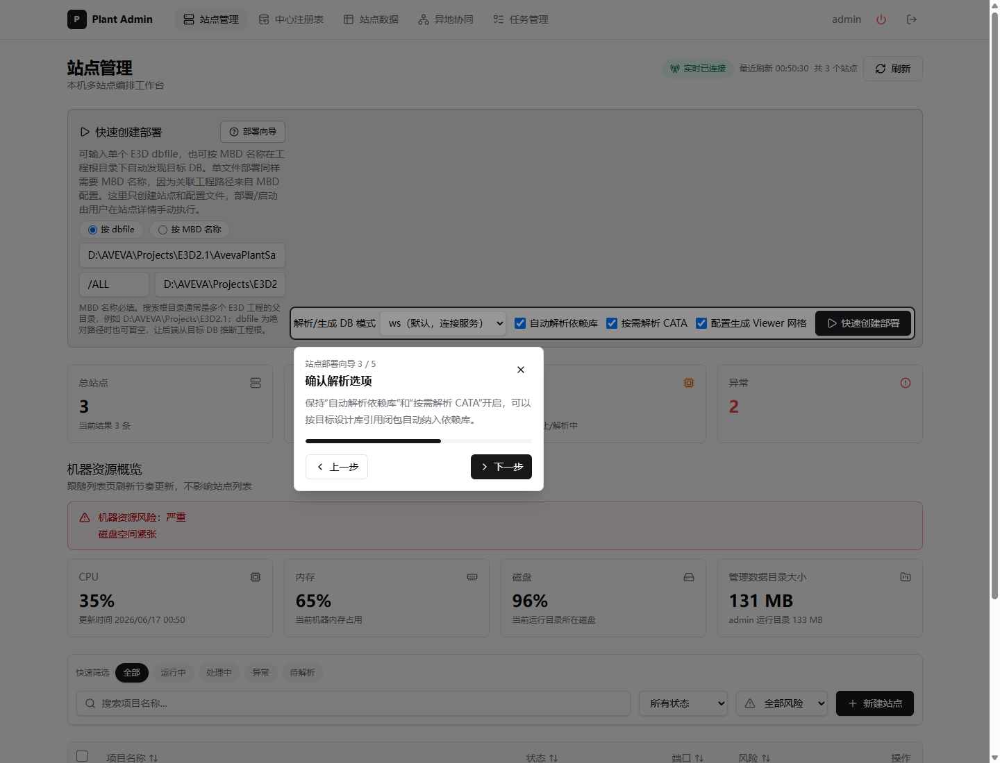
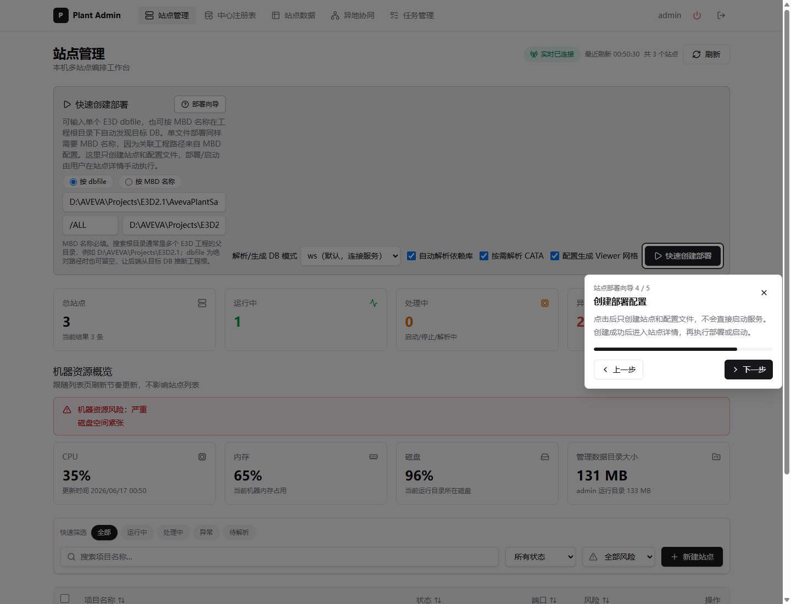
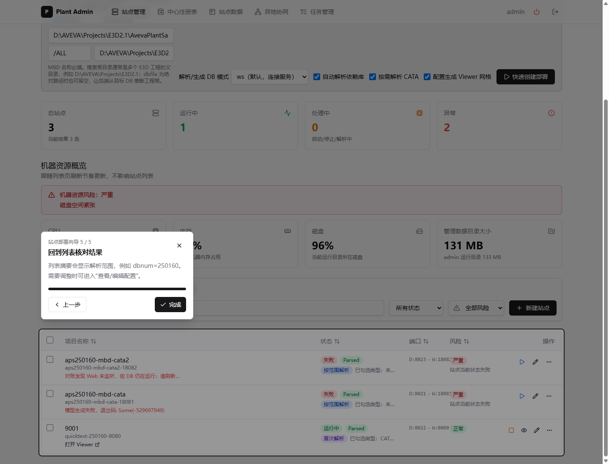
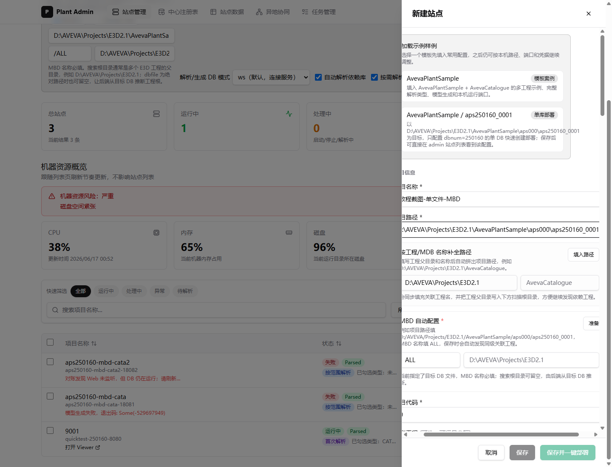

# MBD 名称自动配置站点部署教程

本教程演示如何在 Plant Admin 的“站点管理”页面，通过单个 DB 文件和 MBD 名称快速创建部署站点。即使目标只指定一个文件，例如 `D:\AVEVA\Projects\E3D2.1\AvevaPlantSample\aps000\aps250160_0001`，也必须填写 MBD 名称，因为关联项目路径（如 `D:\AVEVA\Projects\E3D2.1\AvevaCatalogue`）需要从 MBD 配置中解析。

## 前提

- 已登录 Plant Admin。
- 已进入“站点管理”页面。
- 已确认目标 DB 文件路径存在。
- 已知道对应的 MBD 名称；示例使用 `ALL`。

## 1. 打开站点部署页面

进入“站点管理”后，可以看到“快速创建部署”区域。当前页面支持两种模式：按 `dbfile` 和按 MBD 名称。



## 2. 打开部署向导

点击“部署向导”，系统会按步骤高亮需要填写或确认的区域。



## 3. 填写目标 DB 文件

在“按 dbfile”模式下，填写目标 DB 文件完整路径，例如：

```text
D:\AVEVA\Projects\E3D2.1\AvevaPlantSample\aps000\aps250160_0001
```

该文件只是部署目标入口，不代表依赖工程路径已经完整。

## 4. 填写 MBD 名称

在“MBD 名称”中填写 `ALL`。这是必填项。系统会用这个 MBD 名称解析关联工程路径和目标 DB 信息。

“搜索根目录”可以填写 `D:\AVEVA\Projects\E3D2.1`，也可以在目标 DB 文件是绝对路径时留空；推荐填写搜索根目录，便于自动发现相关项目。



## 5. 确认部署选项

确认解析/生成模式和依赖解析选项。常用设置如下：

- `解析/生成 DB 模式`：保持 `ws`。
- `自动解析依赖库`：保持开启，用于自动纳入关联库。
- `按需解析 CATA`：保持开启，只解析被目标设计库引用的 CATA 条目。
- `配置生成 Viewer 网格`：需要 Viewer 空间加载时保持开启。



## 6. 创建部署

确认目标 DB 文件、MBD 名称和选项无误后，点击“快速创建部署”。如果单文件模式下没有填写 MBD 名称，前端会禁止提交，后端创建接口也会返回错误。



## 7. 查看创建结果

创建成功后，站点会出现在下方列表中。可以继续执行完整部署、查看/编辑配置，或进入站点详情页检查运行状态。



## 8. 在站点编辑中确认 MBD 必填

在“新建站点”或“查看/编辑配置”抽屉中，如果项目路径是单个 DB 文件，MBD 名称同样会被标记为必填。保存前必须填写 MBD 名称，否则无法完成站点配置。



## 常见问题

**为什么单个 DB 文件也要填 MBD？**

因为单个 DB 文件只说明部署入口，而它依赖的工程路径、关联库和项目组合需要从 MBD 配置中推导。没有 MBD 名称，系统无法可靠知道要同时纳入哪些项目路径。

**`ALL` 会自动找到 `AvevaCatalogue` 吗？**

会。当前功能会使用指定的 MBD 名称和搜索根目录解析关联工程路径。以示例路径为入口时，`ALL` 可以用于发现 `AvevaPlantSample` 及其关联的 `AvevaCatalogue` 等项目路径。

**搜索根目录必须填写吗？**

按 MBD 名称部署时必须填写搜索根目录。按单个 DB 文件部署时，如果目标 DB 文件是绝对路径，搜索根目录可以留空；但推荐填写项目根目录以提高关联路径发现稳定性。
