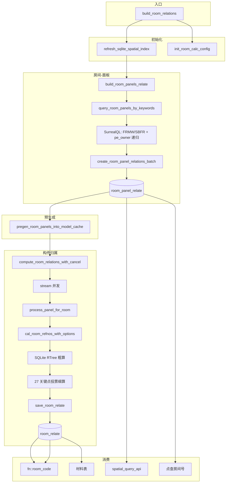
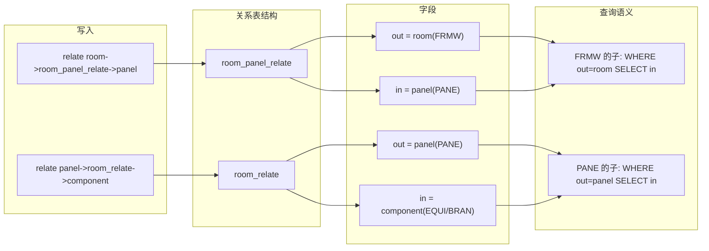
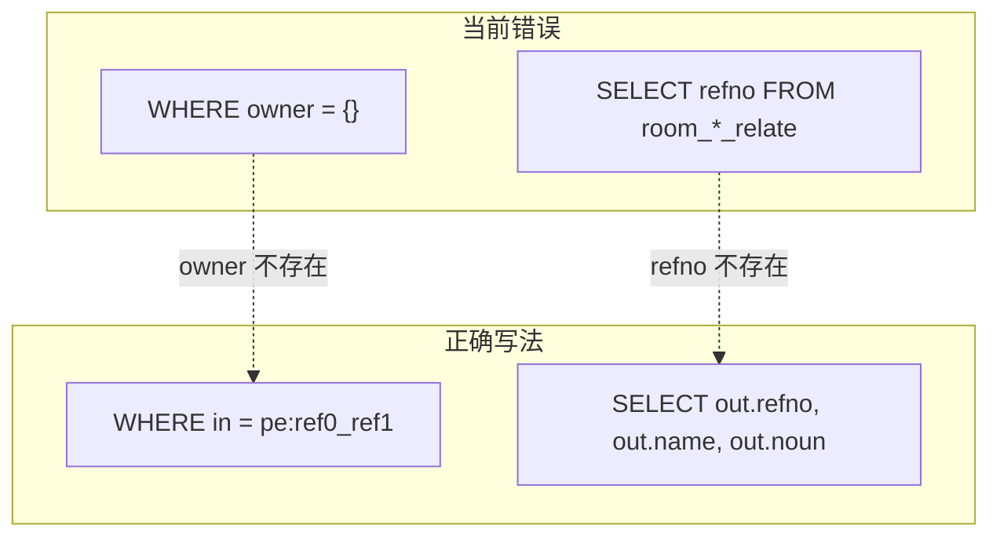

# 房间计算审核报告与流程图

## 一、问题清单

### 1. 严重：spatial_query_api 查询错误（必修）

**位置**：`plant-model-gen/src/web_api/spatial_query_api.rs` L271-286

**问题**：
- `room_panel_relate` 和 `room_relate` 使用 `owner`、`refno` 字段，但 SurrealDB 关系表标准字段为 `in` / `out`
- 关系表没有 `refno` 列，需从 `in`/`out` 引用的 pe 记录取字段

**关系表结构**（由 `relate A->table->B` 生成，SurrealDB 中 `out`=源、`in`=目标）：
- `room_panel_relate`：`out`=房间(FRMW)，`in`=面板(PANE)
- `room_relate`：`out`=面板(PANE)，`in`=构件(EQUI/BRAN...)

**正确查询**（需将 parent_refno 转为 pe_key，如 `RefnoEnum::from(RefU64(parent_refno)).to_pe_key()`）：

```sql
-- FRMW/SBFR 的子（面板）：父节点在 out，子节点在 in
SELECT in.refno, in.name, in.noun FROM room_panel_relate WHERE out = pe:xxx LIMIT 100;

-- PANE 的子（构件）：父节点在 out，子节点在 in
SELECT in.refno, in.name, in.noun FROM room_relate WHERE out = pe:xxx LIMIT 100;
```

**影响**：空间树 API 对 FRMW/SBFR/PANE 的子节点查询可能返回空或错误。

---

### 2. 中：refno 格式与 pe_key 转换

**位置**：`query_children_by_type` 中 `parent_refno: u64`

**问题**：路径参数 `refno` 解析为 u64，但关系表 `in`/`out` 需 pe record id（如 `pe:24381_145018`）。

**建议**：若 API 路径支持 `ref0_ref1` 格式，应解析为 `RefnoEnum` 并调用 `to_pe_key()`；若仅支持 u64，需确认项目中 refno 与 pe 主键的映射方式。

---

### 3. 中：fn::room_code 递归层级

**位置**：`fn_query_room_code.surql`、`fn_query_room_code_hh.surql`

**问题**：通过 `$pe<-pe_owner.in.id` 等多层递归查锚定节点，层级深时性能差。

**建议**：评估在 Rust 侧预计算 room_code 并缓存，或导入时预填。

---

### 4. 中：build_room_panels_relate 的 pe_owner 递归

**位置**：`query_room_panels_by_keywords` 的 SurrealQL

**问题**：`REFNO<-pe_owner<-pe`、`REFNO<-pe_owner<-pe<-pe_owner<-pe` 递归遍历，层级多时较慢。

**建议**：若已有 TreeIndex，可用 `collect_descendant_filter_ids(room_refno, &["PANE"], None)` 替代。

---

### 5. 低：room_relate 按 out 查询无专用索引

**问题**：材料表等按构件查房间时用 `$pe<-room_relate`（即 `in` 方向），若需 `WHERE out = ?` 则 `(in, out)` 索引可能不覆盖。

**建议**：若存在按构件反查房间的批量场景，可加 `COLUMNS out` 索引。

---

### 6. 低：room_panel_relate 方向与文档一致

**确认**：`relate room->room_panel_relate->[panels]` 生成 `in`=room，`out`=panel。`query_rooms_from_room_relate` 使用 `record::id(out)` 取房间，与 `out`=房间的语义需核对。根据 `create_room_panel_relations_batch`，实际为 `in`=room、`out`=panel，故 `out` 为房间时 `query_rooms_from_room_relate` 取 `out` 正确；但 `create_room_panel_relations_batch` 是 `relate room->...->[panels]`，即 from=room, to=panel，SurrealDB 中 `in`=from, `out`=to，所以 **in=room, out=panel**。因此 FRMW 的子（panel）应查 `WHERE in = room` 取 `out`。与上文一致。

---

## 二、主流程图



---

## 三、数据流与关系方向图



---

## 四、spatial_query_api 修复示意



**修复要点**：
1. 将 `parent_refno: u64` 转为 `pe_key`（需确认 refno 与 pe 主键的对应关系）
2. `room_panel_relate`：`WHERE out = {pe_key}`（父=房间），`SELECT in.refno, in.name, in.noun`（子=面板）
3. `room_relate`：`WHERE out = {pe_key}`（父=面板），`SELECT in.refno, in.name, in.noun`（子=构件）

---

## 五、审核结论汇总

| 优先级 | 问题 | 状态 |
|--------|------|------|
| 严重 | spatial_query_api owner/refno 错误 | 需修复 |
| 中 | refno 与 pe_key 转换 | 需确认 |
| 中 | fn::room_code 递归 | 可优化 |
| 中 | build_room_panels_relate 递归 | 可优化 |
| 低 | room_relate out 索引 | 可选 |
| 低 | RELATE 语法 | 保持现状 |
