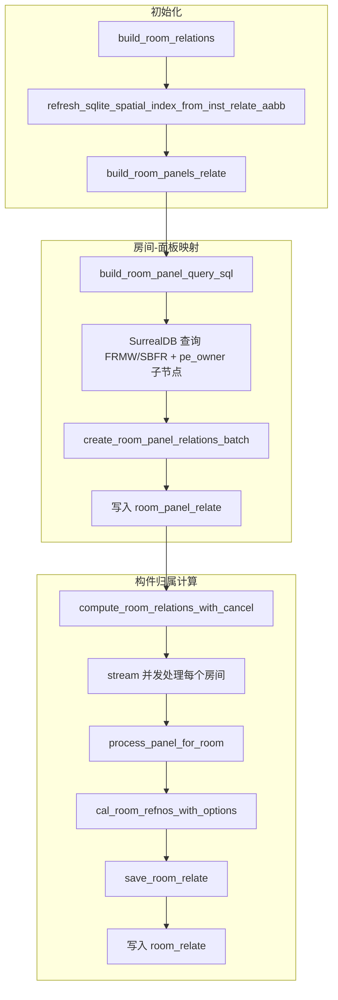
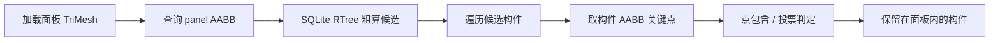
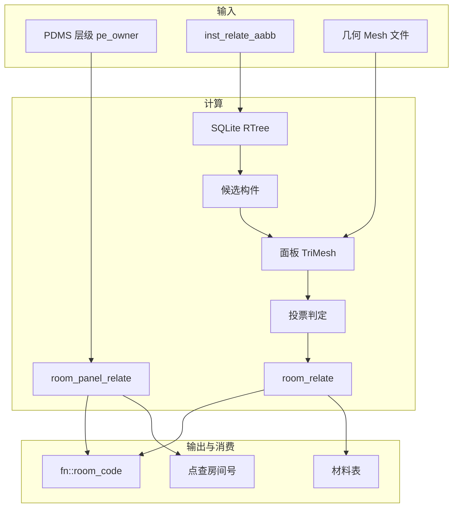

# 房间计算流程分析

## 1. 概述

房间计算用于确定**构件（EQUI、BRAN、PIPE 等）与房间（FRMW/SBFR）的空间归属关系**，并将结果写入 SurrealDB 的 `room_relate` 和 `room_panel_relate` 表，供材料表、空间查询、fn::room_code 等使用。

---

## 2. 数据模型

### 2.1 核心关系表

| 表名 | 方向 | 含义 | 字段 |
|------|------|------|------|
| **room_panel_relate** | FRMW/SBFR → PANE | 房间包含哪些面板 | `in`=面板, `out`=房间, `room_num` |
| **room_relate** | PANE → 构件 | 面板内包含哪些构件 | `in`=面板, `out`=构件, `room_num`, `confidence` |

### 2.2 层级结构

```
FRMW/SBFR (房间)
    └─ pe_owner → PANE (面板)
        └─ room_panel_relate: out=FRMW, in=PANE, room_num
        └─ room_relate: in=PANE, out=构件(EQUI/BRAN/...), room_num
```

- **room_panel_relate**：房间 ↔ 面板，由 `build_room_panels_relate` 根据 PDMS 层级（FRMW→SBFR→PANE）和关键词（room_keyword）建立
- **room_relate**：面板 ↔ 构件，由空间几何计算（点在体内/投票）建立

---

## 3. 主流程：build_room_relations

入口：[`plant-model-gen/src/fast_model/room_model.rs`](plant-model-gen/src/fast_model/room_model.rs) 中的 `build_room_relations` / `build_room_relations_with_cancel`



### 3.1 步骤详解

| 步骤 | 函数 | 作用 |
|------|------|------|
| 1 | `refresh_sqlite_spatial_index_from_inst_relate_aabb` | 从 SurrealDB `inst_relate_aabb` 刷新 SQLite RTree 空间索引 |
| 2 | `build_room_panels_relate` | 按 room_keyword 查询 FRMW/SBFR，获取其下 PANE 子节点，建立房间→面板映射 |
| 3 | `create_room_panel_relations_batch` | 批量 `RELATE` 写入 `room_panel_relate` |
| 4 | `pregen_room_panels_into_model_cache` | 预生成面板几何到 model cache（可选） |
| 5 | `compute_room_relations_with_cancel` | 对每个房间的每个面板调用 `process_panel_for_room` |
| 6 | `cal_room_refnos_with_options` | 空间粗算 + 几何细算，得到“在面板内”的构件集合 |
| 7 | `save_room_relate` | 批量 `RELATE` 写入 `room_relate` |

---

## 4. 房间-面板映射：build_room_panels_relate

### 4.1 查询逻辑

- 使用 `aios_core::room::query_v2::query_room_panels_by_keywords` 或等效 SurrealQL
- 项目类型：
  - **project_hd**：`FRMW` + `match_room_name_hd`（如 `A001`）
  - **project_hh**：`FRMW` + `match_room_name_hh`
  - 默认：`SBFR` + 任意房间号

### 4.2 SQL 示例（HD 项目）

```sql
select value [id, array::last(string::split(NAME, '-')),
    array::flatten([REFNO<-pe_owner<-pe, REFNO<-pe_owner<-pe<-pe_owner<-pe])[?noun='PANE']
] from FRMW where '关键词' in NAME
```

### 4.3 写入 room_panel_relate

```sql
relate <room_pe_key>->room_panel_relate->[<panel_pe_keys>] set room_num='<room_num>';
```

---

## 5. 构件归属计算：cal_room_refnos_with_options

### 5.1 流程



### 5.2 粗算（空间索引）

- 使用 `SqliteSpatialIndex::query_intersect(&panel_aabb)` 查询与面板 AABB 相交的构件
- 地板式薄面板：对 Z 方向做外延（`Floor2dConfig`），避免漏掉地板上方构件
- 排除：`exclude_panel_refnos`（面板自身）、`exclude_refnos`

### 5.3 细算（几何判定）

- 加载面板 TriMesh（`load_geometry_with_enhanced_cache`）
- 对每个候选构件：
  - 取 AABB 的 27 个关键点（8 角点 + 12 棱中点 + 6 面心 + 体心）
  - 使用 `is_geom_in_panel`：**超过 50% 关键点在面板 TriMesh 内**则判定为“在房间内”
- 地板 2D 模式（`Floor2dConfig`）：可只考虑 XY 平面投影

### 5.4 写入 room_relate

```sql
relate <panel_pe_key>->room_relate:<panel>_<component>-><component_pe_key>
  set room_num='<room_num>', confidence=0.9, created_at=time::now();
```

---

## 6. 查询与消费

### 6.1 fn::room_code（SurrealDB 函数）

- 定义于 `resource/surreal/fn_query_room_code.surql`、`fn_query_room_code_hh.surql`
- 逻辑：根据 PE 类型（EQUI/BRAN/SUPPO/ZONE 等）找到对应的“锚定节点”，再查 `$pe<-room_relate` 取 `room_num`
- 用于材料表、属性展示等

### 6.2 点查房间号

- `aios_core::room::query::query_room_number_by_point`（SQLite）
- `aios_core::room::query_v2::query_room_number_by_point_v2`（混合索引）
- 流程：空间索引查候选面板 → 加载 TriMesh 做点包含 → 查 `room_panel_relate` 取 `room_num`

### 6.3 房间内构件查询

- `query_elements_in_room_by_spatial_index`：根据面板 AABB 做空间相交，再排除指定 noun
- 材料表：`($pe<-room_relate.room_num)[0]`

---

## 7. 相关模块与配置

| 模块/文件 | 作用 |
|-----------|------|
| `rs-core/src/room/` | 房间查询、算法、数据模型、迁移 |
| `plant-model-gen/src/fast_model/room_model.rs` | 房间计算主逻辑 |
| `plant-model-gen/src/fast_model/room_worker.rs` | 后台任务队列（RebuildAll / RebuildByRoomNumbers / IncrementalUpdate） |
| `DbOption.room_keyword` | 房间关键词（如 `-RM`、`-R-`） |
| `gen_spatial_tree` | 是否生成空间树（影响 SQLite 索引） |
| `AIOS_ROOM_USE_CACHE` / `AIOS_ROOM_FORCE_CACHE` | 几何缓存开关 |
| `Floor2dConfig`（环境变量） | 地板 2D 模式、Z 外延等 |

---

## 8. 任务类型（RoomWorker）

| 任务类型 | 说明 |
|----------|------|
| RebuildAll | 全量重建：`build_room_relations_with_cancel` |
| RebuildByRoomNumbers | 按房间号重建：`rebuild_room_relations_for_rooms_with_cancel` |
| IncrementalUpdate | 增量更新：`update_room_relations_incremental_with_cancel` |

---

## 9. 数据流小结



---

## 10. 关键依赖

- **SQLite RTree**：`spatial_index.sqlite`，由 `import-spatial-index` 等流程从 `inst_relate_aabb` 生成
- **几何缓存**：`output/<project>/instance_cache/`，L0 精度 mesh
- **SurrealDB**：pe、pe_owner、inst_relate_aabb、room_relate、room_panel_relate
