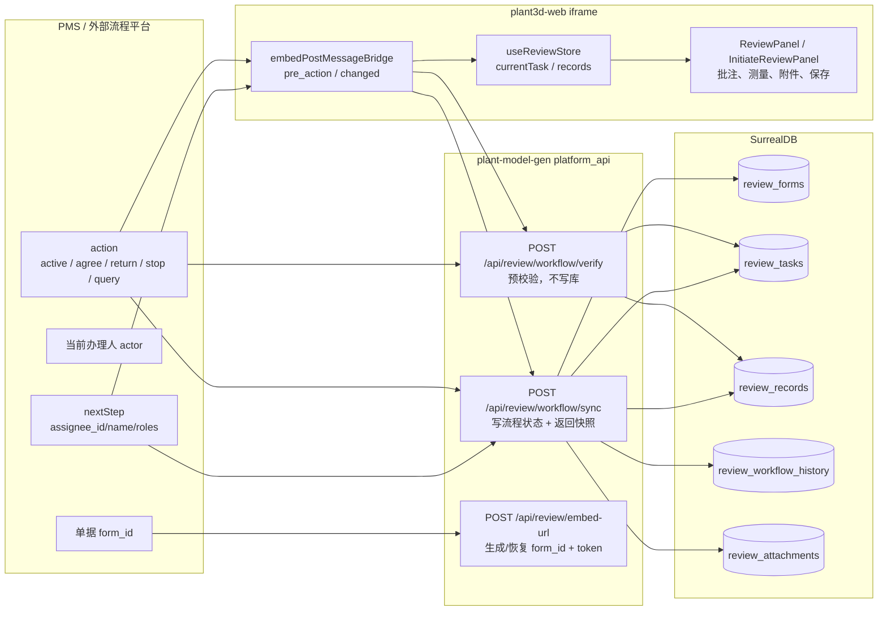
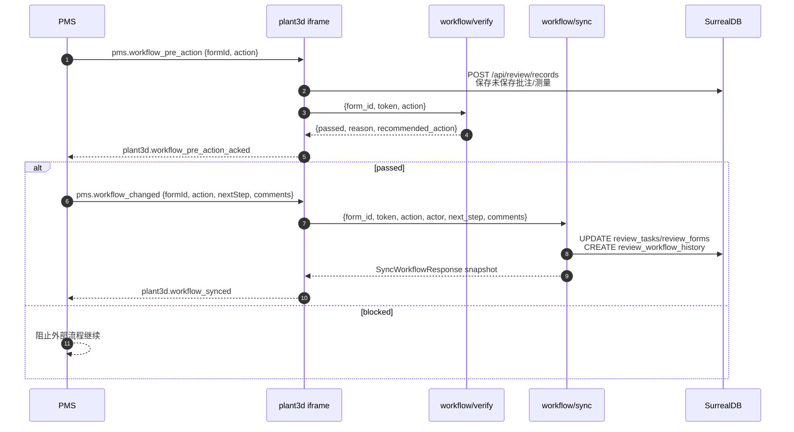

# 三维校审外部流程架构说明

> 当前版本：2026-05-14  
> 适用范围：PMS 外部流程驱动下的三维校审嵌入、数据保存、流程预校验、流程同步与回读。  
> 关键原则：**PMS 是流程事实源，Plant3D 是三维校审数据与展示事实源。**

## 1. 架构定位

三维校审当前默认运行在外部流程模式：

- PMS 负责单据状态、流程动作、当前办理人、下一节点与下一办理人。
- Plant3D 负责三维模型选择、批注、云线、测量、附件、确认记录、任务快照、历史展示。
- `workflow/verify` 是外部流程动作的预校验接口，不写库。
- `workflow/sync` 是外部流程动作的写入与快照回读接口。
- 前端 `postMessage` bridge 只负责和 PMS 协调自动保存、预校验与同步结果，不拥有流程推进决策权。

可视化图源：

- `docs/架构文档/三维校审-diagrams/13-external-workflow-architecture.mmd`
- `docs/架构文档/三维校审-diagrams/14-external-workflow-sequence.mmd`
- `docs/架构文档/三维校审-diagrams/15-external-contract-boundaries.mmd`

## 2. 系统边界



## 3. 事实源原则

| 主题 | 事实源 | Plant3D 允许做什么 | Plant3D 不应做什么 |
|---|---|---|---|
| 当前流程节点 | PMS / `workflow/sync` 入参与后端状态 | 展示 `currentNode/taskStatus`，校验节点合法性 | 自行决定下一节点 |
| 下一办理人 | PMS `nextStep.assignee_id` | 接收、透传、记录、展示 | 用本地 task 字段补全办理人 |
| 下一角色 | PMS `nextStep.roles` | 校验是否为 `sj/jd/sh/pz` | 按 action/currentNode 推导 roles |
| 驳回原因 | PMS `comments` 或显式原因 | 写入 `return_reason` 和 history comment | 因批注状态阻止 return |
| 批注与测量 | Plant3D `review_records` | 保存、聚合、回传给 PMS | 代表 PMS 改变流程 |
| 预校验结果 | Plant3D `workflow/verify` | 返回 passed/reason/recommended_action | 写 `review_tasks/review_forms` |

## 4. 外部流程操作契约

### 4.1 embed-url

PMS 打开 Plant3D 前调用：

```http
POST /api/review/embed-url
Content-Type: application/json

{
  "project_id": "AvevaMarineSample",
  "user_id": "JH",
  "user_name": "校核员",
  "role": "jd",
  "form_id": "FORM-xxx",
  "token": "<PMS S2S token>"
}
```

输出用于 iframe URL：

- `form_id`
- `user_token`
- `workflow_mode=external`（默认 external；即使不传也按 external 理解）

### 4.2 workflow/verify

verify 是预校验，不消费 `nextStep`，不写库：

```http
POST /api/review/workflow/verify
Content-Type: application/json

{
  "form_id": "FORM-xxx",
  "token": "<embed-url 返回的 user_token 或平台约定 token>",
  "action": "agree"
}
```

当前规则：

- `active`：允许在 `sj` 节点预校验。
- `agree`：允许在 `sj/jd/sh/pz` 节点预校验；会根据批注状态判断是否可继续。
- `return`：允许在 `jd/sh/pz` 节点预校验；**不检查批注状态**。
- `stop`：允许在 `jd/sh/pz` 节点预校验；不检查批注状态。

### 4.3 workflow/sync

sync 是真正的外部流程写入入口。凡是会改变流程的动作，必须由 PMS 显式传 `next_step`：

```http
POST /api/review/workflow/sync
Content-Type: application/json

{
  "form_id": "FORM-xxx",
  "token": "<token>",
  "action": "return",
  "actor": { "id": "JH", "name": "校核员", "roles": "jd" },
  "next_step": { "assignee_id": "SJ", "name": "设计人员", "roles": "sj" },
  "comments": "存在问题，退回修改",
  "metadata": { "source": "pms.workflow_changed" }
}
```

约束：

- `active` 必须传 `next_step.roles = "jd"`。
- `agree` 在非 `pz` 节点必须传下一节点 `next_step`。
- `return` 必须传位于当前节点之前的 `next_step`。
- `stop` 不需要 `next_step`。
- `query` 不写库，只按 `form_id` 回读快照。
- `targetNode` 只能作为诊断/兼容字段，不应作为补全 `next_step` 的依据。

## 5. 前端 postMessage bridge

PMS 与 iframe 的协作分两步：

1. `pms.workflow_pre_action`
   - Plant3D 自动保存当前未保存的批注/测量。
   - 调 `workflow/verify` 做预校验。
   - 返回 `plant3d.workflow_pre_action_acked`。
2. `pms.workflow_changed`
   - PMS 已确认流程动作。
   - Plant3D 调 `workflow/sync` 写入状态并回读快照。
   - 返回 `plant3d.workflow_synced`。



## 6. 当前必须遵守的设计原则

1. **外部流程不由前端推导**  
   external 模式下不得通过 `currentTask.currentNode`、`targetNode`、`action` 推导 `nextStep`。缺少 `nextStep` 时应返回明确错误，让 PMS 补齐入参。

2. **return 不检查批注状态**  
   驳回本身就是带问题退回设计，不能因为批注状态不满足而阻止 return。`return` 仍需满足节点合法性、目标节点位于前序节点等流程规则。

3. **verify 不写库，sync 才写库**  
   PMS 应按 `verify -> sync -> query/回读` 的顺序集成。

4. **form_id 是跨系统主键**  
   任务、记录、附件、评论、工作流历史都必须能按 `form_id` 聚合。

5. **postMessage 必须有来源边界**  
   bridge 应限制可信 PMS origin，响应不应长期使用 `*`。

6. **同步后要刷新本地任务快照**  
   `workflow/sync` 成功后，iframe 内的 `currentTask/currentNode/status` 必须与后端快照一致，避免下一次动作基于旧状态运行。

## 7. 推荐代码收敛点

| 优先级 | 模块 | 收敛点 |
|---|---|---|
| P0 | `workflow_sync.rs` | 明确 external 下 owner / actor / token claims 的权限边界，并更新注释与测试 |
| P1 | `embedPostMessageBridge.ts` / `DockLayout.vue` | 引入可信 origin 配置，响应使用 `event.origin` |
| P1 | `useReviewStore.ts` | external 模式取消本地 `nextStep` fallback |
| P2 | `useReviewStore.ts` | `workflow/sync` 成功后刷新 `currentTask` 与确认记录/历史 |
| P2 | docs/tests | 更新 return 不查 annotation_check 的契约文档和回归验证 |

## 8. 验收口径

最小闭环：

1. PMS 调 `embed-url` 打开 iframe。
2. SJ 在 iframe 保存编校审单数据，不触发内部提交流转。
3. PMS 发 `workflow_pre_action(active)`，Plant3D 自动保存并 verify。
4. PMS 发 `workflow_changed(active, nextStep=jd)`，Plant3D 调 sync。
5. JH 打开同一 `form_id`，能看到 SJ 保存的数据。
6. JH 保存问题批注后，PMS 发 `workflow_pre_action(return)`，verify 不因批注状态阻断。
7. PMS 发 `workflow_changed(return, nextStep=sj)`，后端写回 `current_node=sj` 与 `return_reason`。
8. SJ 重新打开同一 `form_id`，能看到退回原因、批注与处理入口。
