# 三维校审流程 · 批注 · 历史 · 对话 —— 开发文档

> 审核范围：`plant-model-gen/src/web_api/review_api.rs`、`plant-model-gen/src/web_api/platform_api/*`、`plant-model-gen/src/web_api/jwt_auth.rs`、`plant3d-web/src/api/reviewApi.ts`、`plant3d-web/src/components/review/*`、`plant3d-web/src/composables/useReviewStore.ts`、`useToolStore.ts` 等。
>
> 目标读者：要改动三维校审模块的前/后端工程师；需要与 PMS 对接的集成方；复核 RBAC / 软删 / 幂等语义的审阅者。
>
> 本文图表使用 Mermaid 直接内嵌，通过 `mermaid` 技能 `validate.sh` 验证全部通过；如需导出 SVG/PNG 可执行 `./tools/validate.sh 01-architecture.mmd out.svg`。

---

## 1. 能力总览

| 能力域 | 关键实体 | 前端载体 | 后端入口 | 数据表 |
|--------|---------|---------|---------|--------|
| 提资单生命周期 | `ReviewTask` (4 节点 × 6 状态) | `InitiateReviewPanel`、`ReviewPanel` | `review_api.rs::create_task/submit_to_next_node/return_to_node/...` | `review_tasks` |
| 批注对话（评论线程） | `AnnotationComment` + 回复 | `ReviewCommentsTimeline.vue` | `review_api.rs::create_comment/get_comments_by_annotation/...` | `review_comments` |
| 批注处理与严重度 | `AnnotationReviewState`、`AnnotationSeverity` | `ReviewCommentsTimeline.vue`、`useToolStore` | `update_annotation_severity` (桩) | 目前内嵌到 `review_records.annotations` |
| 确认快照 | `ConfirmedRecord`（批注 + 测量一次打包） | `ReviewPanel/ConfirmedRecordsSection` | `review_api.rs::create_record/get_records_by_task/...` | `review_records` |
| 工作流历史 | `WorkflowStep` / 节点时间线 | `TaskReviewDetail.vue`、`WorkflowStepBar.vue` | `get_workflow_history/get_task_history` | `review_workflow_history` |
| 附件 | `ReviewAttachment` + `assets/` 文件 | `FileUploadSection` / `reviewAttachmentFlow.ts` | `upload_attachment/delete_attachment` | `review_attachments` (+ 文件) |
| 辅助数据 | 碰撞/质量/OT | `ReviewAuxData`、`CollisionResultList` | `review_integration.rs` | 外部 PMS 数据源 |
| PMS 集成 | iframe + S2S | 嵌入 URL + `workflowMode.ts` | `platform_api/*` | `review_forms`（对齐外部单据） |

---

## 2. 系统架构（前后端 + 数据层 + 外部系统）

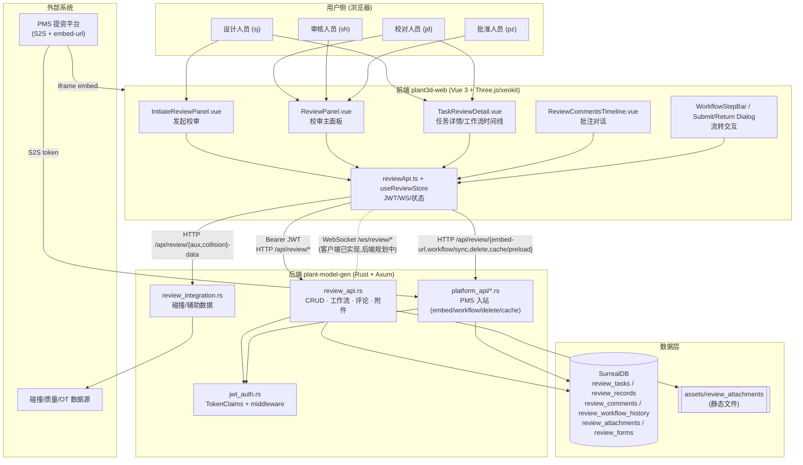

### 关键观察

- **单入口 Router**：`create_review_api_routes()` 把所有 `/api/review/*` 路由挂在同一个 `Router` 并一次性套用 `review_auth_middleware` — 见 `review_api.rs:1008-1077`。
- **PMS 面 API 独立**：入站走 `create_platform_api_routes()`（`platform_api/mod.rs`），避免与用户态 JWT 混用；S2S token 在 `platform_api::auth::verify_s2s_token` 完成。
- **前端没有 Pinia，一律使用 Composable ref + 模块级 singleton**：`useReviewStore.ts` 顶层声明 `const confirmedRecords = ref<ConfirmedRecord[]>([])` 是整个应用共享的响应式状态。跨页面需要"全局单例"语义时要留意 HMR / 测试替换。
- **WebSocket 前端先行、后端未实装**：`useReviewStore.connectWebSocket(userId)` 已经连接 `/ws/review/user/{userId}` 并实现重连/心跳/消息分派；但后端当前没有对应路由（`web_server/mod.rs` 未挂接 `/ws/review`）。属于**已知缺口**，见 §12。

---

## 3. 前端组件树与 Composable 分层

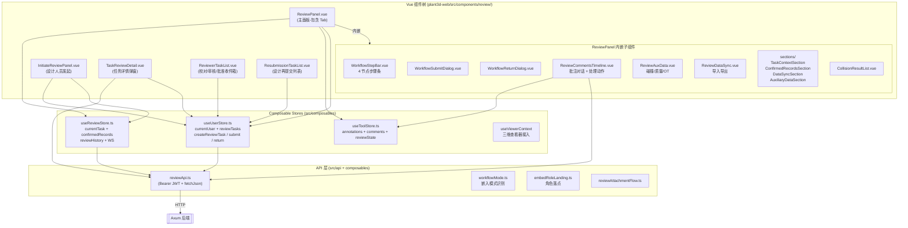

### 组件职责（速览）

| 组件 | 关键职责 | 主要数据源 |
|------|---------|-----------|
| `InitiateReviewPanel` | 设计人员在三维场景圈选 → 填单 → 上传 → 创建任务 → 立即 `submitToNext('发起提资')` | `useUserStore.createReviewTask`、`reviewAttachmentFlow` |
| `ReviewPanel` | 在校审工作区内：步骤条、批注列表、确认快照、对话、辅助数据、导入导出 | `useReviewStore.currentTask`、`useToolStore.annotations*`、`reviewPanelActions.ts` |
| `TaskReviewDetail` | 弹窗详情：完整任务信息 + 工作流时间线 + 已确认测量回放；支持"再次提交"（canonical returned task） | `reviewTaskGetWorkflow`、`reviewRecordGetByTaskId` |
| `ReviewCommentsTimeline` | 批注级对话 + 设计"处理" + 校对审核"决定"，合并 `AnnotationComment` 与 `AnnotationReviewEvent` 成同一时间线 | `reviewCommentGetByAnnotation/Create/Update/Delete`、`useToolStore.applyAnnotationReviewAction` |
| `WorkflowStepBar` | 4 节点可视化（已完成 / 当前 / 未开始） | props.currentNode |
| `WorkflowSubmitDialog` / `WorkflowReturnDialog` | 流转动作确认（驳回强制填写 reason） | emits confirm |
| `ReviewerTaskList` / `ResubmissionTaskList` | 角色相关的"收件箱"列表 | `useUserStore.reviewTasks` |

---

## 4. 工作流状态机（任务级 4 节点 × 6 状态）

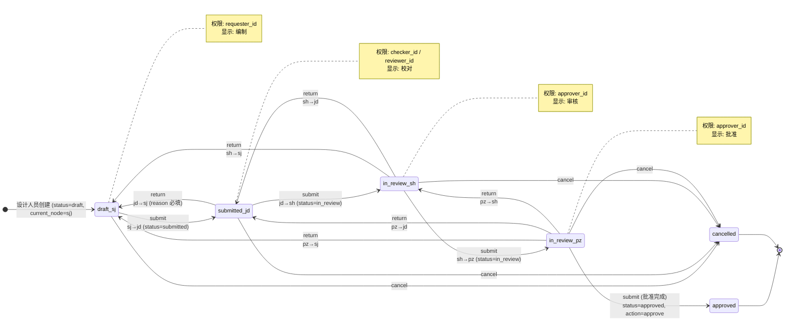

### 事实核对（定义与默认值）

- 节点顺序常量 `WORKFLOW_NODES = ["sj", "jd", "sh", "pz"]`（`review_api.rs:118`）。
- 默认字段：`default_status() = "draft"`（L206）、`default_current_node() = "sj"`（L202）。
- `submit` 到下一节点时的状态映射：`jd → submitted`；`sh/pz → in_review`；`current=pz` 时特殊处理为 `approved + action=approve`（L2891-2902）。
- `return` 只允许向"前序节点"（`can_return_to` L2785-2792），且 `return_reason` 必填。

> ⚠️ 与旧版文档差异：`llmdoc/architecture/review-system-enhancement.md` 里描述的"`rejected (可驳回到任意前序节点)`"路径在实现中并不改写 `status=rejected`，而是改写为目标节点状态（`draft` / `submitted` / `in_review`）+ `return_reason`。`rejected` 只出现在 `reject_task` 的旧兼容 API 上。

---

## 5. RBAC 矩阵（节点 → 能做什么）

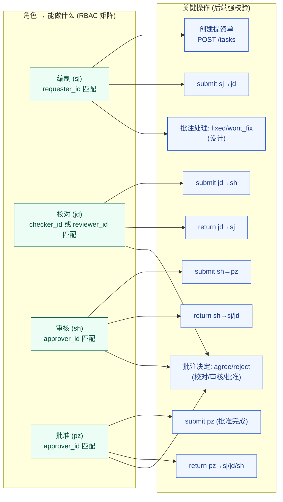

> 权限的 ground truth：`submit_to_next_node` 的 `has_permission` match (L2846-2857) 与 `return_to_node` 的相同段（L3067-3074）。批注动作权限校验在前端 `ReviewCommentsTimeline.vue` 的 `canDesignHandle/canReviewDecide/canDecisionAct` computed。

---

## 6. 数据模型（SurrealDB + 内嵌 JSON）

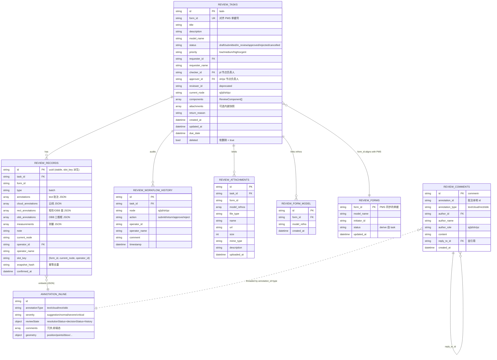

### 几个容易误读的点

- **`ANNOTATION_INLINE` 不是一张真实表**：它是一组 JSON 对象，存在于 `review_records.annotations/cloud_annotations/...` 这几个数组字段里。**批注本身没有独立表**。
- **评论与批注是"通过业务 id 关联"**：`review_comments.annotation_id` 存的是前端生成的批注 id（如 `annotation_1712345678_abc123`），不是 SurrealDB record id，所以不能用外键约束，只能靠应用层一致性。
- **`reviewer_id` / `reviewer_name`**：历史字段，语义等同 `checker_*`。前端 `reviewApi.ts::normalizeReviewTask` 做兼容 fallback：`checkerId = checker_id || reviewer_id`。新代码禁止再向 `reviewer_id` 写入业务语义。
- **软删过滤**：所有 `review_tasks` 查询都带 `(deleted IS NONE OR deleted = false)` 过滤条件。`review_api.rs` 开头的文档注释明确声明需与 `platform_api::REVIEW_TASK_ACTIVE_SQL` 保持一致，注意跨文件修改。

---

## 7. 发起校审（设计人员 → submit 到 jd）

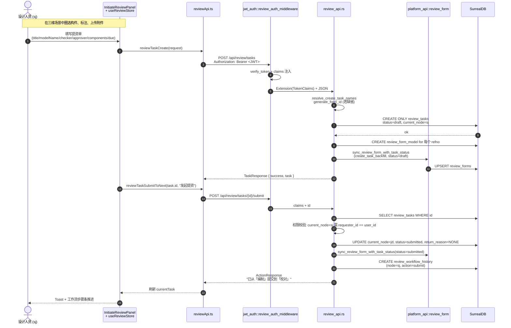

**常见陷阱**

1. `form_id` 既可外部传入（PMS 场景）也可后端生成。**外部传入优先**，前端 `InitiateReviewPanel.handleSubmit` 会判断 `embedModeParams.isEmbedMode` 决定是否强制 `requestFormId`。
2. 附件路径复杂：`InitiateReviewPanel` 先创建任务 → `uploadSectionRef.startUpload({taskId, formId})` → `syncTaskAttachments(taskId)` 回写任务的 `attachments` 字段。**两次写库**，在慢网下需要处理中间失败。
3. 立即 `submitToNext('发起提资')` 只在非 embed 模式下执行（外部模式下由 PMS 驱动）。

---

## 8. 流转：提交与驳回

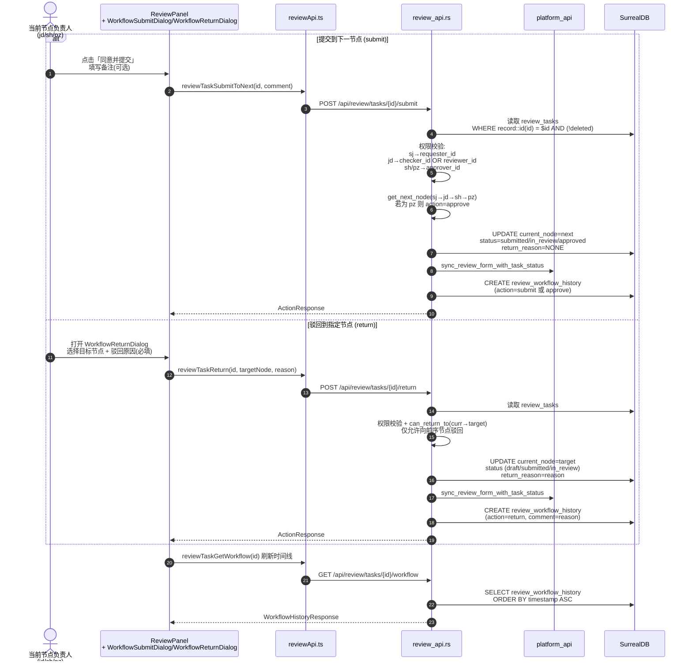

**实现要点**

- `submit` 的 `action_label`：非 pz 场景是 `"submit"`；`current_node == "pz"` 时是 `"approve"`。前端在渲染时间线时用 `getHistoryActionLabel` 映射为"提交 / 批准 / 驳回 / 拒绝"。
- `return_reason` 被写入 `review_tasks.return_reason` 字段（**任务维度**一个反映最近一次驳回的 reason，覆盖式）+ `review_workflow_history.comment`（**历史维度**每条都保留）。**时间线才是 source of truth**，任务字段只是给顶部 panel 快速显示。
- 权限不足返回 403，并带中文提示 `权限不足：用户 {user_id} 不是「{node_display}」节点的负责人`。前端 toast 原样展示。

---

## 9. 批注对话线（viewing + 交互）

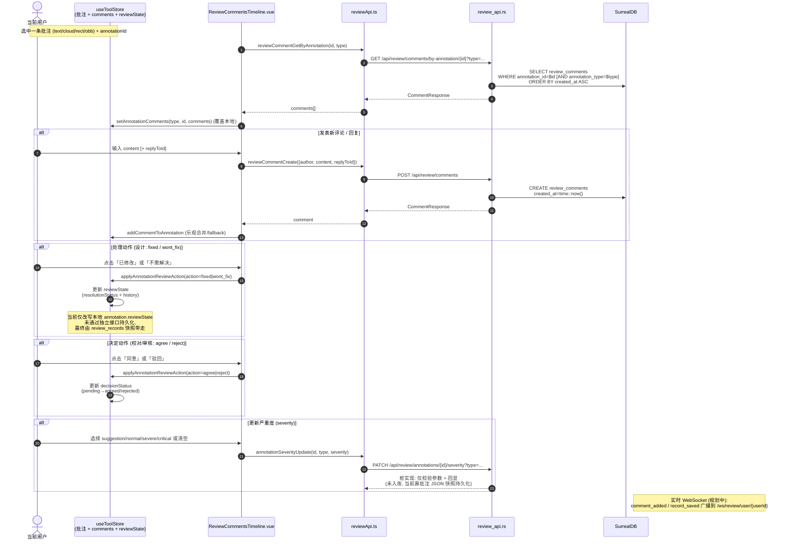

### 批注生命周期（单条批注的视角）

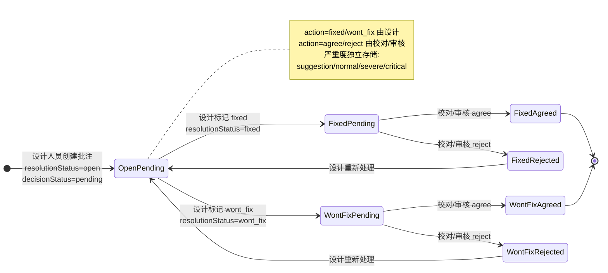

### 关键事实

1. **`AnnotationComment` 是独立表的一等公民**：`review_comments` 有自己的行，走 `create_comment/get_comments_by_annotation/delete_comment`（`review_api.rs:2279-2454`）。`reply_to_id` 自引用构成对话树（目前 UI 是 flat timeline + 引用框，不做树状缩进）。
2. **`reviewState`（处理 + 决定）目前只存在于批注 JSON 内嵌**：`useToolStore.applyAnnotationReviewAction` 改写 `annotation.reviewState`，通过 `review_records` 快照一起持久化。**没有独立 API 单独落库**。含义是：若想单独审计某条批注的 agree/reject 事件，必须先用 `create_record` 打包一个 batch 快照。
3. **severity 是桩实现**：`update_annotation_severity` (L2497-2552) 只校验类型合法性并回显 200，**不落库**。注释明确指向未来方案：要么建 `review_annotation_severity` 表，要么继续内嵌到 `review_records` 里（前端当前就是内嵌走）。修改方案时要注意后向兼容前端 `annotationSeverityUpdate` 的 fallback 路径。
4. **评论 `update` 的路径被文档化但未实现**：`reviewCommentUpdate` 在前端存在（`reviewApi.ts:833`）但后端 `create_review_api_routes()` **没有**对应路由。目前 UI 做了 try/catch 后本地改写，属于前端优雅降级。若要真正落库，需要新增 `PATCH /api/review/comments/item/{id}` handler。

---

## 10. 确认记录（幂等快照）

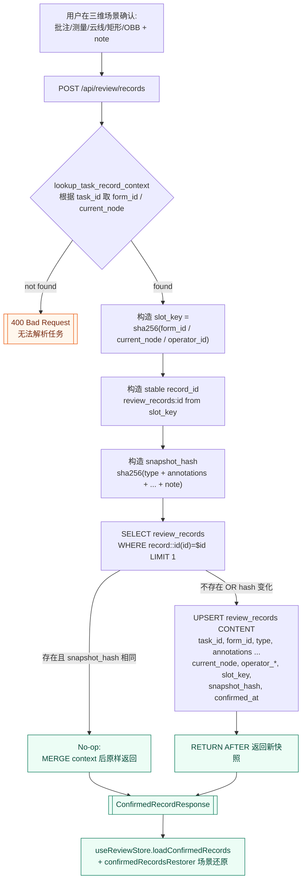

### 为什么要这么设计

- **同一 (form_id, current_node, operator_id) 三元组只产生一条记录**：避免"同一个人在同一节点反复确认"产生无限行（`build_confirmed_record_slot_key` / `build_confirmed_record_stable_id`）。
- **`snapshot_hash` 做内容级幂等**：即使用户来回点"确认"，只要内容完全相同就走 No-op 分支（L1963-2033），只刷新 `current_node/operator/...` 这些上下文字段。
- **节点发生流转 → 不同 slot_key → 新行**：这是一个"每节点一份快照"的契约。`review_records` 天然就是跨节点演进的时间切片集合。
- **`hydrate_task_attachments`**：读取任务详情时会将 `review_attachments` 表的数据合并到 `task.attachments`，保证 UI 看到的附件列表是最新的而非创建时的快照。

### 场景还原（前端侧）

`confirmedRecordsRestore.ts` 中的 `createConfirmedRecordsRestorer` 会在 `currentTask` 切换时：

1. 等待 `viewerContext.tools` 就绪（`waitForViewerReady`）；
2. 取 `useReviewStore.sortedConfirmedRecords` 最新一条；
3. 用 `toolStore` 的批量 API 重建 text/cloud/rect/obb/measurement 几个集合；
4. 通过 `lastRestoredSceneKey` 避免重复还原。

---

## 11. 历史记录（多源）

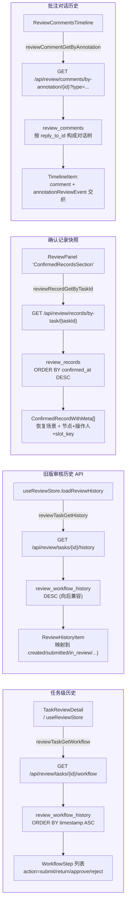

### 四种历史口径（别混）

| 口径 | 表 | 排序 | 前端入口 | 用途 |
|------|----|------|---------|------|
| **工作流时间线** | `review_workflow_history` | `ASC` | `TaskReviewDetail` | 呈现节点流转全过程（主历史） |
| **旧版审核历史** | 同上 | `DESC` | `useReviewStore.loadReviewHistory` | 兼容性，按时间倒序 |
| **确认快照** | `review_records` | `DESC` | `ConfirmedRecordsSection` | 批注/测量的时间切片，可 replay 到 3D 视口 |
| **批注对话** | `review_comments` | `ASC` | `ReviewCommentsTimeline` | 单条批注的讨论树 + `reviewState.history` 合并 |

**注意**：`AnnotationReviewState.history`（批注处理的 agree/reject/fixed/wont_fix 事件）**没有独立表**，它是 annotation JSON 内嵌的数组，通过 `review_records` 快照持久化。若需要跨 session 的事件回溯，必须先有一次 "`create_record`"。

---

## 12. PMS 集成（入站 S2S）

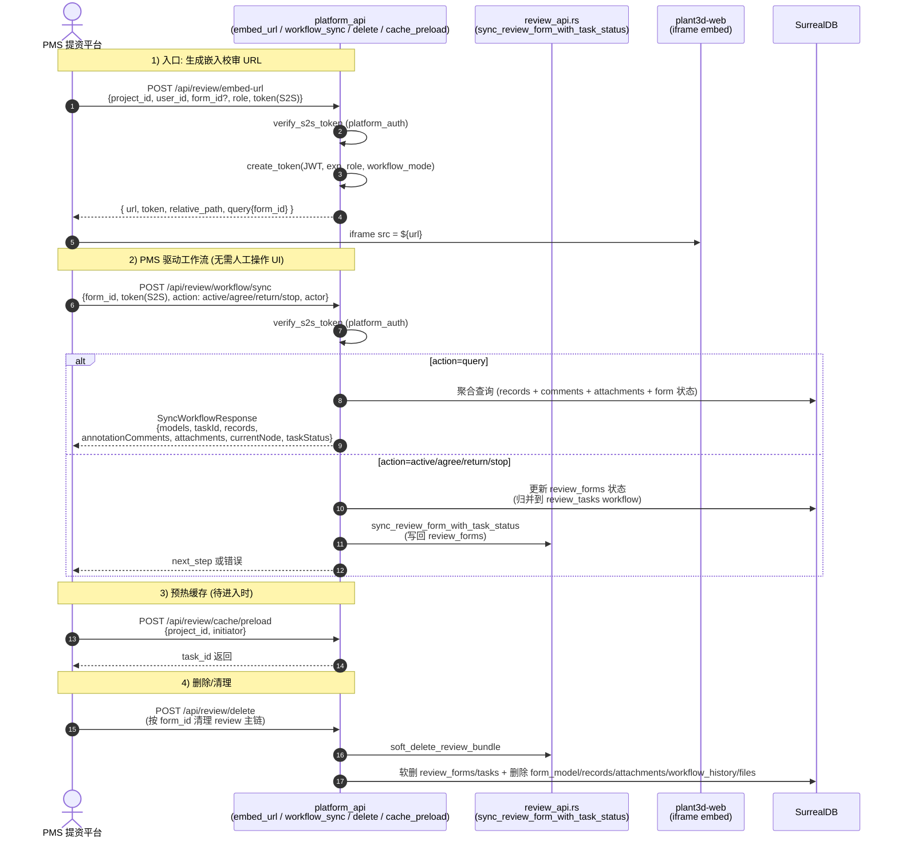

### 两套 Token 不要搞混

- **用户态 JWT**：`jwt_auth.rs::create_token`，通过 `/api/auth/token` 颁发给前端浏览器；所有 `/api/review/*`（除 platform_api）走 `Authorization: Bearer <JWT>`，经 `review_auth_middleware` 校验并把 `TokenClaims` 注入到请求 `Extension`。
- **S2S Token**：`platform_api::auth::verify_s2s_token` 校验；仅用于 PMS ↔ 校审平台的入站调用（`embed-url`、`workflow/sync`、`delete`、`cache/preload`），由 `[platform_auth]` 独立控制。

### workflow_sync 的 action 语义

| action | 语义 | 落库影响 |
|--------|------|---------|
| `query` | 只读聚合（UI 嵌入时预热） | 无写 |
| `active` | PMS 表示当前流程被触发（进入某节点） | 更新 `review_forms.status`，回写 `review_tasks`（需校对 form_id 与 task 对齐） |
| `agree` | PMS 侧同意 → 映射到 `submit_to_next_node` | 同 `active` |
| `return` | PMS 侧驳回 → 映射到 `return_to_node` | 同 `active`，强制 reason |
| `stop` | PMS 侧终止当前流程 | 更新 `review_forms.status`，停止当前活动任务 |

---

## 13. 认证与中间件

```mermaid
flowchart LR
  Req["浏览器请求<br/>Authorization: Bearer <JWT>"] --> MW[review_auth_middleware]
  MW --> Cfg{"REVIEW_AUTH_CONFIG<br/>enabled ?"}
  Cfg -- "disabled (联调)" --> Inj1[注入 debug TokenClaims<br/>(user_id 默认派生)]
  Cfg -- "enabled" --> Hdr[extract_bearer_token]
  Hdr -- "missing" --> Deny[[401 unauthorized]]
  Hdr -- "有 token" --> Ver[verify_token]
  Ver -- "fail" --> Deny
  Ver -- "ok" --> Inj2[Extension(TokenClaims)]
  Inj1 --> Handler[review_api handler]
  Inj2 --> Handler
```

- 浏览器侧启用/禁用由 `db_options/DbOption.toml` 的 `[review_auth]` 节控制；`review_auth.enabled=false` 时只注入固定 debug claims，不再信任请求里的 Bearer token 身份。
- PMS 入站启用/禁用由 `[platform_auth]` 控制；`platform_auth.enabled=false` 时也不会无条件放行，只接受与 `platform_auth.debug_token` 完全相等的 token。
- `TokenClaims` 字段：`project_id / user_id / user_name / role / workflow_mode / legacy_form_id / exp / iat`，其中 `role` 是"本单据上的工作流角色"（sj/jd/sh/pz/admin），不是账号的固定角色——与 `reviewGetEmbedUrl` 的 `workflow_role` 请求字段对齐。
- 前端 `reviewApi.ts::fetchJson` 统一在 header 注入 `Authorization: Bearer ${token}`，其中 token 存在 `localStorage['review_auth_token']`。

---

## 14. 附件链路（upload / bind / static serve）

1. `POST /api/review/attachments` (multipart) → `upload_attachment` → 存盘到 `assets/review_attachments/<uuid>-<sanitized_name>`，记录到 `review_attachments` 表，并更新 `review_tasks.attachments` 内嵌字段。
2. 静态服务：`web_server/mod.rs:917-918` 将 `/files/review_attachments` 挂到 `ServeDir::new("assets/review_attachments")`。
3. 前端先 `reviewAttachmentUpload` / `reviewAttachmentUploadWithProgress`（支持 `XMLHttpRequest` 进度），再通过 `reviewTaskUpdate(taskId, { attachments })` 回写元数据（`syncTaskAttachments`）。
4. 删除：`DELETE /api/review/attachments/{id}` 会删 DB 行 + 物理文件。

---

## 15. API 快速参考（`/api/review/*`）

| 方法 | 路径 | Handler | 权限 |
|------|------|---------|------|
| POST | `/api/review/tasks` | `create_task` | JWT (任意角色) |
| GET | `/api/review/tasks` | `list_tasks` | JWT |
| GET | `/api/review/tasks/{id}` | `get_task` | JWT |
| PATCH | `/api/review/tasks/{id}` | `update_task` | JWT |
| DELETE | `/api/review/tasks/{id}` | `delete_task` (软删) | JWT |
| POST | `/api/review/tasks/{id}/start-review` | `start_review` (兼容旧 API → jd) | JWT |
| POST | `/api/review/tasks/{id}/approve` | `approve_task` (兼容旧 API → approved + pz) | JWT |
| POST | `/api/review/tasks/{id}/reject` | `reject_task` (兼容旧 API → sj) | JWT |
| POST | `/api/review/tasks/{id}/cancel` | `cancel_task` | JWT |
| GET | `/api/review/tasks/{id}/history` | `get_task_history` | JWT |
| POST | `/api/review/tasks/{id}/submit` | `submit_to_next_node` (新) | JWT + 节点负责人 |
| POST | `/api/review/tasks/{id}/return` | `return_to_node` (新) | JWT + 节点负责人 |
| GET | `/api/review/tasks/{id}/workflow` | `get_workflow_history` (新) | JWT |
| POST | `/api/review/records` | `create_record` (幂等) | JWT |
| GET | `/api/review/records/by-task/{task_id}` | `get_records_by_task` | JWT |
| DELETE | `/api/review/records/item/{record_id}` | `delete_record` | JWT |
| DELETE | `/api/review/records/clear-task/{task_id}` | `clear_records_by_task` | JWT |
| POST | `/api/review/comments` | `create_comment` | JWT |
| GET | `/api/review/comments/by-annotation/{id}` | `get_comments_by_annotation` | JWT |
| DELETE | `/api/review/comments/item/{id}` | `delete_comment` | JWT |
| PATCH | `/api/review/annotations/{id}/severity` | `update_annotation_severity` (**桩**) | JWT |
| POST | `/api/review/attachments` | `upload_attachment` (multipart) | JWT |
| DELETE | `/api/review/attachments/{id}` | `delete_attachment` | JWT |
| POST | `/api/review/sync/export` | `export_review_data` | JWT |
| POST | `/api/review/sync/import` | `import_review_data` | JWT |
| POST | `/api/review/aux-data` | `get_aux_data` (`UCode`/`UKey` 头) | 独立 |
| GET | `/api/review/collision-data` | `get_collision_data` | 独立 |
| GET | `/api/users` / `/api/users/me` / `/api/users/reviewers` | `list_users` / `get_current_user` / `get_reviewers` | JWT |

**platform_api 侧（PMS 入站）**

| 方法 | 路径 | Handler |
|------|------|---------|
| POST | `/api/review/embed-url` | `embed_url::get_embed_url` |
| POST | `/api/review/workflow/sync` | `workflow_sync::sync_workflow_handler` |
| POST | `/api/review/delete` | `delete_handler::delete_review_data` |
| POST | `/api/review/cache/preload` | `cache_preload::preload_cache` |
| POST | `/api/auth/token` / `/api/auth/verify` | `jwt_auth::get_token / verify_token_handler` |

---

## 16. 已知缺口与后续计划

1. **WebSocket 服务端未实装**。`useReviewStore` 已经在连接 `/ws/review/user/{userId}` 并期望 `record_saved / task_updated / task_approved / task_rejected / comment_added` 事件；后端 `create_review_api_routes()` 没有对应 `ws` 路由。临时方案：前端靠 polling（或在本地状态里维持乐观更新）；长远要新建 `web_api/review_ws.rs`，配合 `review_api.rs` 中的写操作做 broadcast。
2. **评论 update 未实装**。见 §9.4。当前 `reviewCommentUpdate` 只在前端靠 try/catch 降级到本地。
3. **批注严重度 `update_annotation_severity` 是桩**。按注释里的建议，推荐新建 `review_annotation_severity(annotation_id, annotation_type)` 唯一键表，或继续保持 JSON 内嵌走快照。决定前务必与前端 `annotationSeverityUpdate` 的 fallback 路径一起审阅。
4. **批注 `reviewState.history` 没有独立持久化**。依赖 `review_records` 快照。若产品要求独立审计（如"第 N 次 reject 是谁在什么时候做的"），需要把 `history` 事件拆到独立表或 append-only log。
5. **`rejected` 状态不是流转动作**。旧 `reject_task` 兼容 API 会置 `status=rejected` + `current_node=sj`，但新的 `return_to_node` 不会。业务上要么统一到新 API，要么前端按 `status` 优雅降级。
6. **`reviewer_id` 字段已废弃但仍被 `normalizeReviewTask` 兼容**。长期计划：新数据停止写入 `reviewer_*`，读路径的 fallback 保留一段时间再清理。

---

## 17. 关键代码索引

| 主题 | 入口文件 | 行号提示 |
|------|---------|---------|
| 路由装配 | `plant-model-gen/src/web_api/review_api.rs` | `create_review_api_routes` L1008 |
| 创建提资单 | 同上 | `create_task` L1084 |
| 提交到下一节点 | 同上 | `submit_to_next_node` L2795 |
| 驳回 | 同上 | `return_to_node` L3014 |
| 确认记录幂等 | 同上 | `build_confirmed_record_slot_key/stable_id/snapshot_hash` L959-1002 |
| 评论 CRUD | 同上 | `create_comment/get_comments_by_annotation/delete_comment` L2279-2454 |
| 严重度桩 | 同上 | `update_annotation_severity` L2497 |
| JWT 中间件 | `plant-model-gen/src/web_api/jwt_auth.rs` | `review_auth_middleware` L502, `verify_token` L385 |
| PMS 集成 | `plant-model-gen/src/web_api/platform_api/workflow_sync.rs` | `sync_workflow_handler` L130 |
| 前端 API | `plant3d-web/src/api/reviewApi.ts` | 全量导出函数见 §15 索引 |
| 校审主面板 | `plant3d-web/src/components/review/ReviewPanel.vue` | 全文 ~1759 行 |
| 批注对话 | `plant3d-web/src/components/review/ReviewCommentsTimeline.vue` | `loadCommentsFromBackend` L70、`submitComment` L266、`applyReviewAction` L310 |
| 发起校审 | `plant3d-web/src/components/review/InitiateReviewPanel.vue` | `handleSubmit` L563 |
| 任务详情 | `plant3d-web/src/components/review/TaskReviewDetail.vue` | `loadWorkflowHistory` L250 |
| 工作流步骤条 | `plant3d-web/src/components/review/WorkflowStepBar.vue` | 全文 58 行 |
| 批注/评论本地态 | `plant3d-web/src/composables/useToolStore.ts` | `applyAnnotationReviewAction` L1210、`addCommentToAnnotation` L1308、`setAnnotationComments` L1359 |
| 校审 Store | `plant3d-web/src/composables/useReviewStore.ts` | `setCurrentTask` L311、`connectWebSocket` L374、`handleWebSocketMessage` L453 |
| 类型定义 | `plant3d-web/src/types/auth.ts` | `AnnotationComment / AnnotationReviewState / ReviewTask / WorkflowStep` L1-160 |

---

## 18. 调整该模块时的 Checklist

- [ ] 是否涉及**软删过滤**？所有 `review_tasks` 查询必须带 `(deleted IS NONE OR deleted = false)`，并与 `platform_api::REVIEW_TASK_ACTIVE_SQL` 保持一致（`plant-surrealdb` 技能的可选 bool 语义）。
- [ ] 是否涉及节点切换？同步更新 `review_forms`（`sync_review_form_with_task_status`），否则 PMS 侧状态会漂移。
- [ ] 是否新增动作？记得写入 `review_workflow_history`（不要只更新 `review_tasks` 字段），否则时间线会缺段。
- [ ] 是否改 `review_records` 字段？考虑 `snapshot_hash` 是否还覆盖新字段，否则幂等会坏。
- [ ] 是否改批注 JSON Schema？审查 `normalizeReviewTask / confirmed_record_with_meta_from_row`、以及前端 `useToolStore` 的 annotation 重建路径（`confirmedRecordsRestorer`）。
- [ ] 是否改前端 `fetchJson`？注意 token 注入是 fetch 级别，不是单次请求，上层组件无需感知。
- [ ] 是否新增评论字段？`review_comments` 没有 `updated_at`；如需"编辑已评论"，需要先补后端 `PATCH` 路由和字段（参考 §16.2）。
- [ ] 是否涉及前端单例？`useReviewStore.ts` 顶层是模块级单例；在单元测试里要 reset `currentTask/confirmedRecords` 等 refs，避免串场。

---

## 附录 A：前端文件清单（review/）

```
plant3d-web/src/components/review/
├── ReviewPanel.vue               # 主面板 (1759 行)
├── InitiateReviewPanel.vue       # 发起 (1020 行)
├── TaskReviewDetail.vue          # 任务详情弹窗 (530 行)
├── ReviewerTaskList.vue          # 审核收件箱
├── ResubmissionTaskList.vue      # 设计再提交列表
├── ReviewCommentsTimeline.vue    # 批注对话
├── ReviewAuxData.vue             # 碰撞/质量/OT
├── ReviewDataSync.vue            # 导入导出
├── CollisionResultList.vue       # 碰撞结果列表
├── WorkflowStepBar.vue           # 节点步骤条
├── WorkflowSubmitDialog.vue      # 提交确认
├── WorkflowReturnDialog.vue      # 驳回确认
├── reviewPanelActions.ts         # 流转动作 + 快照工具
├── confirmedRecordsRestore.ts    # 场景还原
├── reviewAttachmentFlow.ts       # 附件流程
├── workflowMode.ts               # 嵌入模式识别
├── embedRoleLanding.ts           # 嵌入模式角色落点
├── embedContextRestore.test.ts
├── reviewTaskFilters.ts          # canonical returned task 识别
├── sections/
│   ├── TaskContextSection.vue
│   ├── ConfirmedRecordsSection.vue
│   ├── DataSyncSection.vue
│   └── AuxiliaryDataSection.vue
└── FileUploadSection.vue
```

## 附录 B：Mermaid 源文件（已用 `mermaid` 技能验证）

完整源文件见 `/tmp/review-diagrams/*.mmd`（可手工复制到仓库 `docs/` 子目录），或直接使用本文档内嵌的代码块。每张图都通过 `/Users/dongpengcheng/.agents/skills/mermaid/tools/validate.sh` 验证。
