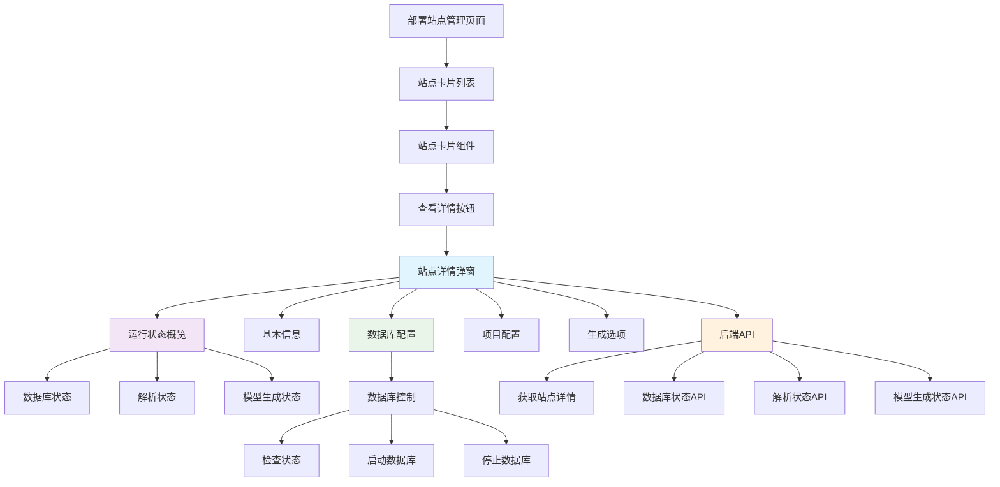
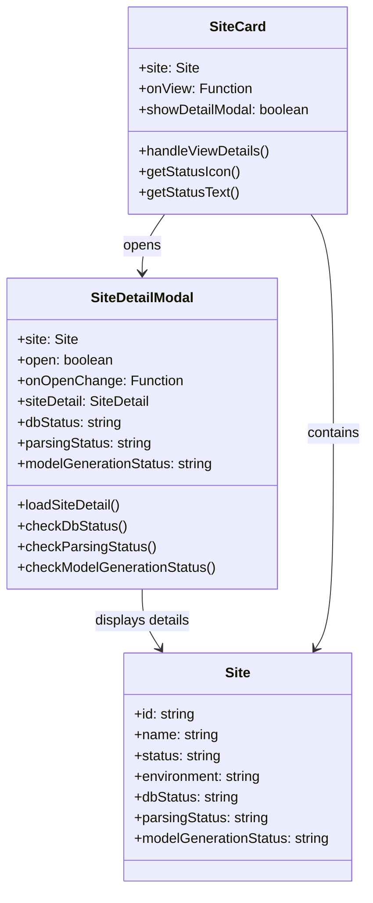
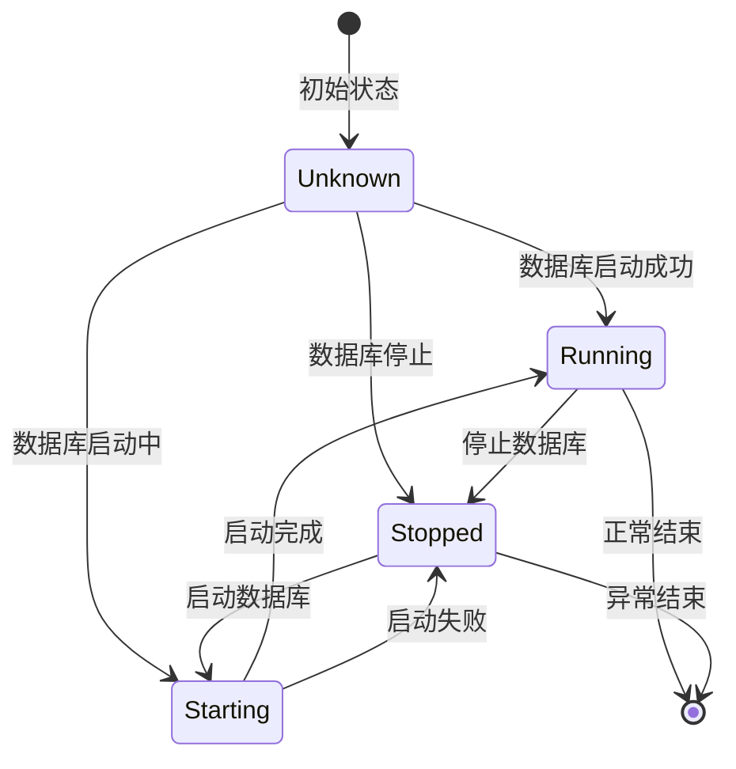

# 部署站点详情弹窗功能架构图

```mermaid
graph TB
    A[部署站点管理页面] --> B[站点卡片列表]
    B --> C[站点卡片组件]
    C --> D[查看详情按钮]
    D --> E[站点详情弹窗]
    
    E --> F[运行状态概览]
    E --> G[基本信息]
    E --> H[数据库配置]
    E --> I[项目配置]
    E --> J[生成选项]
    
    F --> K[数据库状态]
    F --> L[解析状态]
    F --> M[模型生成状态]
    
    H --> N[数据库控制]
    N --> O[检查状态]
    N --> P[启动数据库]
    N --> Q[停止数据库]
    
    R[后端API] --> S[获取站点详情]
    R --> T[数据库状态API]
    R --> U[解析状态API]
    R --> V[模型生成状态API]
    
    E --> R
    
    style E fill:#e1f5fe
    style F fill:#f3e5f5
    style H fill:#e8f5e8
    style R fill:#fff3e0
```

## 组件关系图

```mermaid
classDiagram
    class SiteCard {
        +site: Site
        +onView: Function
        +showDetailModal: boolean
        +handleViewDetails()
        +getStatusIcon()
        +getStatusText()
    }
    
    class SiteDetailModal {
        +site: Site
        +open: boolean
        +onOpenChange: Function
        +siteDetail: SiteDetail
        +dbStatus: string
        +parsingStatus: string
        +modelGenerationStatus: string
        +loadSiteDetail()
        +checkDbStatus()
        +checkParsingStatus()
        +checkModelGenerationStatus()
    }
    
    class Site {
        +id: string
        +name: string
        +status: string
        +environment: string
        +dbStatus: string
        +parsingStatus: string
        +modelGenerationStatus: string
    }
    
    SiteCard --> SiteDetailModal : opens
    SiteDetailModal --> Site : displays details
    SiteCard --> Site : contains
```

## 状态流转图

```mermaid
stateDiagram-v2
    [*] --> Unknown: 初始状态
    
    Unknown --> Running: 数据库启动成功
    Unknown --> Starting: 数据库启动中
    Unknown --> Stopped: 数据库停止
    
    Starting --> Running: 启动完成
    Starting --> Stopped: 启动失败
    
    Running --> Stopped: 停止数据库
    Stopped --> Starting: 启动数据库
    
    Running --> [*]: 正常结束
    Stopped --> [*]: 异常结束
```

