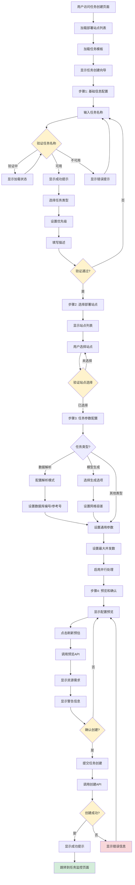
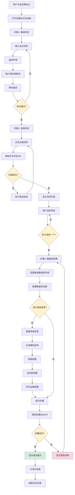
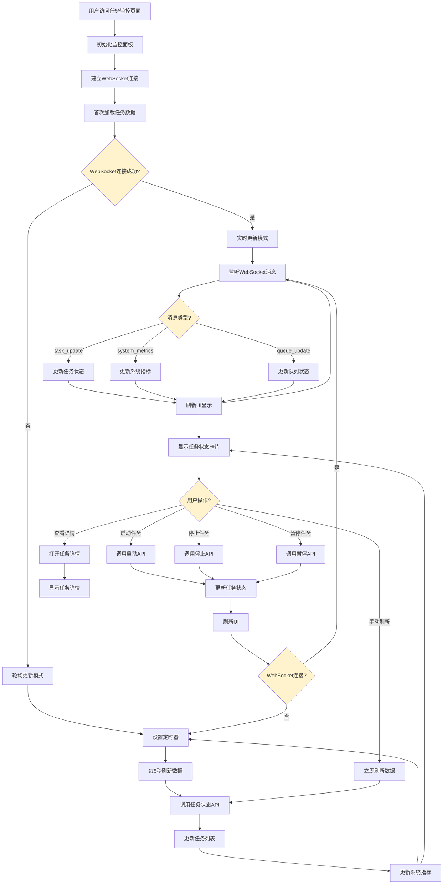
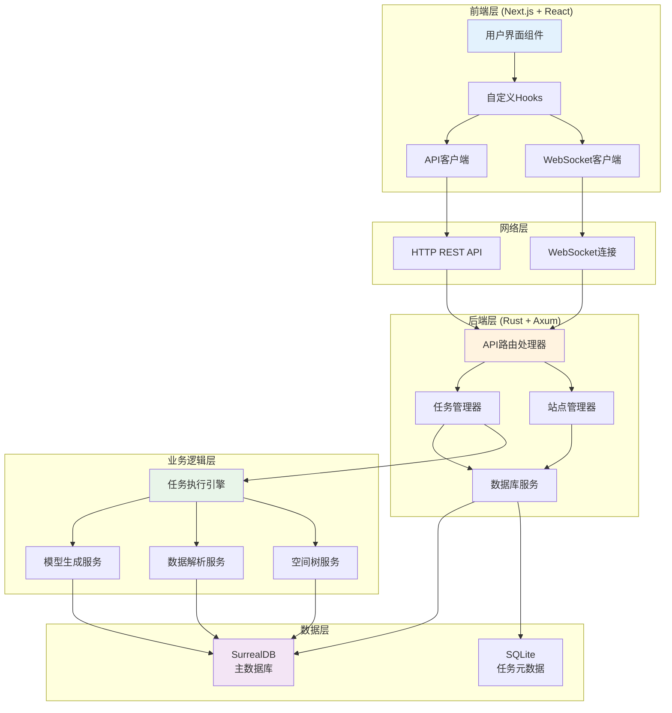
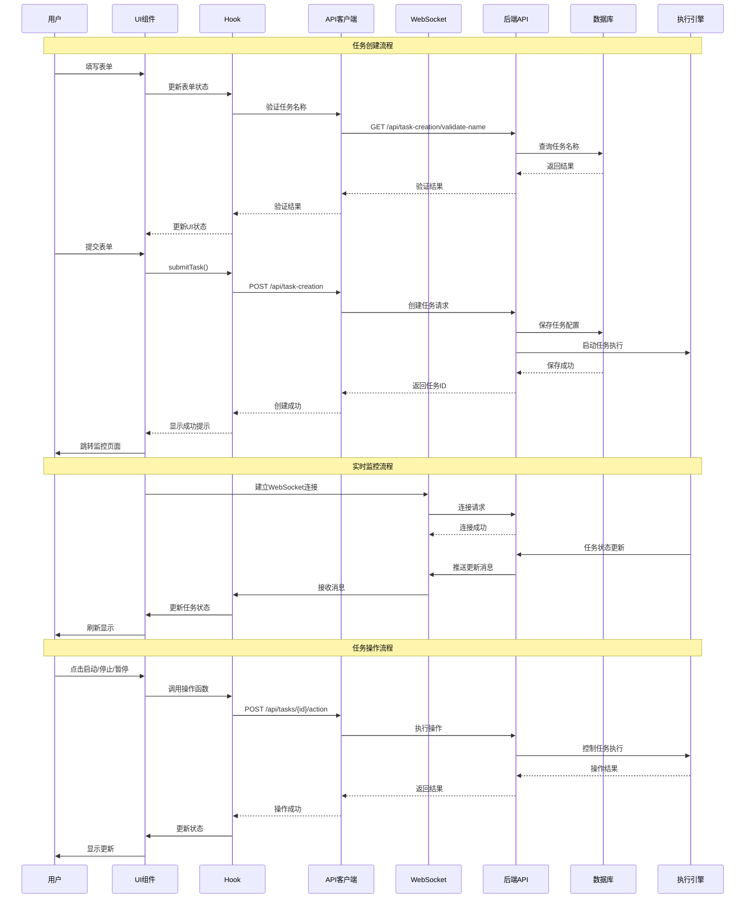
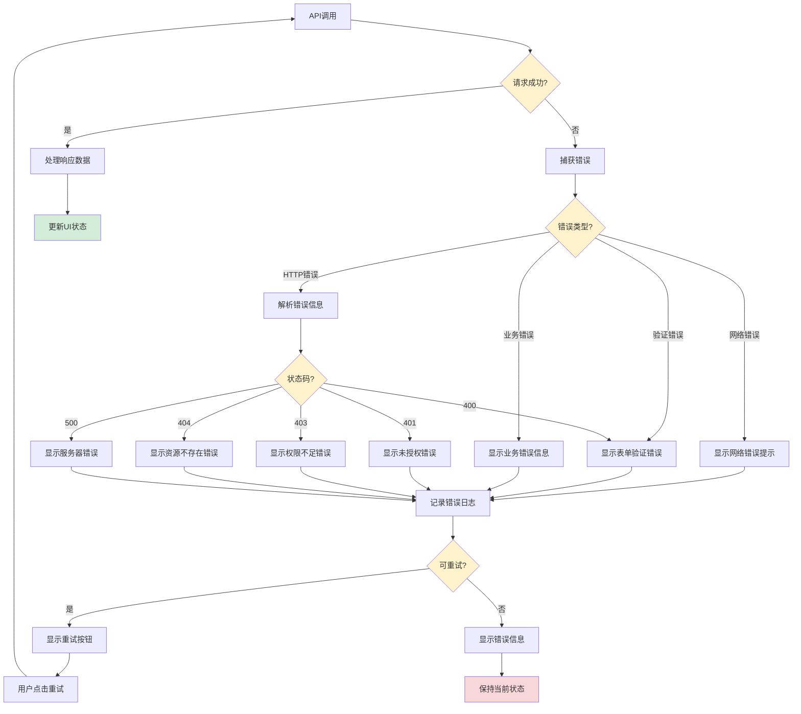
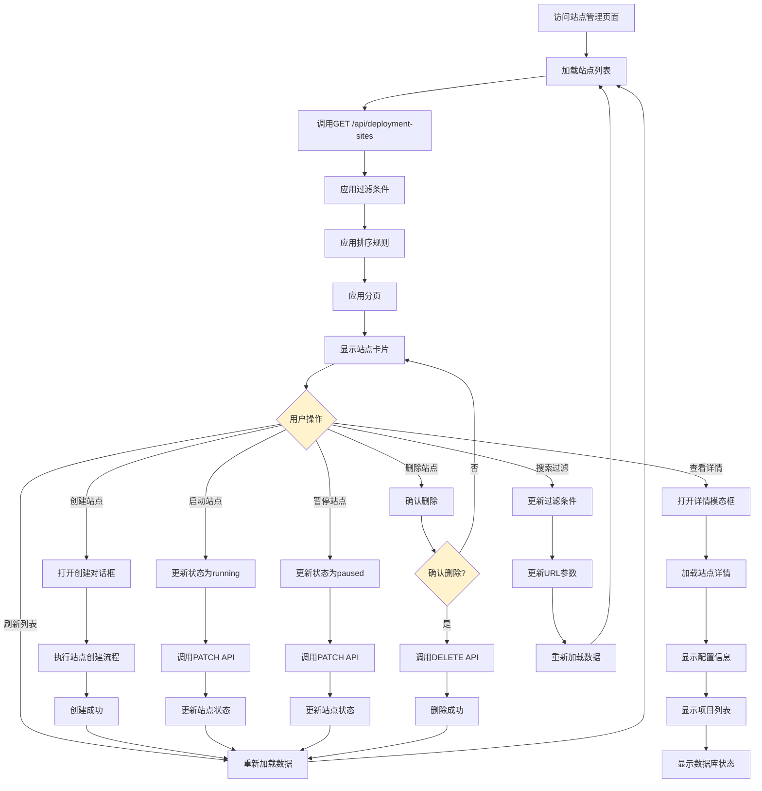
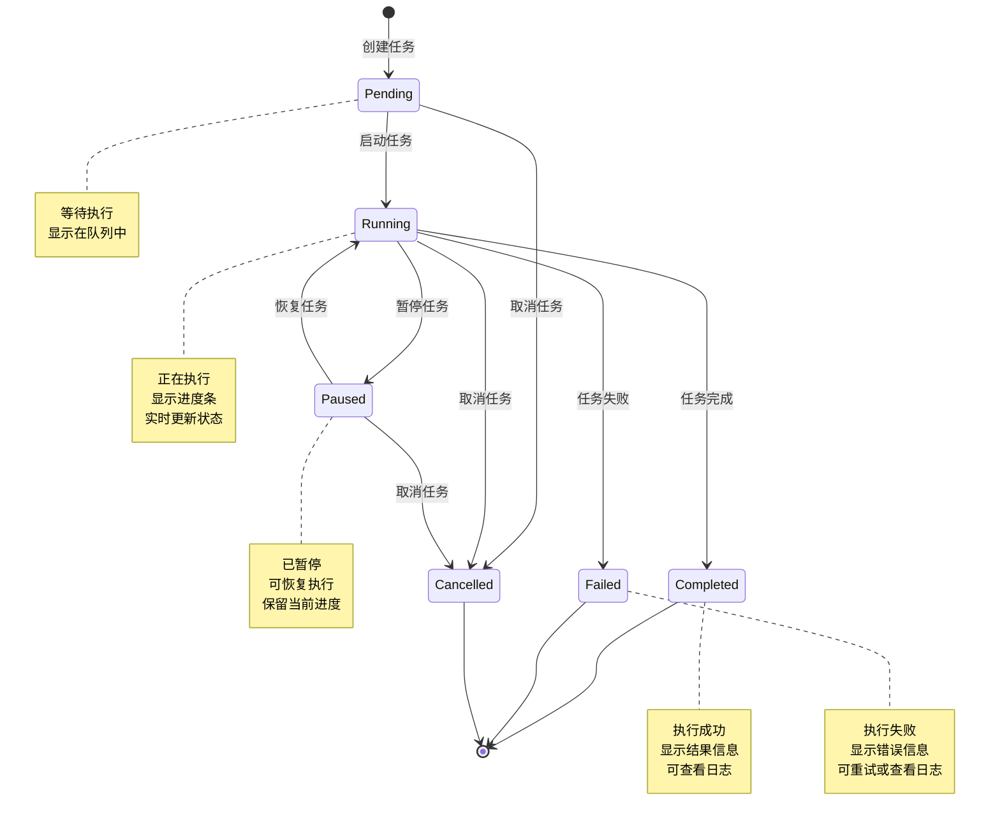
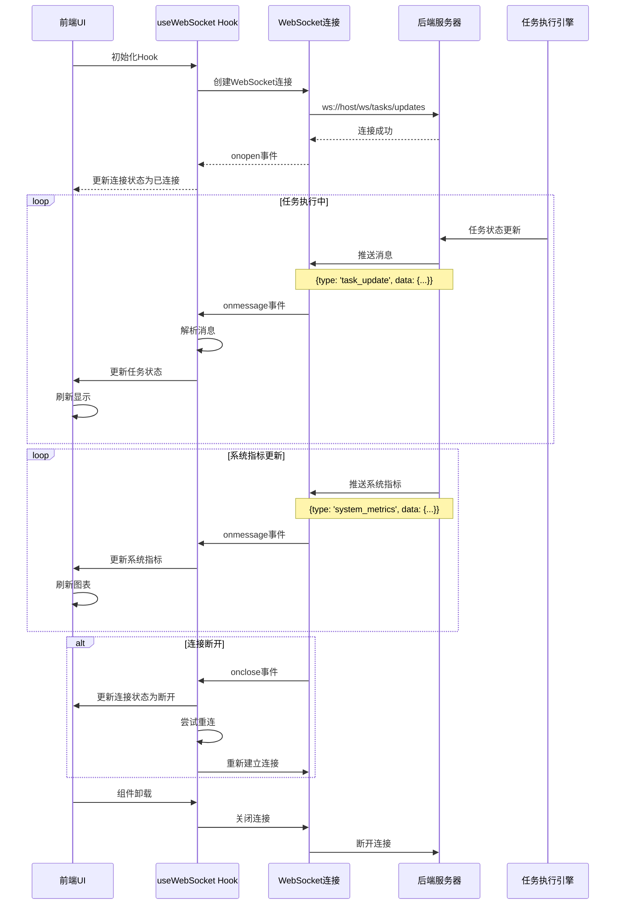
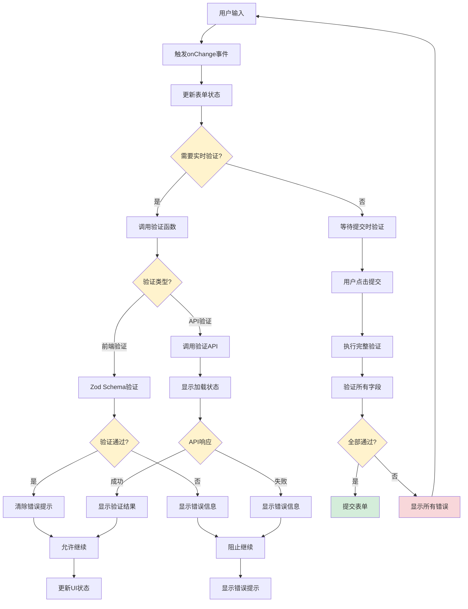

# 解析模型配置界面管理功能 - 流程图

本文档包含系统各个功能模块的详细流程图。

## 一、任务创建流程

## 二、站点创建流程

## 三、任务监控流程

## 四、系统整体架构流程

## 五、数据流详细流程

## 六、错误处理流程

## 七、站点管理完整流程

## 八、任务执行状态流转

## 九、WebSocket实时通信流程

## 十、表单验证流程

---

## 流程图说明

### 图例说明

- **黄色节点**：决策点或条件判断
- **绿色节点**：成功状态或正向流程
- **红色节点**：错误状态或异常流程
- **蓝色节点**：用户操作或输入
- **橙色节点**：系统处理或业务逻辑
- **紫色节点**：数据存储

### 使用说明

1. **任务创建流程**：展示了从用户访问页面到任务创建完成的完整流程
2. **站点创建流程**：展示了三步向导式站点创建的详细步骤
3. **任务监控流程**：展示了实时监控和轮询更新的机制
4. **系统架构流程**：展示了前后端分层架构和数据流向
5. **数据流流程**：使用序列图展示API调用和WebSocket通信的时序
6. **错误处理流程**：展示了各种错误情况的处理机制
7. **站点管理流程**：展示了站点管理的各种操作流程
8. **任务状态流转**：展示了任务状态的状态机转换
9. **WebSocket流程**：展示了实时通信的建立和维护
10. **表单验证流程**：展示了前端表单验证的完整流程

### 技术要点

- **实时性**：通过WebSocket实现任务状态的实时更新
- **可靠性**：通过轮询机制作为WebSocket的备选方案
- **用户体验**：通过实时验证和进度反馈提升用户体验
- **错误处理**：完善的错误处理和用户提示机制
- **状态管理**：清晰的状态流转和状态管理

