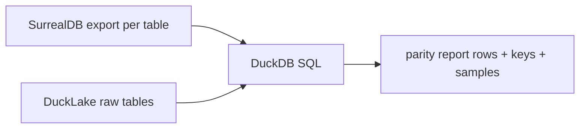

# Plan: DuckLake ModelWriter Backend

## Solution Overview

本目标在已完成的 `ModelWriterBackend` trait 之上新增第三个 backend 实现 `DuckLakeModelWriterBackend`，让模型生成产出的 canonical raw 行能够直接通过 Rust `duckdb` crate 落进一个 DuckLake-managed DuckDB database 的 `ducklake-canonical` schema。Surreal 与 DrainOnly 两个既有 backend 不被触碰；DuckLake 是一个 opt-in 的第三模式，通过 `--model-writer ducklake` 命令行参数与 `model-writer-ducklake` Cargo feature 共同启用。

本期范围只覆盖 trait 已暴露的 8 个生命周期阶段（`init / cleanup / write_base_batch / persist_mesh_results / persist_inst_relate_aabb / reconcile_missing_neg_relations / run_boolean_bridge / finalize`）对应的 9 张 Phase 1 raw 表；剩余 5 类 Phase 1 raw 表（`raw_tubi_info / raw_tubi_relate / raw_aabb(tubi) / raw_trans / raw_vec3(tubi) / raw_refno_assoc_index`）因当前还由 `cata_model.rs` 与 `refno_assoc_index.rs` 直接写 SurrealQL、不流经 trait，本期不落 DuckLake，仅在 `finalize` 报告中列为 Known Gap，等待后续 `09-phase-1-tubi-trait-migration` goal 闭合。Projection 9 张表与 Phase 2 boolean 表均不在范围内。

## Why This Approach

`04-ducklake-writer.md` 的「Direction」明确要求 DuckLake 走 Rust DuckDB binding 直接写 canonical 表，不接受 temp-Parquet-plus-SQL 作为最终架构。当前 `pe_transform_store::register_ducklake` 是空 stub，且 `transform-store-ducklake` feature 用途是把 pe_transform 数据通过外部 Parquet 注册到 DuckLake — 与 ModelWriter 的 canonical 写入语义不同，复用会让两条相互冲突的"DuckLake 路径"混在一起，所以新建独立 backend、独立 feature、独立模块更安全。

在 `ModelWriterBackend` trait 已经稳定的前提下，DuckLake backend 只需要镜像 trait 阶段语义到 DuckDB SQL，不需要回头改 orchestrator 或 Surreal helper，对默认路径风险接近零。先做"trait 已暴露的 9 表"是因为这部分的写入路径已经被 Surreal backend 走过一遍、行为契约明确，可以直接以 Surreal 的写入结果为 ground truth 做 SQL parity；而 5 类 trait gap 表的写入今天还散落在 `cata_model.rs`，把它们一起塞进本 goal 会让 scope 急剧扩大并且与正在规划的 `09-phase-1-tubi-trait-migration` goal 重叠，因此明确切边。

Projection 表本质上是 raw 表的 SQL 视图刷新，可以在 raw 表稳定之后用独立 goal 增量推进，不需要在本期做完。这种切分让本 goal 的 finish line 清晰：raw 9 表 parity 通过 = 完成。

## How It Will Work

实现集中在三个新文件 + 若干 Cargo / CLI 配置改动：

- `src/fast_model/gen_model/model_writer_ducklake.rs`：新模块，定义 `DuckLakeModelWriterBackend` 及其内部 `DuckLakeConfig`、`DuckLakeSession`、canonical 行 → DuckDB 行的 adapter 函数。`#[cfg(feature = "model-writer-ducklake")]` 全文 gate。
- `src/fast_model/gen_model/model_writer.rs`：`ModelWriterMode` 枚举增加 `DuckLake` 变体；`create_model_writer_backend` 工厂在 feature 启用时返回 `Arc<DuckLakeModelWriterBackend>`，在 feature 未启用时返回明确的 error；`writes_to_surreal()` 返回 false；`writes_to_ducklake()` 新 helper 返回 true（用来给 cata_model.rs 等 gap 调用点显式打 Known Gap 日志）。
- `src/options.rs`：`ModelWriterMode` 解析新增 `ducklake` 字面值；`validate_model_writer_features` 增加 `model-writer-ducklake` feature 校验。
- `Cargo.toml`：新增 `model-writer-ducklake = ["dep:duckdb"]` feature；`duckdb = { version = "*", optional = true, default-features = false, features = ["bundled"] }`（具体版本以 cargo 解析最新可用 release 为准，写入后冻结）。
- `src/web_server/model_writer_verify.rs` / `src/web_server/mod.rs`：现有 `/api/model/writer-verify` 路由接受 `mode=ducklake`，构造对应 backend、运行 8 阶段生命周期、回传 JSON。

写入流（单次 model_writer_verify 或一次真实生成）：

```mermaid
sequenceDiagram
  participant O as Orchestrator
  participant B as DuckLakeBackend
  participant DB as DuckDB+DuckLake
  O->>B: init(ctx)
  B->>DB: open conn + INSTALL ducklake + ATTACH 'ducklake:metadata.ducklake' AS lake
  B->>DB: CREATE SCHEMA IF NOT EXISTS "ducklake-canonical"
  B->>DB: CREATE TABLE IF NOT EXISTS raw_inst_info / raw_inst_relate / ... (9 表)
  loop per batch
    O->>B: write_base_batch(ShapeInstancesData)
    B->>DB: BEGIN; INSERT INTO raw_inst_info ...; INSERT INTO raw_inst_relate ...; ...; COMMIT
  end
  O->>B: persist_mesh_results(mesh maps)
  B->>DB: BEGIN; UPSERT raw_inst_geo mesh cols; INSERT raw_aabb; INSERT raw_vec3; COMMIT
  O->>B: persist_inst_relate_aabb(derived)
  B->>DB: BEGIN; INSERT raw_inst_relate_aabb; COMMIT
  O->>B: reconcile_missing_neg_relations(carriers)
  B->>DB: BEGIN; INSERT raw_neg_relate (reconcile); COMMIT
  O->>B: run_boolean_bridge(req)
  B-->>O: skipped (Phase 2 not in scope)
  O->>B: finalize(ctx)
  B->>DB: CHECKPOINT lake; CLOSE
  B-->>O: report{ backend=ducklake, rows_by_table, known_gap_tables }
```

读取/对账（独立 SQL，离线运行）：



Canonical adapter 行为：对每个 trait 阶段，把当前 `ShapeInstancesData` / mesh dashmap / reconcile 输入 → 一组 `RawCanonicalRecord` 行；adapter 函数在 `model_writer_ducklake.rs` 内私有，不暴露到 trait API（以免限制后续 Parquet backend 复用方式）。所有写入都在批事务内（`BEGIN ... COMMIT`），失败立即 rollback 并抛 `anyhow::Error{ batch_id, table }`。

## Slices

| Slice | Purpose | Main files or systems | Done when | Risks |
| --- | --- | --- | --- | --- |
| 1 | Cargo feature + 模块骨架 + 连接生命周期 | `Cargo.toml`, `src/options.rs`, `src/fast_model/gen_model/model_writer.rs`, `src/fast_model/gen_model/model_writer_ducklake.rs` (新增) | `cargo check --lib --features "review,model-writer-drain,model-writer-ducklake"` 通过；`--model-writer ducklake` CLI 可解析；backend `init` 能打开 DuckDB / 挂载 DuckLake / 建 `ducklake-canonical` schema 与 9 张空 raw 表；`finalize` 能关闭连接；`cleanup` no-op | duckdb crate 编译重量（bundled feature 拉 C 源）；DuckLake extension 在 bundled DuckDB 中可用性需验证 |
| 2 | `write_base_batch` 写 6 张表 | `model_writer_ducklake.rs`, `model_writer.rs` | 6 张表（inst_info / inst_relate / inst_geo refs / geo_relate / neg_relate / ngmr_relate）的 INSERT 路径完成，单批事务；adapter 函数覆盖 ShapeInstancesData 全部字段；CLI verify drain-only-style 假数据跑通一批不报错 | INSERT 列与 canonical schema 字段对不齐；relate 表 in/out 方向写反 |
| 3 | `persist_mesh_results` + `persist_inst_relate_aabb` 写 3 张表 + 1 张 upsert | `model_writer_ducklake.rs` | 3 张新表（raw_aabb mesh / raw_vec3 mesh pts / raw_inst_relate_aabb）+ raw_inst_geo mesh columns UPSERT 完成；mesh 阶段日志含行数 | DashMap snapshot 顺序不稳定导致 record id 漂移；inst_geo UPSERT 与 base_batch 中 inst_geo refs 列冲突 |
| 4 | `reconcile_missing_neg_relations` 写补行 + `run_boolean_bridge` Phase 2 stub | `model_writer_ducklake.rs` | reconcile 把 missing neg carriers 写为 raw_neg_relate 增量行，与 base_batch 无重复；boolean_bridge 返回 `ModelWriterStageReport::skipped(reason="phase2 boolean tables out of scope")` | reconcile 与 base_batch 主键冲突（应 INSERT OR IGNORE） |
| 5 | `model_writer_verify --mode ducklake` + web_server POST 扩展 | `src/bin/model_writer_verify.rs`, `src/web_server/model_writer_verify.rs`, `src/web_server/mod.rs`（已有 `/api/model/writer-verify` 路由） | `cargo run --bin model_writer_verify --features "review,model-writer-drain,model-writer-ducklake" -- --mode ducklake --json` 输出 8 阶段 implemented + boolean_bridge skipped + Known Gap 表列表；`POST /api/model/writer-verify {"mode":"ducklake"}` 返回结构与 CLI 一致 | feature 未启用时 binary 必须 fail with 明确 error，不能 silent fallback |
| 6 | SQL parity 验证 9 表 (dbnum=1112) | `goals/ducklake-model-writer/sql/`（新增）, `progress.jsonl` | 先用 SurrealDB 默认模式生成 dbnum=1112；再用 `--model-writer ducklake` 重跑同一 dbnum；DuckDB SQL 查询每张表的 row count + primary key set + 3 个 sample record id 与 SurrealDB 导出一致；4 张 Known Gap 表显式记录"未写"原因 | DuckDB 与 SurrealDB 间类型映射（u64 → BIGINT / hash 字符串编码）差异；生成耗时 + dbnum=1112 历史基线 42s 在本机可能更长 |

## Sequencing

Slice 1 必须最先完成且独立审 / 提交，因为它定下 feature gate 与编译矩阵；后续所有 slice 在 1 之上。Slice 2 与 3 顺序必须是 2 → 3：mesh 阶段 UPSERT raw_inst_geo 需要 base_batch 已经写入 inst_geo refs 行。Slice 4 在 3 之后做，因为 reconcile 的去重逻辑依赖 base_batch 已落库的 neg_relate 行。Slice 5 在 1-4 backend 主体闭合后做：CLI / POST 是验证手段，不该提前暴露给用户半成品。Slice 6 SQL parity 是终极验收，必须放在 1-5 全部就绪之后，否则对账没有意义。

## Phase Boundaries

本 goal 在 Slice 6 SQL parity 报告产出且 9 表全部 PASS（或差异在已批准的 Known Gap 范围内）后结束。任何下列情况都不在本 goal 内，应另起 goal：

- projection 9 张表实现与刷新 SQL（独立 goal 候选名 `ducklake-projection-refresh`）。
- 闭合 5 类 Phase 1 trait gap 表（独立 goal `09-phase-1-tubi-trait-migration`）。
- Parquet backend 实现（独立 goal）。
- compare / dual-write 模式（独立 goal）。
- Phase 2 boolean 表（独立 goal）。
- DuckDB 写入性能优化（独立 goal）。
- 把 DuckLake 设为默认 backend（产品决策 + 独立 goal）。

## Steering Notes

- DuckDB crate 版本一旦解析就写死 Cargo.toml 不再 floating；本机 `D:/Rust/.cargo/bin` cargo nightly 1.97 与 NASM 已确认可编译重型 C 依赖（参见 RUS-248 与 pe-transform-backends 历史）。
- `model_writer.rs` 内的 `ModelWriterMode` 字面值新增必须保持向后兼容，旧值 `surreal` / `drain-only` / 缺省含义不变；`ducklake` 必须显式拼写。
- DuckLake metadata 文件路径默认 `output/<project>/model_writer_storage/ducklake/metadata.ducklake`、数据文件路径默认 `output/<project>/model_writer_storage/ducklake/data/`，可通过 `DbOptionExt` 增加 `ducklake_root: PathBuf` 字段覆写，但不暴露到公开 CLI（避免参数膨胀）。
- 在 finalize 报告中 Known Gap 表列表必须用稳定字符串数组（如 `["raw_tubi_info", "raw_tubi_relate", "raw_aabb(tubi)", "raw_trans", "raw_vec3(tubi)", "raw_refno_assoc_index"]`），便于下游脚本 diff。
- DuckLake `ATTACH` 语法在 DuckDB 1.x 内随版本演化；若 `INSTALL ducklake; LOAD ducklake; ATTACH 'ducklake:...'` 在 bundled DuckDB 上不可用，必须立即停下问用户是否允许换非-bundled DuckDB 或预安装 DuckDB extension。
- SQL parity 报告里的"采样 record id"取每张表 `ORDER BY <primary key> LIMIT 3 OFFSET 0/中点/末尾` 的 3 个值，避免随机性导致两次跑结果不一致。

## Acceptance Criteria

- [ ] `Cargo.toml` 增加 `model-writer-ducklake` feature 与 optional `duckdb` 依赖，且默认 feature 集合 / `review` feature / `model-writer-drain` feature 行为不变；证据：Cargo.toml diff + `cargo check --lib --features review` 编译通过。
- [ ] `ModelWriterMode::DuckLake` 在 `src/options.rs` 与 `src/fast_model/gen_model/model_writer.rs` 中存在，且 `validate_model_writer_features` 在 feature 未启用时返回明确错误；证据：代码引用 + 故意未启用 feature 的 `cargo check` 错误信息片段。
- [ ] `DuckLakeModelWriterBackend` 实现 `ModelWriterBackend` 的全部 8 个生命周期方法，`run_boolean_bridge` 显式返回 skipped(reason="phase2 boolean tables out of scope")；证据：模块代码片段 + grep `impl ModelWriterBackend for DuckLakeModelWriterBackend`。
- [ ] `cargo check --lib --features "review,model-writer-drain,model-writer-ducklake"` 通过；证据：完整命令输出尾部 `Finished ...`。
- [ ] `model_writer_verify --mode ducklake --json` 输出含 `backend=ducklake`、8 阶段 status 字段、`known_gap_tables=[6 项 / 4 类]` 列表；证据：stdout JSON snapshot 写入 progress.jsonl。
- [ ] web_server `POST /api/model/writer-verify {"mode":"ducklake"}` 返回与 CLI JSON 一致；证据：curl/Invoke-RestMethod 响应体写入 progress.jsonl。
- [ ] `dbnum=1112` 全流程 ducklake 生成完成（用 `--refresh-transform` 或现有 generation CLI），9 张 raw 表行数 > 0；证据：DuckDB `SELECT table_name, COUNT(*) FROM ducklake-canonical.<table>` 输出。
- [ ] SQL parity 报告：9 张 raw 表的 row count + primary key set + 3 个 sample record id 与 SurrealDB 同 dbnum 一致或差异有解释；证据：parity SQL 文件 + DuckDB stdout + SurrealDB 对比 stdout，全部入 progress.jsonl。
- [ ] 4 类 Known Gap 表（tubi 三张 + transforms + refno_assoc_index）在 finalize 报告与 parity 报告中显式列出"未写"原因；证据：JSON 字段 snapshot。
- [ ] 默认 `cargo run --bin aios-database --features review` 与 `--model-writer drain-only` 行为不变；证据：grep `SurrealModelWriterBackend` / `DrainOnlyModelWriterBackend` 调用未改 + 一次 surreal 模式生成的行数与基线一致（基线行数从 `goals/model-writer-backend-abstraction/progress.jsonl` 或一次新基线生成获取）。
- [ ] `pe_transform_store::register_ducklake` 与 `transform-store-ducklake` feature 完全未被本 goal 修改；证据：`git diff` 不含这些文件。
- [ ] 所有验收命令、错误、关键 artifact 路径都按 jsonl 追加到 `goals/ducklake-model-writer/progress.jsonl`。

## Required Evidence

| Requirement | Evidence to inspect | Where evidence is recorded |
| --- | --- | --- |
| feature + 依赖正确 | `Cargo.toml` diff；`cargo check --lib --features review` 输出尾部 | `progress.jsonl` |
| ModelWriterMode 扩展 | `rg "ModelWriterMode::DuckLake" src/`；feature 未启用时 cargo error 文本 | `progress.jsonl` |
| trait 实现完整 | `rg "impl ModelWriterBackend for DuckLakeModelWriterBackend" src/`；模块代码片段 | `progress.jsonl` |
| 编译矩阵 | `cargo check --lib --features "review,model-writer-drain,model-writer-ducklake"` 完整输出 | `progress.jsonl` |
| CLI JSON 验证 | `model_writer_verify --mode ducklake --json` stdout snapshot | `progress.jsonl` |
| POST 验证 | web_server 响应体 JSON | `progress.jsonl` |
| 真实写入 | DuckDB `COUNT(*)` per table 输出 | `progress.jsonl` + DuckDB 文件路径 |
| SQL parity | SQL 文件 + DuckDB / SurrealDB 输出 diff | `goals/ducklake-model-writer/sql/*.sql` + `progress.jsonl` |
| Known Gap 显式 | finalize report JSON + parity report JSON | `progress.jsonl` |
| 默认路径无回归 | grep 输出 + surreal 模式行数对比 | `progress.jsonl` |
| 未污染相邻代码 | `git diff --stat` 范围限定在本 goal 涉及文件 | `progress.jsonl` |

## Completion Audit

Before marking the goal complete, Codex must map every explicit requirement, file, command, check, and deliverable to real evidence. If any item is missing, incomplete, weakly verified, or uncertain, the goal is not complete. 特别地：

- SQL parity 9 张表全部 PASS（或在 Known Gap 范围内）且证据落 progress.jsonl 之前，不得宣称完成。
- 任何 Slice 阶段 `cargo check` 不通过都视为该 Slice 未完成，不能跳到下一 Slice。
- DuckLake 写入与 Surreal 写入存在不一致而本计划未列入 Known Gap 的情况，必须按 `blockers.md` 的 Stop And Ask 暂停并通知用户。
