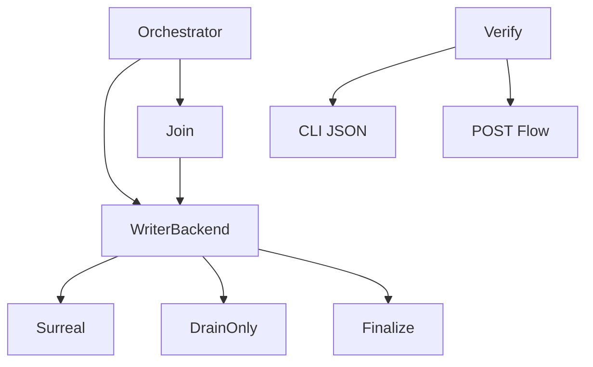

# Plan: ModelWriter 完整后端抽象

## Solution Overview

本目标把当前只覆盖 base batch 写入的 `ModelWriter`，升级为完整模型写入后端生命周期抽象。完成后，`orchestrator.rs` 主要负责阶段编排、channel join、并发控制和错误传播；与具体存储相关的行为统一落到 `ModelWriterBackend`。默认 Surreal 路径继续调用现有 helper 保持兼容，DrainOnly 路径实现安全 NoOp 与统计，后续 DuckLake/Parquet 只获得接口预留，不在本目标中真实落地。

## Why This Approach

当前 trait 已经证明 base batch 写入可以被抽象，但抽象边界过窄：mesh 结果、AABB/PTS、`inst_relate_aabb`、missing neg reconcile、boolean bridge 仍散落在 orchestrator 中，导致新增 backend 时必须复制大量 Surreal 特定逻辑。先完成 Surreal + DrainOnly 的统一生命周期，可以在不改变默认行为的前提下降低耦合，并为后续存储后端提供稳定切入点。

## How It Will Work

核心文件是 `src/fast_model/gen_model/model_writer.rs` 与 `src/fast_model/gen_model/orchestrator.rs`。先定义 `ModelWriterBackend`、`ModelWriterContext`、各阶段 request/report 类型，然后把现有 `SurrealModelWriter` 迁移为 `SurrealModelWriterBackend`。该 backend 初期只包装现有函数，不改变数据库语义。`DrainOnlyWriter` 迁移为 `DrainOnlyModelWriterBackend`，实现完整方法集，但持久化/破坏性阶段返回 skipped report。

执行流：generation batch 进入 orchestrator，orchestrator 把 base write、mesh persist、AABB write、negative reconcile、boolean bridge 都转为 backend 方法调用。验证层通过 CLI JSON 观察 backend 生命周期调用顺序，通过 web_server POST 观察真实运行行为。

## Slices

| Slice | Purpose | Main files or systems | Done when | Risks |
| --- | --- | --- | --- | --- |
| 1 | 定义完整 backend contract | `model_writer.rs` | `ModelWriterBackend`、context、request/report 类型存在，Surreal/DrainOnly 可编译实现 | 接口一次扩太大导致编译面广 |
| 2 | 迁移 base writer 与 finalize | `model_writer.rs`, `orchestrator.rs` | base batch 继续通过 backend，finish report 保留兼容字段 | 统计字段丢失 |
| 3 | 迁移 mesh/AABB 持久化 | `orchestrator.rs`, `pdms_inst.rs`, `utils` 调用点 | `persist_inst_geo_mesh_results` 与 `save_inst_relate_aabb_rows` 由 backend 封装 | 顺序错误会导致引用未落库 |
| 4 | 迁移 missing neg 与 boolean bridge | `orchestrator.rs`, `mesh_generate.rs`, `manifold_bool.rs` 调用边界 | reconcile 与 boolean 调度通过 backend 方法执行或明确 skipped | boolean 两种模式语义不一致 |
| 5 | DrainOnly 闭环 | `model_writer.rs`, CLI 输出 | 所有阶段 NoOp 安全且 final report 含 skipped reason/count | 不小心触发 cleanup/DB 写入 |
| 6 | 验证面 | CLI binary/command, web_server POST flow, `progress.jsonl` | CLI JSON 与 POST 证据都可审计 | 本机 NASM/toolchain 或服务依赖阻塞 |

## Sequencing

先做 Slice 1，因为后续迁移都依赖稳定接口。Slice 2 保持现有 base writer 行为，是最小可编译闭环。Slice 3 和 Slice 4 按持久化依赖顺序推进：mesh/AABB 先于 boolean，missing neg 在 boolean 前。Slice 5 在每个阶段同步维护 DrainOnly 语义，不能留到最后才补。Slice 6 贯穿执行，但完整 CLI JSON 与 POST 验证在所有迁移完成后作为最终验收。

## Phase Boundaries

本目标结束于 Surreal + DrainOnly 两个 backend 的完整生命周期闭环和验证通过。若要实现真实 DuckLake、Parquet、compare 双写、性能优化或大规模文件拆分，应创建新目标，不延展本目标。

## Steering Notes

- 命名优先统一为 `ModelWriterBackend`，避免 `ModelWriteBackend` / `ModelWriter` 混用。
- 如果某阶段迁移会显著改变 orchestrator 控制流，先保守封装现有 helper，不重写算法。
- 如果 `runs_downstream_pipeline()` 仍没有明确使用场景，应删除；如果用于 DrainOnly 快速路径，则必须有实际调用点。
- 所有计划外存储 backend 只做接口预留，不写真实实现。

## Acceptance Criteria

- [ ] `ModelWriterBackend` 覆盖 init、cleanup、base batch、mesh persist、inst_relate_aabb、missing neg reconcile、boolean bridge、finalize，证据为代码引用和编译通过。
- [ ] `SurrealModelWriterBackend` 默认路径行为保持兼容，证据为 web_server POST 成功响应与关键日志。
- [ ] `DrainOnlyModelWriterBackend` 不写入、不删除 SurrealDB 数据，证据为 CLI JSON skipped report 与日志。
- [ ] `orchestrator.rs` 不再直接调用模型持久化职责的 Surreal helper，证据为 grep 结果和代码审查记录。
- [ ] `runs_downstream_pipeline()` 被实际使用或移除，证据为 grep 结果。
- [ ] 验证结果追加到 `progress.jsonl`，包含命令、时间、结果和必要日志路径。

## Required Evidence

| Requirement | Evidence to inspect | Where evidence is recorded |
| --- | --- | --- |
| backend contract 完整 | `model_writer.rs` trait 与 request/report 类型片段 | `progress.jsonl` |
| Surreal 兼容 | web_server POST 响应、日志片段 | `progress.jsonl` |
| DrainOnly 安全 | CLI JSON 输出 skipped reason/count | `progress.jsonl` |
| orchestrator 解耦 | grep 输出：不再直接调用持久化 helper | `progress.jsonl` |
| 验证通过 | 静态检查、CLI、POST 命令输出 | `progress.jsonl` |

## Completion Audit

Before marking the goal complete, Codex must map every explicit requirement, file, command, check, and deliverable to real evidence. If any item is missing, incomplete, weakly verified, or uncertain, the goal is not complete.
