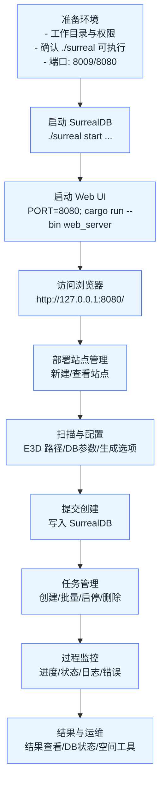
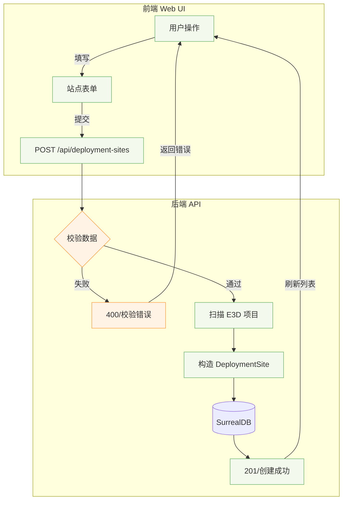
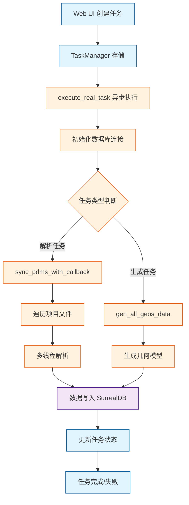

# Web UI 部署管理平台｜开发文档（单机部署、无 Docker）

> 适用场景：单机服务器，SurrealDB 二进制与服务与 Web UI 同一工作目录；Rust 调试模式运行（cargo run），不启用 release；默认端口 SurrealDB=8009，Web UI=8080。

---

## 1. 背景与目标
- 为团队提供一份在服务器单机环境下，快速、稳定地部署与使用 Web UI 的开发指南
- 与 GitHub Issue 兼容的 Markdown，便于讨论、跟踪与更新
- 内容覆盖：运行环境、快速开始、使用流程图、功能模块说明、常见操作 SOP、故障排查、附录速查

---

## 2. 运行环境与前置条件
- OS：Linux/macOS（建议 Linux server）
- Rust 工具链：cargo、rustc 已安装
- 工作目录：设为 /opt/gen-model（或你的实际路径），以下命令均在该目录执行
- SurrealDB：二进制在当前目录 `./surreal`，可执行（`chmod +x ./surreal`）
- 端口未被占用：8009（SurrealDB）、8080（Web UI）

> 若命令找不到，可用 `brew info <name>` 定位安装路径，然后用绝对路径执行

---

## 3. 快速开始（单机）

### 3.1 启动 SurrealDB（同目录）
```bash
./surreal start --user root --pass root --bind 127.0.0.1:8009 rocksdb://ams-8009-test.db
```

### 3.2 启动 Web UI（调试模式）
```bash
export PORT=8080 RUST_LOG=info
cargo run --bin web_server
```

### 3.3 访问与验证
- 浏览器访问：`http://127.0.0.1:8080/`
- SurrealDB CLI（示例，命名空间与DB按项目实际）：
```bash
./surreal sql --conn ws://127.0.0.1:8009 --user root --pass root --ns 1516 --db AvevaMarineSample
```

> 参考号格式示例：`24383_86525`（下划线替换斜杠），可查询 `pe` 表、`ATT_NAMED` 表，沿 `owner` 字段查询层级关系

---

## 4. 使用流程（Mermaid 流程图）

### 4.1 整体使用流程


### 4.2 创建部署站点


### 4.3 站点任务创建与执行
```mermaid
graph TD
    A[选择部署站点] --> B[创建任务]
    B --> C[选择类型\nFull/Data/Spatial/Mesh]
    C --> D[可选覆盖配置\nDB 列表/容差/关键字]
    D --> E[提交任务\nPOST /api/deployment-sites/{id}/tasks]
    E --> TM[TaskManager 入队\n状态=Pending]
    TM --> X[开始执行\n状态=Running]
    X --> L[实时日志/进度]
    X -->|成功| S[状态=Completed]
    X -->|失败| F[状态=Failed\n错误详情]
    S --> U[查看结果/下载]
    F --> U
    classDef node fill:#eef7ff,stroke:#5aa0ff
    class A,B,C,D,E,TM,X,L,S,F,U node
```

---

## 5. Web UI 功能模块说明（主要页面）
- 首页（`/`）：平台入口与导航，快速进入核心功能
- 仪表盘（`/dashboard`）：系统状态与最近任务概览（CPU/内存/任务趋势/资源使用）
- 配置管理（`/config`）：配置模板、参数配置（数据库编号、生成选项、网格参数等）、预览与保存
- 任务管理（`/tasks`，`/tasks/:id/logs`）：任务创建、启停/删除、实时进度条、日志与错误详情
- 批量任务（`/batch-tasks`）：一次性批量创建多条任务
- 数据库状态与部署站点（`/db-status`）：站点列表、站点健康/状态、SurrealDB 连接状态与检查
- 部署向导（`/wizard`）：引导式创建站点（E3D 路径、DB 参数、生成选项）
- 空间工具（`/space-tools`）：空间拟合、相对关系、距离与跨度等分析工具
- SQLite 空间分析（`/sqlite-spatial`）：基于 SQLite/R-Tree 的空间检测与分析
- 桥架支撑检测（`/tray-supports`）：专题检测页面与 API（`/api/sqlite-tray-supports/detect`）
- SCTN 测试流程（`/sctn-test`）：后台任务 + 进度 + 结果（`/api/sctn-test/*`）
- 数据库连接（`/database-connection`）：查看/配置数据库连接信息
- 静态资源（`/static`）：前端静态文件（Tailwind、Alpine.js、Chart.js、图标等）

> 后端基于 Axum，已注册丰富 REST API；内置 SurrealDB 启动/探测与任务调度（含 auto_update_scheduler、projects_health_scheduler）。

---

## 6. 常见操作 SOP（单机）
### 6.1 启停
```bash
# 启动 SurrealDB（同目录）
./surreal start --user root --pass root --bind 127.0.0.1:8009 rocksdb://ams-8009-test.db

# 启动 Web UI（调试模式）
export PORT=8080; cargo run --bin web_server
```

### 6.2 日志
```bash
# Web UI（journald 或终端输出）
journalctl -u web-ui -f  # 若已服务化

# 仓库日志（如有）
tail -f web_server.log
```

### 6.3 升级/回滚
```bash
# 升级
git pull && systemctl restart web-ui  # 若服务化

# 回滚到指定提交/标签
git checkout <commit|tag> && systemctl restart web-ui
```

### 6.4 故障排查
- 端口占用：`lsof -i :8080` / `lsof -i :8009`
- SurrealDB 启动失败：确认 `./surreal` 可执行与数据路径存在
- 命令找不到：`brew info surrealdb` / `brew info rust` 定位路径后用绝对路径执行

---

## 7. 故障排除（FAQ）
- Q: 访问 8080 无响应？
  - A: 确认 Web UI 正在运行，防火墙开放，`curl -I http://127.0.0.1:8080/` 返回 200
- Q: Web UI 报数据库连接失败？
  - A: 确认 SurrealDB 在本机 8009 端口运行，账号/密码正确；CLI 可连通
- Q: 任务卡在 Pending？
  - A: 查看后台日志；确认依赖资源可用；必要时重启任务或 Web UI
- Q: Mermaid 不显示？
  - A: GitHub Issue 支持 Mermaid（已全量开放）；若本地查看，请使用支持 Mermaid 的阅读器

---

## 8. 附录：端口与环境变量、命令速查
- 端口
  - SurrealDB：`ws://127.0.0.1:8009`
  - Web UI：`http://127.0.0.1:8080`
- 环境变量
  - `PORT=8080`（Web UI 监听端口）
  - `RUST_LOG=info`（日志级别）
- 命令速查
```bash
# 启 SurrealDB
./surreal start --user root --pass root --bind 127.0.0.1:8009 rocksdb://ams-8009-test.db

# 启 Web UI
export PORT=8080; cargo run --bin web_server

# SurrealDB CLI（示例）
./surreal sql --conn ws://127.0.0.1:8009 --user root --pass root --ns 1516 --db AvevaMarineSample
```

---

## 9. Issue 使用建议
- 标题建议：【开发文档】Web UI 部署管理平台（单机部署｜无 Docker）
- 标签建议：`documentation` `deployment` `web-ui`
- 模板建议：
  - 描述（背景/目标）
  - 运行环境（OS/路径/端口）
  - 快速开始（命令）
  - 使用流程（Mermaid）
  - 功能模块
  - SOP / 故障排查
  - 附录（端口/环境/速查）
  - 变更记录（后续补充）

---

> 维护：建议由使用者每次变更部署方式/端口/依赖后，在本 Issue 下追加评论或编辑文档，保持与实际一致。

---

## 10. 数据库连接模块（功能与实现）

本节梳理 WebUI 中“数据库连接”相关的所有能力、交互与后端实现，便于开发/排障与二次扩展。

### 10.1 功能清单（前端视角）
- 基本连接信息：数据库类型、IP、端口、用户名、密码、命名空间(NS)/数据库(DB)，支持本机与脚本化启动
- 一键体检：显示“是否在监听/是否可查询/错误详情/建议”
- 启动脚本：自动扫描 `cmd/` 下的 `surreal*.sh`，一键启动；若不存在可生成默认脚本
- 端口工具：查询端口占用、强制释放端口
- 连接测试：使用页面输入参数直连 SurrealDB 做一次真实查询
- 启动进度：异步跟踪数据库启动的阶段与百分比

入口页面：`/database-connection`（简易版见 `src/web_server/simple_templates.rs`），向导页也提供了启动/测试入口（`src/web_server/wizard_template.rs`）。

### 10.2 核心数据结构（后端）
- `DatabaseConfig`：连接与任务混合配置，含 `db_ip/db_port/db_user/db_password/project_code/project_name` 等。
  - 位置：`src/web_server/models.rs:232`
- `DatabaseConnectionStatus`：体检返回体，含 `connected/error_message/connection_time/last_check/config`。
  - 位置：`src/web_server/handlers.rs:4668`
- `StartupScript`：启动脚本的展示信息。
  - 位置：`src/web_server/handlers.rs:4688`

### 10.3 后端接口（REST）
- 连接体检：`GET /api/database/connection/check`
  - 实现：`src/web_server/handlers.rs:4700` 调用 `check_surrealdb_connection` → 端口是否在监听 + `SELECT 1` 探活
- 启动脚本列表：`GET /api/database/startup-scripts`
  - 实现：`src/web_server/handlers.rs:4722` 扫描 `cmd/` 目录的 `surreal*.sh`，并标记可执行权限
- 用脚本启动实例：`POST /api/database/start-instance`（body: `{ script_path, port }`）
  - 实现：`src/web_server/handlers.rs:4758` 若脚本缺失会创建默认脚本；随后后台 `bash` 执行
- Surreal 状态：`GET /api/surreal/status?ip=&port=`
  - 实现：`src/web_server/handlers.rs:2660` 组合“端口监听 + 全局连接能否查询”
- 连接测试：`POST /api/surreal/test`
  - 请求体：`{ ip, port, user, password, namespace, database }`
  - 实现：`src/web_server/handlers.rs:2701` → `src/web_server/db_connection.rs:96` 真连一次（Ws → signin → use_ns/db → `RETURN 'ok'`）

#### 10.3.1 默认参数与界面行为
- 默认账号密码：`root/root`（页面初始即为此值，可在界面修改）
- 默认命名空间/数据库：`1516 / AvevaMarineSample`（页面可修改）
- 默认主机/端口：`127.0.0.1 / 8009`
- 体检与连接测试：始终使用“当前界面填写的参数”，而不是后端默认配置。
  - 体检：`GET /api/database/connection/check?ip=&port=&user=&password=&namespace=&database=`
  - 测试：`POST /api/surreal/test`（同页面参数）
  - 说明：为避免 `localhost` 兼容性问题，推荐使用 `127.0.0.1`。
- 端口占用检测：`GET /api/surreal/check-port?port=8009`
  - 实现：`src/web_server/handlers.rs:71` 基于 `lsof -ti :<port>`
- 端口占用清理：`POST /api/surreal/kill-port`（body: `{ port }`）
  - 实现：`src/web_server/handlers.rs:102` 尝试 `kill -TERM`，必要时 `-KILL`
- 启动管理（推荐）：
  - 开始启动：`POST /api/database/startup/start`
  - 查询状态：`GET /api/database/startup/status?ip=&port=`
  - 列出所有实例：`GET /api/database/startup/instances`
  - 停止实例：`POST /api/database/startup/stop`（body: `{ ip, port }`）
  - 实现：`src/web_server/db_startup_handlers.rs:1`；状态管理与步骤在 `src/web_server/db_startup_manager.rs`

说明：历史的 `/api/surreal/start|stop|restart` 也有实现（`src/web_server/handlers.rs:2189/2437/2612`），但在路由层暂时注释。建议统一走“启动管理”接口集，上层更好展示进度/错误。

### 10.4 连接初始化与复用
- 按站点（或配置）创建连接：`init_surreal_with_config`
  - 位置：`src/web_server/db_connection.rs:15`
  - 步骤：`Surreal::new::<Ws>(host:port)` → `signin(Root{user,pass})` → `use_ns(project_code).use_db(project_name)`
- 连接池：`DEPLOYMENT_DB_CONNECTIONS`（按 `ip:port` 缓存 `Surreal<Client>`）
  - 位置：`src/web_server/db_connection.rs:10`
- 在任务入口初始化并写入连接池（便于后续查询使用）
  - 位置：`src/web_server/handlers.rs:2920`（任务执行前置步骤）

### 10.5 启动/诊断实现要点
- 启动改进版：检查 `surreal` 是否存在 → 检测端口，若被占用则先 `kill` 占用进程再继续 → 始终以 `--bind 0.0.0.0:<port>` 启动 → 跟踪端口可达 + 功能性查询
  - 实现：
    - 统一绑定 0.0.0.0：`src/web_server/handlers.rs:2234`
    - 自动清理占用并重启：`src/web_server/db_startup_manager.rs:201`（复用 `kill_port_processes`）
- 生成默认脚本：`./surreal start --user <u> --pass <p> --bind <ip:port> rocksdb://ams-<port>-test.db`
  - 位置：`src/web_server/handlers.rs:4889`
- 数据库诊断：配置校验/CLI/端口/TCP/功能性/进程 PID 文件，输出建议列表
  - 位置：`src/web_server/database_diagnostics.rs:1`

### 10.6 常见问题与处理
- 连接被拒绝/超时：优先看端口监听与 TCP 测试；用 `GET /api/surreal/check-port` + `POST /api/surreal/kill-port` 清理占用后重启
- 认证失败：确认用户名/密码；默认 `root/root`；`POST /api/surreal/test` 会给出更明确的报错
- NS/DB 不存在：首次连接会自动创建；若失败，检查 `project_code/project_name`
- `localhost` 连接异常：SurrealDB 2.x 建议使用 `127.0.0.1`（代码中已自动替换）

### 10.7 安全与日志
- 已屏蔽测试连接接口中的明文密码输出，只记录长度
  - 位置：`src/web_server/handlers.rs:2713`
- 建议：
  - 生产环境禁用过多 `println!`；统一走日志宏并按级别输出
  - 页面仅在用户显式点击时显示密码；默认遮罩

### 10.8 调试速查（curl）
```bash
# 体检
curl -s http://127.0.0.1:8080/api/database/connection/check | jq

# 列脚本
curl -s http://127.0.0.1:8080/api/database/startup-scripts | jq

# 连接测试
curl -s -X POST http://127.0.0.1:8080/api/surreal/test \
  -H 'Content-Type: application/json' \
  -d '{"ip":"127.0.0.1","port":8009,"user":"root","password":"root","namespace":"1516","database":"AvevaMarineSample"}' | jq

# 启动（带进度，详见 /api/database/startup/status）
curl -s -X POST http://127.0.0.1:8080/api/database/startup/start \
  -H 'Content-Type: application/json' \
  -d '{"ip":"127.0.0.1","port":8009,"user":"root","password":"root","dbFile":"ams-8009-test.db"}' | jq
```

以上即"数据库连接"模块的功能与落地实现，满足单机环境下的配置、启动、体检、诊断与安全要求。若需要我把向导页改成调用新的"启动管理"接口集，请告知我来一起改前端调用点。

---

## 11. 任务执行机制（解析任务运行原理）

本节详细说明 Web UI 中任务创建与执行的内部机制，特别是 PDMS/E3D 数据解析任务的运行原理。

### 11.1 任务创建流程

#### 11.1.1 任务创建入口
- **API 端点**：`POST /api/tasks`
- **处理函数**：`create_task` (src/web_server/handlers.rs:1124)
- **请求数据结构**：
  ```rust
  CreateTaskRequest {
      name: String,              // 任务名称
      task_type: TaskType,        // 任务类型
      config: DatabaseConfig {    // 任务配置
          db_ip: String,          // 数据库 IP
          db_port: String,         // 数据库端口
          db_user: String,        // 数据库用户
          db_password: String,    // 数据库密码
          project_name: String,   // 项目名称
          project_code: String,   // 项目代码
          project_path: String,   // 项目路径
          manual_db_nums: Vec<u32>, // 数据库编号列表
          gen_model: bool,        // 是否生成模型
          gen_mesh: bool,         // 是否生成网格
          gen_spatial_tree: bool, // 是否生成空间树
          apply_boolean_operation: bool, // 是否应用布尔运算
          mesh_tol_ratio: f64,    // 网格容差比例
      }
  }
  ```

#### 11.1.2 任务类型
- `ParsePdmsData`：仅解析 PDMS/E3D 数据
- `FullGeneration`：解析数据 + 生成几何模型
- `DataParsingWizard`：向导式解析（支持多项目选择）
- `ModelGeneration`：仅生成模型（不解析）
- `SpatialTreeGeneration`：生成空间索引树

#### 11.1.3 任务存储
- 任务信息存储在内存中的 `TaskManager` (通过 `Arc<Mutex<>>` 保证线程安全)
- 任务状态：`Pending` → `Running` → `Completed`/`Failed`/`Cancelled`

### 11.2 任务执行流程

#### 11.2.1 任务启动
- **API 端点**：`POST /api/tasks/:id/start`
- **处理函数**：`start_task` (src/web_server/handlers.rs:1147)
- **执行方式**：通过 `tokio::spawn` 异步执行 `execute_real_task`

#### 11.2.2 核心执行函数
**函数签名**：`async fn execute_real_task(state: AppState, task_id: String)`
**位置**：src/web_server/handlers.rs:2862

**执行步骤**：
1. **初始化数据库连接** (使用 WebUI 配置而非 DbOption.toml)
   - 调用 `init_surreal_with_config` 建立连接
   - 连接存储到全局连接池 `DEPLOYMENT_DB_CONNECTIONS`

2. **根据任务类型执行不同逻辑**
   - 解析类任务：执行 PDMS/E3D 数据解析
   - 生成类任务：执行模型生成、空间树构建等

3. **进度更新机制**
   - 通过闭包回调实时更新任务进度
   - 更新内容包括：当前步骤、完成百分比、日志信息

### 11.3 解析任务运行机制

#### 11.3.1 解析入口函数
**函数**：`sync_pdms_with_callback`
**位置**：src/versioned_db/database.rs:147
**参数**：
- `db_option: &DbOption` - 数据库配置选项
- `progress_callback: Option<F>` - 进度回调函数

#### 11.3.2 解析流程
1. **性能优化准备**
   - 移除数据库 EVENT (`update_dbnum_event`) 以提高解析性能

2. **项目遍历解析**
   - 遍历 `included_projects` 中的所有项目
   - 统计项目文件数量用于进度计算

3. **分阶段解析**
   - **系统数据阶段**：解析 DICT, SYST, GLB, GLOB 表
   - **设计数据阶段**：解析 DESI, CATA 表

4. **多线程并发解析**
   - 调用 `sync_total_async_threaded_with_callback` 执行并发解析
   - 扫描项目目录下的数据文件
   - 并发处理多个文件，提高解析效率

5. **解析完成处理**
   - 重新定义数据库 EVENT
   - 更新 `dbnum_info_table` 状态

#### 11.3.3 进度回调机制
**回调函数签名**：
```rust
FnMut(&str, usize, usize, usize, usize, usize, usize)
// 参数：项目名, 当前项目序号, 总项目数, 当前文件序号, 总文件数, 当前块序号, 总块数
```

**进度计算公式**：
```rust
let project_ratio = current_project / total_projects;
let file_ratio = current_file / (total_projects * total_files);
let chunk_ratio = current_chunk / (total_projects * total_files * total_chunks);
let percentage = base + step_share * (0.2 + 0.6 * project_ratio + 0.15 * file_ratio + 0.05 * chunk_ratio);
```

### 11.4 任务状态管理

#### 11.4.1 任务状态枚举
- `Pending`：等待执行
- `Running`：正在执行
- `Completed`：执行成功
- `Failed`：执行失败
- `Cancelled`：用户取消

#### 11.4.2 任务操作
- **停止任务**：`POST /api/tasks/:id/stop` - 将状态改为 `Cancelled`
- **重启任务**：`POST /api/tasks/:id/restart` - 仅允许重启失败的任务
- **删除任务**：`DELETE /api/tasks/:id` - 从活动列表或历史记录中删除

### 11.5 错误处理机制

#### 11.5.1 错误详情结构
```rust
ErrorDetails {
    error_type: String,        // 错误类型
    error_code: Option<String>, // 错误代码
    failed_step: String,       // 失败步骤
    detailed_message: String,  // 详细信息
    stack_trace: Option<String>, // 堆栈跟踪
    suggested_solutions: Vec<String>, // 建议解决方案
    related_config: Option<Value>, // 相关配置
}
```

#### 11.5.2 常见错误处理
- **数据库连接失败**：记录连接参数和错误信息，提供诊断建议
- **解析失败**：保存失败位置和原因，支持断点续传
- **任务超时**：自动标记为失败，记录超时信息

### 11.6 数据流向



### 11.7 性能优化策略

1. **数据库优化**
   - 解析前移除 EVENT 触发器，减少写入开销
   - 批量写入，减少数据库交互次数

2. **并发处理**
   - 多线程并发解析文件
   - 使用 `FuturesUnordered` 管理异步任务

3. **内存管理**
   - 流式处理大文件，避免一次性加载
   - 及时释放已处理数据的内存

4. **进度优化**
   - 异步更新进度，不阻塞主流程
   - 批量更新日志，减少 UI 刷新频率

### 11.8 调试与监控

#### 11.8.1 日志输出
- 任务创建、启动、完成等关键节点都有日志
- 解析过程输出文件处理进度
- 错误发生时记录详细堆栈信息

#### 11.8.2 实时监控
- **任务列表**：`GET /api/tasks` - 查看所有任务状态
- **任务详情**：`GET /api/tasks/:id` - 查看单个任务详细信息
- **任务日志**：`GET /api/tasks/:id/logs` - 查看任务执行日志
- **错误详情**：`GET /api/tasks/:id/error` - 查看任务错误详情

### 11.9 配置说明

#### 11.9.1 数据库配置优先级
1. WebUI 任务配置（最高优先级）
2. 部署站点配置
3. DbOption.toml（最低优先级）

#### 11.9.2 关键配置项
- `manual_db_nums`：空数组表示处理所有数据库
- `total_sync`：true 表示全量同步
- `gen_model/gen_mesh/gen_spatial_tree`：控制生成内容
- `mesh_tol_ratio`：网格精度控制（0.01-1.0）

### 11.10 最佳实践

1. **任务创建**
   - 合理设置任务名称，便于识别
   - 根据数据量选择合适的任务类型

2. **性能调优**
   - 大项目建议分批处理
   - 合理设置网格容差，平衡精度与性能

3. **错误恢复**
   - 失败任务支持重启，无需重新配置
   - 查看错误详情，根据建议解决问题

4. **监控维护**
   - 定期清理历史任务记录
   - 监控任务执行时间，优化长时间任务
