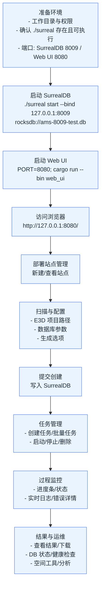
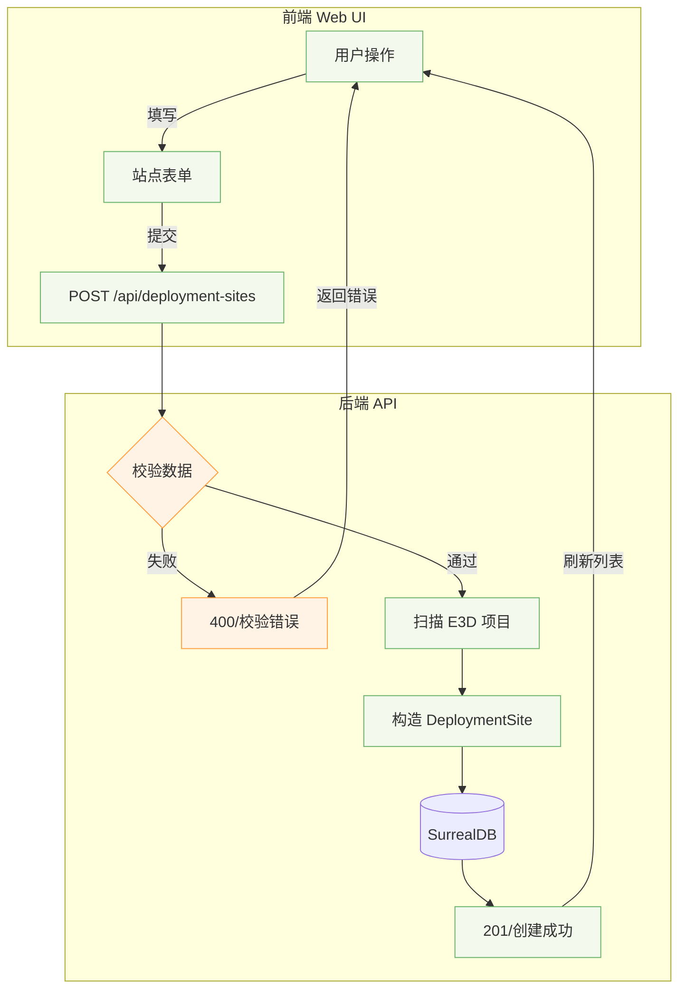

# 部署管理平台使用流程与功能模块概览（单机部署，无 Docker）

> 前提：单机部署；`surreal` 二进制与服务在同一工作目录；使用 cargo 调试模式运行 Web UI；默认端口 SurrealDB=8009，Web UI=8080。

---

## 一、整体使用流程（流程图）



---

## 二、创建部署站点流程



---

## 三、站点任务创建与执行流程

```mermaid
graph TD
    A[选择部署站点] --> B[创建任务]
    B --> C[选择任务类型\nFull/Data/Spatial/Mesh]
    C --> D[可选覆盖配置\nDB 列表、容差、关键字]
    D --> E[提交任务\nPOST /api/deployment-sites/{id}/tasks]
    E --> TM[TaskManager 入队\n状态=Pending]
    TM --> X[开始执行\n状态=Running]
    X --> L[实时日志/进度]
    X -->|成功| S[状态=Completed]
    X -->|失败| F[状态=Failed\n错误详情]
    S --> U[查看结果/下载]
    F --> U
    classDef node fill:#eef7ff,stroke:#5aa0ff
    class A,B,C,D,E,TM,X,L,S,F,U node
```

---

## 四、Web UI 功能模块清单（主要页面与能力）

- 首页（`/`）
  - 入口与导航，快速访问核心功能
- 仪表盘（`/dashboard`）
  - 系统状态与最近任务概览（CPU/内存、任务趋势、资源使用等）
- 配置管理（`/config`）
  - 配置模板、参数配置（数据库编号、生成选项、网格参数等）、配置预览与保存
- 任务管理（`/tasks`，`/tasks/:id/logs`）
  - 任务创建、启动/停止/删除、实时进度条与日志、错误详情
- 批量任务（`/batch-tasks`）
  - 一次性批量创建多条任务
- 数据库状态与部署站点（`/db-status`）
  - 站点列表、站点健康/状态、SurrealDB 连接状态与检查
- 部署向导（`/wizard`）
  - 引导式创建站点：E3D 项目路径、DB 参数、生成选项
- 空间工具集合（`/space-tools`）
  - 空间拟合、相对关系、距离与跨度等分析工具
- SQLite 空间分析（`/sqlite-spatial`）
  - 基于 SQLite/R-Tree 的空间检测与分析
- 桥架支撑检测（`/tray-supports`）
  - 专项检测页面与 API（`/api/sqlite-tray-supports/detect`）
- SCTN 测试流程（`/sctn-test`）
  - 后台任务 + 进度 + 结果查看（`/api/sctn-test/*`）
- 数据库连接（`/database-connection`）
  - 查看/配置数据库连接信息
- 静态资源（`/static`）
  - 前端静态文件服务（Tailwind、Alpine.js、Chart.js、图标等）

> 说明：后端基于 Axum，已注册丰富 REST API；内置任务管理与 SurrealDB 启动/探测逻辑，并有自动任务（auto_update_scheduler、projects_health_scheduler）。

---

## 五、常用端口与入口

- SurrealDB：`ws://127.0.0.1:8009`
- Web UI：`http://127.0.0.1:8080`

---

## 六、快速验证步骤（单机）

1. 启动 SurrealDB（同目录）
   ```bash
   ./surreal start --user root --pass root --bind 127.0.0.1:8009 rocksdb://ams-8009-test.db
   ```
2. 启动 Web UI（调试模式）
   ```bash
   export PORT=8080 RUST_LOG=info
   cargo run --bin web_ui
   ```
3. 打开浏览器访问
   - `http://127.0.0.1:8080/`
4. 数据库 CLI 验证（参考你的使用习惯）
   ```bash
   ./surreal sql --conn ws://127.0.0.1:8009 --user root --pass root --ns 1516 --db AvevaMarineSample
   ```

---

（本文件可直接在支持 Mermaid 的阅读器中渲染三张流程图；如需导出 PNG/SVG，可使用 mermaid-cli 或在线编辑器）

