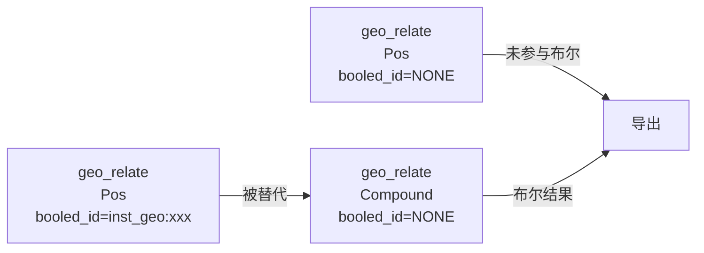

# OBJ 导出变换计算

## 1. 概述

OBJ 导出时，需要将几何体从局部坐标系变换到世界坐标系。本文档说明变换计算的方案。

**文件位置**: `src/fast_model/export_model/export_common.rs`

---

## 2. 变换计算公式

```rust
// 统一使用完整的 world_trans * geo_trans
let world_matrix = geom_inst.world_trans.to_matrix() * inst.transform.to_matrix();
```

### 2.1 变量说明

| 变量 | 来源 | 说明 |
|------|------|------|
| `world_trans` | `inst_relate.world_trans.d` | 实例的世界变换（包含平移、旋转、缩放） |
| `geo_trans` | `geo_relate.trans.d` | 几何体的局部变换 |

### 2.2 不同几何类型的 geo_trans

| geo_type | geo_trans | 说明 |
|----------|-----------|------|
| `Pos` | 几何体局部变换 | 原始正实体，有自己的局部变换 |
| `Compound` | 单位变换 `trans:⟨0⟩` | 布尔运算后的结果，已在局部坐标系中 |

---

## 3. 布尔结果查询

### 3.1 查询逻辑

```sql
SELECT 
    trans.d as transform, 
    record::id(out) as geo_hash
FROM geo_relate 
WHERE visible 
  AND meshed 
  AND trans.d != NONE 
  AND geo_type IN ['Pos', 'Compound'] 
  AND booled_id = NONE  -- 排除已被布尔替代的几何体
```

### 3.2 booled_id 字段

| 值 | 说明 |
|----|------|
| `NONE` | 未被布尔替代（需要导出） |
| `inst_geo:⟨xxx⟩` | 已被布尔替代，指向 Compound 结果（不导出） |

### 3.3 数据结构示意



---

## 4. 代码实现

### 4.1 查询阶段 (rs-core/src/rs_surreal/inst.rs)

```rust
let sql = format!(r#"
    SELECT
        in.id as refno,
        in.owner as owner,
        aabb.d as world_aabb,
        world_trans.d as world_trans,
        (SELECT 
            trans.d as transform, 
            record::id(out) as geo_hash
         FROM out->geo_relate 
         WHERE visible AND meshed AND trans.d != NONE 
           AND geo_type IN ['Pos', 'Compound'] 
           AND booled_id = NONE) as insts,
        bool_status = 'Success' as has_neg
    FROM inst_relate 
    WHERE in IN [{pe_keys_str}]
"#);
```

### 4.2 变换计算阶段 (gen-model-fork/src/fast_model/export_model/export_common.rs)

```rust
for inst in &geom_inst.insts {
    // 计算世界变换矩阵: world_trans * geo_trans
    let world_matrix = geom_inst.world_trans.to_matrix().as_dmat4()
        * inst.transform.to_matrix().as_dmat4();
    
    geometries.push(GeometryInstance {
        geo_hash: inst.geo_hash.clone(),
        transform: world_matrix,
    });
}
```

---

## 5. 相关文档

- **布尔运算数据模型**: `../布尔运算/02_数据模型.md`
- **导出流程总览**: `导出流程总览.md`

---

**文档版本**: 1.0  
**最后更新**: 2024-12-07
