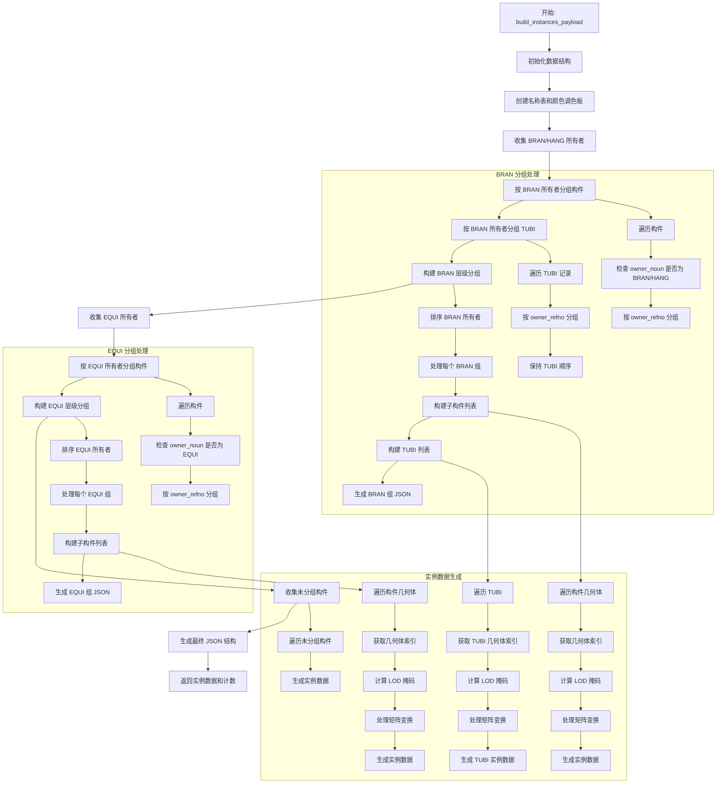

# build_instances_payload 导出流程详细说明

## 概述

`build_instances_payload` 函数是 Prepack LOD 导出系统的核心组件，负责将 3D 模型数据转换为结构化的实例载荷格式。该函数处理工厂模型中的各种构件类型（BRAN、EQUI、TUBI 等），并将它们组织成分层的实例数据结构，最终生成可用于前端渲染的 JSON 格式文件。

## 主要功能

1. **构件分组处理**：按照 BRAN、EQUI 和未分组构件进行分类处理
2. **实例数据生成**：为每个构件创建包含几何体引用、变换矩阵、材质等信息的实例数据
3. **名称和颜色管理**：统一管理构件名称和材质颜色，避免重复存储
4. **LOD 支持**：为不同细节级别生成相应的掩码信息
5. **单位转换**：处理从毫米到米的单位转换

## 流程图



## 详细步骤说明

### 1. 初始化阶段

```rust
let mut name_table = NameTable::new();
let unknown_site_index = name_table.get_or_insert("site", "UNKNOWN_SITE");
let mut color_palette = ColorPalette::new(material_library);
let mut component_instance_count = 0usize;
```

- **名称表初始化**：创建 `NameTable` 用于管理所有构件名称，避免重复存储
- **颜色调色板初始化**：创建 `ColorPalette` 用于管理材质颜色
- **实例计数器**：初始化组件实例计数器

### 2. BRAN/HANG 分组处理

#### 2.1 收集 BRAN 所有者

```rust
let mut bran_owners: HashSet<RefnoEnum> = HashSet::new();
for component in &export_data.components {
    if matches!(component.owner_noun.as_deref(), Some("BRAN") | Some("HANG")) {
        if let Some(owner) = component.owner_refno {
            bran_owners.insert(owner);
        }
    }
}
```

- 遍历所有构件，识别 owner_noun 为 "BRAN" 或 "HANG" 的构件
- 收集这些构件的 owner_refno，用于后续分组

#### 2.2 TUBI 所有者处理

```rust
for tubing in &export_data.tubings {
    if !tubing.owner_refno.is_unset() {
        bran_owners.insert(tubing.owner_refno);
    }
}
```

- 将 TUBI 的 owner_refno 也加入 BRAN 所有者集合
- 确保 TUBI 能够正确关联到对应的 BRAN/HANG

#### 2.3 构件分组

```rust
let mut bran_children_map: HashMap<RefnoEnum, Vec<&ComponentRecord>> = HashMap::new();
for component in &export_data.components {
    if matches!(component.owner_noun.as_deref(), Some("BRAN") | Some("HANG")) {
        if let Some(owner) = component.owner_refno {
            bran_children_map.entry(owner).or_default().push(component);
        }
    }
}
```

- 按 owner_refno 将构件分组到 `bran_children_map`
- 每个 BRAN/HANG 包含其下属的所有构件

#### 2.4 TUBI 分组

```rust
let mut bran_tubi_map: BTreeMap<RefnoEnum, Vec<&TubiRecord>> = BTreeMap::new();
for tubing in &export_data.tubings {
    let key_refno = if tubing.owner_refno.is_unset() {
        tubing.refno
    } else {
        tubing.owner_refno
    };
    bran_tubi_map.entry(key_refno).or_default().push(tubing);
}
```

- 使用 `BTreeMap` 保持 TUBI 的顺序
- 处理 owner_refno 未设置的情况，使用 TUBI 自身的 refno

### 3. BRAN 层级构建

#### 3.1 遍历 BRAN 所有者

```rust
for bran_refno in bran_owners_sorted {
    let bran_name = refno_name_map.get(&bran_refno).cloned();
    let bran_label = bran_name.clone().unwrap_or_else(|| bran_refno.to_string());
    let bran_name_index = name_table.get_or_insert("bran", &bran_label);
```

- 获取 BRAN 的名称和索引
- 如果没有名称，使用 refno 作为默认名称

#### 3.2 子构件处理

```rust
for component in children {
    let component_label = component
        .name
        .as_ref()
        .filter(|name| !name.is_empty())
        .cloned()
        .unwrap_or_else(|| component.refno.to_string());
    let name_index = name_table.get_or_insert("component", &component_label);
    let color_index = color_palette.index_for_noun(&component.noun);
    let color_rgba = color_palette.color_at(color_index);
```

- 为每个构件生成标签和名称索引
- 根据构件类型获取对应的颜色索引

#### 3.3 几何体实例生成

```rust
for geom in &component.geometries {
    if let Some(&geo_index) = geo_index_map.get(&geom.geo_hash) {
        component_instance_count += 1;
        let lod_mask = compute_lod_mask(&geom.geo_hash, lod_assets);
        let scale_matrix = !geom.geo_hash.contains('_');
        
        let mut uniforms = json!({
            "refno": component.refno.to_string(),
            "color_index": color_index,
            "owner_refno": bran_refno.to_string(),
            "owner_noun": component.owner_noun.clone().unwrap_or_else(|| "BRAN".to_string()),
        });
```

- 获取几何体在索引映射中的位置
- 计算 LOD 掩码，确定该几何体在哪些 LOD 级别中可用
- 判断是否需要缩放矩阵（共享几何体需要，专用几何体不需要）

#### 3.4 TUBI 处理

```rust
for (tubi_order, tubing) in tubings.iter().enumerate() {
    if let Some(&geo_index) = geo_index_map.get(&tubing.geo_hash) {
        let tubi_name_index = name_table.get_or_insert("tubi", &tubing.name);
        let lod_mask = compute_lod_mask(&tubing.geo_hash, lod_assets);
        
        let mut uniforms = json!({
            "refno": tubing.refno.to_string(),
            "color_index": color_index,
            "order": tubi_order,
        });
```

- 为每个 TUBI 生成顺序号
- TUBI 使用特殊的颜色索引（"TUBI" 类型）
- 包含顺序信息以保持管道的连接关系

### 4. EQUI 分组处理

EQUI 分组处理与 BRAN 类似，但有以下区别：

1. **所有者类型**：只处理 owner_noun 为 "EQUI" 的构件
2. **设备类型**：包含额外的 owner_type 信息
3. **无 TUBI**：EQUI 组不包含 TUBI 管道

```rust
let mut equi_owners: HashSet<RefnoEnum> = HashSet::new();
for component in &export_data.components {
    if matches!(component.owner_noun.as_deref(), Some("EQUI")) {
        if let Some(owner) = component.owner_refno {
            equi_owners.insert(owner);
        }
    }
}
```

### 5. 未分组构件处理

```rust
for component in &export_data.components {
    // 跳过已经在 BRAN/EQUI 分组中的构件
    if matches!(component.owner_noun.as_deref(), Some("BRAN") | Some("HANG") | Some("EQUI")) {
        continue;
    }
```

- 处理不属于任何 BRAN/EQUI 组的独立构件
- 这些构件直接作为顶级实例处理

### 6. 矩阵变换处理

```rust
fn mat4_to_vec(matrix: &DMat4, unit_converter: &UnitConverter, scale_matrix: bool) -> Vec<f32> {
    let mut cols = matrix.to_cols_array();
    if unit_converter.needs_conversion() {
        let factor = unit_converter.conversion_factor() as f64;
        // 复用几何：用矩阵缩放完成单位换算；专用几何（已做顶点换算）仅转换平移。
        if scale_matrix {
            for i in 0..3 {
                cols[i] *= factor;      // 第一列
                cols[4 + i] *= factor;  // 第二列
                cols[8 + i] *= factor;  // 第三列
            }
        }
        cols[12] *= factor;
        cols[13] *= factor;
        cols[14] *= factor;
    }
    cols.iter().map(|v| *v as f32).collect()
}
```

- **单位转换**：将矩阵从毫米转换为米
- **缩放处理**：共享几何体需要缩放整个矩阵，专用几何体只需要缩放平移部分
- **格式转换**：将 DMat4 转换为 f32 数组

### 7. LOD 掩码计算

```rust
fn compute_lod_mask(geo_hash: &str, lod_assets: &[LodAssetSummary]) -> u32 {
    let mut mask = 0u32;
    for summary in lod_assets {
        if summary.mesh_map.get(geo_hash).is_some() {
            if let Ok(level) = summary.level_tag.trim_start_matches('L').parse::<u32>() {
                if (1..=32).contains(&level) {
                    mask |= 1 << (level - 1);
                }
            }
        }
    }
    
    if mask == 0 {
        let levels = lod_assets.len().min(32);
        if levels > 0 {
            mask = (1u32 << levels) - 1;
        }
    }
    
    if mask == 0 {
        mask = 0b111;
    }
    
    mask
}
```

- **位掩码表示**：使用 32 位整数表示 LOD 级别
- **动态计算**：根据几何体在各 LOD 级别中的可用性设置对应位
- **默认处理**：如果没有找到任何 LOD，默认启用前 3 个级别

### 8. 最终数据结构

```rust
let instances_json = json!({
    "version": 2,
    "generated_at": generated_at,
    "colors": color_palette.into_colors(),
    "names": name_table.into_entries(),
    "bran_groups": bran_groups,
    "equi_groups": equi_groups,
    "ungrouped": ungrouped_entries,
});
```

- **版本信息**：当前为版本 2
- **生成时间**：ISO 8601 格式的时间戳
- **颜色表**：所有使用的材质颜色
- **名称表**：所有构件的名称映射
- **分组数据**：BRAN、EQUI 和未分组构件的实例数据

## 数据结构说明

### ComponentRecord

```rust
pub struct ComponentRecord {
    pub refno: RefnoEnum,
    pub noun: String,
    pub name: Option<String>,
    pub geometries: Vec<GeometryInstance>,
    pub owner_refno: Option<RefnoEnum>,
    pub owner_noun: Option<String>,
    pub owner_type: Option<String>,
}
```

- **refno**：构件的唯一标识符
- **noun**：构件类型（如 "NOZZLE"、"VALVE" 等）
- **name**：构件名称
- **geometries**：构件包含的几何体实例列表
- **owner_refno**：所有者的 refno（BRAN/EQUI）
- **owner_noun**：所有者类型
- **owner_type**：设备类型（仅对 EQUI 有意义）

### TubiRecord

```rust
pub struct TubiRecord {
    pub refno: RefnoEnum,
    pub owner_refno: RefnoEnum,
    pub geo_hash: String,
    pub transform: DMat4,
    pub index: usize,
    pub name: String,
}
```

- **refno**：TUBI 的唯一标识符
- **owner_refno**：所属的 BRAN/HANG 的 refno
- **geo_hash**：几何体哈希值（带 "t_" 前缀）
- **transform**：世界变换矩阵
- **index**：在管道中的顺序
- **name**：TUBI 名称

### GeometryInstance

```rust
pub struct GeometryInstance {
    pub geo_hash: String,
    pub transform: DMat4,
    pub index: usize,
}
```

- **geo_hash**：几何体哈希值
- **transform**：世界变换矩阵
- **index**：几何体索引

## 输出格式

### 实例数据结构

```json
{
  "version": 2,
  "generated_at": "2023-12-07T10:30:00.000Z",
  "colors": [
    [0.8, 0.2, 0.2, 1.0],
    [0.2, 0.8, 0.2, 1.0],
    [0.2, 0.2, 0.8, 1.0]
  ],
  "names": [
    {"kind": "bran", "value": "BRAN-001"},
    {"kind": "component", "value": "NOZZLE-001"},
    {"kind": "tubi", "value": "TUBI_12345_1"}
  ],
  "bran_groups": [
    {
      "refno": "BRAN-001",
      "noun": "BRAN",
      "name": "主管道",
      "name_index": 0,
      "children": [
        {
          "refno": "NOZZLE-001",
          "noun": "NOZZLE",
          "name": "喷嘴1",
          "name_index": 1,
          "instances": [
            {
              "geo_hash": "abc123",
              "geo_index": 0,
              "matrix": [1,0,0,0, 0,1,0,0, 0,0,1,0, 10,0,0,1],
              "color_index": 0,
              "name_index": 1,
              "site_name_index": 0,
              "lod_mask": 7,
              "uniforms": {
                "refno": "NOZZLE-001",
                "color_index": 0,
                "owner_refno": "BRAN-001",
                "owner_noun": "BRAN",
                "color": [0.8, 0.2, 0.2, 1.0]
              }
            }
          ]
        }
      ],
      "tubings": [
        {
          "refno": "TUBI-12345",
          "noun": "TUBI",
          "geo_hash": "t_def456",
          "geo_index": 1,
          "matrix": [1,0,0,0, 0,1,0,0, 0,0,1,0, 5,0,0,1],
          "color_index": 1,
          "name_index": 2,
          "order": 0,
          "lod_mask": 7,
          "uniforms": {
            "refno": "TUBI-12345",
            "color_index": 1,
            "order": 0,
            "color": [0.2, 0.8, 0.2, 1.0]
          }
        }
      ]
    }
  ],
  "equi_groups": [
    {
      "refno": "EQUI-001",
      "noun": "EQUI",
      "name": "泵设备",
      "name_index": 3,
      "children": [
        {
          "refno": "PUMP-001",
          "noun": "PUMP",
          "name": "泵体",
          "name_index": 4,
          "instances": [
            {
              "geo_hash": "ghi789",
              "geo_index": 2,
              "matrix": [1,0,0,0, 0,1,0,0, 0,0,1,0, 20,0,0,1],
              "color_index": 2,
              "name_index": 4,
              "site_name_index": 0,
              "lod_mask": 7,
              "uniforms": {
                "refno": "PUMP-001",
                "color_index": 2,
                "owner_refno": "EQUI-001",
                "owner_noun": "EQUI",
                "owner_type": "CENTRIFUGAL",
                "color": [0.2, 0.2, 0.8, 1.0]
              }
            }
          ]
        }
      ]
    }
  ],
  "ungrouped": [
    {
      "refno": "STAND-001",
      "noun": "STAND",
      "name": "支架",
      "name_index": 5,
      "instances": [
        {
          "geo_hash": "jkl012",
          "geo_index": 3,
          "matrix": [1,0,0,0, 0,1,0,0, 0,0,1,0, 15,0,0,1],
          "color_index": 0,
          "name_index": 5,
          "site_name_index": 0,
          "lod_mask": 7,
          "uniforms": {
            "refno": "STAND-001",
            "color_index": 0,
            "color": [0.8, 0.2, 0.2, 1.0]
          }
        }
      ]
    }
  ]
}
```

## 性能优化

### 1. 名称表优化

- 使用 `HashMap` 缓存已处理的名称，避免重复存储
- 按类型分组管理名称（bran、component、tubi、site）

### 2. 颜色调色板优化

- 使用 `ColorPalette` 统一管理颜色，减少重复的 RGBA 值
- 根据构件类型（noun）快速查找对应颜色

### 3. 几何体索引映射

- 预先构建 `geo_index_map`，快速查找几何体索引
- 避免在循环中重复搜索

### 4. 内存管理

- 使用引用（`&ComponentRecord`）避免复制大量数据
- 及时释放不再需要的数据结构

## 错误处理

### 1. 几何体缺失

```rust
if let Some(&geo_index) = geo_index_map.get(&geom.geo_hash) {
    // 处理几何体
} else {
    // 跳过缺失的几何体
    continue;
}
```

### 2. 名称处理

```rust
let component_label = component
    .name
    .as_ref()
    .filter(|name| !name.is_empty())
    .cloned()
    .unwrap_or_else(|| component.refno.to_string());
```

### 3. LOD 掩码默认值

```rust
if mask == 0 {
    mask = 0b111;  // 默认启用前 3 个 LOD 级别
}
```

## 扩展性考虑

### 1. 新构件类型支持

- 通过修改 `matches!` 宏添加新的构件类型
- 扩展颜色调色板以支持新的类型

### 2. 新的分组方式

- 可以添加新的分组逻辑（如按区域、按系统等）
- 保持现有的数据结构兼容性

### 3. 自定义 uniform 数据

- 可以在 `uniforms` 对象中添加更多自定义属性
- 支持前端特定的渲染需求

## 总结

`build_instances_payload` 函数是整个导出流程的关键环节，它将复杂的 3D 工厂模型数据转换为结构化的实例格式，为前端渲染提供了优化的数据结构。通过合理的分组、索引和优化，该函数能够高效处理大规模的工厂模型，并保持数据的完整性和可读性。

该函数的设计充分考虑了性能、可维护性和扩展性，为工厂 3D 可视化系统提供了坚实的数据基础。