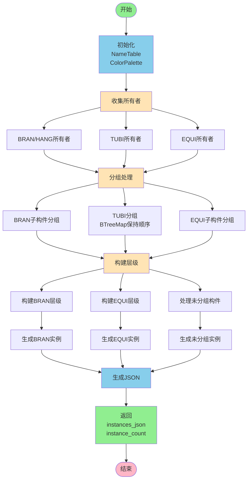
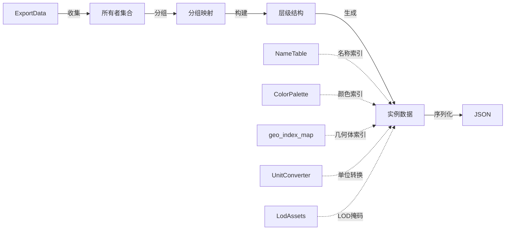

# build_instances_payload 导出流程总览

## 📋 文档说明

本文档详细记录了 `build_instances_payload` 函数的完整导出流程。该函数是 Prepack LOD 导出系统的核心组件，负责将 3D 模型数据转换为结构化的实例载荷格式。

**文件位置**: `src/fast_model/export_model/export_prepack_lod.rs`  
**函数行号**: 约 656-1000 行  
**调用位置**: `export_prepack_lod_v2` 函数中

---

## 🎯 核心功能

| 功能 | 说明 |
|------|------|
| **构件分组** | 按 BRAN、EQUI 和未分组三类处理 |
| **实例生成** | 为每个几何体生成实例数据（矩阵、颜色、LOD等） |
| **名称管理** | 统一管理构件名称，避免重复 |
| **颜色管理** | 根据构件类型分配颜色 |
| **LOD支持** | 计算每个实例的LOD掩码 |
| **单位转换** | 处理从毫米到米的转换 |

---

## 🔄 完整流程图



---

## 📊 数据流转



---

## 🔑 关键步骤

### 1. 初始化阶段

```rust
let mut name_table = NameTable::new();
let mut color_palette = ColorPalette::new(material_library);
let mut component_instance_count = 0usize;
```

- 创建名称表管理所有构件名称
- 创建颜色调色板管理材质颜色
- 初始化实例计数器

### 2. 收集所有者

```rust
// 收集 BRAN/HANG 所有者
let mut bran_owners: HashSet<RefnoEnum> = HashSet::new();
for component in &export_data.components {
    if matches!(component.owner_noun.as_deref(), Some("BRAN") | Some("HANG")) {
        if let Some(owner) = component.owner_refno {
            bran_owners.insert(owner);
        }
    }
}

// 收集 TUBI 所有者
for tubing in &export_data.tubings {
    if !tubing.owner_refno.is_unset() {
        bran_owners.insert(tubing.owner_refno);
    }
}

// 收集 EQUI 所有者
let mut equi_owners: HashSet<RefnoEnum> = HashSet::new();
for component in &export_data.components {
    if matches!(component.owner_noun.as_deref(), Some("EQUI")) {
        if let Some(owner) = component.owner_refno {
            equi_owners.insert(owner);
        }
    }
}
```

### 3. 分组处理

```rust
// BRAN 子构件分组
let mut bran_children_map: HashMap<RefnoEnum, Vec<&ComponentRecord>> = HashMap::new();

// TUBI 分组（使用 BTreeMap 保持顺序）
let mut bran_tubi_map: BTreeMap<RefnoEnum, Vec<&TubiRecord>> = BTreeMap::new();

// EQUI 子构件分组
let mut equi_children_map: HashMap<RefnoEnum, Vec<&ComponentRecord>> = HashMap::new();
```

### 4. 构建层级结构

对每个 BRAN/EQUI 组：
1. 获取所有者名称和颜色
2. 处理子构件列表
3. 为每个几何体生成实例数据
4. 处理 TUBI（仅 BRAN）

### 5. 生成实例数据

```rust
for geom in &component.geometries {
    if let Some(&geo_index) = geo_index_map.get(&geom.geo_hash) {
        component_instance_count += 1;
        let lod_mask = compute_lod_mask(&geom.geo_hash, lod_assets);
        let scale_matrix = !geom.geo_hash.contains('_');
        let matrix = mat4_to_vec(&geom.transform, unit_converter, scale_matrix);
        
        // 生成 InstanceEntry...
    }
}
```

### 6. 生成最终 JSON

```rust
let instances_json = json!({
    "version": 2,
    "generated_at": generated_at,
    "colors": color_palette.into_colors(),
    "names": name_table.into_entries(),
    "bran_groups": bran_groups,
    "equi_groups": equi_groups,
    "ungrouped": ungrouped_entries,
});

(instances_json, component_instance_count)
```

---

## 📝 输出格式

```json
{
  "version": 2,
  "generated_at": "2024-11-27T16:00:00Z",
  "colors": [[r, g, b, a], ...],
  "names": [{"kind": "...", "value": "..."}, ...],
  "bran_groups": [...],
  "equi_groups": [...],
  "ungrouped": [...]
}
```

---

## 🔗 相关文档

- **详细实现**: `build_instances_payload导出流程.md`
- **实现文件**: `src/fast_model/export_model/export_prepack_lod.rs`
- **前端加载器**: `examples/aios-prepack-loader.ts`

---

**文档版本**: 1.0  
**最后更新**: 2024-11-27

