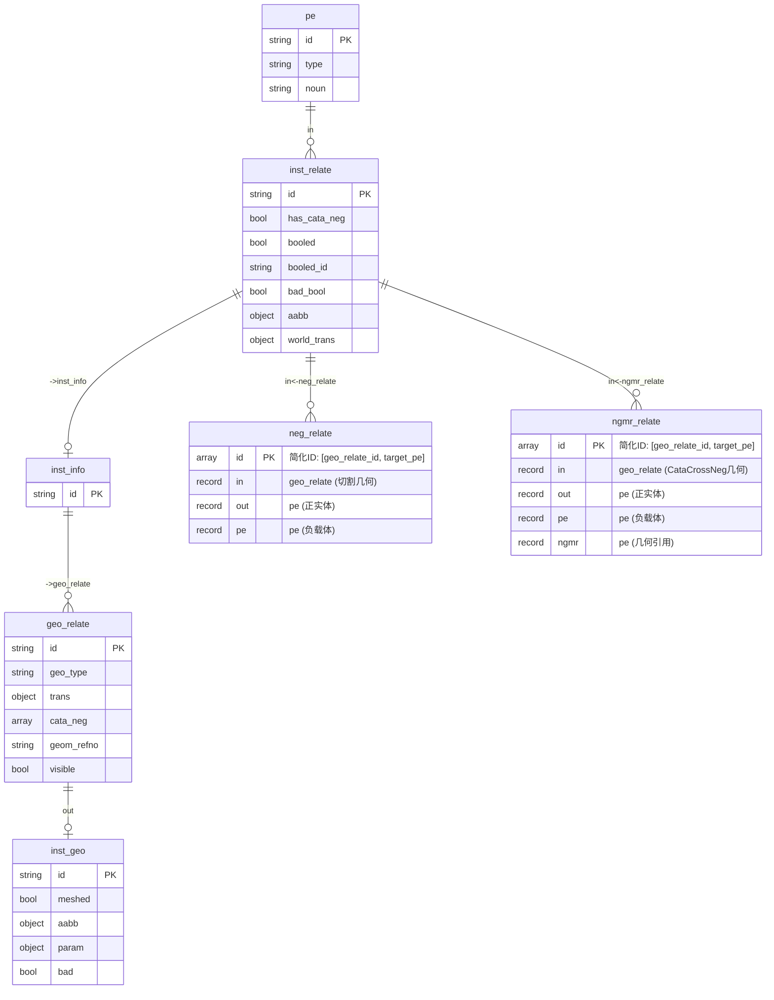

# 布尔运算数据模型

## 1. 核心数据结构

### 1.1 CataNegGroup（元件库布尔组）

```rust
/// 元件库负实体布尔运算组
pub struct CataNegGroup {
    /// 实例的参考号
    pub refno: RefnoEnum,
    /// inst_info 记录 ID
    pub inst_info_id: RecordId,
    /// 布尔运算组：[[正实体, 负实体1, 负实体2, ...], ...]
    pub boolean_group: Vec<Vec<RefnoEnum>>,
}
```

**说明**：

- `boolean_group[i][0]` = 正实体 refno
- `boolean_group[i][1..]` = 负实体 refno 列表

### 1.2 ManiGeoTransQuery（实例级布尔查询结果）

```rust
/// 实例级布尔运算查询结果
pub struct ManiGeoTransQuery {
    /// 实例参考号
    pub refno: RefnoEnum,
    /// 版本号（用于增量更新）
    pub sesno: u32,
    /// NOUN 类型
    pub noun: String,
    /// 世界变换矩阵
    pub wt: PlantTransform,
    /// 包围盒
    pub aabb: PlantAabb,
    /// 正实体列表：[(geo_id, transform), ...]
    pub ts: Vec<(RecordId, PlantTransform)>,
    /// 负实体分组：[(neg_refno, neg_transform, [NegInfo, ...]), ...]
    pub neg_ts: Vec<(RefnoEnum, PlantTransform, Vec<NegInfo>)>,
}
```

### 1.3 NegInfo（负实体信息）

```rust
/// 负实体详细信息
pub struct NegInfo {
    /// 几何体 ID
    pub id: RecordId,
    /// 几何类型（Neg / CataCrossNeg）
    pub geo_type: String,
    /// 参数类型
    pub para_type: String,
    /// 局部变换矩阵
    pub trans: PlantTransform,
    /// 包围盒（可选）
    pub aabb: Option<PlantAabb>,
}
```

### 1.4 GmGeoData（几何体数据）

```rust
/// 几何体详细数据
pub struct GmGeoData {
    /// 几何体记录 ID
    pub id: RecordId,
    /// 几何体参考号
    pub geom_refno: RefnoEnum,
    /// 变换矩阵
    pub trans: PlantTransform,
    /// 几何参数
    pub param: PdmsGeoParam,
    /// 包围盒记录 ID
    pub aabb_id: RecordId,
}
```

## 2. 数据库表结构

### 2.1 表关系图



### 2.2 关键字段说明

| 表.字段 | 类型 | 说明 |
|---------|------|------|
| `inst_relate.has_cata_neg` | bool | 是否存在元件库负实体 |
| `inst_relate.booled` | bool | 元件库布尔是否完成 |
| `inst_relate.booled_id` | string | 实例级布尔结果 mesh_id |
| `inst_relate.bool_status` | string | 布尔状态：`Pending`/`Success`/`Failed` |
| `inst_relate.aabb` | record | 包围盒引用 `aabb:⟨hash⟩` |
| `geo_relate.geo_type` | string | 几何类型：Pos/Neg/Compound/CataCrossNeg |
| `geo_relate.cata_neg` | array | 元件库负实体 refno 列表 |
| `geo_relate.visible` | bool | 是否可见（参与布尔运算） |
| `geo_relate.trans` | record | 变换引用 `trans:⟨hash⟩` |
| `neg_relate.in` | record | **切割几何** `geo_relate:⟨id⟩` |
| `neg_relate.pe` | record | **负载体** `pe:⟨refno⟩` |
| `ngmr_relate.in` | record | **切割几何** `geo_relate:⟨id⟩` (CataCrossNeg) |
| `ngmr_relate.pe` | record | **负载体** `pe:⟨refno⟩` |
| `ngmr_relate.ngmr` | record | **几何引用** `pe:⟨geom_refno⟩` |
| `inst_geo.bad` | bool | 几何体是否无效 |

### 2.3 geo_type 枚举

| 值 | 说明 |
|----|------|
| `Pos` | 正实体 |
| `Neg` | 负实体 |
| `Compound` | 复合实体（需要合并） |
| `CataCrossNeg` | 交叉负实体（来自 ngmr_relate） |

## 3. 关系说明

### 3.1 neg_relate（负实体关系）- 新结构 (2024-12)

```sql
-- 新结构：in 直接指向切割几何 geo_relate
neg_relate {
    in: geo_relate:⟨xxx⟩,     -- 切割几何（geo_type="Neg"）
    out: pe:{target_refno},   -- 被切的正实体
    pe: pe:{neg_carrier},     -- 负载体（原来的 in）
    id: ['{geo_relate_id}', pe:{target_refno}]  -- 简化的唯一ID
}

-- 语义：in 的切割几何要从 out 中减去
-- 简化查询：直接获取切割几何
SELECT 
    in.out AS id,           -- inst_geo ID
    in.geo_type AS geo_type,
    in.trans.d AS trans,
    in.out.aabb.d AS aabb
FROM pe:{target}<-neg_relate
WHERE in.trans.d != NONE
```

**设计优点**：
- 一条关系直接指向一个切割几何，语义清晰
- 查询无需遍历 carrier -> inst_relate -> geo_relate
- ID 用 `[geo_relate_id, target_pe]` 保证唯一性

### 3.2 ngmr_relate（交叉负实体关系）- 新结构 (2024-12)

```sql
-- 新结构：in 直接指向切割几何 geo_relate
ngmr_relate {
    in: geo_relate:⟨xxx⟩,     -- 切割几何（geo_type="CataCrossNeg"）
    out: pe:{target_refno},   -- 被切的正实体
    pe: pe:{neg_carrier},     -- 负载体（原来的 in）
    ngmr: pe:{ngmr_geom_ref}, -- NGMR 几何引用（保留用于调试）
    id: ['{geo_relate_id}', pe:{target_refno}]
}

-- 用于跨元件的负实体引用（CataCrossNeg 类型）
-- 简化查询：
SELECT 
    in.out AS id,
    in.geo_type AS geo_type,
    in.trans.d AS trans,
    in.out.aabb.d AS aabb
FROM pe:{target}<-ngmr_relate
WHERE in.trans.d != NONE
```

### 3.3 旧结构参考（已废弃）

```sql
-- 旧 neg_relate 结构（已废弃）
neg_relate {
    in: pe:{neg_refno},      -- 负实体 PE
    out: pe:{target_refno},  -- 被减去的目标 PE
}
-- 问题：需要通过 carrier 遍历 inst_relate -> geo_relate 才能获取切割几何
```

## 4. 数据流向

```text
1. 数据收集阶段 (pdms_inst.rs)
   ├─ 收集 Neg/CataCrossNeg geo_relate 映射
   │   ├─ neg_geo_by_carrier: HashMap<RefnoEnum, Vec<u64>>  -- 按负载体收集 Neg geo_relate
   │   └─ cata_cross_neg_geo_map: HashMap<(RefnoEnum, RefnoEnum), Vec<u64>>  -- 按 (载体, geom_refno) 收集
   ├─ InstManager.insert_neg() 添加到 neg_relate_map
   └─ InstManager.insert_ngmr() 添加到 ngmr_neg_relate_map

2. 数据库写入阶段 (pdms_inst.rs)
   ├─ save_instance_data_optimize()
   ├─ 批量创建 neg_relate 关系
   │   └─ in = geo_relate:⟨id⟩, out = pe:⟨target⟩, pe = pe:⟨carrier⟩
   └─ 批量创建 ngmr_relate 关系
       └─ in = geo_relate:⟨id⟩, out = pe:⟨target⟩, pe = pe:⟨carrier⟩, ngmr = pe:⟨geom_ref⟩

3. 布尔运算查询阶段 (boolean_query_optimized.rs)
   ├─ query_manifold_boolean_operations_batch_optimized()
   │   ├─ 直接查询 pe:target<-neg_relate 获取 Neg 切割几何
   │   └─ 直接查询 pe:target<-ngmr_relate 获取 CataCrossNeg 切割几何
   └─ 返回 ManiGeoTransQuery（包含正几何和切割几何列表）

4. 布尔运算执行阶段 (manifold_bool.rs)
   ├─ load_manifold() 加载正/负几何体
   ├─ batch_boolean_subtract() 执行减法
   ├─ 保存结果 mesh 并计算 AABB
   └─ 更新 inst_relate: bool_status='Success', booled_id='{mesh_id}', aabb=aabb:⟨hash⟩
```
