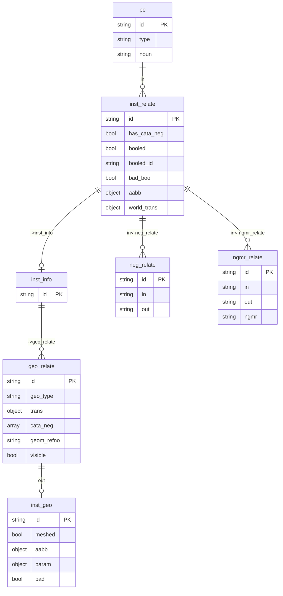

# 布尔运算数据模型

## 1. 核心数据结构

### 1.1 CataNegGroup（元件库布尔组）

```rust
/// 元件库负实体布尔运算组
pub struct CataNegGroup {
    /// 实例的参考号
    pub refno: RefnoEnum,
    /// inst_info 记录 ID
    pub inst_info_id: RecordId,
    /// 布尔运算组：[[正实体, 负实体1, 负实体2, ...], ...]
    pub boolean_group: Vec<Vec<RefnoEnum>>,
}
```

**说明**:
- `boolean_group[i][0]` = 正实体 refno
- `boolean_group[i][1..]` = 负实体 refno 列表

### 1.2 ManiGeoTransQuery（实例级布尔查询结果）

```rust
/// 实例级布尔运算查询结果
pub struct ManiGeoTransQuery {
    /// 实例参考号
    pub refno: RefnoEnum,
    /// 版本号（用于增量更新）
    pub sesno: u32,
    /// NOUN 类型
    pub noun: String,
    /// 世界变换矩阵
    pub wt: PlantTransform,
    /// 包围盒
    pub aabb: PlantAabb,
    /// 正实体列表：[(geo_id, transform), ...]
    pub ts: Vec<(RecordId, PlantTransform)>,
    /// 负实体分组：[(neg_refno, neg_transform, [NegInfo, ...]), ...]
    pub neg_ts: Vec<(RefnoEnum, PlantTransform, Vec<NegInfo>)>,
}
```

### 1.3 NegInfo（负实体信息）

```rust
/// 负实体详细信息
pub struct NegInfo {
    /// 几何体 ID
    pub id: RecordId,
    /// 几何类型（Neg / CataCrossNeg）
    pub geo_type: String,
    /// 参数类型
    pub para_type: String,
    /// 局部变换矩阵
    pub trans: PlantTransform,
    /// 包围盒（可选）
    pub aabb: Option<PlantAabb>,
}
```

### 1.4 GmGeoData（几何体数据）

```rust
/// 几何体详细数据
pub struct GmGeoData {
    /// 几何体记录 ID
    pub id: RecordId,
    /// 几何体参考号
    pub geom_refno: RefnoEnum,
    /// 变换矩阵
    pub trans: PlantTransform,
    /// 几何参数
    pub param: PdmsGeoParam,
    /// 包围盒记录 ID
    pub aabb_id: RecordId,
}
```

## 2. 数据库表结构

### 2.1 表关系图



### 2.2 关键字段说明

| 表.字段 | 类型 | 说明 |
|---------|------|------|
| `inst_relate.has_cata_neg` | bool | 是否存在元件库负实体 |
| `inst_relate.booled` | bool | 元件库布尔是否完成 |
| `inst_relate.booled_id` | string | 实例级布尔结果 mesh_id |
| `inst_relate.bad_bool` | bool | 布尔运算失败标记 |
| `inst_relate.aabb.d` | object | 包围盒数据（用于判断 mesh 是否就绪） |
| `geo_relate.geo_type` | string | 几何类型：Pos/Neg/Compound/CataCrossNeg |
| `geo_relate.cata_neg` | array | 元件库负实体 refno 列表 |
| `geo_relate.visible` | bool | 是否可见（参与布尔运算） |
| `inst_geo.bad` | bool | 几何体是否无效 |

### 2.3 geo_type 枚举

| 值 | 说明 |
|----|------|
| `Pos` | 正实体 |
| `Neg` | 负实体 |
| `Compound` | 复合实体（需要合并） |
| `CataCrossNeg` | 交叉负实体（来自 ngmr_relate） |

## 3. 关系说明

### 3.1 neg_relate（负实体关系）

```sql
-- 结构
neg_relate {
    in: pe:{neg_refno},      -- 负实体 PE
    out: pe:{target_refno},  -- 被减去的目标 PE
    id: ["{neg_refno}", index]
}

-- 语义：in 的负实体要从 out 中减去
-- 查询目标的所有负实体：
SELECT in FROM neg_relate WHERE out = pe:{target}
```

### 3.2 ngmr_relate（交叉负实体关系）

```sql
-- 结构
ngmr_relate {
    in: pe:{neg_refno},      -- 负实体 PE
    out: pe:{target_refno},  -- 被减去的目标 PE
    ngmr: pe:{ngmr_pe}       -- NGMR 类型元素
}

-- 用于跨元件的负实体引用
```

## 4. 数据流向

```text
1. 数据收集阶段
   ├─ collect_descendant_filter_ids() 查找负实体
   ├─ InstManager.insert_neg() 添加到 neg_relate_map
   └─ InstManager.insert_ngmr() 添加到 ngmr_neg_relate_map

2. 数据库写入阶段 (pdms_inst.rs)
   ├─ save_instance_data_optimize()
   ├─ 批量创建 neg_relate 关系
   └─ 批量创建 ngmr_relate 关系

3. 布尔运算查询阶段
   ├─ query_cata_neg_boolean_groups()  →  CataNegGroup
   └─ query_manifold_boolean_operations()  →  ManiGeoTransQuery

4. 布尔运算执行阶段
   ├─ load_manifold() 加载几何体
   ├─ batch_boolean_subtract() 执行减法
   └─ 保存结果并更新数据库标记
```
