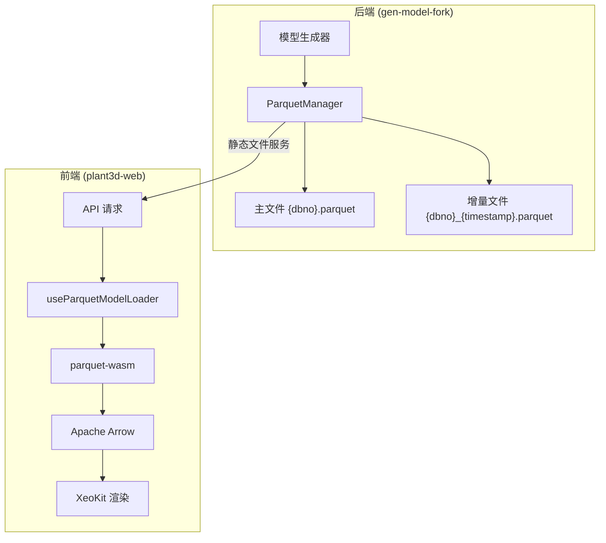
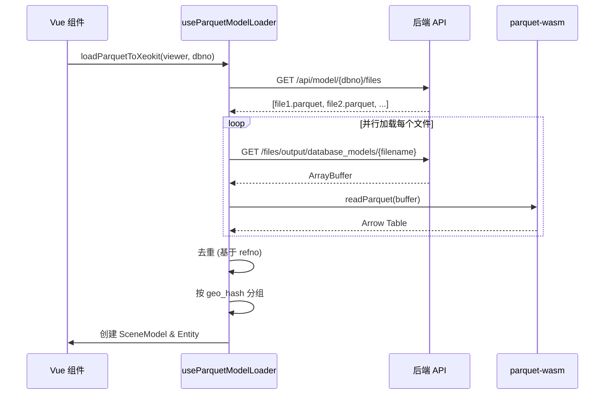

# Parquet 模型数据存储实现说明文档

## 概述

本项目使用 Apache Parquet 作为模型实例数据的持久化存储格式，替代原有的 JSON Bundle 模式。Parquet 是一种列式存储格式，具有高效压缩、快速查询和良好的跨语言支持等优势。

---

## 架构设计

### 核心理念



### 文件组织结构

```
output/
└── database_models/
    ├── {dbno}.parquet                    # 主文件（已合并的完整数据）
    ├── {dbno}_YYYYMMDD_HHMMSS.parquet   # 增量文件（按时间戳命名）
    └── ...
```

---

## 后端实现

### 核心模块

| 模块 | 路径 | 说明 |
|------|------|------|
| `parquet_writer.rs` | `src/fast_model/export_model/parquet_writer.rs` | Parquet 写入与管理核心模块 |
| `export_prepack_lod.rs` | `src/fast_model/export_model/export_prepack_lod.rs` | LOD 数据预打包导出 |

### ParquetManager 类

主要管理器类，负责 Parquet 文件的读写和管理。

```rust
pub struct ParquetManager {
    base_dir: PathBuf,  // 基础输出目录
}
```

#### 核心方法

| 方法 | 签名 | 功能 |
|------|------|------|
| `new` | `fn new(base_dir: impl AsRef<Path>) -> Self` | 创建管理器实例 |
| `write_incremental` | `fn write_incremental(&self, data: &ExportData, dbno: u32) -> Result<PathBuf>` | 增量写入新数据 |
| `list_all_files` | `fn list_all_files(&self, dbno: u32) -> Result<Vec<PathBuf>>` | 列出所有相关文件 |
| `list_parquet_files` | `fn list_parquet_files(&self, dbno: u32) -> Result<Vec<String>>` | 获取文件名列表 |
| `check_existence` | `fn check_existence(&self, dbno: u32, refnos: &[String]) -> Result<Vec<String>>` | 检查 refno 是否已存在 |

### 数据 Schema

每行数据代表一个模型实例，包含以下列：

| 列名 | 类型 | 说明 | 示例 |
|------|------|------|------|
| `refno` | String | 唯一标识符 | `"24383_73962"` |
| `noun` | String | 节点类型 | `"BRAN"`, `"EQUI"`, `"TUBI"` |
| `geo_hash` | String | 几何体哈希（关联 GLB 文件） | `"a1b2c3d4..."` |
| `is_tubi` | Boolean | 是否为管道直段 | `true`/`false` |
| `owner_refno` | String (可空) | 父节点引用号 | `"24383_12345"` |
| `t0` - `t15` | Float32 | 4x4 变换矩阵（列优先） | 16 个浮点数 |

#### InstanceRow 结构体

```rust
pub struct InstanceRow {
    pub refno: String,
    pub noun: String,
    pub geo_hash: String,
    pub transform: [f32; 16],
    pub aabb: Option<[f32; 6]>,
    pub is_tubi: bool,
    pub owner_refno: Option<String>,
}
```

### 依赖库

- **polars**: DataFrame 操作与 Parquet 读写
- **chrono**: 时间戳生成（用于增量文件命名）
- **glam**: 矩阵运算

```toml
# Cargo.toml 相关依赖
polars = { version = "...", features = ["parquet"] }
chrono = "..."
glam = "..."
```

---

## 前端实现

### 核心模块

| 模块 | 路径 | 说明 |
|------|------|------|
| `useParquetModelLoader.ts` | `plant3d-web/src/composables/useParquetModelLoader.ts` | Parquet 加载器 Composable |
| `useModelGeneration.ts` | `plant3d-web/src/composables/useModelGeneration.ts` | 模型生成触发与加载 |

### 技术栈

- **parquet-wasm**: WebAssembly Parquet 解析器
- **apache-arrow**: Arrow 格式数据处理
- **@xeokit/xeokit-sdk**: 3D 渲染引擎

### 加载流程



### 关键函数

#### `useParquetModelLoader()`

| 方法 | 功能 |
|------|------|
| `listParquetFiles(dbno)` | 获取文件列表 |
| `loadParquetFile(url)` | 加载单个 Parquet 文件 |
| `loadAllParquetFiles(dbno)` | 加载指定 dbno 的所有文件 |
| `groupByGeoHash(rows)` | 按几何哈希分组 |
| `deduplicateRows(rows)` | 去重（后加载的文件优先） |

---

## API 接口

### 获取文件列表

```
GET /api/model/{dbno}/files
```

**响应**:
```json
["1112.parquet", "1112_20251222_103045.parquet"]
```

### 静态文件服务

```
GET /files/output/database_models/{filename}
```

---

## 增量生成策略

详细方案参考：[增量Parquet生成与合并方案.md](./增量Parquet生成与合并方案.md)

### 核心策略

1. **主文件 + 增量文件**：避免每次写入都读取全量数据
2. **异步合并**：后台进程定期将增量文件合并到主文件
3. **前端联合加载**：同时读取主文件和未合并的增量文件
4. **去重逻辑**：基于 refno，后加载的文件覆盖先加载的

### 文件命名规范

| 类型 | 格式 | 示例 |
|------|------|------|
| 主文件 | `{dbno}.parquet` | `1112.parquet` |
| 增量文件 | `{dbno}_{YYYYMMDD}_{HHMMSS}.parquet` | `1112_20251222_103045.parquet` |

---

## 性能优势

| 对比项 | JSON Bundle | Parquet |
|--------|-------------|---------|
| 文件大小 | 大（文本格式） | 小（列式压缩） |
| 解析速度 | 慢（全文解析） | 快（列式读取） |
| 增量更新 | 需完整重写 | 仅追加新文件 |
| 查询效率 | 全量加载 | 按列选择性加载 |

---

## 代码示例

### 后端：写入增量数据

```rust
let manager = ParquetManager::new("output");
let export_data: ExportData = /* 生成的模型数据 */;
let path = manager.write_incremental(&export_data, dbno)?;
println!("写入: {}", path.display());
```

### 前端：加载并渲染

```typescript
import { loadParquetToXeokit } from '@/composables/useParquetModelLoader'

const { sceneModel, instanceCount } = await loadParquetToXeokit(
    viewer,
    1112,  // dbno
    { debug: true }
)
console.log(`加载了 ${instanceCount} 个实例`)
```

---

*文档更新时间: 2025-12-22*
